# Brent Ozar Course Notes
<style>
r { color: red }
o { color: Orange }
g { color: Green }
lg { color: lightgreen }
b { color: Blue }
lb { color: lightblue }
</style>

* Initial Training  Page
  
  https://training.brentozar.com/courses/
  https://www.brentozar.com/training/think-like-sql-server-engine/

  YouTube
  https://www.youtube.com/watch?v=SMw2knRuIlE

---

# 1. Think like the SQL Server engine

* Index
  - [Intro](#Intro)
  - [NonCluster Index](#NonCluster-Index)
  - [Key lookups](#Key-lookups)
  - [The tipping point](#The-tipping-point)
  - [How the engine chooses between plans](#How-the-engine-chooses-between-plans)
  - [Cost-based query optimization](#Cost-based-query-optimization)
  - [How statistics come into play](#How-statistics-come-into-play)
  - [How your query syntax affects all this](#How-your-query-syntax-affects-all-this)
  - [How included columns mitigate these problems](#How-included-columns-mitigate-these-problems)
  - [Recap Study](#Recap-Study)
  
---

## Intro

- Notes
  - 8k pages are the minin unit 

  - In a perfect world
    - Your query is easy to understand
    - The data you want is only on one page
    - SQL Server knows exactly which page it is
    - SQL Server has that page cached, and can jump to exactly that page
    - SQL Server can read the data out as-is, without doing any additional manipulation

  - But often in our world
    - Your query is not easy to understand
    - The data you want is spread across many pages
    - SQL Server doesn’t know exactly which pages it is
    - SQL Server doesn’t have that page cached, and has to read the data from storage
    - SQL Server has to do a bunch of work on the data, like summing, grouping, joining, and ordering

  - How to Think Like the Engine
    - Guess which row(s) the query wants
    - Guess which page(s) have those rows
    - Guess what will be the most efficient way to get ‘em: often there are multiple copies of rows, aka indexes
    - Guess which tables should be processed first
    - Guess how much resources we should allocate
    - In this class, we’ll keep it simple, but this goes deep

- Note

<r>Rob Farley from New Zeland blogger</r>

- Logical Reads: The number of 8k pages we read. e.g 7405 x 8kb = 59MB

  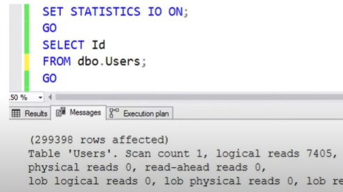

- In my case using [StackOverflow2013] the conclusion is:
  Table 'Users'. Scan count 1, logical reads 44530
  - Table has 2.465.713 millon records
	- Table has 44.530 pages
	- One RESMA has 500 pages so the [dbo].[Users] table has 89 RESMAS with a total size of 347 MB
   
  ```sql
  -- This is an interesting query to know a little more about the table
  SELECT 
       44530        AS [Pages]
    , (44530 / 500) AS [Resmas]
    , (44530 * 8)   AS [Sizing KB]
    , (44530 * 8)/1024 AS [Sizing MB]
  ```
 
- Example I: If you have to resolve the below query, how do you execute that one? In simple english word.
```sql
SELECT [Id] 
FROM   [dbo].[Users]
WHERE  [LastAccessDate] > '2014/07/01'
```
Answer:
* Check if you have an Index that you can use
* Use IX on PK for [dbo].[Users] table
* Go into the first row of the index
* If [LastAccessDate] value is grater than '2014/07/01' return the [Id] if not go on ...
* So I will execute an Cluster Index Scan on the PK to retun all the [LastAccessDate] > '2014/07/01'
    
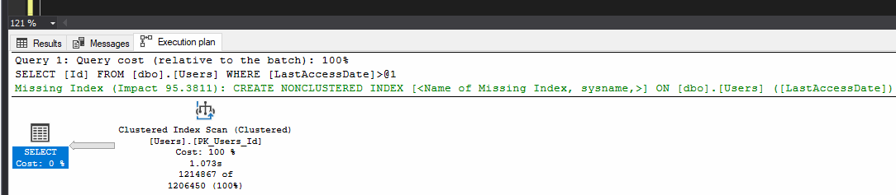
    
Lesson:

<r>Using WHERE without a matching index means scanning all the data. (And there are some extra reads when queries go parallel)</r>

- Query Bucks

  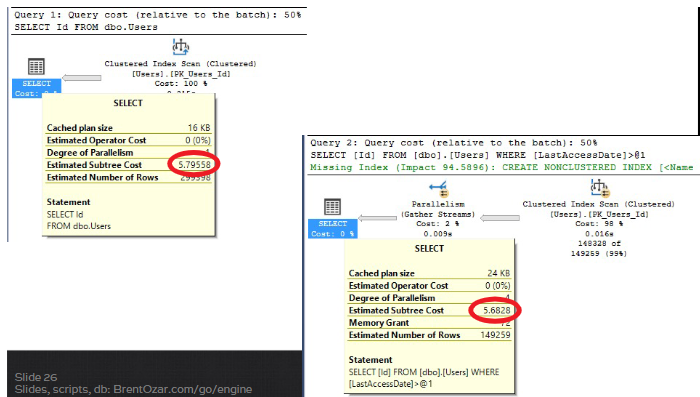
  
  Lesson:
  These days, it’s just a set of hard-coded cost estimates around CPU & IO work requirements – it isn’t really tied to time at all

  To read:
  https://brentozar.com/go/querybucks

- Example II: If you have to resolve the below query, how do you execute that one? In simple english word.
```sql
SELECT [Id] 
FROM   [dbo].[Users]
WHERE  [LastAccessDate] > '2014/07/01'
ORDER BY [LastAccessDate]
```

Answer:
* Check if you have an Index that you can use
* Go into the first row of the index or heap (if you don't have an index)
* If [LastAccessDate] column is grater than '2014/07/01' return the [Id] and [LastAccessDate] if not go on ...
* So I will execute a Cluster Index Scan on the PK
* Order by the [Id] by [LastAccessDate]
* Return the [Id]
    
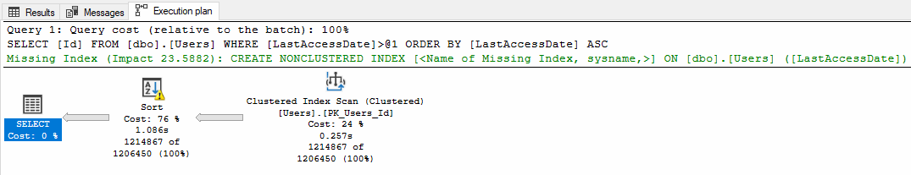
    
Lesson: N/A

- Memory Grant Notes

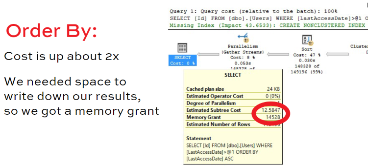

You can see more info on the Properties

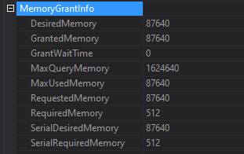

DesiredMemory : Estimate Memory Used
GrantedMemory : 
MaxQueryMemory: By default is 25% of server memory

Lesson:
- Memory is set when query starts and not revised. SQL has to assumed that other peoples are going to use memory too.

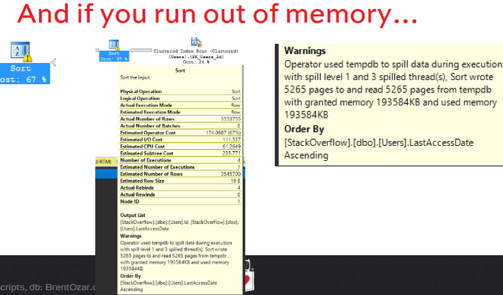

- If SQL run out of memory split into TEMPDB

- Example III: How do you execute this? In simple english word.
  ```sql
  SELECT <r>*</r> 
  FROM   [dbo].[Users]
  WHERE  [LastAccessDate] > '2014/07/01'
  ORDER BY [LastAccessDate] 
  ```

  Answer:
  * Check if you have an Index that you can use  
  * Use IX on PK
  * Go into the first row of the index or heap (if you don't have an index)
  * If [LastAccessDate] column is grater than '2014/07/01' return <r>ALL THE COLUMNS</r> if not go on ...
  * So I will execute an Cluster Index Scan on the PK
  * Order by the [Id] by [LastAccessDate]

  That query suck But why does it suck?
    Do we work harder to read the data?
    Do we work harder to write the data?
    Do we work harder to sort the data?
    Do we work harder to output the data?

    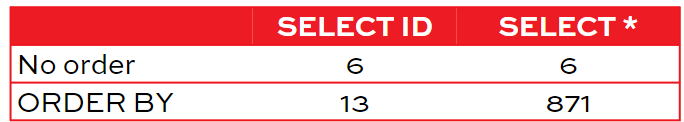

Lesson:
  - Sorting data is expensive, and more fields make it worse
  - SQL Server caches data pages, not query output

Recap

<lg>- SET STATISTICS IO ON: shows # of 8KB pages read</lg>

<lg>- SET STATISTICS TIME ON: shows CPU work done</lg>

<lg>- WHERE without a supporting index: table scan</lg>

<lg>- ORDER BY without a supporting index: CPU work</lg>

<lg>- SQL Server caches pages, not query results</lg>


## NonCluster Index

- Are literally a copy of the table.
- Deletes and inserts now have to do twice the writes
- Updates only affect copies that have the column being updated

- Create the following index

  ```sql
  CREATE INDEX IX_LastAccessDate_ID
  ON dbo.Users(LastAccessDate, ID)
  ```

- Example IV:

Say we run this update query

  ```sql
  UPDATE dbo.Users
  SET Age = Age + 1
  WHERE DisplayName = 'Brent Ozar’
  ```

Age isn’t on this index, so we don’t have to touch it. In theory:

<r>- Don’t index hot columns<r>

<r>- The more frequently a column changes, the more we’ll have to write to storage.<r>

<r>- In theory, we make people go to the clustered index if they want a hot column.<r>

<r>- In practice, we may have to make compromises. The faster your storage is, and the less writes you’re doing, 
  the easier it is to make those compromises.<r>

<r>- In theory, less indexes are good. You want as few indexes as possible in order to support your workload.

<r>No indexes:</r>

  <r>- Every SELECT scans tables.</r>

<r>Too many indexes:</r>
  <r>- D/U/I queries do too many writes.</r>


- Example V: How do you execute this? In simple english word.

  ```sql
  SELECT [Id]
  FROM   [dbo].[Users]
  WHERE  [LastAccessDate] > '2014/07/01'
  ORDER BY [LastAccessDate] 
  ```

Answer:
 * Using the new Non Cluster IX [IX_LastAccessDate_ID]
 * Dive bomb directly into the first row that the [LastAccessDate] column is > '2014/07/01'
 * Return the [ID] column
 * So I will execute an Index Seek
 * I am not going to execute the order by because the data is already order on the index

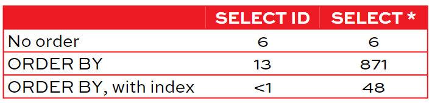

Lesson:

Recap:

  <lg>- In theory, don’t index hot columns.
    The more frequently a column changes, the more we’ll have to write to storage.</lg>

  <lg>- In theory, we make people go to the clustered index if they want a hot column.

  <lg>- In theory, less indexes are good. You want as few indexes as possible in order to support your workload.

  <lg>- No indexes:
    Every SELECT scans tables.

  <lg>- Too many indexes:
    D/U/I queries do too many writes.

  <lg>- Seek vs Scan</lg>

  <lg> Seek means:
      “I’m going to jump to a row and start reading.”</lg>

  <lg>  Scan means:
      “I’m going to start at either end of the object (might be either the start, or the end)
      and start reading.” </lg>

  <lg>Neither term defines how many rows will be read</lg>

## Key lookups and The tipping point

- Key Lookups
  - the cost of the key lookup are on the LOGICAL READS
  - About 3 Logical Reads per records. That is because they need to navigate a tree structure of pages to find exactly the right page that has the data.

- Create the following index

  ```sql
  CREATE INDEX IX_LastAccessDate_ID
  ON dbo.Users(LastAccessDate, ID)
  ```

- Exaple VI: How do you execute this? In simple english word.
  ```sql
  SELECT [Id], [DisplayName], [Age]
  FROM   [dbo].[Users]
  WHERE  [LastAccessDate] > '1800/07/01'
  ORDER BY [LastAccessDate]
  ```
    
Answer:
* Option 1 KEY LOOK UP
  * Use the new Non Cluster IX to Dive bomb directly into the first row where the [LastAccessDate] column is > '2014/07/01'
  * Key Lookup of PK to bring [DisplayName], [Age]
  * So I will execute an Index Seek + Kee Lookup
  * I am not going to execute the order by because the data is already order on the index
  * SELECT ID, [DisplayName], [Age]

* Option 2 TIPPING POINT
  * Use IX on PK
  * Go into the first row
  * If [LastAccessDate] column is grater than '2014/07/01' return [Id], [DisplayName] and [Age] if not go on ...
  * So I will execute an Cluster Index Scan on the PK
  * Order by [LastAccessDate]
    
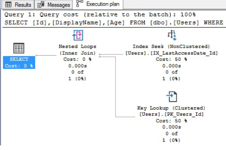

- That’s why SQL includes the key. SQL Server always includes your clustering keys whether you ask for ‘em or not because it has to join 
indexes together.

<r>Classic index tuning sign</r>

<r>Key lookup is required when the index doesn’t have all the fields we need. Hover your mouse over the key lookup, look for the OUTPUT.</r>

<r>Small fields? Frequently used? Add ‘em to the index</r>

- Should columns go in the Key or in the INCLUDE?
as long as the first column or two are fairly unique, the sorting of the third, fourth, firth, etc keys on an index don't matter mearly as much as the first column or two in the key.
This is one of the many reasons why folks often suggest that the first and second keys on an index should be very selective. They should help you quicly narrow down your search space.

## Tipping point

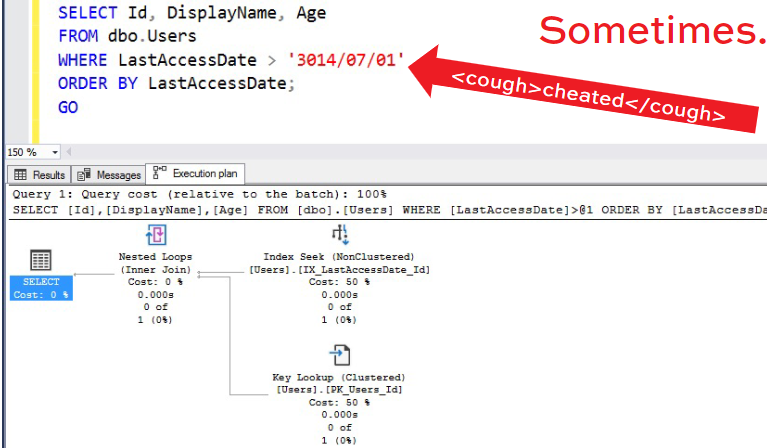


- Even with an index, there’s a tipping point where it’s more efficient to scan the table.Learn more about the tipping point: 
https://BrentOzar.com/go/tipping
https://www.brentozar.com/archive/2019/10/how-to-think-like-the-sql-server-engine-whats-the-tipping-point/

Note
 - Check [More Resource] folder

Lesson:
- Even with an index, there is a tipping point where it's more efficient to scan the  table (This it the tipping point)
  
- Decisions, decisions
  * Table scan:
    • Fixed, known cost to read all the pages
    • Doesn’t matter how many rows match our filter

  * Index seek + key lookups:
    • Variable, unknown cost
    • The initial seek is cheap, but...
    • The key lookup is done once for every row we find
    • For a lot of rows, this is worse than a table scan

  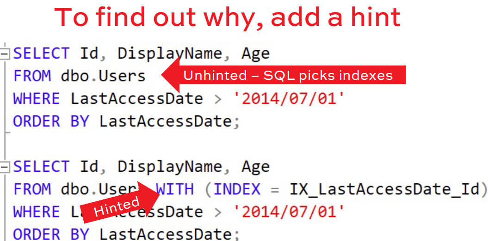
  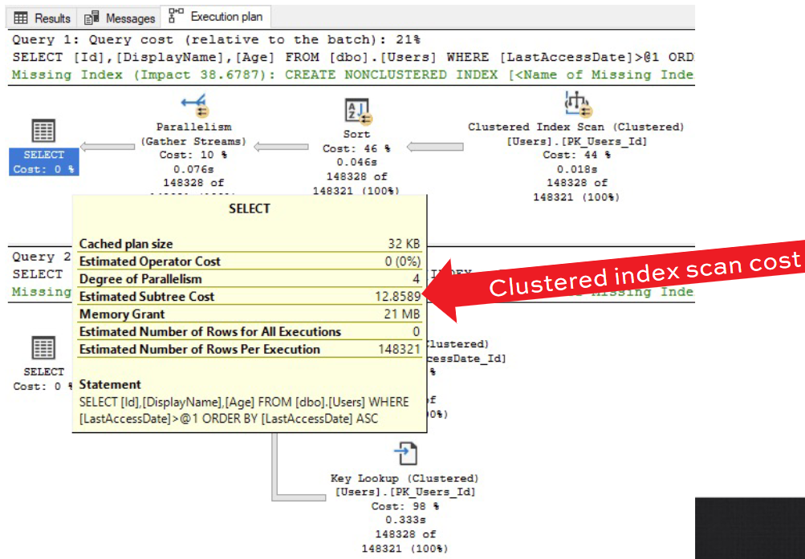
  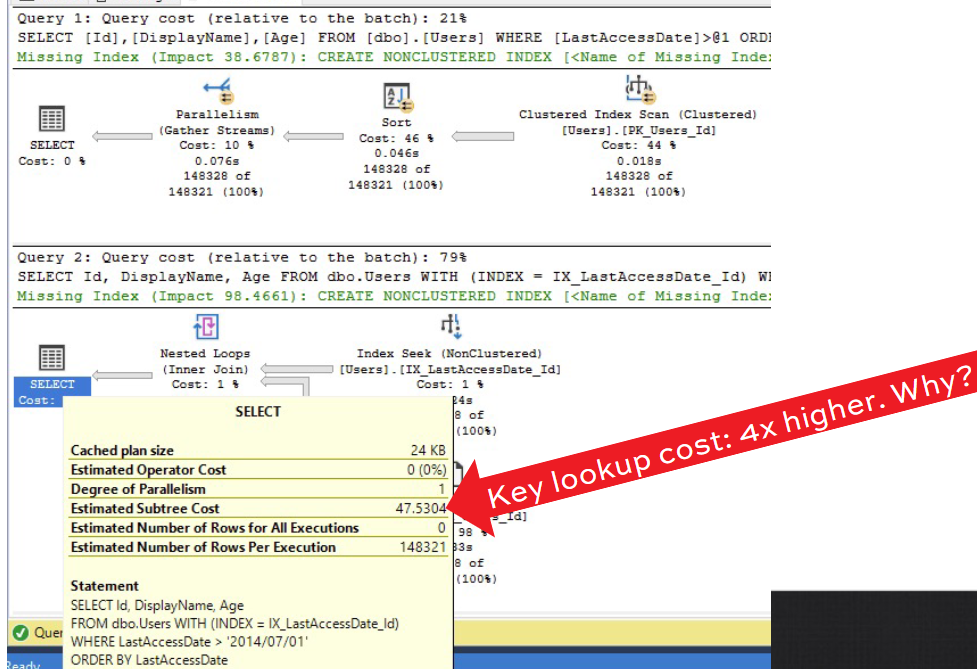

## Cost-based query optimization

  * Cost-Based Optimizar
    1. Build a plan
    2. Sum up the cost of all its operators
    3. Is there another possible plan? If so, go back to step 1 and build that too
    4. Out of everything we built, go with the lowest-cost plan.

We are simplifying a lot. Sometimes a query is trivially simple, sometimes the costs are so cheap, SQL Server stops building more plans,
and goes with a good-enough plan. Sometimes building a plan takes so long that SQL Server calls timeout , runs a plan as-is.

Note
 - See [MoreResources] folder


## How statistics come into play

  * Statistics help the engine to:
    - Decide which index to use
    - What order to process tables/indexes in
    - Whether to do seeks or scans
    - Guess how many rows will match your query
    - How much memory to allocate for the query

  * Command to see stats
    DBCC SHOWSTATISTICS('schema.table', 'index')

  * How the engine uses statistics
  ```sql
  SELECT Id, DisplayName, Age
  FROM dbo.Users
  WHERE LastAccessDate > '2014/07/01'
  ORDER BY LastAccessDate
  ```
  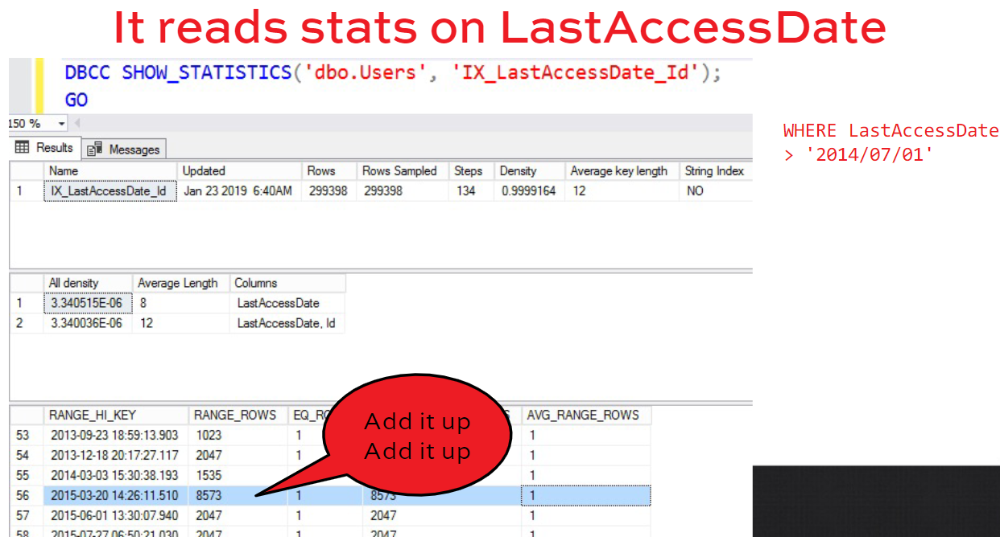
  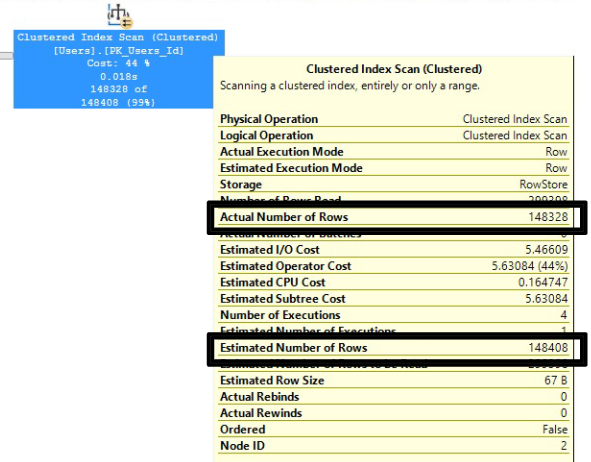
  
  In this case, stats worked great!. We had statistics on the LastAccessDate column. The statistics were up to date and accurately sampled
  Our query was easy to understand:WHERE LastAccessDate > '2014/07/01’. We were using the date column contents as-is,
  not running calculations on it

Note
 - Read [MoreResource] folder  

    
## How your query syntax affects all this
  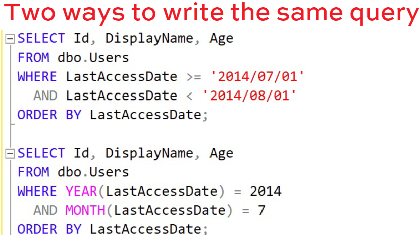

  Both produce 728 rows, but...

  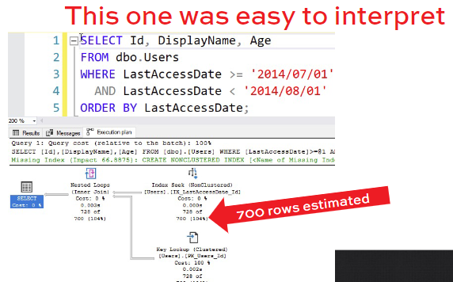

  But

  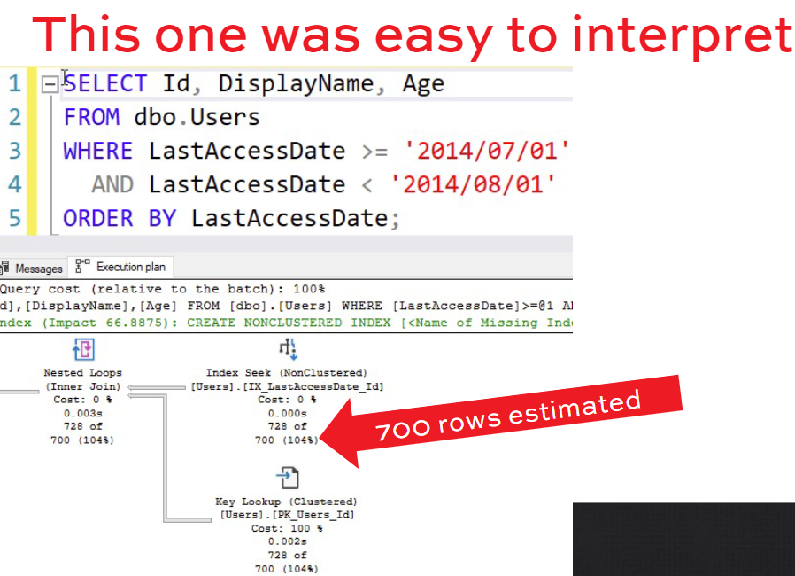

  And

  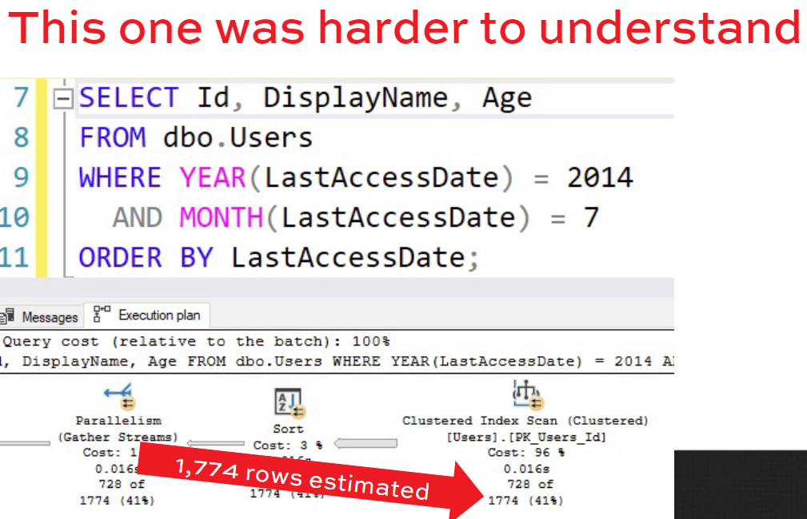

  To see the overhead of the sort
  - SET STATISTICS IO ON
  shows logical reads

  - SET STATISTICS TIME ON
  shows CPU and elapsed time
  
  - SET STATISTICS IO, TIME ON
  shows both

  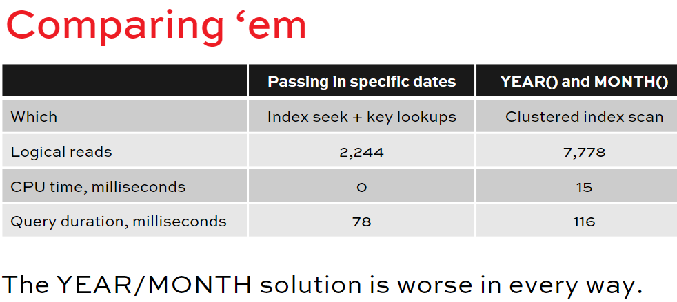

  **The simpler your syntax, the better your queries run**

Recap
 - Key lookup: the query wanted more columns than we had in the nonclustered index
 - The tipping point: when SQL thinks it’s more efficient to scan a table instead of all those key lookups
 - Cost-based optimization: how plans are chosen
 - The simpler your syntax, the more accurate the costs, and the better the plan  


## How included columns mitigate these problems

  - To avoid the Key Look up add the columns to the Index

  ```sql
  CREATE INDEX IX_LastAccessDate_Id_DisplayName_Age
  ON dbo.Users (LastAccessDate, Id, DisplayName, Age)
  ```

  The good news: even the “bad” query uses it (using the SELECT of the point above)
  The bad news: it’s physically larger. Because this index has more data in it, it’s physically larger in memory and on disk. It takes more 8KB pages to store the same # of rows.

  Lesson:
  * The more indexes you have, and the more columns they have...
    - The more space they take up in memory (the less other objects you can cache)
    - The more space they take up on disk (on your primary and all of the replicas, too)
    - The longer your backups, restores, CHECKDB take
    - The longer D/U/I operations take
    - The longer index maintenance takes

  * Warning signs
    - You might have too many indexes if:
      • People complain about slow inserts & deletes
      • Monitoring tools warn about blocking, deadlocks
      • Big database size is a problem

    - You might not have enough if:
      • People complain about slow selects (but not inserts & deletes)
      • You can cache a lot of the database in memory

  * Possible workaround: INCLUDES
    - Some folks will say to INCLUDE columns in an index.
    - INCLUDES aren’t part of the key, they say.
    - It might help you cover more columns without increasing the index size. But both indexes are almost exactly the same size:

      ```sql
      CREATE INDEX IX_LastAccessDate_Id_Includes
      ON dbo.Users (LastAccessDate, Id)
      INCLUDE (DisplayName, Age)
      ```

      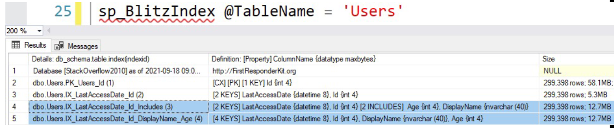

  * Key vs include isn’t that important.
    - As long as your first column or two are kinda unique, then the rest of the keys don’t matter as much.
    - There are indeed edge cases where they matter.
    - But just focus on these, and you can go a long way:
      • The order of the first 1-2 columns
      • The columns that you need on the index (whether they’re in the key or the includes doesn’t matter as much as just having them)
    - Generally speaking
      • Columns in WHERE/GROUP/JOIN/ORDER: often good candidates for the index keys.
      • Columns in the SELECT: good candidates to INCLUDE in an index.

Recap
  - Less columns, less benefit: queries usually need more than just 1-2 columns.
  - More columns, more problems: bigger indexes, longer maintenance jobs, blocking.
  - Included columns aren’t magically delicious and free


## Recap Study

- WHERE
  Clause whiout a supporting index = TABLE SCAN
- ORDER BY
  Clause whiout a supporting index = CPU WORK
- INDEX
  Are literally a copy of the table
- SEEK
  Means you jump to one area and start reading but you don't know the end
- SCAN
  Means you start at either the end or the start of the ix, and start reading
- IX COLUMN
  Don't index hot columns. The more frequently a column change, the more we will have to write to storage
- AMOUNT OF INDEX
  Less IX are good.
  Too many D/U/I to do many writes and slow down.
- KEY LOOKUP
  The query wanted more columns that we had in the IX
- TIPPING POINT
  When the SQL thinks that it's more efficient to scan a table instead of all those key lookups
- COST BASED
  How plan are chosen
- MANY IX
  You have to many indexes if:
  - People complaint about slow INSERT and DELETE
  - monitoring tools warm about blocking and Locks
  - Big database size is a problem
- NOT ENOUGH IX
  - If people complan about slow SELECT
  - You can cache a lot of database in memory
- KEY vs INCLUDE
  As long as your first column or two are kinda unique the rest of the keys don't matter as much
  Generally speacking:
  - Columns in WHERE - JOIN - GROUP BY - ORDER ofter are good candidate for KEY
  - Columns in SELECT ofter are food condidate for INCLUDE
