# Brent Ozar Course Notes

* Initial Page  
  YouTube
  https://www.youtube.com/watch?v=dAcOtWaT3sg&list=PLDYqU5RH_aX05ajDAH-6sYXr4i1Mjh9lT&index=11
 
  More Ref
  https://www.sqlshack.com/unrevealed-tips-of-sql-server-statistics/
  https://www.brentozar.com/archive/category/development/statistics/

---
# 1. Upate Stats

* Index
  - [Intro](#Intro)
  - [Why good row estimates matter](#Why-good-row-estimates-matter)
  - [Getting to know statistics](#Getting-to-know-statistics)
  - [Multiple Single-Column Statistics](#Multiple-Single-Column-Statistics)
  - [What is the cardinality estimation?](#What-is-the-cardinality-estimation?)
  - [Multi-Column Statistics](#Multi-Column-Statistics)
  - [Filtered Statistics](#Filtered-Statistics)
  - [The ascending Key Problem](#The-ascending-Key-Problem)
  - [10 Rules to Managing statistics](#10-Rules-to-Managing-statistics)
  - [Scans, Seeks and Sargability](#Scans-,-Seeks-and-Sargability)
  - [How execution plans are made](#How-execution-plans-are-made)
  - [This is the operator speaking... Part 1](#This-is-the-operator-speaking-...-Part-1)
---

## Intro
- Notes 
  - When SQL Update the Statistics? When the 20% of the table changed
  - Update stats improve the performance more than execute a REBUILD
  - 

- Questions
  - I don't understand the [All density] column fo a Convination of Columns

- Lesson:
  - Stats aren't indexes, they only contain limite medatada
  - As your data changes, your stats don't. keep up in real time
  - Even if you update stats constantly, outliers cause issues

## Why good row estimates matter
```sql
SET STATISTICS TIME, IO ON

DECLARE @P1 INT = 0;
SELECT PostTypeID FROM dbo.Posts
WHERE LastEditorUserId = @P1;

DECLARE @P1 INT = 238;
SELECT PostTypeID FROM dbo.Posts
WHERE LastEditorUserId = @P1;
```

- NOTES
  - I would like to know from where the Engine calculate the numer 356 on the execution plan for the first query
  
  It's the same on the second query and execution plan

  - If I add OPTION(RECOMPILE) the estimation is perfect on both queries.

## Getting to know statistics
- DBCC SHOW_STATISTICS column description
  - Result set 1
    - Name
    - Updated
    - Rowas
    - Rows Sampled
    - Steps

  - Result set 2
    - All density
    - Columns

  - Result set 3
    - RANGE_HI_KEY = This is the last number of that bucket
    - RANGE_ROWS   = Count of rows on that particular bucket
                     This doesn't include rows that match the range high key

    - EQ_ROWS      = Count of equeal rows on that bucket () 
    - DISCTICT_RANGE_ROWS = Count of distinct values on that bucket
    - AVG_RANGE_ROWS      = Count of the amount on each distinct rows

- How Engine use the info
  - If the value is Equal to the RANGE_HI_KEY so the engine use the EQ_ROWS to estimate
  - If the value is not Equal to the RANGE_HI_KEY so the engine use the AVG_RANGE_ROWS
  - but with Parameters some times the Engine is blind so
    - use the [Density Vector] column

  - Calculate Density Vector
    - Rows in table x All Density (column)

  - Density Vector vs Histagram
    - Density Vector
      - is used to estimate based on an unknown key value
    - Histagram
      - is used to estimate if you have a key value


## Multiple Single-Column Statistics

 ```sql
	DBCC SHOW_STATISTICS ('dbo.Posts', '_WA_Sys_0000000D_060DEAE8'); -- LStEditorUserId
	DBCC SHOW_STATISTICS ('dbo.Posts', '_WA_Sys_00000010_060DEAE8'); -- PostTypeId

	SELECT Id
	FROM   dbo.Posts
	WHERE  PostTypeId = 2 
	AND    LastEditorUserId = 267
	OPTION (QUERYTRACEON 9481, RECOMPILE)

	-- This query give me 315 as estimation
		SELECT (445.0 / 3729195) = 0.000119340286 (0.012%)
	SELECT (445.0432 / 3729195) = 0.000119340286 (0.012%)
		SELECT FORMAT((445.0432 / 3729195),'P3') as [ThreeDecimalsPercentage]
	SELECT (2642737.0  / 3729195) = 0.708661520 (70.866%)
		SELECT FORMAT((2642737.0  / 3729195),'P3') as [ThreeDecimalsPercentage]

	--SELECT (1085509.0  / 3729195) = 0.708661520 (0%)
	--	SELECT FORMAT((1085509.0  / 3729195),'P3') as [ThreeDecimalsPercentage]
	
	SELECT (0.012 * 70.866 * 3729195) = 3171277.594440
		SELECT (0.012 * 70.86 * 3729195.0) = 3171277.594440
 ```

Ye olde Cardinality Estimation

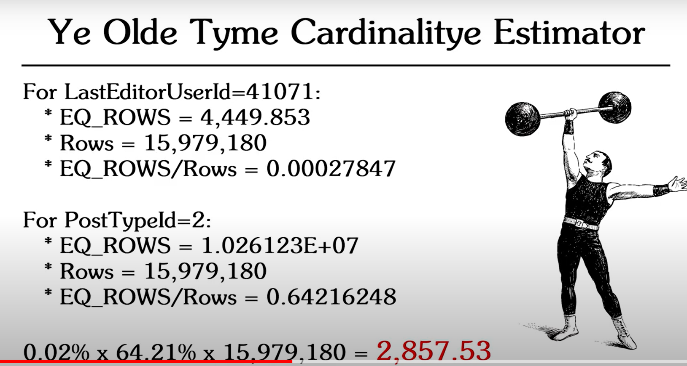

New Cardinality Estimation

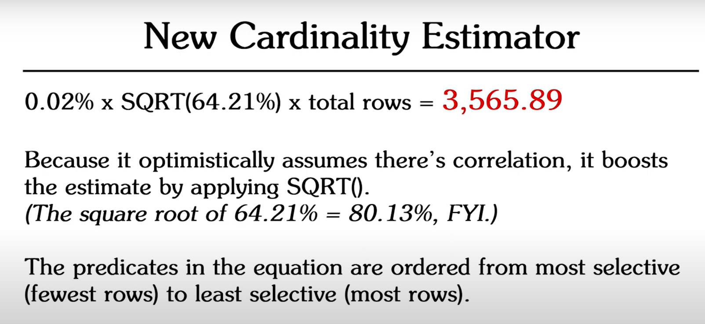

For Columns in the same table, the new CE applies:
A%
xSQRT(B%)
xSQRT(SQRT(C%))

## What is the cardinality estimation?
It is a job to determine how many rows will coming back for any given operation in the query plan.

Old cardinality
  - Predicate columns in the same table have not correlation

New cardinality
  - Predicate columns in the same table have some correlation

Move between cardinalities
  - Trace Flags
    OLD CE = TF 9481
    NEW CE = TF 2312

Square Rott (SQRT), como lo calcula el engine?

## Multi-Column Statistics
 ```sql
  CREATE INDEX ix_Posts_PostTypeId_LasetEditorUserId 
  ON [dbo].[Posts](PostTypeId, LastEditorUserId)
  INCLUDE (Id);
  GO

	SELECT Id
	FROM   dbo.Posts
	WHERE  PostTypeId = 2 
	AND    LastEditorUserId = 267
	OPTION (QUERYTRACEON 2312, RECOMPILE)
 ```

- Execute the query with old CE
  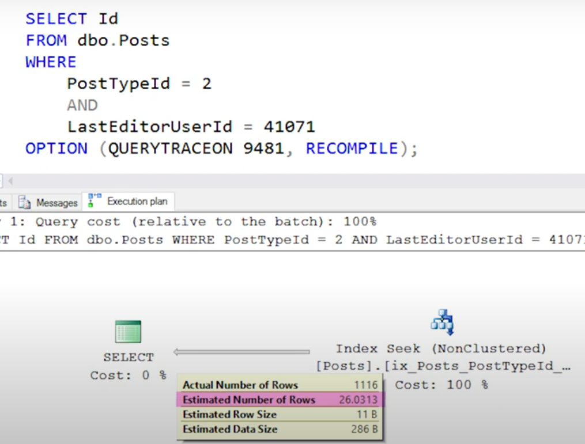

- Reverse engin
  - Find the stats for the ix
  - execute dbcc show_statistics
  - Calculate the estimation with the old CE

    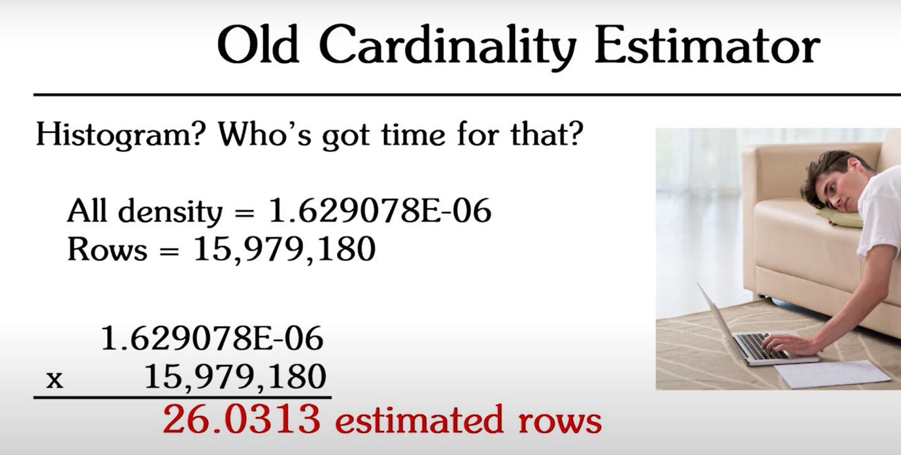

- Execute the query with the new CE
  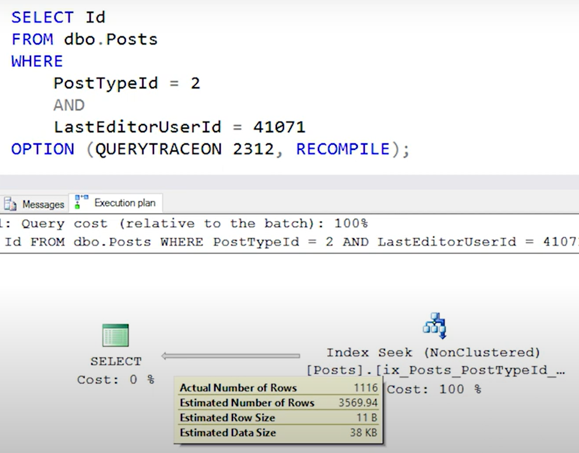

- Reverse engin
  - Find the stats for the ix
  - execute dbcc show_statistics
  - Calculate the estimation with the old CE
    - The new CE start using the Histogram. In this case check the PostTypeId is the leading Index column the value that
    we are going to see on the Histogram is about this column.
    - Then we have to go indivialidy to the LastEditorUserId stat
      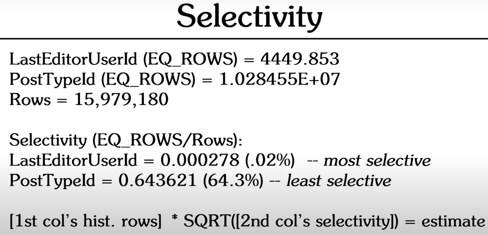
      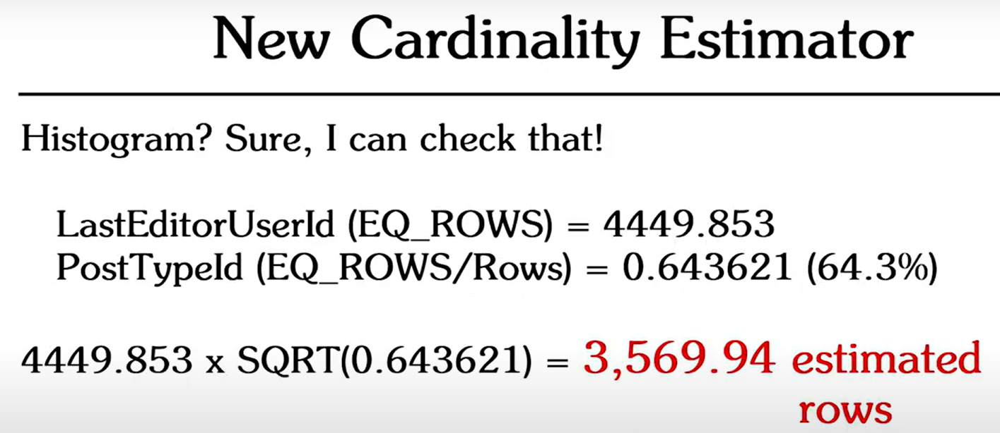
    
- Important
  - The first column in the Index is use into the Histogram. The subsequen columns has to check the individual stats
  - The most selective to less selective. This is the column order in the formula

    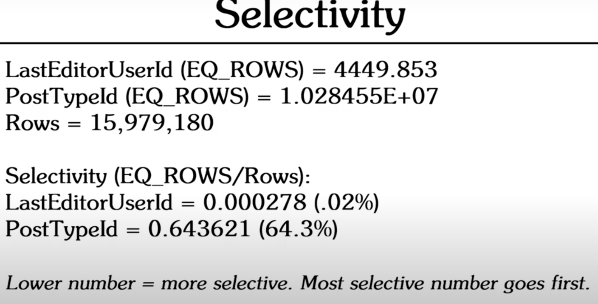

 ```sql
  DROP INDEX ix_Posts_PostTypeId_LasetEditorUserId

  CREATE INDEX ix_Posts_LasetEditorUserId_PostTypeId 
  ON [dbo].[Posts](LastEditorUserId, PostTypeId)
  INCLUDE (Id);
  GO

	SELECT Id
	FROM   dbo.Posts
	WHERE  PostTypeId = 2 
	AND    LastEditorUserId = 267
	OPTION (QUERYTRACEON 9481, RECOMPILE)

	SELECT Id
	FROM   dbo.Posts
	WHERE  PostTypeId = 2 
	AND    LastEditorUserId = 267
	OPTION (QUERYTRACEON 2312, RECOMPILE)
 ```  


- The leading column in an index statistic can make a big difference
- The old CE simply uses the density vector
- The new CE uses the histogram with correlation

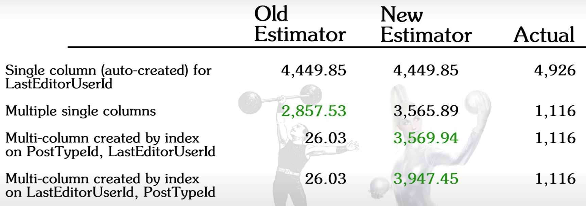

## Filtered Statistics

  - 200 is the max steps for a stats

 ```sql  
  /***************************************************************************************************
  Filtered Statistics
  ***************************************************************************************************/
  RAISERROR('Did you mean to run the whole thing?', 20, 1)WITH LOG;
  GO

  DBCC FREEPROCACHE;
  GO

  USE StackOverflow;
  GO

  CREATE STATISTICS st_Posts_LastEditorUserId_PostTypeId_Filtered
  ON [dbo].[Posts](LastEditorUserId, PostTypeID)
  WHERE (PostTypeID = 2)

  DBCC SHOW_STATISTICS ('dbo.Posts','st_Posts_LastEditorUserId_PostTypeId_Filtered')
	Rows			11.039.604
	Unfiltered Rows 17.142.169

	/*
	EQ_ROWS		   = 1509.726
	AVG_RANGE_ROWS = 198.9368
	*/
	SET STATISTICS IO ON

	SELECT Id
	FROM   dbo.Posts
	WHERE  PostTypeId = 2 
	AND    LastEditorUserId = 41956
	OPTION (  QUERYTRACEON 9481 /*Old CE*/
			, QUERYTRACEON 9204 /*Get Loaded Stats*/
			, QUERYTRACEON 9481 /*Show in message tab*/
			, RECOMPILE)


	SELECT Id
	FROM   dbo.Posts
	WHERE  PostTypeId = 2 
	AND    LastEditorUserId = 41956
	OPTION (  QUERYTRACEON 2312 /*Old CE*/
			, RECOMPILE)

	-- When the engine use the Filter Stats?
	CREATE OR ALTER PROC [dbo].[UseTheStats?]
		@PostTypeId       INT,
		@LastEditorUserId INT
	AS
		SELECT Id
		FROM   dbo.Posts
		WHERE  PostTypeId		= @PostTypeId 
		AND    LastEditorUserId = @LastEditorUserId
	GO

	EXEC [dbo].[UseTheStats?] 2, 41956

	CREATE OR ALTER PROC [dbo].[UseTheStats?]
		@PostTypeId       INT,
		@LastEditorUserId INT
	AS
		SELECT Id
		FROM   dbo.Posts
		WHERE  PostTypeId		= @PostTypeId 
		AND    LastEditorUserId = @LastEditorUserId
		OPTION(RECOMPILE)
	GO

	EXEC [dbo].[UseTheStats?] 2, 41956

	CREATE OR ALTER PROC [dbo].[UseTheStats?]
		@LastEditorUserId INT
	AS
		SELECT Id
		FROM   dbo.Posts
		WHERE  PostTypeId		= 2
		AND    LastEditorUserId = @LastEditorUserId
		OPTION(RECOMPILE)
	GO

	EXEC [dbo].[UseTheStats?] 41956
```  

  - Del minuto 11:44 al final habla de las limitaciones the las estadisticas filtradas. 
    Re mirar y anotarlas

## The ascending Key Problem

  - Validate this:
  
    Statistics updates are triggered when 500 rows + 20% of the total number of rows hace changed (on tables over 500 rows)

    ```sql
    -- Count
    SELECT (Rows in Table * .2) + 500 
    ```

    ```sql  
      /***************************************************************************************************
      Filtered Statistics
      ***************************************************************************************************/
      USE StackOverFlow2010;
      GO

      RAISERROR('Did you mean to run the whole thing?', 20, 1)WITH LOG;
      GO

      CREATE INDEX ix_Posts_LastActivityDate 
      ON [dbo].[Posts](LastActivityDate)
      
      SELECT CloseDate,Id
      FROM [dbo].[Posts]
      WHERE LastActivityDate > '2013-09-06 11:57:37.440'
      option(recompile);


      DBCC SHOW_STATISTICS ('Posts','ix_Posts_LastActivityDate')
      -- SELECT (Rows in Table * .2) + 500
      SELECT (3729195 * .2) + 500 = 746.339
    ```  

## 10 Rules to Managing statistics
1. Auto-create and auto-update stats should stay on unless you have a solid reason to turn them off.
2. Don't use maintenance plans to update statistics.
3. Don't overthink this
4. Avoid problem design patterns
5. Avoid linked servers in older versions of SQL Server
6. Create stats for read-only databases
7. Trace flags and databse-level settings are your friends
8. Don't trist the Database Tuning Advisor (DTA)
9. Keep a clean house
10. Get on the new cardinality estimator if you hace ascending key problems


## Scans, Seeks and Sargability

- Scans
  - Traverse every row of the structure (table, index, view, etc)
  - It's a fact that When a Scan takes the SQL Server is unable to seek out your individual rows as part of the whole set. It has to touch every row to find what it's looking for.
- Seek
  - Target wors that match a given condition by looking through an index
- Sargable
  - Search + armguments
  - So, Seeks may be impossible because the WHERE clause isn't sargable means that the argument on the WHERE clause can not be evaluated efficiently!
  - e.g
    ```sql
    -- 1
    SELECT DisplayName FROM [dbo].[Users] 
    WHERE DisplayName LIKE N'%Obi-Wan%'

    -- 2
    SELECT DisplayName FROM [dbo].[Users] 
    WHERE DisplayName LEFT(DisplayName, 3) = N'Obi'

    -- 3
    SELECT DisplayName FROM [dbo].[Users] 
    WHERE YEAR(CreationDate) = 2013

    -- 4
    SELECT DisplayName FROM [dbo].[Users] 
    WHERE UPPER(DsiplayName) LIKE N'OBI-WAN%'    
    ```
  
## How execution plans are made

  - Threes's company when building an executino plan
    - Parse
      - Check sintax
      - Create a three
      - etc
    - Bind
      - Check whether or not objects exists and are accessible
      - Permissions
      - etc
    - Optimize
      - Step 1
        - Simplification: 
          - Join algorithms are applied and join operators are chosen
          - View Expansion: The optimizer chooses to look at the tables underlying the view
          - Computed column definitions are conpared and used when there's a match
      - Step 2
        - Trivial Plans
          - Is this query so checp that is't not worh pondering?
          - When one plan is obviously the most efficient choice, and low-cost enoigh that parallelism isn't considered
          - If this plan is so quick and easy, ther is no reason to try to improve it with a new indexes. So the 
            missing index app is not call
          - Statements may be auto-parameterized for re-use
        - No Tirivial Plans
          - Calculate the Cost Number checking"
            - CPU
            - Projected Disl I/O
            - Memory Request
            - Available Statistics
            - Number of Rows Affected
            - Existing Indexes
          This cost number is calculated many time until the SQL get the lowe number and so now execute the query 
          using the lowest cost query plan

## This is the operator speaking... Part 1

  - Table Scan
    
    

    - Reads every column in every row across an unordered table or heaps. Talbes without an Index like Temp Table, Var Tables, etc
    - Table Scan are okay with very samll tables 
    - Table Scan are okay when rows get routinely dumped in and out without getting queried
    - Table Scan are not okay when the table is no longer small or wen data needs sorting

    Practice

    ```sql
    CREATE TABLE #obiwan
    (Id INT, DisplayName NVARCHAR(40))

    INSERT #obiwan(Id, DisplayName)
    SELECT Id, DisplayName
    FROM   [dbo].[Users]
    WHERE  DisplayName LIKE N'%Obi%' 
    AND    DisplayName LIKE N'%Wan%'

    SELECT o.Id, o.DisplayName, SUM(p.AnswerCount) AS TotalAnswers
    FROM #obiwan AS o
    JOIN [dbo].[Posts] AS p
    ON   p.OwnerUserId = o.Id
    GROUP BY o.Id, o.DisplayName

    DROP TABLE #obiwan
    ```

    
    
    This is a small temp talbe with only 12 records so the execution plan is not to bad

    ```sql
    SELECT p.Id, p.Title, COUNT(c.Id) AS TotalComments
    FROM   [dbo].[Posts] AS p
    JOIN   [dbo].[Comments] AS c
    ON   c.PostId = p.Id
    GROUP BY p.Id, p.Title
    ORDER BY COUNT(c.Id) DESC
    ```

    I COULDN'T REPRODUCE THIS EXECUTION PLAN
    
    

    To solve this he create an Index on Posts table to order the data.

  - Clustered Index Scan
    
    

    - Reads every column in every row across the clustered index
    - This has the data ordered
    - CIS are okay when the table is short and narrow
    - CIS are okay when running against a materialized view, temp table, or variable table
    - CIS are okay when the operator has a locost relative to the rest of the execution plan
    - CIS are okay when retrieving data from unpopular columns not worh indexing
    - CIS are NOT okay when the table is large and/or very wide
    - CIS are NOT okay when It's reasonable to add an index that will create a less painful seek instead
    - CIS are NOT okay when the operator has a high cost relative to the rest of the plN (50% or more)

    Practice

    ```sql
    -- Good Clustered Index Scan
    SELECT Id, Type
    FROM [dbo].[PostTypes]
    WHERE Type LIKE N'%Answer%'
    ```
    

    ```sql
    -- Bad Clusterd Index Scan
    SELECT Id
    FROM [dbo].[Posts]
    WHERE Title LIKE N'%Problem%'
    ```
    

    ```sql
    CREATE INDEX ix_Title ON dbo.Posts(Title)

    DROP INDEX ix_Title ON dbo.Posts
    ```
    

  - Clustered Index Seek
    
    
    
    - Read every column in specific rows across the clustered index
    - CIS will hurt when The operator has a high cost relative to the rest of the execution plan (50% or more)
    - CIS will hurt when The table has wide columns or is wide as a whole

    Practice

    - Good Cluster Index Seek
      
      ```sql
      SELECT TOP 200
  		        p.Id
      FROM   [dbo].[Posts]     AS p
      JOIN   [dbo].[PostTypes] AS pt
      ON     pt.ID = p.PostTypeId
      WHERE  pt.Id = 1
      AND    p.CreationDate > '2013-09-06'
      ```

      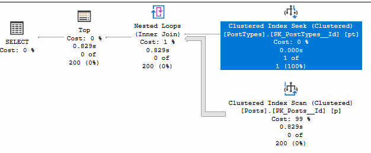

    - Bad Cluster Index Seek

      ```sql
      SELECT p.Id, p.Title
      FROM   [dbo].[Posts] AS p
      WHERE  p.Id BETWEEN 1000 AND 18644549
      ```
    - If we execute the query BETWEEN 100000 AND 18644549 the execution plan it's okay using only 0.0003 of I/O but if we execute the query BETWEEN 1000 AND 18644549 the I/o grow ups to 591
    - To solve this isue we can create a NonCLuster Index
      CREATE INDEX ix_PostId_INCL_Title ON dbo.Posts(ID) INCLUDE(Title)

      

      And now the I/O is only 14

  - Index Scan
    
    
    
    - Reads every row in a nonclustered index but not every column. Because the Index was made
      in of a subset of columns in the table.
    - IS are okey when the statement is not sargable
    - IS will hurt when the index drags a wide column with it (like NVARCHAR(4000), JSON, XML, etc)
    - IS will hurt when The operator has a high cost relative to the rest of the execution plan (50% or more)
  
    Practice
    
    ```sql
    -- Good Index Scan
    CREATE INDEX ix_DisplayName ON dbo.Users (DisplayName) INCLUDE(ID)

    SELECT Id, DisplayName
    FROM   dbo.Users
    WHERE LEFT(DisplayName, 3) = N'Obi'
    ```
    ```sql
    -- Bad Index Scan
    CREATE INDEX ix_BigDisplayName ON dbo.Users (DisplayName) INCLUDE(AboutMe)

    SELECT Id, DisplayName
    FROM   dbo.Users WITH(INDEX(ix_BigDisplayName)) 
    WHERE LEFT(DisplayName, 3) = N'Obi'
    ```

    - The I/O cots increase from 0.8 to 3.3

  - Index Seek

    

    - Reads specific rows in a nonclustered index. Doesn't read all rows nor columns
    - ISe are okay under most circumstances, even if they have a high relative cost.

    Practice
    ```sql
    -- Good Index Seek
    SET STATISTICS TIME ON

    DECLARE @p1 INT = 0;

    SELECT PostTypeId
    FROM   dbo.Posts
    WHERE  LastEditorUserId = @p1
    ```
    - Whitout Index on Posts table the engine execute a Clustered Index Scan.
    and takes 1846 ms.

    

    ```sql
    -- Good Index Seek
    CREATE INDEX ix_LastEditorUserId ON dbo.Posts(LastEditorUserId) INCLUDE(Id)
    DECLARE @p1 INT = 0;

    SELECT PostTypeId
    FROM   dbo.Posts
    WHERE  LastEditorUserId = @p1
    ```

    - Whit an Index on Posts table the engine execute a Index Seek with a Key Lookup
    and takes 3704 ms.
    The CS in this case is worst because of the pair with Key Lookup. 
    But the CIS does not use the Key lookup

    

    ```sql
    -- Create the missing index that SQL recomend
    CREATE NONCLUSTERED INDEX ix_Posts_LastEditorUserId_INC_PostTypeId
    ON [dbo].[Posts] ([LastEditorUserId])
    INCLUDE ([PostTypeId])
    GO

    DECLARE @p1 INT = 0;

    SELECT PostTypeId
    FROM   dbo.Posts
    WHERE  LastEditorUserId = @p1
    ```
    - Whit an Index on Posts table the engine execute a Index Seek with a Key Lookup
    and takes 438 ms.

    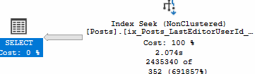

    This is much faster 512ms. So now the engine execute an Index Seek whitout executing a Key Lookup. So, not all the Index Seek are good or are being created correctly.
