# Brent Ozar Course Notes
<style>
r { color: red }
o { color: Orange }
g { color: Green }
lg { color: lightgreen }
b { color: Blue }
lb { color: lightblue }
</style>

```sql
```  

* Initial Page
  
  https://training.brentozar.com/courses/

---

# 1. Fundamentals of Index Tuning

* Index
  - [Folder Structure](#Folder-Structrure)
  - [Learn hot to visualize an index's contets](#Learn-how-to-visualize-an-index's-contets)
  - [WHERE](#WHERE)
    - [With 1 equility search](#With-1-equility-search)
    - [With 2 equeality searches](#With-2-equeality-searches)
    - [With both "equality" and "inequality" searches](#With-both-"equality"-and-"inequality"-searches)
    - [RECAP](#RECAP)
    - [LAB 2](#LAB-2)
  - [ORDER BY](#ORDER-BY)
    - [After 2 Equality searches](#After-2-Equality-searches)
    - [After an InEquality seraches](#After-an-InEquality-seraches)
  - [TOP](#TOP)
    - [Design and index for this:](#Design-and-index-for-this-:)
    - [RECAP](#RECAP)
    - [LAB 4](#LAB-4)
  - [JOINs](#JOINs)
    - [One Join (never in the real life)](#Design-and-index-for-this-:)
    - [JOIN + ORDER BY](#JOIN-+-ORDER-BY)
    - [MIXING JOINS AND FILTERS)](#MIXING-JOINS-AND-FILTERS)
    - [LOTS OF JOINS](#LOTS-OF-JOINS)
    - [WHERE EXISTS](#WHERE-EXISTS)
    - [RECAP](#RECAP)
    - [LAB 6](#LAB-6)
  - [The built-in missing index recommendations](#The-built-in-missing-index-recommendations)
    - [Index hints are a gift](#Index-hints-are-a-gift)
    - [Let’s see how he does it](#Let’s-see-how-he-does-it)
    - [So far, not bad](#So-far-,-not-bad)
    - [He is focus on WHERE, not GROUP BY or ORDER BY](#He-is-focus-on-WHERE-,-not-GROUP-BY-or-ORDER-BY)
    - [Addeding Clippy/s indexes can even make things worse](#Addeding-Clippy/s-indexes-can-even-make-things-worse)
    - [RECAP](#RECAP)
    - [LAB 7](#LAB-7)

  - [Recap of what we learned and what to do next](#Recap-of-what-we-learned-and-what-to-do-next)
    - [Selectivity isn’t just uniquenesst](#)Selectivity-isn’t-just-uniquenesst)
    - [Visualize indexes with a query](#Visualize-indexes-with-a-query)
    - [The first round is the easy button](#The-first-round-is-the-easy-button)
    - [The wrong nonclustered indexes](#The-wrong-nonclustered-indexes)
    - [My D.E.A.T.H. Method](#My-D.E.A.T.H.-Method)


## Folder Structure
1.  Images
    Will have the images that I take from the course.

2.  PDF
    Will have the document download from Brent Ozar oficial course.

3.  Script
    Will have the document download from Brent Ozar oficial course.

## Learn how to visualize an index's contets
If we create the below index:
```sql
CREATE INDEX IX_LastAccessDate_ID
ON dbo.Users(DisplatName, ID)
GO
```
You can see how this look likes executing the following SELECT:

```sql
SELECT LastAccessDate, ID
FROM dbo.Users
ORDER BY DisplayName, ID
```

Other example
```sql
-- Create Index
CREATE INDEX IX_LastAccessDate_ID_DisplayName_Age
ON dbo.Users(DisplatName, ID)
INCLUDE (DisplayName, Age)

-- See how the index look like
SELECT
    LastAccessDate, DisplatName, ID, DisplayName, Age
FROM dbo.Users
ORDER BY DisplatName, Id
```

**<span style="color:red;">Use this process as you work</span>**
When you are designing indexes, write a query with a matching SELECT and WHERE. Review the data that comes out and think like the engine. This Index will help execute the query that I am trying to tune?

## WHERE

- With 1 equility search
    Design an index for this query

    ```sql
    /* FIRST LAB CHALLENGE: design the right index for this: */
    SELECT Id, DisplatName, Location
    FROM   dbo.Users
    WHERE  DisplayName = 'Alex';
    GO

    /* The index */
    CREATE NONCLUSTERED DisplayName_Location
        ON dbo.Users(DisplayName)
        INCLUDE(Location)
    ```

    - Should you include Id?
    How to Think Like the Engine explained that the clustering key on a table is always included. There’s no extra cost whether you include it or not:
    it doesn’t get stored twice. I only include it if my query needs it in the output, and I suspect somebody’s gonna come behind me and  change the clustering key later.
    Here, I’m fine either way.

    <r>The diff between the Key and the INCLUDE is that on the INCLUDE the data is not ordered</r>

    ```sql
    /* To check the index organization you can run */
    SELECT DisplayName, Location, Id
    FROM dbo.Users
    ORDER BY DisplayName
    ```

- With 2 equeality searches
    Design an index for this query

    ```sql
    /* FIRST LAB CHALLENGE: design the right index for this: */
    SELECT Id, DisplatName, Location
    FROM   dbo.Users
    WHERE  DisplayName = 'Alex'
    AND    Location    = 'Seattle, WA';
    GO

    /* The old index 
    SQL Server can use that last index we created.
    */
    ```

    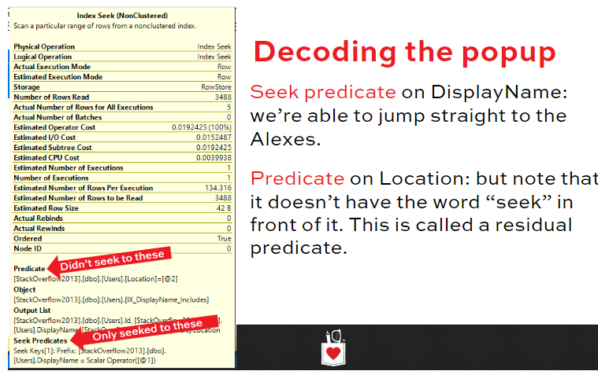

    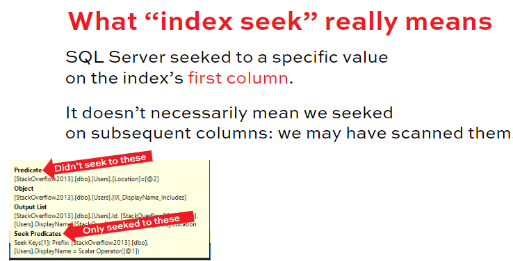

    ```sql
    /* The new index */
    CREATE NONCLUSTERED DisplayName_Location
        ON dbo.Users(DisplayName, Location)

    CREATE NONCLUSTERED Location_DisplayName
        ON dbo.Users(Location, DisplayName)
    ```

    - Test ‘em
    I don’t like index hints for long-term usage because your query will simply fail if the index disappears or is renamed. Hints are great for checking logical reads though.

    RESULT
    Index                           Logical Reads
    Clustered index (white pages)   45,184
    IX_DisplayName_Includes             16
    IX_DisplayName_Location              4
    IX_Location_DisplayName              5

    But don’t quibble over a handful of logical reads. All of the indexes are pretty good!


- With both "equality" and "inequality" searches

    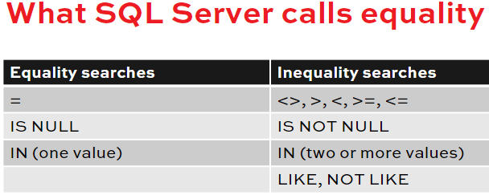

    Now try this query.
    
    ```sql
    SELECT Id, DisplayName, Location
    FROM dbo.Users
    WHERE DisplayName = 'alex'
    AND Location <> 'Seattle, WA';
    ```
    The <> is really important: it changes the game

    Think back to your 2 earlier indexes.
    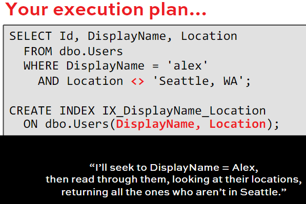
    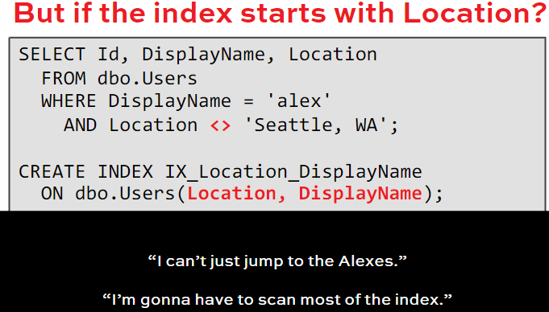
    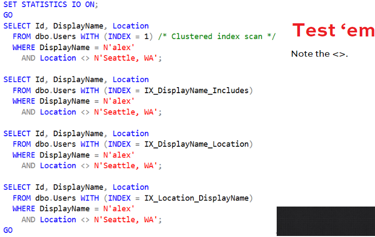

    Survey says...
    Index                           Logical Reads     Total Pages in the Index
    Clustered index (white pages)   45,184            45,184
    IX_DisplayName_Includes             16            12,577
    IX_DisplayName_Location             13            12,701
    IX_Location_DisplayName          4,566            13,183
    
    - So what’s the lesson?
    When you have both equality and inequality searches, you might think it’s important to put the equality fields first in the index key order so that you can seek directly to the rows you want.
        WHERE DisplayName = 'alex'
        AND Location <> 'Seattle, WA’; 
    But that’s not necessarily true. Hold that thought.

    - Field order isn’t about equality.
    Field order is about selectivity, the ability to reduce the amount of work we’re about to do. Sometimes that’s about reducing row counts by filtering down the number of rows we’re going to pass on to the next operator in a plan. Other times, it’s about pre-sorting data to avoid sorts.

    - <r>What selectivity really means</r>
    <r>It’s not about how unique each row is by itself. It’s about your query, and how small a percentage of the table you’re searching for.</r>
    <r>When evaluating column order for indexes, don’t think about how unique each column is. Think about what percentage you’re searching for.</r>

    - Testing it out
    ```sql
    SELECT Id, LastAccessDate, DownVotes
    FROM dbo.Users
    WHERE LastAccessDate <= GETDATE()
    AND Reputation = 0;
    ```

- RECAP
    If your queries only have equality searches, key field order isn’t all that important. When you have inequality searches, though, key field order matters a LOT. The first fields in the key need to help reduce the amount of rows you scan. Just because you see a “seek” doesn’t mean you’re seeking to a specific row: residual predicates indicate
    a seek, followed by a scan of an area of the index.

    Picking key order
    - Fields in the WHERE clause usually (We’ll break this rule in the next module) need to go first.
    - Selective query filters go first: reduce the amount of data you’re searching through.
    - Commonly filtered-on fields go first: maximize the number of queries that can use an index.

    Testing it out
    When designing indexes for a query, craft a separate SELECT query for each filter in the WHERE clause, and test to see how selective it is.


*  LAB 2
    ```sql
    /* FIRST LAB CHALLENGE: design the right index for this: */
    SELECT DisplatName, Id
    FROM   dbo.Users
    WHERE  WebsiteUrl = 'http://127.0.0.1'
    AND    Location   = 'United States';
    GO

    /*DATA PERFORM FROM ORIGINAL:*/
    
    /*QUESTION*/
	Which field should go first in the WHERE clause?
		In this case it does not matter, because the WHERE clause is an EQUALITY WHERE clause!!
	Which filter is more selective?
		WebsiteUrl is more selective

    /*REPONSE:*/
    1. CHECK SELECTIVITY
        SELECT COUNT(*) FROM dbo.Users WHERE WebsiteUrl = 'http://127.0.0.1';
		WebSiteUrl = 105   records / AVG 2465713 * 100 % 105  = 0.004

		SELECT COUNT(*) FROM dbo.Users WHERE Location   = 'United States';
		Location   = 8.704 records / AVG 2465713 * 100 % 8704 = 0.35

    2. CREATE INDEXES
	    CREATE INDEX IX_WebsiteURL_Location 
        ON dbo.Users (WebsiteURL, Location)  INCLUDE (DisplayName);		
		
        CREATE INDEX IX_Location_WebsiteURL 
        ON dbo.Users (Location , WebsiteURL) INCLUDE (DisplayName);

    3. TEST INDEXES
        SET STATISTICS IO ON
	
    	SELECT DisplatName, Id
		FROM   dbo.Users	WITH (INDEX = 1)
		WHERE  WebsiteUrl = 'http://127.0.0.1'
		AND    Location   = 'United States';

		SELECT DisplatName, Id
		FROM   dbo.Users	WITH (INDEX = IX_WebsiteURL_Location)
		WHERE  WebsiteUrl = 'http://127.0.0.1'
		AND    Location   = 'United States';

		SELECT DisplatName, Id
		FROM   dbo.Users	WITH (INDEX = IX_Location_WebsiteURL)
		WHERE  WebsiteUrl = 'http://127.0.0.1'
		AND    Location   = 'United States';

		SELECT DisplatName, Id
		FROM   dbo.Users
		WHERE  WebsiteUrl = 'http://127.0.0.1'
		AND    Location   = 'United States';
        ---------------------------------------------------------------------------------------
        (INDEX = 1)					     = Table 'Users'. Scan count 1, logical reads 44.530
		(INDEX = IX_WebsiteURL_Location) = Table 'Users'. Scan count 1, logical reads 30
		(INDEX = IX_Location_WebsiteURL) = Table 'Users'. Scan count 1, logical reads 30
		ENGINE							 = Table 'Users'. Scan count 1, logical reads 30

    4. VISUALIZATION INDEX
        INDEX 1

        INDEX 2    
    ```

    ```sql
    /* NEXT EXERCISE: design the right index to find the nicest people: */
    SELECT DisplayName, Location, DisplatName, Id
    FROM   dbo.Users
    WHERE  DownVotes = 0
    AND    UpVotes   > 100;
    GO

    /*DATA PERFORM FROM ORIGINAL:*/
    (25695 rows affected)
	Table 'Users'. Scan count 1, logical reads 44530, physical reads 3

    /*QUESTION*/
    Which field should go first in the WHERE clause?
	Which filter is more selective?

    /*REPONSE:*/ 
    5. CHECK SELECTIVITY
        SELECT COUNT(*) FROM dbo.Users WHERE DownVotes = 0;
        SELECT (2231034 * 100) / 2465713 = 90%

        SELECT COUNT(*) FROM dbo.Users WHERE UpVotes   > 100;
        SELECT (143668 * 100) / 2465713 = 5%    

    6. CREATE INDEXES
	    CREATE INDEX IX_UpVotes_DownVotes_INCLUDE_DisplayName_Location 
        ON dbo.Users (UpVotes, DownVotes) INCLUDE (DisplayName, Location);	

	    CREATE INDEX IX_DownVotes_UpVotes_INCLUDE_DisplayName_Location 
        ON dbo.Users (DownVotes, UpVotes) INCLUDE (DisplayName, Location);

    7. TEST INDEXES
        SET STATISTICS IO ON

        SELECT DisplayName, Location, DisplatName, Id
        FROM   dbo.Users WITH (INDEX = 1)
        WHERE  DownVotes = 0
        AND    UpVotes   > 100;

        SELECT DisplayName, Location, DisplatName, Id
        FROM   dbo.Users WITH (INDEX = IX_UpVotes_DownVotes_INCLUDE_DisplayName_Location)
        WHERE  DownVotes = 0
        AND    UpVotes   > 100;

        SELECT DisplayName, Location, DisplatName, Id
        FROM   dbo.Users WITH (INDEX = IX_DownVotes_UpVotes_INCLUDE_DisplayName_Location)
        WHERE  DownVotes = 0
        AND    UpVotes   > 100;

        SELECT DisplayName, Location, DisplatName, Id
        FROM   dbo.Users
        WHERE  DownVotes = 0
        AND    UpVotes   > 100;
        ---------------------------------------------------------------------------------------
        INDEX = 1							   = Table 'Users'. Scan count 1, logical reads 44530
        IX_UpVotes_DownVotes_INCLUDE_DisplayName_Location  = Table 'Users'. Scan count 1, logical reads 1123
        IX_DownVotes_UpVotes_INCLUDE_DisplayName_Location  = Table 'Users'. Scan count 1, logical reads 189
        ENGINE								   = Table 'Users'. Scan count 1, logical reads 189

    8. VISUALIZATION INDEX
        INDEX 1				
        CREATE INDEX IX_UpVotes_DownVotes_INCLUDE_DisplayName_Location 
        ON dbo.Users (UpVotes  , DownVotes) INCLUDE (DisplayName, Location);		
        
        -- This bring the index data doing an Index Scan
        SELECT UpVotes, DownVotes, DisplayName, Location
        FROM   dbo.Users
        ORDER BY UpVotes, DownVotes

        -- We are going to similate the query
        SELECT UpVotes, DownVotes, DisplayName, Location
        FROM   dbo.Users
        WHERE  UpVotes > 100
        ORDER BY UpVotes, DownVotes

        /***********************************************************************************
        SQL server bomp into UpVotes = 100 and start reading. That is why is reading 143.668
        rows. Because we have UpVotes = 100 and
        DownVotes = 0 but then we have UpVotes = 100  with DownVotes = 2. Then if you
        continue checking the data we have UpVotes = 101
        with DownVotes = 0 and so on ....
        ***********************************************************************************/

        INDEX 2
        CREATE INDEX IX_DownVotes_UpVotes_INCLUDE_DisplayName_Location 
        ON dbo.Users (DownVotes, UpVotes)   
        INCLUDE (DisplayName, Location);

        -- This bring the index data doing an Index Scan
        SELECT DownVotes, UpVotes, DisplayName, Location
        FROM   dbo.Users
        ORDER BY DownVotes, UpVotes

        -- We are going to similate the query 
        SELECT DownVotes, UpVotes, DisplayName, Location
        FROM   dbo.Users
        WHERE  DownVotes = 0 -- AND UpVotes > 100
        ORDER BY DownVotes, UpVotes
    ```    

    ```sql
    /* NEXT EXERCISE: find German people with a high reputation: */
    SELECT DisplayName, Location, DisplatName, Id
    FROM dbo.Users
    WHERE Location LIKE '%Germany%'
    AND   Reputation > 100000;
    GO

    /*DATA PERFORM FROM ORIGINAL:*/
    (37 rows affected)
    Table 'Users'. Scan count 1, logical reads 44530, physical reads 3

    /*QUESTION*/
    Which field should go first in the WHERE clause?
	Which filter is more selective?

    /*REPONSE:*/ 
    9. CHECK SELECTIVITY
        SELECT COUNT(*) FROM dbo.Users WHERE Location LIKE '%Germany%';
        SELECT (20411 * 100) / 2465713 = 90%

        SELECT COUNT(*) FROM dbo.Users WHERE Reputation > 100000;
        SELECT (613 * 100) / 2465713 = 5%    

    10. CREATE INDEXES
        -- SQL Server can't handle Location LIKE '%Germany%' because you can have Germany or East Germany, 
        -- West Germany or Berlin, Germany or etc. So we have to create an Index using Reputation for sure
        -- To have a good order

        CREATE INDEX IX_Reputation 
        ON dbo.Users(Reputation)

        CREATE INDEX IX_Reputation_Location 
        ON dbo.Users(Reputation, Location)

        CREATE INDEX IX_Reputation_Location 
        ON dbo.Users(Reputation, Location)
		INCLUDE (DisplayName)

        -- Location is not in order so we can put that column into the INCLUDE
        CREATE INDEX IX_Reputation_Location 
        ON dbo.Users(Reputation)
		INCLUDE (Location)

	    CREATE INDEX IX_Reputation_Location_INCLUDE_DisplayName_Id
		ON dbo.Users(Reputation, Location)
		INCLUDE (DisplatName, ID)

		CREATE INDEX IX_Location_Reputation_INCLUDE_DisplayName_Id
		ON dbo.Users(Location, Reputation)
		INCLUDE (DisplatName, ID)

    11. TEST INDEXES
        SET STATISTICS IO ON

        SELECT DisplayName, Location, DisplatName, Id
		FROM dbo.Users WITH(INDEX = 1)
		WHERE Location LIKE '%Germany%'
		AND   Reputation > 100000;

		SELECT DisplayName, Location, DisplatName, Id
		FROM dbo.Users WITH (INDEX = IX_Reputation_Location_INCLUDE_DisplayName_Id)
		WHERE Location LIKE '%Germany%'
		AND   Reputation > 100000;

		SELECT DisplayName, Location, DisplatName, Id
		FROM dbo.Users WITH (INDEX = IX_Location_Reputation_INCLUDE_DisplayName_Id)
		WHERE Location LIKE '%Germany%'
		AND   Reputation > 100000;

		SELECT DisplayName, Location, DisplatName, Id
		FROM dbo.Users
		WHERE Location LIKE '%Germany%'
		AND   Reputation > 100000;
        ------------------------------------------------------------------------------------
        INDEX = 1						   = Table 'Users'. Scan count 1, logical reads 44530
        IX_UpVotes_DownVotes_INCLUDE_ ...  = Table 'Users'. Scan count 1, logical reads 10
        IX_DownVotes_UpVotes_INCLUDE_ ...  = Table 'Users'. Scan count 1, logical reads 14029
        ENGINE							   = Table 'Users'. Scan count 1, logical reads 10

    12. VISUALIZATION INDEX
        INDEX 1				
        CREATE INDEX IX_Reputation_Location_INCLUDE_DisplayName_Id
		ON dbo.Users(Reputation, Location)
		INCLUDE (DisplatName, ID)		
        
        -- This bring the index data doing an Index Scan
        SELECT Reputation, Location
		FROM   dbo.Users
		ORDER BY Reputation, Location

        -- We are going to similate the query
        SELECT Reputation, Location
		FROM   dbo.Users
		WHERE  Reputation > 100000
		ORDER BY Reputation, Location

        SELECT Reputation, Location
		FROM   dbo.Users
		WHERE  Location LIKE '%Germany%'
		ORDER BY Location, Reputation

        SELECT Reputation, Location
		FROM   dbo.Users
		WHERE  Location LIKE '%Germany%'
		ORDER BY Location, Reputation

        /***********************************************************************************
        SQL server bomp into Reputation > 100000 and start reading. 
        Then read the recidual Location LIKE '%Germany%'.
        It's a Recidual Predica because the Index is organize only on the First column 
        in this case (Reputation)
        ***********************************************************************************/

        INDEX 2
        CREATE INDEX IX_Location_Reputation_INCLUDE_DisplayName_Id
		ON dbo.Users(Location, Reputation)
		INCLUDE (DisplatName, ID)

        -- This bring the index data doing an Index Scan
        SELECT DownVotes, UpVotes, DisplayName, Location
        FROM   dbo.Users
        ORDER BY DownVotes, UpVotes

        -- We are going to similate the query 
        SELECT DownVotes, UpVotes, DisplayName, Location
        FROM   dbo.Users
        WHERE  DownVotes = 0 -- AND UpVotes > 100
        ORDER BY DownVotes, UpVotes
    ```    

    ```sql
    /* LET'S MIX THINGS UP: 
    You've created a few indexes so far. Pick one of them, and write 3 queries:

    * One that will scan the index (and only that index, not touching any others)
    * Write a query that will do an index seek (but again, not touching any others)
    * Write a query that will use that index, but then get a residual predicate
    (Reminder: that's a query that uses the index to do a seek, but then has to
    do an additional filter, like maybe going over to the clustered index to do a
    key lookup, and do additional filtering there)
    */
    CREATE INDEX IX_Reputation_Location_INCLUDE_DisplayName_Id
    ON dbo.Users(Reputation, Location)
    INCLUDE (DisplatName, ID)		

	-- Index Scan
	SELECT
		Reputation, Location, DisplatName, Id
	FROM dbo.Users

	-- Index Seek		
	SELECT
		Reputation, Location, DisplatName, Id
	FROM dbo.Users
	WHERE 
		Reputation > 130000	
	
	-- Index Seek + Predicate
	SELECT
		Reputation, Location, DisplatName, Id
	FROM dbo.Users
	WHERE 
		Reputation > 130000	
	AND Location = 'Arizona'

    -- Brent took
        CREATE INDEX IX_Reputation_Location
        ON dbo.Users(Reputation, Location)
		INCLUDE (DisplayName)

        -- Question 1
        SELECT COUNT(DisplayName)
        FROM  dbo.Users

        SELECT TOP 100 Reputation, Location, DisplatName, iD
        FROM  dbo.Users
        ORDER BY Reputation, Location        

        SELECT TOP 100 Reputation, Location, DisplatName, iD
        FROM  dbo.Users
        ORDER BY Reputation DESC, Location DESC

        -- Question 2
        SELECT Reputation, Location, DisplayName, Id
        FROM   dbo.Users
        WHERE  Reputation = 8765309

        -- Question 3
        SELECT Reputation, Location, DisplayName, Id
        FROM   dbo.Users
        WHERE  Reputation = 12345
        AND    DisplayName = 'Brent Ozar'

        SELECT Reputation, Location, DisplayName, Id
        FROM   dbo.Users
        WHERE  Reputation > 0
        AND    DisplayName = 'Brent Ozar'
    ```    

    ```sql
    /* NEXT UP: find people who match an unusual filter: */
    SELECT DisplayName, Location, DisplatName, Id
    FROM dbo.Users
    WHERE Location = 'Moscow, Russia'
        OR DisplayName LIKE 'Dmitry%';
    GO

    /*DATA PERFORM FROM ORIGINAL:*/
    (4311 rows affected)
    Table 'Users'. Scan count 1, logical reads 44530, physical reads 3

    /*QUESTION*/
    Which field should go first in the WHERE clause?
	Which filter is more selective?

    /*REPONSE:*/ 
    1. CHECK SELECTIVITY
        SELECT COUNT(*) FROM dbo.Users WHERE Location = 'Moscow, Russia'
        SELECT (3021 * 100) / 2465713 = 0.12%

        SELECT COUNT(*) FROM dbo.Users WHERE DisplayName LIKE 'Dmitry%'
        SELECT (1346 * 100) / 2465713 = 0.05%

    2. CREATE INDEXES
        CREATE INDEX IX_Location_DisplayName_Inclu_Reputation
        ON dbo.Users (Location, DisplayName)
        INCLUDE (Reputation, Id)

        CREATE INDEX IX_DisplayName_Location__Inclu_Reputation
        ON dbo.Users (DisplayName, Location)
        INCLUDE (Reputation, Id)

    3. TEST INDEXES
        SET STATISTICS IO ON

        SELECT DisplayName, Location, DisplatName, Id
        FROM  dbo.Users WITH(INDEX = 1)
        WHERE Location = 'Moscow, Russia'
        OR DisplayName LIKE 'Dmitry%';

        SELECT DisplayName, Location, DisplatName, Id
        FROM  dbo.Users WITH(INDEX = IX_Location_DisplayName_Inclu_Reputation)
        WHERE Location = 'Moscow, Russia'
        OR DisplayName LIKE 'Dmitry%';

        SELECT DisplayName, Location, DisplatName, Id
        FROM  dbo.Users WITH(INDEX = IX_DisplayName_Location__Inclu_Reputation)
        WHERE Location = 'Moscow, Russia'
        OR DisplayName LIKE 'Dmitry%';

        SELECT DisplayName, Location, DisplatName, Id
        FROM  dbo.Users 
        WHERE Location = 'Moscow, Russia'
        OR DisplayName LIKE 'Dmitry%';
        ------------------------------------------------------------------------------------
        Table 'Users'. Scan count 1, logical reads 44530
        Table 'Users'. Scan count 1, logical reads 14068
        Table 'Users'. Scan count 1, logical reads 13600

        Table 'Worktable'. Scan count 0, logical reads  0
        Table 'Users'.     Scan count 2, logical reads 44

    4. VISUALIZATION INDEX
        -- INDEX 1 PK
        SELECT Id
        FROM   dbo.Users
        -- where id > 1000
        ORDER BY id

        -- INDEX 2 IX_Location_DisplayName_Inclu_Reputation
        SELECT Location, DisplayName, DisplatName, Id
        FROM   dbo.Users
        WHERE Location = 'Moscow, Russia'
        ORDER BY Location, DisplayName, DisplatName, Id

        -- INDEX 3 IX_DisplayName_Location__Inclu_Reputation
        SELECT DisplayName, Location, DisplatName, Id
        FROM   dbo.Users
        WHERE DisplayName LIKE 'Dmitry%'
        ORDER BY DisplayName, Location, DisplatName, Id

    -- Brent Ozar
    CREATE INDEX IX_Location ON dbo.Users(Location) INCLUDE (DisplayName, Reputation)
    CREATE INDEX IX_DisplayName ON dbo.Users(DisplayNAme) INCLUDE (Location, Reputation)
    ```    

    ```sql
    /* NEXT QUESTION: design the right index to find all of the people who created an account, but then never accessed the system again:  */
    SELECT CreationDate, LastAccessDate, DisplatName, Id
    FROM dbo.Users
    WHERE CreationDate = LastAccessDate;
    GO

    /*DATA PERFORM FROM ORIGINAL:*/
    (171516 rows affected)
    Table 'Users'. Scan count 1, logical reads 44530

    /*QUESTION*/
    Which field should go first in the WHERE clause?
	Which filter is more selective?

    /*REPONSE:*/ 
    5. CHECK SELECTIVITY
        SELECT COUNT(*) FROM dbo.Users WHERE CreationDate = LastAccessDate;
        SELECT (171516 * 100) / 2465713 = 6.9%

    6. CREATE INDEXES
        CREATE INDEX IX_CreationDate_Inl_LastAccessDate_DisplayName_Id
        ON dbo.Users (CreationDate)
        INCLUDE (LastAccessDate, DisplatName, Id)

        CREATE INDEX IX_LastAccessDate_Inl_CreationDate_DisplayName_Id
        ON dbo.Users (LastAccessDate)
        INCLUDE (CreationDate, DisplatName, Id)

    7. TEST INDEXES
        SET STATISTICS IO ON

        SELECT CreationDate, LastAccessDate, DisplatName, Id
        FROM dbo.Users WITH(INDEX = 1)
        WHERE CreationDate = LastAccessDate;
        GO

        SELECT CreationDate, LastAccessDate, DisplatName, Id
        FROM dbo.Users WITH(INDEX = IX_CreationDate_Inl_LastAccessDate_DisplayName_Id)
        WHERE CreationDate = LastAccessDate;
        GO

        SELECT CreationDate, LastAccessDate, DisplatName, Id
        FROM dbo.Users WITH(INDEX = IX_LastAccessDate_Inl_CreationDate_DisplayName_Id)
        WHERE CreationDate = LastAccessDate;
        GO

        SELECT CreationDate, LastAccessDate, DisplatName, Id
        FROM dbo.Users
        WHERE CreationDate = LastAccessDate;
        GO
        -----------------------------------------------------------------------------------
        Table 'Users'. Scan count 1, logical reads 44530
        Table 'Users'. Scan count 1, logical reads 15060
        Table 'Users'. Scan count 1, logical reads 15060
        Table 'Users'. Scan count 1, logical reads 15060

    8. VISUALIZATION INDEX
        SELECT CreationDate, LastAccessDate, DisplatName, Id
        FROM   dbo.Users    
        ORDER BY CreationDate -- , LastAccessDate, DisplatName, Id

        SELECT CreationDate, LastAccessDate, DisplatName, Id
        FROM   dbo.Users 
        ORDER BY LastAccessDate -- , CreationDate , DisplatName, Id
    
    -- Brent Ozar
    -- Any index that has the CreationDate and LastAccessDate is going to be okay because the
    -- order is not helpfull here.
    CREATE INDEX DsiplayName ON dbo.Users(DisplayName) INCLUDE(CreationDate, LastAccessDate)
    ```    

    ```sql
    
    /*DATA PERFORM FROM ORIGINAL:*/
    SELECT CreationDate, DisplayName, Location
    FROM dbo.Users
    WHERE CreationDate >= '2009-01-01'
        AND CreationDate < '2009-01-02'
        AND Reputation = 1;
    GO

    /*QUESTION*/
    Which field should go first in the WHERE clause?
	Which filter is more selective?

    /*REPONSE:*/ 
    9. CHECK SELECTIVITY
        SELECT COUNT(*) FROM dbo.Users WHERE CreationDate >= '2009-01-01'
        SELECT (2444024 * 100) / 2465713 = %

        SELECT COUNT(*) FROM dbo.Users WHERE CreationDate <  '2009-01-02'
        SELECT (21731 * 100) / 2465713 = %

        SELECT COUNT(*) FROM dbo.Users WHERE Reputation   = 1
        SELECT (1090043 * 100) / 2465713 = %

    10. CREATE INDEXES
        CREATE INDEX IX_CreationDate_Reputation_Inc_DisplayName_Location
        ON dbo.Users(CreationDate, Reputation)
        INCLUDE (DisplayName, Location)

        CREATE INDEX IX_Reputation_CreationDate_Inc_DisplayName_Location
        ON dbo.Users(Reputation, CreationDate)
        INCLUDE (DisplayName, Location)

    11. TEST INDEXES
        SET STATISTICS IO ON

        SELECT CreationDate, DisplayName, Location
        FROM dbo.Users WITH(INDEX = 1)
        WHERE CreationDate >= '2009-01-01'
            AND CreationDate < '2009-01-02'
            AND Reputation = 1;
        GO

        SELECT CreationDate, DisplayName, Location
        FROM dbo.Users WITH(INDEX = IX_CreationDate_Reputation_Inc_DisplayName_Location)
        WHERE CreationDate >= '2009-01-01'
            AND CreationDate < '2009-01-02'
            AND Reputation = 1;
        GO

        SELECT CreationDate, DisplayName, Location
        FROM dbo.Users WITH(INDEX = IX_Reputation_CreationDate_Inc_DisplayName_Location)
        WHERE CreationDate >= '2009-01-01'
            AND CreationDate < '2009-01-02'
            AND Reputation = 1;
        GO

        SELECT CreationDate, DisplayName, Location
        FROM dbo.Users
        WHERE CreationDate >= '2009-01-01'
            AND CreationDate < '2009-01-02'
            AND Reputation = 1;
        GO        
        ------------------------------------------------------------------------------------
        Table 'Users'. Scan count 1, logical reads 44530
        Table 'Users'. Scan count 1, logical reads 5
        Table 'Users'. Scan count 1, logical reads 3
        Table 'Users'. Scan count 1, logical reads 3

    12. VISUALIZATION INDEX

    ```    


## ORDER BY

- After 2 Equality searches
    With equality search is on the WHERE put the ORDER BY on the KEY INDEX, at the end.

    ```sql
    /* Bring some order around here. */
    SELECT Id, DisplayName, Location
    FROM   dbo.Users
    WHERE  DisplayName = 'alex'
    AND    Location    = 'Seattle, WA'
    ORDER BY Reputation;

    /* Think back to your 2 earlier indexes */
    CREATE INDEX IX_DisplayName_LocationON dbo.Users(DisplayName, Location);
    CREATE INDEX IX_Location_DisplayNameON dbo.Users(Location, DisplayName);

    /* Add new versions with Reputation */
    CREATE INDEX IX_DisplayName_Location_Reputation ON dbo.Users(DisplayName, Location, Reputation);
    CREATE INDEX IX_Location_DisplayName_Reputation ON dbo.Users(Location, DisplayName, Reputation);
    CREATE INDEX IX_Reputation_DisplayName_Location ON dbo.Users(Reputation, DisplayName, Location);
    ```

    Test them
    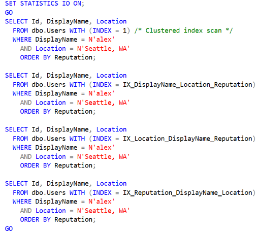


    Survey says...
    Index                                   Logical Reads   Total Pages in the Index
    Clustered index (white pages)           45,184          45,184
    IX_DisplayName_Location_Reputation           4          13,995
    IX_Location_DisplayName_Reputation           4          14,486
    IX_Reputation_DisplayName_Location      13,996          13,996

    Ouch. Putting reputation first meant no seeking  at all, and we scanned the whole thing. (Still better than a table scan though.)


- After an InEquality seraches
    Let’s go anywhere BUT Seattle
    ```sql
    SELECT Id, DisplayName, Location
    FROM   dbo.Users
    WHERE  DisplayName = 'alex'
    AND    Location   <> 'Seattle, WA'
    ORDER BY Reputation;
    ```

    What’s the perfect index for this?, How selective is each part of the filter?

    Survey says...
    Index                               Logical Reads   Total Pages in the Index
    Clustered index (white pages)       45,184          45,184
    IX_DisplayName_Location_Reputation      13          13,995
    IX_Location_DisplayName_Reputation   4,864          14,486
    IX_Reputation_DisplayName_Location  13,996          13,996

    Ouch. Putting reputation first meant no seeking at all, and we scanned the whole thing. (Still better than a table scan though.)

    So the perfect index for it:
    ```sql
    SELECT Id, DisplayName, Location
    FROM   dbo.Users
    WHERE  DisplayName = 'alex'
    AND    Location   <> 'Seattle, WA'
    ORDER BY Reputation;

    CREATE INDEX IX_DisplayName_Location_Reputation ON 
    dbo.Users(DisplayName, Location, Reputation);
    ```
    Step 1: Seek to Alex
    Step 2: Scan through, returning everyone EXCEPT Seattle
    Step 3: Read them out sorted by Reputation, except...they are not.

    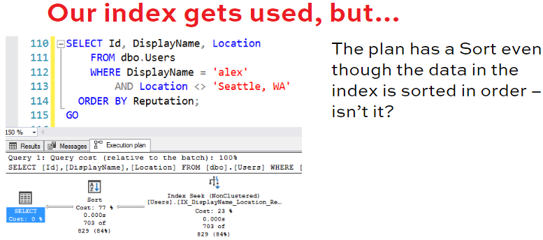

    Write a query to visualize the INDEX
    ```sql
    SELECT DisplayName, Location, Reputation, Id
    FROM dbo.USers
    ORDER BY DisplayName, Location, Reputation;
    ```
    Reputation isn’t sorted. We’re going to skip everyone who isn’t in Seattle. That means we need all the Alexes on this screen, plus more. And they’re not sorted by
    Reputation. The fact that Reputation is “sorted” isn’t helping here

    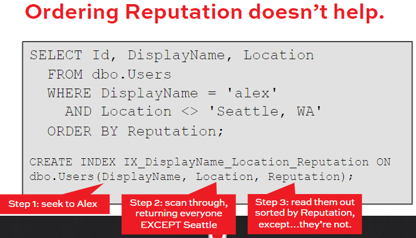
    
    To prove it, create another index:
    ```sql
    CREATE INDEX IX_DisplayName_Location_Reputation ON dbo.Users (DisplayName, Location, Reputation);
    CREATE INDEX IX_DisplayName_Location_Includes   ON dbo.Users (DisplayName, Location) INCLUDE (Reputation);
    ```
    They both get the same plan. Use an index hint to test both indexes separately. Both do the sort. And both have the same number of logical reads.

    <r>Inequality searches make it tricky.</r>
    WHERE DisplayName = 'alex'
    AND Location <>'Seattle, WA'
    ORDER BY Reputation;

    After you do an inequality search on a field, the sorting of subsequent fields in the index are usually less useful. (That’s a mouthful.)

    You have to move the ORDER BY up into the Key of the Index
    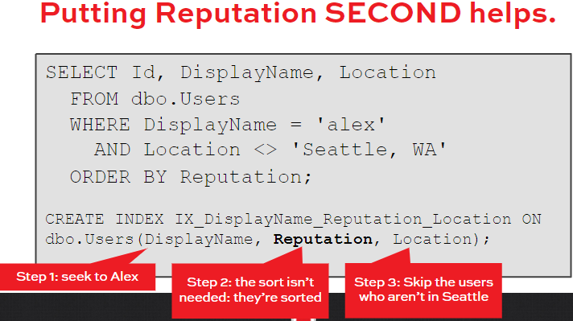

    <r>The sort is gone with this trick. Obscure trick. To get it, key on:</r>
    <r>1. Equality fields, then</r>
    <r>2. Sort fields, then</r>
    <r>3. Inequality fields</r>

    - What we have learned so far:
    1. Indexes helps pre-sorting rows to prep them for:
       1. WHERE   : finding the rows we want
       2. ORDER BY: sorting them on the way out the door
       3. GROUP BY: FROM , JOINs, CTEs
    2. TRICK
       Key on
         1. EQUALITY fields, then
         2. SORT Fields, then
         3. INEQUALITY fields

## TOP

- Design and index for this:

    ```sql
    SELECT TOP 100 Id, Reputation, CreationDate
    FROM  dbo.Users
    WHERE Reputation > 1
    ORDER BY CreationDate ASC;
    ```

    Which field should we lead with?
  
    ```sql
    SELECT TOP 100 Id, Reputation, CreationDate
    FROM   dbo.Users
    WHERE  Reputation > 1
    ORDER BY CreationDate ASC;
    
    CREATE INDEX IX_Reputation_CreationDate ON dbo.Users(Reputation  , CreationDate);
    CREATE INDEX IX_CreationDate_Reputation ON dbo.Users(CreationDate, Reputation  );
    ```

    If we lead with Reputation...
    We seek to 2, but then we find 1.4M users that match! We have to sort ‘em all by CreationDate.

    Visualize the index contents. 
    When the index is on Reputation, CreationDate, we can seek to 2, but...are the first 10 users we find the lowest CreationDates overall?
    Or just the lowest for Reputation = 2?

    ```sql
    SELECT Reputation, CreationDate, Id
    FROM   dbo.Users
    ORDER BY Reputation, CreationDate;
    ```

    It’s more obvious when we page down to higher Reputation numbers. The CreationDate keeps resetting with each new Reputation. The sort on the second field is less useful when we’re scanning.

    What if we lead with CreationDate?
    We “scan” the index, but... Remember from How to Think Like the Engine: scan just means we start at one end of the index, and we read until we find the rows that match.
    And there’s no sort! The data is already sorted.

    Visualize the index contents
    When the index is on CreationDate, Reputation, we start reading, looking for 100 users with Reputation > 1.
    They almost all match! As soon as we read 100 rows that match, we’re done. No need to scan the whole index.

    Survey says...
    Index                           Logical Reads       Total Pages in the Index
    Clustered index (white pages)   45,184              45,184
    IX_Reputation_CreationDate       3,805               6,812
    IX_CreationDate_Reputation           3               6,817

    In this case, the ORDER BY field should go first in the index

    ```sql
    SELECT TOP 100 Id, Reputation, CreationDate
    FROM dbo.Users
    WHERE Reputation > 1
    ORDER BY CreationDate ASC;

    CREATE INDEX IX_Reputation_CreationDate ON dbo.Users(Reputation, CreationDate);
    CREATE INDEX IX_CreationDate_Reputation ON dbo.Users(CreationDate, Reputation);
    ```

    Remember SELECTIVITY. TOP is kinda like a WHERE clause:

    ```sql
    SELECT ID, Reputation, CreationDate
    FROM dbo.Users
    WHERE (users is in the top 100) by CreationDate;

    DropIndexes;
    CREATE INDEX IX_CreationDate_Reputation
    ON dbo.Users(CreationDate, Reputation);
    ```

    Now run this.
   
    ```sql
    SELECT TOP 100 Id, Reputation, CreationDate
    FROM dbo.Users
    WHERE Reputation > 1000000
    ORDER BY CreationDate ASC;
    ```

    There aren’t a lot of rows with Reputation > 1,000,000.

    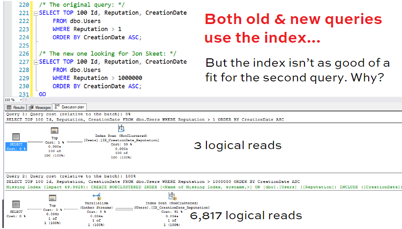

    Jon Skeet isn’t in the first 100.

    ```sql
    SELECT TOP 100 Id, Reputation, CreationDate
    FROM dbo.Users
    WHERE Reputation > 1000000
    ORDER BY CreationDate ASC;
    ```

    The TOP 100 by CreationDate is only selective IF the person you’re looking for is in that list. In this case, WHERE Reputation > 1000000 is much more selective – that should go first.


- RECAP
    If your WHERE clause is filtering just for equalities, then add the ORDER BY fields into the index key, and the index will handle all the sorting for you.
    Out here in the real world, though, your query will have a mix of equality and inequalities. 
    Different parameter values affect key order too.
    Our goal: get a good enough combination of keys to cover as many queries as practical.

- LAB 4 
    ```sql
    /* FIRST LAB CHALLENGE: design the right index for this:*/
    SELECT TOP 100 DisplayName, Location, WebsiteUrl, Reputation, Id
    FROM  dbo.Users
    WHERE Location <> ''
    AND   WebsiteUrl <> ''
    ORDER BY Reputation DESC;
    GO

    /*DATA PERFORM FROM ORIGINAL:*/
    Table 'Users'. Scan count 9, logical reads 45184

    /*QUESTION*/
	Which field should go first in the WHERE clause?
		In this case it does not matter, because the WHERE clause is an EQUALITY WHERE clause!!
	Which filter is more selective?
		WebsiteUrl is more selective

    /*REPONSE:*/
    1. CHECK SELECTIVITY
        SELECT COUNT(*) FROM dbo.Users WHERE Location <> ''
		 = 572362   records / AVG 2465713 * 100 % 105  = 0.004
        
        SELECT COUNT(*) FROM dbo.Users WHERE WebsiteUrl <> ''
		 = 339977   records / AVG 2465713 * 100 % 105  = 0.004

    2. CREATE INDEXES
	    CREATE INDEX IX_WebsiteURL_Location_Reputation_INC_DisplayName
        ON dbo.Users (WebsiteURL, Location, Reputation) INCLUDE (DisplayName)

        CREATE INDEX IX_Location_WebsiteURL_Reputation_INC_DisplayName
        ON dbo.Users (Location, WebsiteURL, Reputation) INCLUDE (DisplayName)

        CREATE INDEX IX_Reputation_Location_WebsiteURL_INC_DisplayName
        ON dbo.Users (Reputation, WebsiteURL, Location) INCLUDE (DisplayName)

        -- B.O.
        CREATE INDEX IX_Reputation_Location_WebsiteURL_INC_DisplayName
        ON dbo.Users (Reputation) INCLUDE (Location, WebsiteURL, DisplayName)

    3. TEST INDEXES
        SET STATISTICS IO ON
	
    	SELECT TOP 100 DisplayName, Location, WebsiteUrl, Reputation, Id
        FROM  dbo.Users WITH(INDEX = 1)
        WHERE Location <> ''
        AND   WebsiteUrl <> ''
        ORDER BY Reputation DESC

        SELECT TOP 100 DisplayName, Location, WebsiteUrl, Reputation, Id
        FROM  dbo.Users WITH(INDEX = IX_WebsiteURL_Location_Reputation_INC_DisplayName)
        WHERE Location <> ''
        AND   WebsiteUrl <> ''
        ORDER BY Reputation DESC

        SELECT TOP 100 DisplayName, Location, WebsiteUrl, Reputation, Id
        FROM  dbo.Users WITH(INDEX = IX_Location_WebsiteURL_Reputation_INC_DisplayName)
        WHERE Location <> ''
        AND   WebsiteUrl <> ''
        ORDER BY Reputation DESC

        SELECT TOP 100 DisplayName, Location, WebsiteUrl, Reputation, Id
        FROM  dbo.Users WITH(INDEX = IX_Reputation_Location_WebsiteURL_INC_DisplayName)
        WHERE Location <> ''
        AND   WebsiteUrl <> ''
        ORDER BY Reputation DESC

        SELECT TOP 100 DisplayName, Location, WebsiteUrl, Reputation, Id
        FROM  dbo.Users 
        WHERE Location <> ''
        AND   WebsiteUrl <> ''
        ORDER BY Reputation DESC
        ------------------------------------------------------------------------------------
        Table 'Users'. Scan count 9, logical reads 45184
        Table 'Users'. Scan count 2, logical reads 4860
        Table 'Users'. Scan count 2, logical reads 6552
        Table 'Users'. Scan count 1, logical reads 40
        Table 'Users'. Scan count 1, logical reads 40

    4. VISUALIZATION INDEX
        SELECT WebsiteURL, Location, Reputation, DisplayName
        FROM dbo.Users 
        ORDER BY WebsiteURL, Location, Reputation

        SELECT Location, WebsiteURL, Reputation, DisplayName
        FROM dbo.Users 
        ORDER BY Location, WebsiteURL, Reputation

        SELECT Reputation, WebsiteURL, Location, DisplayName
        FROM dbo.Users 
        ORDER BY Reputation, WebsiteURL, Location

    ```

    ```sql
    /* NEXT UP: We want to start encouraging people to review other folks' work and upvote it. 
    To do that, let's find the most recently created users who haven't cast an UpVote yet. 
    Then, build the right index for it. You write the query. Go for it! */

    SELECT Id, CreationDate, DisplayName, UpVotes  
    FROM   dbo.Users
    WHERE  UpVotes = 0
    ORDER BY CreationDate DESC

    /*DATA PERFORM FROM ORIGINAL:*/
    
    /*QUESTION*/
	Which field should go first in the WHERE clause?
		In this case it does not matter, because the WHERE clause is an EQUALITY WHERE clause!!
	Which filter is more selective?
		WebsiteUrl is more selective

    /*REPONSE:*/
    1. CHECK SELECTIVITY
        SELECT COUNT(*) FROM dbo.Users WHERE UpVotes = 0
		 = 572362   records / AVG 2465713 * 100 % 105  = 0.004

        SELECT TOP 100 * FROM dbo.Users ORDER BY CreationDate DESC
		 = 572362   records / AVG 2465713 * 100 % 105  = 0.004

    2. CREATE INDEXES
	    CREATE INDEX IX_UpVotes_CreationDate_DisplayName
        ON dbo.Users(UpVotes, CreationDate)
        INCLUDE (DisplayName)

        CREATE INDEX IX_CreationDate_UpVotes_DisplayName
        ON dbo.Users(CreationDate, UpVotes)
        INCLUDE (DisplayName)

        -- B.O.
        CREATE INDEX IX_CreationDate_UpVotes_DisplayName
        ON dbo.Users(CreationDate)
        INCLUDE (UpVotes)

        CREATE INDEX IX_CreationDate_UpVotes_DisplayName
        ON dbo.Users(UpVotes, CreationDate)

    3. TEST INDEXES
        SET STATISTICS IO ON
	
    	SELECT Id, CreationDate, DisplayName, UpVotes  
        FROM   dbo.Users WITH (INDEX = 1)
        WHERE  UpVotes = 0
        ORDER BY CreationDate DESC

        SELECT Id, CreationDate, DisplayName, UpVotes  
        FROM   dbo.Users WITH(INDEX = IX_UpVotes_CreationDate_DisplayName)
        WHERE  UpVotes = 0
        ORDER BY CreationDate DESC

        SELECT Id, CreationDate, DisplayName, UpVotes  
        FROM   dbo.Users WITH(INDEX = IX_CreationDate_UpVotes_DisplayName)
        WHERE  UpVotes = 0
        ORDER BY CreationDate DESC

        SELECT Id, CreationDate, DisplayName, UpVotes  
        FROM   dbo.Users 
        WHERE  UpVotes = 0
        ORDER BY CreationDate DESC
        ------------------------------------------------------------------------------------
        Table 'Users'. Scan count 9, logical reads 45184
        Table 'Users'. Scan count 1, logical reads 10095
        Table 'Users'. Scan count 1, logical reads 13839
        Table 'Users'. Scan count 1, logical reads 10095

    4. VISUALIZATION INDEX
        SELECT UpVotes, CreationDate, DisplayName
        FROM dbo.Users
        ORDER BY UpVotes, CreationDate, DisplayName

        SELECT CreationDate, UpVotes, DisplayName
        FROM dbo.Users
        ORDER BY CreationDate, UpVotes, DisplayName
    ```

    ```sql
    /* NEXT CHALLENGE: User Id #22656 is lonely. Let's build a dating service query to find all of the people who live in his country. 
       He'll probably want to find friendly people, so let's filter for a few things: */
    SELECT DisplayName, Location, Reputation, WebsiteUrl, Id
    FROM dbo.Users
    WHERE Age > 21
        AND (Location LIKE '%United Kingdom%' OR Location LIKE '%UK%')
        AND DownVotes < 1000
        AND UpVotes > 1
    ORDER BY Reputation DESC, Location;
    GO

    /*DATA PERFORM FROM ORIGINAL:*/
    Table 'Users'. Scan count 1, logical reads 44530

    /*QUESTION*/
	Which field should go first in the WHERE clause?
	Which filter is more selective?

    /*REPONSE:*/
    1. CHECK SELECTIVITY
        SELECT COUNT(*) FROM dbo.Users WHERE Age > 21
         = 0   records / AVG 2465713 * 100 % 105  = 0.004

        SELECT COUNT(*) FROM dbo.Users WHERE Location LIKE '%United Kingdom%'
         = 28719   records / AVG 2465713 * 100 % 105  = 0.004

        SELECT COUNT(*) FROM dbo.Users WHERE Location LIKE '%UK%'
         = 12118   records / AVG 2465713 * 100 % 105  = 0.004

        SELECT COUNT(*) FROM dbo.Users WHERE DownVotes < 1000
         = 2464327   records / AVG 2465713 * 100 % 105  = 0.004
        
        SELECT COUNT(*) FROM dbo.Users WHERE UpVotes   > 1
         = 621154   records / AVG 2465713 * 100 % 105  = 0.004

    2. CREATE INDEXES
        CREATE INDEX IX_Age_Location_UpVotes_DownVotes_Reputation_INC_DisplayName
        ON dbo.Users(Age, Location, UpVotes, DownVotes, Reputation) INCLUDE (DisplayName, WebsiteUrl)

        CREATE INDEX IX_Reputation_Age_Location_UpVotes_DownVotes_INC_DisplayName
        ON dbo.Users(Reputation, Age, Location, UpVotes, DownVotes) INCLUDE (DisplayName, WebsiteUrl)

        CREATE INDEX IX_Reputation_Location_Age_UpVotes_DownVotes_INC_DisplayName
        ON dbo.Users(Reputation, Location, Age, UpVotes, DownVotes) INCLUDE (DisplayName, WebsiteUrl)

        CREATE INDEX IX_Age_INC_Location_UpVotes_DownVotes_Reputation__DisplayName
        ON dbo.Users(Age) INCLUDE (Location, UpVotes, DownVotes, Reputation, DisplayName, WebsiteUrl)

        -- B.O.
        CREATE INDEX IX_Age_INC_Location_UpVotes_DownVotes_Reputation__DisplayName
        ON dbo.Users(Age)

    3. TEST INDEXES
        SET STATISTICS IO ON

        IX_Age_Location_UpVotes_DownVotes_Reputation_INC_DisplayName
        ------------------------------------------------------------------------------------
        Table 'Users'. Scan count 1, logical reads 3

    4. VISUALIZATION INDEX
        SELECT Age, Location, UpVotes, DownVotes, Reputation, DisplayName, WebsiteUrl
        FROM dbo.Users
        ORDER BY Reputation, Age, Location, UpVotes, DownVotes, DisplayName, WebsiteUrl

        SELECT Reputation, Age, Location, UpVotes, DownVotes, DisplayName, WebsiteUrl
        FROM dbo.Users
        ORDER BY Reputation, Age, Location, UpVotes, DownVotes, DisplayName, WebsiteUrl

        SELECT Reputation, Location, Age, UpVotes, DownVotes, DisplayName, WebsiteUrl
        FROM dbo.Users
        ORDER BY Reputation, Location, Age, UpVotes, DownVotes, DisplayName, WebsiteUrl

        SELECT Age, Location, UpVotes, DownVotes, Reputation, DisplayName, WebsiteUrl
        FROM dbo.Users
        ORDER BY Age, Location, UpVotes, DownVotes, Reputation, DisplayName, WebsiteUrl
    ```    

    ```sql
    /* NEXT CHALLENGE: User Id #22656 is lonely. Let's build a dating service query to find all of the people who live in his country. 
       He'll probably want to find friendly people, so let's filter for a few things: */
    SELECT TOP 100 CreationDate, LastAccessDate, DisplayName, Reputation, Id
    FROM    dbo.Users
    WHERE   CreationDate = LastAccessDate
    AND     Reputation <> 1
    ORDER BY Reputation DESC;
    GO

    /*DATA PERFORM FROM ORIGINAL:*/
    Table 'Users'. Scan count 9, logical reads 45184

    /*QUESTION*/
	Which field should go first in the WHERE clause?
	Which filter is more selective?

    /*REPONSE:*/
    1. CHECK SELECTIVITY
        SELECT COUNT(*) FROM dbo.Users WHERE 
         =    records / AVG 2465713 * 100 % 105  = 0.004

    2. CREATE INDEXES
        CREATE NONCLUSTERED INDEX [<Name of Missing Index, sysname,>]
        ON [dbo].[Users] ([Reputation])
        INCLUDE ([CreationDate],[DisplayName],[LastAccessDate])
        GO
        
    3. TEST INDEXES
        SET STATISTICS IO ON
        
        SELECT TOP 100 CreationDate, LastAccessDate, DisplayName, Reputation, Id
        FROM    dbo.Users
        WHERE   CreationDate = LastAccessDate
        AND     Reputation <> 1
        ORDER BY Reputation DESC;
        GO
        
        ------------------------------------------------------------------------------------
        Table 'Users'. Scan count 1, logical reads 595

    4. VISUALIZATION INDEX
        SELECT Reputation, CreationDate,DisplayName,LastAccessDate
        FROM dbo.Users
        ORDER BY Reputation DESC
    ```    

    ```sql
    /* BONUS QUESTION: you've created a few indexes so far. Now, looking at those indexes, try to craft a query that could 
    maybe use those indexes, but won't. For example, try to write one where the index doesn't quite cover, and make
    SQL Server choose between an index seek + key lookup, versus a table scan, and choose your filters carefully to make 
    SQL Server think it's going to find so much data that it's better off just scanning the clustered index instead.
    */

    /*DATA PERFORM FROM ORIGINAL:*/
    Table 'Users'. Scan count 9, logical reads 45184

    /*QUESTION*/
	Which field should go first in the WHERE clause?
	Which filter is more selective?

    /*REPONSE:*/
    1. CHECK SELECTIVITY
        SELECT COUNT(*) FROM dbo.Users WHERE 
         =    records / AVG 2465713 * 100 % 105  = 0.004

    2. CREATE INDEXES
        
        
    3. TEST INDEXES
        SET STATISTICS IO ON
        
        ------------------------------------------------------------------------------------
        Table 'Users'. Scan count 1, logical reads 595

    4. VISUALIZATION INDEX
        
    ```


## JOINs

- One Join (never in the real life)
    Show everyone’s comments

    ```sql
    SELECT u.DisplayName, c.CreationDate, c.Text
    FROM dbo.Users u
    INNER JOIN dbo.Comments c
    ON u.Id = c.UserId;
    ```

    Don’t run this. It’ll take forever. And in reality, you’d never write this query. Just get the estimated plan

    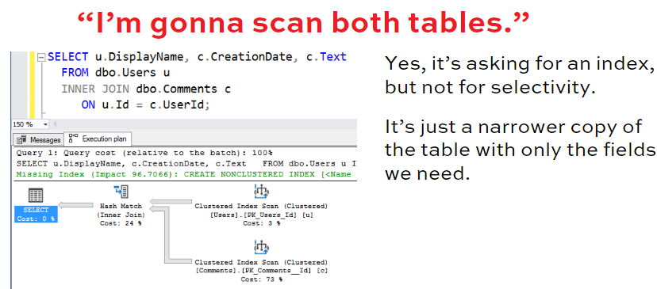

    A more realistic query:

    ```sql
    SELECT u.DisplayName, c.CreationDate, c.Text
    FROM dbo.Users u
    INNER JOIN dbo.Comments c
    ON u.Id = c.UserId
    WHERE u.DisplayName = 'Brent Ozar';
    ```

    Run this, get the actual plan, and add indexes to make it faster.

    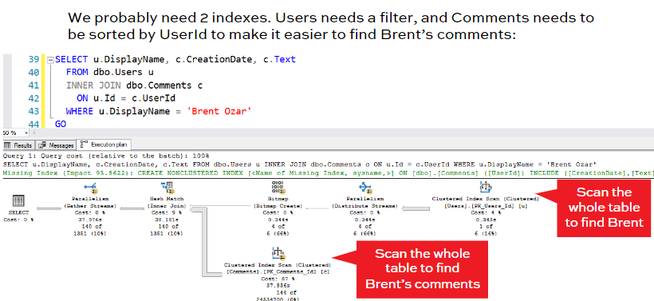
    
    These two indexes will help:

    ```SQL
    CREATE INDEX IX_DisplayName ON dbo.Users(DisplayName);
    CREATE INDEX IX_UserId ON dbo.Comments(UserId);
    ```

    Note that Clippy only suggested one index. (He ain’t perfect. More on that later.) Also note that I didn’t include Comments.Text.

    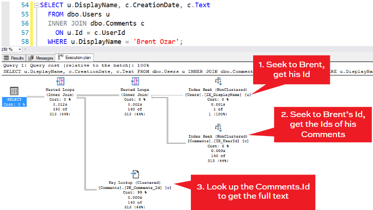

- JOIN + ORDER BY
    That was a JOIN with a WHERE.
    ```sql
    SELECT u.DisplayName, c.CreationDate, c.Text
    FROM   dbo.Users u
    JOIN   dbo.Comments c
    ON     u.Id = c.UserId
    WHERE  u.DisplayName = 'Brent Ozar'
    ORDER BY c.CreationDate;
    ```
    What’s the right index on Comments?
    With our current indexes... The plan added this new sort. Can we remove this with an index?. NO

    SQL Server already has its data. It already got all the data it needed from:
    1. The index seek on Comments.UserId
    2. The key lookup on the Comments clustered index
    It won’t go back later and use another index to support a sort. It’s gotta already be sorted after we get it.

    Phone book example
    “Find all the businesses that start with Smith%.”
    “Then, alphabetize them by business type.”

    Phone book example
    “Find all the businesses that start with Smith%.”
    First: use the white pages to find them.
    “Then, alphabetize them by business type.”
    Second: use the yellow pages to sort them?

    Instead, change the existing index. We have an index on Comments.UserId. What if we just add CreationDate as a second key?
    ```sql
    CREATE NONCLUSTERED IX_UserId_CreationDate
    ON dbo.Users(UserId_CreationDate,)
    ```

    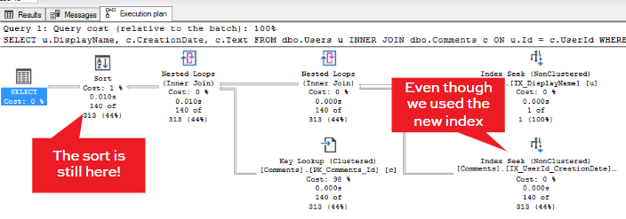

    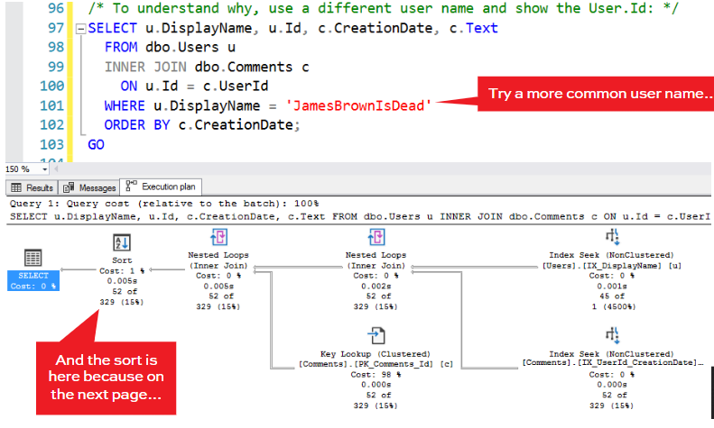

    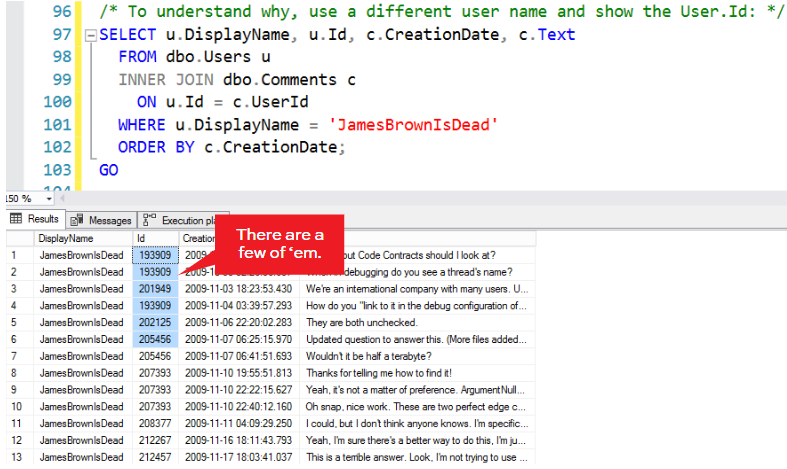


    I love this query.
    It’s a great, simple example of multiple challenges with indexing real-world queries:
    • Filters
    • Joins
    • Ordering
    It’s about experimentation and compromise.

    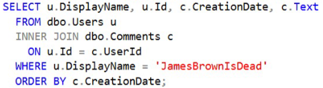

    And keep things in perspective:
                                                                                Logical reads
    Clustered indexes, filtering for Brent’s comments, order by CreationDate    1,079,417
    Add index on Comments.UserId                                                   46,012
    Add index on Users.DisplayName                                                    583
    Tweak Comments.UserId index to also include CreationDate                          584
    
    These are all huge improvements! Don’t get too hung up on the tiniest details.

- MIXING JOINS AND FILTERS

    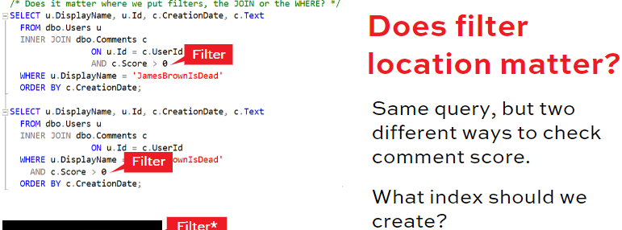

    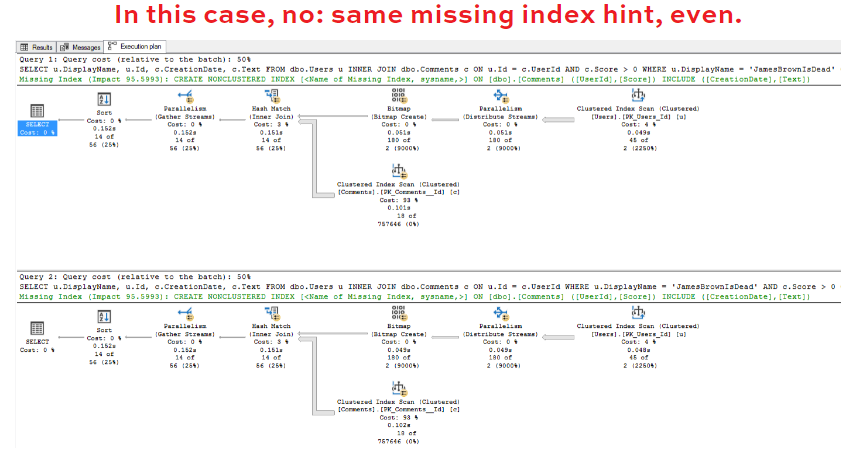

    But this opens a can of worms. In theory, how you write your query shouldn’t matter. In practice, it does: 
    http://michaeljswart.com/2013/01/joins-are-commutative-and-sql-server-knows-it/

    The more complex your query becomes, the harder it is to figure out which operations should be done first. How the data comes out affects the next operation.

- LOTS OF JOINS

    Say I wanna find and render this comment at the bottom. I need:
    • The question
    • The answer
    • The comment
    
    Questions & answers are both stored in dbo.Posts

    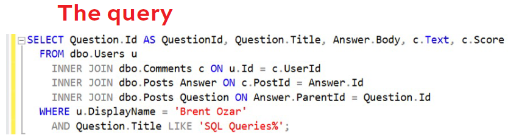

    I’m filtering at both ends of the join:
    • Users named Brent Ozar
    • Questions titled “SQL Queries”

    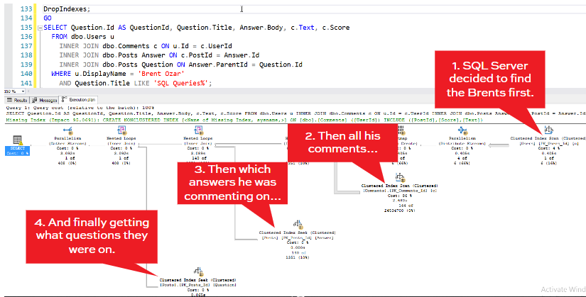

    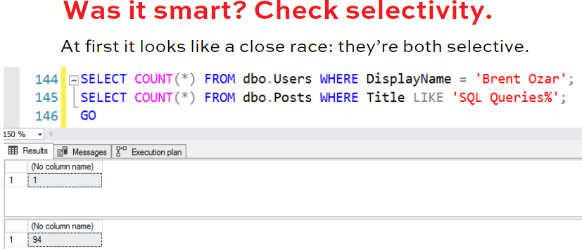

    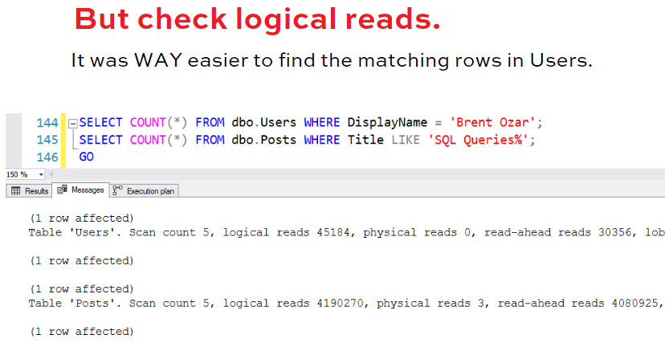

    - SELECTIVITY isavboutone more thing
    How big is the forest?
    SQL Server considers...
    How big is the object we need to read?(Think number of 8KB pages, not rows or columns)
    How selective are the query filters on this object?
    When we read data out of this object, what order will it be in? Does that help the next operation?
    (And much, much more.)

    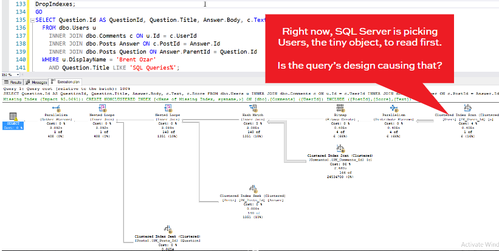

    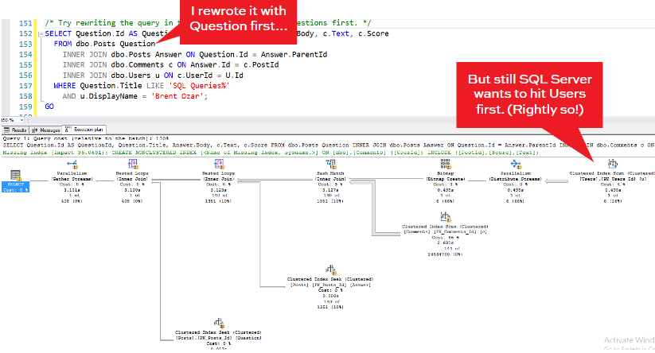

    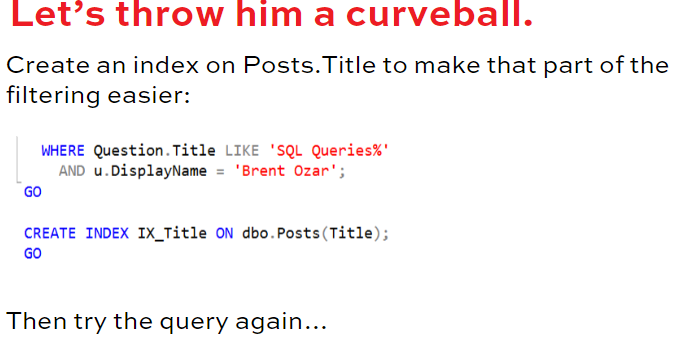

    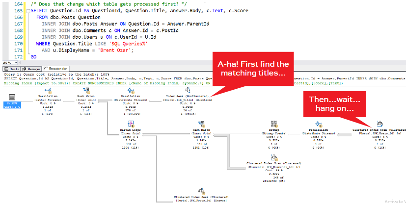

    What you thought would happen
    1. Find Questions where Title like ’SQL Queries%’ 
    2. Find the Answers on those questions
    3. Find the Comments on those answers
    4. Look up the Users for each of those comments, and check to see if they’re Brent Ozar

    But that’s not what happened.

    What actually happened
    5. Find Questions where Title like ‘SQL Queries%’
    Meanwhile, AT THE SAME TIME: 
    6. Find the users named Brent Ozar
    7. Find the Comments they’ve left
    8. Look up what Answers they were placed on
    9. Then finally, join this to the SQL Query questions

    Looking at the big picture
                                                Logical Reads
    Clustered index scans                       1,077,747
    Add index on Posts.Title                    1,077,063
    That, PLUS add index on Comments.UserId        46,600
    That, PLUS add index on Users.DisplayName       1,165
    Or what if we start over, and only add an index on Comments.UserId? 47,373

    <r>When you look at that query, your first instinct is probably to index the stuff in the WHERE clause. And that’s totally okay. That helps.</r>
    <r>But indexing to support joins is super important too.</r>

    - <r>Index your foreign keys</r>
    That’s where this advice comes from. It’s not just about making it easier for SQL Server to enforce foreign key relationships (which helps too.) It’s also because you often join on these keys.

    It’s a good starting point when you have no idea what indexes to build on a table. It’s just not the finish line.

- WHERE EXISTS

    Exists is kinda like a join, too
    ```sql
    SELECT *
    FROM dbo.Users u
    WHERE u.Location = 'Antarctica'
    AND EXISTS (SELECT 1/0 FROM dbo.Comments c WHERE u.Id = c.UserId)
    ```
    What indexes do I need on these tables?

    SQL Server’s thought process
    “It’s easy for me to scan the small Users table and find all the few people in Antarctica.”
    “However, once I’ve found their list of User Ids, it’s gonna be painful for me to scan the giant Comments table to find their comments.”
    “The most efficient index would be on Comments.UserId.”

    We created the index but then SQL request for another on Location.

- RECAP
Joins are interesting.

  - Joins are like filters: only show me the rows from Table1 that have a matching partner in Table2.
  - Their selectivity isn’t just about row count: also size.
  - Join operations can benefit from pre-sorting:
    - if I want to join two tables together, it can help if they’re already sorted in order.
  - Join-supporting indexes radically change plan shape.

-  LAB 6 
    ```sql
    /* THIS TIME, IT'S ALL YOU: you've learned a process, and now I'm going to leave it to you to work through the process.
    You have one commandment though: you're not allowed to index any >200 byte fields, like NVARCHAR(500) or VARCHAR(500). 
    Not allowed to use 'em as includes, either. Here's your first query: find the users in Antarctica, and list their highly
    upvoted comments sorted from newest to oldest. */
    SELECT u.DisplayName, u.Location, c.Score AS CommentScore, c.Text AS CommentText
    FROM  dbo.Users u
    JOIN  dbo.Comments c ON u.Id = c.UserId
    WHERE u.Location = 'Antarctica'
    AND   c.Score > 0
    ORDER BY c.CreationDate;
    GO


    -- B.O
    FROM dbo.Users u
    WHERE u.Location = 'Antarctica'
    AND   u.Id IN (1, 2, 3, 4, 5 .....)

    SELECT COUNT(*) FROM dbo.USers WHERE Location = 'Antarctica'

    FROM dbo.Comments c
    WHERE c.Score > 0
    AND   cUserId IN (5, 4, 3, 2, 1 ....)
    ORDER BY c.CreationDate;

    SELECT COUNT(*) FROM dbo.Comments WHERE Score > 0

    CREATE INDEX IX_UserId ON dbo.Comments(UserId) INCLUDE(Score)

    /*DATA PERFORM FROM ORIGINAL:*/
    Table 'Users'.    Scan count 1, logical reads 44530
    Table 'Comments'. Scan count 9, logical reads 1029372, physical reads 298


    /*QUESTION*/
	Which field should go first in the WHERE clause?
		In this case it does not matter, because the WHERE clause is an EQUALITY WHERE clause!!
	Which filter is more selective?
		WebsiteUrl is more selective

    /*REPONSE:*/
    1. CHECK SELECTIVITY

    2. CREATE INDEXES
        CREATE INDEX IX_Location ON dbo.Users(Location) INCLUDE (DisplayName)
	    -- CREATE INDEX IX_UserId ON dbo.Comments(UserId, Score) INCLUDE(CreationDate)
        CREATE INDEX IX_UserId ON dbo.Comments(UserId) INCLUDE(Score) -- From BO

    3. TEST INDEXES
        SET STATISTICS IO ON
	
        With 1 index (Comments)
        SELECT u.DisplayName, u.Location
            , c.Score AS CommentScore, c.Text AS CommentText
        FROM  dbo.Users u
        JOIN  dbo.Comments c 
        ON    u.Id = c.UserId
        WHERE u.Location = 'Antarctica'
        AND   c.Score > 0
        ORDER BY c.CreationDate;
        GO

        

        With 2 indexes (Comments and Users)
        SELECT u.DisplayName, u.Location
            , c.Score AS CommentScore, c.Text AS CommentText
        FROM  dbo.Users u
        JOIN  dbo.Comments c
        ON    u.Id = c.UserId
        WHERE u.Location = 'Antarctica'
        AND   c.Score > 0
        ORDER BY c.CreationDate;
        GO

        
        ------------------------------------------------------------------------------------
        Table 'Comments'. Scan count 27, logical reads 3057
        Table 'Users'.    Scan count 1, logical reads 44530

        Table 'Comments'. Scan count 27, logical reads 3030
        Table 'Users'.    Scan count 1, logical reads 3
        

    4. VISUALIZATION INDEX

    ```

    ```sql
    /* NEXT CHALLENGE: take that same list of Antarctica comments, but now I also want to see the post that they 
    commented on. I'm adding a join: */
    SELECT u.DisplayName, u.Location, c.Score AS CommentScore, c.Text AS CommentText
    FROM  dbo.Users u
    JOIN  dbo.Comments c ON u.Id = c.UserId
    WHERE u.Location = 'Antarctica'
    AND   c.Score > 0
    ORDER BY c.CreationDate;
    GO

    /*DATA PERFORM FROM ORIGINAL:*/
    Table 'Users'. Scan count 1, logical reads 44530
    Table 'Posts'. Scan count 0, logical reads 5574
    Table 'Comments'. Scan count 9, logical reads 1029437

    /*QUESTION*/
	Which field should go first in the WHERE clause?
		In this case it does not matter, because the WHERE clause is an EQUALITY WHERE clause!!
	Which filter is more selective?
		WebsiteUrl is more selective

    /*REPONSE:*/
    1. CHECK SELECTIVITY


    2. CREATE INDEXES
        CREATE INDEX IX_Location ON dbo.Users(Location) INCLUDE(DisplayName)
        CREATE INDEX IX_UserId_Score ON dbo.Comments(UserID, Score) INCLUDE(CreationDate)
	    CREATE INDEX IX_UserId_Score_CreationDate ON dbo.Comments(UserID, Score, CreationDate)


    3. TEST INDEXES
        SET STATISTICS IO ON
        
        SELECT u.DisplayName, u.Location
            , p.Title AS PostTitle, p.Id AS PostId
            , c.Score AS CommentScore, c.Text AS CommentText
        FROM dbo.Users u
        JOIN dbo.Comments c 
        ON   u.Id = c.UserId
        JOIN dbo.Posts p 
        ON   c.PostId = p.Id

        WHERE u.Location = 'Antarctica'
        AND   c.Score > 0

        ORDER BY c.CreationDate;
        GO	
        ------------------------------------------------------------------------------------
        Table 'Posts'.    Scan count 0 , logical reads 2946
        Table 'Comments'. Scan count 27, logical reads 4025
        Table 'Users'.    Scan count 1 , logical reads 3
                

    4. VISUALIZATION INDEX

    ```

    ```sql
    /* NEXT CHALLENGE: in that Antarctica comment list, you probably noticed that some of the PostTitles are null.

    That's because at Stack, you can leave comments on both questions AND answers. To see it in action, look 
    at the comments on the questions & answers on this: https://stackoverflow.com/questions/923039

    So let's make our query a little more complex: I only want to see comments on answers, and I want the results 
    to have:

    * The question title
    * The person who posted the question
    * The answer text
    * The person who posted the answer
    * The comment text

    So my query looks like this:  */
    SELECT u.DisplayName, u.Location, 
    Question.Title AS QuestionTitle, Question.Id AS QuestionId, 
    QuestionUser.DisplayName AS QuestionUserDisplayName,
    Answer.Body AS AnswerBody, AnswerUser.DisplayName AS AnswerUserDisplayName,
    c.Score AS CommentScore, c.Text AS CommentText, c.CreationDate
    FROM dbo.Users u
    INNER JOIN dbo.Comments c ON u.Id = c.UserId
    INNER JOIN dbo.Posts Answer ON c.PostId = Answer.Id
    INNER JOIN dbo.PostTypes pt ON Answer.PostTypeId = pt.Id
    INNER JOIN dbo.Users AnswerUser ON Answer.OwnerUserId = AnswerUser.Id
    INNER JOIN dbo.Posts Question ON Answer.ParentId = Question.Id
    INNER JOIN dbo.Users QuestionUser ON Question.OwnerUserId = QuestionUser.Id
    WHERE u.Location = 'Antarctica'
    AND c.Score > 0
    AND pt.Type = 'Answer'
    ORDER BY c.CreationDate;
    GO

    /*DATA PERFORM FROM ORIGINAL:*/    
    Table 'PostTypes'.	Scan count 1  , logical reads 2
    Table 'Users'.		Scan count 1  , logical reads 48042
    Table 'Posts'.		Scan count 723, logical reads 5829
    Table 'Comments'.	Scan count 9  , logical reads 1029367

    /*QUESTION*/
	Which field should go first in the WHERE clause?
		In this case it does not matter, because the WHERE clause is an EQUALITY WHERE clause!!
	Which filter is more selective?
		WebsiteUrl is more selective

    /*REPONSE:*/
    1. CHECK SELECTIVITY

    2. CREATE INDEXES
        CREATE INDEX IX_Location ON dbo.Users(Location) INCLUDE(DisplayName)
        CREATE INDEX IX_UserId_Score ON dbo.Comments(UserID, Score) INCLUDE(CreationDate)        
        CREATE INDEX IX_Type ON dbo.PostTypes(Type)

    3. TEST INDEXES
        SET STATISTICS IO ON        
        
        ------------------------------------------------------------------------------------
        Table 'PostTypes'. Scan count 0 , logical reads 734
        Table 'Users'.     Scan count 1 , logical reads 2253
        Table 'Posts'.     Scan count 0 , logical reads 5838
        Table 'Comments'.  Scan count 27, logical reads 3935
                

        Table 'PostTypes'. Scan count 0 , logical reads 734
        Table 'Users'.     Scan count 1 , logical reads 2253
        Table 'Posts'.     Scan count 0 , logical reads 5838
        Table 'Comments'.  Scan count 27, logical reads 3030
        

    4. VISUALIZATION INDEX

    ```

    ```sql
    /* BONUS QUESTION: Hey, that wasn't so bad, was it? Let's just make one tiny change. Instead of Antarctica, 
    let's look for - oh I dunno, let's say... */
    SELECT u.DisplayName, u.Location, 
        Question.Title AS QuestionTitle, Question.Id AS QuestionId, 
        QuestionUser.DisplayName AS QuestionUserDisplayName,
        Answer.Body AS AnswerBody, AnswerUser.DisplayName AS AnswerUserDisplayName,
        c.Score AS CommentScore, c.Text AS CommentText, c.CreationDate
    FROM dbo.Users u
    INNER JOIN dbo.Comments c ON u.Id = c.UserId
    INNER JOIN dbo.Posts Answer ON c.PostId = Answer.Id
    INNER JOIN dbo.PostTypes pt ON Answer.PostTypeId = pt.Id
    INNER JOIN dbo.Users AnswerUser ON Answer.OwnerUserId = AnswerUser.Id
    INNER JOIN dbo.Posts Question ON Answer.ParentId = Question.Id
    INNER JOIN dbo.Users QuestionUser ON Question.OwnerUserId = QuestionUser.Id
    WHERE u.Location = 'United States'
        AND c.Score > 0
        AND pt.Type = 'Answer'
    ORDER BY c.CreationDate;
    GO

    /*DATA PERFORM FROM ORIGINAL:*/    
    Table 'PostTypes'. Scan count 1     , logical reads 2
    Table 'Users'.     Scan count 9     , logical reads 475705
    Table 'Comments'.  Scan count 9     , logical reads 1029657
    Table 'Posts'.     Scan count 97570 , logical reads 1209111

    /*QUESTION*/
	Which field should go first in the WHERE clause?
		In this case it does not matter, because the WHERE clause is an EQUALITY WHERE clause!!
	Which filter is more selective?
		WebsiteUrl is more selective

    /*REPONSE:*/
    1. CHECK SELECTIVITY

    2. CREATE INDEXES
        CREATE INDEX IX_Location ON dbo.Users(Location) INCLUDE(DisplayName)
        CREATE INDEX IX_UserId_Score ON dbo.Comments(UserID, Score) INCLUDE(CreationDate)

    3. TEST INDEXES
        SET STATISTICS IO ON
        ------------------------------------------------------------------------------------
        Table 'PostTypes'. Scan count 1     , logical reads 2
        Table 'Users'.     Scan count 9     , logical reads 428692
        Table 'Posts'.     Scan count 97570 , logical reads 629318
        Table 'Comments'.  Scan count 8704  , logical reads 562573


    4. VISUALIZATION INDEX

    ```


## The built-in missing index recommendations

- Index hints are a gift
    They’re a byproduct of plan compilation, but they’re not the main deliverable.
        • Shown in execution plans
        • Tracked over time in DMVs like sys.dm_db_missing_index_details
        • Shown in tools like sp_BlitzIndex

    But they’re not perfect gifts.
        Suggests super wide indexes
        Doesn’t de-duplicate requests
        Don’t get thrown for all queries
        Get cleared at tricky times
        Doesn’t recommend filtered, columnstore, indexed views, XML, spatial, in-memory OLTP

- Let’s see how he does it
    

    

    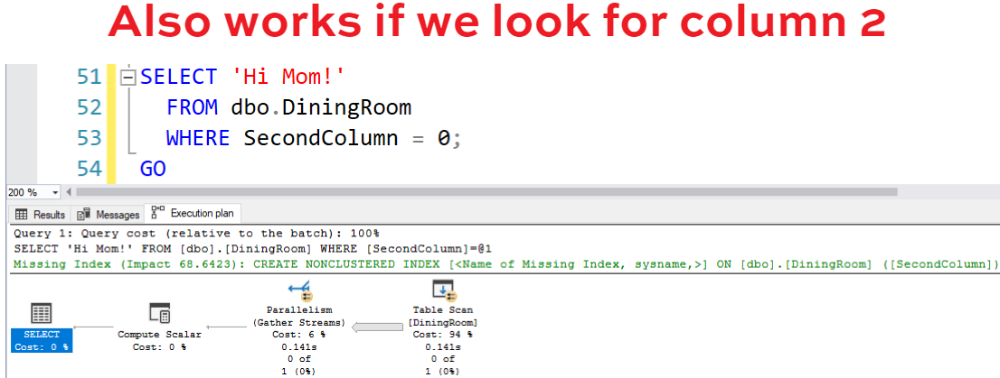

    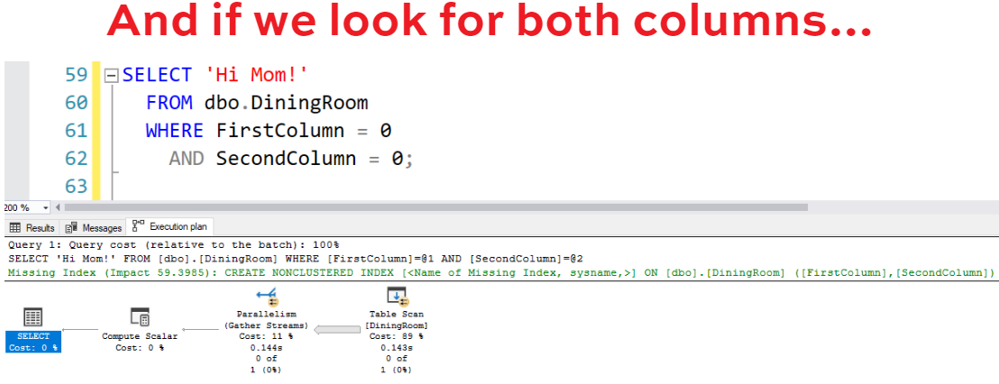

- So far, not bad
    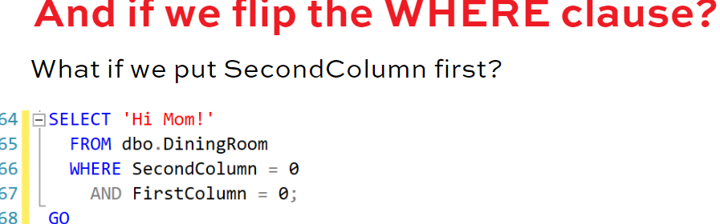

    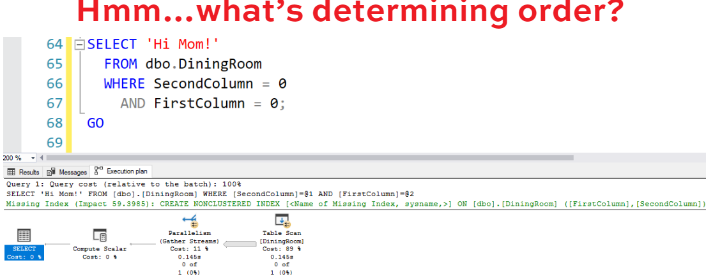

    

    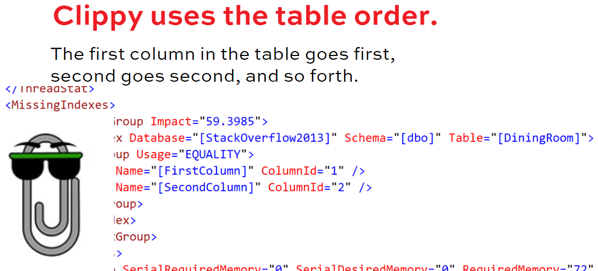

    It’s just a little bit more complex...Clippy picks key order using:
        • Equality searches (=, IS NULL, IN a list of 1) ordered by the column they are in the table.
        • Inequality search columns (<, >, LIKE, IS NOT NULL, IN a list of 2 or more) ordered by the column they are in the table.

    Clippy can’t consider:
        How often you filter on a field
        How selective your filter clause is
        The size of the field
        What you do further upstream (joining, grouping, ordering)

- He is focus on WHERE, not GROUP BY or ORDER BY
    Order the whole table
    ```sql
    SELECT Id FROM dbo.Users ORDER BYDisplayName;
    ```

    Filter, then order by
    ```sql
    SELECT Id FROM dbo.Users WHERE Location  = 'India' ORDER BYDisplayName;
    ```

    Clippy just INCLUDEs DisplayName, figuring he’s going to sort all of the people in India by name, every single time this query runs. Another blind spot.

    What’s he suggest for this?
    ```sql
    SELECT Location, COUNT(*)
    FROM dbo.Users
    GROUP BY Location
    ORDER BY COUNT(*) DESC;
    ```

    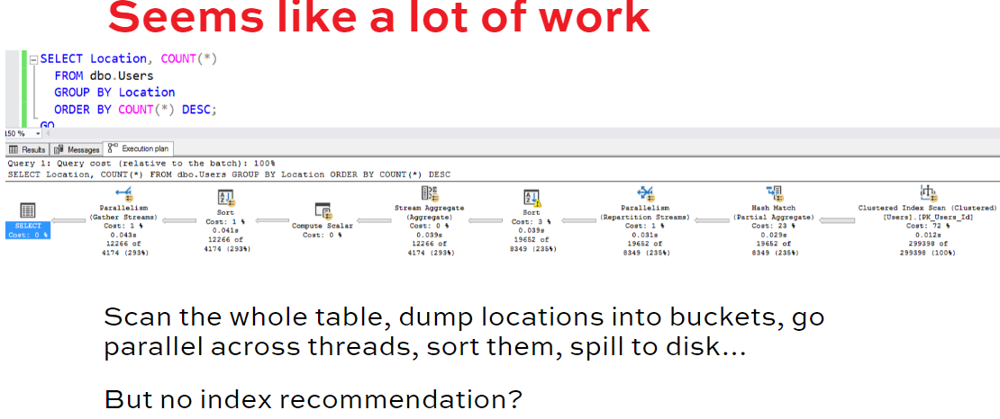

    Try creating one by hand.
    ```sql
    CREATE INDEX IX_Location ON dbo.Users(Location);
    ```

    He uses the index Way faster. Single-threaded. Great estimates. No spills to disk

- Addeding Clippy/s indexes can even make things worse
    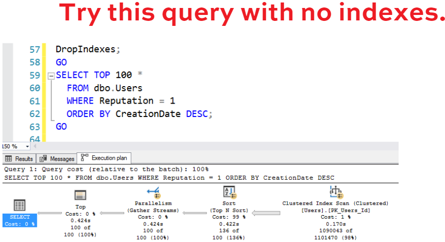

    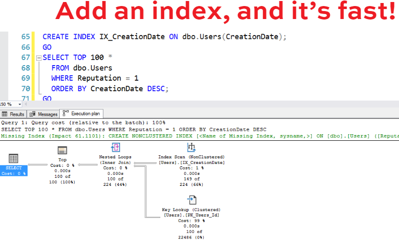

    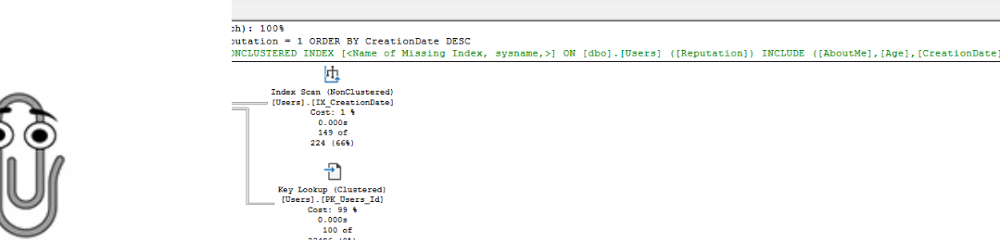

    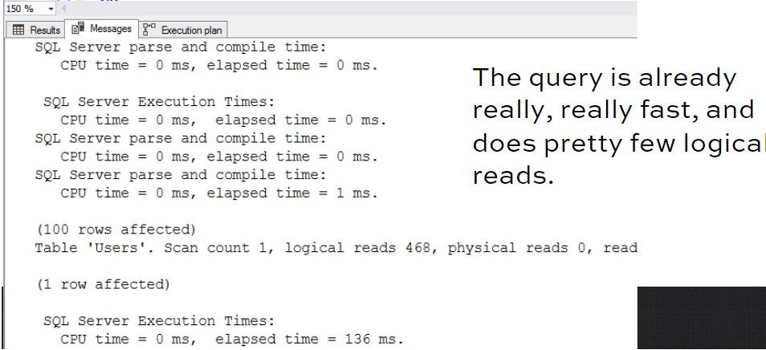

    

    We create it. It doesn’t get used!
    Drop the old IX_CreationDate...And the index gets used, but...that sort!
    Now we’re sorting 1M rows. CPU time, elapsed time, and logical reads are all WORSE than the original query.
    Clippy was on to something. An index tweak will help – just not the index Clippy wanted. Key on both fields, and the sort is gone.

    What we saw
    A query wasn’t terribly slow, but SQL Server asked for an index
    If this was a frequent query, that index might seem attractive
    But the requested index had the ORDER BY column as an include, when it really needs to be sorted
    The query was much better with that column in the key

    How to identify it
    Look for high average CPU and reads on top plans
    Dig into every operator
    In the real world on big plans, this is time consuming
    You have to rule out other things that may be the issue, such as parameter sniffing and inefficient or out of date statistics

- RECAP
You don’t always get missing index requests. Even when you do, Clippy’s not putting much work in:
    • Equality searches first, then inequality searches
    • Fields ordered by their position in the table
    • He’s completely focused on the WHERE


- LAB 7
    ```sql
    /* (I don't teach this during the regular live classes anymore - I've expanded the other material so it ends up taking more than a 
    day - but I leave it in the recordings in case folks are interested in doing it.) Now, it’s your turn: take the below queries and 
    run them all at once without looking at ’em. Then, use sp_BlitzIndex to read the missing index recommendations, interpret them, 
    and try to craft better indexes WITHOUT LOOKING  AT THE QUERIES. 
    Then, after you’ve made the list of indexes you want to create, go through the queries and try to guess which query triggered 
    which missing index request – and whether your index is a good fit. */

    /* This stored procedure drops all nonclustered indexes: */
    DropIndexes;
    GO

    SET STATISTICS IO, TIME OFF;
    GO
    /* Which badges are earned most often by people from Antarctica? */
    SELECT b.Name, COUNT(*) AS BadgesEarned
    FROM dbo.Users u
    INNER JOIN dbo.Badges b ON u.Id = b.UserId
    WHERE u.Location = 'Antarctica'
        AND b.Date BETWEEN '2008/01/01' AND '2008/12/31'
    GROUP BY b.Name
    ORDER BY COUNT(*) DESC;

    /* Who has earned the rarest badges? */
    WITH RarestBadges AS (SELECT TOP 100 rare.Name, COUNT(*) AS BadgesEarned
                            FROM dbo.Badges rare
                            GROUP BY rare.Name
                            ORDER BY COUNT(*))
    SELECT r.Name AS BadgeName, r.BadgesEarned PeopleWhoEarnedIt, u.DisplayName, u.Location, u.Reputation, u.Id AS UserId
    FROM RarestBadges r
    INNER JOIN dbo.Badges b ON r.Name = b.Name
    INNER JOIN dbo.Users u ON b.UserId = u.Id
    ORDER BY r.BadgesEarned, r.Name, u.DisplayName;

    /* What are the highest-scored SQL Server questions? */
    SELECT TOP 100 p.Score, p.Title, p.Tags, p.ViewCount
    FROM dbo.Posts p
    INNER JOIN dbo.PostTypes pt ON p.PostTypeId = pt.Id
    WHERE pt.Type = 'Question'
        AND p.Tags LIKE '%<sql-server>%'
    ORDER BY p.Score DESC;

    /* Who posts the most zero-score SQL Server questions? */
    SELECT TOP 100 u.DisplayName, u.Location, u.Id, COUNT(*) AS Recs
    FROM dbo.Posts p
    INNER JOIN dbo.PostTypes pt ON p.PostTypeId = pt.Id
    INNER JOIN dbo.Users u ON p.OwnerUserId = u.Id
    WHERE p.Score = 0
        AND pt.Type = 'Question'
        AND p.Tags LIKE '%<sql-server>%'
    GROUP BY u.DisplayName, u.Location, u.Id
    ORDER BY COUNT(*) DESC;

    /* Awww, poor Gopal. Let's see what he asked: */
    SELECT *
    FROM dbo.Posts
    WHERE OwnerUserId = 128071
        AND Score = 0
        AND Tags LIKE '%<sql-server>%';

    /* Ouch, SQL Server 2000. Yeah, that explains that. 
    Do questions about newer versions perform better than older ones? 
    (If you're using the Stack 2010 export, your case statement can be short.) */
    SELECT SQLServerVersion = CASE 
                WHEN Tags LIKE '%<sql-server-2012>%' THEN 'SQL Server 2012' 
                WHEN Tags LIKE '%<sql-server-2008-r2>%' THEN 'SQL Server 2008 R2'
                WHEN Tags LIKE '%<sql-server-2008>%' THEN 'SQL Server 2008'
                WHEN Tags LIKE '%<sql-server-2005>%' THEN 'SQL Server 2005'
                WHEN Tags LIKE '%<sql-server-2000>%' THEN 'SQL Server 2000'
                ELSE 'Not About SQL Server'
                END,
        COUNT(*) AS Questions, AVG(Score * 1.0) AS AvgScore, 
        AVG(AnswerCount * 1.0) AS AvgAnswers, AVG(CommentCount * 1.0) AS AvgComments
    FROM dbo.Posts
    WHERE Score IS NOT NULL
        AND Tags LIKE '%<sql-server%'
        AND PostTypeId = 1
    GROUP BY CASE 
                WHEN Tags LIKE '%<sql-server-2012>%' THEN 'SQL Server 2012' 
                WHEN Tags LIKE '%<sql-server-2008-r2>%' THEN 'SQL Server 2008 R2'
                WHEN Tags LIKE '%<sql-server-2008>%' THEN 'SQL Server 2008'
                WHEN Tags LIKE '%<sql-server-2005>%' THEN 'SQL Server 2005'
                WHEN Tags LIKE '%<sql-server-2000>%' THEN 'SQL Server 2000'
                ELSE 'Not About SQL Server'
                END;

    /* Where are people earning the SQL Server badge from? */
    SELECT u.Location, COUNT(DISTINCT u.Id) AS BadgeEarnersInThisLocation
    FROM dbo.Badges b
    INNER JOIN dbo.Users u ON b.UserId = u.Id
    WHERE b.Name = 'sql-server'
    GROUP BY u.Location
    ORDER BY COUNT(DISTINCT u.Id) DESC;

    /* What is the most popular first word in Stack Overflow questions? */
    SELECT TOP 100 
        SUBSTRING(p.Title, 1, CHARINDEX(' ', p.Title)) AS FirstWord,
        COUNT(DISTINCT p.Id) AS Questions, AVG(Score * 1.0) AS AvgScore,
        AVG(CommentCount * 1.0) AS AvgCommentCount, AVG(AnswerCount * 1.0) AS AvgAnswerCount,
        AVG(ViewCount * 1.0) AS AvgViewCount
    FROM dbo.Posts p
    WHERE p.PostTypeId = 1
        AND CHARINDEX(' ', p.Title) > 0
    GROUP BY SUBSTRING(p.Title, 1, CHARINDEX(' ', p.Title))
    ORDER BY COUNT(DISTINCT p.Id) DESC;

    /* Is there one location that casts higher-bounty votes than others? */
    SELECT u.Location, AVG(v.BountyAmount * 1.0), COUNT(DISTINCT v.Id) AS BountiesPosted
    FROM dbo.Votes v
    INNER JOIN dbo.Users u ON v.UserId = u.Id
    WHERE v.BountyAmount > 0
    GROUP BY u.Location
    HAVING COUNT(DISTINCT v.Id) > 1
    ORDER BY AVG(v.BountyAmount * 1.0) DESC;

    /* Whoa - who's posting those high bounties? */
    SELECT TOP 100 v.BountyAmount, u.DisplayName, u.Location, 
        p.Title AS QuestionTitle, p.Id AS QuestionId, p.Tags
    FROM dbo.Votes v
    INNER JOIN dbo.Users u ON v.UserId = u.Id
    INNER JOIN dbo.Posts p ON v.PostId = p.Id
    ORDER BY v.BountyAmount DESC;

    /* Ah, 550 was the max bounty amount: 
    https://meta.stackexchange.com/questions/45809/what-was-the-highest-bounty-ever-posted

    Which brings an interesting question: who got cheap, and posted LESS than the
    500 point bounty, but still high bounties? */
    SELECT TOP 100 v.BountyAmount, u.DisplayName, u.Location, 
        p.Title AS QuestionTitle, p.Id AS QuestionId, p.Tags
    FROM dbo.Votes v
    INNER JOIN dbo.Users u ON v.UserId = u.Id
    INNER JOIN dbo.Posts p ON v.PostId = p.Id
    WHERE v.BountyAmount < 500
    ORDER BY v.BountyAmount DESC;
    GO 25


    My responses
    master.dbo.sp_BlitzIndex
	@GetAllDatabases = 1

    master.dbo.sp_BlitzIndex
        @DatabaseName = 'StackOverflow2013'	
        , @SchemaName = dbo
        , @TableName = 'Posts'


    CREATE INDEX [PostTypeId_Score_Includes] 
    ON [StackOverflow2013].[dbo].[Posts] ([PostTypeId], [Score])  
    INCLUDE ([OwnerUserId], [Tags],[AnswerCount], [CommentCount], [Title], [ViewCount]) 

    CREATE INDEX [UserId_Includes] 
    ON [StackOverflow2013].[dbo].[Votes] ([UserId])  
    INCLUDE ([PostId], [BountyAmount]) 
    ```

## Recap of what we learned and what to do next
 - Selectivity isn’t just uniqueness
    It’s about what % of an object is matched by:
        •Your WHERE clause
        •Your JOIN relationships
        •The ORDER BY, especially with a TOP

    Isolate portions of your query and run ‘em separately to see how many rows will match.

 - Visualize indexes with a query
    Stumped about why SQL Server refuses to use an index or is doing a sort?
    Build a query to match the contents of the index, sorted in the same order.
    Looking at that output will help you understand why a query will (or won’t) use the index, and why a sort will be required after the data comes out of the index.

 - The first round is the easy button
    The first round of tuning tweaks is very effective: you can make a huge difference in a couple of hours.
    Subsequent rounds are harder, and produce diminishing returns.
    Work hard enough at tuning an application, and you start running out of free/easy options.
    Management needs to hear that message: “We’ve already pushed all the easy buttons.”

 - The right nonclustered indexes
  1. Reduce PAGEIOLATCH waits because we can grab a few pages from a tiny in-memory index rather than scanning an entire table from disk.
  2. Reduce blocking by:
    1. Letting us close transactions faster
    2. Helping us find rows we want to update

 - The wrong nonclustered indexes
    Slow down deletes, updates, and inserts because we have to lock and touch all these extra pages.
    Reduce our memory effectiveness because we have to cache all these pages we don’t really need (since we’re touching them for DUIs.)
    Slow down maintenance jobs: backups, checkdb, index rebuilds, stats updates.

 - My D.E.A.T.H. Method
    Dedupe      near-identical indexes
    Eliminate   unused indexes
    Add         highly needed missing indexes
    Tune        resource-intensive queries
    Heaps       often need clustered indexes

    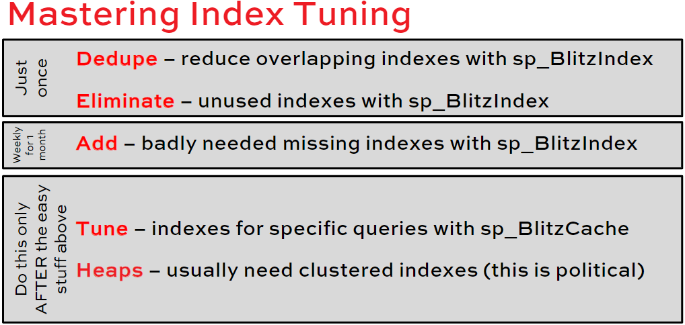
