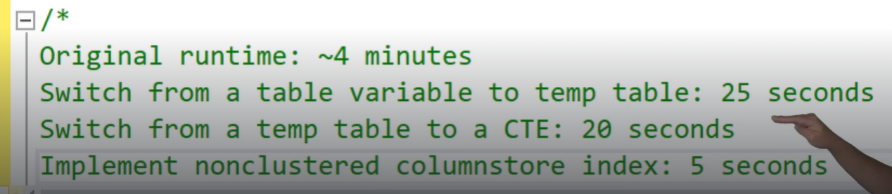
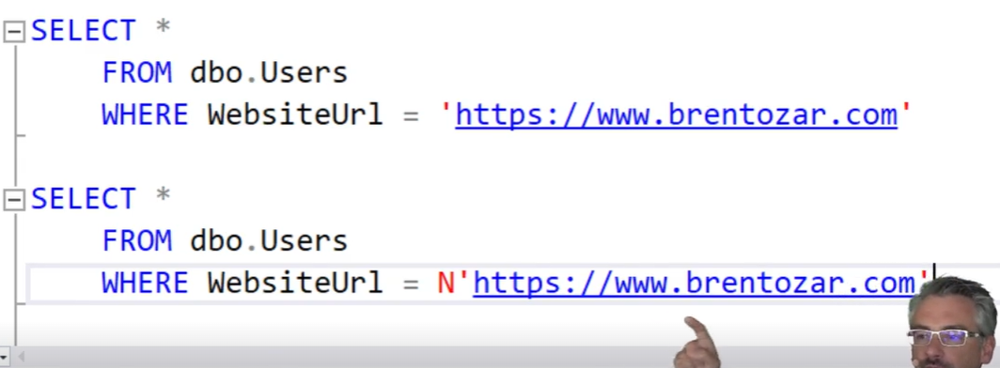
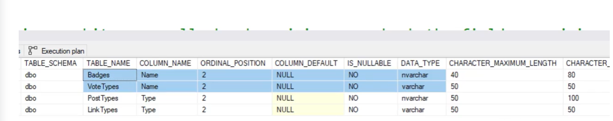
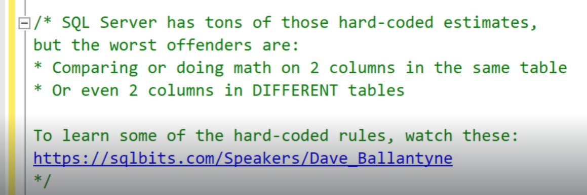
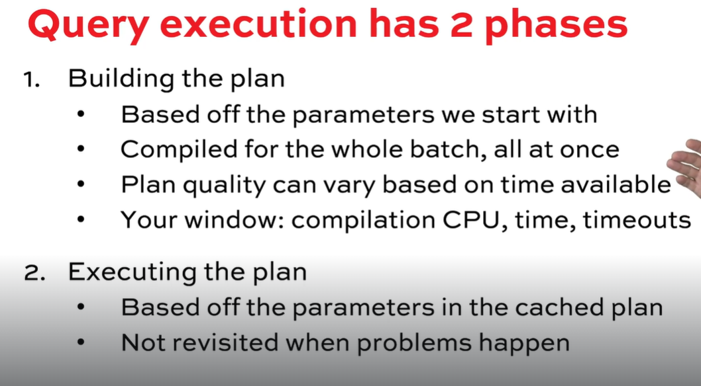
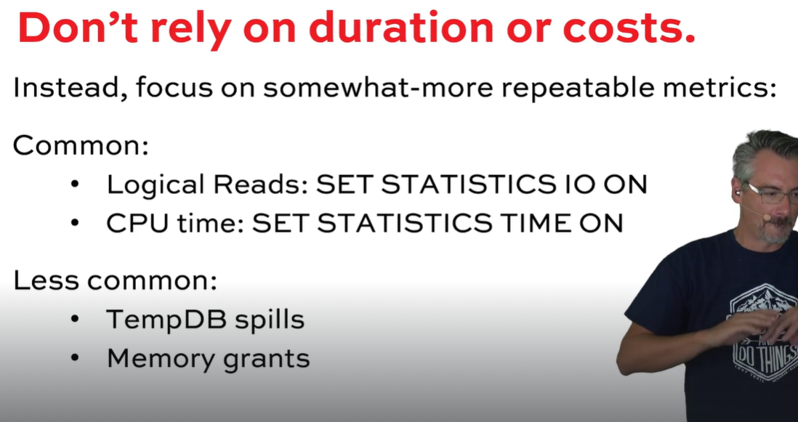
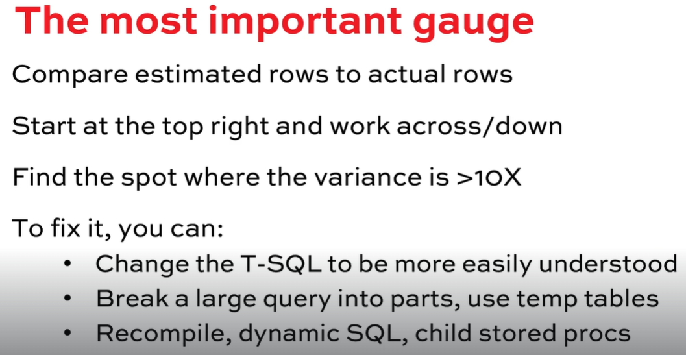
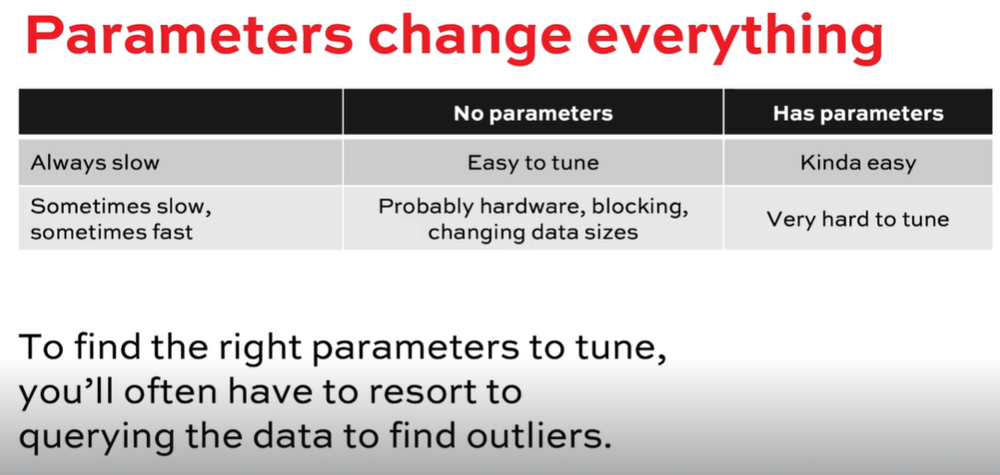

# Brent Ozar Course Notes
<style>
r { color: red }
o { color: Orange }
g { color: Green }
lg { color: lightgreen }
b { color: Blue }
lb { color: lightblue }
</style>

```sql
```  

* Initial Page
  
  https://training.brentozar.com/courses/

---

# 1. Fundamentals of Query Tuning

* Index
  - [Folder Structure](#Folder-Structrure)
  - [We are going to cover](#We-are-going-to-cover)
    - [How SQL Server builds plans in phases](#How-SQL-Server-builds-plans-in-phases)
    - [How to find the right slow queries to tune](#How-to-find-the-righ-queries-to-tune)
    - [How parameters influence cached plans](#How-Parameters-Influence-Query-Plans)
    - [How to improve estimation accuracy](#Improving-Cardinality-Estimation-Accuracy)
    - [5 common T-SQL antipatterns (and how they wreck cardinality)](#Common-T-SQL-Anti-Patterns)
    - [EXECUTION PLANS ARE LYING LIARS](#EXECUTION-PLANS-ARE-LYING-LIARS)
    - [RECAP](#RECAP)
    - [(Bonus) How to Find the Right Queries to Tune]((Bonus)-How-to-Find-the-Right-Queries-to-Tune)

## Folder Structure
1.  Images
    Will have the images that I take from the course.

2.  PDF
    Will have the document download from Brent Ozar oficial course.

3.  Script
    Will have the document download from Brent Ozar oficial course.

## We are going to cover
How SQL Server builds plans in phases
    • How to find the right slow queries to tune
    • How parameters influence cached plans
    • How to improve estimation accuracy
    • 5 common T-SQL antipatterns (and how they wreck cardinality)

## How SQL Server builds plans in phases

## How Parameters Influence Query Plans (cache)
    ```sql
    SELECT u.DisplayName, u.Id AS UserId, c.Id AS CommentId, c.Score, c.Text
    FROM dbo.Users u
    INNER JOIN dbo.Comments c ON u.Id = c.UserId
    WHERE u.Location = 'Helsinki, Finland'
        AND c.CreationDate BETWEEN '2013-08-01' AND '2013-08-30'
    ORDER BY c.Score DESC;
    GO    
    ```

## Improving Cardinality Estimation Accuracy

  * WITH FULLSCAN to help cardinality
  * Create an Index. To create the IX SQL read all the rows an create a STAT WITH FULLSCAN
  * Change compatibility level
  * SELECT  less rows using TOP 100. With 100 rows SQL use one methodology for ordering.
        With 101 rows the SQL use another ordering methodology.
        Ordering 1: SQL Order all the rows that recieve
        Ordering 2: SQL discard the rows that are not into the 100 rows filter


  * for the Exercise the solution we found wree:
  * Split the query in two using variable and then SELECT + OPTION RECOMPILE
  * Create two SPs. On the first put the SELECT TOP 1 on the second one use the SELECT....
  * Use dynamic query. Fisrt get the SELECT TOP 1 and then the SELECT on the dynamic query

  * sqlserverfast.com

  * Last exercise  
    


## Common T-SQL Anti-Patterns
  * Easy WHERE easy stimation
  * WHERE + FUNCITON STIMATION IS NOT SO GOOD.
    Filtering by INDIA is not going to be goog India + WHERE + Function = not good

  * STRING_SPLIT
    
  * Lo primero que tenemos que hacer cuando Microsoft SQL saca una caracteristica nueva
      tenemos que ver si afecta la cardinalidad o no?.
      Si la afecta negativamente no la usamos

  * Implicit convertion
      

      The N'' say to the SQL that the string is unicode = significa que puede contener cualquier cosa

  * ADS
      Se pone peor cuando comparas dos columnas que tienen un valor difernte como las de abajo

      

  * Hardcore on SQL Server
      

  * Table Variable
     * Transactions are for tables not for variables. Table variable IGNORE transactions!!!!!


## EXECUTION PLANS ARE LYING LIARS


## RECAP
  * 
  * 
  * 
  * 


## (Bonus) How to Find the Right Queries to Tune
   * EXEC sp_BlitzFirst @SinceStartUp = 1;
        - Run this to check wich is the bottleneck on your server
        - Depend on the result is how you have to run the sp_BlitzCache
            Decoder ring for the 6 most common wait types:

            CXPACKET: queries going parallel to read a lot of data or do a lot of CPU work.
            Sort by CPU and by READS.

            LCK%: locking, so look for long-running queries. Sort by DURATION, and look for
            the warning of "Long Running, Low CPU." That's probably a query being blocked.

            PAGEIOLATCH: reading data pages that aren't cached in RAM. Sort by READS.

            RESOURCE_SEMAPHORE: queries can't get enough workspace memory to start running.
            Sort by MEMORY GRANT, although that isn't available in older versions of SQL.

            SOS_SCHEDULER_YIELD: CPU pressure, so sort by CPU.

            WRITELOG: writing to the transaction log for delete/update/insert (DUI) work.
            Sort by WRITES.
        
   * sp_BlitzCache
        - The default order is CPU (@SortOrder = 'cpu')
   * Always check first the Priority 1
