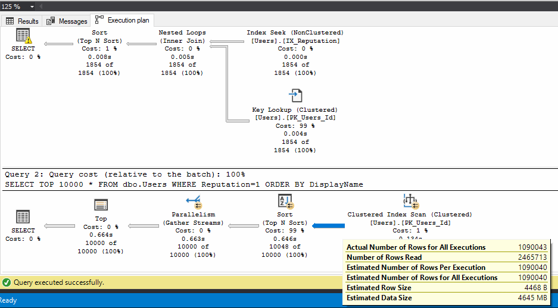
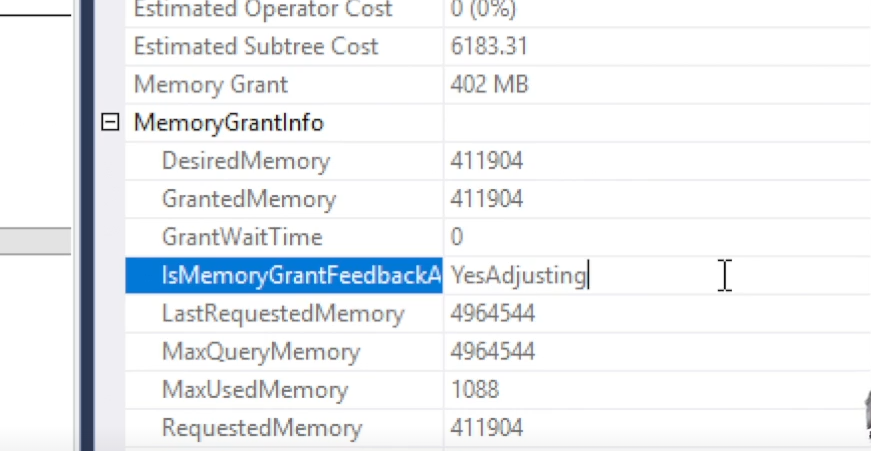
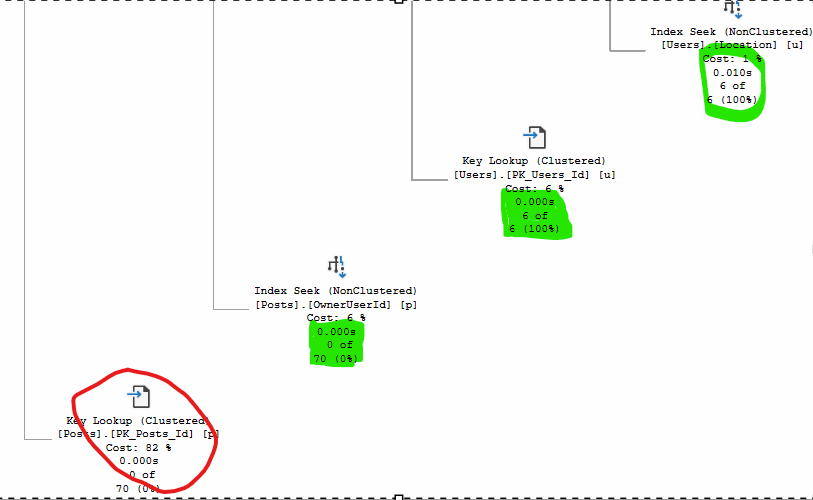
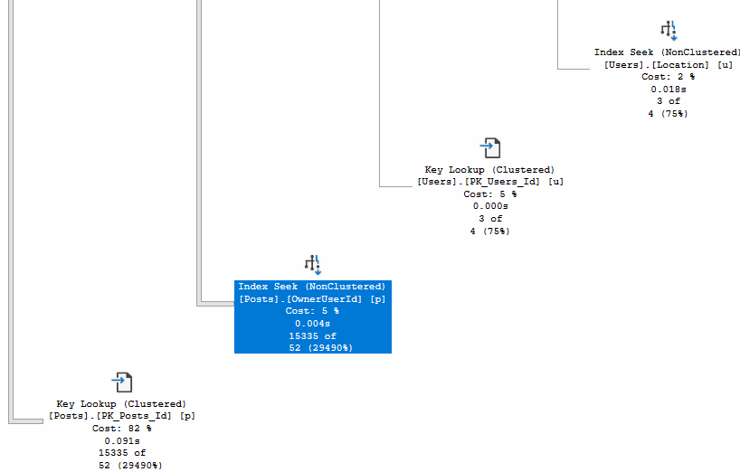
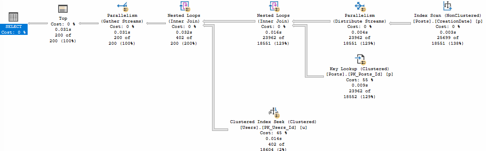
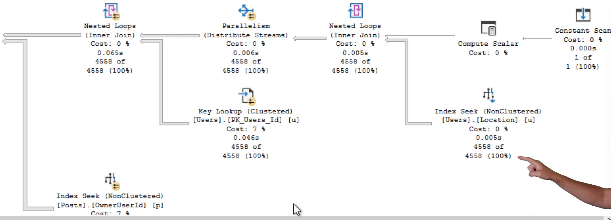
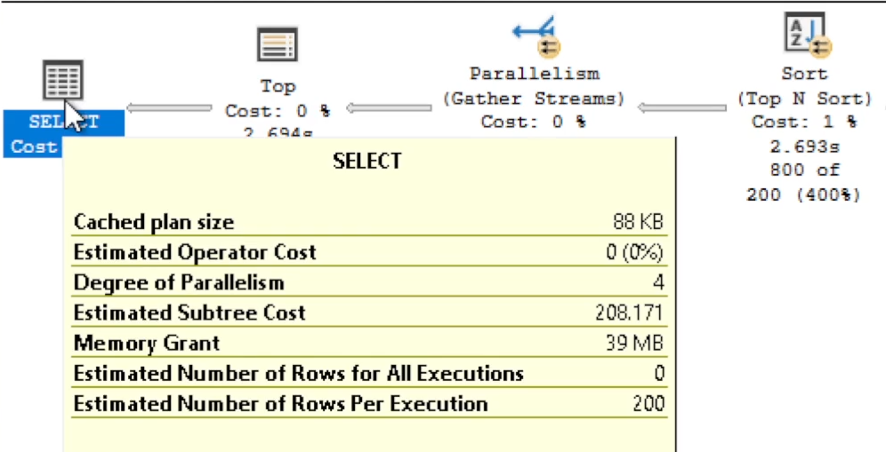
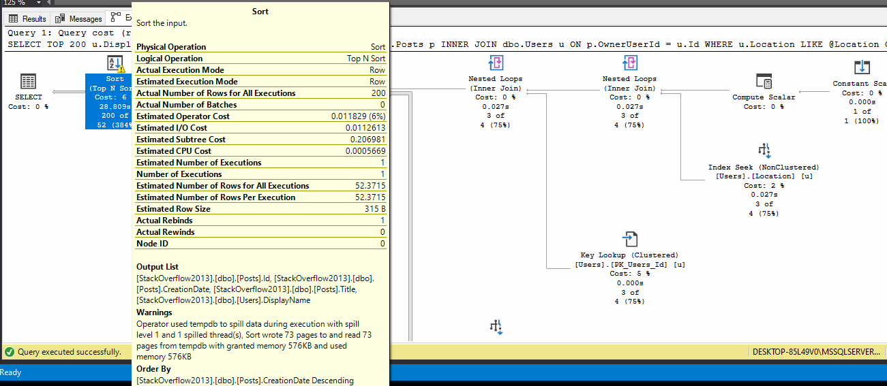
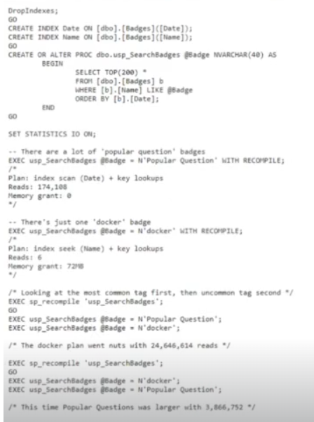

# Brent Ozar Course Notes

<style>
r { color: red }
o { color: Orange }
g { color: Green }
lg { color: lightgreen }
b { color: Blue }
lb { color: lightblue }
</style>

* Initial Page
  
  https://training.brentozar.com/courses/

---

# 1. Fundamentals of Parameter Sniffing

* Index
  - [Folder Structure](#Folder-Structrure)
  - [We are going to cover](#We-are-going-to-cover)
    - [What Parameter Sniffing Is? (and isn't)](#What-Parameter-Sniffing-Is?)
    - [The Kinds of Queries That Are Vulnerable](#The-Kinds-of-Queries-That-Are-Vulnerable)
    - [More Plan Choices, More Problems](#More-Plan-Choices-,-More-Problems)
    - [Lab: Write a Query That Suffers From Parameter Sniffing](#Lab:-Write-a-Query-That-Suffers-From-Parameter-Sniffing)
    - [The Usual Causes of Sniffing Emergencies](#The-Usual-Causes-of-Sniffing-Emergencies)
    - [The UNusual causes](#The-UNusual-causes)
    - [How to reac to a Sniffing Emergency](#How-to-reac-to-a-Sniffing-Emergency)
    - [Lab:React to a Sniffing Emergency](#Lab:React-to-a-Sniffing-Emergency)
    - [What Parameter Sniffing ISN'T](#What-Parameter-Sniffing-ISN'T)
    - [How SQL Server 2022 Tries Fixing Parameter Sniffing](#How-SQL-Server-2022-Tries-Fixing-Parameter-Sniffing)
    - [RECAP](#RECAP)

## Folder Structure
1.  Images
    Will have the images that I take from the course.

2.  PDF
    Will have the document download from Brent Ozar oficial course.

3.  Script
    Will have the document download from Brent Ozar oficial course.

## We are going to cover
 - Understand what parameter sniffing is (and isn’t)
 - Analyze the kinds of queries that are susceptible
 - Lab: write a query that’s susceptible
 - See what triggers sniffing emergencies
 - Learn how to react to emergencies
 - Lab: tackle a sniffing emergency
 - See a few more examples of what sniffing isn’t

## What Parameter Sniffing Is?

```sql
USE StackOverflow2013;
GO
DropIndexes;
GO

/* 2017, not 2019 yet */
ALTER DATABASE CURRENT SET COMPATIBILITY_LEVEL = 140; 
GO
EXEC sys.sp_configure N'cost threshold for parallelism', N'50' /* Keep small queries serial */
GO
EXEC sys.sp_configure N'max degree of parallelism', N'4' /* Let queries go parallel */
GO
RECONFIGURE
GO

/* Turn on actual execution plans and: */
SET STATISTICS IO, TIME ON;
GO

CREATE INDEX IX_Reputation ON dbo.Users(Reputation)
GO

-- Small query
SELECT TOP 10000 *
FROM dbo.Users
WHERE Reputation=2
ORDER BY DisplayName;
GO

-- Big query
SELECT TOP 10000 * 
FROM dbo.Users
WHERE Reputation=1
ORDER BY DisplayName;
GO
```
    
<r>Notes</r>
- La 1er query usa un Index Seek + Key Lookup y tiene un warning en el SELECT de asignacion de memoria. No es mucha asique no es problema.
- La 2da query usa un Clusterd index Scan y a BO le da un Warning en el SELECT de asignacion de memoria pero de 4GB, esto es una animalada.
Mirando el plan se puede saber que el Clustered Index Scan estima que va a usar 4GB de memoria. Esto lo estima el engine porque asume
que todas las columnas van a estar completas en un 50%. Como tenemos columnas muy grandes de NVARCHAR(MAX) o NVARCHAR(XXX) la estimacion
que hace el engine es que va a necesitar 4GB de memoria cuando esto no es asi. No todas las columnas estan completas, muchas de ellas
ni siquiera tienen datos tienen NULL.
- Every Key Lookup has x3 Reads
- Execution plan dif
  1. One is execute on Parallel not the other
  2. One returns 2k rows the second one 10k rows
  3. The first use an Index Seek + Key Lookup and the other a Clustered Index Scan
  4. The first one run in 0 seconds. The second one runs in 3 Seconds
  5. The first one has a warning on the select for the memory

  

```sql
CREATE OR ALTER PROCEDURE dbo.usp_UsersByReputation
@Reputation int
AS
SELECT TOP 10000 *
FROM dbo.Users
WHERE Reputation=@Reputation
ORDER BY DisplayName;
GO

-- Big query
EXEC dbo.usp_UsersByReputation @Reputation =1;
GO
-- Small query
EXEC dbo.usp_UsersByReputation @Reputation =2;
GO
```

Notes
- Si ejecuto primero la query heavy y despues la small no tenemos ningun problema. Los usuarios estan contentos los DBA estan mal
porque el engine va a usar el 25% de la memoria. Es decir tanto para @Reputation = 1 como = 2 el engine usa el mismo plan de ejecucion. En teoria esto es parameter sniffing. Me esta usando el mismo plan para dos parametros diferentes. Pero como comentamos antes el usuario no se va a quejar.

```sql
DBCC FREEPROCCACHE
GO

-- Small query
EXEC dbo.usp_UsersByReputation @Reputation =2;
GO
-- Big query
EXEC dbo.usp_UsersByReputation @Reputation =1;
GO

sp_BlitzCache
```

NOTES
- Porque demora mas la Big query?
  1ero. el Order By tiene un Warning de memoria. El engine le asigna solo los 10MB para hacer el ORDER BY y el resto lo tiene que hacer en disco. Le asigna, los 10MG porque son los que le asigno al 1er plan de ejecucion cuando @Reputation = 2
  
  2do Porque hace mas de 1 millon de key lookups

  3ero No esta usando el paralelismo. No lo usa porque esta usando el plan de ejecucion de @Reputation = 2 y este no usa paralelismo

- When the small query goes first the users are not happy the DBA are. Because the DB don't check how many reads the query do the only thing that DBA take cares is if the TEMPDB is full or not.
- Si tenemos poca memoria esto es un problema
- Esto es un problema en Azure porque es caro asignarle mas memoria
- Microsoft is trying to reduce de effect of parameter sniffing doing:
  - In SQL 2019
    There is something new call <r>Adaptive Memory Grant</r>
    
    

    If we execute the same query more than 1 the engine stars to adapt the amount of memory until see YesStable.

  - In SQL 2022
    Cach 3 execution plan

- <r>Para que se produzca parameter sniffing necesitamos de dos cosas:
  - <r>PARAMETROS en el sp
  - <r>Tener diferentes planes de execucion para esos parametros.

## The Kinds of Queries That Are Vulnerable
```sql
/* Add a few indexes to let SQL Server choose: */
CREATE INDEX Location ON dbo.Users(Location);
CREATE INDEX OwnerUserId ON dbo.Posts(OwnerUserId);
GO

/* A bad query, but... */
CREATE OR ALTER PROC dbo.usp_SearchPostsByLocation @Location VARCHAR(100) AS
BEGIN
    /* Find the most recent posts from an area */
    SELECT TOP 200 
        u.DisplayName
        , p.Title
        , p.Id
        , p.CreationDate
    FROM dbo.Posts p
    JOIN dbo.Users u
    ON   p.OwnerUserId = u.Id
    WHERE UPPER(u.Location) LIKE UPPER(@Location)
    ORDER BY p.CreationDate DESC
END

/* Big data */
EXEC usp_SearchPostsByLocation 'India' WITH RECOMPILE;

/* Middle data */
EXEC usp_SearchPostsByLocation 'Netherlands' WITH RECOMPILE;

/* Small data */
EXEC usp_SearchPostsByLocation 'Near Stonehenge' WITH RECOMPILE;
GO
```

Notes
  - In this case, all parameters produce the same execution plan.
    Which means we get:
    * Consistently bad estimates
    * Scans instead of seeks
    * Huge memory grants
    * Huge parallelism waits even to produce a tiny amount of rows

    And you would probably want to fix that. You could fix it by removing the explicit conversion since this database isn't case senstive anyway.

    This isn't parameter sniffing: it's the exact OPPOSITE. We always get the SAME plan.

    This isn't parameter sniffing: it's just a plain ol' bad execution plan because of the explicit conversion:
        WHERE UPPER(u.Location) LIKE UPPER(@Location)

  - To solve this issue we have to introduce parameter sniffing, removing th UPPER function on the WHERE clause. Cuando tenes queries mal escritas el engine no entiende entonces podes insertar parameter sniffing para que el engine entienda mejor la query.

  - Use sp_recompile 'SP NAME' on prod in place of DBCC FREEPROCACHE. This only delete the execution plan for that particualr SP/

Learning
  - Cuando vos tenes un SP con parametros tenes y ya detectaste que el problema es el parameter sniffing, tenes que buscar cuales son los outlier para ese WHERE. Es decir con que parametros el query puede correr bien o mal.
  Los parametros que podes usar son:

  1. El mayor valor para ese where. Esto quiere decir el COUNT para ese where
  2. El menor valor para ese where. Esto quiere decir el COUNT para ese where
  3. Alguno en medio
  4. Como las estadisticas se guardan en 1 sola pagina de 8K el engine solo mete hasta 201 bucket dentro de esta. Por lo cual si vos hacer un SELECT COUNT(*) FROM XXX WHERE XXX = @parametro. Por lo general en las estadisticas vas a encontrar que el engine creo 1 bucket por cada uno de los primeros 200 registros despues de eso seguramente no vas a encontrar un bucket para los demas valores. Como el SQL tiene poco lugar para guardar las estadisticas crea buchet solo para los valores grandes. Para el resto usa la ultima columna por lo que por lo general la estimacion no va ser la correcta.

  - The statistics work well for the 200 outliers

  ```sql
  /* Better version, but... */
  CREATE OR ALTER PROC dbo.usp_SearchPostsByLocation @Location VARCHAR(100) AS
  BEGIN
  /* Find the most recent posts from an area */
  SELECT TOP 200 u.DisplayName, p.Title, p.Id, p.CreationDate
  FROM dbo.Posts p
  INNER JOIN dbo.Users u ON p.OwnerUserId = u.Id
  WHERE u.Location LIKE @Location			/* No explicit conversion */
  ORDER BY p.CreationDate DESC
  END
  GO
  ```

  - Some times is not a parameter sniffing problem it's just a bad estimation. How to identified this diference?

    If you execute the SP with RECOMPILE and on the execution plan you see that the engine start doing a good estimation and then a bad estimation in the rest of the operators, that is a bad estimation and not a parameter sniffing issue.

    e.g
    What if SQL Server guessed the right number of Users, but:
      * That location never posted any questions or answers (has no rows in Posts), or
      * That location posted WAY more questions or answers than average

    Let's find outliers: first, popular locations with no posts:

    ```sql
    SELECT u.Location, COUNT(DISTINCT u.Id) AS UserCount
    FROM dbo.Users u
    LEFT OUTER JOIN dbo.Posts p ON u.Id = p.OwnerUserId
    GROUP BY u.Location
    HAVING COUNT(DISTINCT P.Id) = 0
    ORDER BY COUNT(DISTINCT u.Id) DESC;
    GO
    
    /* And try a few of those: */
    EXEC usp_SearchPostsByLocation 'Almaty, Almaty Region, Kazakhstan' WITH RECOMPILE;
    EXEC usp_SearchPostsByLocation 'Surabaya, Republik Indonesia' WITH RECOMPILE;
    EXEC usp_SearchPostsByLocation 'Yokohama' WITH RECOMPILE;
    ```    
    
    - Almaty, Almaty Region, Kazakhstan

        

    - Surabaya, Republik Indonesia
        Idem before
    
    - Yokohama
        Idem before

    ```sql
    /* Then, one-person locations with a ton of posts: */
    SELECT TOP 100 Location, COUNT(DISTINCT u.Id) AS UserCount, COUNT(DISTINCT p.Id) AS PostCount 
    FROM dbo.Users u
    INNER JOIN dbo.Posts p ON u.Id = p.OwnerUserId
    GROUP BY u.Location
    HAVING COUNT(DISTINCT u.Id) = 1
    ORDER BY COUNT(DISTINCT p.Id) DESC;

    /* And try a few of those: */
    EXEC usp_SearchPostsByLocation 'Willemstad, Curaçao' WITH RECOMPILE;
    EXEC usp_SearchPostsByLocation 'Forest of Dean, United Kingdom' WITH RECOMPILE;
    EXEC usp_SearchPostsByLocation 'Västervåla, Sweden' WITH RECOMPILE;
    ```

    - Willemstad, Curaçao
        


    - Willemstad, Curaçao
        Idem before
    
    - Västervåla, Sweden
        Idem before

    ```sql
    /* And try a few of those: */
    EXEC usp_SearchPostsByLocation 'Willemstad, Curaçao' WITH RECOMPILE;
    EXEC usp_SearchPostsByLocation 'Forest of Dean, United Kingdom' WITH RECOMPILE;
    EXEC usp_SearchPostsByLocation 'Västervåla, Sweden' WITH RECOMPILE;

    DBCC FREEPROCACHE
    EXEC usp_SearchPostsByLocation 'India' WITH RECOMPILE;
    EXEC usp_SearchPostsByLocation 'Almaty, Almaty Region, Kazakhstan' WITH RECOMPILE;
    EXEC usp_SearchPostsByLocation 'Surabaya, Republik Indonesia' WITH RECOMPILE;
    EXEC usp_SearchPostsByLocation 'Yokohama' WITH RECOMPILE;

    EXEC usp_SearchPostsByLocation 'Willemstad, Curaçao' WITH RECOMPILE;
    EXEC usp_SearchPostsByLocation 'Forest of Dean, United Kingdom' WITH RECOMPILE;
    EXEC usp_SearchPostsByLocation 'Västervåla, Sweden' WITH RECOMPILE;

    /* Ah-ha! 
    Now we have TWO separate problems:
    1. Parameter sniffing
    2. Incorrect estimates for SOME parameters

    If India goes in first:
    * The small locations suffer
    * India does fine
    * The outlier locations do fine

    If the small locations go in first:
    * The small locations do fine
    * India suffers
    * The outlier locations suffer

    If the outlier locations go in first:
    * The small locations do fine
    * India suffers
    * The outlier locations suffer
    */
    ```
 
    <r>ESTA ULTIMA PARTE NO LA TERMINO DE ENTENDER BIEN. LA TENGO QUE RECHEQUEAR!!!!!!!!!!!!!!!</r>

## More Plan Choices, More Problems

```sql
CREATE INDEX CreationDate ON dbo.Posts(CreationDate);
GO

/* Here's our proc text as a reminder - note that it's ordering by CreationDate DESC: */
CREATE OR ALTER PROC dbo.usp_SearchPostsByLocation @Location VARCHAR(100) AS
BEGIN
/* Find the most recent posts from an area */
SELECT TOP 200 u.DisplayName, p.Title, p.Id, p.CreationDate
FROM dbo.Posts p
INNER JOIN dbo.Users u ON p.OwnerUserId = u.Id
WHERE u.Location LIKE @Location
ORDER BY p.CreationDate DESC
END
GO

/* Does this give us even more possible plans? Do any of these use the new index? */
EXEC usp_SearchPostsByLocation 'India' WITH RECOMPILE; /* Big data */
EXEC usp_SearchPostsByLocation 'Netherlands' WITH RECOMPILE; /* Middle data */
EXEC usp_SearchPostsByLocation 'Near Stonehenge' WITH RECOMPILE; /* Small data */
EXEC usp_SearchPostsByLocation 'Willemstad, Curaçao' WITH RECOMPILE; /* Outlier: few people, many posts */
GO
```

- EXEC usp_SearchPostsByLocation 'India' WITH RECOMPILE; /* Big data */

  (200 rows affected)

  Table 'Users'. Scan count 0, logical reads 73.413

  Table 'Posts'. Scan count 1, logical reads 97.453

  

Porque usa el Indice sobre CreationDate cuando tiene el indice por location?
Esto es porque el engine sabe que tiene muchas locaciones en India, entonces le resulta mas simple order por CreationDate y despues fijarse si el post es de la location India. Como la India tiene casi todos los post porque tiene muchisimos users, se puede suponer que vamos a encontrar los mach muy rapido. Y eso mismo es lo que pasa, por eso el engine descarta el Indice por location y usa el de CreationDate

  - EXEC usp_SearchPostsByLocation 'Netherlands' WITH RECOMPILE; /* Middle data */

    (200 rows affected)

    Table 'Users'. Scan count 1   , logical reads 14018 , physical reads 0,
    
    Table 'Posts'. Scan count 4558, logical reads 497543, physical reads 91

    Para este el engine si usa el indice por location

    

    Porque es muy poca la gente que vive en Holanda 4558

    

    Ademas mirando el plan de ejecucion se puede ver que el sql ejecuta ahora un ORDER BY porque no esta usando el ix por creationdate

  - EXEC usp_SearchPostsByLocation 'Near Stonehenge' WITH RECOMPILE; /* Small data */
    Same before

  - EXEC usp_SearchPostsByLocation 'Willemstad, Curaçao' WITH RECOMPILE; /* Outlier: few people, many posts */
    
    (200 rows affected)

    Table 'Posts'. Scan count 3, logical reads 89576, physical reads 13,

    Table 'Users'. Scan count 1, logical reads 12   , physical reads 2  

    Use Location index but with a warnig on the order

    

  - Cual seria el peor escenario???
    Ahora que sumamos el indice por creationdate

    ```sql
    -- Brent Ozar
    sp_recompile 'usp_SearchPostsByLocation'
    -- A el este le corre en 0 sec y usa el location ix
    EXEC usp_SearchPostsByLocation 'Near Stonehenge'; /* Small data */
    -- A el este este corre en 5 sec y usa el location ix
    EXEC usp_SearchPostsByLocation 'India'; /* Big data */


    sp_recompile 'usp_SearchPostsByLocation'
    -- A el le ejecuta in single thread no paralelism y usa el CrationDate ix
    EXEC usp_SearchPostsByLocation 'India'; /* Big data */
    -- A el le demora un monton. A el 
    EXEC usp_SearchPostsByLocation 'Near Stonehenge'; /* Small data */
    ```

    El peor escenario es ejecutar 1ero la india y despues Near Stonehenge. Porque con la India usa el indice de creationdate y despues se fija si el usuario es de la locacion correspondiente. Para la india eso esta bien. Pero para Near Stonhenge eso no sirve. Porque ejecuta el mismo plan de jecucion de la india y primero ordena por la fecha con el indice de creationdate y despues se fija si es de Near Stonhenge y ademas haciendo un Kee Lookup, pero en esta locacion NO HAY NADIE. Entonces no sirve.

    Entonces no teniamos un problema de parameter sniffing hasta que nosotros creamos el nuevo indice.

  - Como resolver esto?
    Eliminando el IX
    Poniendo un HINT para forzar el uso del IX

```sql
/* And what if our stored procedure gets more complex? */
CREATE OR ALTER PROC dbo.usp_SearchPostsByLocation 
	@Location  VARCHAR(100), 
	@StartDate DATETIME, 
	@EndDate   DATETIME AS
BEGIN
/* Find the most recent posts from an area */
SELECT TOP 200 u.DisplayName, p.Title, p.Id, p.CreationDate
  FROM dbo.Posts p
  INNER JOIN dbo.Users u ON p.OwnerUserId = u.Id
  WHERE u.Location LIKE @Location
    AND p.CreationDate BETWEEN @StartDate AND @EndDate
  ORDER BY p.CreationDate DESC;
END
GO

-- India
EXEC usp_SearchPostsByLocation 'India', @StartDate = '2008-01-01', @EndDate = '2014-01-01' WITH RECOMPILE; /* Big data, big dates */
EXEC usp_SearchPostsByLocation 'India', @StartDate = '2009-01-01', @EndDate = '2009-02-01' WITH RECOMPILE; /* Big data, medium dates */
EXEC usp_SearchPostsByLocation 'India', @StartDate = '2009-01-01 10:00', @EndDate = '2009-01-01 10:01' WITH RECOMPILE; /* Big data, small dates */

-- Netherlands
EXEC usp_SearchPostsByLocation 'Netherlands', @StartDate = '2008-01-01', @EndDate = '2014-01-01' WITH RECOMPILE; /* Medium data, big dates */
EXEC usp_SearchPostsByLocation 'Netherlands', @StartDate = '2009-01-01', @EndDate = '2009-02-01' WITH RECOMPILE; /* Medium data, medium dates */
EXEC usp_SearchPostsByLocation 'Netherlands', @StartDate = '2009-01-01 10:00', @EndDate = '2009-01-01 10:01' WITH RECOMPILE; /* Medium data, small dates */

-- Near Stonehenge
EXEC usp_SearchPostsByLocation 'Near Stonehenge', @StartDate = '2008-01-01', @EndDate = '2014-01-01' WITH RECOMPILE; /* Small data, big dates */
EXEC usp_SearchPostsByLocation 'Near Stonehenge', @StartDate = '2009-01-01', @EndDate = '2009-02-01' WITH RECOMPILE; /* Small data, medium dates */
EXEC usp_SearchPostsByLocation 'Near Stonehenge', @StartDate = '2009-01-01 10:00', @EndDate = '2009-01-01 10:01' WITH RECOMPILE; /* Small data, small dates */

EXEC usp_SearchPostsByLocation 'Willemstad, Curaçao', @StartDate = '2008-01-01', @EndDate = '2014-01-01' WITH RECOMPILE; /* Outlier data, big dates */
EXEC usp_SearchPostsByLocation 'Willemstad, Curaçao', @StartDate = '2009-01-01', @EndDate = '2009-02-01' WITH RECOMPILE; /* Outlier data, medium dates */
EXEC usp_SearchPostsByLocation 'Willemstad, Curaçao', @StartDate = '2009-01-01 10:00', @EndDate = '2009-01-01 10:01' WITH RECOMPILE; /* Outlier data, small dates */
GO
```

- India
Para la India el engine usa el mismos plan en las 3 ejecuciones. Usa el indice por CreationDate y evita el Order By

- Netherlands
Para Netherlands usa el Location para big y medium. Pero usa el CreationDate para el small. Este ultimo es el mismo plan que usa para la India, es raro!

- Near Stonehenge
Para Near Stonehenge usa el Location para big y medium. Pero usa el CreationDate para el small. Este ultimo es el mismo plan que usa para la India, es raro!

```sql
/* Si tomamos los dos extremos. El mas pesado y el mas chicos */
EXEC usp_SearchPostsByLocation 'India', @StartDate = '2008-01-01', @EndDate = '2014-01-01' WITH RECOMPILE; /* Big data, big dates */
EXEC usp_SearchPostsByLocation 'Near Stonehenge', @StartDate = '2009-01-01 10:00', @EndDate = '2009-01-01 10:01' WITH RECOMPILE; /* Small data, small dates */
```

- A BrentOzar le da el mismo plan. A mi la unica diferencia es que para la india lo hace en paralelo. Pero el plan es el mismo usa el CreationDate index

Learn
  - No solo nos tenemos que quedar con los parametros extremos como ser la India y Near Stonehenge. Tambien tenemos que buscar los intermedios.

## Lab: Write a Query That Suffers From Parameter Sniffing

- Now, it's your turn: using Stack Overflow database:
Write a query that's susceptible to parameter sniffing. Try to use just one table, and NOT the Users table. Let's mix it up.
You'll need to create at least one index to give SQL Server tough choices. Build the list of parameters that will produce widly different plans. Free tha plan cache, run it with one set of parameters, and then the other, and see wich one causes performance to become way worse.

```sql
  -- My example
  /*
      * Use one table not dbo.Users
      * Create one index at least
      * Build the list of parameters that will produce a wildly different plan
      * Free cache and run them

      * Analyze the info first
          SELECT top 10 * FROM Badges
              SELECT COUNT(*) FROM Badges
                  -- 8.042.005
              SELECT Name, COUNT(*) FROM Badges GROUP BY Name ORDER BY COUNT(*) DESC

                  -- Max 'Popular Question', COUNT 1.286.465
                  -- Min 'normalization'   , COUNT 1
                  -- Outlier 'Tumbleweed'	 , COUNT 317744
                  -- Outlier 'magento'	 , COUNT 50

              DBCC SHOW_STATISTICS ('dbo.Badges','_WA_Sys_00000002_7D78A4E7')

          SELECT top 10 * FROM Votes
  */

  DropIndexes;
  GO
  CREATE INDEX ix_DateName ON dbo.Badges ([Date], [Name])
  GO

  --CREATE INDEX ix_NameDate ON dbo.Badges ([Name], [Date])
  --GO

  CREATE OR ALTER PROC dbo.usp_GetBadge @Name NVARCHAR(40)
  AS
  BEGIN
      SELECT Id, Name, UserId, Date
      FROM   dbo.Badges
      WHERE  Name = @Name
      ORDER BY Date;
  END
  GO

  SET STATISTICS IO ON

  DBCC FREEPROCCACHE

  -- Exec whitout index
  BEGIN 
  EXEC dbo.usp_GetBadge 'Popular Question' WITH RECOMPILE; /* Big    */ 
  /* 
  Time		 : 6sec 
  Logical reads: 50.379 (Total Pages 49649)
  Plan		 : Clustered Index Scan
  Parallel     : Si
  Memory Grant : 154 MB
  Warning      : In Sort
  */ 
  EXEC dbo.usp_GetBadge 'Tumbleweed'		 WITH RECOMPILE; /* Medium */
  /* 
  Time		 : 1sec 
  Logical reads: 50.379 (Total Pages 49649)
  Plan		 : Clustered Index Scan
  Parallel     : Si
  Memory Grant : 39 MB
  Warning      : Non Warning
  */ 
  EXEC dbo.usp_GetBadge 'normalization'    WITH RECOMPILE; /* small  */
  /* 
  Time		 : 0sec 
  Logical reads: 49.649 (Total Pages 49.649)
  Plan		 : Clustered Index Scan
  Parallel     : No
  Memory Grant : 1024 MB use 0
  Warning      : Non Warning
  */ 
  EXEC dbo.usp_GetBadge 'magento'			 WITH RECOMPILE; /* Outlier */
  /* 
  Time		 : 0sec 
  Logical reads: 49.649 (Total Pages 49.649)
  Plan		 : Clustered Index Scan
  Parallel     : No
  Memory Grant : 1024 MB use 16KB
  Warning      : Non Warning
  */ 

      /*
      All together
          EXEC dbo.usp_GetBadge 'Popular Question' WITH RECOMPILE; /* Big    */ 
          EXEC dbo.usp_GetBadge 'Tumbleweed'		 WITH RECOMPILE; /* Medium */
          EXEC dbo.usp_GetBadge 'normalization'    WITH RECOMPILE; /* small  */
          EXEC dbo.usp_GetBadge 'magento'			 WITH RECOMPILE; /* Outlier */
      */

  -- Exec whitout index
  END

  -- Exec with new index
  BEGIN
  EXEC dbo.usp_GetBadge 'Popular Question' WITH RECOMPILE; /* Big    */ 
  /* 
  Time		 : 6sec 
  Logical reads: 50.379 (Total Pages 49649)
  Plan		 : Clustered Index Scan
  Parallel     : Si
  Memory Grant : 154 MB
  Warning      : In Sort
  */ 
  EXEC dbo.usp_GetBadge 'Tumbleweed'		 WITH RECOMPILE; /* Medium */
  /* 
  Time		 : 1sec 
  Logical reads: 50.379 (Total Pages 49649)
  Plan		 : Clustered Index Scan
  Parallel     : Si
  Memory Grant : 39 MB
  Warning      : Non Warning
  */ 
  EXEC dbo.usp_GetBadge 'normalization'    WITH RECOMPILE; /* small  */
  /* 
  Time		 : 0sec 
  Logical reads: 42.729 (Total Pages 49.649)
  Plan		 : Index Scan + Key Lookup
  Parallel     : No
  Memory Grant : 0
  Warning      : Non Warning
  */ 
  EXEC dbo.usp_GetBadge 'magento'			 WITH RECOMPILE; /* Outlier */
  /* 
  Time		 : 0sec 
  Logical reads: 42.887 (Total Pages 49.649)
  Plan		 : Index Scan + Key Lookup
  Parallel     : No
  Memory Grant : 1024 MB use 16KB
  Warning      : Non Warning
  */ 

      /*
      All together
          EXEC dbo.usp_GetBadge 'Popular Question' WITH RECOMPILE; /* Big    */ 
          EXEC dbo.usp_GetBadge 'Tumbleweed'		 WITH RECOMPILE; /* Medium */
          EXEC dbo.usp_GetBadge 'normalization'    WITH RECOMPILE; /* small  */
          EXEC dbo.usp_GetBadge 'magento'			 WITH RECOMPILE; /* Outlier */
      */
  END

  -- Worse Scenario
  sp_recompile 'dbo.usp_GetBadge'
  -- If I put 'normalization' first in cache and the 'Popular Question'
  EXEC dbo.usp_GetBadge 'normalization'; /* small  */
  /* 
  Time		 : 0sec 
  Logical reads: 42.729 (Total Pages 49.649)
  Plan		 : Index Scan + Key Lookup
  Parallel     : No
  Memory Grant : 0
  Warning      : Non Warning
  */ 
  EXEC dbo.usp_GetBadge 'Popular Question'; /* Big    */ 
  /* 
  Time		 : 5sec 
  Logical reads: 3.982.533 (Total Pages 49649)
  Plan		 : Index Scan + Key Lookup
  Parallel     : No
  Memory Grant : 154 MB
  Warning      : In Sort
  */ 


  sp_recompile 'dbo.usp_GetBadge'
  -- If I put 'Popular Question' first in cache and the 'normalization'
  EXEC dbo.usp_GetBadge 'Popular Question'; /* Big    */ 
  /* 
  Time		 : 6sec 
  Logical reads: 50.379 (Total Pages 49649)
  Plan		 : Clustered Index Scan
  Parallel     : Si
  Memory Grant : 150 MB
  Warning      : In Sort
  */ 
  EXEC dbo.usp_GetBadge 'normalization'; /* small  */
  /* 
  Time		 : 0sec 
  Logical reads: 50.379 (Total Pages 49.649)
  Plan		 : Clustered Index Scan
  Parallel     : Si
  Memory Grant : 336MB use 0.38
  Warning      : Non Warning
  */ 
  ```

- This is an example almost similar to my. Execute



<r>ESTO LO TENGO QUE VER DESPUES Y PONERLO EN ESTE DOC. SON LOS ULTIMOS 15 MINUTOS DEL Lab:Brent Does it (21:43)</r>

## The Usual Causes of Sniffing Emergencies

- These things cause the plan cache to be evicted:

* Restarting the operating system
* Restarting the SQL Server service
* Cluster failover
* AG failover (since we're now on a different plan cache)
* Database restore
* Running RECONFIGURE after changing some server-level options
* Changing some database-level options like MAXDOP
* DBCC FREEPROCCACHE
* Altering the stored proc
* sp_recompile
* Rebuilding an index
* Updating statistics

We'll demo the above by looking at:

* sp_BlitzCache's plan cache history warning
* sp_Blitz's plan cache history warning
* sp_BlitzFirst's warning about stats being updated
* plan_generation_num in sys.dm_exec_query_stats

```sql
USE StackOverflow2013;
GO
DropIndexes;
GO
ALTER DATABASE CURRENT SET COMPATIBILITY_LEVEL = 140; /* 2017, not 2019 yet */
GO
EXEC sys.sp_configure N'cost threshold for parallelism', N'50' /* Keep small queries serial */
GO
EXEC sys.sp_configure N'max degree of parallelism', N'4' /* Let queries go parallel */
GO
RECONFIGURE
GO
SET STATISTICS IO, TIME ON;
GO
CREATE INDEX IX_Reputation ON dbo.Users(Reputation)
GO
CREATE OR ALTER PROCEDURE dbo.usp_UsersByReputation
  @Reputation int
AS
SELECT TOP 10000 *
FROM dbo.Users
WHERE Reputation=@Reputation
ORDER BY DisplayName;
GO

EXEC dbo.usp_UsersByReputation @Reputation =1; --big
GO
EXEC dbo.usp_UsersByReputation @Reputation =2; --small
GO

DBCC FREEPROCCACHE
GO
EXEC dbo.usp_UsersByReputation @Reputation =2;
GO
EXEC dbo.usp_UsersByReputation @Reputation =1;
GO
sp_BlitzCache
GO


DBCC FREEPROCCACHE
GO
EXEC dbo.usp_UsersByReputation @Reputation =1;
GO
EXEC dbo.usp_UsersByReputation @Reputation =1;
GO
EXEC dbo.usp_UsersByReputation @Reputation =1;
GO
SELECT execution_count, total_worker_time, total_elapsed_time, plan_generation_num
FROM sys.dm_exec_query_stats WHERE query_hash = 0xA6F28073109D7278;
GO

ALTER INDEX IX_Reputation ON dbo.Users REBUILD;
GO
SELECT execution_count, total_worker_time, total_elapsed_time, plan_generation_num
FROM sys.dm_exec_query_stats WHERE query_hash = 0xA6F28073109D7278;
GO
EXEC dbo.usp_UsersByReputation @Reputation = 2;
GO
SELECT execution_count, total_worker_time, total_elapsed_time, plan_generation_num
FROM sys.dm_exec_query_stats WHERE query_hash = 0xA6F28073109D7278;
```

QUESTION
- <r>Mi unica duda aca que quiero repasar es el tema del plan_generation_num</r>

## The Uusual causes

- SQL puede almasenar desde 40.000 a 160.000 planes de ejecucion
- WARNING
<r>TENGO QUE VER ESTE VIDEO DE NUEVO. SE ENTIENDE PERO ME PERDI EN ALGUNOS MOMENTOS</r>
- These 3 are specialized: let's demo the first two and talk about the 3rd.

* Plan cache pressure due to unparameterized queries
* Memory pressure
* Plans aging out

```sql
EXEC dbo.usp_UsersByReputation @Reputation =1;
GO
EXEC dbo.usp_UsersByReputation @Reputation =2;
GO

DBCC FREEPROCCACHE
GO
EXEC dbo.usp_UsersByReputation @Reputation =2;
GO
EXEC dbo.usp_UsersByReputation @Reputation =1;
GO
sp_BlitzCache
GO

/* How much plan cache history do we have? Originally published here:
https://www.brentozar.com/archive/2018/07/tsql2sday-how-much-plan-cache-history-do-you-have/
*/
SELECT TOP 50
    creation_date = CAST(creation_time AS date),
    creation_hour = CASE
                        WHEN CAST(creation_time AS date) <> CAST(GETDATE() AS date) THEN 0
                        ELSE DATEPART(hh, creation_time)
                    END,
    SUM(1) AS plans
FROM sys.dm_exec_query_stats
GROUP BY CAST(creation_time AS date),
         CASE
             WHEN CAST(creation_time AS date) <> CAST(GETDATE() AS date) THEN 0
             ELSE DATEPART(hh, creation_time)
         END
ORDER BY 1 DESC, 2 DESC;
GO

/* Similarly: */
sp_BlitzCache;
GO
sp_Blitz;
GO
sp_BlitzFirst;
GO

CREATE OR ALTER PROC dbo.usp_GetUser @UserId INT = NULL, @DisplayName NVARCHAR(40) = NULL, @Location NVARCHAR(100) = NULL AS
BEGIN
/* They have to ask for either a UserId or a DisplayName or a Location: */
IF @UserId IS NULL AND @DisplayName IS NULL AND @Location IS NULL
	RETURN;

DECLARE @StringToExecute NVARCHAR(4000);
SET @StringToExecute = N'SELECT * FROM dbo.Users WHERE 1 = 1 ';

IF @UserId IS NOT NULL
	SET @StringToExecute = @StringToExecute + N' AND Id = ' + CAST(@UserId AS NVARCHAR(10));

IF @DisplayName IS NOT NULL
	SET @StringToExecute = @StringToExecute + N' AND DisplayName = ''' + @DisplayName + N'''';

IF @Location IS NOT NULL
	SET @StringToExecute = @StringToExecute + N' AND Location = ''' + @Location + N'''';

EXEC sp_executesql @StringToExecute;
END
GO

CREATE OR ALTER PROC [dbo].[usp_DynamicSQLLab] WITH RECOMPILE AS
BEGIN
	/* Hi! You can ignore this stored procedure.
	   This is used to run different random stored procs as part of your class.
	   Don't change this in order to "tune" things.
	*/
	SET NOCOUNT ON
 
	DECLARE @Id1 INT = CAST(RAND() * 1000000 AS INT) + 1,
			@Param1 NVARCHAR(100);

	IF @Id1 % 4 = 3
		EXEC dbo.usp_GetUser @UserId = @Id1;
	ELSE IF @Id1 % 4 = 2
		BEGIN
		SELECT @Param1 = Location FROM dbo.Users WHERE Id = @Id1 OPTION (RECOMPILE);
		EXEC dbo.usp_GetUser @Location = @Param1;
		END
	ELSE
		BEGIN
		SELECT @Param1 = DisplayName FROM dbo.Users WHERE Id = @Id1 OPTION (RECOMPILE);
		EXEC dbo.usp_GetUser @DisplayName = @Param1;
		END
END
GO

DBCC FREEPROCCACHE;
GO
EXEC [usp_DynamicSQLLab]
GO 500

/* Finding the culprits: */
sp_BlitzCache @SortOrder = 'recent compilations'
GO
sp_BlitzCache @SortOrder = 'query hash'
GO

/* Or this: Originally published here: 
https://www.brentozar.com/archive/2018/03/why-multiple-plans-for-one-query-are-bad/
*/
WITH RedundantQueries AS 
        (SELECT TOP 10 query_hash, statement_start_offset, statement_end_offset,
            /* PICK YOUR SORT ORDER HERE BELOW: */

            COUNT(query_hash) AS sort_order,            --queries with the most plans in cache

            /* Your options are:
            COUNT(query_hash) AS sort_order,            --queries with the most plans in cache
            SUM(total_logical_reads) AS sort_order,     --queries reading data
            SUM(total_worker_time) AS sort_order,       --queries burning up CPU
            SUM(total_elapsed_time) AS sort_order,      --queries taking forever to run
            */

            COUNT(query_hash) AS PlansCached,
            COUNT(DISTINCT(query_hash)) AS DistinctPlansCached,
            MIN(creation_time) AS FirstPlanCreationTime,
            MAX(creation_time) AS LastPlanCreationTime,
			MAX(s.last_execution_time) AS LastExecutionTime,
            SUM(total_worker_time) AS Total_CPU_ms,
            SUM(total_elapsed_time) AS Total_Duration_ms,
            SUM(total_logical_reads) AS Total_Reads,
            SUM(total_logical_writes) AS Total_Writes,
			SUM(execution_count) AS Total_Executions,
            --SUM(total_spills) AS Total_Spills,
            N'EXEC sp_BlitzCache @OnlyQueryHashes=''0x' + CONVERT(NVARCHAR(50), query_hash, 2) + '''' AS MoreInfo
            FROM sys.dm_exec_query_stats s
            GROUP BY query_hash, statement_start_offset, statement_end_offset
            ORDER BY 4 DESC)
SELECT r.query_hash, r.PlansCached, r.DistinctPlansCached, q.SampleQueryText, q.SampleQueryPlan, r.MoreInfo, 
        r.Total_CPU_ms, r.Total_Duration_ms, r.Total_Reads, r.Total_Writes, r.Total_Executions, --r.Total_Spills,
        r.FirstPlanCreationTime, r.LastPlanCreationTime, r.LastExecutionTime, r.statement_start_offset, r.statement_end_offset, r.sort_order
    FROM RedundantQueries r
    CROSS APPLY (SELECT TOP 10 st.text AS SampleQueryText, qp.query_plan AS SampleQueryPlan, qs.total_elapsed_time
        FROM sys.dm_exec_query_stats qs 
        CROSS APPLY sys.dm_exec_sql_text(qs.sql_handle) AS st
        CROSS APPLY sys.dm_exec_query_plan(qs.plan_handle) AS qp
        WHERE r.query_hash = qs.query_hash
            AND r.statement_start_offset = qs.statement_start_offset
            AND r.statement_end_offset = qs.statement_end_offset
        ORDER BY qs.total_elapsed_time DESC) q
    ORDER BY r.sort_order DESC, r.query_hash, q.total_elapsed_time DESC;


/* Causing memory pressure from workspace grants */
DropIndexes;
GO
CREATE OR ALTER PROC dbo.usp_RptUsersLeaderboard AS
BEGIN
SELECT TOP 1000 *
	FROM dbo.Users
	ORDER BY Reputation DESC;
END
GO
/* Run that across several sessions at once */
```

## How to reac to a Sniffing Emergency

- When the emergency strikes:
  * Identify the one bad plan by using sp_BlitzCache.
    See for queries that you had never seen on the top 10 as a bonus check the Avg Duration(ms) column. If you know this and compared against what you have now and the diff is huge, you got the issue!
  * Save the one bad plan to disk or table for later troubleshooting
  * Free the one bad plan from cache
  * Identify the new plan that goes in cache instead, and save the newly good one for later troubleshooting too. You must use the QueryHash from the plan that you saved and then run sp_BlitzCache @OnlyQueryHases = 'oxa123wfds'
  * Then compare the execution plans. The old and new.

```sql
/* Set the stage with the right server options & database config: */
USE StackOverflow2013;
GO
DropIndexes;
GO
ALTER DATABASE CURRENT SET COMPATIBILITY_LEVEL = 140; /* 2017, not 2019 yet */
GO
EXEC sys.sp_configure N'cost threshold for parallelism', N'50' /* Keep small queries serial */
GO
EXEC sys.sp_configure N'max degree of parallelism', N'4' /* Let queries go parallel */
GO
RECONFIGURE
GO
SET STATISTICS IO, TIME ON;
GO
CREATE INDEX IX_Reputation ON dbo.Users(Reputation)
GO

CREATE OR ALTER PROCEDURE dbo.usp_UsersByReputation @Reputation int
AS
SELECT TOP 10000 *
FROM dbo.Users
WHERE Reputation=@Reputation
ORDER BY DisplayName;
GO

/* Put the bad plan into cache: */
usp_UsersByReputation @Reputation = 2;
GO
/* See that performance tanked: */
usp_UsersByReputation @Reputation = 1;
GO
/* Run them back and forth a few times to populate the plan cache: */
usp_UsersByReputation @Reputation = 2;
GO 5
usp_UsersByReputation @Reputation = 1;
GO 5

sp_BlitzCache;
GO
```

## Lab:React to a Sniffing Emergency

- Ref
https://www.brentozar.com/training/fundamentals-of-parameter-sniffing/6-lab-tackle-a-parameter-sniffing-emergency/

- <r>Este Lab se puede repetir tantas veces como queremos hasta que aprendamos todo!!!!</r>

- LAB
  - Detectar cual es o son los queries que tiene o tienen un mal plan de ejecucion
  - Guardarlos
  - Eliminarlos de la cache, solo esos que pensas que estan mal
  - Y ver cual es el nuevo plan
    - Si embocaste a los planes correctos la barrade Iterations completed en la app SQL Stress se tendria que ir completando

- Step 1 The one-time database config: sets up indexes, procs

```sql
/* Set the stage with the right server options & database config: */
USE StackOverflow2013;
GO
DropIndexes;
GO
ALTER DATABASE CURRENT SET COMPATIBILITY_LEVEL = 130; /* Not 2019 yet */
GO
EXEC sys.sp_configure N'cost threshold for parallelism', N'50' /* Keep small queries serial */
GO
EXEC sys.sp_configure N'max degree of parallelism', N'4' /* Let queries go parallel */
GO
RECONFIGURE
GO
SET STATISTICS IO, TIME ON;
GO
CREATE INDEX Reputation ON dbo.Users(Reputation)
GO
CREATE INDEX Location ON dbo.Users(Location);
GO
CREATE INDEX Type ON dbo.PostTypes(Type);
GO
CREATE INDEX PostTypeId ON dbo.Posts(PostTypeId);
GO
CREATE INDEX CreationDate ON dbo.Posts(CreationDate);
GO
CREATE INDEX ParentId ON dbo.Posts(ParentId);
GO

CREATE OR ALTER PROC dbo.usp_LogUserActivity @UserId INT AS
BEGIN
	/* Log activity for the viewing user */
	UPDATE dbo.Users
		SET LastAccessDate = GETDATE()
		WHERE Id = @UserId;
END
GO

CREATE OR ALTER PROC dbo.usp_ViewPost @PostId INT, @UserId INT AS
BEGIN
	/* Log activity for the viewing user */
	EXEC dbo.usp_LogUserActivity @UserId = @UserId;

	/* Log activity on the post */
	UPDATE dbo.Posts
		SET ViewCount = ViewCount + 1
		WHERE Id = @PostId;

	/* Show the contents of the post */
	SELECT COALESCE(pParent.Title, p.Title) AS QuestionTitle,
		COALESCE(pParent.Body, p.Body, pChild.Body) AS QuestionBody,
		COALESCE(pParent.Tags, p.Tags) AS QuestionTags,
		COALESCE(p.Score, pChild.Score) AS AnswerScore,
		COALESCE(pChild.Body, p.Body) AS AnswerBody
		FROM dbo.Posts p
		LEFT OUTER JOIN dbo.Posts pParent ON p.ParentId = pParent.Id
		LEFT OUTER JOIN dbo.Posts pChild ON p.Id = pChild.ParentId
		WHERE p.Id = @PostId
		ORDER BY COALESCE(p.Score, pChild.Score) DESC;
END
GO

CREATE OR ALTER PROC dbo.usp_ShowPostsByDate 
	@PostType NVARCHAR(50),
	@StartDate DATETIME, 
	@EndDate DATETIME,
	@ResultsToShow INT = 100 AS
BEGIN
	SELECT TOP (@ResultsToShow) p.CreationDate, p.Score, COALESCE(p.Title, pParent.Title) AS Title, u.DisplayName AS OwnerDisplayName
	FROM dbo.PostTypes pt
	INNER JOIN dbo.Posts p ON pt.Id = p.PostTypeId
	LEFT OUTER JOIN dbo.Posts pParent ON p.ParentId = pParent.Id
	INNER JOIN dbo.Users u ON p.OwnerUserId = u.Id
	WHERE pt.Type = @PostType
	  AND p.CreationDate >= @StartDate
	  AND p.CreationDate <= @EndDate
	ORDER BY p.CreationDate;
END
GO

CREATE OR ALTER PROC dbo.usp_ShowBadgesForUser
	@UserId INT AS
BEGIN
	SELECT b.Date, b.Name, b.Id AS BadgeId
	FROM dbo.Badges b
	WHERE b.UserId = @UserId
	ORDER BY b.Date, b.Name;
END
GO

CREATE OR ALTER PROC dbo.usp_CastVote @PostId INT, @VoteTypeName NVARCHAR(50), @UserId INT AS
BEGIN
	/* Log activity for the viewing user */
	EXEC dbo.usp_LogUserActivity @UserId = @UserId;

	INSERT INTO dbo.Votes(PostId, UserId, VoteTypeId, CreationDate)
	SELECT @PostId, @UserId, vt.Id, GETDATE()
	FROM dbo.VoteTypes vt
	WHERE vt.Name = @VoteTypeName;

END
GO

CREATE OR ALTER PROC dbo.usp_InsertComment @PostId INT, @UserId INT, @Text NVARCHAR(700) AS
BEGIN
	/* Log activity for the commenting user */
	EXEC dbo.usp_LogUserActivity @UserId = @UserId;

	INSERT INTO dbo.Comments(PostId, UserId, Score, CreationDate, Text)
	VALUES (@PostId, @UserId, 0, GETDATE(), @Text);

	UPDATE dbo.Posts
		SET CommentCount = CommentCount + 1
		WHERE Id = @PostId;

END
GO

CREATE OR ALTER PROC dbo.usp_RptUsersLeaderboard @Location NVARCHAR(100) AS
BEGIN
	SELECT TOP 100 *
		FROM dbo.Users u
		WHERE u.Location = @Location
		ORDER BY Reputation DESC;
END
GO

CREATE OR ALTER PROC dbo.usp_InsertUser @DisplayName NVARCHAR(40), @Location NVARCHAR(100), @WebsiteUrl NVARCHAR(200) AS
BEGIN
	INSERT INTO dbo.Users(CreationDate, DisplayName, DownVotes, LastAccessDate, Location, Reputation, UpVotes, Views, WebsiteUrl)
	VALUES (GETDATE(), @DisplayName, 0, GETDATE(), @Location, 1, 0, 0, @WebsiteUrl);
END
GO

CREATE OR ALTER PROC dbo.usp_GrantBadge @BadgeName NVARCHAR(40), @UserId INT AS
BEGIN
	/* Check to make sure the badge actually exists */
	IF EXISTS (SELECT * FROM dbo.Badges WHERE Name = @BadgeName)
		AND EXISTS (SELECT * FROM dbo.Users WHERE Id = @UserId)
	BEGIN
		INSERT INTO dbo.Badges (Name, UserId, Date)
			VALUES (@BadgeName, @UserId, GETDATE());

		/* Track that the user was active */
		EXEC dbo.usp_LogUserActivity @UserId = @UserId;
	END
END
GO

CREATE OR ALTER PROC [dbo].[usp_SniffLab_Setup] WITH RECOMPILE AS
BEGIN
	/* Hi! You can ignore this stored procedure.
	   This is used to run different random stored procs as part of your class.
	   Don't change this in order to "tune" things.
	*/
	SET NOCOUNT ON
	DBCC FREEPROCCACHE;
	EXEC usp_ShowPostsByDate @PostType = 'Question', @StartDate = '2011-11-01', @EndDate = '2011-11-02', @ResultsToShow = 100;
	EXEC dbo.usp_RptUsersLeaderboard @Location = N'San Diego, CA, USA';
END
GO

CREATE OR ALTER PROC [dbo].[usp_SniffLab] WITH RECOMPILE AS
BEGIN
	/* Hi! You can ignore this stored procedure.
	   This is used to run different random stored procs as part of your class.
	   Don't change this in order to "tune" things.
	*/
	SET NOCOUNT ON

	DECLARE @Id1 INT = CAST(RAND() * 10000000 AS INT) + 1,
			@Id2 INT = CAST(RAND() * 10000000 AS INT) + 1,
			@StartDate DATETIME = DATEADD(DAY, -1, GETUTCDATE()),
			@EndDate DATETIME = GETUTCDATE(),
			@P1 NVARCHAR(50),
			@P2 NVARCHAR(50),
			@P3 NVARCHAR(50),
			@P4 NVARCHAR(50);

	IF @Id1 % 10 = 8
		EXEC dbo.usp_InsertComment @PostId = @Id1, @UserId = @Id2, @Text = 'Your ideas intrigue me and I would like to subscribe to your newsletter.';

	ELSE IF @Id1 % 10 = 7
		EXEC dbo.usp_GrantBadge @BadgeName = N'Supporter', @UserId = @Id1;
	ELSE IF @Id1 % 10 = 6
		EXEC dbo.usp_InsertUser @DisplayName = N'John Malkovich', @Location = N'New Jersey Turnpike', @WebsiteUrl = N'https://www.youtube.com/watch?v=2UuRFr0GnHM';
	ELSE IF @Id1 % 10 = 5
		EXEC dbo.usp_RptUsersLeaderboard @Location = N'India';
	ELSE IF @Id1 % 10 = 4
		EXEC dbo.usp_RptUsersLeaderboard @Location = N'San Diego, CA, USA';
	ELSE IF @Id1 % 10 = 3
		EXEC dbo.usp_CastVote @PostId = @Id1, @VoteTypeName = 'UpMod', @UserId = @Id2;
	ELSE IF @Id1 % 10 = 2
		EXEC dbo.usp_ShowBadgesForUser @UserId = @Id1;
	ELSE IF @Id1 % 10 = 1
		EXEC dbo.usp_ViewPost @PostId = @Id1, @UserId = @Id2;
	ELSE
		BEGIN
			IF @Id2 % 3 = 2			SELECT @P1 = N'Question'
			ELSE IF @Id2 % 3 = 1	SELECT @P1 = N'Answer'
			ELSE					SELECT @P1 = N'ModeratorNomination'

			IF @Id2 % 4 = 3			SELECT @P2 = N'2011-11-01', @P3 = N'2011-11-02'; 
			ELSE IF @Id2 % 4 = 2	SELECT @P2 = N'2011-11-01', @P3 = N'2011-11-30'; 
			ELSE					SELECT @P2 = N'2008-01-01', @P3 = N'2013-12-31'; 
	
			IF @Id2 % 2 = 1			SELECT @P4 = N'100'; 
			ELSE					SELECT @P4 = N'10000'; 

			EXEC dbo.usp_ShowPostsByDate @P1, @P2, @P3, @P4;
		END;

	WHILE @@TRANCOUNT > 0
		BEGIN
		COMMIT
		END
END
GO
```

- Step 2 The load test:
when you’re ready to start up the workload, execute this command to prime the plan cache:

```sql
EXEC [dbo].[usp_SniffLab_Setup];
```

- Step 3
Fire up SQLQueryStress, click File, Load, and point it at the SniffLab.json file that you downloaded from my sample stress test files during the class prerequisite setup. This will call usp_SniffLab across 3 threads, 300 iterations per thread, 250 millisecond delay between threads. Click the GO button to get the party started.

Let SQLQueryStress run for at least 10 minutes to populate data into your plan cache, then use the sp_BlitzCache analysis techniques that we talked about during the class. When you think you’ve found a solution:

  - Stop SQLQueryStress (simulating shutting off your app during a deployment window)
  - Make your desired change
  - Start SQLQueryStress again, and see if the Iterations Completed move along a lot faster

- Step 4 
Run SQLQueryStress to run the full-blown workload

NOTES
 - Este ejercicio lo tengo que terminar. Ver el video the [Lab: Brent Does it (21:43)]

## What Parameter Sniffing ISN'T

- We need to rule these things out:

  * Different data distribution
  * Different statistics content
  * Different server hardware (cores, memory)
  * Different SQL Server versions (including build numbers)
  * Different server-level settings (sp_configure, trace flags)
  * Different database-level settings (database scoped options, sys.databases)

- Techniques we'll use to do it:

  * Diagnostic queries like sp_Blitz
  * Comparing system tables
  * Comparing stats histograms
  * Testing our queries appropriately:
  	* Avoiding DECLAREs
  	* Using temp stored procedures instead

- Con variables locales, el SQL no usa las estadisticas porque no sabe que valor le vas a pasar
- Por lo que cuando usas variables locales no podes resolver el problema de parameter sniffing y el engine va a usar siempre el mismo plan y va a usar el Density Vector
- Use '#' behind the name of the SP and the SP will be visible only for you. You can use that on prod.

  ```sql
  CREATE OR ALTER PROC #usp_UsersByReputation
  @Reputation int
  AS
  BEGIN
    SELECT TOP 100 *
    FROM dbo.Users
    WHERE Reputation = @Reputation
  END
  ```

- Siempre que veas un DECLARE no es parameter sniffing es una mala estimacion

## How SQL Server 2022 Tries Fixing Parameter Sniffing

- SQL Server 2022 introduces a new fix:
Parameter Sensitive Plan (PSP) Optimization. To enable it, go into 2022 compat level:

```sql
ALTER DATABASE CURRENT SET COMPATIBILITY_LEVEL = 160;
GO
```

- Turn on actual plans and try the first one:

```sql
EXEC dbo.usp_UsersByReputation @Reputation =1;
GO
```

- Right-click on the Select, click Properties:
  * Dispatcher
  * Statistics Info

- Try the next reputation: 

```sql
EXEC dbo.usp_UsersByReputation @Reputation =2;
GO
-- Check Dispatcher, Statistics Info again.
```

- Another:
```sql
EXEC dbo.usp_UsersByReputation @Reputation =3;
GO
```

- Note:
  * Estimated vs actual
  * Memory grant on sort
  * Query text with hint

- Another:
```sql
EXEC dbo.usp_UsersByReputation @Reputation =0;
GO
```

- Note:
  * Estimated vs actual
  * Memory grant on sort
  * Query text with hint

So how's this look in the plan cache?

NOTA
 - <r>YO NO PUDE HACER QUE ME MUESTRE LOS MISMOS PLANES QUE EL. SE LO PODRIA ENVIAR Y PREGUNTARLE QUE ONDA.</r>

## RECAP

- SIMPRE BUSCAR LOS OUTLINERS
- SIEMPRE USAR sp_recompile ''
- Siempre ejecutarlos en diferentes combinaciones no siempre se puede hacer, pero tenes que sacar los 10 queries mas intensos y trabajarlos de esta manera. Las 10 quieres por memoria, cpu, reads, etc trabajarlas, implementar y luego de unos dias ver.

- What you learned today
  - You were doing the things that cause emergencies: rebuilding indexes, updating stats
  - They caused emergencies when SQL re-evaluated: parallelism, seeks vs scans, memory grants
  - To react to parameter sniffing emergencies:
    1. sp_BlitzCache
    2. Save the bad plan, remove it from cache
    3. Then start making it less susceptible
