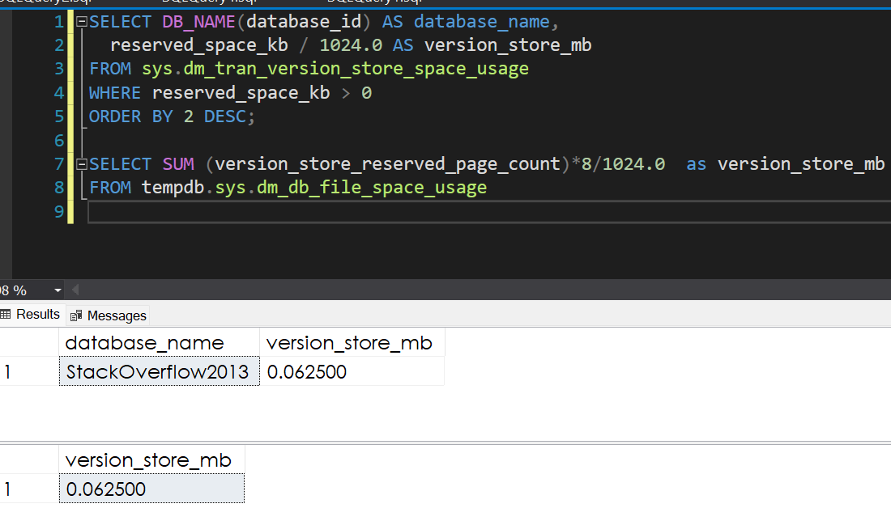
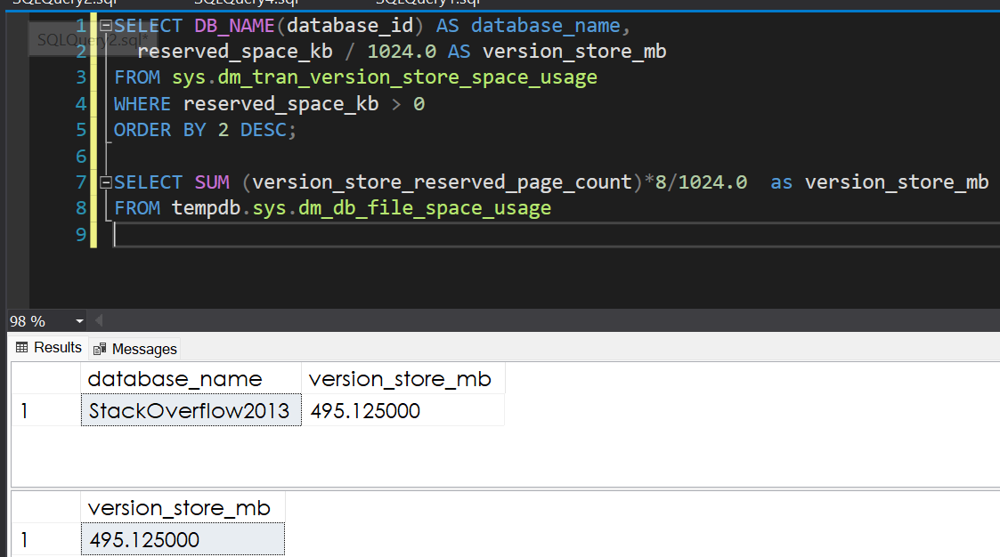
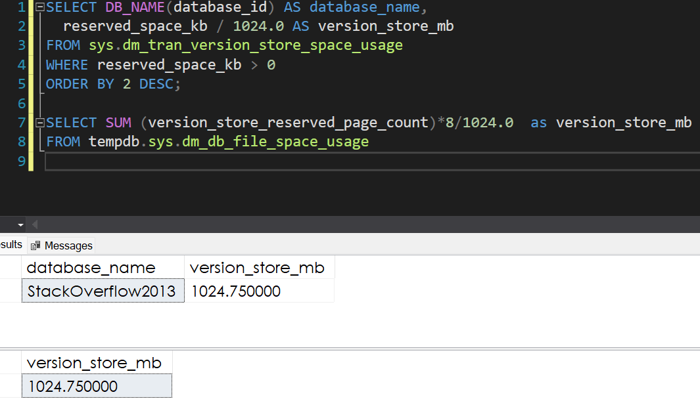
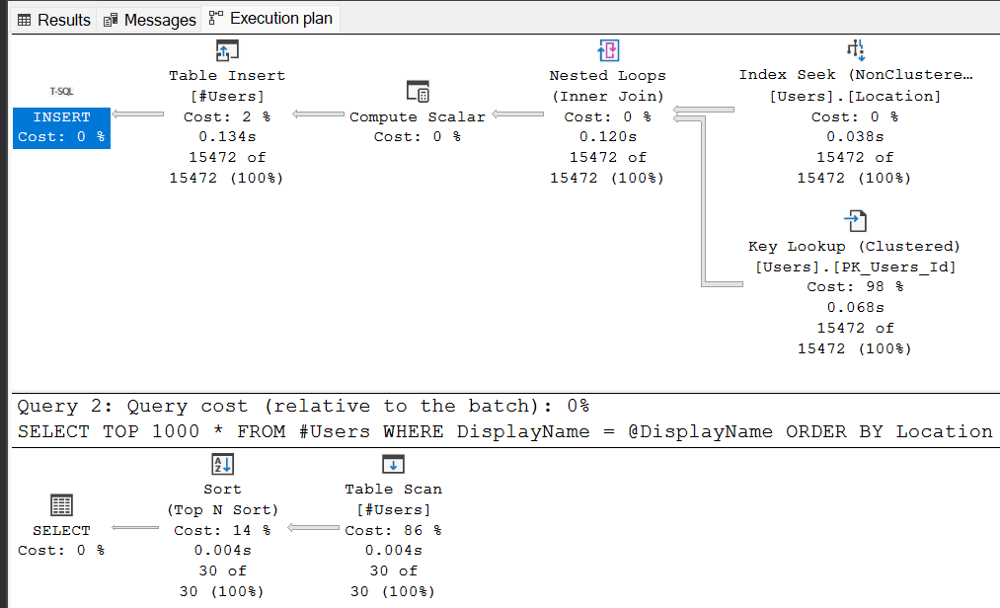

# Brent Ozar Course Notes
<style>
r { color: red }
o { color: Orange }
g { color: Green }
lg { color: lightgreen }
b { color: Blue }
lb { color: lightblue }
</style>

* Initial Training Page
  
  https://training.brentozar.com/courses/

---

## 1. First Responder Kit

* Index
  - [What are going to cover](#What-are-going-to-cover)
  - [How the Version Store Affects TempDB](#How-the-Version-Store-Affects-TempDB)
  - [NonCluster Index](#NonCluster-Index)
  - [Key lookups](#Key-lookups)
  - [The tipping point](#The-tipping-point)
  - [How the engine chooses between plans](#How-the-engine-chooses-between-plans)
  - [Cost-based query optimization](#Cost-based-query-optimization)
  - [How statistics come into play](#How-statistics-come-into-play)
  - [How your query syntax affects all this](#How-your-query-syntax-affects-all-this)
  - [How included columns mitigate these problems](#How-included-columns-mitigate-these-problems)
  
---

* What are going to cover
  1. What uses the TEMPDB?
  2. How that affects performance and configuration?
  3. Where to host the TEMPDB? based on your workload?
  4. How to monitor it?
 
1. What uses the TEMPDB?
  
  * How the Version Store Affects TempDB
  
  We’re going to start the class by talking about things that use TempDB. First up are a pair of my favorite features: Read Committed Snapshot Isolation (RCSI) and Snapshot Isolation (SI) help you quickly mitigate blocking problems. Readers don’t block writers, and writers don’t block readers. It’s also known as optimistic concurrency or multi-version concurrency control (MVCC).

  SQL Server performs this magic trick by storing multiple versions of the same row in something called the version store. The version store lives in TempDB (although SQL 2019 lets you put it in the user database itself, which introduces other problems)

  In this session, I’ll demonstrate how the version store helps queries, and the impact it has on TempDB.

  ```sql
  -- To avoid issue if you run the entire script at once.
  RAISERROR(N'Oops! No, don''t just hit F5. Run these demos one at a time.', 20, 1) WITH LOG;
  GO

  -- Check that the RCSI is OFF
  USE StackOverflow2013;
  GO
  ALTER DATABASE CURRENT 
    SET READ_COMMITTED_SNAPSHOT OFF WITH NO_WAIT
  GO

  /* We have to execute this on one SSMS conn whitout run the ROLLBACK */
  /* Query windows 1 */
  BEGIN TRAN
    UPDATE dbo.Users
    SET Location = N'Iceland'
    WHERE DisplayName = N'Brent Ozar';
  
  /* While that is open, run this in another window: */
  /* Query windows 2 */
  SELECT Location
    FROM dbo.Users
    WHERE DisplayName = N'Brent Ozar';
  
  /* If we stop the execution on Query Windows 2 and re-run using NOLOCK, which worked: */
  SELECT Location
    FROM dbo.Users WITH (NOLOCK)
    WHERE DisplayName = N'Brent Ozar';

  /* But with NOLOCK:
    1. You can see rows twice.
    2. You can skip rows
    3. Your query can fail with an error
    4. You can see data that was never committed, like what's about to happen here: We can see the 
      Iceland as a result when the update to Iceland was never COMMITED.
  */
  ```

  Fortunately, there's a better way: RCSI or SI, aka optimistic concurrency, aka MVCC.
  https://BrentOzar.com/go/rcsi

  You turn it on at the database level, but you have to be the only active connection:

  ```sql
  ALTER DATABASE CURRENT 
	SET READ_COMMITTED_SNAPSHOT ON WITH NO_WAIT
  GO

  /* We execute the same query again */
  BEGIN TRAN
	UPDATE dbo.Users
	SET Location = N'Iceland'
	WHERE DisplayName = N'Brent Ozar';

  /* We run the same SELECT again */
  SELECT Location
  FROM dbo.Users
  WHERE DisplayName = N'Brent Ozar';  
  ```

  Without NOLOCK, and without indexing or changing the query at all, it works! It sees a version of truth that's true before the
  update transaction finishes.

  Writers no longer block readers, and readers no longer block writers either.

  The magic happens because SQL Server stores versions of rows during transactions. They live in the "version store", which lives in
  TempDB (until SQL 2019, which lets you move the version store into the database - but that's outside of the scope of this class.)

  You can query to see how much space is used by the version store.
  
  ```sql
  /* SQL Server 2016 SP2 & newer: */
  /* Per DB*/
  SELECT DB_NAME(database_id) AS database_name,
    reserved_space_kb / 1024.0 AS version_store_mb
  FROM sys.dm_tran_version_store_space_usage
  WHERE reserved_space_kb > 0
  ORDER BY 2 DESC;

  /* Previous versions of SQL don't break it out per database: */
  SELECT SUM (version_store_reserved_page_count)*8/1024.0  as version_store_mb
  FROM tempdb.sys.dm_db_file_space_usage;
  ```
  
  

  
  ```sql
  /* The bigger your transactions are, the bigger the version store becomes.
     Our transaction is still open - and let's "modify" more data. */
  UPDATE dbo.Users
	  SET Reputation = Reputation;
  GO
  ```

  

  ```sql
  /* Inserts don't affect the size as long as we don't need to log prior versions of rows: */
  SELECT *
    INTO dbo.Badges_New
    FROM dbo.Badges;
  GO
  ```
  
  This happens because we don't need a copy of something that didn't exist before. We can't have a copy of a data that it wasn't INSERTED.

  ```sql
  /* But deletes will: */
  DELETE dbo.Badges;
  GO
  ```

  ```sql
  /* Commit our changes, and check the version store size: */
  COMMIT;
  ```
  The space is not realize automatically after the COMMIT. The SQL do it when he can on the background.

  ```sql
  /* RCSI & SI aren't the only things that use the version store, either. Triggers use it too! */
  CREATE TRIGGER upd_Users_Waiter ON dbo.Users FOR UPDATE AS
  BEGIN
	  WAITFOR DELAY '00:00:30';
  END
  GO
  
  UPDATE dbo.Users SET Reputation = Reputation;
  GO
  /* And while it runs, check the version store in another window: */
  ```
  
  

  Why? Because triggers have virtual tables called INSERTED and DELETED:
  https://docs.microsoft.com/en-us/sql/relational-databases/triggers/use-the-inserted-and-deleted-tables?view=sql-server-ver15

  Those have copies of the rows before & after your change! Big updates = big version store. (Inserts & deletes are only 1x the size.)

  What you learned in this session:

  * Read Committed Snapshot Isolation (RCSI) and Snapshot Isolation (SI) reduce blocking by storing versions of rows in TempDB.
  * Update & delete transactions basically copy their changes into TempDB.
  * The more data a transaction changes,and the longer the transaction stays open, and the more queries need to read those versions,
	  the bigger & slower TempDB is going to get.
  * Triggers don't reduce blocking - but they do have virtual INSERTED & DELETED tables, and those use the version store too.
  * Cleanup may not happen quickly enough for you, especially when any one database is holding transactions open: other databases'
    versions can't be cleaned up.
  * There's no simple formula to calculate how big your TempDB will get, or how long transactions will stay open. It depends on your app
    code. General speaking the size of the TEMPDB can be the 25% of the total dbs sizing. This is a good starting point.
  * This is why 3rd party monitoring tools warn about TempDB growths and large version store sizes. If someone leaves a transaction open,
    locks their workstation, and goes home, you're doomed.

  Learning resources:

  Open transactions in any database mean the version store can't be cleaned out:
  https://kohera.be/blog/sql-server/tempdb-the-ghost-of-version-store/
  https://docs.microsoft.com/en-us/archive/blogs/sqlserverstorageengine/managing-tempdb-in-sql-server-tempdb-basics-version-store-growth-and-removing-stale-row-versions

  Implicit transactions often cause problems with this:
  https://www.brentozar.com/archive/2018/02/set-implicit_transactions-one-hell-bad-idea/
  https://www.brentozar.com/archive/2019/07/using-implicit-transactions-you-really-need-rcsi/
  https://thesurfingdba.weebly.com/my-version-store-is-huge.html

  ```sql
  /* Query to check your own servers to find out which databases need the version store: */
  SELECT 
      db.name
    , db.is_read_committed_snapshot_on AS rcsi_on
    , db.snapshot_isolation_state_desc AS snapshot_isolation
    , COALESCE(vs.reserved_space_kb, 0) / 1024.0 AS version_store_mb
  FROM sys.databases db
  LEFT OUTER JOIN sys.dm_tran_version_store_space_usage vs 
  ON db.database_id = vs.database_id
  ORDER BY vs.reserved_space_kb DESC, db.name;
  ```

2. How that affects performance and configuration?
  * How Temp Tables Are Different from Regular Tables
  It seems so simple at first: queries create temp tables, load data, and drop ’em. How hard can it be?

  Spectacularly tricky, as it turns out.

  Temp tables share some behaviors with real tables, but they also have their own tricky behavior when it comes to statistics and execution plans. We’ll start by creating a real table to recap how statistics work, and then try the same task with a temp table to see what optimization tricks SQL Server has up its sleeve.

  ```sql
  /* Let's create a real table: */
  USE tempdb;
  GO

  DROP TABLE IF EXISTS dbo.Users_temp;
  CREATE TABLE dbo.Users_temp 
    (Id INT,
    DisplayName NVARCHAR(40),
    Location NVARCHAR(100));

  INSERT INTO dbo.Users_temp(Id, DisplayName, Location)
    SELECT Id, DisplayName, Location
    FROM StackOverflow2013.dbo.Users;
  GO

  /* When you run a query that would benefit from having statistics on a column, like this, when SQL Server needs to guess the memory required for the sort: */
  SELECT TOP 1000 *
    FROM dbo.Users_temp
    WHERE DisplayName = N'Abhishek'
    ORDER BY Location;
  GO

  -- After the execution the SQL create an automatic statistics
  sp_BlitzIndex @TableName = 'Users_temp';

  /* Now let's try the same thing with a temp table: */
  CREATE TABLE #Users_temp 
    (Id INT,
     DisplayName NVARCHAR(40),
     Location NVARCHAR(100));

  INSERT INTO #Users_temp(Id, DisplayName, Location)
    SELECT Id, DisplayName, Location
    FROM StackOverflow2013.dbo.Users;

  SELECT TOP 1000 *
  FROM #Users_temp
  WHERE DisplayName = N'Abhishek'
  ORDER BY Location;
  GO
  
  /* The same statistics process needs to happen, but it's a little harder to see since temp tables don't show up in Object Explorer: */
  SELECT * FROM sys.all_objects WHERE name LIKE '#Users_temp%'

  sp_BlitzIndex 
    @TableName = '#Users_temp_________________________________________________________________________________________________________000000000024';
  GO
  
  /* Things to discuss:
    * Temp Table
      * The table has stats just like a real table
      * The table has an actual size just like a real table
  
    * Temp tables are kinda like real tables, except for:
      * They get special names behind the scenes
      * They're only accessible per-session: one session shouldn't be able to read someone else's data

    * But temp tables also get some optimizations that aren't immediately obvious when you're creating just one table at a time.
      Let's create a stored procedure that will do some dumb work: */
  
  DROP TABLE #Users_temp;
  GO

  USE StackOverflow2013
  GO

  CREATE OR ALTER PROC dbo.usp_GetUsers @Location NVARCHAR(100), @DisplayName NVARCHAR(40) AS
  BEGIN
    CREATE TABLE #Users(
      Id          INT,
      DisplayName NVARCHAR(40),
      Location    NVARCHAR(100) );

    INSERT INTO #Users(Id, DisplayName, Location)
      SELECT Id, DisplayName, Location
      FROM   dbo.Users
      WHERE  Location = @Location;

    SELECT TOP 1000 *
    FROM  #Users
    WHERE DisplayName = @DisplayName
    ORDER BY Location;

    DROP TABLE #Users;
  END
  GO

  /* Turn on actual plans: */
  EXEC usp_GetUsers @Location = N'India', @DisplayName = N'Abhishek'
  ```

  

  ```sql
  /* How did your estimates vs actuals look?
    Here's what happened:
      1. SQL Server created a temp table
      2. We loaded it
      3. When the SELECT ran, SQL Server realized it needed statistics on the temp table, so it read the temp table and created the stats.
      4. SQL Server read the temp table for the SELECT

    Now, run this, but BEFORE you run it, think about which of the above 4 steps SQL Server will do: */
  EXEC usp_GetUsers @Location = N'Russia', @DisplayName = N'Aleksey'
  GO
  ```

  

  ```sql
  /* How did your estimates vs actuals look?
    Guess which TWO steps SQL Server didn't actually do:
      1. SQL Server created a temp table
      2. We loaded it
      3. When the SELECT ran, SQL Server realized it needed statistics on the temp table, so it read the temp table and created the stats
      4. SQL Server read the temp table for the SELECT

    Let's prove it by adding a DBCC SHOW_STATISTICS in the proc to show the contents of the stats:
  */

  CREATE OR ALTER PROC dbo.usp_GetUsers @Location NVARCHAR(100), @DisplayName NVARCHAR(40) AS
  BEGIN
    CREATE TABLE #Users
      (Id INT,
      DisplayName NVARCHAR(40),
      Location NVARCHAR(100));

    INSERT INTO #Users(Id, DisplayName, Location)
      SELECT Id, DisplayName, Location
      FROM dbo.Users
      WHERE Location LIKE @Location;

    SELECT TOP 1000 *
      FROM #Users
      WHERE DisplayName = @DisplayName
      ORDER BY Location;

    /* THIS IS NEW: */
    DBCC SHOW_STATISTICS('tempdb..#Users', DisplayName)

    DROP TABLE #Users;
  END
  GO

  /* Try one: */
  EXEC usp_GetUsers @Location = N'India', @DisplayName = N'Abhishek'

  -- Note
  -- When you execute the SP using India the stats shows Indian names

  /* Then run it for another: */
  EXEC usp_GetUsers @Location = N'Russia', @DisplayName = N'Aleksey'

  -- Note
  -- When you execute the SP using India the stats shows Indian names too. ERROR!!

  /* Try freeing the plan cache: */
  DBCC FREEPROCCACHE;
  GO

  /* Now try Russia first: */
  EXEC usp_GetUsers @Location = N'Russia', @DisplayName = N'Aleksey'
  -- Note
  -- When you execute the SP using India the stats shows Rusain names

  /* Then India: */
  EXEC usp_GetUsers @Location = N'India', @DisplayName = N'Abhishek'

  /* 
  THIS IS TWO DIFFERENT ISSUES:
    1. Parameter sniffing, but also
    2. THE TEMP TABLE'S STATS ARE NOT CHANGING!
    
    WE ARE ACTUALLY SEEING SOMEONE ELSE'S STATS. 
  */

  /* 
   Here's what's happening:
    1. SQL Server created a temp table - WE'RE NOT DOING THIS!
    2. We loaded it
    3. When the SELECT ran, SQL Server realized it needed statistics on the temp table, so it read the temp table and created the stats -
       WE'RE NOT DOING THIS EITHER!
    4. SQL Server read the temp table for the select

    Temp tables have a tricky optimization:
      Their structure and their statistics can be reused across different sessions. This is part of the magic that helps temp tables run
      faster.

      However, depending on what you DO to the temp tables, you can change that behavior. Temp tables get cached if they're created with a
      single CREATE, and then not changed afterwards.
      
      For example, here I've added an index to the temp table, and now each time I run it, I get unique stats just for that temp table: 
  */

  CREATE OR ALTER PROC dbo.usp_GetUsers @Location NVARCHAR(100), @DisplayName NVARCHAR(40) AS
  BEGIN
    CREATE TABLE #Users
      (Id INT,
      DisplayName NVARCHAR(40),
      Location NVARCHAR(100));

    /* THIS IS NEW */
    CREATE INDEX Id ON #Users(Id);

    INSERT INTO #Users(Id, DisplayName, Location)
      SELECT Id, DisplayName, Location
      FROM dbo.Users
      WHERE Location LIKE @Location;

    SELECT TOP 1000 *
      FROM #Users
      WHERE DisplayName = @DisplayName
      ORDER BY Location;

    DBCC SHOW_STATISTICS('tempdb..#Users', DisplayName)

    DROP TABLE #Users;
  END
  GO
  
  /* Try one: */
  EXEC usp_GetUsers @Location = N'India', @DisplayName = N'Abhishek'

  /* Then run it for another: */
  EXEC usp_GetUsers @Location = N'Russia', @DisplayName = N'Aleksey'
  
  
  /* This might seem like a good thing: you might think you WANT to get fresh statistics every time your query runs. However, there's a dark side: each time you get fresh numbers, you're also forcing SQL Server to build new statistics and recompile the execution plan.

  You can see this happening by running Erik's sp_HumanEvents in another window:
  */
  EXEC dbo.sp_HumanEvents @event_type = 'recompilations', @seconds_sample = 10
  GO

  /* While you run a few of these: */
  EXEC usp_GetUsers @Location = N'India', @DisplayName = N'Abhishek'
  EXEC usp_GetUsers @Location = N'Russia', @DisplayName = N'Aleksey'
  EXEC usp_GetUsers @Location = N'India', @DisplayName = N'Abhishek'
  EXEC usp_GetUsers @Location = N'Russia', @DisplayName = N'Aleksey'
  EXEC usp_GetUsers @Location = N'India', @DisplayName = N'Abhishek'
  EXEC usp_GetUsers @Location = N'Russia', @DisplayName = N'Aleksey'
  GO

  /* Whereas if we go back to the earlier version of the stored proc that doesn't create an index: */
  CREATE OR ALTER PROC dbo.usp_GetUsers @Location NVARCHAR(100), @DisplayName NVARCHAR(40) AS
  BEGIN
    CREATE TABLE #Users
      (Id INT,
      DisplayName NVARCHAR(40),
      Location NVARCHAR(100));

    INSERT INTO #Users(Id, DisplayName, Location)
      SELECT Id, DisplayName, Location
      FROM dbo.Users
      WHERE Location LIKE @Location;

    SELECT TOP 1000 *
      FROM #Users
      WHERE DisplayName = @DisplayName
      ORDER BY Location;

    /* THIS IS NEW: */
    DBCC SHOW_STATISTICS('tempdb..#Users', DisplayName)

    DROP TABLE #Users;
  END
  GO

  /* Then these don't get recompiles: */
  EXEC usp_GetUsers @Location = N'India', @DisplayName = N'Abhishek'
  EXEC usp_GetUsers @Location = N'Russia', @DisplayName = N'Aleksey'
  EXEC usp_GetUsers @Location = N'India', @DisplayName = N'Abhishek'
  EXEC usp_GetUsers @Location = N'Russia', @DisplayName = N'Aleksey'
  EXEC usp_GetUsers @Location = N'India', @DisplayName = N'Abhishek'
  EXEC usp_GetUsers @Location = N'Russia', @DisplayName = N'Aleksey'
  GO
  ```

  * What you learned in this session:

   1. Temp tables have 2 cool optimizations that help	queries run faster, especially when we have a lot of queries that keep creating/dropping temp tables:
      1. Their structure can be reused across sessions
      2. Their statistics can be reused, too

   2. Even if you explicitly drop a temp table, you still get these optimizations.

   3. However, if you modify a temp table after it's created, you lose these optimizations, but you GAIN more accurate statistics (at the
	    expense of slower temp table creation, stats updates, and higher CPU for recompilations.)

   4. It's up to you to figure out which one you want:
      1. Temp table reuse, or
	    2. New temp tables each time

  There are a lot more code behaviors that influence whether you get temp table & statistics reuse:
  https://www.brentozar.com/archive/2020/11/paul-white-explains-temp-table-caching-3-ways/


3. How Table Variables Can Be Better Than Temp Tables

Table variables have a bad reputation because they don’t have statistics. When you go to pull data out of a table variable, SQL Server can’t accurately predict how many rows will come out, and this causes cascading problems in execution plans.

But sometimes, that’s actually a good thing.

If your SQL Server’s biggest performance problem is high CPU caused by frequent recompilations due to changing statistics on temp tables, and as long as you can deal with the strange estimates on table variables, table variables can actually be the solution to the high CPU problem.

  ```sql
  /* In the last session, we created a temp table and saw how SQL Server automatically created statistics on it to help build 
  better plans.

  Let's try the same thing with a table variable, starting in SQL Server 2017 compat mode. (You can use 2016 compat mode if 
  you're running the class on a 2016 VM. Also, turn on actual plans. */
  USE StackOverflow2013;
  GO
  ALTER DATABASE CURRENT SET COMPATIBILITY_LEVEL = 140;
  GO

  -- Create variabl table
  DECLARE @Users_temp TABLE
    (Id INT,
    DisplayName NVARCHAR(40),
    Location NVARCHAR(100));

  INSERT INTO @Users_temp(Id, DisplayName, Location)
    SELECT Id, DisplayName, Location
    FROM StackOverflow2013.dbo.Users;

  SELECT TOP 1000 *
    FROM @Users_temp
    WHERE DisplayName = N'Abhishek'
    ORDER BY Location;

  SELECT * FROM sys.all_objects WHERE name LIKE '%Users_temp%'
  GO

  /* Things to discuss:

  * The estimates on the select from the table variable are wrong. Estimated only 1 but the Actual Read is 2.4 million.
  * SQL Server doesn't know how many rows are in it.
  * SQL Server sure as heck doesn't know how many	rows will match a specific value either!
  * The table variable doesn't show up in sys.all_objects
  * It's not really a table: it behaves more like a variable (those don't go in all_objects either)

  At first, this sounds bad, because the estimates are wrong.

  However...what if the estimates AREN'T wrong? What if we're not searching for Abhishek?
  */

  DECLARE @Users_temp TABLE
    (Id INT,
    DisplayName NVARCHAR(40),
    Location NVARCHAR(100));

  INSERT INTO @Users_temp(Id, DisplayName, Location)
    SELECT Id, DisplayName, Location
    FROM StackOverflow2013.dbo.Users;

  SELECT TOP 1000 *
    FROM @Users_temp
    WHERE DisplayName = N'Brent Ozar'
    ORDER BY Location;
  GO

  /* If the number of rows we're getting out of the table variable don't really matter because:

  * They're low (like under 100), or
  * We're not doing anything with the rows after we get them, like we're not sorting them or joining them to any other objects

  Then table variables have a cool advantage:
    * They don't have stats
    * But that also means they don't trigger recompiles

  Use the same stored proc we had last time: */

  CREATE OR ALTER PROC dbo.usp_GetUsers_TableVariable
    @Location NVARCHAR(100), @DisplayName NVARCHAR(40) AS
  BEGIN
    DECLARE @Users TABLE
      (Id INT,
      DisplayName NVARCHAR(40),
      Location NVARCHAR(100));

    INSERT INTO @Users(Id, DisplayName, Location)
      SELECT Id, DisplayName, Location
      FROM dbo.Users
      WHERE Location = @Location;

    SELECT TOP 1000 *
      FROM @Users
      WHERE DisplayName = @DisplayName
      ORDER BY Location;
  END
  GO

  /* Run this with actual plan on and note that the estimates are just 1 row: */
  EXEC usp_GetUsers_TableVariable @Location = N'India', @DisplayName = N'Abhishek'

  /* Why 1 row?
    * SQL Server doesn't know how many total rows are in the table variable, AND
    * SQL Server doesn't know the data distribution either, like the breakdown per name
  */

  /* Then while we measure recompiles in another window: */
  EXEC dbo.sp_HumanEvents @event_type = 'recompilations', @seconds_sample = 10
  GO

  /* Run these: */
  EXEC usp_GetUsers_TableVariable @Location = N'India', @DisplayName = N'Abhishek'
  EXEC usp_GetUsers_TableVariable @Location = N'Russia', @DisplayName = N'Aleksey'
  EXEC usp_GetUsers_TableVariable @Location = N'India', @DisplayName = N'Abhishek'
  EXEC usp_GetUsers_TableVariable @Location = N'Russia', @DisplayName = N'Aleksey'
  EXEC usp_GetUsers_TableVariable @Location = N'India', @DisplayName = N'Abhishek'
  EXEC usp_GetUsers_TableVariable @Location = N'Russia', @DisplayName = N'Aleksey'
  GO


  /* So to recap table variables so far:

    * They don't get statistics, so:
      * Bad  news: estimates are usually off, but
      * Good news: they don't recompile as contents change

  Something changed in SQL Server 2019, though: */

  ALTER DATABASE CURRENT SET COMPATIBILITY_LEVEL = 150; /* 2019 */
  GO

  /* Run this with actual plan on: */
  EXEC usp_GetUsers_TableVariable @Location = N'India', @DisplayName = N'Abhishek'

  /* Before, we had an estimate of 1 row because:
    * SQL Server didn't know how many total rows are in the table variable, AND
    * SQL Server didn't know the data distribution either, like the breakdown per name

  But now, hover your mouse over the table variable scan and look at Estimated Number of Rows to be Read.

  In SQL Server 2019:
    * SQL Server DOES know how many rows are in it, but
    * Still doesn't know the data distribution per name

  In some ways, this is an improvement, but in other ways, it's a drawback, because watch what happens if you run it for a 
  DIFFERENT value:
  */

  EXEC usp_GetUsers_TableVariable @Location = N'Russia', @DisplayName = N'Aleksey'

  /* Look at the table variable scan estimates:

  * The estimated number of rows TO BE READ is the same
  * The estimated number of rows TO BE FOUND is the same

  This is NOT THE SAME THING that happens with temp tables. THIS IS DIFFERENT.

  With temp table stats reuse:
    * You could inherit someone else's table stats
    * You could inherit their estimates, too
    * Those estimates could change as the temp table's contents changed as queries run

  With table variables:
    * You WILL inherit the total number of rows in the object from the compiled plan
    * There are no column stats (data distribution) to inherit, so these are just consistently wrong
    * This has less to do with temp tables, and more like conventional parameter sniffing problems
  */


  /****************************************************************************************************************************
  What you learned in this session:

  Table variables are okay if:

    * Your query brings back a few rows, and
    * The contents (data distribution) of those rows don't matter at all, and
    * You're not doing anything with the data (like you're not sorting it or joining it to other tables)
    * You need to prevent recompilations
    * You don't care if you inherit someone else's plan (because all the data is tiny anyway no matter what parameters people 
    use)

  But be aware that:

    * Even though they don't show up in all_objects, they still take up space in TempDB.
    * Starting in SQL Server 2019, the first params for a proc will cause the plan to be built with an understanding of the 
      number of rows in the table variable (but not an understanding of the data distribution, because there are no stats)
  ****************************************************************************************************************************/
  ```

* Temp Tables & Table Variables at Scale: PFS/GAM/SGAM Contention

Because it’s so easy to create & use temp tables, some applications grow to depend on ’em. If your workload creates, loads, and drops thousands of temp tables per second, you can hit a SQL Server bottleneck involving how SQL Server tracks where objects live in TempDB. It’s called latch contention, also known as PFS/GAM/SGAM contention. We’ll demo it, and then talk about a few ways to resolve it.

  ```sql
  /* In the last session, we created a temp table and saw how SQL Server automatically created statistics on it to help build 
  better plans.

  Let's try the same thing with a table variable, starting in SQL Server 2017 compat mode. (You can use 2016 compat mode if 
  you're running the class on a 2016 VM. Also, turn on actual plans. */
  USE StackOverflow2013;
  GO
  ALTER DATABASE CURRENT SET COMPATIBILITY_LEVEL = 140;
  GO

  -- Create variabl table
  DECLARE @Users_temp TABLE
    (Id INT,
    DisplayName NVARCHAR(40),
    Location NVARCHAR(100));

  INSERT INTO @Users_temp(Id, DisplayName, Location)
    SELECT Id, DisplayName, Location
    FROM StackOverflow2013.dbo.Users;

  SELECT TOP 1000 *
    FROM @Users_temp
    WHERE DisplayName = N'Abhishek'
    ORDER BY Location;

  SELECT * FROM sys.all_objects WHERE name LIKE '%Users_temp%'
  GO

  /* Things to discuss:

  * The estimates on the select from the table variable are wrong. Estimated only 1 but the Actual Read is 2.4 million.
  * SQL Server doesn't know how many rows are in it.
  * SQL Server sure as heck doesn't know how many	rows will match a specific value either!
  * The table variable doesn't show up in sys.all_objects
  * It's not really a table: it behaves more like a variable (those don't go in all_objects either)

  At first, this sounds bad, because the estimates are wrong.

  However...what if the estimates AREN'T wrong? What if we're not searching for Abhishek?
  */

  DECLARE @Users_temp TABLE
    (Id INT,
    DisplayName NVARCHAR(40),
    Location NVARCHAR(100));

  INSERT INTO @Users_temp(Id, DisplayName, Location)
    SELECT Id, DisplayName, Location
    FROM StackOverflow2013.dbo.Users;

  SELECT TOP 1000 *
    FROM @Users_temp
    WHERE DisplayName = N'Brent Ozar'
    ORDER BY Location;
  GO

  /* If the number of rows we're getting out of the table variable don't really matter because:

  * They're low (like under 100), or
  * We're not doing anything with the rows after we get them, like we're not sorting them or joining them to any other objects

  Then table variables have a cool advantage:
    * They don't have stats
    * But that also means they don't trigger recompiles

  Use the same stored proc we had last time: */

  CREATE OR ALTER PROC dbo.usp_GetUsers_TableVariable
    @Location NVARCHAR(100), @DisplayName NVARCHAR(40) AS
  BEGIN
    DECLARE @Users TABLE
      (Id INT,
      DisplayName NVARCHAR(40),
      Location NVARCHAR(100));

    INSERT INTO @Users(Id, DisplayName, Location)
      SELECT Id, DisplayName, Location
      FROM dbo.Users
      WHERE Location = @Location;

    SELECT TOP 1000 *
      FROM @Users
      WHERE DisplayName = @DisplayName
      ORDER BY Location;
  END
  GO

  /* Run this with actual plan on and note that the estimates are just 1 row: */
  EXEC usp_GetUsers_TableVariable @Location = N'India', @DisplayName = N'Abhishek'

  /* Why 1 row?
    * SQL Server doesn't know how many total rows are in the table variable, AND
    * SQL Server doesn't know the data distribution either, like the breakdown per name
  */

  /* Then while we measure recompiles in another window: */
  EXEC dbo.sp_HumanEvents @event_type = 'recompilations', @seconds_sample = 10
  GO

  /* Run these: */
  EXEC usp_GetUsers_TableVariable @Location = N'India', @DisplayName = N'Abhishek'
  EXEC usp_GetUsers_TableVariable @Location = N'Russia', @DisplayName = N'Aleksey'
  EXEC usp_GetUsers_TableVariable @Location = N'India', @DisplayName = N'Abhishek'
  EXEC usp_GetUsers_TableVariable @Location = N'Russia', @DisplayName = N'Aleksey'
  EXEC usp_GetUsers_TableVariable @Location = N'India', @DisplayName = N'Abhishek'
  EXEC usp_GetUsers_TableVariable @Location = N'Russia', @DisplayName = N'Aleksey'
  GO


  /* So to recap table variables so far:

    * They don't get statistics, so:
      * Bad  news: estimates are usually off, but
      * Good news: they don't recompile as contents change

  Something changed in SQL Server 2019, though: */

  ALTER DATABASE CURRENT SET COMPATIBILITY_LEVEL = 150; /* 2019 */
  GO

  /* Run this with actual plan on: */
  EXEC usp_GetUsers_TableVariable @Location = N'India', @DisplayName = N'Abhishek'

  /* Before, we had an estimate of 1 row because:
    * SQL Server didn't know how many total rows are in the table variable, AND
    * SQL Server didn't know the data distribution either, like the breakdown per name

  But now, hover your mouse over the table variable scan and look at Estimated Number of Rows to be Read.

  In SQL Server 2019:
    * SQL Server DOES know how many rows are in it, but
    * Still doesn't know the data distribution per name

  In some ways, this is an improvement, but in other ways, it's a drawback, because watch what happens if you run it for a 
  DIFFERENT value:
  */

  EXEC usp_GetUsers_TableVariable @Location = N'Russia', @DisplayName = N'Aleksey'

  /* Look at the table variable scan estimates:

  * The estimated number of rows TO BE READ is the same
  * The estimated number of rows TO BE FOUND is the same

  This is NOT THE SAME THING that happens with temp tables. THIS IS DIFFERENT.

  With temp table stats reuse:
    * You could inherit someone else's table stats
    * You could inherit their estimates, too
    * Those estimates could change as the temp table's contents changed as queries run

  With table variables:
    * You WILL inherit the total number of rows in the object from the compiled plan
    * There are no column stats (data distribution) to inherit, so these are just consistently wrong
    * This has less to do with temp tables, and more like conventional parameter sniffing problems
  */
  ```

* How Memory-Optimized Table Variables Reduce Contention

In the last module, we finished up by showing how Microsoft used In-Memory OLTP (Hekaton) technology in SQL Server 2019 to let TempDB’s system tables work faster. That’s an easy way to reduce latch wait times, but it’s not the only way: you can directly adopt In-Memory OLTP yourself by changing your temp tables to use ’em.

  ```sql
  /* If you're on SQL Server 2019, check to make sure this returns a 0: */
  SELECT SERVERPROPERTY('IsTempDBMetadataMemoryOptimized');
  GO

  /* If it returns a 1, let's turn this feature off for now in order to demo SQL Server's traditional problem in TempDB: */
  ALTER SERVER CONFIGURATION SET MEMORY_OPTIMIZED TEMPDB_METADATA=OFF;
  /* And you'll then need to restart SQL Server. */


  /* Before we start, review the number of files we've got in TempDB: */
  SELECT type_desc, name, physical_name, 
    size * 8.0 / 1024 AS size_mb
    FROM tempdb.sys.database_files
    ORDER BY type_desc DESC;


  USE StackOverflow2013;
  GO
  CREATE OR ALTER PROCEDURE dbo.TempTable AS
    SELECT TOP 1000 Id, AboutMe
    INTO #t1
    FROM dbo.Users WITH (NOLOCK)
    OPTION (MAXDOP 1);
  GO

  /* When you run just one, it's quick: */
  SET STATISTICS TIME, IO ON;
  GO
  EXEC TempTable;

  /* But run that in SQLQueryStress on a lot of threads while we measure: */
  EXEC sp_BlitzFirst @ExpertMode = 1, @Seconds = 60;
  EXEC sp_WhoIsActive;
  GO


  /* What if we try table variables? */
  CREATE OR ALTER PROCEDURE dbo.TableVariable AS
  BEGIN
    DECLARE @TableVariable TABLE (Id INT, AboutMe NVARCHAR(MAX));

    INSERT INTO @TableVariable (Id, AboutMe)
    SELECT TOP 1000 Id, AboutMe
    FROM dbo.Users WITH (NOLOCK)
    OPTION (MAXDOP 1);
  END
  GO


  /* Try just one: */
  SET STATISTICS TIME, IO ON;
  GO
  EXEC TableVariable;

  /* Then run it in SQLQueryStress on a lot of threads. */
  EXEC sp_BlitzFirst @ExpertMode = 1, @Seconds = 60;
  EXEC sp_WhoIsActive;
  GO


  /* SQL Server 2019 brings a new system-level feature to help solve this: */
  ALTER SERVER CONFIGURATION SET MEMORY_OPTIMIZED TEMPDB_METADATA=ON;

  /* Restart the SQL Server instance for it to take effect, then check it: */
  SELECT SERVERPROPERTY('IsTempDBMetadataMemoryOptimized');
  GO

  /* Then run both the TempTable and TableVariable load tests again while watching page latch waits. */
  EXEC sp_BlitzFirst @ExpertMode = 1, @Seconds = 60;
  EXEC sp_WhoIsActive;
  GO


  /* Turn this back off for the lab: */
  ALTER SERVER CONFIGURATION SET MEMORY_OPTIMIZED TEMPDB_METADATA=OFF;
  /* Restart the SQL Server instance for it to take effect, then check it: */
  SELECT SERVERPROPERTY('IsTempDBMetadataMemoryOptimized');
  GO

  /* During the break, check your production servers to see how many files they have: */
  SELECT type_desc, name, physical_name, 
    size * 8.0 / 1024 AS size_mb
    FROM tempdb.sys.database_files
    ORDER BY type_desc DESC;
  GO
  /* And look for PAGELATCH waits amongst your top 10, indicating that you may need more files (or a code change): */
  sp_BlitzFirst @OutputType = 'Top10'

  /* Not PAGEIOLATCH% or LATCH% - we're specifically looking for PAGELATCH%. */
  ```


* How Execution Plans Use TempDB

When you see a yellow bang warnings on sort, hash match, or adaptive join operators in an execution plan, that’s a sign that TempDB was invited to the party. When SQL Server runs out of memory, the data spills over into TempDB. Let’s see how it happens, and what we can do about it.

  ```sql
  USE StackOverflow2013;
  GO

  /* Use the newest compat level your server supports, but not SQL Server 2019 yet. 130 = 2016, 140 = 2017. */
  ALTER DATABASE CURRENT SET COMPATIBILITY_LEVEL = 140;
  GO
  DropIndexes;
  GO
  CREATE INDEX IX_OwnerUserId ON dbo.Posts(OwnerUserId) INCLUDE (Score, Title);
  GO

  CREATE OR ALTER PROC dbo.usp_UsersInTopLocation AS
  BEGIN
    WITH TopLocation AS (
      SELECT TOP 1 
        Location
      FROM dbo.Users
      WHERE Location <> ''
      GROUP BY Location
      ORDER BY COUNT(*) DESC
    )
    SELECT	u.*
    FROM	TopLocation
    JOIN	dbo.Users u 
    ON		TopLocation.Location = u.Location
    ORDER BY DisplayName;
  END
  GO
  
  /* Run this with actual plans on: */
  DBCC FREEPROCCACHE;

  EXEC usp_UsersInTopLocation
  GO

  /* Things to discuss:
    1. Estimates vs actuals through query
      1.1 Memory grant: ____ KB
      1.2 Memory used : ____ KB
      1.3 How many operators spilled

    Run it again. Do things improve? 

    To find queries having the problem, turn off actual plans and run: */

  sp_BlitzCache @SortOrder = 'spills'

  /* Things to note:
    1. Memory grant: granted, used
    2. Spills: min, max, total, avg

    In this case, adding more memory won't help: the query just doesn't want enough memory.

    To learn a few ways to fix it with index & query tuning, watch my Fundamentals of Query Tuning:
    https://BrentOzar.com/go/queryfund

    SQL Server 2019 has a way to fix it though:
  */
  ALTER DATABASE CURRENT SET COMPATIBILITY_LEVEL = 150;

  ALTER DATABASE SCOPED CONFIGURATION SET LAST_QUERY_PLAN_STATS = ON;
  GO

  DBCC FREEPROCCACHE;

  EXEC usp_UsersInTopLocation
  GO

  /* Things to discuss:

    1. Estimates vs actuals through query
      1.1 Memory grant: ____ KB (is this higher?)
      1.2 Memory used: ____ KB
      1.3 How many operators spilled

    Now we have a different problem: we got granted too much memory!

    Try running it a few more times to see if it gets better/worse: */

  EXEC usp_UsersInTopLocation
  GO 10

  /* Turn off actual plans: */
  sp_BlitzCache;
  GO

  /* Look at these columns:
    * Minimum Memory Grant KB
    * Maximum Memory Grant KB

    * Minimum Used Grant KB
    * Maximum Used Grant KB

    * Spills - min, max, total, avg

    That's a query that behaves the same way every time because it doesn't have parameters. If we use a more complex proc:
  */

  CREATE OR ALTER PROC dbo.usp_UsersByReputation @Reputation INT AS
      SELECT TOP 100000 u.Id, p.Title, p.Score
      FROM dbo.Users u
      JOIN dbo.Posts p 
    ON   p.OwnerUserId = u.Id
      WHERE u.Reputation = @Reputation
      ORDER BY p.Score DESC;
  GO

  /* And run it: */
  DBCC FREEPROCCACHE;

  /* Turn on actual plans: */ 
  EXEC usp_UsersByReputation @Reputation = 1;
  GO
  
  
  /* Check out that adaptive join:
    * Adaptive threshold in tooltip
    * Over threshold: do an index scan
    * Under: do a seek

    * Also, note that nothing spills.
  
  Try another reputation: */
  EXEC usp_UsersByReputation @Reputation = 2;
  GO

  /* It chooses the seek, but...we have a yellow bang. SQL Server is about to adjust the memory grant downwards because we left 
  too much unused. Try it again: */
  EXEC usp_UsersByReputation @Reputation = 2;

  /* And the memory grant goes down. But now try the big one again: */
  EXEC usp_UsersByReputation @Reputation = 1;
  GO


  /* Turn OFF actual plans, and: */
  sp_BlitzCache

  /* Look at the:
    * Query plan - last actual plan enabled
    * Min/max memory grants
    * Spills (!!!) */


  /* Takeaways from this:

  * This TempDB consumer is particularly hard to predict: it's different on a query-by-query basis, and changes with SQL Server 
    versions.

  * Microsoft's trying to make it better with adaptive memory grants, but right now, it's worse instead of better.

  * To look for queries causing spills, run: sp_BlitzCache @SortOrder = 'spills'

  * In their plans, look for:
    * Sorts
    * Hash matches
    * Adaptive joins

  During the break, check your own production server's plan cache to see which queries have been spilling the most to disk:
  */

  sp_BlitzCache @SortOrder = 'spills';
  GO

  /* And scroll across to the Total Spills column. */
  ```

* Other TempDB Consumers: Cursors, Index Builds, AG Statistics

I often joke that TempDB is like SQL Server’s public toilet: there’s all kinds of crazy stuff happening inside there. Seems like whenever Microsoft needs a holding place for something, they resort to TempDB. That’s not necessarily bad – we gotta put it somewhere – but being aware of these extra uses will come in handy 
if your workload relies heavily on one of these unusual consumers.

  ```sql
  SELECT 'ALTER DATABASE tempdb MODIFY FILE (NAME = [' + f.name + '],'
    + ' FILENAME = ''Z:\MSSQL\DATA\' + f.name
    + CASE WHEN f.type = 1 THEN '.ldf' ELSE '.mdf' END
    + ''');'
  FROM sys.master_files f
  WHERE f.database_id = DB_ID(N'tempdb');
  ```

  * How bit the TempDB should be?
  It’s impossible to guess this stuff.
  If you’re building a new server, you just can’t know.
  My guideline: 25% of the total data size
  on the entire server.
  Yes, even on 10TB data warehouses:
  after all, we do big data loads & reloads.

  There are exceptions.
  Client scenario, simplified:
    • The server has 10TB of data
    • It’s 10 databases, each 1TB
    • Each 1TB database has a single 800GB table (that’s ten 800GB tables in total)
    • They rebuild indexes in parallel, with sort_in_tempdb = on.  They needed at least 8TB TempDB space.

  Another example
  • 20TB database
  • Crazy fast SAN, no point of sort_in_tempdb
  • In a sync Availability Group (we couldn’t rebuild indexes)
  • No transactions, triggers,  version store (all nolock)
  • 100GB TempDB would be fine

  * Where do we put it?
  Solid state storage. In this day and age, nothing latency-sensitive should be on magnetic hard drives.
  If you’re on a bare metal server...
  If you’re on dedicated hardware (not a VM), I strongly recommend using local SSD for TempDB.
  It’s cheap: under $500/TB, much cheaper than SAN.
  It’s fast: sub-millisecond latency.
  It keeps your storage network free from TempDB traffic, letting it focus on valuable traffic to real databases.
  It doesn’t need to persist: it’s okay if the contents don’t fail over when the server restarts.
  
  If you’re in a VM in the cloud...
  If you’re in a cloud VM like AWS EC2 or Azure VMs, use ephemeral storage.
  That’s the cloud term for local SSD.
  It does disappear when the VM dies, but that’s just like local SSD on a bare metal machine.
  It’s WAY faster than shared storage in the cloud.
  
  If you’re in a conventional VM...
  If you’re hosting your VMs in VMware or Hyper-V, you’ll probably have to put TempDB on the SAN.
  Your VM admins won’t want to use local SSD.
  If they use local SSD, they won’t be able to fail a VM around to different servers.
  This is just the price you pay for virtualization’s higher availability.
  If you’re in a VM, continued Should TempDB be on its own dedicated volume?(Remember: this point is irrelevant for bare metal or cloud VMs because in those cases, you’d be using a pair of mirrored local SSDs anyway.)
  Can your sysadmins disable SAN replication on the TempDB volume? If so, use a separate volume. Can they set different caching settings on the TempDB volume? If so, check with your storage vendor’s best practices.

  If it’s on a dedicated volume...
  And if that volume has pretty limited space, I’ve used an emergency vent valve file.
  Create a 1MB file on a much larger volume Enable autogrowth in a big increment Set up alerts for when that file grows
  (and it’s a real emergency) Proportional fill means we won’t use it a lot

  * How many data files do we need?
  Normal databases have 1 data file.
  And this file will have one of each of those special PFS and SGAM pages. (It gets more pages as its size grows.)
  This is fine for regular databases, but...tempdb data file TempDB is different.
  New objects created Objects dropped System databases Almost never Almost never User databases Every now and then Every now and then
  TempDB CONSTANTLY CONSTANTLY

  This causes a problem.
  SQL Server was never really designed for constant creation/dropping of objects.
  To create or drop an object, SQL Server has to write to special system pages.
  •PFS: Page Free Space pages
  •SGAM: Shared Global Allocation Map pages

  Latches protect these pages in memory.
  Think of this as a lightweight lock.
  This isn’t a disk storage problem.
  It’s about contention for a system page.
  These pages are stored on disk.
  But we’re not waiting on disk to get ‘em.
  We have these contention problems even when the data is stored in RAM. The fix is a little odd...
  How to configure TempDB
  Create 4-8 equally sized data files.
  The exact number is less important than just “more.”
  If you’re using local (ephemeral) storage:
  • Take the total available space
  • Divide that by 5
  • Create 4 data files with that size
  • Create 1 log file with that size

  * How many log files do we need?
  Just 1. Log file access is sequential.
  SQL Server starts at the beginning of the log, Logs transactions, And when it gets to the end of the log file, If space at the beginning is available for reuse, it’ll loop back and reuse that, Otherwise it grows the log file out.

  * Should we enable autogrowth?
  If you’re on bare metal or cloud...
  Then you used a dedicated local SSD volume for TempDB anyway.
  It’s dedicated to TempDB.
  Just grow the files out to fill the space.
  You’re done: you’ll never have to worry about monitoring for growths. Growing is done.
  You just have to worry about it filling up.
  If you’re on a VM, sharing space...
  If you decided to use a single volume for both user databases & log files, plus TempDB, it gets harder.
  You’ll probably want to:
  • Configure the TempDB data files to total up to 25% of the size of the server’s data, but
  • Still leave autogrowth enabled in case someone does something terrible – try not to go down.

  * What if we run out of space?
  You will. It’s a matter of time.
  Someone’s gonna do something bad.
  You just need to prepare by:
  • Monitoring what percentage of TempDB has been used, and
  • Send alerts when it’s high enough that you need to investigate, and
  • Leave yourself time to take action

  * Should we enable trace flags?
  For SQL Server 2014 & prior, yes:
    Trace flag 1117: grows all data files in a filegroup equally (but also applies to user databases).
    Trace flag 1118: doesn’t use mixed extents in TempDB, alleviates some of the pressure.
  
  To set up trace flags to run at startup, use SQL Server Configuration Manager: https://docs.microsoft.com/en-
  us/sql/database-engine/configure-windows/scm-services-configure-server-startup-options

  But 2016 & subsequent versions don’t need these

  SQL Server 2016 & later
  1117: replaced by AUTOGROW_ALL_FILES option of ALTER DATABASE. (Default = on for TempDB, but not user dbs.)
  1118: replaced by MIXED_PAGE_ALLOCATION ON argument for ALTER DATABASE SET. (Default = on for all system databases, but off 
  for user dbs.)

  * Should we change an existing server?
  One extreme: tiny TempDB Someone’s been shrinking files TempDB’s size is much smaller than what I’d expect, like total DBs are 1TB, and TempDB 10GB (1%) They were shrinking because we didn’t have enough available drive space

  Solution: get more drive space before you change anything

  Other extreme: giant single file No one was managing TempDB We have just one data file, and it’s big
  Solution:
  • Note its data file size
  • Shrink it back down to zero
  • Grow it back out to ¼ of the prior size
  • Add 3 more data files, all that same size Anything else: leave it.
  
  Don’t stress out over:
  • The exact number of files
  • The exact size of data & log files

  As long as:
  • Data files are all equally sized
  • Monitoring doesn’t indicate a TempDB bottleneck

  * Monitoring tempdb
  What we need to monitor
  Does it have enough capacity?
  If not, what’s using the space?
  Are the pages in memory fast enough?
  If not, do we need more files, and why?
  Are the pages on disk fast enough?
  I demoed it with scripts, but the tool you use to save the data may vary.

  How to use them
  Review the list of TempDB things to track Review the tool’s thresholds Configure email alerting in a way that gives you time to react,
  but minimizes false alarms Don’t set up rules to folder-ize emails

  * Where to store data temporarily
    This should be an image
