# Brent Ozar Course Notes
<style>
r { color: red }
o { color: Orange }
g { color: Green }
lg { color: lightgreen }
b { color: Blue }
lb { color: lightblue }
</style>

```sql
```  

* Initial Training Page
  
  https://training.brentozar.com/courses/

---

# 1. Mastering Index tuning

* Index
  - [Process of Restore the DB](#Process-of-Restore-the-DB)  
  - [Introduction D.E.A.T.H. Method](#Introduction-D.E.A.T.H.-Method)
  - [What we’ll cover](#)
  - [More indexes, more fields, more problems](#)
  - [It’s a starting point, not a rule](#)
  - [Indexes add overhead](#)
  - [You might be starting higher](#)
  - [5 & 5 is just a guideline](#)
  - [D.E.A.T.H. index method](#)
  - [Dedupe/eliminate](#)
  - [Adding indexes is a little harder](#)
  - [Tuning queries is less easy](#)
  - [eaps can be easy to fix, but...](#)
  - [Tuning queries is less easy](#)
  - [So first, D/E](#)
  - [RECAP](#)
  - [Deduping & Eliminating with Inaccurate Read & Write Metrics](#)
    - [SQL Server has a lot of metrics](#)
    - [Dynamic Management Views](#)
    - [sys.dm_db_index_usage_stats](#)
    - [sys.dm_db_index_operational_stats](#)
    - [The stats are different](#)
    - [What the DMVs say](#)
    - [So, the contents don’t match](#)
    - [Index DMVs: Your takeaways (conclusions)](#)
    - [How I use sp_BlitzIndex to D/E](#)
    - [Advanced sp_BlitzIndex tips](#)
    - [Azure SQL DB? Log it regularly](#)
    - [LAB 1](#)
  - [Tuning Indexes for Specific Queries](#)
    - [Let's start with an easy one](#)
    - [Mini-Lab: build 1 index for 2 queries](#)
    - [LAB 2](#)
    - [Keys and Constraints](#)
    - [LAB 2](#)
    - [LAB 2](#)
    - [LAB 2](#)
    - [LAB 2](#)
- [The DEATH method: Addeding Indexes with the DMVs](#)
- [LAB 2](#)
- [LAB 2](#)
- [LAB 2](#)
- [LAB 2](#)
- [LAB 2](#)
- [LAB 2](#)
- [LAB 2](#)
- [LAB 2](#)
- [LAB 2](#)
- [LAB 2](#)
- [LAB 2](#)
- [LAB 2](#)

---

# Process of Restore the DB
Labs 1, 2, & 3 use the same SQL:
  1. If you’ve been playing around adding/dropping indexes, restore your StackOverflow database
  2. Copy & run the setup script for Lab 1
  3. Start SQLQueryStress:
  4. File Explorer, \Labs, double-click SQLQueryStress.exe
  5. Click File, Open, \Labs\IndexLab1.json
  6. Click Go

# Introduction D.E.A.T.H. Method

## What we’ll cover
* 10 & 5 guideline
* Demoing what happens at the extremes (too many or too few indexes)
* D.E.A.T.H. Method to get closer to 10 & 5
* Doing the D.E. parts first on paper

## More indexes, more fields, more problems
  * Longer delete/update/inserts (DUIs)
  * Slower storage response time (amplified writes)
  * The more blocking can become a problem
  * The longer your maintenance jobs take (backups, corruption checks, index rebuilds, stats updates)
  * The less effective memory you have (because DUIs are done in memory)

    <r>Goal:</r>

    <r>The smallest number of indexes necessary to support your workload.</r>
    <r>Generally, I aim for 5 or less indexes with 5 or less fields each.</r>

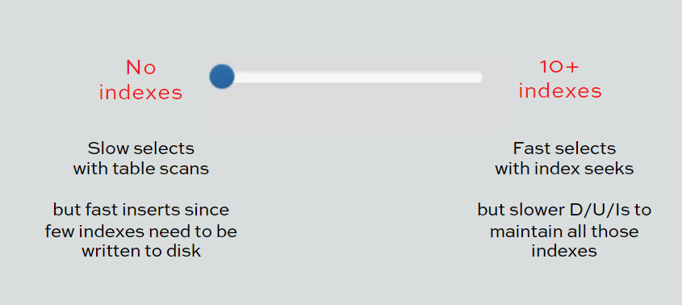

## It’s a starting point, not a rule
More indexes can be fine when:
  * Read-only (or read-biased) tables
  * Very, very good hardware (memory, SSDs)
  * When DUIs speed doesn’t matter

Less indexes may be required when:
  * Ingestion speed is absolutely critical
  * Read speed doesn’t matter

## Indexes add overhead
SQL Server has to maintain them on inserts, updates deletes. Just because you don’t see individual costs for them in all execution plans doesn’t mean they are free!. That cost is just hidden from you most of the time (but we show it in sp_BlitzCache)

To show this behaivor we can run the below query:

  ```sql
  /* Generate a random number */
  DECLARE @RandomNumber INT = CAST(RAND() * 100 AS INT);

  /* Update those users: */
  UPDATE dbo.Users
  SET LAstAccessDate = GETDATE()
  WHERE Reputation = @RandomNumber
  ```

  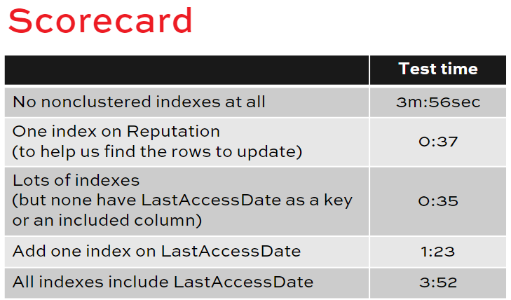


## You might be starting higher
Some of you inherited an existing database where:
  * Everybody just added missing indexes from plans, scripts, and dynamic management views
  * Everybody ran the Database Tuning Advisor (which doesn’t care about slowing down DUIs)
  * Everybody guessed at what indexes they needed
  * Everybody indexed every foreign key

## 5 & 5 is just a guideline
Even just one index on the wrong field might be a showstopper for your workloads.
The ~5 fields per index guideline includes includes: includes take up space too and have to be updated.
The faster you want to go, the more you have to:
  * Understand which fields are hot
  * <r>Avoid including those fields in indexes</r>
  * Run experiments to measure impact
Now, let’s figure out how to make an existing table better

## D.E.A.T.H. index method
    Dedupe      – reduce overlapping indexes
    Eliminate   – unused indexes
    Add         – badly needed missing indexes
    Tune        – indexes for specific queries
    Heaps       – usually need clustered indexes

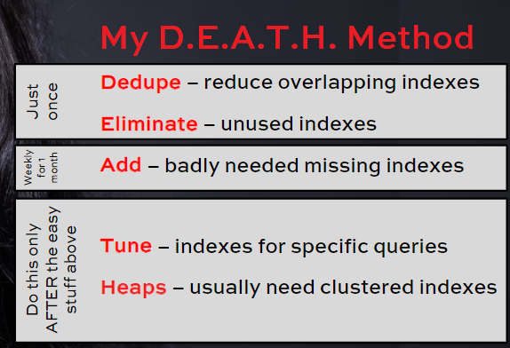

## Dedupe/eliminate
easy, safe* one-time step.
Quick: you can do this across lots of tables in an hour.
Safe: as long as you’re diligent, it’s hard to mess up.
Not necessarily a huge bang for the buck: users may not notice a big speed-up. We’re trying to make it easier to add indexes next.
*Nothing is ever totally safe.

## Adding indexes is a little harder
The missing index DMVs have a lot of gotchas.
You can add indexes that make queries slower.

## Tuning queries is less easy
  * Identify the query that needs to be tuned
  * Test to make sure you’re getting the right plan (and not a victim of parameter sniffing)
  * Read the execution plan, decide what to change
  * Change it, make sure it’s faster while producing exactly the same results
  * Deploy it to production (peer review, source control, change the app, etc) All this can take hours/days for just one query.

## Heaps can be easy to fix, but...
Sometimes the table doesn’t have a good candidate for clustering, and we have to add one. Sometimes it just doesn’t need a clustered index
Changing the clustered index can be invasive. If you can fix these quickly, great. Otherwise, focus on the low-hanging fruit first.

## So first, D/E
Dedupe – reduce overlapping indexes
Eliminate – unused indexes

* The deduplication process
  1. Identical indexes: eliminate all but one of ‘em
  2. Borderline identical: see if you can merge ‘em:
     1. <r>Identify the key superset (key order matters)</r>
     2. <r>Combine the included columns</r>
     3. Review to see if it’s a monster: we’re aiming for the 5/5 rule
     4. Create the new index
     5. Drop the rest

* Should you drop or disable?
Disabled indexes:
    • Easy to re-enable: just ALTER INDEX ... REBUILD
    • Definitions are still there, easy to script out
    • But anyone’s rebuild can enable it again, including index maintenance plans & scripts.
Dropped indexes are gone for good. I usually do that.

```sql
/* Mastering Index Tuning - Index Usage DMV Gotchas */

/* Do stop */
RAISERROR(N'Did you mean to run the whole thing?', 20, 1) WITH LOG;
GO

USE StackOverflow;
GO
EXEC DropIndexes;
GO
CREATE INDEX IX_LastAccessDate ON dbo.Users(LastAccessDate);
GO
EXEC sp_BlitzIndex @SchemaName='dbo', @TableName='Users';
GO

/* Look at the Usage Stats and Operational Stats columns */
/* These comes from sys.dm_db_index_usage_stats and sys.dm_db_index_operational_stats */
/* Look at the page reads for this query. */
/* Did it scan the whole index? */
SET STATISTICS IO ON;
GO
SELECT TOP 10 Id
FROM dbo.Users
ORDER BY LastAccessDate;
GO

/* Can you tell if it's a bad scan from the index DMVs? */
exec sp_BlitzIndex @SchemaName='dbo', @TableName='Users';
GO

/* Try a descending one. Does it read the whole table? */
SELECT TOP 10 Id
FROM dbo.Users
ORDER BY LastAccessDate DESC;
GO
/* Look in the properties of the NC index scan-- it did a backwards scan */

exec sp_BlitzIndex @SchemaName='dbo', @TableName='Users';
GO

/* Reset the index usage statistics. Man, I wish there was an easier way to do this in 2016. */
USE [master]
GO
ALTER DATABASE [StackOverflow] SET  OFFLINE WITH ROLLBACK IMMEDIATE;
GO
ALTER DATABASE [StackOverflow] SET ONLINE;
GO
USE StackOverflow;
GO

/* This plan is slightly different, it has a key lookup */
SELECT TOP 10 Id, Location
FROM dbo.Users
ORDER BY LastAccessDate;
GO

/* Compare how the key lookup is recorded differently in index_stats and usage_stats */
exec sp_BlitzIndex @SchemaName='dbo', @TableName='Users';
GO

/* Reset the index usage statistics. Man, I wish there was an easier way to do this in 2016. */
USE [master]
GO
ALTER DATABASE [StackOverflow] SET  OFFLINE WITH ROLLBACK IMMEDIATE;
GO
ALTER DATABASE [StackOverflow] SET ONLINE;
GO
USE StackOverflow;
GO

/* This plan is slightly different, it has a key lookup - but it doesn't get executed. */
SELECT TOP 10 Id, Location
FROM dbo.Users
WHERE LastAccessDate > GETDATE()
ORDER BY LastAccessDate;
GO

/* How does that show up in the DMVs? */
exec sp_BlitzIndex @SchemaName='dbo', @TableName='Users';
GO
```

## RECAP
Extremes are bad
 * Too many indexes on too many fields means too many writes
 * No Indexes at all means table scans, which can be slow for writes too

We have to find the sweet spot:
 * Enough indexes to make queries fast, on just the right fields
 * Not so many indexes & fields that changes are slow

Start by aiming for
 * 5 indexes per table
 * 5 or less fields per index

Use the DEATH method to get there, starting with Deduping and Eliminating first.
Next, let's learn the drawbacks of the DMVs that give us this data.


## Deduping & Eliminating with Inaccurate Read & Write Metrics

* SQL Server has a lot of metrics
    * Old-school, operating system level: Perfmon counters System & database level: “system tables & views”
    * Dynamic Management Views (DMVs)
        - <r>sys.dm_db_index_usage_stats</r>
        - <r>sys.dm_db_index_operational_stats</r>
    * Dynamic Management Functions (DMFs)
    * Tracing: Profiler, Extended Events

* Dynamic Management Views
    * The good:
        *  Well-documented by both Microsoft and blogs
        *  It’s easy to find scripts and tools that use ‘em
    * The bad:
        *  A lot of the user-written documentation is wrong
        *  Many of the DMVs don’t mean what you think
        *  Contents can reset at surprising times
        *  Hit-or-miss coverage in Azure, keeps changing

* sys.dm_db_index_usage_stats
Shows # of executions where a plan included an operator
  * Does NOT show if the operator was used (or how often it was accessed)
  * Number and last date of reads (seeks, scans, lookups)
  * Number and last date of last write Insert/update/deletes all called “updates”
  * Data is since startup or when the index was modified

* sys.dm_db_index_operational_stats
 * Lower level, more transitory
 * Lock waits (page and row)
 * Access counts
   * Doesn’t distinguish between full scans/range scans, or even range scans and seeks
 * Data only persisted while object’s metadata is in memory
 * No good way when to tell it was last cleared

* The stats are different
  * sys.dm_db_index_usage_stats: Number of times the operator appeared in an execution plan since last reset
  * sys.dm_db_index_operational_stats: Number of times the operator was executed (recently)

* What the DMVs say
    Usage stats says the plan included the seek Operational stats says it wasn’t executed

* So, the contents don’t match
    You can execute a query with use a KeyLookup but with cero result so the keylookup is not executed. But if you check the DMVs that say that the Keylookup was executed.
    
    Usage stats says the plan included the seek Operational stats says it wasn’t executed

    So, the contents don't match mean that you can see the operation on the DMVs but maybe the SQL never executed.

    When I use them, I’m really just asking:
    * Is this index helping? (reads)
    * Is this index hurting? (writes)
    * Roughly how much? (quantity: millions, billions)

    But your next question is, “When did these numbers reset?”
    * When SQL Server restarts (which we can measure)
    * When an Availability Group failed over (harder to tell)
    * When Azure SQL DB fails over, restarts (can’t see)
    * SQL 2012, 2014: resets on ALTER INDEX REBUILD
        * SQL 2012: fixed in SP2 CU12, or SP3 CU3
        * SQL 2014: fixed in RTM CU14, or SP1 CU8, or SP2
        * SQL Server 2016 & newer: unaffected

* Index DMVs: Your takeaways (conclusions)
  * “Scan” may not be the whole table
  * “Seek” might actually be the whole table 
  * sys.dm_db_index_usage_stats - “usage stats”
    * Show # of times an operator appeared in a query plan that was run 
    * The operator may have been accessed many times, or not at all
    * Reset by system restart, or by index rebuild if on buggy versions  
  * sys.dm_db_index_operational_stats – “op stats”
    * Show number of times an operator was accessed
    * Very volatile, can be reset by memory pressure  
  * Only check when you have enough uptime to reflect business processes

* How I use sp_BlitzIndex to D/E
    1. <r>sp_BlitzIndex @GetAllDatabases = 1 (and figure out what database to tune)</r>
    2. Run sp_BlitzIndex in the database I want to tune (and figure out what table I want to focus on)
    3. Scroll across to the More Info column and run it for the particular table I want to tun

* Advanced sp_BlitzIndex tips
    @ThresholdMB: default 250MB, only alerts you for problems with indexes at least this large
    @Mode:
      * <r>0 = default, most urgent problems</r>
      * <r>4 = more analysis, includes more warnings</r>
      * <r>2 = inventory of all your indexes & metrics</r>
      * <r>1 = summary of space usage</r>

* Azure SQL DB? Log it regularly
Since your database can (and will) restart without warning, log this data weekly so it’s there when you want to do index analysis, and use the most recent:
    ```sql
    /* 2 = inventory, 3 = missing indexes */
    EXEC sp_BlitzIndex 
            @Mode               = 2,
            @OutputDatabaseName = 'MyDB', 
            @OutputSchemaName   = 'dbo', 
            @OutputTableName    = 'BlitzIndex_Mode2'
    ```

* LAB 1
    ```sql
    /* Doorstop */
    RAISERROR(N'Did you mean to run the whole thing?', 20, 1) WITH LOG;
    GO

    USE StackOverflow;
    GO
    EXEC DropIndexes;
    GO
    CREATE INDEX IX_LastAccessDate ON dbo.Users(LastAccessDate);
    GO
    EXEC sp_BlitzIndex @SchemaName='dbo', @TableName='Users';
    GO

    /* Look at the Usage Stats and Operational Stats columns */
    /* These comes from sys.dm_db_index_usage_stats and sys.dm_db_index_operational_stats */

    /* Look at the page reads for this query. */
    /* Did it scan the whole index? */
    SET STATISTICS IO ON;
    GO
    SELECT TOP 10 Id
    FROM dbo.Users
    ORDER BY LastAccessDate;
    GO

    /* Can you tell if it's a bad scan from the index DMVs? */
    exec sp_BlitzIndex @SchemaName='dbo', @TableName='Users';
    GO

    /* Try a descending one. Does it read the whole table? */
    SELECT TOP 10 Id
    FROM dbo.Users
    ORDER BY LastAccessDate DESC;
    GO
    /* Look in the properties of the NC index scan-- it did a backwards scan */

    exec sp_BlitzIndex @SchemaName='dbo', @TableName='Users';
    GO

    /* Reset the index usage statistics. Man, I wish there was an easier way to do this in 2016. */
    USE [master]
    GO
    ALTER DATABASE [StackOverflow] SET  OFFLINE WITH ROLLBACK IMMEDIATE;
    GO
    ALTER DATABASE [StackOverflow] SET ONLINE;
    GO
    USE StackOverflow;
    GO

    /* This plan is slightly different, it has a key lookup */
    SELECT TOP 10 Id, Location
    FROM dbo.Users
    ORDER BY LastAccessDate;
    GO

    /* Compare how the key lookup is recorded differently in index_stats and usage_stats */
    exec sp_BlitzIndex @SchemaName='dbo', @TableName='Users';
    GO

    /* Reset the index usage statistics. Man, I wish there was an easier way to do this in 2016. */
    USE [master]
    GO
    ALTER DATABASE [StackOverflow] SET  OFFLINE WITH ROLLBACK IMMEDIATE;
    GO
    ALTER DATABASE [StackOverflow] SET ONLINE;
    GO
    USE StackOverflow;
    GO

    /* This plan is slightly different, it has a key lookup - but it doesn't get executed. */
    SELECT TOP 10 Id, Location
    FROM dbo.Users
    WHERE LastAccessDate > GETDATE()
    ORDER BY LastAccessDate;
    GO

    /* How does that show up in the DMVs? */
    exec sp_BlitzIndex @SchemaName='dbo', @TableName='Users';
    GO
    ```

    ```sql
    /* My Lab 1 Result */
    EXEC master..sp_BlitzIndex 
        @GetAllDatabases = 1


    EXEC master..sp_BlitzIndex
        @DatabaseName = 'StackOverflow'
        , @Schemaname   = 'dbo'
        , @TableName    = 'Posts'

    /* I reviewed the Posts table, and we need to drop these indexes because they're not getting used: */
    DROP INDEX [IX_AcceptedAnswerId] ON [StackOverflow].[dbo].[Posts];
    DROP INDEX [IX_LastEditorUserId] ON [StackOverflow].[dbo].[Posts];
    DROP INDEX [IX_ParentId]		 ON [StackOverflow].[dbo].[Posts];
    DROP INDEX [IX_PostTypeId]		 ON [StackOverflow].[dbo].[Posts];

    /* In case things go wrong, here's an undo script:
    CREATE INDEX [IX_AcceptedAnswerId] ON [StackOverflow].[dbo].[Posts] ( [AcceptedAnswerId] ) WITH (FILLFACTOR=100, ONLINE=?, SORT_IN_TEMPDB=?, DATA_COMPRESSION=?);
    CREATE INDEX [IX_LastEditorUserId] ON [StackOverflow].[dbo].[Posts] ( [LastEditorUserId] ) WITH (FILLFACTOR=100, ONLINE=?, SORT_IN_TEMPDB=?, DATA_COMPRESSION=?);
    CREATE INDEX [IX_ParentId] ON [StackOverflow].[dbo].[Posts] ( [ParentId] ) WITH (FILLFACTOR=100, ONLINE=?, SORT_IN_TEMPDB=?, DATA_COMPRESSION=?);
    CREATE INDEX [IX_PostTypeId] ON [StackOverflow].[dbo].[Posts] ( [PostTypeId] ) WITH (FILLFACTOR=100, ONLINE=?, SORT_IN_TEMPDB=?, DATA_COMPRESSION=?);
    */


    /* These indexes are a narrower subset of ..., so we should drop it: */
    DROP INDEX [_dta_index_Posts_5_85575343__K2] ON [StackOverflow].[dbo].[Posts];
    DROP INDEX [IX_OwnerUserId] ON [StackOverflow].[dbo].[Posts];
    DROP INDEX [_dta_index_Posts_5_85575343__K14_K16_K1_K2] ON [StackOverflow].[dbo].[Posts];

    /* In case things go wrong, here's an undo script:
    CREATE INDEX [_dta_index_Posts_5_85575343__K2] ON [StackOverflow].[dbo].[Posts] ( [AcceptedAnswerId] )
    CREATE INDEX [IX_OwnerUserId] ON [StackOverflow].[dbo].[Posts] ( [OwnerUserId] ) WITH (FILLFACTOR=100, ONLINE=?, SORT_IN_TEMPDB=?, DATA_COMPRESSION=?);
    CREATE INDEX [_dta_index_Posts_5_85575343__K14_K16_K1_K2] ON [StackOverflow].[dbo].[Posts] ( [OwnerUserId], [PostTypeId], [Id], [AcceptedAnswerId] ) WITH (FILLFACTOR=100, ONLINE=?, SORT_IN_TEMPDB=?, DATA_COMPRESSION=?);
    */

    /* I'd like to merge these two indexes together into one: */
    CREATE INDEX [_dta_index_Posts_5_85575343__K2_K14]				ON [StackOverflow].[dbo].[Posts] ( [AcceptedAnswerId], [OwnerUserId] )
    CREATE INDEX [_dta_index_Posts_5_85575343__K8]					ON [StackOverflow].[dbo].[Posts] ( [CreationDate] ) 
    CREATE INDEX [IX_LastActivityDate_Includes]						ON [StackOverflow].[dbo].[Posts] ( [LastActivityDate] ) INCLUDE ( [ViewCount])
    CREATE INDEX [IX_ViewCount_Includes]							ON [StackOverflow].[dbo].[Posts] ( [ViewCount] ) INCLUDE ( [LastActivityDate])
    CREATE INDEX [_dta_index_Posts_5_85575343__K14_K16_K7_K1_K2_17] ON [StackOverflow].[dbo].[Posts] ( [OwnerUserId], [PostTypeId], [CommunityOwnedDate], [Id], [AcceptedAnswerId] ) INCLUDE ( [Score])
    CREATE INDEX [_dta_index_Posts_5_85575343__K16_K7_K5_K14_17]	ON [StackOverflow].[dbo].[Posts] ( [PostTypeId], [CommunityOwnedDate], [ClosedDate], [OwnerUserId] ) INCLUDE ( [Score])
    ```


# Tuning Indexes for Specific Queries
We covered the D.E. parts of the D.E.A.T.H. method, and if we were going in order, we’d tackle the A part next: using Clippy’s index recommendations from the missing index DMVs. However, Clippy can be a little misleading, so just for the purpose of training, we’re going to tackle the T first: tuning indexes for these specific queries.


<r>WE ARE GOING TO START WITH T. part (TUNING)</r>

* Let's start with an easy one
```sql
    SELECT Id
    FROM dbo.Users
    WHERE DisplayName = 'Brent Ozar'
    AND   WebsiteUrl  = 'https://www.brentozar.com';  

    /* Build the perfect index. 
       Reminder from fundamentals:
        1. If all you have is equality searches, field order doesn't matter much
        2. Order starts to matter when:
            2.1 We have inequality searches: <,>,<>, IS NOT NULL, IN, ETC
            2.2 There is an ORDER BY
            2.3 When we join to other tables
    */
```

```sql
    DECLARE @UserId INT = ##UserId##
    
    SELECT u.id as [User Link], u.Reputation, u.Reputation = me.reputation as Difference
    FROM   Users u
    CROSS JOIN users me
    WHERE  me.id = @UserId
    and    u.CreationDate > me.CreationDate
    and    u.Reputation > me.Reputation   

    /* Build the perfect index. */
```

```sql
    SELECT 
        u.id as [User Link],
        u.Reputation,
        u.Reputation = me.reputation as Difference
    FROM Users me
    JOIN Users u
    ON   u.CreationDate > me.CreationDate
    AND  u.Reputation > me.Reputation
    WHERE  me.id = @UserId
    ORDER BY u.Reputation DESC

    /* Build the perfect index. 
    
    SET STATISTISC IO, TIME ON;
    EXEC usp_Q6925 @UserId = 26837 
    
    1. Measure the query before
    2. Write out the index definition
    3. Measure the query afterwards
    4. Bonus: try other parameters, see how they go */
```

* Mini-Lab: build 1 index for 2 queries
    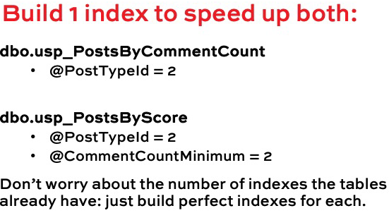

    * Parameter sniffing affects missing index requests. Gotta make sure you are tuning the query that you really want to go faster.
    * General rule
        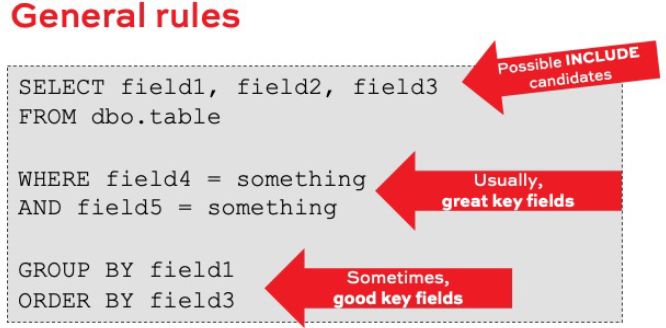
    * Query 1: Look for key columns
        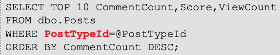

        <r>$int is a parameterized value that can be any valid value– not something for a filtered index<r>

    * Query 1: Look for more key columns
        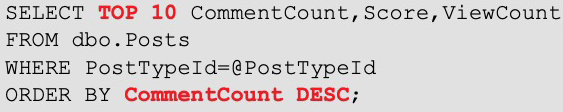

    * Query 1: Look for possible includes
        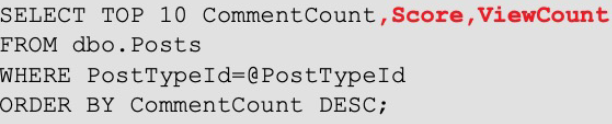

    * Query 1: Scratch paper
        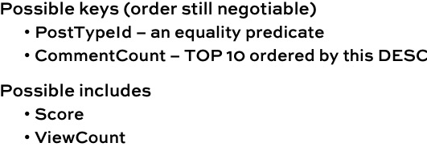

    * Query 2: look for key columns
        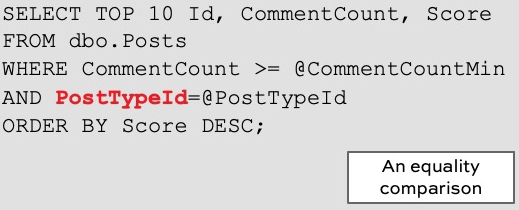

    * Query 2: look for key columns
        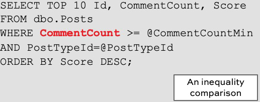

    * Query 2: look for even more keys
        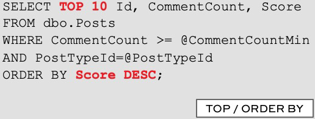

    * Query 2: look for possible includes
        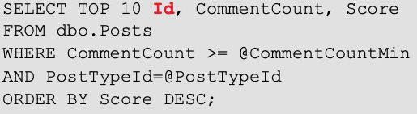

    * Query 1: Scratch paper
        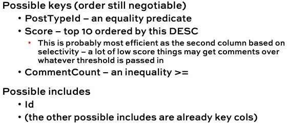

    * Scratch paper
        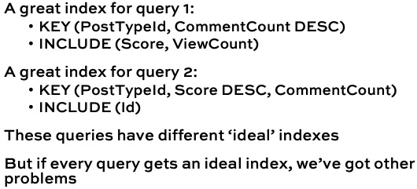

    * A Compromise
        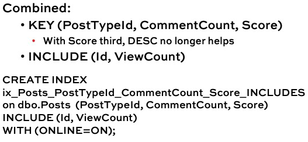

    * A decision
        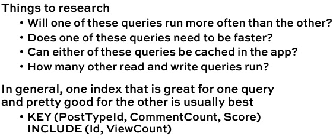

    * Field order guidelines (not rules)
        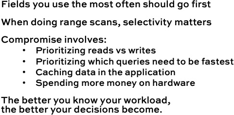

    * So how do we get the workload?
        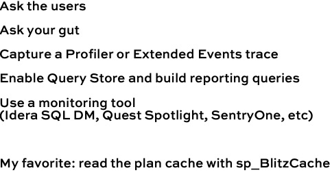

    * It shows the top 10 queries
        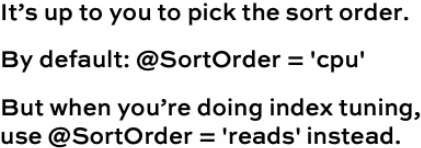

    * sp_BlitzCache isn't perfect
        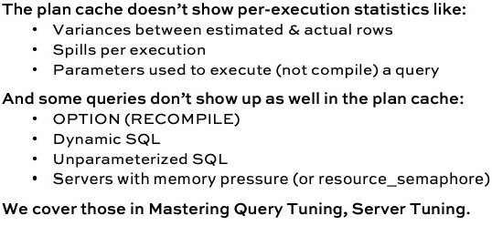

    * sp_BlitzCache's hard truths
        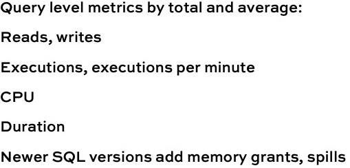

    * sp_BlitzCache finds
        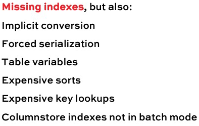

    * RECAP
        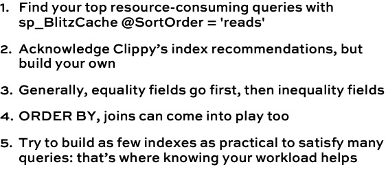

* LAB 2
  * Let's tackle the other extreme
    DropIndexes dropped all your nonclustered indexes
    The load test pushed a bunch of queries through, and this time that load test app went WAY slower.
    Now you have got a bunch of missing index recommendations

  * Now add the right ones
    Analyze the plan cache with sp_BlitzCache then design helpful indexes
    Script out changes you want to make, aiming for:
        5 or less indexes per table
        5 or less fields per index

  * Settin up for the lab

```sql
/* LAB 2 */
USE MASTER
GO

sp_BlitzCache
	@SortOrder = 'READS'
GO

/* Query 1
	Costr 14931
	Procedure or Function: [dbo].[usp_Q7521]
	Missing Indexes (1), Parallel, Long Running Query, Long Compile Time
*/
	select     
		  count(a.Id) as [Accepted Answers]
		, sum(case when a.Score = 0 then 0 else 1 end) as [Scored Answers]
		, sum(case when a.Score = 0 then 1 else 0 end) as [Unscored Answers]
		, sum(CASE WHEN a.Score = 0 then 1 else 0 end)*1000 / count(a.Id) / 10.0 as [Percentage Unscored] 
	from     
		Posts q   
	join     
		Posts a   
	on a.Id = q.AcceptedAnswerId 
	where       
		a.CommunityOwnedDate is null   
	and a.OwnerUserId = @UserId   
	and q.OwnerUserId != @UserId   
	and a.PostTypeId = 2


	CREATE NONCLUSTERED INDEX [<Name of Missing Index, sysname,>]
	ON [dbo].[Posts] ([OwnerUserId])
	INCLUDE ([AcceptedAnswerId])
	GO

	-- From Brent
	FROM  dbo.Posts q
	WHERE q.OwnerUserId != @UserId /* tHIS IS NOT SELECTIVE */

	FROM  dbo.Posts a
	WHERE a.CommunityOwnedDate is null   
	and   a.OwnerUserId = @UserId  /* tHIS IS SELECTIVE */ 
	and   a.PostTypeId = 2
	/* ALL ARE EQUAL SO THE ORDER CAN BE THE SAME BUT PostTypeId IN GENERAL IS NOT SELECTIVE,
	OwnerUserId IS SELECTIVE 
	
	select
		count(*) as total_recs,
		SUM(CASE WHEN CommunityOwnedDate IS NULL THEN 1 ELSE O END) As CommunityOwneddate_Null
		SUM(CASE WHEN PostTypeId = 2 IS NULL THEN 1 ELSE O END) As PostType_2
	from dbo.Posts

	CREATE INDEX ix_OwnerUSerId_CommunityOwnedDate_PostTypeID
	ON dbo.Posts(OwnerUserId, CommunityOwnedDate, PostTypeID)
	INCLUDE(Score,Id)
	WITH (ONLINE = OFF, MAXDOP = 0)*/

GO

/* Query 2
	Cost 16554	
	Statement (parent [dbo].[usp_Q3160])
	with fights as (   select myAnswer.ParentId as Question,    myAnswer.Score as MyScore,    jonsAnswer.Score as JonsScore   from Posts as myAnswer   inner join Posts as jonsAnswer    on jonsAnswer.OwnerUserId = 22656 and myAnswer.ParentId = jonsAnswer.ParentId   where myAnswer.OwnerUserId = @UserId and myAnswer.PostTypeId = 2 )  select   case    when MyScore > JonsScore then 'You win'    when MyScore < JonsScore then 'Jon wins'    else 'Tie'   end as 'Winner',   Question as [Post Link],   MyScore as 'My score',   JonsScore as 'Jon''s score' from fights option (PLAN PER VALUE(ObjectID = 1957582012, QueryVariantID = 2, predicate_range([StackOverflow].[dbo].[Posts].[OwnerUserId] = @UserId, 100.0, 1000.0)))
	Missing Indexes (2), Parallel, Long Running Query, Long Compile Time
*/
	with fights as (   
		select 
			myAnswer.ParentId as Question
		 ,  myAnswer.Score    as MyScore
		 ,  jonsAnswer.Score  as JonsScore   
		from Posts as myAnswer   
		join Posts as jonsAnswer    
		on   jonsAnswer.OwnerUserId = 22656 
		and  myAnswer.ParentId = jonsAnswer.ParentId   
		where 
			myAnswer.OwnerUserId = @UserId 
		and myAnswer.PostTypeId = 2 )  
	select   
		case
			when MyScore > JonsScore then 'You win' 
			when MyScore < JonsScore then 'Jon wins'    
		else 'Tie' end as 'Winner'
		,  Question as [Post Link]
		,  MyScore as 'My score'
		,  JonsScore as 'Jon''s score' 
	from fights 
	option (PLAN PER VALUE(ObjectID = 1957582012, QueryVariantID = 2,
			predicate_range([StackOverflow].[dbo].[Posts].[OwnerUserId] = @UserId, 100.0, 1000.0)))

	/*
		MICROSOFT RECOMENDATION
	*/

	/* improve query cost by 50.0041% for 3 executions of the query over the last 2 days.*/
	/* [OwnerUserId], [PostTypeId] are on the WHERE */
	/* [ParentId]   , [Score]      are on the JOIN  */
	/* BOTH INDEXES ARE THE SAME */
	CREATE NONCLUSTERED INDEX ix_OwnerUserId_PostTypeId_Includes
	ON [dbo].[Posts] ([OwnerUserId], [PostTypeId])
	INCLUDE ([ParentId], [Score])
	GO

	/* could improve query cost by 49.9918% for 3 executions of the query over the last 2 days. */
	CREATE NONCLUSTERED INDEX ix_OwnerUserId_Includes
	 ON [dbo].[Posts] ([OwnerUserId])
	INCLUDE ([ParentId], [Score])
	GO

	/* Conclution */
	/*
		x Both Indexes are the same. The first has the WHERE on the key and the JOIN on the include.
		  The second one has only one column of the WHERE on the key and the JOIN on the include.
		  So We can create the first INDEX that is more covered
		x I can't execute the SELECT to know which column I can put first. I don't have a good enough
		  computer.
		x Validate if this index is not the same of QUERY 1
	*/
	GO

/* Query 3
	Cost 16714.2	
	SELECT      (CAST(Count(a.Id) AS float) / (SELECT Count(*) FROM Posts WHERE OwnerUserId = @UserId AND PostTypeId = 2) * 100) AS AcceptedPercentage FROM     Posts q   INNER JOIN     Posts a ON q.AcceptedAnswerId = a.Id WHERE     a.OwnerUserId = @UserId   AND     a.PostTypeId = 2 option (PLAN PER VALUE(ObjectID = 1909581841, QueryVariantID = 5, predicate_range([StackOverflow].[dbo].[Posts].[OwnerUserId] = @UserId, 100.0, 1000.0),predicate_range([StackOverflow].[dbo].[Posts].[OwnerUserId] = @UserId, 100.0, 1000.0)))	
	Statement (parent [dbo].[usp_Q94949])	
	Missing Indexes (2), Parallel, Long Running Query, non-SARGables
*/
	SELECT      
		(CAST(Count(a.Id) AS float) / ( SELECT Count(*) 
										FROM   Posts 
										WHERE  OwnerUserId = @UserId 
										AND    PostTypeId  = 2) * 100) AS AcceptedPercentage 
	FROM Posts q   
	JOIN Posts a 
	ON   q.AcceptedAnswerId = a.Id 
	WHERE 
		a.OwnerUserId = @UserId   
	AND a.PostTypeId  = 2 

	/*
		MICROSOFT RECOMENDATION
	*/

	/* could improve query cost by 49.5249% for 1 executions of the query over the last 4 days. */

	CREATE NONCLUSTERED INDEX ix_OwnerUserId_PostTypeId
	ON [dbo].[Posts] ([OwnerUserId], [PostTypeId])
	
	/* Conclution */
	/*
		x The Index that Microsoft is recomended is the same of QUERY 2
	*/
GO

/*
Query 4
	Cost 8273.67	
	select @latestDate = max(CreationDate) from Posts	
	Statement (parent [dbo].[usp_Q8116])	
	Missing Indexes (1), Parallel, Long Running Query, Table Variables, Long Compile Time
*/

	select
		p.Id,
		up   = sum(case when VoteTypeId = 2 then case when p.ParentId is null then 5 else 10 end else 0 end),
		down = sum(case when VoteTypeId = 3 then 2 else 0 end),
		p.CreationDate
	from Votes v 
	join Posts p 
	on   v.PostId = p.Id
	where 
	    v.VoteTypeId in (2,3)
	and OwnerUserId = @UserId
	and p.CommunityOwnedDate is null
	and datediff(day, p.CreationDate, v.CreationDate) > @ignoreDays
	and datediff(day, p.CreationDate, @latestDate) > @minAgeDays
	group by p.Id, p.CreationDate, p.ParentId

	/* index could improve query cost by 91.1709% for 3 executions of the query over the last 2 days. */
	CREATE NONCLUSTERED INDEX ix_CommunityOwnedDate_OwnerUserId_Includes
	ON [dbo].[Posts] ([CommunityOwnedDate], [OwnerUserId])
	INCLUDE ([CreationDate], [ParentId])
	GO

	/* Conclution */
	/*
		x The Index that Microsoft is recomended is the same of QUERY 1, 2 and 3???
	*/


USE master
go

sp_BlitzIndex
 	  @DatabaseName = 'StackOverflow'
	, @SchemaName   = 'dbo'
	, @TableName    = 'Posts'


-- Query 1
CREATE NONCLUSTERED INDEX [<Name of Missing Index, sysname,>]
ON [dbo].[Posts] ([OwnerUserId])
INCLUDE ([AcceptedAnswerId])
GO

-- Query 2
CREATE NONCLUSTERED INDEX ix_OwnerUserId_PostTypeId_Includes
ON [dbo].[Posts] ([OwnerUserId], [PostTypeId])
INCLUDE ([ParentId], [Score])
GO

-- Query 3
CREATE NONCLUSTERED INDEX ix_OwnerUserId_PostTypeId
ON [dbo].[Posts] ([OwnerUserId], [PostTypeId])

	-- for Queries 1 - 2 and 3
	CREATE NONCLUSTERED INDEX ix_OwnerUserId_PostTypeId_Includes
	ON [dbo].[Posts] ([OwnerUserId], [PostTypeId])
	INCLUDE ([ParentId], [Score], [AcceptedAnswerId])
	GO

-- Query 4
CREATE NONCLUSTERED INDEX ix_CommunityOwnedDate_OwnerUserId_Includes
ON [dbo].[Posts] ([CommunityOwnedDate], [OwnerUserId])
INCLUDE ([CreationDate], [ParentId])
GO
```

```sql
/* # Brent Lab result

He mentioned that If I have to invest 10 min only in 1 query I have to:
  * Get a set of parameters to call it
  * Call it to get the :before" reads & plan
  * Design indexes
  * Create indexes
  * Call it to get "after" plan
  * If we have another idea, drop those indexes, create new ones, and get another "after" plan
  * Compare those to get the winner

sp_BlitzCache
	@Sortorder = 'reads'

	* El loco tenia varias queries, armo una poll para ver cuales queria el publico analizar y arranco
	* Analisis:
		De la columna de parameters el loco saco la query con el parametro como lo muestro abajo
		
        SET STATISTICS IO ON
		EXEC [dbo].[usp_Q8116] @UserID = 9322503

		Cuando en el resultado de la ejecution de sp_BlitzCache	@Sortorder = 'reads' vos ves que se recomienda 2, 3 o mas indices como misssing eso significa que tenemos varios batch dentro del sp. En la columna de Cost vas a ver el acumulado del SP entonces para ver dentro del sp cual es la query que mas esta consumiendo podes ejecutar la siguiente query:

		sp_BlitzCache @StoreProcName = 'SP Name', @Sortorder = 'reads'

		Con el resultado de las estadisticas del EXEC [dbo].[usp_Q8116] @UserID = 9322503 las pega en la pagina StatParce y arranca a ver cual es la tabla que mas reads hace, claramente para hacerle tunning.

		Ver el XML del plan de ejecucion y filtrar por missing index porque SQL por lo general en el plan solo muestra el primero pero podes terner mas y esos los ves en el XML.

		Ahora entendi eso que dice /* If I do Post first */ o /* If I do Vote first */en los JOINs. Lo dice porque no sabemos que va a ejecutar primero el SQL Server. Si hace un JOIN entre Votes y Posts no sabemos que va a ejecutar primero el ej. Si tenes un indice que reduce la cantidad de Votes seguramente el SQL va a ejecutar Votes primero y con la lista de IDs de Votes va a ir a buscar los Posts pero si tenes un indice que reduce los Posts seguramente el SQL va a buscar los Posts primero y despues con la lista de Ids de Posts va a ir a buscar los Vostes IDs.

		El loco creo estos 3 indices:

		CREATE INDEX PostID_VotetypeId ON dbo.Votes(PostId, VoteTypeId)
		INCLUDE (CreationDate)
		WITH (ONLINE = OFF, MAXDOP = 0)

		CREATE INDEX OwnerUser_Id_CommunityOwnerDate
		ON dbo.Posts (OwnerUserId, communityOwnerDate)
		INCLUDE (CreationDate, ParentId)
		WITH (ONLINE = OFF, MAXDOP = 0)

		CREATE INDEX CreateDate ON dbo.Posts(CreationDate)
		WITH (ONLINE = OFF, MAXDOP = 0)

		Luego de crear todo podes ejecutar el 
		sp_recompile 'SP Name'
        GO 
*/
```  

* Keys and Constraints
  * Should I index my foreing keys?
    This question has two different answers:

    * When you are starting a new database from scratch you should have FKs and index them
    * When you have an existing database, you might to let go of this if you have blocking and you need to hit the 5 & 5

  * In a perfect world
   * <r>Primary Key: Data modeling tool to define uniqueness</r>
   * <r>Foreing Keys: Modeling tool to degine relationships between tables</r>
   * <r>Check constraints: physical storage tool to bad bad data (.. para bloquear datos errones)</r>
   * <r>Unique constraints: physical storate tool lto enforce uniqueness</r>

  * Example on dbo.Posts table
   * No FKs ship by default in StackOverflow
   * What are the most popular PostTypes?
    ```sql
        SELECT p.PostTypeId, COUNT(*) AS Posts
        FROM dbo.PostTypes pt
        JOIN dbo.Posts p 
        ON   pt.Id = p.PostTypeId
        GROUP BY p.PostTypeId
        ORDER BY COUNT(*) DESC;
    ``` 
   * The execution plan bits both Post and PostTypes
   * bUT WHAT IF WE TELL sql THEY'RE RELATED?
    ```sql
        ALTER TABLE dbo.Posts
        ADD CONSTRAINT fk_Posts_PostTypeId
        FOREIGN KEY(PostTypeId)
        REFERENCES dbo.PostTypes(Id);
    ``` 
   * Now run the same query again

  * FKs and constrainst in one slide
    * For new applications, new databases or new tables:
      * Every table starts with a clustered PK
      * Implement FK contraints
      * Index them by default (because you probably join them too)
      * They may prevent new, buggy code from inserting bad data
    * For existing databases
      * There is likely already bad data you won't be allowed to delete
      * Implement Clustered Indexes (but may not be unique)
      * Implement Constraints only to solve a pain point
      * Otherwise, if you are facing performance pains, don't be surprise if constaints hurt as much as they help

## The D.E.A.T.H. Method: Adding Indexes with the DMVs

Now, let’s step back to the A part of the Method, and let’s rely solely on Clippy’s recommendations. First, I’ll hand you one of Clippy’s recommendations, and it’ll be up to you to reverse-engineer the query that caused it. We’ll start with one index recommendation at a time, then give you two and three missing index recommendations, try to figure out the queries that drove ’em, and build as few indexes as practical to solve as many queries as practical. You’ll see why perfect is the enemy of good.

## bla bla bla

## Head vs Clustered Indexes
In most cases, when you tune an existing database, it’ll already have clustered indexes. However, we need to talk about what happens when it doesn’t: should you design a clustered index for it, or leave it as a heap?

This lecture & demos explains the problems with wide clustering keys, show why IDENTITY fields are usually the default, and demo the issues with heaps.

## Blocking: When the 5 & 5 Guideline Isn't Specific Enough
When your server experiences LCK% waits, it means queries are waiting on other queries to release their locks. Most of the time, you can work around this by doing index tuning.

However, it’s tricky to understand whether LCK% waits mean you have too many indexes, or not enough. In this lecture, we’ll do a series of demos showing what happens when indexing and lock escalation cause blocking issues.

If you want to learn more about the exact numbers of locks that trigger lock escalation, check out Paul White's series on the lock escalation threshold.

```sql
/* 1.6 - Foreign Key and Check Constraints */
RAISERROR(N'Oops! No, don''t just hit F5. Run these demos one at a time.', 20, 1) WITH LOG;
GO

USE StackOverflow;
GO

IF DB_NAME() <> 'StackOverflow'
  RAISERROR(N'Oops! For some reason the StackOverflow database does not exist here.', 20, 1) WITH LOG;
GO

/* Foreign key demos */
SELECT p.PostTypeId, COUNT(*) AS Posts
  FROM dbo.PostTypes pt
  INNER JOIN dbo.Posts p ON pt.Id = p.PostTypeId
  GROUP BY p.PostTypeId
  ORDER BY COUNT(*) DESC;
GO

ALTER TABLE dbo.Posts
ADD CONSTRAINT fk_Posts_PostTypeId 
	FOREIGN KEY (PostTypeId) 
REFERENCES dbo.PostTypes(Id);
GO

SELECT pt.Id, pt.Type, COUNT(*) AS Posts
  FROM dbo.PostTypes pt
  INNER JOIN dbo.Posts p ON pt.Id = p.PostTypeId
  GROUP BY pt.Id, pt.Type
  ORDER BY COUNT(*) DESC;
GO

ALTER TABLE dbo.Posts
ADD CONSTRAINT fk_Posts_OwnerUserId 
	FOREIGN KEY (OwnerUserId) 
REFERENCES dbo.Users(Id);
GO

SELECT p.*
  FROM dbo.Posts p
  LEFT OUTER JOIN dbo.Users u ON p.OwnerUserId = u.Id
  WHERE u.Id IS NULL;
GO

ALTER TABLE dbo.Posts WITH NOCHECK
ADD CONSTRAINT fk_Posts_OwnerUserId 
	FOREIGN KEY (OwnerUserId) 
REFERENCES dbo.Users(Id)
GO

EXEC sp_Blitz;

ALTER TABLE dbo.Posts
DROP CONSTRAINT fk_Posts_OwnerUserId;
GO

ALTER TABLE dbo.Posts WITH NOCHECK
ADD CONSTRAINT fk_Posts_OwnerUserId 
	FOREIGN KEY (OwnerUserId) 
REFERENCES dbo.Users(Id)
ON DELETE CASCADE;
GO

DELETE dbo.Users WHERE Id = 26837;

ALTER TABLE dbo.Posts
DROP CONSTRAINT fk_Posts_PostTypeId;
GO
ALTER TABLE dbo.Posts
DROP CONSTRAINT fk_Posts_OwnerUserId;
GO

/* Constraint demos */

/* Say we have a CompanyCode column in Users: */
EXEC sp_rename 'dbo.Users.Age', 'CompanyCode'
GO
/* And say everyone has the same CompanyCode:
 (this will take a minute) */
UPDATE dbo.Users SET CompanyCode = 100;

/* And all of our queries always ask for that CompanyCode: */
SELECT *
	FROM dbo.Users
	WHERE CompanyCode = 100
	AND DisplayName = N'Brent Ozar';

/* Then every missing index request will start with that,
even though it's basically useless: all the columns match.

Will a check constraint fix it? */
ALTER TABLE dbo.Users
	ADD CONSTRAINT CompanyCodeIsAlways100
	CHECK (CompanyCode = 100);

/* And then try your query again: */
SELECT *
	FROM dbo.Users
	WHERE CompanyCode = 100
	AND DisplayName = N'Brent Ozar';

/* Add an index just on DisplayName: */
CREATE INDEX DisplayName ON dbo.Users(DisplayName);

/* And then try your query again, and check the key lookup predicates: */
SELECT *
	FROM dbo.Users
	WHERE CompanyCode = 100
	AND DisplayName = N'Brent Ozar';

/* SQL Server will eliminate this, at least: */
SELECT * FROM dbo.Users WHERE CompanyCode <> 100;
```

# The DEATH method: Addeding Indexes with the DMVs

* The A part relies on Clippy.
SQL Server gives us missing indexes in:
  * sys.dm_db_missing_index_details
  * Query plans and the plan cache

He doesn’t care about:
  * The size of the index
  * The index’s overhead on D/U/I operations
  * Your other existing indexes
  * A lot of operations in the plan (GROUP BY)

* Clippy’s order of fields 
  1. Equality searches in the query (ordered by the field order in the table)
  2. Inequality searches (ordered by the field order in the table)
  3. Includes (which might actually need to be sorted)

* Time to level up.
In Fundamentals of Index Tuning, I gave you queries, and had you come up with Clippy’s field ordering.
Here in Mastering Index Tuning, I’m going to give you Clippy’s suggestion, and I want you to reverse engineer the query. (There are multiple answers for each index)

* Quiz 1
    * Missing index suggestion #1
        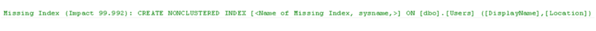

    * Missing index suggestion #2
        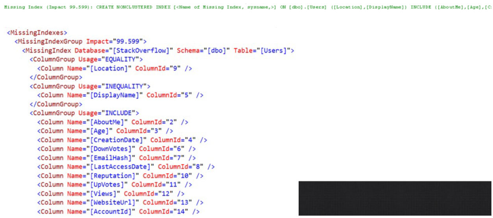

    * Missing index suggestion #3
        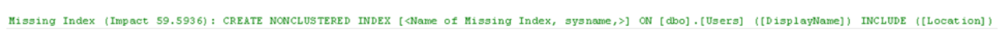
    * 
* Quiz 2
    * 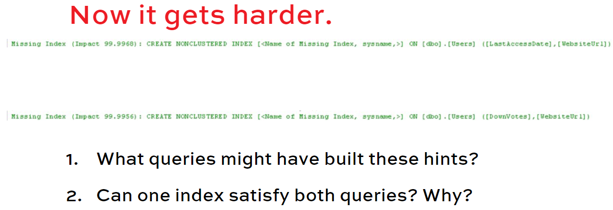
    * 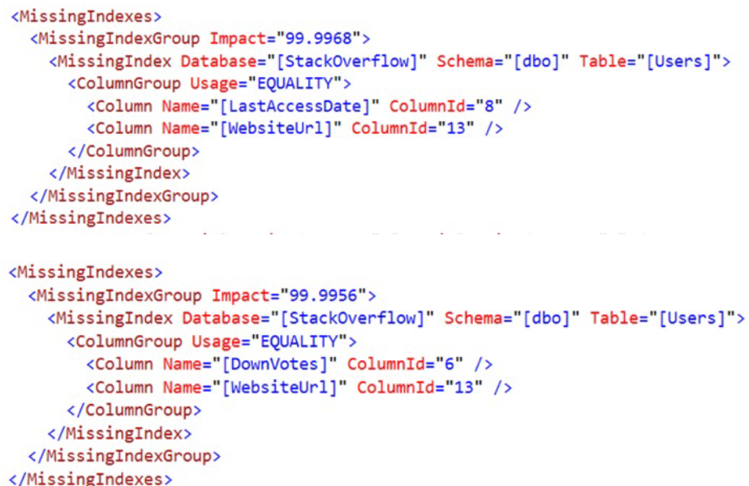
    * 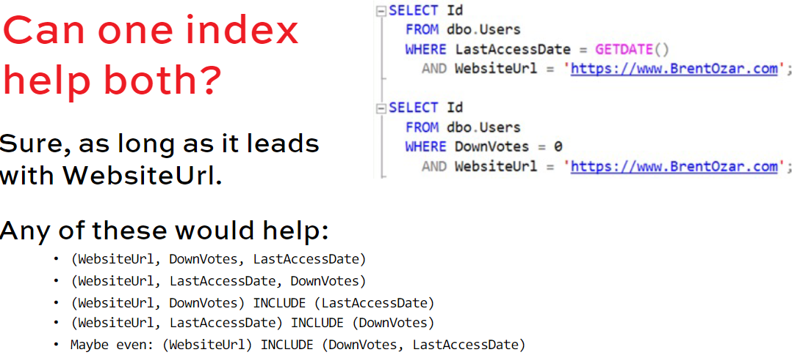
* Quiz 3
    * 
    * 
    * 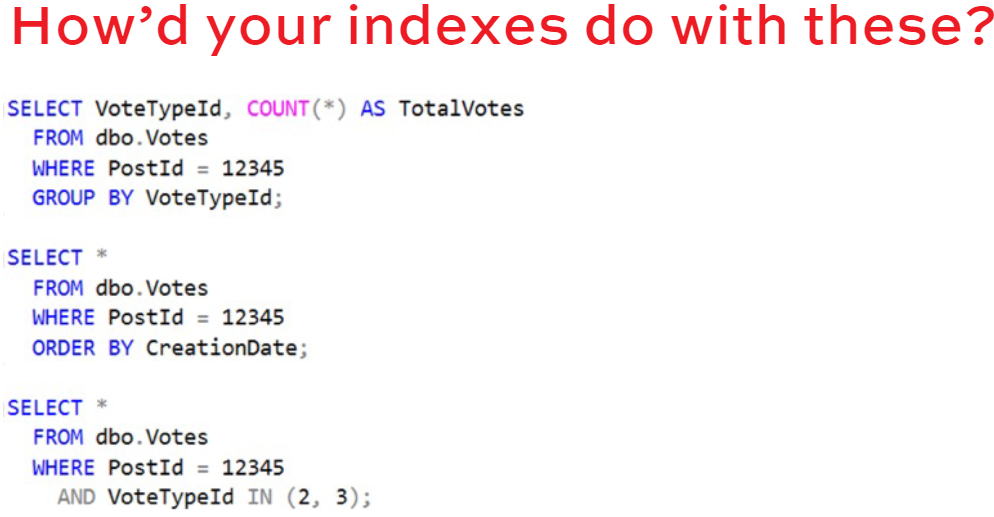
    * 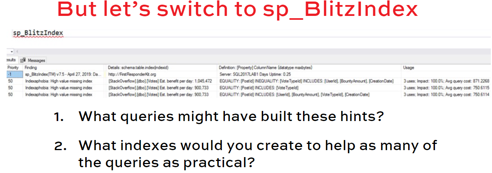

* Our job in index tuning
    * Look at the recommended indexes by:
        * Equality fields
        * Inequality fields
        * Includes (which sometimes need to be promoted)
    
    * Look for things they have in common
    * Make guess based on our experience with the queries and the data
    * Revisit it later in the T part of D.E.A.T.H.

* But how do I find the real  queries?
    <r> Fastest: SQL Server 2019+ only SQL Server 2019 added a new DMV:</r>
    <r>sys.dm_db_missing_index_group_stats_query.</r>

    <r>sp_BlitzIndex @TableName = ’mytable’</r>
    <r>Look in the far right of the missing indexes section</r>

    <r>sp_BlitzIndex @Mode = 3 (lists missing index requests)</r>

* On 2017 & prior, I don’t find the queries in the “A” phase.
    * Fast, but less accurate: top reads
        sp_BlitzCache 
            @SortOrder = ’reads’, 
            @DatabaseName = ’mydb’
    
      * Lists the top resource-intensive queries
      * They probably need an index or two
      * Probably not the specific index you’re looking for
      * Doesn’t catch queries that originate in other dbs, queries that aren’t in the plan cache now

    * Slow: query the entire cache sp_BlitzCache queries just top readers, so it’s fast.
        This query checks the entire plan cache, looking at the XML to see if there’s a missing index on a specific table you’re looking for: 
            http://www.sqlnuggets.com/blog/sql-scripts-find-queries-that-have-missing-index-requests/

        Doesn’t catch queries that originate in other dbs, queries that aren’t in the plan cache now

    * Slow: Query Store
        Query Store is just like a persisted version of the plan cache, and you can query the plans in it.
        This query finds ALL missing index requests, so it’s going to be slow and unfiltered: https://www.scarydba.com/2019/03/11/missing-indexes-in-the-query-store/

        Drawbacks:
        * Requires Query Store (which has many drawbacks)
        * Only catches plans that made it to Query Store

* Cloud Clippy
Azure does it for me!” Microsoft’s marketing implies self-tuning databases. The reality is very different:
https://learn.microsoft.com/en-us/azure/azuresql/database/automatic-tuningoverview?view=azuresql

Read the doc:
    https://www.microsoft.com/en-us/research/uploads/prod/2019/02/autoindexing_azuredb.pdf


  * Overall, my experience
  Automatic index tuning:
    * Only kicks in for small objects (<10GB)
    * Won’t drop indexes on production servers
          Good for SaaS/ISV apps with one db per client:
    * Ship with a core set of critical indexes
    * Let Azure add indexes automatically based on each client’s particular usage

* BONUS
    * <r>Loading data fast</r> 
      * “Should I drop my indexes before loading?”
      * Data Loading Performance Guide (2009):
        <r> https://docs.microsoft.com/enus/previous-versions/sql/sql-server-2008/dd425070(v=sql.100) </r>

      * Doesn’t cover:
        * Columnstore indexes
        * Database mirroring, AGs
        * Azure SQL DB and its variants

    * Even more guidance:
      * <r>Google for Paul White minimal logging</r>
  
    * When indexing temp tables
        In Fundamentals of TempDB, you learned:
        * If a table is modified after it’s created, then its execution plans get recompiled
        * Bad if a query runs frequently
        * Good if a query rarely runs, and needs new execution plans each time
        So that affects how you create indexes.


* RECAP
The A in the D.E.A.T.H. Method
  * Use Clippy to rapidly go from 0 to ~5 indexes.
  * Don’t try digging into which query plans are involved yet (unless you’re on SQL 2019+.)
  * Too many columns? Try without the includes first.
  * Selectivity involves the query’s search space.
  * Try to guess what the query filters on.

```sql
RAISERROR(N'Oops! No, don''t just hit F5. Run these demos one at a time.', 20, 1) WITH LOG;
GO
 
/* Demo setup: */
USE StackOverflow;
GO
EXEC DropIndexes;
GO
/* Build a query that produces this: */
CREATE NONCLUSTERED INDEX [<Name of Missing Index, sysname,>]
ON [dbo].[Users] ([DisplayName],[Location])

/* Quiz 2: 2 queries at a time: */
CREATE NONCLUSTERED INDEX [<Name of Missing Index, sysname,>]
ON [dbo].[Users] ([LastAccessDate],[WebsiteUrl])

CREATE NONCLUSTERED INDEX [<Name of Missing Index, sysname,>]
ON [dbo].[Users] ([DownVotes],[WebsiteUrl])

SELECT Id
  FROM dbo.Users
  WHERE LastAccessDate = GETDATE()
    AND WebsiteUrl = 'https://www.BrentOzar.com';

SELECT Id
  FROM dbo.Users
  WHERE DownVotes = 0
    AND WebsiteUrl = 'https://www.BrentOzar.com';
GO

/* Quiz 3: 3 queries at a time: */
SELECT VoteTypeId, COUNT(*) AS TotalVotes
  FROM dbo.Votes
  WHERE PostId = 12345
  GROUP BY VoteTypeId;

SELECT *
  FROM dbo.Votes
  WHERE PostId = 12345
  ORDER BY CreationDate;

SELECT *
  FROM dbo.Votes
  WHERE PostId = 12345
    AND VoteTypeId IN (2, 3);
GO 5
```  

# Tuning Indexes to Avoid Key LookUps

## My RECAP
  * If we have the index
    ```sql
    CREATE INDEX LastAccessDate_Id
    ON dbo.Users(LastAccessDate, Id)
    ```

    And execute the below query
    ```sql
    SELECT *
    FROM dbo.Users
    WHERE LastAccessDate >= '2009-07-16'
    AND   LastAccessDate <= '2009-07-17'
    ```

    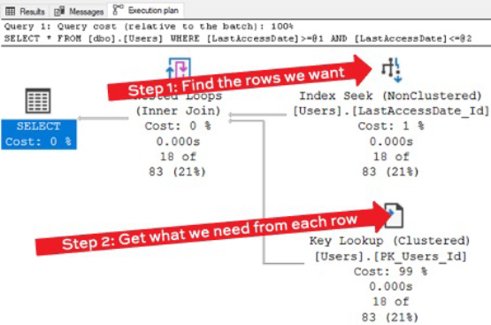

    Step 1: Seek on the nonclustered index to the LastAccessDate we want. In this step, our reads are sequential: we jump to one point on the index and read the pages in order.

    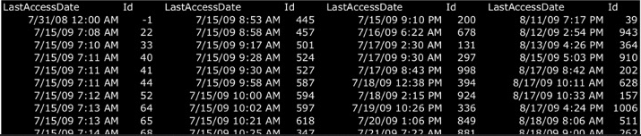

    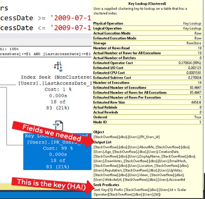
  
    <r>KEY LOOKUPS = MORE LOGICAL READS</r>
    <r>On a heap =1-2 more logical reads per row we need</r>    
    <r>On a Clustered index = 3 or more logical reads</r>

    Step 2: reads are random.
    Step 1 gave us a list of User Ids that accessed the sustem on 1009-07-16.
    But those IDs are all over the place: they are effectively random because people don't access the system at the same time, in order.

    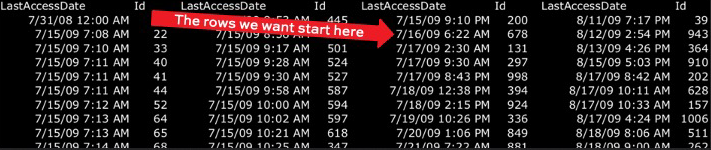

    Step 2: hits the clustered index
    We have to look up the clustered index rows for Ids 678,131, 297, 998, 394, etc
    If we are reading pages from memory, it doesn't matter what order they are in. (RAM = Random Access Memory)
    If we are reading pages from disk, it does matter: random disk access is slower.

    * SQL Server was built on rust
        Query plan costs assume index seeks are cheap

        They assume key lookups are expensive because:
            Memory was really expensive in the 1990s
            We had magnetic hard drives, wich suck at random access
        
        They assume table scans are not that expensive because they are sequential scans.

    * So, Key lookups are a choice
        More of the time, SQL Server choose wisely between:

        * Index Seek + Key Lookup
            Unpredictable number of pages reads, random

        * Clustered index scan:
            Predictabe number of pages reads, sequential
    
    * To fix the key lookups
      * Select less fields or
      * Add fields to the nonclustered index

  * Residual Predicates
    
    If we execute the first query again

    ```sql
    SELECT *
    FROM    dbo.Users
    WHERE   LastAccessDate >= '2009-01-01'
    AND     LastAccessDate <= '2010-01-01'
    AND     Location        = N'Iceland' /* This is new */
    ```

    The execution plan show
      * Step 1: Find the rows we want
      * Step 2: We have to check Location on the Key Lookup
    
    Fixing residual predicates
      * Add them to the nonclustered index
      * Can be anywhere: don't have to be keyed
      * We can check during the fast nonclustered index operation
      * We can cut down on the number of the key lookups performed
     
    Why this helps
      * In Step 1, we will find only the rows we need
      * We will still hace the Key Lookup
      * We just won't do so many them: we will only look up the rows we actually need

    ```sql
    /* Old index: */
    CREATE INDEX LastAccessDate_Id ON dbo.Users(LastAccessData, Id)
    
    /* New Index: */
    CREATE INDEX LastAccessDate_Id ON dbo.Users(LastAccessData, Id)
        INCLUDE(Location)
        WITH(ONLINE = ON, MAXDOP = 0, DROP_EXISTING = ON)
    ```

    The execution plan show
      * Step 1: Find the rows we want
      * Step 2: Is done less times

    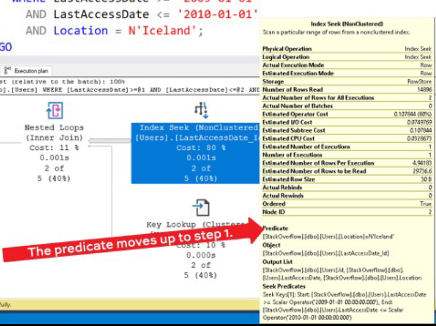

    How to tell that it helped
        [Number of Rows Read:] this would normally be the number of key lookups we'd have had to do in order to check Location.
        [Actual Number of Rows:] way lower because so few rows matched 'Iceland'

    But this trick only help IF ...
        The predicate is actually selective

        The less selective it is, the less this technique helps. For example:
    ```sql
    SELECT *
    FROM    dbo.Users
    WHERE   LastAccessDate >= '2009-01-01'
    AND     LastAccessDate <= '2010-01-01'
    AND     Location        IS NULL;
    ```        

  * asd

## RECAP

  * Key Lookups aren't evil anymore
    * They were evil for magnetic frisbees. This days, generally, SQL Server does a good job of managing when to use them
    * To fix them you can either:
      * Select less columns
      * Build wide covering indexes
    * But selective residual precidates are different: cover those

# Lab 3: Addeding Indexes with the DMVs
```sql
``` 

# The D.E.A.T.H. Method: Heaps and Clustered Indexes

## Clustered indexes are a little controversial
Developers say things like:
* “I ran a load test and clustered indexes slowed us down.”
* “Heaps are faster for inserts.”
* “There’s nothing unique about a row here.”
* “We can’t afford to have downtime to add a clustered index.”
* “We’re just not sure what’s the right set of keys.”
So I hold clustered key implementations for last.

## How heaps are organized on disk
  * When you have a Clusterd Index the data is ORDERER
  * When you don't have a Clusterd Index the data is not ORDERER. SQL Server still has to store all the data – it’s just not
    ordered (in a way that’s useful to you or me.)

    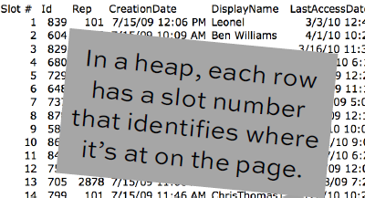

  * Heaps use the Row Identifier
    This combination of data helps you jump directly to the row you’re looking for:
      * File number
      * Page number
      * Slot number
    
    Together, they’re called the RID: Row Identifier.

  * Then the RID is on the NC index.
    Instead of Id, you would see File:Page:SlotNumber.

    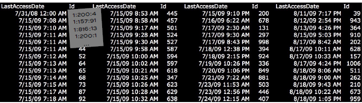

## Benefits of Heaps

  * Key lookups are faster.
    This is a really weird edge case, but it’s neat. I’ll start with the Users table, with its normal clustered index on Id.

    ```sql
    CREATE INDEX IX_LastAccessDate_Id ON dbo.Users(LastAccessDate, ID)
    GO

    SELECT *
    FROM    dbo.Users
    WHERE
        LastAccessDate >= '2013/11/10'
    AND LastAccessDate <  '2013/11/11'
    ```

    The execution plan shows [Seek + key lookup = 3,525 reads]. The key lookup is executed 1,146 times.

    Each time we do a key lookup: SQL Server knows the table and the clustering key’s value (the Id.). It doesn’t know where that Id physically lives, so it has to figure out:
      * What 8KB page(s) hold the clustered index
      * Look up what physical page holds that Id
      * Open up the physical page for that Id

    * But heaps are different.
    I’m going to drop the clustered primary key: that creates a heap. The Users table is still there, but it’s just now stored as a heap – aka, random order.

    ```sql
    ALTER TABLE dbo.Users DROP CONSTRAINT [PK_Users_Id] WITH(ONLINE = OFF)
    GO

    SELECT *
    FROM   dbo.Users
    WHERE
        LastAccessDate >= '2013/11/10'
    AND LastAccessDate <  '2013/11/11'
    ```

    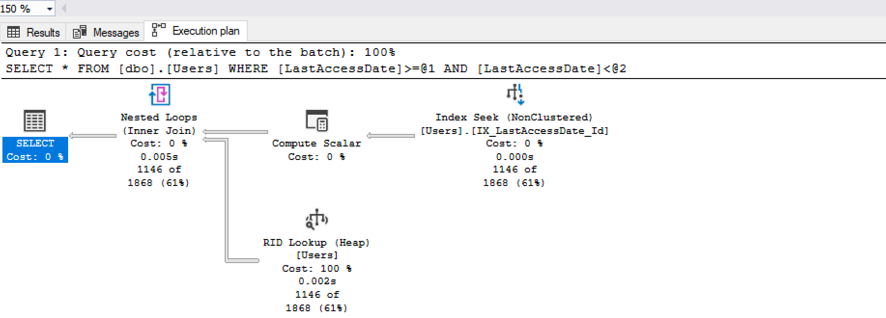

    It’s less logical reads (reads 1154 - used to be 3525).

    * Each time we do a key lookup:
      * When we have a clustered index, a key lookup has to:
        * What 8KB page(s) hold the clustered index
        * Look up what physical page holds that Id
        * Open up the physical page for that Id
    
      * But when we have a heap, each nonclustered index row flat out tells you which page number and slot number the row is on, so we just have to:
        * Open up the physical page for that Id

    * Table scans are faster too
        With a normal clustered index, SQL Server may use the B-tree to navigate through all of the rows.

    * The heap does <1% less reads.
        The heap scans through the pages in the order they’re physically allocated, without hassling with the B-tree.
        This isn’t a huge savings: it’s just 1,155 less page reads in this case.
    
    * At first, these sound compelling.
        * 67% less reads for key lookups
        * 1% less reads for table scans
        * Possibly faster load times (but this is super-debatable, depends on your ETL) And there are cases where they make sense.

    * Possibly good use cases for heaps
        * Staging tables in data warehouses:
            * Shove all the data in quickly
            * Scan it back out once
            * Truncate it every night

        * Scan-only tables like data warehouse fact tables:
            * Write the data once in an optimized load
            * Read only thereafter
            * Read pattern is scans

## But they have drawbacks

  * Continuing with Users…
    A lot of our columns are null (empty).

    ```sql
    SELECT *
    FROM    dbo.Users
    WHERE
        LastAccessDate >= '2013/11/10'
    AND LastAccessDate <  '2013/11/11'
    ```

    The SELECT takes 1,154 logical reads. Not a lot – just making a note.

    Let’s update one user’s profile. And we’re going to fill in the nulls with long values.

    ```sql
    UPDATE dbo.Users
        SET AboutMe = 'Wow, I am really starting to like this site, so I will fill out my profile.'
            , Age = 18
            , Location = 'University of Alaska Fairbanks: University Park Building. University Avenue. Fairbanks, AK, United S'
            , WebsiteURL = 'https://www.linke.................................................'
        WHERE Id = 2977185
    ```

    Check out those logical reads. Why did it take 28,786 reads to do this?
        We have to find User Id 2977185
        And since the data isn’t organized by Id, we have to scan the entire heap to find ‘em.
        You could create an index on Id, but… you’re wasting one of the 5 & 5.

    Now run our SELECT again. It does 1,155 logical reads. It went up by 1. Why? (used to be 1,154)
        That’s the original file:page:slot. When you update a narrow field (like an empty/null), and you populate it with wider values,
        there may not be enough empty space on the page. I purposely used wide values to force this to happen:

    Not enough space? A row moves.
        It moves to a new physical page. Doesn’t really matter which one – any one with enough empty space will do. But SQL Server doesn’t go update all the nonclustered indexes for that row with the new F:P:S. It just leaves a “forwarding pointer” behind at the old F:P:S location saying, “I’ve moved to this new F:P:S.”    

    So now a key lookup means:
        Use the index to find the row you want
        Look up its original page by F:P:S
        Find a forwarding pointer
        Jump over to the new F:P:S and do another read
        
        This is called a forwarded fetch.

    You can track it in the DMVs. And we surface this in sp_BlitzIndex, too:
    ```sql
    SELECT forwarded_fetch_count
    FROM   sys.dm_db_index_operational_stats(DB_ID(), OBJECT_ID('dbo.Users'), 0, 0);
    ```
    Forwarded fetches means we’re doing more reads than really necessary.

    Is this a problem with heaps?
        Technically, no. Microsoft could choose to fix this. The decision not to update the F:P:S on each nonclustered index is an implementation decision. Microsoft’s design makes for faster updates, but slower reads. It’s a design tradeoff. If you do updates, especially on variable-length columns, heaps are usually a bad idea

    Working around it:
        ALTER TABLE dbo.Users REBUILD;
          * Builds a new table with no forwarding pointers
          * On heaps, it rebuilds the nonclustered indexes too (since the F:P:S pointers will change)
          * Does involve a lot of locking & logging though
          * The problem will come back again & again

        Other fixes:
          * Truncate the table (if it’s staging)
          * Put a clustered index on it


  * Next drawback: deletes don’t.
    Drop the nonclustered indexes, delete a bunch of users, then run a COUNT(*). 2M rows are left:

    ```sql
    /* Deletes actually don't delete. Let's delete everyone who hasn't set their location: */
    DropIndexes;
    GO

    DELETE dbo.Users WHERE Location IS NULL;
    GO

    SELECT COUNT(*) FROM dbo.Users
    ```  
    How many reads does it do? 140K reads to read 2M rows. Is that a lot?

    Delete all but 1 row.
    ```sql
    DELETE dbo.Users WHERE Id <> 26837;
    GO

    SELECT COUNT(*) FROM dbo.Users
    ```  
    And then check your logical reads...
    6,247 page reads for 1 row?!?
    How can one user span 6,247 pages? (I don’t have a big AboutMe, either.)
    How much space is Users taking?
    ```sql
    sp_BlitzIndex @TableName = N'Users';
    ```      
    The table has 49MB allocated for just one row!

    What’s going on
        In a heap, deletes don’t deallocate all empty pages. Heaps are optimized for fast loads.
        SQL Server assumes you’re still going to want to load data again soon, so it leaves the pages allocated.
        The bad scenario for heaps:
            * if you do deletes, and then
            * SELCT FROM the same table
            * Extra reads are incurred

    Working around it:
        ALTER TABLE dbo.Users REBUILD;
          * Builds a new table with no forwarding pointers
          * On heaps, it rebuilds the nonclustered indexes too (since the F:P:S pointers will change)
          * Does involve a lot of locking & logging though
          * The problem will come back again & again

        Other fixes:
          * Truncate the table (if it’s staging)
          * Put a clustered index on it

  * RECAP HEAPS
    * Benefit: less reads for key lookups, table scans
    * Drawbacks: updates & deletes reduce the amount of performance gains, and the fixes are ugly.
    * If you do updates & deletes, you probably want a clustered index.
  
  * Designing good clustering keys
    * SUN-e method
        Static
        Unique
        Narrow
        Ever-Increasing

        Best practice #1: Static
            The clustered key should be static Otherwise, if it changes:
              * This moves data around in the clustered index
              * It also modifies / moves data around in all nonclustered indexes
        Best practice #2: Unique
            Make your clustering key unique. If you don’t make it unique, SQL adds a hidden uniquifier
              * It's in the clustered index
              * It's ALSO in the nonclustered indexes
              * If a duplicate row is added or removed, they all change
            Rows in the table will be uniquely identified in 1 of 3 ways:
              * You define a UNIQUE clustered index
              * You define a non-UNIQUE clustered index, so SQL Server uses a hidden UNIQUIFIER
              * The RID (F:P:S)
        Best practice #3: Narrow
            Keep the clustered key as narrow as you can. Consider both:
              * Data type
              * Number of columns
            Why?
              * The wider it is, the wider your nonclustered indexes
              * More space on memory, more space on disk
              * More IO
            How “narrow” is narrow?
        Best practice #4: Ever-Increasing
            The clustered key should be ever-increasing
              * This keeps it from getting fragmented quickly
                (There are often exceptions to this)

        Secret columns…
        …are the reason for these three best practices:
        1. Static: Or you do secret writes on EVERY index
        2. Unique: or you get uniquifier overhead
        3. Narrow: or you add bloated size to all your NC indexes

        Overheard
        “Always use an identity column as your clustering key”
        “Always use a surrogate key”
        “Always use a one column key”
        “Never use GUIDs”
 
    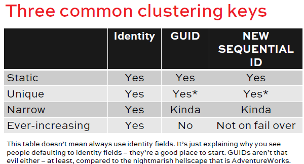

    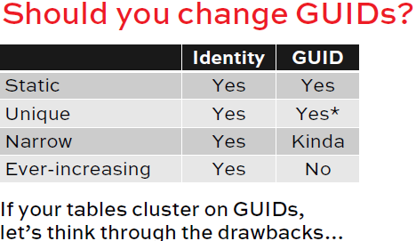

        GUIDs aren’t narrow.
            GUID: 16 bytes per row. BIGINT: 8. INT: 4.

            So you could save 8-12 bytes per row, per index, by changing from a GUID to a smaller data type.
            For a 1 million row table, that’s an 8MB savings per index.
            For a 1 billion row table with 10 indexes, that’s an 80GB savings – but painful to get.

        GUIDs aren’t ever-increasing.
            Inserts will be randomly scattered through the table.
            That leads to fragmentation. But…it’s not a big deal:
            https://www.brentozar.com/archive/2022/08/video-fragmentation-explained-in-20-minutes-at-sqlbits/
            https://www.youtube.com/watch?v=iEa6_QnCFMU

        So should you “fix” GUID keys?
            On smaller tables… nobody’s going to notice the fix.
            On larger tables, you can save space, but the fix is going to suck:
                * Dropping foreign keys, primary keys
                * Breaking replication
                * Tons of logged disk activity, AG traffic
                * Long periods of blocking
            So fix growing tables that will be large in a few years.

## RECAP
1. Heaps may have their place: staging, fact tables
2. But heaps come with big drawbacks:
   1. Updates cause forwarded fetches
   2. Deletes don’t deallocate empty pages
3. Good clustering keys follow the SUN-E guidelines:
   Static
   Unique
   Narrow
   Ever-increasing

```sql
USE [StackOverflow]
GO
DropIndexes;
SET STATISTICS IO ON; /* and turn on actual execution plans */
GO

/* How many reads does it take to scan the clustered index? */
SELECT COUNT(*) FROM dbo.Users WITH (INDEX = 1);
GO

CREATE INDEX IX_LastAccessDate_Id ON dbo.Users(LastAccessDate, Id);
GO
/* Here's what an index seek + key lookup looks like when we have a  index. Note the number of reads. */
SELECT *
  FROM dbo.Users
  WHERE LastAccessDate >= '2013/11/10'
    AND LastAccessDate <  '2013/11/11';
GO

/* Drop the clustered index: */
ALTER TABLE [dbo].[Users] DROP CONSTRAINT [PK_Users_Id] WITH ( ONLINE = OFF )
GO

/* But we still have the nonclustered index! */
SELECT *
  FROM dbo.Users
  WHERE LastAccessDate >= '2013/11/10'
    AND LastAccessDate <  '2013/11/11';
GO

/* How many reads does it take to scan the heap? */
SELECT COUNT(*) FROM dbo.Users WITH (INDEX = 0);
GO

/* Look at the forwarded_fetch_count column: */
SELECT * FROM sys.dm_db_index_operational_stats(DB_ID(), OBJECT_ID('dbo.Users'), 0, 0);
GO

/* See how a lot of the data is NULL? And take note of the number of logical reads... */
SELECT *
  FROM dbo.Users
  WHERE LastAccessDate >= '2013/11/10'
    AND LastAccessDate <  '2013/11/11';
GO

/* What if we went back and populated that? */
UPDATE dbo.Users
  SET AboutMe = 'Wow, I am really starting to like this site, so I will fill out my profile.',
      Age = 18,
	  Location = 'University of Alaska Fairbanks: University Park Building, University Avenue, Fairbanks, AK, United S',
	  WebsiteUrl = 'https://www.linkedin.com/profile/view?id=26971423&authType=NAME_SEARCH&authToken=qvpL&locale=en_US&srchid=969545191417678255996&srchindex=1&srchtotal=452&trk=vsrp_people_res_name&trkInfo=VSRPsearchId%'
  WHERE Id = 2977185;
GO

/* Now, check your logical reads: */
SELECT *
  FROM dbo.Users
  WHERE LastAccessDate >= '2013/11/10'
    AND LastAccessDate <  '2013/11/11';
GO

/* Look at the forwarded_fetch_count column: */
SELECT forwarded_fetch_count 
FROM sys.dm_db_index_operational_stats(DB_ID(), OBJECT_ID('dbo.Users'), 0, 0);
GO

/* The more users who update their data, the worse this becomes. What if everyone did? */
UPDATE dbo.Users
  SET AboutMe = 'Wow, I am really starting to like this site, so I will fill out my profile.',
      Age = 18,
	  Location = 'University of Alaska Fairbanks: University Park Building, University Avenue, Fairbanks, AK, United S',
	  WebsiteUrl = 'https://www.linkedin.com/profile/view?id=26971423&authType=NAME_SEARCH&authToken=qvpL&locale=en_US&srchid=969545191417678255996&srchindex=1&srchtotal=452&trk=vsrp_people_res_name&trkInfo=VSRPsearchId%'
  WHERE LastAccessDate >= '2013/11/10'
    AND LastAccessDate <  '2013/11/11';
GO

/* Now, check your logical reads: */
SELECT *
  FROM dbo.Users
  WHERE LastAccessDate >= '2013/11/10'
    AND LastAccessDate <  '2013/11/11';
GO

/* Look at the forwarded_fetch_count column: */
SELECT forwarded_fetch_count 
FROM sys.dm_db_index_operational_stats(DB_ID(), OBJECT_ID('dbo.Users'), 0, 0);
GO

/* To fix it, you can rebuild the table, which builds a new copy w/o forwarded pointers: */
ALTER TABLE dbo.Users REBUILD;
GO
/* But that's slow because:
  * It's logged
  * It takes the table offline on Standard Edition
  * It also has to rebuild all the nonclustered indexes because the File/Page/Slot number is changing

Or, put a clustered key on it, which fixes this problem permanently. */

/* The next problem: deletes don't actually delete. Let's delete everyone who hasn't set their location: */
DropIndexes;
GO
DELETE dbo.Users WHERE Location IS NULL;
GO

SELECT COUNT(*) FROM dbo.Users;

/* Only one user is important anyway: */
DELETE dbo.Users WHERE Id <> 26837;
GO
SELECT COUNT(*) FROM dbo.Users;

/* Turn off actual plans: */
sp_BlitzIndex @TableName = 'Users';

/* Add the clustered primary key back in: */
ALTER TABLE [dbo].[Users] ADD  CONSTRAINT [PK_Users_Id] PRIMARY KEY CLUSTERED 
(
	[Id] ASC
)WITH (ONLINE = OFF);
GO
```

# How Indexes Help Avoiding Blocking

* Concurrency challenges
  * Locking: Lefty takes out a look
  * blocking: Righty needs a lock, but lefty has it. <r>SQL Server will let Righty wait for forever, and the symptom is LCK* waits</r>
  * Deadlocks: Lefty has a lock, but needs some held by Righty. Righty has locks, but needs some held by Lefty. <r>SQL Server solves this one by killing somebody.</r>

* 3 ways to fix blocking & deadlocks
  1. Have enough indexes to make your queries fast, but not so many that they slow down DUIs, making them hold more locks for longer times. (This session focuses on this.)
  2. Keep batches & transactions short and sweet. (We cover this in Mastering Query Tuning.)
  3. Use the right isolation level for your app's needs. (We cover this in Mastering Server Tuning.)

* Main
    Using dbo.Users table again

    ```sql
    SELECT COUNT(*)
    FROM dbo.Users
    WHERE LastAccessDate >= '2013/11/10'
    AND   LastAccessDate <= '2013/11/11'
    ```

    You only have the clustered index on ID. How many accessed the system on my birthday?
    Let's reward them

    What's the execution plan for this query:
    ```sql
    BEGIN TRAN
    UPDATE dbo.Users
    SET Reputation = Reputation + 100
    WHERE LastAccessDate >= '2013/11/10'
    AND   LastAccessDate <= '2013/11/11'
    ```

    The execution plan is:
    1. Shuffle through all the pages, examining the LAstAccessDate
    2. If it maches our filter, lock this row and update it
    3. Keep moving through the table
    4. After we finish, hold the locks until we commit

    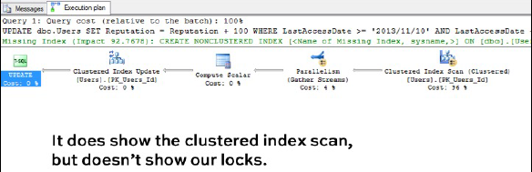

    While that's open, try another query.
    You only have the clustered index on ID, the white pages of the table.
    What's the execution plan for this query:

    ```sql
    SELECT Id
    FROM  dbo.Users
    WHERE LastAccessDate >= '1800/01/01' 
    AND   LastAccessDate <= '1800/01/02'
    ```

    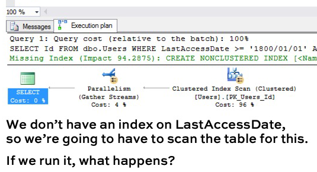

    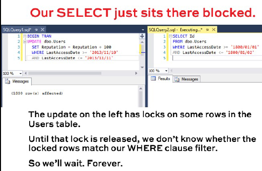

    Let's try another query
    You only have the clustered index on ID, the white pages of the table.
    What's the execution plan for this query:

    ```sql
    SELECT Id
    FROM  dbo.Users
    WHERE Id = 26837
    ```
    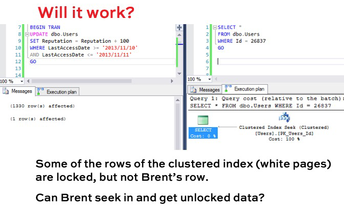

    Ways to work around the blocking
    1. Add NOLOCK to our SELECT query
    2. Commit our UPDATE transaction faster
    3. Enable Read Committed Snapshot Isolation (RCSI)
    4. Add an Index on LastAccessDate

    Let's try index on LastAccessDate
    ```sql
    CREATE INDEX LastAccessDate ON dbo.Users(LastAccessDate, Id)
    WITH(ONLINE = OFF, MAXDOP = 0)
    GO
    ```    
    
    Execute the UPDATE and see what's the plan?
    ```sql
    BEGIN TRAN
    UPDATE dbo.Users
    SET Reputation = Reputation + 100
    WHERE LastAccessDate >= '2013/11/10'
    AND   LastAccessDate <= '2013/11/11'
    ```
    The execution plan is:
    1. Use the new index. Seek directly to '2013/11/10'
    2. Look up their IDs in the clustered index, lock them and update
    3. After we finish, hold the locks until we commit

    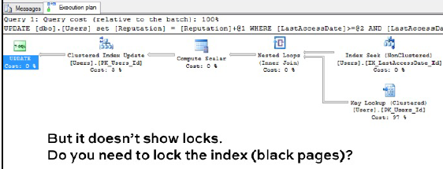

    Let's find out: run another query What;s the execution plan for this query:

    ```sql
    SELECT Id
    FROM  dbo.Users
    WHERE LastAccessDate >= '1800/01/01' 
    AND   LastAccessDate <= '1800/01/02'
    ```

    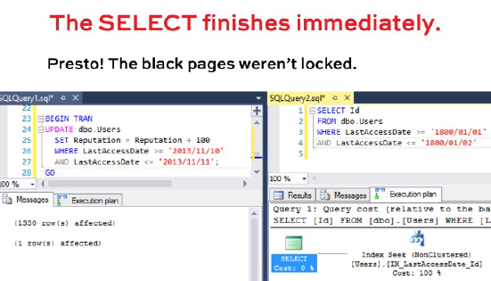

    The balck pages weren't locked. But what if we query the same dates that we are updating?

    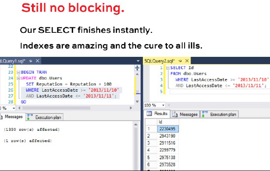

    Now try this SELECT.
    ```sql
    SELECT Id, Reputation
    FROM  dbo.Users
    WHERE LastAccessDate >= '1800/01/01' 
    AND   LastAccessDate <= '1800/01/02'
    ```
    The execution plan:
    1. Use the new index, seek directly to 1800/01/01, make a list of rows that match.
    2. Look up their IDs in the clustered index and get their Reputation field.

    Will it be blocked?

    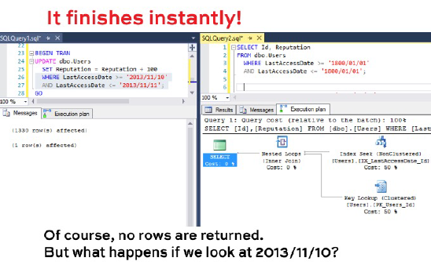

    

    

    Recap so far
     * SQL Server locks individual indexes at the row level at first, and only the relevant indexes - not all of 'em. 
     * Indexes are like readable replicas inside our DB. 
     * Avoid indexing "hot" fields if you can.
     * Even just including "hot" fields comes at a price.

    Let's reward more people
    In your transaction window, let's add another UPDATE without commiting it.
    What's the execution plan for this query:

    ```sql
    BEGIN TRAN
    UPDATE dbo.Users
    SET Reputation = Reputation + 100
    WHERE LastAccessDate >= '2014/11/10'
    AND   LastAccessDate <= '2014/11/11'
    ```
    The execution plan is the same. So far, so good.

    While that's open run another query
    ```sql
    /* We tried this before and now run it again*/
    SELECT Id
    FROM  dbo.Users
    WHERE Id = 26837
    ```
    Still finishes instantly. We do our clustered index seek and get out. Brent is unaffected because of the LastAccessDate

    Let's do one more round of gifts
    In your transaction window, let's add another update without commiting it.

    What's the execution plan for this query:
    ```sql
    BEGIN TRAN
    UPDATE dbo.Users
    SET Reputation = Reputation + 100
    WHERE LastAccessDate >= '2015/11/10'
    AND   LastAccessDate <= '2015/11/11'
    ```

    While that's open run another query
    ```sql
    /* We tried this before and now run it again*/
    SELECT Id
    FROM  dbo.Users
    WHERE Id = 26837
    ```
    Brent is snot affected.
    Literally Brent shouldn't be blocked, but this SELECT hangs. SQL Server has gone from locking individual rows of the clustered index, up to locking the entire index. The row-level lock escalated to table lock.

    SQL Server needs memory to track locks, When queries hold thousands of row-level locks, SQL Server escalates those locks to table-level. Depending on what day(s) of data you are updating you might get row-level or table-level locks

    What we learned so far
     * Indexes aren't just great for selects: they can make DUI operations faster, too.
     * You want the right number of indexes to support all of your concurrent operations, but no more than that.
     * Be aware that lock escalation stops queries dead. 
     * Before tuning specific queries, use sp_Blitzindex to: 
       * Remove indexes that aren't getting used
       * Put a clustered index on OLTP tables w/DUIs
       * Add high-value indexes that are really needed

    <r>Tools to find & reduce blocking</r>
     * <r>D.E.A with sp_BlitzIndex, look for "Aggressive Indexes" warning</r>
        Aggressive  means, SQL Server  is tracking blocking on this index. That doesn't mean this index is the problem one, it;s just where the locking is happening.
        Aggressive Indexes, Under-Indexed: the table has 0-3 nonclustered indexes, and probably needs an index to support the D/U/I operations.
        Aggressive Indexes, Over-Indexed: the table has 10+ indexes, probably needs a haircut, especially indexes with writes > O, but O reads. They're only slowing you down.
     * <r>T. with sp_BlitzCache = "duration", look for "Long running, Low CPU" warnings</r>
     * <r>H. because heaps can be locking hell</r>
     * <r>Finding deadlocks: sp_BlitzLock</r>
     * <r>Finding queries live: sp_BlitzWho, sp_Whoisactive</r>

    * Related learning
        Take Care When Scripting Batches by Michael J. Swart: https://michaeljswart.com/2014/09/take-care-when-scripting-batches/
        Which Locks Count Toward Lock Escalation by Kendra Little:https://littlekendra.com/2017/04/03/which-locks-count-toward-lock-escalation/
        Video: Using Batches to Do A Lot of Work Without Blocking by me (in Mastering Query Tuning class)


# Lab 4 Setup: Reducing Blocking with Just Index Changes
Restore your Stack Overflow database, then run the setup script below. This will create a specialized set of indexes that will exhibit a different set of problems than we’ve experienced so far.

Then, you’ll run Lab 4’s workload, and presto: we’ve got blocking.

Your mission, should you choose to accept it, is to use sp_BlitzIndex and sp_BlitzCache to figure out where the blocking is happening, and create/drop the right indexes to reduce the blocking. If you make the right changes, the workload should finish in 1-2 minutes.

```sql
USE StackOverflow;
GO

IF DB_NAME() <> 'StackOverflow'
  RAISERROR(N'Oops! For some reason the StackOverflow database does not exist here.', 20, 1) WITH LOG;
GO

/* Set the compat level to be the same as master: */
DECLARE @StringToExec NVARCHAR(4000);
SELECT @StringToExec = N'ALTER DATABASE CURRENT SET compatibility_level = '
	+ CAST(compatibility_level AS NVARCHAR(5)) + N';' 
	FROM sys.databases WHERE name = 'master';
EXEC(@StringToExec);
GO


CREATE OR ALTER PROC dbo.usp_LogUserVisit @Id INT AS
BEGIN
UPDATE dbo.Users
	SET LastAccessDate = GETUTCDATE()
	WHERE Id = @Id;
END
GO

CREATE OR ALTER PROC dbo.usp_LogPostView @PostId INT, @UserId INT = NULL AS
BEGIN
BEGIN TRAN
	UPDATE dbo.Posts
		SET ViewCount = ViewCount + 1, LastActivityDate = GETUTCDATE()
		WHERE Id = @PostId;

	/* If the post is a question, and it has achieved 1,000 views, give the owner a badge */
	IF 1000 >= (SELECT ViewCount FROM dbo.Posts WHERE Id = @PostId AND PostTypeId = 1)
		AND NOT EXISTS (SELECT * 
							FROM dbo.Posts p
							INNER JOIN dbo.Users u ON p.OwnerUserId = u.Id
							INNER JOIN dbo.Badges b ON u.Id = b.UserId AND b.Name = 'Popular Question'
							WHERE p.Id = @PostId)
		BEGIN
		INSERT INTO dbo.Badges(Name, UserId, Date)
			SELECT 'Popular Question', OwnerUserId, GETUTCDATE()
			FROM dbo.Posts p
			INNER JOIN dbo.Users u ON p.OwnerUserId = u.Id
			WHERE p.Id = @PostId;
		END 

	/* If the post is an answer, and it has achieved 1,000 views, give the owner a badge */
	IF 1000 >= (SELECT ViewCount FROM dbo.Posts WHERE Id = @PostId AND PostTypeId = 2)
		AND NOT EXISTS (SELECT * 
							FROM dbo.Posts p
							INNER JOIN dbo.Users u ON p.OwnerUserId = u.Id
							INNER JOIN dbo.Badges b ON u.Id = b.UserId AND b.Name = 'Popular Answer'
							WHERE p.Id = @PostId)
		BEGIN
		INSERT INTO dbo.Badges(Name, UserId, Date)
			SELECT 'Popular Answer', OwnerUserId, GETUTCDATE()
			FROM dbo.Posts p
			INNER JOIN dbo.Users u ON p.OwnerUserId = u.Id
			WHERE p.Id = @PostId;
		END 

	IF @UserId IS NOT NULL
		UPDATE dbo.Users
			SET LastAccessDate = GETUTCDATE()
			WHERE Id = @UserId;

COMMIT
END
GO

CREATE OR ALTER PROC dbo.usp_LogVote @PostId INT, @UserId INT, @VoteTypeId INT AS
BEGIN
BEGIN TRAN
	INSERT INTO dbo.Votes(PostId, UserId, VoteTypeId, CreationDate)
	SELECT @PostId, @UserId, @VoteTypeId, GETDATE()
		FROM dbo.Posts p
		  LEFT OUTER JOIN dbo.Votes v ON p.Id = v.PostId
									AND v.VoteTypeId = @VoteTypeId
									AND v.UserId = @UserId /* Not allowed to vote twice */
		WHERE p.Id = @PostId			/* Make sure it's a valid post */
		  AND p.ClosedDate IS NULL		/* Not allowed to vote on closed posts */
		  AND p.OwnerUserId <> @UserId	/* Not allowed to vote on your own posts */
		  AND v.Id IS NULL				/* Not allowed to vote twice */
		  AND EXISTS (SELECT * FROM dbo.VoteTypes vt WHERE vt.Id = @VoteTypeId) /* Only accept current vote types */

	IF @VoteTypeId = 2 /* UpVote */
		BEGIN
		UPDATE dbo.Posts	
			SET Score = Score + 1
			WHERE Id = @PostId;
		END

	IF @VoteTypeId = 3 /* DownVote */
		BEGIN
		UPDATE dbo.Posts	
			SET Score = Score - 1
			WHERE Id = @PostId;
		UPDATE dbo.Users
			SET Reputation = Reputation - 1 /* Downvoting costs you a reputation point */
			WHERE Id = @UserId;
		END

	UPDATE dbo.Users
		SET LastAccessDate = GETUTCDATE()
		WHERE Id = @UserId;

	UPDATE dbo.Posts
		SET LastActivityDate = GETUTCDATE()
		WHERE Id = @PostId;

COMMIT
END
GO

CREATE OR ALTER PROC dbo.usp_ReportVotesByDate @StartDate DATETIME, @EndDate DATETIME AS
BEGIN
SELECT TOP 500 p.Title, vt.Name, COUNT(DISTINCT v.Id) AS Votes
  FROM dbo.Posts p
    INNER JOIN dbo.Votes v ON p.Id = v.PostId
	INNER JOIN dbo.VoteTypes vt ON v.VoteTypeId = vt.Id
	INNER JOIN dbo.Users u ON v.UserId = u.Id
  WHERE v.CreationDate BETWEEN @StartDate AND @EndDate
  GROUP BY p.Title, vt.Name
  ORDER BY COUNT(DISTINCT v.Id) DESC;
END
GO


CREATE OR ALTER PROC dbo.usp_IndexLab4_Setup AS
BEGIN
SELECT *
  INTO dbo.Users_New
  FROM dbo.Users;
DROP TABLE dbo.Users;
EXEC sp_rename 'dbo.Users_New', 'Users', 'OBJECT';

SET IDENTITY_INSERT dbo.Users ON;
INSERT INTO [dbo].[Users]
           ([AboutMe]
           ,[Age]
           ,[CreationDate]
           ,[DisplayName]
           ,[DownVotes]
           ,[EmailHash]
		   ,[Id]
           ,[LastAccessDate]
           ,[Location]
           ,[Reputation]
           ,[UpVotes]
           ,[Views]
           ,[WebsiteUrl]
           ,[AccountId])
SELECT [AboutMe]
           ,[Age]
           ,[CreationDate]
           ,[DisplayName]
           ,[DownVotes]
           ,[EmailHash]
		   ,[Id]
           ,[LastAccessDate]
           ,[Location]
           ,[Reputation]
           ,[UpVotes]
           ,[Views]
           ,[WebsiteUrl]
           ,[AccountId]
FROM dbo.Users
WHERE DisplayName LIKE '%duplic%';
SET IDENTITY_INSERT dbo.Users OFF;

EXEC DropIndexes @SchemaName = 'dbo', @TableName = 'Posts', @ExceptIndexNames = 'IX_OwnerUserId_Includes,IX_LastActivityDate_Includes,IX_Score,IX_ViewCount_Score_LastActivityDate';
EXEC DropIndexes @SchemaName = 'dbo', @TableName = 'Badges';

IF NOT EXISTS (SELECT * FROM sys.indexes WHERE object_id = OBJECT_ID(N'[dbo].[Posts]') AND name = N'IX_OwnerUserId_Includes')
	CREATE INDEX IX_OwnerUserId_Includes ON dbo.Posts(OwnerUserId) INCLUDE (Score, ViewCount, LastActivityDate);
IF NOT EXISTS (SELECT * FROM sys.indexes WHERE object_id = OBJECT_ID(N'[dbo].[Posts]') AND name = N'IX_LastActivityDate_Includes')
	CREATE INDEX IX_LastActivityDate_Includes ON dbo.Posts(LastActivityDate) INCLUDE (Score, ViewCount);
IF NOT EXISTS (SELECT * FROM sys.indexes WHERE object_id = OBJECT_ID(N'[dbo].[Posts]') AND name = N'IX_Score')
	CREATE INDEX IX_Score ON dbo.Posts(Score) INCLUDE (LastActivityDate, ViewCount);
IF NOT EXISTS (SELECT * FROM sys.indexes WHERE object_id = OBJECT_ID(N'[dbo].[Posts]') AND name = N'IX_ViewCount_Score_LastActivityDate')
	CREATE INDEX IX_ViewCount_Score_LastActivityDate ON dbo.Posts(ViewCount, Score, LastActivityDate);
END
GO


CREATE OR ALTER PROC [dbo].[usp_IndexLab4] WITH RECOMPILE AS
BEGIN
/* Hi! You can ignore this stored procedure.
   This is used to run different random stored procs as part of your class.
   Don't change this in order to "tune" things.
*/
SET NOCOUNT ON

DECLARE @Id1 INT = CAST(RAND() * 10000000 AS INT) + 1,
		@Id2 INT = CAST(RAND() * 10000000 AS INT) + 1,
		@StartDate DATETIME = DATEADD(DAY, -1, GETUTCDATE()),
		@EndDate DATETIME = GETUTCDATE();

IF @Id1 % 13 = 11 AND @@SPID % 5 = 0
	EXEC usp_ReportVotesByDate @StartDate = @StartDate, @EndDate = @EndDate;
ELSE IF @Id1 % 13 = 10
	EXEC dbo.usp_LogPostView @PostId = 38549, @UserId = 22656
ELSE IF @Id1 % 13 = 9
	EXEC dbo.usp_LogPostView @PostId = 38549, @UserId = NULL /* Anonymous visitor */
ELSE IF @Id1 % 13 = 8
	EXEC dbo.usp_LogVote @PostId = 38549, @UserId = 22656, @VoteTypeId = 3
ELSE IF @Id1 % 13 = 7
	EXEC usp_LogUserVisit @Id = 22656;
ELSE IF @Id1 % 13 = 6
	EXEC dbo.usp_LogVote @PostId = @Id1, @UserId = @Id2, @VoteTypeId = 3
ELSE IF @Id1 % 13 = 5
	EXEC dbo.usp_LogVote @PostId = @Id1, @UserId = @Id2, @VoteTypeId = 2
ELSE IF @Id1 % 13 = 4
	EXEC dbo.usp_LogPostView @PostId = @Id1, @UserId = @Id2
ELSE IF @Id1 % 13 = 3
	EXEC dbo.usp_LogPostView @PostId = @Id1, @UserId = NULL /* Anonymous visitor */
ELSE IF @Id1 % 13 = 2
	EXEC usp_LogUserVisit @Id = @Id1;
ELSE
	EXEC dbo.usp_LogVote @PostId = 38549, @UserId = 22656, @VoteTypeId = 2

WHILE @@TRANCOUNT > 0
	BEGIN
	COMMIT
	END
END
GO

EXEC usp_IndexLab4_Setup
GO
```


# Artisanal Indexes: Filtered Indexes, Indexed Views, and Computed Columns

* Main
  * Indexes can benifit of hand-crafting
    * App sometimes queries a small subset of rows
    * App frequently queries aggregation
    * App frequently queries computation
  
  * A big gotcha
    * Some of this artisial indexes have a huge gotcha, they won't work with clients who are using different "SET" options in their connection string.
    This can break the application
    <r>Msg 1934, Level 16, State 1, Line 1</r>
    <r>INSERT failed because the following SET options have incorrect settings</r>

    

    To catch sessions like this you can execute:
    ```sql
    SELECT *
    FROM sys.dm_exec_sessions
    WHERE
        is_user_process = 1
    AND (
           ANSI_NULLS    = 0
        OR ANSI_padding  = 0
        OR ANSI_WARNINGS = 0
        OR ARITHABORT    = 0
        OR CONCAT_NULL_YIELDS_NULL = 0
        OR QUOTED_IDENTIFIER = 0 
    )
    ```

    Don't let this stop you. Validate application activity
    just make sure you include validating that WRITES can occur as part of the testing.

    * Filtered indexes
    ```sql
    CREATE NONCLUSTERED INDEX IX_DisplayName
    ON dbo.Users(DisplayName)
    WHERE IsEmployee = 1
    GO
    ```

    Setting up the dbo.Users table to use Filtered Indexes
    ```sql
    ALTER TABLE dbo.users 
        ADD IsEmployee BIT NOT NULL DEFAULT = 0;

    /* Populate the table with some data */
    UPDATE dbo.Users
        SET IsEmployee = 1
        WHERE Id IN (1,2,3,4,13249,23354)
    ```

    ```sql
    /* When we filter for IsEmployee = 1 Clippy is quiet*/
    SELECT *
    FROM dbo.Users
    WHERE IsEmployee = 1
    ORDER BY DisplayName

    /* if we create an Index for this query the engine is going to use it. */
    CREATE NONCLUSTERED INDEX IsEmplyoee_DisplayName
        ON dbo.Users(IsEmplyoee, DisplayName)
    GO

    /* But the index is to big */
    sp_BlitzIndex @TableName = 'Users'
    GO

    /* If we drop all indexes and create a filter one */
    DropIndexes
    GO
    CREATE NONCLUSTERED INDEX IX_DisplayName
    ON dbo.Users(DisplayName)
    WHERE IsEmployee = 1
    GO

    /* If we execute the SELECT here the engine is going to use the filtered index
    and it's tiny: just 8 rows. Not only use less space, but it also doesn;t have to be maintened for rows that don't match the filter.  
    */
    ```

    * Who it is for?
      * Very selective columns wherer only the 5% of the data match
        * Queue Tables:
          * ProcessedDate column default to null, set to a valid date after is processeded
          * Queries ask for WHERE ProcessedDate IS NULL
          * Only a few rows need to be processed, but you want to find them quicly
          * You never query the rest of the rows by by date  

    * Filtered Index limitation
      * SQL Server 2008+ all editions
      * Filter can only contain string literal (not functions)
      * Statistics automatically update at hte same time as the best table (20% of rows updated)
      * Parametrized queries dont'use the filter. If you want filtered index be use you have to force into the queryu itself.
      * Merge and filtered index has lot of bugs  


    * Indexed Views
      ```sql
      /*
      Say we need to quickly find which non-deleted users have the most comments:
      */
      ALTER TABLE dbo.Comments
      GO
      ADD IsDeleted BIT NOT NULL DEFAULT 0;

      SELECT TOP 100 u. Id, u.DisplayName, u. Location, u. AboutMe, SUM(1) AS CommentCount 
      FROM dbo.Users u
      JOIN dbo.Comments c ON u.Id = c.UserId
      WHERE u.IsDeleted = 0
      AND   c.IsDeleted = 0
      GROUP BY u. Id, u.DisplayName, u. Location, u.AboutMe
      ORDER BY SUM(1) DESC;
      GO
      ```

      The plan does suggest an index and it's one of the worst indexes you could design. It Keys on Comments.IsDeleted is all zeroes and then includes UserId whitout even sorting it.

      We could do better manually. We can create a filtered index on UserId just for non deleted comments. However we are still gonna hace to scan the whole thinkg and run totals. The query is much faster now. However, it's going parallel and burning multiple cores to do all this totaling every time it runs, and that never gets cached.

      Enter the indexed view also know as a materialized view.
      Normally we think of views as syntax shortcuts.
      Index views are good for:
        * Pre-baking CPU intensive aggregations
        * Pre-baking joins (which isn't usuarlly a bug deal, except ar scale)

      ```sql
      /* Creating the view and the clustered index */
      CREATE OR ALTER VIEW dbo.vwComments ByUser WITH SCHEMABINDING AS
      GO
      SELECT 
        UserId,
        SUM(1) AS CommentCount,
        COUNT_BIG(*) AS MeanOldSQLServerMakesMeDoThis
      FROM dbo.Comments
      WHERE IsDeleted = 0
      GROUP BY UserId;

      CREATE UNIQUE CLUSTERED INDEX CL_UserId ON dbo.vwCommentsByUser (UserId); GO    
      ```

      if we rerun the query the execution plan is:

      

      Reads and CPU time drop.

      This almost never works. SQL Server enterprise Edition is supposed to auto-match your query to the newly created indexed view, whitout changing your query.

      In reality, this almost never works, and you have to:
        * change your query to point to the view
        * Use the WITH(NOEXPAND) hint on your query to force SQL Server to use not just the view, but the index on the view.
        * Dp a little dance to the indexe view gods

      * Indexed view fine print
        * View must be created with schemabinding
          * References only tables in the same database
          * No OUTER JOINS, SELF JOINS or SUBQUERIES
          * No Over clause or raking/windows functions
          * No OUTER or CROSS APPLY
        * If you are grouping
          * The view must contain COUNT_BIG column
          * No HAVING
          * No MIN, MAX, TOP or ORDER BY
        * The clustered index on the view must be unique
        * Lost more rules - Books Online hjas a full list: BrentOzar.com/goviewrules

      * Indexed view limitations
      "Why isn't SQL using my indexed view?" asks everyone who tries this feature

      There's an Enterprise Edition feature to match queries with the view automatically
        * Watch your query plans closely- it may not use the view as often as you want
        * Even in EE, you may often need to reference the view by name and add a NOEXPAND hint
        * Every indexed view (and nonclustered index you add to an indexed view) adds overhead:
        * More writes for each insert/update/delete 
        * More to check for corruption

      * Indexed Views Corruption
      This is the worst kind of corruption. You can still query it, but it returns null when there's really valid data. to detect the corruption, you have to run DBCC CHECKDB with EXTENDED_LOGICAL_CHECKS for compatibilitu level 110 and higher.

    * Computed columns
      Say we have a legacy app. It doesn't trust the contets of the data. It LTRIM/RTRIMS everything. We can't change the code.

      ```sql
      SELECT *
      FROM dbo.Users
      WHERE LTRIM(RTRIM(DisplayName)) = 'Brent Ozar';
      GO

      CREATE INDEX IX_DisplayName ON dbo.Users(DisplayName);
      GO
      ```  

      

      * The 3 Problems
        * Our estimates may be way off
        * We are ognoring nonclustered indexes
        * We are not getting index seeks

      Add a computed column
      ```sql
      ALTER TABLE dbo.Users
        ADD DisplayNameTrimmed AS ltrim(rtrim(dISPLAYnAME));
      GO 
      ```        

      If we execute the query again the execution plan is:

      

      * There is a lot to take in here
        * This really does add a new column to the table
        * I did not persist it for a bunch of reasons:
          * It's a metadata-only change
          * It finishes nearly instantly with low blocking
          * Doesn;t need to reqrite all of the 8KB pages, so no big logging problems either
          * I didn't need to persist it, suddenly the quey scans the index

      If we want to fix #3 point, we need an index on the new computed column.
      ```sql
      CREATE INDEX IX_DisplayNameTrimmed 
        ON dbo.Users(DisplayNameTrimmed);
      GO
      ```      
      This persists the computed fields. data in the index, but not in the clustered index of the table
      This isn't a metadata-only operation: we are actually creating adata pages.

      

      * Here is the magic
      * Queries can pick up the indexed computed column without directly referring to it by name
      * SQL Server matches the computation in the query to the computation in the computed column
      * Then it can use the index on it
      * Computed colunms can also generate statistics that improve estimates and get better plans
      * this allow you to optimiza some queries without changing their syntax

* RECAP
  * Look for these app aymptoms
    * Frequently queries small subset of rows = <r>FILTERED INDEXES</r>
    * App frequently queries an aggregation on low or moderate write tables = <r>INDEXED VIEWS</r>
    * App frequently queries computations, but can't write this sompiutation in the table itself = <r>INDEXED COMPUTED COLUMNS</r>
  * Artisanal indexes should be your last resort – but you need to know the scenarios where they come in handy. 
  
```sql
/*
Artisanal Indexes: Filtered Indexes, Indexed Views, and Computed Columns
*/
RAISERROR(N'Oops! No, don''t just hit F5. Run these demos one at a time.', 20, 1) WITH LOG;
GO

USE StackOverflow;
GO
/* Set the compat level to be the same as master: */
DECLARE @StringToExec NVARCHAR(4000);
SELECT @StringToExec = N'ALTER DATABASE CURRENT SET compatibility_level = '
	+ CAST(compatibility_level AS NVARCHAR(5)) + N';' 
	FROM sys.databases WHERE name = 'master';
EXEC(@StringToExec);
GO

DropIndexes @TableName = 'Users' /* Source: https://www.brentozar.com/archive/2017/08/drop-indexes-fast/ */
GO
SET STATISTICS IO ON;

/* 
===============================================================================
=== PART 1: FILTERED INDEXES
===============================================================================
*/

/* 
We're going to add an IsDeleted field to the StackOverflow.dbo.Users table
that doesn't ship with the data dump, but it's the kind of thing you often see
out in real life in the field:
*/
ALTER TABLE dbo.Users
   ADD IsDeleted BIT NOT NULL DEFAULT 0,
       IsEmployee BIT NOT NULL DEFAULT 0
GO

/* Populate some of the employees: */
UPDATE dbo.Users
    SET IsEmployee = 1
    WHERE Id IN (1, 2, 3, 4, 13249, 23354, 115866, 130213, 146719);
GO
/* And update a random ~1% of the people: */
UPDATE dbo.Users
    SET IsDeleted = 1
    WHERE Id % 100 = 0;
GO

/* Now run a typical query: */
SET STATISTICS IO ON;

SELECT *
  FROM dbo.Users
  WHERE IsDeleted = 0
    AND DisplayName LIKE 'Br%'
  ORDER BY Reputation;
GO

CREATE INDEX IsDeleted_DisplayName ON dbo.Users (IsDeleted, DisplayName)
	INCLUDE (Reputation);
CREATE INDEX DisplayName_IsDeleted ON dbo.Users (DisplayName, IsDeleted)
	INCLUDE (Reputation);
GO
SELECT *
  FROM dbo.Users
  WHERE IsDeleted = 0
    AND DisplayName LIKE 'Br%'
  ORDER BY Reputation;
GO

CREATE INDEX DisplayName_Reputation_Filtered ON dbo.Users (DisplayName, Reputation)
    WHERE IsDeleted = 0;
GO
SELECT *
  FROM dbo.Users
  WHERE IsDeleted = 0
    AND DisplayName LIKE 'Br%'
  ORDER BY Reputation;
GO

sp_BlitzIndex @TableName = 'Users';
GO

SELECT *
  FROM dbo.Users
  WHERE IsEmployee = 1
  ORDER BY DisplayName;
GO

CREATE INDEX IX_IsEmployee_DisplayName ON dbo.Users(IsEmployee, DisplayName);
GO
SELECT *
  FROM dbo.Users
  WHERE IsEmployee = 1
  ORDER BY DisplayName;
GO

sp_BlitzIndex @TableName = 'Users';
GO

DropIndexes @TableName = 'Users';
GO
CREATE INDEX IX_DisplayName_Filtered_Employees ON dbo.Users(DisplayName)
	INCLUDE ([Id], [AboutMe], [Age], [CreationDate], [DownVotes], 
		[EmailHash], [LastAccessDate], [Location], [Reputation], 
		[UpVotes], [Views], [WebsiteUrl], [AccountId])
  WHERE IsEmployee = 1;
GO
SELECT *
  FROM dbo.Users
  WHERE IsEmployee = 1
  ORDER BY DisplayName;
GO

sp_BlitzIndex @TableName = 'Users';
GO


/* 
===============================================================================
=== PART 2: INDEXED VIEWS
===============================================================================
*/

/* 
Say we need to quickly find which non-deleted 
users have the most comments, and speed is critical:
*/
SELECT TOP 100 u.Id, u.DisplayName, u.Location, u.AboutMe, SUM(1) AS CommentCount
  FROM dbo.Users u
  INNER JOIN dbo.Comments c ON u.Id = c.UserId
  WHERE u.IsDeleted = 0
  GROUP BY u.Id, u.DisplayName, u.Location, u.AboutMe
  ORDER BY SUM(1) DESC;
GO

/* Note that we do already have in index on Comments.UserId: */
sp_BlitzIndex @TableName = 'Comments'
GO

CREATE OR ALTER VIEW dbo.vwCommentsByUser WITH SCHEMABINDING AS
    SELECT UserId, 
        SUM(1) AS CommentCount,
        COUNT_BIG(*) AS MeanOldSQLServerMakesMeDoThis
    FROM dbo.Comments
    GROUP BY UserId;
GO
CREATE UNIQUE CLUSTERED INDEX CL_UserId ON dbo.vwCommentsByUser(UserId);
GO

SELECT TOP 100 u.Id, u.DisplayName, u.Location, u.AboutMe, SUM(1) AS CommentCount
  FROM dbo.Users u
  INNER JOIN dbo.Comments c ON u.Id = c.UserId
  WHERE u.IsDeleted = 0
  GROUP BY u.Id, u.DisplayName, u.Location, u.AboutMe
  ORDER BY SUM(1) DESC;
GO

/* Not fast enough? You can even put indexes
on top of indexed views: */
CREATE INDEX CommentCount ON dbo.vwCommentsByUser(CommentCount);

/* And get time down even faster: */
SELECT TOP 100 u.Id, u.DisplayName, u.Location, u.AboutMe, SUM(1) AS CommentCount
  FROM dbo.Users u
  INNER JOIN dbo.Comments c ON u.Id = c.UserId
  WHERE u.IsDeleted = 0
  GROUP BY u.Id, u.DisplayName, u.Location, u.AboutMe
  ORDER BY SUM(1) DESC;
GO

/* Keep in mind that more indexes, more columns, more problems: */
sp_BlitzIndex @TableName = 'vwCommentsByUser'
GO


/* 
===============================================================================
=== PART 3: COMPUTED COLUMNS
===============================================================================
*/

/* Say we have an index on DisplayName: */
CREATE INDEX IX_DisplayName ON dbo.Users(DisplayName);

/* But we have a legacy app that does LTRIM/RTRIM: */
SELECT *
	FROM dbo.Users
	WHERE LTRIM(RTRIM(DisplayName)) = N'Brent Ozar';

/* It *COULD* use the index, but it refuses to: */
SELECT *
	FROM dbo.Users WITH (INDEX = IX_DisplayName)
	WHERE LTRIM(RTRIM(DisplayName)) = N'Brent Ozar';

/* We have 3 problems:
1. Our estimates are way off, so
2. We're ignoring nonclustered indexes, and
3. We can't get index seeks

We can fix one of them: */
ALTER TABLE dbo.Users
	ADD DisplayNameTrimmed AS LTRIM(RTRIM(DisplayName));

/* Not persisted, runs instantly. 

Try the query again: */
SELECT *
	FROM dbo.Users
	WHERE LTRIM(RTRIM(DisplayName)) = N'Brent Ozar';

/* We fixed the estimates, AND it uses the index!
But we don't get an index seek. We can, though: */
CREATE INDEX DisplayName_Trimmed
	ON dbo.Users(DisplayNameTrimmed);

SELECT *
	FROM dbo.Users
	WHERE LTRIM(RTRIM(DisplayName)) = N'Brent Ozar';

/* Even without changing our query to point to the new column!

But the functions have to match, in order, or else: */
SELECT *
	FROM dbo.Users
	WHERE RTRIM(LTRIM(DisplayName)) = N'Brent Ozar';

SELECT *
	FROM dbo.Users
	WHERE TRIM(DisplayName) = N'Brent Ozar';
```  

# Lab 5: Artisanal Indexes
```sql
/* Mastering Index Tuning - Lab 5 */
USE StackOverflow;
GO

IF DB_NAME() <> 'StackOverflow'
  RAISERROR(N'Oops! For some reason the StackOverflow database does not exist here.', 20, 1) WITH LOG;
GO
/* Set the compat level to be the same as master: */
DECLARE @StringToExec NVARCHAR(4000);
SELECT @StringToExec = N'ALTER DATABASE CURRENT SET compatibility_level = '
	+ CAST(compatibility_level AS NVARCHAR(5)) + N';' 
	FROM sys.databases WHERE name = 'master';
EXEC(@StringToExec);
GO

USE [StackOverflow]
GO
DROP TABLE IF EXISTS dbo.Report_UsersByQuestions;
GO
CREATE TABLE dbo.Report_UsersByQuestions
	(UserId INT NOT NULL PRIMARY KEY CLUSTERED,
	 DisplayName VARCHAR(40),
	 CreationDate DATE,
	 LastAccessDate DATETIME2,
	 Location VARCHAR(100),
	 Questions INT,
	 Answers INT,
	 Comments INT);
INSERT INTO dbo.Report_UsersByQuestions (UserId, DisplayName, CreationDate, LastAccessDate, Location, Questions, Answers, Comments)
SELECT u.Id, u.DisplayName, u.CreationDate, u.LastAccessDate, u.Location, 0, 0, 0
FROM dbo.Users u;
GO

DROP TABLE IF EXISTS dbo.Report_BadgePopularity;
GO
CREATE TABLE dbo.Report_BadgePopularity
	(BadgeName VARCHAR(40) PRIMARY KEY CLUSTERED,
	 FirstAwarded VARCHAR(40),
	 FirstAwardedToUser VARCHAR(40),
	 TotalAwarded VARCHAR(40));
INSERT INTO dbo.Report_BadgePopularity (BadgeName, FirstAwarded, FirstAwardedToUser, TotalAwarded)
SELECT b.Name, MIN(Date), MIN(UserId), COUNT(*)
FROM dbo.Badges b
GROUP BY b.Name;
GO

CREATE OR ALTER PROC [dbo].[usp_IXReport1] @DisplayName NVARCHAR(40)
AS
BEGIN
SELECT *
  FROM dbo.Report_UsersByQuestions
  WHERE DisplayName = @DisplayName;
END;
GO

CREATE OR ALTER PROC [dbo].[usp_IXReport2] @LastActivityDate DATETIME, @Tags NVARCHAR(150) AS
BEGIN
/* Sample parameters: @LastActivityDate = '2017-07-17 23:16:39.037', @Tags = '%<indexing>%' */
SELECT TOP 100 u.DisplayName, u.Id AS UserId, u.Location, p.Id AS PostId, p.LastActivityDate, p.Body
  FROM dbo.Posts p
    INNER JOIN dbo.Users u ON p.OwnerUserId = u.Id
  WHERE p.Tags LIKE '%<sql-server>%'
    AND p.Tags LIKE @Tags
    AND p.LastActivityDate > @LastActivityDate
  ORDER BY u.DisplayName
END
GO

CREATE OR ALTER PROC [dbo].[usp_IXReport3] @SinceLastAccessDate DATETIME2 AS
BEGIN
SELECT TOP 200 r.DisplayName, r.UserId, r.CreationDate, r.LastAccessDate, u.AboutMe, r.Questions, r.Answers, r.Comments
  FROM dbo.Report_UsersByQuestions r
  INNER JOIN dbo.Users u ON r.UserId = u.Id AND r.DisplayName = u.DisplayName
  WHERE r.LastAccessDate > @SinceLastAccessDate
  ORDER BY r.LastAccessDate
END
GO
```

# Lab 6 Recap and Your Final Lab
I recap the most important lessons we’ve learned over the last 3 days, and then let you loose on your final lab. This is a completely 
different set of query workloads and indexes than you’ve been working with so far, with every kind of problem that we’ve covered.

Good luck. We’re all counting on you.

To set up the final lab, start by 
    . restoring the Stack Overflow database.
    . run the below setup script – it’ll take about 10 minutes. 
    . Then fire up SQLQueryStress with IndexLab6.json.
    
The first round of tuning is easy.
  * The first round of tuning tweaks is very effective: you can make a huge difference in a couple of hours.
  * Subsequent rounds are harder, and produce diminishing returns.
  * Work hard enough at tuning an application, and you start running out of free/easy options.
  * Management needs to hear that message: "We've already pushed all the easy buttons."

The right nonclustered indexes
  * Reduce PAGEIOLATCH waits because we can grab a few pages from a tiny in-memory index rather than scanning an entire table from disk
  * Reduce blocking by:
    * Letting us close transactions faster
    * Helping us find rows we want to update faste

The wrong nonclustered indexes
  * Slow down deletes, updates and inserts because we have to lock and touch all these extra pages
  * Reduce our memory effectiveness because we hace to cache all these pages we don't really need
  * Slow down maintenance jobs: backups, checkdb, index rebuilds, stats updates


```sql
/* Mastering Index Tuning - Lab 6 */
USE StackOverflow;
GO

IF DB_NAME() <> 'StackOverflow'
  RAISERROR(N'Oops! For some reason the StackOverflow database does not exist here.', 20, 1) WITH LOG;
GO
/* Set the compat level to be the same as master: */
DECLARE @StringToExec NVARCHAR(4000);
SELECT @StringToExec = N'ALTER DATABASE CURRENT SET compatibility_level = '
	+ CAST(compatibility_level AS NVARCHAR(5)) + N';' 
	FROM sys.databases WHERE name = 'master';
EXEC(@StringToExec);
GO

CREATE OR ALTER     FUNCTION [dbo].[fn_UserHasVoted] ( @UserId INT, @PostId INT )
RETURNS BIT
    WITH RETURNS NULL ON NULL INPUT
AS
    BEGIN
        DECLARE @HasVoted BIT;
		IF EXISTS (SELECT Id
					FROM dbo.Votes
					WHERE UserId = @UserId
					  AND PostId = @PostId)
			SET @HasVoted = 1
		ELSE
			SET @HasVoted = 0;
        RETURN @HasVoted;
    END;
GO

CREATE OR ALTER PROC dbo.usp_BadgeAward @Name NVARCHAR(40), @UserId INT, @Date DATETIME = NULL AS
BEGIN
SET NOCOUNT ON
IF @Date IS NULL SET @Date = GETUTCDATE();
INSERT INTO dbo.Badges(Name, UserId, Date)
VALUES(@Name, @UserId, @Date);
END
GO

CREATE OR ALTER PROC [dbo].[usp_FindInterestingPostsForUser]
	@UserId INT,
	@SinceDate DATETIME AS
BEGIN
SET NOCOUNT ON
SELECT TOP 25 p.*
FROM dbo.Posts p
WHERE PostTypeId = 1 /* Question */
  AND dbo.fn_UserHasVoted(@UserId, p.Id) = 0 /* Only want to show posts they haven't voted on yet */
  AND p.CreationDate >= @SinceDate
ORDER BY p.CreationDate DESC; /* Show the newest stuff first */
END
GO

CREATE OR ALTER   PROC [dbo].[usp_CheckForVoterFraud]
	@UserId INT AS
BEGIN
SET NOCOUNT ON

/* Who has this person voted for? */
DECLARE @Buddies TABLE (UserId INT, VotesCastForThisBuddy INT, VotesReceivedFromThisBuddy INT);
INSERT INTO @Buddies (UserId, VotesCastForThisBuddy)
  SELECT p.OwnerUserId, SUM(1) AS Votes
    FROM dbo.Votes v
	  INNER JOIN dbo.Posts p ON v.PostId = p.Id
	WHERE v.UserId = @UserId
	  AND p.OwnerUserId <> @UserId /* Specifically want other people's posts, where buddies are looking for each others' posts */
	GROUP BY p.OwnerUserId;


/* Have these people voted back in favor of @UserId? */
UPDATE @Buddies
  SET VotesReceivedFromThisBuddy = (SELECT SUM(1)
										FROM dbo.Votes v
										INNER JOIN dbo.Posts p ON v.PostId = p.Id
										WHERE v.UserId = b.UserId
										AND p.OwnerUserId <> @UserId) /* Specifically want other people's posts, where buddies are looking for each others' posts */
  FROM @Buddies b;

SELECT b.*, u.* 
  FROM @Buddies b
  INNER JOIN dbo.Users u ON b.UserId = u.Id
  ORDER BY (b.VotesCastForThisBuddy + b.VotesReceivedFromThisBuddy) DESC;
END
GO

CREATE OR ALTER PROC [dbo].[usp_SearchUsers]
	@DisplayNameLike NVARCHAR(40) = NULL,
	@LocationLike NVARCHAR(100) = NULL,
	@WebsiteUrlLike NVARCHAR(200) = NULL,
	@SortOrder NVARCHAR(20) = NULL AS
BEGIN
SET NOCOUNT ON
IF @SortOrder = 'Location'
	SELECT *
	FROM dbo.Users
	WHERE ((DisplayName LIKE (@DisplayNameLike + N'%') OR @DisplayNameLike IS NULL))
	   AND ((Location LIKE (@LocationLike + N'%') OR @LocationLike IS NULL))
	   AND ((WebsiteUrl LIKE (@WebsiteUrlLike + N'%') OR @WebsiteUrlLike IS NULL))
	   ORDER BY Location, Age;
ELSE IF @SortOrder = 'DownVotes'
	SELECT *
	FROM dbo.Users
	WHERE ((DisplayName LIKE (@DisplayNameLike + N'%') OR @DisplayNameLike IS NULL))
	   AND ((Location LIKE (@LocationLike + N'%') OR @LocationLike IS NULL))
	   AND ((WebsiteUrl LIKE (@WebsiteUrlLike + N'%') OR @WebsiteUrlLike IS NULL))
	   ORDER BY Location, DownVotes;
ELSE IF @SortOrder = 'Age'
	SELECT *
	FROM dbo.Users
	WHERE ((DisplayName LIKE (@DisplayNameLike + N'%') OR @DisplayNameLike IS NULL))
	   AND ((Location LIKE (@LocationLike + N'%') OR @LocationLike IS NULL))
	   AND ((WebsiteUrl LIKE (@WebsiteUrlLike + N'%') OR @WebsiteUrlLike IS NULL))
	   ORDER BY Age, DownVotes;
ELSE
	SELECT *
	FROM dbo.Users
	WHERE ((DisplayName LIKE (@DisplayNameLike + N'%') OR @DisplayNameLike IS NULL))
	   AND ((Location LIKE (@LocationLike + N'%') OR @LocationLike IS NULL))
	   AND ((WebsiteUrl LIKE (@WebsiteUrlLike + N'%') OR @WebsiteUrlLike IS NULL))
	   ORDER BY DownVotes;
END
GO

IF 'Question' <> (SELECT Type FROM dbo.PostTypes WHERE Id = 1)
	BEGIN
	DELETE dbo.PostTypes;
	SET IDENTITY_INSERT dbo.PostTypes ON;
	INSERT INTO dbo.PostTypes (Id, Type) VALUES
		(1, 'Question'),
		(2, 'Answer'),
		(3, 'Wiki'),
		(4, 'TagWikiExerpt'),
		(5, 'TagWiki'),
		(6, 'ModeratorNomination'),
		(7, 'WikiPlaceholder'),
		(8, 'PrivilegeWiki');
	SET IDENTITY_INSERT dbo.PostTypes OFF;
	END
GO

CREATE OR ALTER PROC [dbo].[usp_IndexLab6_Setup] AS
BEGIN

EXEC DropIndexes @TableName = 'Users', @ExceptIndexNames = 'Age,DownVotes,Index_Reputation_Views,Index_DownVotes,For_Reporting,IX_Location,IX_DV_LAD_DN,IX_Popular,IX_ReputationDisplayName';
EXEC DropIndexes @TableName = 'Badges';
EXEC DropIndexes @TableName = 'Comments';
EXEC DropIndexes @TableName = 'PostHistory';
EXEC DropIndexes @TableName = 'PostLinks';
EXEC DropIndexes @TableName = 'Posts';
EXEC DropIndexes @TableName = 'PostTypes';
EXEC DropIndexes @TableName = 'Report_BadgePopularity';
EXEC DropIndexes @TableName = 'Report_UsersByQuestions';
EXEC DropIndexes @TableName = 'Tags';
EXEC DropIndexes @TableName = 'Votes';
EXEC DropIndexes @TableName = 'VoteTypes';


IF EXISTS (SELECT * FROM sys.indexes WHERE name = 'PK_Badges__Id')
	ALTER TABLE [dbo].[Badges] DROP CONSTRAINT [PK_Badges__Id] WITH ( ONLINE = OFF );
ALTER TABLE [dbo].[Badges] ADD  CONSTRAINT [PK_Badges__Id] PRIMARY KEY NONCLUSTERED 
(
	[Id] ASC
)
IF NOT EXISTS (SELECT * FROM sys.indexes WHERE object_id = OBJECT_ID(N'[dbo].[Users]') AND name = N'Age')
	CREATE INDEX Age ON dbo.Users(Age, DisplayName, LastAccessDate) INCLUDE (Location, EmailHash, AboutMe);
IF NOT EXISTS (SELECT * FROM sys.indexes WHERE object_id = OBJECT_ID(N'[dbo].[Users]') AND name = N'DownVotes')
	CREATE INDEX DownVotes ON dbo.Users(DownVotes, DisplayName, LastAccessDate) INCLUDE (Location, EmailHash, AboutMe);
IF NOT EXISTS (SELECT * FROM sys.indexes WHERE object_id = OBJECT_ID(N'[dbo].[Users]') AND name = N'Index_Reputation_Views')
	CREATE INDEX Index_Reputation_Views ON dbo.Users(Reputation, Views) INCLUDE (DisplayName, EmailHash, Location);
IF NOT EXISTS (SELECT * FROM sys.indexes WHERE object_id = OBJECT_ID(N'[dbo].[Users]') AND name = N'Index_DownVotes')
	CREATE INDEX Index_DownVotes ON dbo.Users(DownVotes) INCLUDE (Location, EmailHash, AboutMe, DisplayName, LastAccessDate);
IF NOT EXISTS (SELECT * FROM sys.indexes WHERE object_id = OBJECT_ID(N'[dbo].[Users]') AND name = N'For_Reporting')
	CREATE INDEX For_Reporting ON dbo.Users(Id) INCLUDE (AboutMe, DisplayName, Location);
IF NOT EXISTS (SELECT * FROM sys.indexes WHERE object_id = OBJECT_ID(N'[dbo].[Users]') AND name = N'IX_Location')
	CREATE INDEX IX_Location ON dbo.Users(Location, DisplayName, LastAccessDate, EmailHash) INCLUDE (AboutMe);
IF NOT EXISTS (SELECT * FROM sys.indexes WHERE object_id = OBJECT_ID(N'[dbo].[Users]') AND name = N'IX_DV_LAD_DN')
	CREATE INDEX IX_DV_LAD_DN ON dbo.Users(DownVotes, DisplayName, LastAccessDate);
IF NOT EXISTS (SELECT * FROM sys.indexes WHERE object_id = OBJECT_ID(N'[dbo].[Users]') AND name = N'IX_Popular')
	CREATE INDEX IX_Popular ON dbo.Users(DisplayName) WHERE Reputation > 100;
IF NOT EXISTS (SELECT * FROM sys.indexes WHERE object_id = OBJECT_ID(N'[dbo].[Users]') AND name = N'IX_Reputation_DisplayName')
	CREATE INDEX IX_Reputation_DisplayName ON dbo.Users(Reputation, DisplayName);
IF NOT EXISTS (SELECT * FROM sys.indexes WHERE object_id = OBJECT_ID(N'[dbo].[Badges]') AND name = N'IX_UserId')
	CREATE INDEX IX_UserId ON dbo.Badges(UserId);

IF NOT EXISTS(SELECT * FROM INFORMATION_SCHEMA.COLUMNS WHERE TABLE_NAME = 'Comments' AND COLUMN_NAME = 'IsDeleted')
	ALTER TABLE dbo.Comments
		ADD IsDeleted BIT NOT NULL DEFAULT 0;
IF NOT EXISTS(SELECT * FROM INFORMATION_SCHEMA.COLUMNS WHERE TABLE_NAME = 'Comments' AND COLUMN_NAME = 'IsPrivate')
	ALTER TABLE dbo.Comments
		ADD IsPrivate BIT NOT NULL DEFAULT 0;
IF NOT EXISTS(SELECT * FROM INFORMATION_SCHEMA.COLUMNS WHERE TABLE_NAME = 'Posts' AND COLUMN_NAME = 'IsDeleted')
	ALTER TABLE dbo.Posts
		ADD IsDeleted BIT NOT NULL DEFAULT 0;
IF NOT EXISTS(SELECT * FROM INFORMATION_SCHEMA.COLUMNS WHERE TABLE_NAME = 'Posts' AND COLUMN_NAME = 'IsPrivate')
	ALTER TABLE dbo.Posts
		ADD IsPrivate BIT NOT NULL DEFAULT 0;
IF NOT EXISTS(SELECT * FROM INFORMATION_SCHEMA.COLUMNS WHERE TABLE_NAME = 'Users' AND COLUMN_NAME = 'IsDeleted')
	ALTER TABLE dbo.Users
		ADD IsDeleted BIT NOT NULL DEFAULT 0;
IF NOT EXISTS(SELECT * FROM INFORMATION_SCHEMA.COLUMNS WHERE TABLE_NAME = 'Users' AND COLUMN_NAME = 'IsPrivate')
	ALTER TABLE dbo.Users
		ADD IsPrivate BIT NOT NULL DEFAULT 0;
IF NOT EXISTS(SELECT * FROM INFORMATION_SCHEMA.COLUMNS WHERE TABLE_NAME = 'Votes' AND COLUMN_NAME = 'IsDeleted')
	ALTER TABLE dbo.Votes
		ADD IsDeleted BIT NOT NULL DEFAULT 0;
IF NOT EXISTS(SELECT * FROM INFORMATION_SCHEMA.COLUMNS WHERE TABLE_NAME = 'Votes' AND COLUMN_NAME = 'IsPrivate')
	ALTER TABLE dbo.Votes
		ADD IsPrivate BIT NOT NULL DEFAULT 0;

EXEC('CREATE OR ALTER VIEW dbo.vwComments AS SELECT * FROM dbo.Comments WHERE IsDeleted = 0 AND IsPrivate = 0;');
EXEC('CREATE OR ALTER VIEW dbo.vwPosts AS SELECT * FROM dbo.Posts WHERE IsDeleted = 0 AND IsPrivate = 0;');
EXEC('CREATE OR ALTER VIEW dbo.vwUsers AS SELECT * FROM dbo.Users WHERE IsDeleted = 0 AND IsPrivate = 0;');
EXEC('CREATE OR ALTER VIEW dbo.vwVotes AS SELECT * FROM dbo.Votes WHERE IsDeleted = 0 AND IsPrivate = 0;');


UPDATE dbo.Badges 
  SET Name = CASE WHEN Name = 'Nice Answer' THEN 'Really, Really, Really Very Nice Answer'
				  WHEN Name = 'Popular Question' THEN 'Really, Really, Really Popular Question'
				  WHEN Name = 'Scholar' THEN 'Very, Very, Very, Very Smart Scholar'
			END
  WHERE Name IN('Nice Answer', 'Popular Question', 'Scholar')
  AND Id % 2 = 0;
EXEC('	CREATE OR ALTER TRIGGER Badges_Insert ON dbo.Badges
		AFTER INSERT  
		AS  
		BEGIN
		SET NOCOUNT ON
		BEGIN TRAN
		/* Update their bio to show that they earned the badge */
			UPDATE dbo.Users
				SET Reputation = Reputation + 10, 
					AboutMe = N''I just earned a badge! I earned: '' + COALESCE(i.Name, ''Unknown'')
							+ ''. It is an elite club - I am one of: '' + COALESCE(CAST((SELECT SUM(1) FROM dbo.Badges bOthers WHERE bOthers.Name = i.Name) AS NVARCHAR(20)), '' Unknown'')
			FROM inserted i
			  INNER JOIN dbo.Users u ON u.Id = i.UserId;

			/* Mark any of their reports as needing a refresh: */
			DELETE dbo.Report_BadgePopularity
				FROM inserted i
				INNER JOIN dbo.Report_BadgePopularity b ON i.Name = b.BadgeName
				WHERE b.TotalAwarded > 0;

			DELETE dbo.Report_UsersByQuestions
				FROM inserted i
				INNER JOIN dbo.Report_UsersByQuestions b ON i.UserId = b.UserId AND b.CreationDate > ''2017/01/01'';

		COMMIT

		END;  ');
END
GO

EXEC usp_IndexLab6_Setup;
GO

CREATE OR ALTER PROC dbo.usp_Q1718 @UserId INT AS
BEGIN
/* Source: http://data.stackexchange.com/stackoverflow/query/1718/up-vs-down-votes-by-day-of-week-of-question-or-answer */
SELECT
    CASE WHEN PostTypeId = 1 THEN 'Question' ELSE 'Answer' END As [Post Type],
    DATENAME(WEEKDAY, p.CreationDate) AS Day,
    Count(*) AS Amount,
    SUM(CASE WHEN VoteTypeId = 2 THEN 1 ELSE 0 END) AS UpVotes,
    SUM(CASE WHEN VoteTypeId = 3 THEN 1 ELSE 0 END) AS DownVotes,
    CASE WHEN SUM(CASE WHEN VoteTypeId = 3 THEN 1 ELSE 0 END) = 0 THEN NULL
     ELSE (CAST(SUM(CASE WHEN VoteTypeId = 2 THEN 1 ELSE 0 END) AS float) / CAST(SUM(CASE WHEN VoteTypeId = 3 THEN 1 ELSE 0 END) AS float))
    END AS UpVoteDownVoteRatio
FROM
    vwVotes v JOIN vwPosts p ON v.PostId=p.Id
WHERE
    PostTypeId In (1,2)
 AND
    VoteTypeId In (2,3)
  AND 
    UserId = @UserId
GROUP BY
    PostTypeId, DATEPART(WEEKDAY, p.CreationDate), DATENAME(WEEKDAY, p.CreationDate)
ORDER BY
    PostTypeId, DATEPART(WEEKDAY, p.CreationDate)
END
GO

CREATE OR ALTER PROC dbo.usp_Q2777 @NotUsed INT = NULL AS
BEGIN
/* Source: http://data.stackexchange.com/stackoverflow/query/2777/users-by-popular-question-ratio */
select top 100
  vwUsers.Id as [User Link],
  BadgeCount as [Popular Questions],
  QuestionCount as [Total Questions],
  CONVERT(float, BadgeCount)/QuestionCount as [Ratio]
from vwUsers
inner join (
  -- Popular Question badges for each user
  select
    UserId,
    count(Id) as BadgeCount
  from Badges
  where Name = 'Popular Question'
  group by UserId
) as Pop on vwUsers.Id = Pop.UserId
inner join (
  -- Questions by each user
  select
    OwnerUserId,
    count(Id) as QuestionCount
  from vwPosts
  where PostTypeId = 1
  group by OwnerUserId
) as Q on vwUsers.Id = Q.OwnerUserId
where BadgeCount >= 10
order by [Ratio] desc;
END
GO

CREATE OR ALTER PROC usp_Q181756 @Score INT = 1, @Gold INT = 50, @Silver INT = 10, @Bronze INT = 1 AS
BEGIN
/* Source: http://data.stackexchange.com/stackoverflow/query/181756/question-asking-badges */
with user_questions as (
  select OwnerUserId, count(*) number_asked, avg(Score) avg_score
  from vwPosts
  where PostTypeId = 1
        and Score >= @Score
        and OwnerUserId is not null
  group by OwnerUserId
),

asking_badges as (
  select case 
           when number_asked >= @Gold
           then 1
         end gold,
         case
           when number_asked >= @Silver
           then 1
         end silver,
         case
           when number_asked >= @Bronze  then 1
         end bronze,
         case
           when number_asked is null  then 1
         end none
  from user_questions
       right join Users on OwnerUserId = Id
)

select count(*) users, 
       sum(gold) gold, 
       sum(silver) silver, 
       sum(bronze) bronze, 
       sum(none) none
from asking_badges;
END
GO

CREATE OR ALTER PROC usp_Q69607 @UserId INT AS
BEGIN
/* Source: http://data.stackexchange.com/stackoverflow/query/69607/what-is-my-archaeologist-badge-progress */
SELECT COUNT(*) FROM vwPosts p
INNER JOIN vwPosts a on a.ParentId = p.Id
WHERE p.LastEditDate < DATEADD(month, -6, p.LastActivityDate)
AND( p.OwnerUserId = @UserId OR  a.OwnerUserId = @UserId);
END
GO

CREATE OR ALTER PROC usp_Q8553 @UserId INT AS
BEGIN
/* Source: http://data.stackexchange.com/stackoverflow/query/8553/how-many-edits-do-i-have */
WITH qaedits AS (
  SELECT
  (
    SELECT COUNT(*) FROM vwPosts
    WHERE PostTypeId = 1
    AND LastEditorUserId = vwUsers.Id
  ) AS QuestionEdits,
  (
    SELECT COUNT(*) FROM vwPosts
    WHERE PostTypeId = 2
    AND LastEditorUserId = vwUsers.Id
  ) AS AnswerEdits
  FROM vwUsers
  WHERE Id = @UserId
),

edits AS (
  SELECT QuestionEdits, AnswerEdits, QuestionEdits + AnswerEdits AS TotalEdits
  FROM qaedits
)

SELECT QuestionEdits, AnswerEdits, TotalEdits,
  CASE WHEN TotalEdits >= 1 THEN 'Received' ELSE '0%' END AS EditorBadge,
  CASE WHEN TotalEdits >= 100
    THEN 'Received'
    ELSE Cast(TotalEdits AS varchar) + '%'
  END AS StrunkAndWhiteBadge,
  CASE WHEN TotalEdits >= 600
    THEN 'Received'
    ELSE Cast(TotalEdits / 6 AS varchar) + '%'
  END AS CopyEditorBadge
FROM edits
END
GO

CREATE OR ALTER PROC dbo.usp_Q10098 @UserId INT AS
BEGIN
/* Source: http://data.stackexchange.com/stackoverflow/query/10098/how-long-until-i-get-the-pundit-badge */
SELECT TOP 20 
    vwPosts.Title, vwComments.Text, vwComments.Score, vwPosts.Id, vwPosts.ParentId
FROM vwComments
     INNER JOIN vwPosts ON vwComments.PostId = vwPosts.Id
WHERE 
    UserId = @UserId
ORDER BY Score DESC;
END
GO

CREATE OR ALTER   PROC [dbo].[usp_AcceptedAnswersByUser]
	@UserId INT AS
BEGIN
SET NOCOUNT ON
SELECT pQ.Title, pQ.Id, pA.Title, pA.Body, c.CreationDate, u.DisplayName, c.Text
FROM dbo.vwPosts pA
  INNER JOIN dbo.vwPosts pQ ON pA.ParentId = pQ.Id
			AND pA.Id = pQ.AcceptedAnswerId
  LEFT OUTER JOIN dbo.vwComments c ON pA.Id = c.PostId
			AND c.UserId <> @UserId
  LEFT OUTER JOIN dbo.Users u ON c.UserId = u.Id
WHERE pA.OwnerUserId = @UserId
ORDER BY pQ.CreationDate, c.CreationDate
END
GO

CREATE OR ALTER PROC dbo.usp_Q17321 @UserId INT AS
BEGIN
/* Source: http://data.stackexchange.com/stackoverflow/query/17321/my-activity-by-utc-hour */
-- My Activity by UTC Hour
-- What time of day do I post questions and answers most?
SELECT
 datepart(hour,CreationDate) AS hour,
 count(CASE WHEN PostTypeId = 1 THEN 1 END) AS questions,
 count(CASE WHEN PostTypeId = 2 THEN 1 END) AS answers
FROM vwPosts
WHERE
  PostTypeId IN (1,2) AND
  OwnerUserId=@UserId
GROUP BY datepart(hour,CreationDate)
ORDER BY hour;
END
GO

CREATE OR ALTER PROC dbo.usp_Q25355 @MyId INT = 26837, @TheirId INT = 22656 AS
BEGIN
/* SOURCE http://data.stackexchange.com/stackoverflow/query/25355/have-we-met */
declare @LikeMyName nvarchar(40)
select @LikeMyName = '%' + DisplayName + '%' from Users where Id = @MyId

declare @TheirName nvarchar(40)
declare @LikeTheirName nvarchar(40)
select @TheirName = DisplayName from Users where Id = @TheirId
select @LikeTheirName = '%' + @TheirName + '%'

-- Question/Answer meetings
  select
   Questions.Id as [Post Link],  
    case
      when Questions.OwnerUserId = @TheirId then @TheirName + '''s question, my answer'
    else 'My question, ' + @TheirName + '''s answer'
    end as [What]
  from vwPosts as Questions
  inner join vwPosts as Answers
   on Questions.Id = Answers.ParentId
  where Answers.PostTypeId = 2 and Questions.PostTypeId = 1
   and ((Questions.OwnerUserId = @TheirId and Answers.OwnerUserId = @MyId )
     or (Questions.OwnerUserId = @MyId and Answers.OwnerUserId = @TheirId ))
union
  -- Comments on owned posts
  select p.Id as [Post Link],
    case
      when p.PostTypeId = 1 and p.OwnerUserId = @TheirId then @TheirName + '''s question, my comment'
      when p.PostTypeId = 1 and p.OwnerUserId = @MyId then 'My question, ' + @TheirName + '''s comment'
      when p.PostTypeId = 2 and p.OwnerUserId = @TheirId then @TheirName + '''s answer, my comment'
      when p.PostTypeId = 2 and p.OwnerUserId = @MyId then 'My answer, ' + @TheirName + '''s comment'
    end as [What]  
  from vwPosts p
  inner join vwComments c
    on p.Id = c.PostId
  where ((p.OwnerUserId = @TheirId and c.UserId = @MyId )
     or (p.OwnerUserId = @MyId and c.UserId = @TheirId ))

union
 -- @comments on posts
  select p.Id as [Post Link],
    case
      when UserId = @TheirId then @TheirName + '''s reply to my comment'
      when UserId = @MyId then 'My reply to ' + @TheirName + '''s comment'
    end as [What]  
  from vwComments c
    inner join vwPosts p on c.PostId = p.Id
  where ((UserId = @TheirId and Text like @LikeMyName )
     or (UserId = @MyId and Text like @LikeTheirName))

order by [Post Link];
END
GO

CREATE OR ALTER PROC dbo.usp_Q74873 @UserId INT AS
BEGIN
/* Source: http://data.stackexchange.com/stackoverflow/query/74873/how-much-reputation-are-you-getting-from-your-past-work */
-- How much reputation are you getting from your past work?
-- Take the "unexpected" reputation coming from your answers from last month.
-- Suppose now you constantly get those, and figure out how much rep per day
-- you are getting for your past work
SELECT @UserId AS [User Link], @UserId AS Id, Reputation, AgeInDays AS AccountAgeInDays,CAST(CAST(RepFromPast AS float)/AgeInDays AS int) AS OldReputationPerDay
  FROM 
      (
      SELECT @UserId AS Id, SUM(Reputation) AS RepFromPast 
        FROM (
            SELECT CASE WHEN VoteTypeId = 2 THEN 10 ELSE -2 END AS Reputation    
              FROM
                vwVotes v JOIN vwPosts p ON v.PostId=p.Id JOIN Posts parents ON p.ParentId=parents.Id
              WHERE p.PostTypeId = 2
                AND p.OwnerUserId = @UserId
                AND v.VoteTypeId In (2,3)
                AND datediff(day, p.CreationDate,v.CreationDate) > 30
                AND p.OwnerUserId != parents.OwnerUserId
          ) AS RepCounts
        ) As RepAndUserCount
      JOIN 
        (
        SELECT Id, Reputation, CONVERT(int, GETDATE() - CreationDate) as AgeInDays
          FROM vwUsers
          WHERE vwUsers.Id = @UserId
        ) AS AccountAge
      ON RepAndUserCount.Id=AccountAge.Id;
END
GO

CREATE OR ALTER PROC dbo.usp_Q9900 @UserId INT = 26837 AS
BEGIN
/* Source: http://data.stackexchange.com/stackoverflow/query/9900/distribution-of-scores-on-my-answers */
-- Distribution of scores on my answers
-- Shows how often a user's answers get a specific score. Related to http://odata.stackexchange.com/stackoverflow/q/1930

DECLARE @totalAnswers DECIMAL;
SELECT @totalAnswers = COUNT(*) FROM Posts WHERE PostTypeId = 2 AND OwnerUserId = @UserId;

SELECT Score AS AnswerScore, Occurences,
  CASE WHEN Frequency < 1 THEN '<1%' ELSE Cast(Cast(ROUND(Frequency, 0) AS INT) AS VARCHAR) + '%' END AS Frequency
FROM (
  SELECT Score, COUNT(*) AS Occurences, (COUNT(*) / @totalAnswers) * 100 AS Frequency
  FROM vwPosts
  WHERE PostTypeId = 2                 -- answers
    AND OwnerUserId = 26837       -- by you
  GROUP BY Score
) AS answers
ORDER BY answers.Frequency DESC, Score;
END
GO

CREATE OR ALTER PROC usp_Q49864 @UserId INT = 26837 AS
BEGIN
/* Source: http://data.stackexchange.com/stackoverflow/query/49864/my-comments-ordered-by-score-pundit-badge-progress  */
SELECT 
    c.Score,
    c.Id as [Comment Link],
    -- PostId as [Post Link],
    /*CASE 
    WHEN Q.Id is not NULL THEN CONCAT("<a href=\"http://stackoverflow.com/a/", Posts.Id, "\">", Q.Title, "</a>")
          ELSE CONCAT("<a href=\"http://stackoverflow.com/q/", Posts.Id, "\">", Posts.Title, "</a>") 
    END as QTitle,*/
    -- PostId,
    -- Posts.ParentId,
    c.CreationDate
FROM 
    vwComments c /*join Posts on Comments.PostId = Posts.Id
        left join Posts as Q on Posts.ParentId = Q.Id*/
WHERE 
    UserId = @UserId and c.Score > 0
ORDER BY 
    c.Score DESC;
END
GO

CREATE OR ALTER PROC dbo.usp_Q283566 @Keyword NVARCHAR(30) = '%graph%' AS
BEGIN
-- leading/trailing space helps match stackoverflow.com search behavior

-- Build the filter result set; contains key and unanswered 'skew' value
CREATE TABLE #unanswered (Id int primary key, Age int, UnansweredSkew int)
INSERT #unanswered
SELECT q.Id as Id, 
CAST((GETDATE() - q.CreationDate) AS INT) as Age,
CASE WHEN q.AcceptedAnswerId is null THEN -10 
     WHEN q.AcceptedAnswerId is not null THEN 0 END AS [Total]
FROM vwPosts q
WHERE ((q.Tags LIKE '%adal%')
    OR (q.Tags LIKE '%office365%')
    OR (q.Tags LIKE '%azure-active-directory%'))
AND ((LOWER(q.Body) LIKE @Keyword)
   OR(LOWER(q.Title) LIKE @Keyword))

-- Build the weighting result set, using the one above as driver
SELECT p.Id AS [Post Link], 
p.ViewCount, 
p.AnswerCount, 
CONVERT(VARCHAR(10), p.CreationDate, 1) as Created,
u.Age,
CASE WHEN p.AcceptedAnswerId is null THEN 'false' ELSE 'true' END AS Answered,
((p.ViewCount * .05) + (u.Age * .1) + p.AnswerCount + u.UnansweredSkew) AS Weight
FROM vwPosts p
JOIN #unanswered u ON u.Id = p.Id
ORDER BY Answered ASC, Weight DESC;
END
GO

CREATE OR ALTER PROC dbo.usp_Q66093 @UserId INT = 22656 AS
BEGIN
/* Source: http://data.stackexchange.com/stackoverflow/query/66093/posts-by-jon-skeet-per-day-versus-total-badges-hes-earnt */

select CAST(p.CreationDate as Date) as PostDate, count(p.Id) as Posts,
(
select count(b.Id) / 100
  from Badges b
  where b.UserId = u.Id
  and b.Date <= CAST(p.CreationDate as Date)
  ) as BadgesEarned
from vwPosts p, vwUsers u
  where u.Id = @UserId
  and p.OwnerUserId = u.Id
  group by CAST(p.CreationDate as Date), u.Id
order by CAST(p.CreationDate as Date);
END
GO


CREATE OR ALTER PROC dbo.usp_Q40304 AS
BEGIN
/* Source: http://data.stackexchange.com/stackoverflow/query/40304/colorado-c-people */
select *
from vwUsers
where 1=1
  --AND displayName like 'L%'
  AND UPPER(Location) LIKE 'BOULDER, CO'
  AND AboutMe LIKE '%C#%'
ORDER BY Reputation DESC;
END
GO

CREATE OR ALTER PROC dbo.usp_Q43336 AS
BEGIN
/* Source: http://data.stackexchange.com/stackoverflow/query/43336/who-brings-in-the-crowds */

-- Who Brings in the Crowds?
-- Users sorted by total number of views of their questions per day (softened by 30 days to keep new hot posts from skewing the results)

-- I tried removing the softener, but the results are really more useful with it
-- updated to use last database access (by a logged in user -- best we've got) instead of current_timestamp

SELECT TOP 50
  q.OwnerUserId as [User Link],
  count(q.Id) as Questions,
  sum(q.ViewCount/(30+datediff(day, q.CreationDate, datadumptime ))) AS [Question Views per Day]
FROM vwPosts AS q, (select max(LastAccessDate) as datadumptime from vwUsers) tmp
WHERE  
  q.CommunityOwnedDate is null AND
  q.OwnerUserId is NOT null AND
  q.PostTypeId=1
GROUP BY q.OwnerUserId
ORDER BY [Question Views per Day] DESC;
END
GO


CREATE OR ALTER PROC [dbo].[usp_IndexLab6] WITH RECOMPILE AS
BEGIN
/* Hi! You can ignore this stored procedure.
   This is used to run different random stored procs as part of your class.
   Don't change this in order to "tune" things.
*/
SET NOCOUNT ON

DECLARE @Id1 INT = CAST(RAND() * 10000000 AS INT) + 1;
DECLARE @Id2 INT = CAST(RAND() * 10000000 AS INT) + 1;
DECLARE @Id3 INT = CAST(RAND() * 10000000 AS INT) + 1;

IF @Id1 % 30 = 24
	EXEC dbo.usp_Q1718 @UserId = @Id1;
ELSE IF @Id1 % 30 = 23
	EXEC dbo.usp_Q2777;
ELSE IF @Id1 % 30 = 22
	EXEC dbo.usp_Q181756 @Score = @Id1, @Gold = @Id2, @Silver = @Id3;
ELSE IF @Id1 % 30 = 21
	EXEC dbo.usp_Q69607 @UserId = @Id1;
ELSE IF @Id1 % 30 = 20
	EXEC dbo.usp_Q8553 @UserId = @Id1;
ELSE IF @Id1 % 30 = 19
	EXEC dbo.usp_Q10098 @UserId = @Id1;
ELSE IF @Id1 % 30 = 18
	EXEC dbo.usp_Q17321 @UserId = @Id1;
ELSE IF @Id1 % 30 = 17
	EXEC dbo.usp_Q25355 @MyId = @Id1, @TheirId = @Id2;
ELSE IF @Id1 % 30 = 16
	EXEC dbo.usp_Q74873 @UserId = @Id1;
ELSE IF @Id1 % 30 = 15
	EXEC dbo.usp_Q9900 @UserId = @Id1;
ELSE IF @Id1 % 30 = 14
	EXEC dbo.usp_Q49864 @UserId = @Id1;
ELSE IF @Id1 % 30 = 13
	EXEC dbo.usp_Q283566;
ELSE IF @Id1 % 30 = 12
	EXEC dbo.usp_Q66093 @UserId = @Id1;
ELSE IF @Id1 % 30 = 10
	EXEC dbo.usp_SearchUsers @DisplayNameLike = 'Brent', @LocationLike = NULL, @WebsiteUrlLike = 'Google', @SortOrder = 'Age';
ELSE IF @Id1 % 30 = 9
	EXEC dbo.usp_SearchUsers @DisplayNameLike = NULL, @LocationLike = 'Chicago', @WebsiteUrlLike = NULL, @SortOrder = 'Location';
ELSE IF @Id1 % 30 = 8
	EXEC dbo.usp_SearchUsers @DisplayNameLike = NULL, @LocationLike = NULL, @WebsiteUrlLike = 'BrentOzar.com', @SortOrder = 'Reputation';
ELSE IF @Id1 % 30 = 7
	EXEC dbo.usp_SearchUsers @DisplayNameLike = 'Brent', @LocationLike = 'Chicago', @WebsiteUrlLike = 'BrentOzar.com', @SortOrder = 'DownVotes';
ELSE IF @Id1 % 30 = 6
	EXEC dbo.usp_FindInterestingPostsForUser @UserId = @Id1, @SinceDate = '2017/06/10';
ELSE IF @Id1 % 30 = 5
	EXEC dbo.usp_CheckForVoterFraud @UserId = @Id1;
ELSE IF @Id1 % 30 = 4
	EXEC dbo.usp_AcceptedAnswersByUser @UserId = @Id1;
ELSE IF @Id1 % 30 = 3
	EXEC dbo.usp_AcceptedAnswersByUser @UserId = @Id1;
ELSE IF @Id1 % 30 = 2
	EXEC dbo.usp_BadgeAward @Name = 'Loud Talker', @UserId = 26837;
ELSE IF @Id1 % 30 = 1
	EXEC dbo.usp_Q43336;
ELSE
	EXEC dbo.usp_Q40304;

WHILE @@TRANCOUNT > 0
	BEGIN
	COMMIT
	END
END
GO
```
