# Brent Ozar Course Notes
<style>
r { color: red }
o { color: Orange }
g { color: Green }
lg { color: lightgreen }
b { color: Blue }
lb { color: lightblue }
</style>

```sql
```  

* Initial Training Page
  
  https://training.brentozar.com/courses/

---

# 1. Mastering Index tuning

* Index
  - [Process of Restore the DB](#Process-of-Restore-the-DB)  
  - [Introduction D.E.A.T.H. Method](#Introduction-D.E.A.T.H.-Method)


---

# Process of Restore the DB
Labs 1, 2, & 3 use the same SQL:
  1. If you’ve been playing around adding/dropping indexes, restore your StackOverflow database
  2. Copy & run the setup script for Lab 1
  3. Start SQLQueryStress:
  4. File Explorer, \Labs, double-click SQLQueryStress.exe
  5. Click File, Open, \Labs\IndexLab1.json
  6. Click Go

# How SQL Server Builds Query Plans
We explain query plan architecture and execution using an analogy of a home buyer, architect, builder, and supply store. We cover trivial query optimization, full optimization, and timeouts.

## How SQL Server Builds Query Plans
We can compared how the SQL Server builds the query plan with an arhitect. Check the below image:

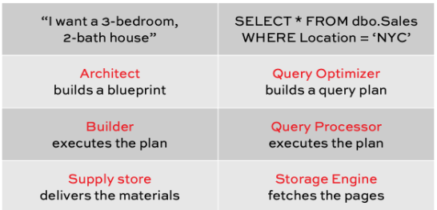

Some notes:
* The more specific you are about your needs the better bluprint you will get
* The architect create the blueprint base on what he knew at the time
* The builder doesn't have the right to tell the architect, "Hey, this plan is makes no sense give my supplies"
* The supply store doesn't know anything about your bluprints

- Trivial Plans
  ```sql
  /* Start with SQL Server's out-of-the-box defaults: */
  EXEC sys.sp_configure N'cost threshold for parallelism', N'5'
  GO
  EXEC sys.sp_configure N'max degree of parallelism', N'0'
  GO
  RECONFIGURE WITH OVERRIDE
  GO

  /* Clear out our indexes, and start with just clustered indexes: */
  USE StackOverflow;
  GO
  EXEC DropIndexes;
  GO
  DBCC FREEPROCCACHE;
  GO
  SET STATISTICS TIME, IO ON;
  GO
  ```  

  - Ask the architect to build a plan
  ```sql
  SELECT TOP 50 *
  FROM dbo.Users
  WHERE Reputation = 2;
  GO
  ```  
  Notes
    - He built the plan fast, less than 1 milliseconds
    - if you check the Optimization Level you can see "TRIVIAL".
      the Query optimizer said, this query is so trivially easy that I don't have to put much wor into building a bluprint

  - Optimization Level
    - Trivial optimization
      - No parallelism
      - No missing index request
      - But TRIVIAL queries are usually so simple it doesn't matter and they are not your biggest bottleneck. However, they can be when:
        - You have a seemingly easy query
        - But isn't run thousands of times per second
        - It really desperately needs an index
        - But SQL Server isn't asking for one
      
        To know hoy many times a query runs execute:
        ```sql
        sp_BlitzCache
          @SortOrder = 'executions'
        ```
    - Full Optimization
      ```sql
      SELECT TOP 50 *
      FROM dbo.Users
      WHERE Reputation = 2
        AND Location = 'San Diego';
      GO
      ```
      This is more selective but the builder will need to scan through more stuff at the store to find them
      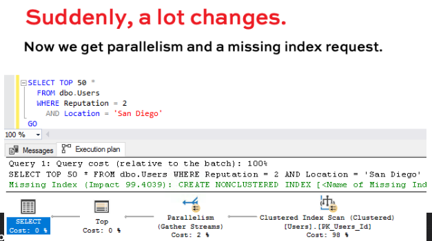

      The architect has lots of tricks
        - Rewriting your join order.
        - Condidering different indexes
        - Using objects you didn't ask for like indexed views, computed columns.
        - Eliminating joins using foreing keys & contraints
        - Rewriting UNION, UNION ALL

      The Architect is just guessing the builder's costs solely for the purpose of designing better blueprints.
      THE COST ISN'T REPORTED BY THE BUILDER.

      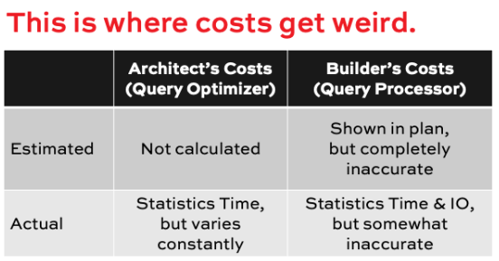


      Full optimization (that isn't really full)
      ```sql
      SELECT u1.* 
      FROM dbo.Users u1
      INNER JOIN dbo.Users u2 ON u2.Id = u1.Id
      WHERE u1.Reputation = -1;
      GO
      ```
      No users match Reputation = -1 so this query will run fast.
      the query polay is simple
      optimization Level is Full
      Reason For Early Termination .... = GOOD ENOUGH PLAN FOUND
      If we change the query and added more JOINs. The architect create the plan quicly but the Reason For Early Termination 
      is a time out. the architect starte to do a full optimization but at some point, it gave up. It ran out of time.

      - Full, but existing early for a good reason
      - Full, but existing early for a bad reason (timeout)
      - Full, after extensive evaluations

      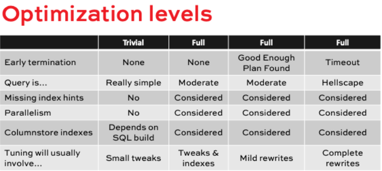

  - Here are the real takeaways
    The architect (the query optimizar) builds a plan
    - Starting with what you ask for
    - Tries a few revisions witht what he knows about the builder and his supply store
    - He can run ot of time
    - He doesn't know how successful the builder was
    - The bluprint keeps getting used, regardless

## When the Architect Gets an Early Estimate Wrong
In fudamentals of Query Tuning, we talked about how if you are unhappy with a query's performance, read the plan from right to left, top to bottom, looking for the place where estimates versus actual went to hell in handbasket. Now, let's dig deeper into how estimates are created, and how they go wrong.

In this session, I'll explain the two kinds of estimates: early estimates driven by your query's filters, and late estimates driven by joins. Then we'll talk through how early estimates go wrong, and how you can fix them.

- Reminder from Fundamentals
When you are unhappy with a query's performance:
  - run the query, get the actual plan
  - Read the plan
  - On each operator, check the ESTIMATED vs ACTUAL rows.
    <r>If they are 10x high or low, find out why, fix it!!</r>

- 2 kinds of estimation
  - <r>EARLY</r>
    - Your query has a filter (WHERE)
    - SQL Server use statistics to guess how many rows match the filter
    - GENERALLY SPEAKING, executed first in the query plan

  - <r>LATE</r>
    - Your query joins to other tables
    - There is no direct filter on those tables
    - GENERALLY SPEAKING, based on dentiy vectors, averages
    - If early estimates are wrong, these are screwed

  ```sql
  USE [StackOverflow]
  GO
  SET STATISTICS IO ON;
  GO
  /* Set up indexes before class */
  IF NOT EXISTS(SELECT * FROM sys.indexes WHERE object_id = OBJECT_ID('dbo.Users') AND name = 'Location_DisplayName')
    CREATE INDEX Location_DisplayName ON dbo.Users(Location, DisplayName);a
  IF EXISTS(SELECT * FROM sys.indexes WHERE object_id = OBJECT_ID('dbo.Posts') AND name = 'IX_OwnerUserId')
    EXEC sp_rename N'dbo.Posts.IX_OwnerUserId', N'OwnerUserId', 'INDEX';
  IF NOT EXISTS(SELECT * FROM sys.indexes WHERE object_id = OBJECT_ID('dbo.Posts') AND name = 'OwnerUserId')
    CREATE INDEX OwnerUserId ON dbo.Posts(OwnerUserId);
  IF EXISTS(SELECT * FROM sys.indexes WHERE object_id = OBJECT_ID('dbo.Posts') AND name = '_dta_index_Posts_5_85575343__K8')
    EXEC sp_rename N'dbo.Posts._dta_index_Posts_5_85575343__K8', N'CreationDate', 'INDEX';
  IF NOT EXISTS(SELECT * FROM sys.indexes WHERE object_id = OBJECT_ID('dbo.Posts') AND name = 'CreationDate')
    CREATE INDEX CreationDate ON dbo.Posts(CreationDate);
  GO

  /* Turn on actual execution plans: */
  CREATE OR ALTER PROC dbo.usp_SearchPostsByLocation 
    @Location VARCHAR(100) AS

    /* Find the most recent posts from an area */
    SELECT TOP 200 u.DisplayName, p.Title, p.Id, p.CreationDate
      FROM dbo.Users u
      INNER JOIN dbo.Posts p ON u.Id = p.OwnerUserId -- THIS IS THE LATE 
      WHERE u.Location = @Location  -- THIS IS THE EARLY
      ORDER BY p.CreationDate DESC;
  GO
  ```

- Digging into a query

```sql
USE [StackOverflow]
GO
  /* Find the most recent posts from an area */
SELECT TOP 200 u.DisplayName, p.Title, p.Id, p.CreationDate
FROM dbo.Users u
INNER JOIN dbo.Posts p ON u.Id = p.OwnerUserId -- THIS IS THE LATE 
WHERE u.Location = @Location  -- THIS IS THE EARLY
ORDER BY p.CreationDate DESC;
GO
```
This query has just two estimations:
 - Early: how many users will match?
 - Late : how many posts did the users write?
 
```sql
/* Let's try one that is PRETTY GOOD */
DBCC FREEPROCCACHE;
EXEC dbo.usp_SearchPostsByLocation N'Near Stonehenge'
GO

/* See what we're working with: */
DBCC SHOW_STATISTICS('dbo.Users', 'Location_DisplayName');
GO
```

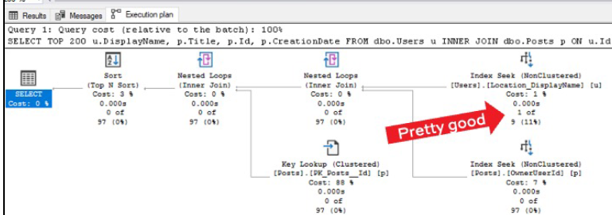

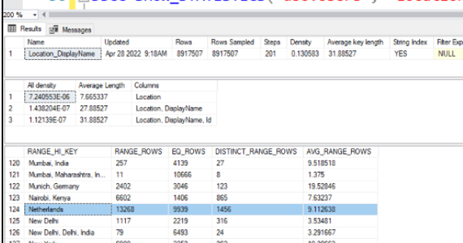

Bucket #124: Location > 'Nairobi' and <= 'Netherlands' so Near Stonehenge is in this bucket

RANGE_ROWS = tere are 13,268 rows in this bucket

DISTINCT_RANGE_ROWS =  there are 1,456 unique Locations in this bucket

AVG_RANGE_ROWS = for any given Location in this range, theree are 9.112639 users with that location

But what happends if your query is obfuscated ....

```sql
/* Obfuscate the filter: */
CREATE OR ALTER PROC dbo.usp_SearchPostsByLocation 
	@Location VARCHAR(100) AS

	/* Find the most recent posts from an area */
	SELECT TOP 200 u.DisplayName, p.Title, p.Id, p.CreationDate
	  FROM dbo.Users u
	  INNER JOIN dbo.Posts p ON u.Id = p.OwnerUserId
	  WHERE u.Location = UPPER(LTRIM(RTRIM(@Location)))
	  ORDER BY p.CreationDate DESC;
GO

DBCC FREEPROCCACHE;
EXEC dbo.usp_SearchPostsByLocation N'Near Stonehenge'
GO

/* That estimate comes from the density vector: */
DBCC SHOW_STATISTICS('dbo.Users', 'Location_DisplayName');
GO
SELECT 7.240553E-06 * 8917507
GO
```

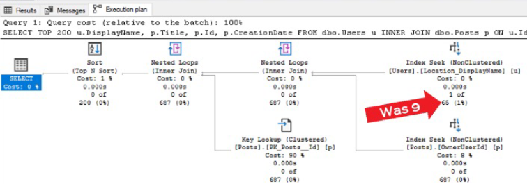

- Early estimation error sources (in order)
  - WHERE clause that isn't easy to understand
    - Keep the WHERE clause simple
      - Try no use System functions(string, math, etc)
      - Try no use User-defined functions(scalar, TVFs)
      - fetching data from configuration tables

  - Data size grew to the point where 201 buckets wasn't enough
    ```sql
    /* Go back to the "good" WHERE clause: */
    CREATE OR ALTER PROC dbo.usp_SearchPostsByLocation 
      @Location VARCHAR(100) AS

      /* Find the most recent posts from an area */
      SELECT TOP 200 u.DisplayName, p.Title, p.Id, p.CreationDate
        FROM dbo.Users u
        INNER JOIN dbo.Posts p ON u.Id = p.OwnerUserId
        WHERE u.Location = @Location
        ORDER BY p.CreationDate DESC;
    GO

    /* Try a slightly larger location: */
    DBCC FREEPROCCACHE;
    EXEC dbo.usp_SearchPostsByLocation N'Nepal'
    GO

    /* Explain off-histogram steps */
    DBCC SHOW_STATISTICS('dbo.Users', 'Location_DisplayName')
    GO
    ```
    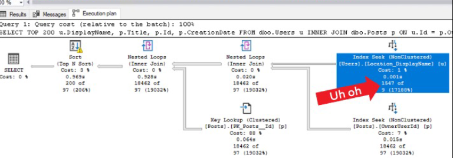

    Nepal is > Nairobi and < Netherlands
    Nepal is in the same bucket as near Stonehenge
    Nepal is not big enough to get its own bucket
    It gets the 9.112638 AVG_RANGE_ROW estimate

    <r>How can we fix this? WE CAN'T</r>
    OPTION RECOMPILE, is not going to solve this
    Update statistics, changing sampling rates, is not going to solve this
    Filtered statistics on Nepal, is not going to solve this
    Changing compatibility levels, is not going to solve this

    <r>Can't we get more buckets on SQL. Yes we can on PostgreSQL / Oracle</r>

  - Statistics done with really low sampling rates
    When we create the IX the SQL has to read the entire table so it read the 100% sampling.
    But if whe update stats later the sql use a sampli of 2% of the table. This is a dandom number.
    This is not better or worse just different. Some time for some queries the 100% sample is better for others the 2% can be better, etc

    - How to tell in our query's case this happend:
      - Check the number of rows that the histogram would show as the estimate
      - Check the number of rows that actually exist
      - <r>If Rows Sample is less than, say 10% of Rows consider updateing statistics with fullscan</r>
      - Check the plan again to see if the estaimate is now right

    <r>You can persist sample rates using PERSIST_SAMPLE_PERCENT = ON</r>

  - Statistics out of dates
    SQL Server automatically updates stats when avouabout 20% of the data in the table changes.
    
    Example of when this actually hurt:
      - Small configuration table with a list of 1,000 stores (columns Id, ConuntryCode, StoreName)
      - Company grew, added 100 stores in a new country
      - Stats weren't updated: it was a tiny table and 100 rows wasn't a big percentage of 1,000 rows
      - But WHERE CountryCode = 'NewCountry' ran SQL Server only estimated 1 row was there

    To fix this use Ola H. maintenance solution in a regular way.

<r>I WOULD LIKE TO EXECUTE THE QUERY YSING INDA TO SEE HOW THE EXECUTION PLAN CHANGE AND THE SQL EXECUTE FIRST THE dbo.Post SELECT</r>

```sql
/* That estimate comes from the density vector: */
DBCC FREEPROCCACHE;
EXEC dbo.usp_SearchPostsByLocation N'India'
GO
```

## RECAP
  - Early estimates
    - Your query has a filter ()WHERE
    - SQL Server uses statistics to guess how many rows will match the filter
    - Usually driven by the WHERE clause
    - Usually based on statistics on tables
    - Usually executed first in the query plan
  - Early estimation error sources (in order):
    - WHERE clause that isn't easy to understand
    - Outlier filter values hit the 201 buckets problem
    - Statisitcs done with really low sampling rates
    - Statisitcs our of date


## When the Architect Gets a Later Estimate Wrong

```sql
USE [StackOverflow]
GO
SET STATISTICS IO ON;
GO
/* Set up indexes before class */
IF NOT EXISTS(SELECT * FROM sys.indexes WHERE object_id = OBJECT_ID('dbo.Users') AND name = 'Location_DisplayName')
	CREATE INDEX Location_DisplayName ON dbo.Users(Location, DisplayName);a
IF EXISTS(SELECT * FROM sys.indexes WHERE object_id = OBJECT_ID('dbo.Posts') AND name = 'IX_OwnerUserId')
	EXEC sp_rename N'dbo.Posts.IX_OwnerUserId', N'OwnerUserId', 'INDEX';
IF NOT EXISTS(SELECT * FROM sys.indexes WHERE object_id = OBJECT_ID('dbo.Posts') AND name = 'OwnerUserId')
	CREATE INDEX OwnerUserId ON dbo.Posts(OwnerUserId);
IF EXISTS(SELECT * FROM sys.indexes WHERE object_id = OBJECT_ID('dbo.Posts') AND name = '_dta_index_Posts_5_85575343__K8')
	EXEC sp_rename N'dbo.Posts._dta_index_Posts_5_85575343__K8', N'CreationDate', 'INDEX';
IF NOT EXISTS(SELECT * FROM sys.indexes WHERE object_id = OBJECT_ID('dbo.Posts') AND name = 'CreationDate')
	CREATE INDEX CreationDate ON dbo.Posts(CreationDate);
GO

/* Turn on actual execution plans: */
CREATE OR ALTER PROC dbo.usp_SearchPostsByLocation 
	@Location VARCHAR(100) AS

	/* Find the most recent posts from an area */
	SELECT TOP 200 u.DisplayName, p.Title, p.Id, p.CreationDate
	  FROM dbo.Users u
	  INNER JOIN dbo.Posts p ON u.Id = p.OwnerUserId
	  WHERE u.Location = @Location
	  ORDER BY p.CreationDate DESC;
GO
```  

```sql
/* Make sure we don't have the 2% stats
from the last module: */
UPDATE STATISTICS dbo.Users WITH FULLSCAN;

/* Go back to Stonehenge: */
DBCC FREEPROCCACHE;
EXEC dbo.usp_SearchPostsByLocation N'Near Stonehenge'
GO
/* SQL Server is estimating a fixed number of rows
will return per Posts index seek. */
```  
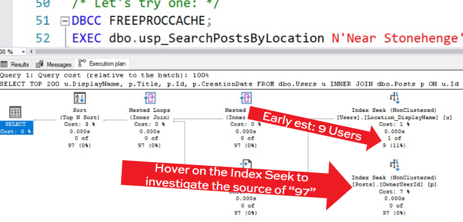

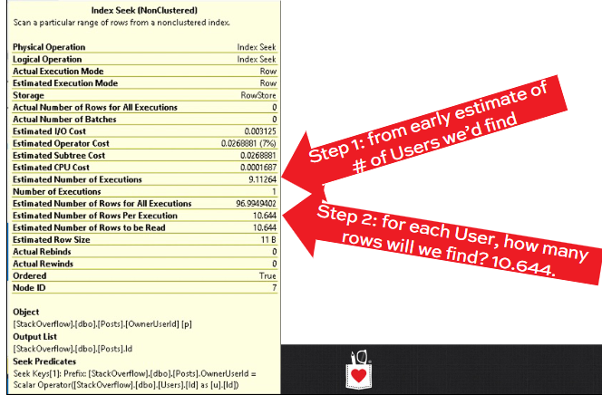

1 User = 10.644 Posts
  - That is an AVG
  - SQL doesn't know which users live in which locations
  - It'sjust making one guess for any location
  - To prove it, let's try another location in another stats bucket

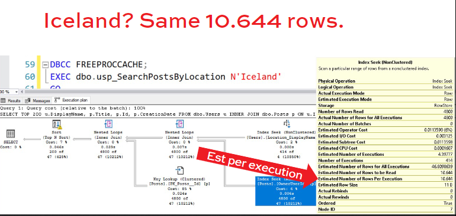

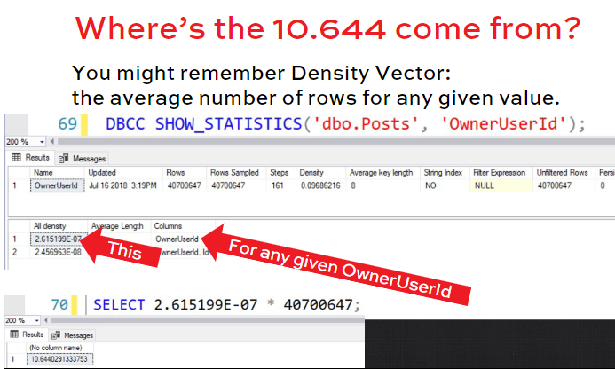

```sql
/* Is the estimate tied to one location?
What if we try a different location? */
DBCC FREEPROCCACHE;
EXEC dbo.usp_SearchPostsByLocation N'Iceland'
GO

/* Where's that estimate coming from? */
DBCC SHOW_STATISTICS('dbo.Posts', 'OwnerUserId');
SELECT 2.615199E-07 * 40700647;
```

- How late estimates go wrong
  - SQL Server makes a bad early estimate, OR
  - The early estimate is accurate, but Posts has outliers:
    - Not a lot of people live Near Stonehenge, but they write a LOT of Posts
    - Or a whole lot of people live Near Stonhenge but they hardly write any Posts ar all

```sql
/* Look for outliers where few people live,
but they write a whole lot of Posts: */
SELECT TOP 100 u.Location, 
	(SUM(1) / COUNT(DISTINCT u.Id)) AS PostsPerUser,
	COUNT(DISTINCT u.Id) AS Residents, SUM(1) AS TotalPosts
FROM dbo.Users u
INNER JOIN dbo.Posts p ON u.Id = p.OwnerUserId
GROUP BY u.Location
ORDER BY (SUM(1) / COUNT(DISTINCT u.Id)) DESC;
```

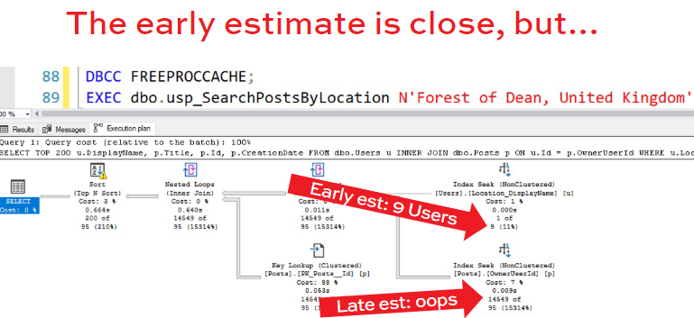

- And we can’t fix that.
  There are 2 phases to querying:
    - The architect (query optimizer) designs a query plan, then
    - The builder (query processor) executes the plan 
 
  By the time we start executing, it’s too late: we can’t fix later estimates.

The problem we’re up against
Early estimation error sources:
  1. WHERE clause obfuscation
  2. 201 bucket problem
  3. Statistics with low sampling rates
  4. Statistics out of date
Late estimation error sources:
  1. Early estimation errors
  2. Outlier values during joins

We have two options
  - Either fix the root cause of the bad estimate (the right way, but can be hard, time-consuming) OR 
  - Mitigate the effects:
    - Break the query up into two parts, and go back to the architect (query optimizer) after the first part is done, so it knows how many rows are really involved And very often, the second one is easier.

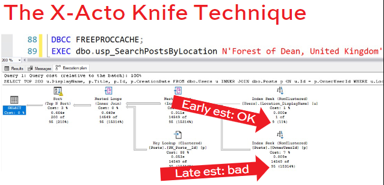

- The X-Acto Knife Technique
  - Read the plan right to left, top to bottom
  - Find the place where estimates vs actual suddenly went >10X high or >10X low
  - Break the query up into two parts:
    - Phase 1 runs, insert into temp table
    - Phase 2 runs, SQL Server builds stats on the temp table, understands how many rows came out of Phase 1

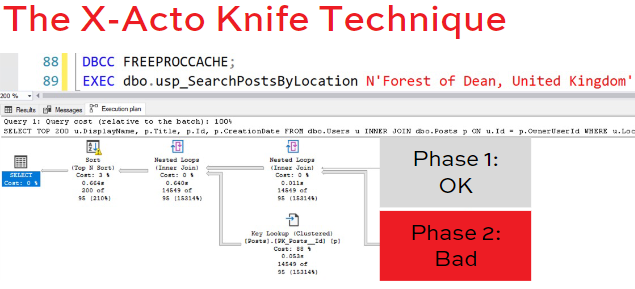

```sql
/* New hotness: */
CREATE OR ALTER PROC dbo.usp_SearchPostsByLocation 
	@Location VARCHAR(100) AS
BEGIN
	SELECT Id, DisplayName
		INTO #Users
		FROM dbo.Users
		WHERE Location = @Location;

	SELECT TOP 200 u.DisplayName, p.Title, p.Id, p.CreationDate
	  FROM #Users u
	  INNER JOIN dbo.Posts p ON u.Id = p.OwnerUserId
	  ORDER BY p.CreationDate;
END
GO

DBCC FREEPROCCACHE;
EXEC dbo.usp_SearchPostsByLocation N'Forest of Dean, United Kingdom'
GO
```

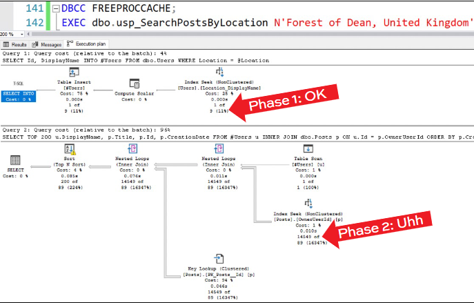

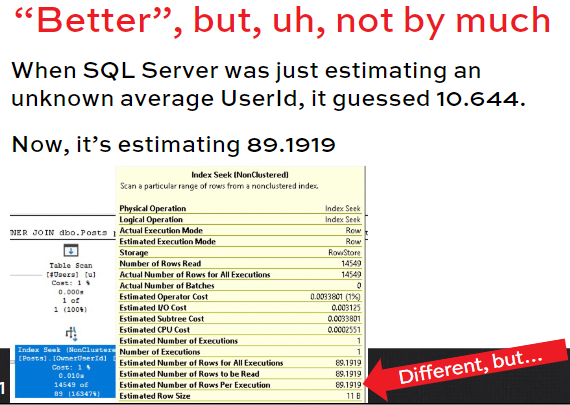

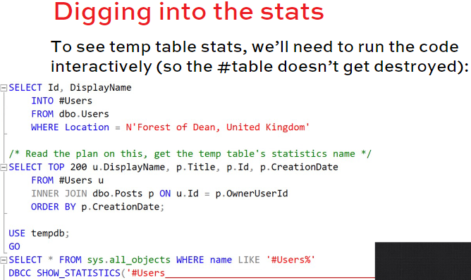

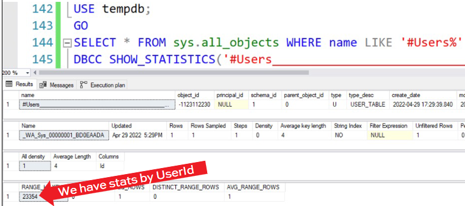

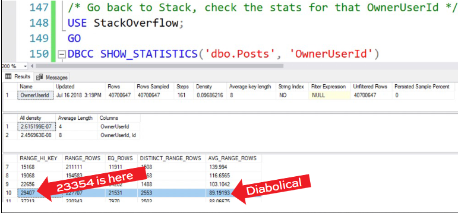

- Fix one problem, find another
  Problem #1: SQL Server didn’t know that a prolific user lived in Forest of Dean
  Problem #2: even when SQL Server knew the UserId, that Id still didn’t have his own bucket, so we hit the 201 buckets problem


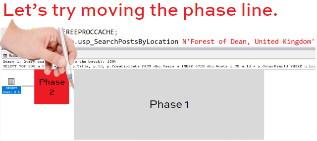

```sql
/* New line: */
CREATE OR ALTER PROC dbo.usp_SearchPostsByLocation 
	@Location VARCHAR(100) AS
BEGIN
	SELECT u.DisplayName, p.Title, p.Id, p.CreationDate
	  INTO #RowsIWant
	  FROM dbo.Users u
	  INNER JOIN dbo.Posts p ON u.Id = p.OwnerUserId
	  WHERE u.Location = @Location;

	SELECT TOP 200 DisplayName, Title, Id, CreationDate
	FROM #RowsIWant
	ORDER BY CreationDate DESC;
END
GO

DBCC FREEPROCCACHE;
EXEC dbo.usp_SearchPostsByLocation N'Forest of Dean, United Kingdom'
GO
```

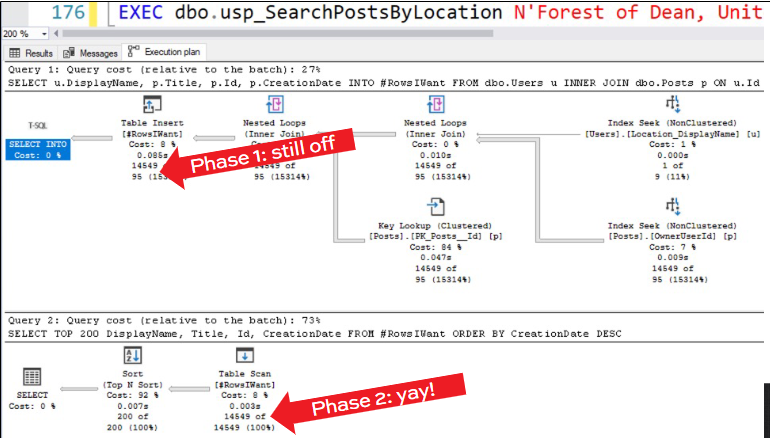


- Here, this is overkill
This query ran in under a second anyway.
The idea is to teach you the techniques quickly.
Ideally, best to worst:
  1. Get the early estimates right
  2. You’ll only be left with later estimate issues
  3. Mitigate those with the X-Acto knife technique
  4. Even when you do that, you can still hit edge case issues like the 201 buckets problem

- There’s a catch.
  - Temp tables are reused across sessions.
  - You can inherit someone else’s stats, even if you drop the temp tables.
  - Learn more in the temp tables module in Fundamentals of TempDB.
  - For now, think of this technique as OPTION (RANDOM RECOMPILE)


- Mini-Module: When the Architect Gets Everything Right, But It’s Still Slow
“My estimates are all close!” 3 possible fixes:
  - Add or tune indexes so there’s less work to do (we cover that in Mastering Index Tuning)
  - Reorder operations in the query
  - Add hardware (we cover that in Mastering Server Tuning)


```sql
CREATE OR ALTER PROC fbo.usp_TopVotersInCity @location NVARCHAR(40) AS
BEGIN
  SELECT UserId, COUNT(*) AS TotalVotes
    INTO #TopVoters
  FROM dbo.Votes v -- Scan all the votes
  GROUP BY v.UserId
  ORDER BY COUNT(*) DESC;

  SELECT TOP 100 tv.TotalVotes, u.DisplayName, u.Location
  FROM #TopVoters
  INNER JOIN dbo.Users u ON tv.UserId - u.Id
  WHERE u.Location - @Location -- Do some filtering
  ORDER BY u.DisplayName
END
```

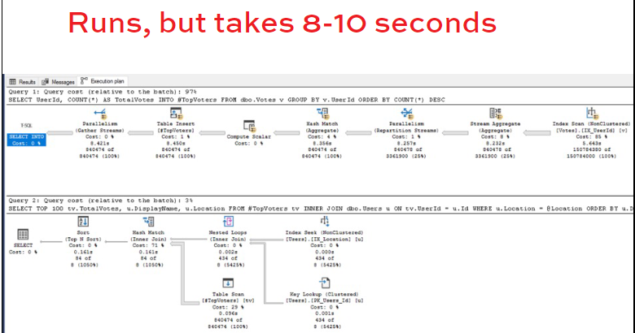

<r>IF THE ESTIMATES ARE PRETTU CLOSE ... TRY CAMPING THE PARTS TOGETHER</r>

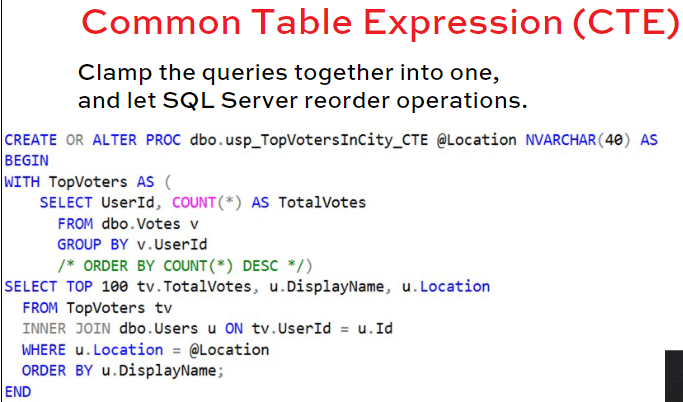

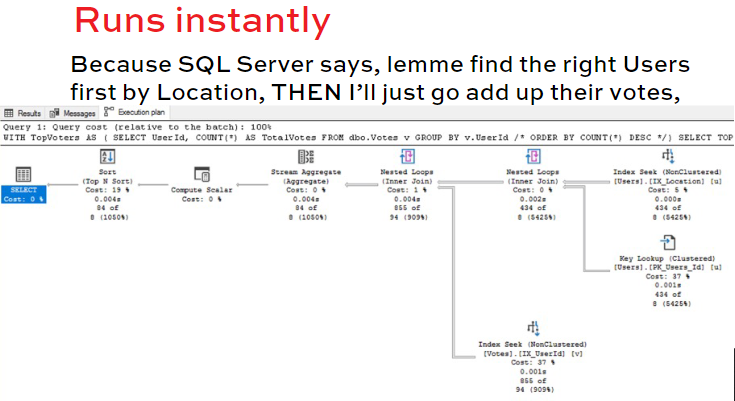

- CTEs are great when...
  - You have a long query to tune (like a proc)
  - You’re not sure which parts should be done first
  - When the row estimates for each query look fine

Change temp tables & child procs into CTEs, let SQL Server reorder the processing, and see if it goes faster.

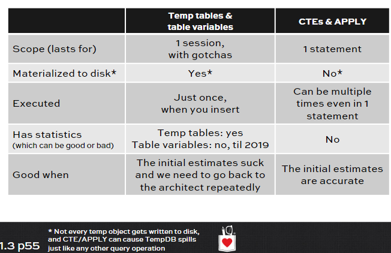

# LAB 1
-  Restart SQL Server
-  Restore the StackOverflow db
-  Copy and run the setup script for this lab from BrentOzar.com/go.querylab1

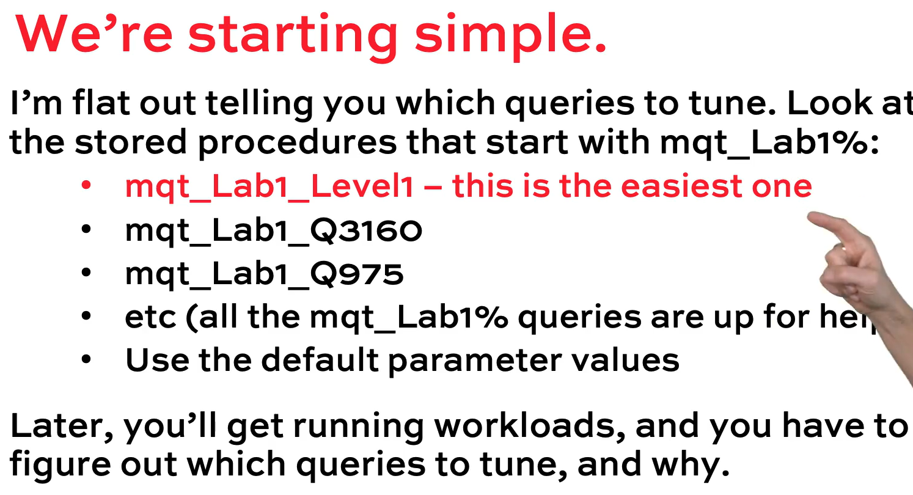

- Anti-patterns for this lab
These queries have cardinality estimation issues. It’s not just from joins this time – there are a large number of different things that can affect the quality of SQL Server’s cardinality estimation. In some cases, they affect performance. (A lot.)

- Your assignment
Improve the cardinality estimation.
It’s tempting to jump in and say, “I’ll just index everything and make the queries faster.” And indexes are (usually) a good answer.
But here, before you add indexes, understand the problem you’re working on.

- It’s hard to see a finish line.
In the real world, users never say, “Get this query to have 500 logical reads or less, and perform in 50ms or less.”
However, they do ask for faster/better. Here, though, we’re focusing on better cardinality estimation.

- How I’d budget these 2 hours
5  minutes – poke around: read a few of the mqt_Lab1% procs, pick the first one you want to focus on tuning.
25 minutes – tune 1 query: run it, get the actual plan (if possible), change the query/indexes/stats, get the new actual plan (if possible), paste it at PasteThePlan.com. Turn in your homework in Slack.
Repeat, tackling one other query, 1 hour total. (Don’t spend 60 minutes on one query – tackle others.)
60 minutes – lunch.

# LAB 1 My solution

- Anti-patterns for this lab

  - [dbo].[mqt_Lab1_Q3160]
    ```sql
    /* NOTES 

      - COMPATIBILITY LEVEL 140
      - [dbo].[mqt_Lab1_Q3160] is a PROC to get the comparition between your and Jons answer. If your score is greather than Jobs you win if not you lose or tie.
      - [dbo].[mqt_Lab1_Q466] most controvertial post in the site
      - [dbo].[mqt_Lab1_Q975] Users with more than one duplicate account and a more that 1000 reputation in aggregate. A list of users that have duplicate accounts 
                  on site, based on the EmailHash and lots of reputation is riding on it
      - dbo.mqt_Lab1_Report_UsersByQuestion_ByDisplayName
      - [dbo].[mqt_Lab1_Level1] newer users with more reputation than me 
    */

    SET STATISTICS IO, TIME ON

    SELECT TOP 20 OwnerUserId, COUNT(*)
    FROM dbo.Posts
    GROUP BY OwnerUserId
    ORDER BY COUNT(*) DESC

    0		    403093
    1144035	45150
    22656	  34202
    29407	  21531
    548225	21179
    115145	20694
    6309	  19461
    100297	18553
    19068	  17943
    1491895	17934


    /* SP [dbo].[mqt_Lab1_Q3160] @UserId INT = 26837 */
    EXEC [dbo].[mqt_Lab1_Q3160] 26837
        /* Analysis
        Result		   = 1 Row
        Execution Time = 7 min 44 sec
                CPU time =  4764 ms,  elapsed time =  12816 ms
                CPU time = 39232 ms,  elapsed time = 451320 ms.
                CPU time = 43996 ms,  elapsed time = 464137 ms.
        Execution IO   = Table 'Posts'. Scan count 34, logical reads 22468718, physical reads 14 (read-ahead reads 22177738).
        General 
          Run in Paralel --> This is Okay
          Missing Index  --> Post(OwnerUserId) INCLUDE(ParentId, Score)
          Estimation	   --> Are okay for all but not on the [Merge Join] stimate 1 of 618.678
        Table dbo.Posts
          - Doesn't have Indexes only the PK */
    ```
      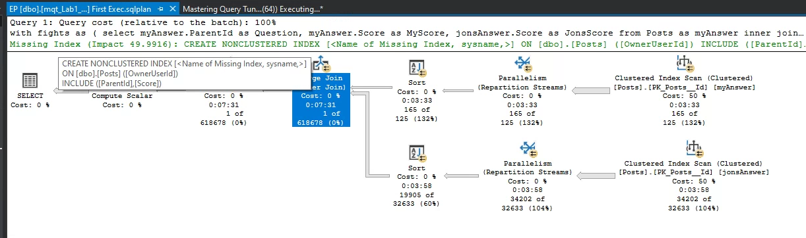


    ```sql
    EXEC [dbo].[mqt_Lab1_Q3160] 1144035

        /* Analysis
        Result		   = 1 Row
        Execution Time = 7 min 0 sec
          CPU time = 38343 ms,  elapsed time = 427578 ms.
          CPU time = 38358 ms,  elapsed time = 427582 ms.
        Execution IO   = Table 'Posts'. Scan count 34, logical reads 22468718, physical reads 14 (read-ahead reads 22177738).
                        Table 'Posts'. Scan count 34, logical reads 22469320, physical reads 2  (read-ahead reads 22328171)
        General 
          Run in Paralel --> This is Okay
          Missing Index  --> Post(OwnerUserId) INCLUDE(ParentId, Score)
          Estimation	   --> Are okay for all but not on the [Merge Join] stimate 1 of 618.678
        Table dbo.Posts
          - Doesn't have Indexes only the PK	*/
    ```
    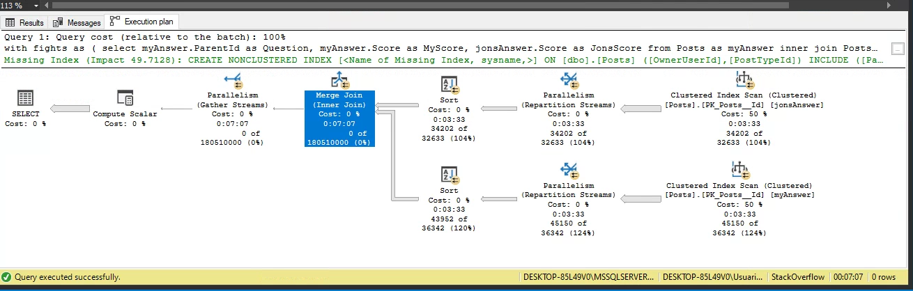

    Questions
      - Why the Merge Join estimate only 1 of 618.678
        If I check the statistics I can see that for value 26837 there isn't a bucket. It's between 781 and 232689 RANGE
        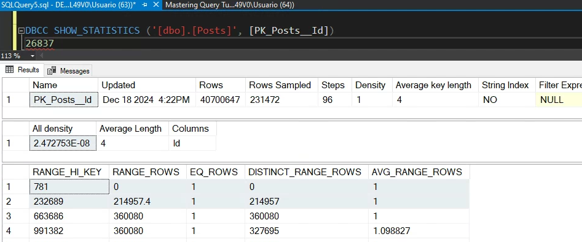

        It's the same for value 1144035

    Solution for [dbo].[mqt_Lab1_Q3160]
      - Create index
      ```sql
        CREATE INDEX ix_OwnerUserId_PostTypeId_ParentId
          ON dbo.Posts (OwnerUserId, PostTypeId, ParentId)
      ```
  - [dbo].[mqt_Lab1_Q466]
    ```sql
    SET STATISTICS IO, TIME ON
    EXEC [dbo].[mqt_Lab1_Q466]
        /* Analysis
        Result		   = 100 Row
        Execution Time = 26 min
              CPU time = 2391 ms, elapsed time = 2391 ms.
        Execution IO   = Table '#BC81E2F2'. Scan count 0, logical reads 28925523.
                         Table 'Votes'. Scan count 1, logical reads 694245, physical reads 4, read-ahead reads 694108.
              CPU time = 111797 ms,  elapsed time = 232624 ms.
                         Table 'Posts'. Scan count 0, logical reads 24905608, physical reads 5438752.
                         Table '#BC81E2F2'. Scan count 1, logical reads 74937, physical reads 5352, read-ahead reads 39128.
              CPU time =  54297 ms, elapsed time = 1328142 ms.
              CPU time = 169779 ms, elapsed time = 1563158 ms.
 
        General 
        */
    ```
    Questions
      - On the first part of the query: 
        - Why the Merge Join estimate only 1.3 millon of 28 mill

      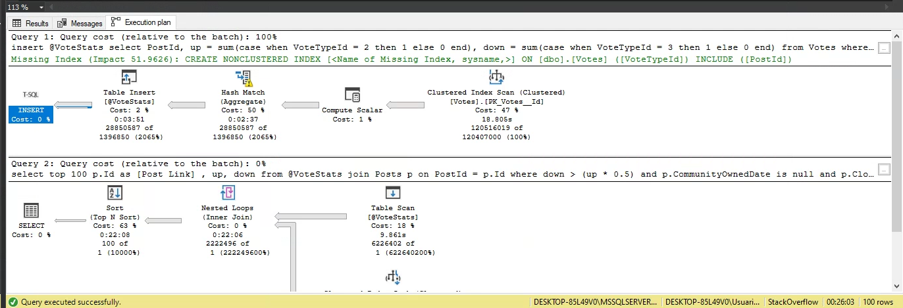

      - On the second part of the query:
        - The variable table brougth 6.2 million but estimate only 1
        - And the Clustred Index Seek on dbo.Posts brogth 2.2 million but estimate only 1
  
      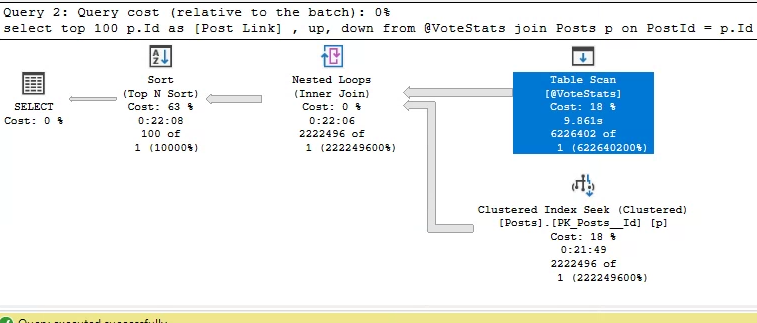

    Test
      - Add PK on PostId on @VotesStats table
      Execution time 17 min
      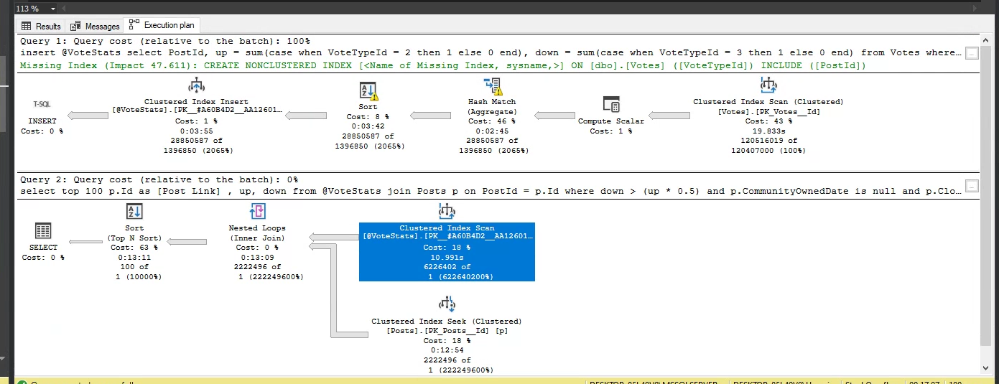

      - Convert @varTable to CTE table
      Exeuction time 2 min 25 sec
      Table 'Votes'. Scan count 17, logical reads 696779, physical reads 22, page server reads 0, read-ahead reads 693692
      Table 'Posts'. Scan count 0, logical reads 1788, physical reads 864.  
      SQL Server Execution Times: CPU time = 172034 ms,  elapsed time = 144936 ms.

      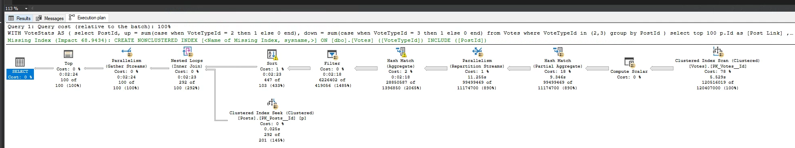

      - Create a new index on dbo.Votes
      ```sql
      CREATE INDEX ix_VoteTypeId_INCLUDE
        ON dbo.Votes(VoteTypeId)
        INCLUDE(PostId)
      ```
      CPU time = 0 ms, elapsed time = 3 ms.
      Table 'Votes'. Scan count 20, logical reads 270720, physical reads 604, read-ahead reads 42515.
      Table 'Posts'. Scan count 0, logical reads 1796, physical reads 15.
        SQL Server Execution Times: CPU time = 165128 ms,  elapsed time = 143960 ms.
        SQL Server Execution Times: CPU time = 165128 ms,  elapsed time = 143964 ms.

      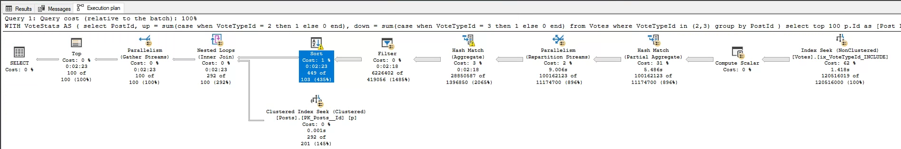

    Solution for [dbo].[mqt_Lab1_Q466]
      - Convert @varTable to CTE table
      - Create a new index on dbo.Votes
  - EXEC [mqt_Lab1_Q975]
    ```sql
    SET STATISTICS IO, TIME ON
    EXEC [dbo].[mqt_Lab1_Q975]
        /* Analysis
        Result		   = 0 Row
        Execution Time = 3 sec
              CPU time = 218 ms, elapsed time = 622 ms.
        Execution IO   = Table 'Users'. Scan count 34, logical reads 286338, physical reads 1, read-ahead reads 141465
 
        General 
        */
    ```

    Questions
      - I think that the problem is:
      the EmailHash column has all values as NULL

    Test
      - 

    Solution for [dbo].[mqt_Lab1_Q975]
    Create a Constraint to check the value?
  
  - EXEC [mqt_Lab1_Level1]

# LAB 1 Brent solution
```sql
/* EXEC [mqt_Lab1_Level1] */

/*
 The you part is bad on the SELECT
 The me part is okay
*/

/*
Solution 1 TEMPDB
  if you are going to have only 1 row is not good to have a temp table
*/
CREATE TABLE #MyInfo(CreationDate DATETIME, Reputation INT)
INSERT INTO  #MyInfo(CreationDate, Reputation)
SELECT CreationDate, reputation
FROM   dbo.Users me
WHERE Id = @UserId

SELECT u.Id as [User Link], u.Reputation, u.Reputation - me.reputation as Difference
FROM #MyInfo me
JOIN dbo.Uesrs u
ON  u.CreationDate > me.CreationDate
AND u.Reputation > me.Reputation


/*
Solution 2 Use Variables
*/
DECLARE @CreationDate DATETIME, @Reputation INT
SELECT @CreationDate = CreationDate, @Reputation = Reputation
FROM   dbo.Users me
WHERE Id = @UserId

SELECT u.Id as [User Link], u.Reputation, u.Reputation - @Reputation as Difference
FROM dbo.Uesrs u
ON  u.CreationDate > @CreationDate
AND u.Reputation   > @Reputation

/*
Solution 3 Use Variables + OPTION(RECOMPILE)
  Run with dif values
*/
DECLARE @CreationDate DATETIME, @Reputation INT
SELECT @CreationDate = CreationDate, @Reputation = Reputation
FROM   dbo.Users me
WHERE Id = @UserId

SELECT u.Id as [User Link], u.Reputation, u.Reputation - @Reputation as Difference
FROM dbo.Uesrs u
ON  u.CreationDate > @CreationDate
AND u.Reputation   > @Reputation
OPTION(RECOMPILE)

/*
Solution 4 Split the PROC in two
  We have parameter sniffing
*/
CREATE OR ALTER PROC dbo.mqt_Lab1_Level1_Child @UserId INT = 26837
AS
BEGIN
  DECLARE @CreationDate DATETIME, @Reputation INT

  SELECT @CreationDate = CreationDate, @Reputation = Reputation
  FROM   dbo.Users me
  WHERE  Id = @UserId

  EXEC ProcTwo @CreationDate = @CreationDate, @Reputation = @Reputation
END
GO

CREATE OR ALTER PROC dbo.ProcTwo  DECLARE @CreationDate DATETIME, @Reputation INT 
AS
BEGIN
  SELECT u.Id as [User Link], u.Reputation, u.Reputation - @Reputation as Difference
  FROM dbo.Uesrs u
  ON  u.CreationDate > @CreationDate
  AND u.Reputation   > @Reputation
END
GO

/*
Solution 5 Dinamy query
  We have parameter sniffing
*/
CREATE OR ALTER PROC dbo.mqt_Lab1_Level1_Child @UserId INT = 26837
AS
BEGIN
  DECLARE @CreationDate DATETIME, @Reputation INT

  SELECT @CreationDate = CreationDate, @Reputation = Reputation
  FROM   dbo.Users me
  WHERE  Id = @UserId

  
  DECLARE @Query NVARCHAR(4000) = N'
  SELECT u.Id as [User Link], u.Reputation, u.Reputation - @Reputation as Difference
  FROM dbo.Uesrs u
  ON  u.CreationDate > @CreationDate
  AND u.Reputation   > @Reputation'

  EXEC sp_executesql @Query, '@CreationDate DATETIME, @Reputation INT', @creationdate, @Reputation
END
GO

```

```sql
/* EXEC [mqt_Lab1_qt975] */

/*
Check 
  SQL Server knows that there aren't rows different to NULL. So why he show that is going to return 1 row?
  Because SQL Server is optimistic. He thinks that if you query something is because something is there!! 
*/
DBCC SHOW_STATISTICS('dbo.Users', EmailHash)

/*
Solution 1 
*/
IF EXISTS (SELECT TOP 1 * FROM dbo.Users WHERE EmailHash IS NOT NULL)
  .... all the query

/*
Solution 2 TEMP TABLE
*/

/*
Solution 3 CHECK CONSTRAINT
*/
ALTER TABLE dbo.Users
  ADD CONSTRAINT EmailHashAlwaysNull
  CHECK(EmailHash IS NULL)

```

