# Brent Ozar Course Notes
<style>
r { color: red }
o { color: Orange }
g { color: Green }
lg { color: lightgreen }
b { color: Blue }
lb { color: lightblue }
</style>

```sql
```  

* Initial Training Page
  
  https://training.brentozar.com/courses/

---

# 1. Mastering Parameter Sniffing

* Index
  - [Reducing the Stench of Sniffing Problems](#Reducing-the-Stench-of-Sniffing-Problems)  
    - [With Index Tuning](#With-Index-Tuning)
      - [Index Seek + Key Lookup one table](#Index-Seek-+-Key-Lookup-one-table)
      - [2 Indexes](#2-Indexes)
      - [RECAP](#RECAP)
    - [With Query Tuning](#With-Query-Tuning)
      - [RECAP](#RECAP)
    - [With Recompile Hints](#With-Recompile-Hints)
      - [RECAP](#RECAP)
    - [Lab 1](#LAB-1)
      - [Task #1](#Task-#-1)
      - [Task #2](#Task-#-2)
      - [Task #3](#Task-#-3) 
    - [Bad Branching Causes Sniffing, Good Branching Reduces It](#Bad-Branching-Causes-Sniffing-,-Good-Branching-Reduces-It)
      - [Bad Branching Causes Sniffing, Good Branching Reduces It](Bad-Branching-Causes-Sniffing-,-Good-Branching-Reduces-It)
      - [RECAP](#RECAP)
      - [My RECAP](#My#RECAP)
    - [Lab 2](#LAB-2)
      - [My Solution](#My-Solution)
      - [Brent Solution](#Brent-Solution)
    - [Spotting Variable Plans in the Cache](#Spotting-Variable-Plans-in-the-Cache)
    - [Lower-Impact Query Store: usp_PlanCacheAutopilot](#Lower-Impact-Query-Store-:-usp_PlanCacheAutopilot)
    - [Higher-Impact: Query Store](#Higher-Impact-:-Query-Store)
    - [LAB 3](#LAB-3)
      - [Lab 3 Setup: Track Down Sniffing in Plan Cache History](#Lab-3-Setup-:-Track-Down-Sniffing-in-Plan-Cache-History)
      - [My Solution](#My-Solution)
      - [Brent Solution](#Brent-Solution)
    - [Memory Grant Feedback](#Memory-Grant-Feedback)
    - [Adaptive Joins](#Adaptive-Joins)
    - [Automatic Tuning, aka Automatic Plan Regression](#Automatic-Tuning-,-aka-Automatic-Plan-Regression)
    - [LAB 4](#LAB-4)
      - [My Solution](#My-Solution)
      - [Brent Solution](#Brent-Solution)

---

# With Index Tuning

By far, the single biggest causes of parameter sniffing is when SQL Server has to:

  - Choose between an index seek + key lookup versus a table scan, or
  - Choose between two different indexes on the same table, or
  - Choose which table to process first in a join

## Index Seek + Key Lookup one table
Let’s see which ones we can reduce with index expansion and tuning.

```sql
/**********************************************************************************************
Mastering Parameter Sniffing
1.1 How Index Tuning Reduces the Stench
**********************************************************************************************/
RAISERROR(N'Oops! No, don''t just hit F5. Run these demos one at a time.', 20, 1) WITH LOG;
GO

/* Set the stage with the right server options & database config. We'll be 
doing this repeatedly for a few modules, and this script should be idempotent. */
USE StackOverflow;
GO
EXEC DropIndexes @TableName = 'Users', @ExceptIndexNames = 'Location';
EXEC DropIndexes @TableName = 'Posts', @ExceptIndexNames = 'CreationDate,_dta_index_Posts_5_85575343__K8,IX_OwnerUserId,OwnerUserId';
GO
IF NOT EXISTS(SELECT * FROM sys.indexes WHERE object_id = OBJECT_ID('dbo.Users') AND name = 'Location')
	CREATE INDEX Location ON dbo.Users(Location);
GO
IF EXISTS(SELECT * FROM sys.indexes WHERE object_id = OBJECT_ID('dbo.Posts') AND name = N'_dta_index_Posts_5_85575343__K8')
	EXEC sp_rename @objname = N'dbo.Posts._dta_index_Posts_5_85575343__K8', @newname = N'CreationDate', @objtype = N'INDEX';
GO
IF EXISTS(SELECT * FROM sys.indexes WHERE object_id = OBJECT_ID('dbo.Posts') AND name = N'IX_OwnerUserId')
	EXEC sp_rename @objname = N'dbo.Posts.IX_OwnerUserId', @newname = N'OwnerUserId', @objtype = N'INDEX';
GO
IF NOT EXISTS(SELECT * FROM sys.indexes WHERE object_id = OBJECT_ID('dbo.Posts') AND name = 'CreationDate')
	CREATE INDEX CreationDate ON dbo.Posts(CreationDate);
GO
IF NOT EXISTS(SELECT * FROM sys.indexes WHERE object_id = OBJECT_ID('dbo.Posts') AND name = 'OwnerUserId')
	CREATE INDEX OwnerUserId ON dbo.Posts(OwnerUserId);
GO
ALTER DATABASE CURRENT SET COMPATIBILITY_LEVEL = 140; /* 2017, not 2019 yet */
GO
EXEC sys.sp_configure N'cost threshold for parallelism', N'50' /* Keep small queries serial */
GO
EXEC sys.sp_configure N'max degree of parallelism', N'4' /* Let queries go parallel */
GO
RECONFIGURE
GO
```

```sql
/* We'll start with a fairly simple proc: */
CREATE OR ALTER PROC dbo.usp_TopScoringPostsByDate @StartDate DATETIME, @EndDate DATETIME AS
BEGIN
SELECT TOP 200 
    p.Score
  , p.Title
  , p.Body
  , p.Id
  , p.CreationDate
  , u.DisplayName
  FROM dbo.Posts p
  JOIN dbo.Users u 
  ON   p.OwnerUserId = u.Id
  WHERE p.CreationDate BETWEEN @StartDate AND @EndDate
  ORDER BY p.Score DESC;
END
GO

/* And remember that we have this index: */
CREATE INDEX CreationDate ON dbo.Posts(CreationDate);
```

```sql
/* If I pass in a very selective date range, I get an index seek + key lookups: */
EXEC usp_TopScoringPostsByDate @StartDate = '2009-01-01 10:00', @EndDate = '2009-01-01 10:01' WITH RECOMPILE;
```

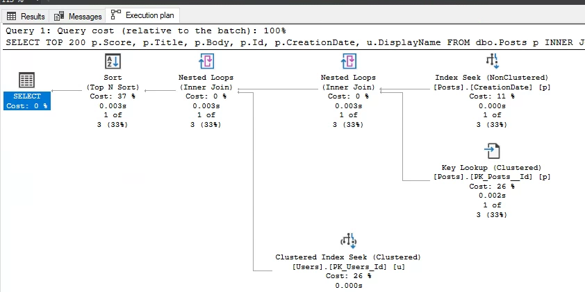

```sql
/* A less selective range gets a table scan, and it's rightfully slow: */
EXEC usp_TopScoringPostsByDate @StartDate = '2017-01-01', @EndDate = '2017-12-31' WITH RECOMPILE;

/* The question is: how can we strech this SP?

We can fix this by reducing the number of key lookups we do.

We can't cover the entire query: they're asking for the Body of the post. That's big. But remember from 
Fundamentals of Index Tuning: an ORDER BY with a TOP is basically a WHERE clause.

Armed with that, how could we reduce our key lookups? */

CREATE INDEX CreationDate_Score ON dbo.Posts(CreationDate, Score);
GO

/* But now think about the Posts component of the query: */
SELECT TOP 200 CreationDate, Score
FROM   dbo.Posts
WHERE  CreationDate BETWEEN '2017-12-01' AND '2017-12-31'
ORDER BY Score DESC;
GO
```

- The index is sorted by both CreationDate AND Score.
  So what will our query plan look like?

  Poll "The query plan will:"
    1. "Have an index seek and a TOP"
    2. "Have an index seek, then a sort by CreationDate, then a TOP"
    3. "Have an index scan"
    4. "Have a table scan"

  Response
    OPTION 2. After create the index I executed the query. The engine use the new Index. Execute an Index Seek + Order By

    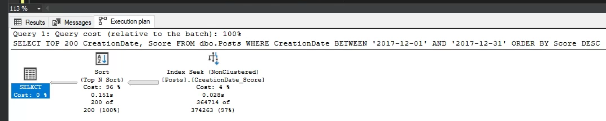

```sql
/* Now what happens with the queries and the new index?

If I pass in a very selective date range, I get an index seek + key lookups: */
EXEC usp_TopScoringPostsByDate @StartDate = '2009-01-01 10:00', @EndDate = '2009-01-01 10:01' WITH RECOMPILE;
```

- The Engines use the new index.

  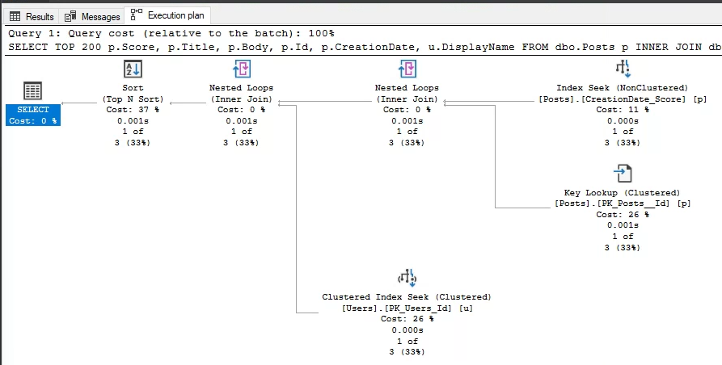


```sql
/* A less selective range gets a table scan, and it's rightfully slow: */
EXEC usp_TopScoringPostsByDate @StartDate = '2017-01-01', @EndDate = '2017-12-31' WITH RECOMPILE;
```

- The Engines doesn't use the new index.

  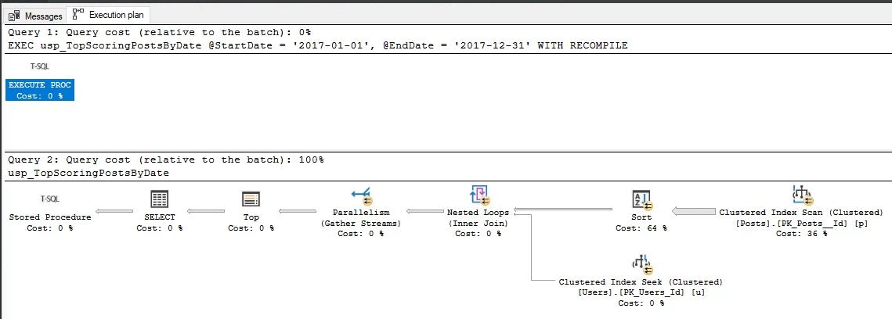


```sql
/* Index visualization query: */
SELECT CreationDate, Score
FROM   dbo.Posts
WHERE  CreationDate BETWEEN '2017-12-01' AND '2017-12-31'
ORDER BY CreationDate, Score;


/* So basically, EITHER of these indexes would have the same plan here: */
CREATE INDEX CreationDate_Score ON dbo.Posts(CreationDate, Score);
GO
CREATE INDEX CreationDate_Inc ON dbo.Posts(CreationDate) INCLUDE (Score);
GO

/* Don't get too hung up on chasing "perfect." = Perfect, is the enemy of good.

Armed with either of these indexes, how does our plan look now: 

If I pass in a very selective date range, I get an index seek + key lookups: */
EXEC usp_TopScoringPostsByDate @StartDate = '2009-01-01 10:00', @EndDate = '2009-01-01 10:01' WITH RECOMPILE;
```

- A GOOD PLAN, As usual we get Index Seek + Kee Lookups
 
```sql
/* Now try the less selective range: bad plan as usual */
EXEC usp_TopScoringPostsByDate @StartDate = '2017-01-01', @EndDate = '2017-12-31' WITH RECOMPILE;
GO
```

- A BAD PLAN, As usual we get Index Seek + Kee Lookups

```sql
/* What if we put the tiny data plan in memory first? */
sp_recompile 'usp_TopScoringPostsByDate';
GO

EXEC usp_TopScoringPostsByDate @StartDate = '2009-01-01 10:00', @EndDate = '2009-01-01 10:01';

/* Then run the big one? */
EXEC usp_TopScoringPostsByDate @StartDate = '2017-01-01', @EndDate = '2017-12-31';
GO
```

- Now on the second query the engine use the new index but we are still executing a Sort.

  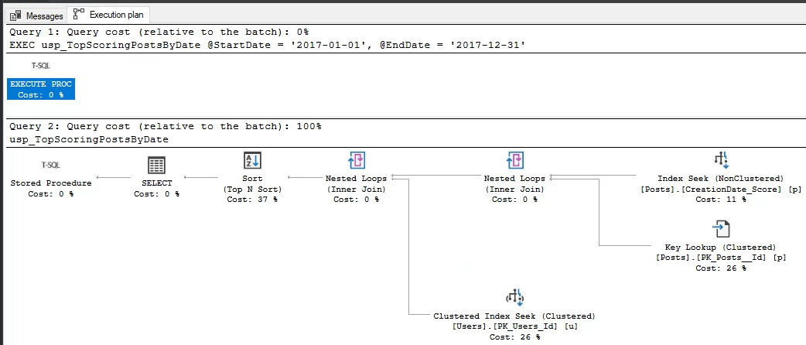


- The problem is the location of the sort.
  SQL Server usually puts the index seek + key lookup right next to each other, and then sorts the data AFTER it finds the rows.

  What if we:
  1. Used the index to find the rows we want
  2. Sort them
  3. Did the 200 key lookups later?

  To do that, we'll need to coach SQL Server. Here's one way:

  - using CTE
    ```sql
    CREATE OR ALTER PROC dbo.usp_TopScoringPostsByDate_CTE @StartDate DATETIME, @EndDate DATETIME AS
    BEGIN

      -- Here we only put the columns that we have on the index
      WITH RowsIWant AS 
      (
        SELECT TOP 200 
          p.Score, 
          p.CreationDate, 
          p.Id
        FROM dbo.Posts p
        WHERE p.CreationDate BETWEEN @StartDate AND @EndDate
        ORDER BY p.Score DESC
      )

      SELECT TOP 200 
        pKeyLookup.Score, 
        pKeyLookup.Title, 
        pKeyLookup.Body, 
        pKeyLookup.Id, 
        pKeyLookup.CreationDate, 
        u.DisplayName
      FROM RowsIWant r
      JOIN dbo.Posts pKeyLookup 
      ON   r.Id = pKeyLookup.Id
      JOIN dbo.Users u 
      ON   pKeyLookup.OwnerUserId = u.Id
      ORDER BY r.Score DESC;
    END
    GO

    sp_recompile 'usp_TopScoringPostsByDate_CTE';
    GO

    EXEC usp_TopScoringPostsByDate_CTE @StartDate = '2009-01-01 10:00', @EndDate = '2009-01-01 10:01';
    ```

    - So now the execution plan changed. The engine execute the Index Seek, then Sort and the Key Lookups for only 200 records.

      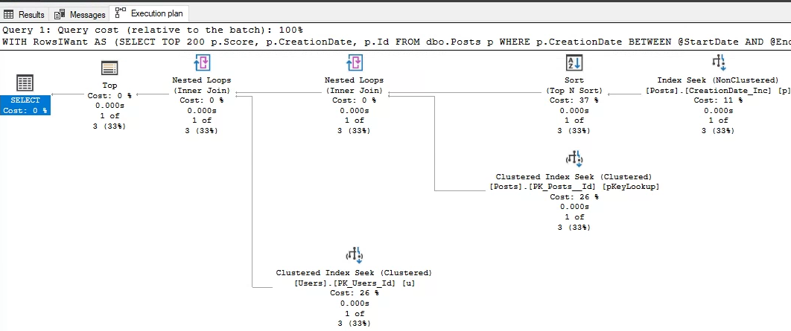

    ```sql
    /* Then run the big one? */
    EXEC usp_TopScoringPostsByDate_CTE @StartDate = '2017-01-01', @EndDate = '2017-12-31';
    GO
    ```

    - So now the query finished. Execute the same query plan for both queries "small" and "big"

      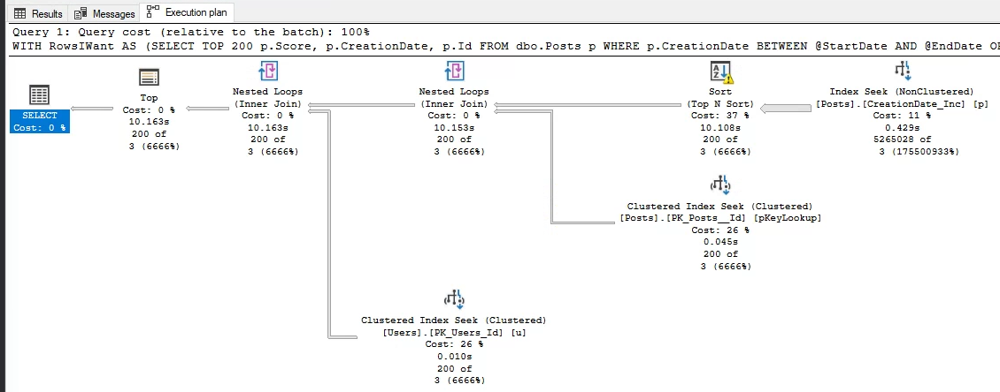

  - Using TEMPTABLE
    It's kinda like an index hint, but without naming the index.

    ```sql
    CREATE OR ALTER PROC dbo.usp_TopScoringPostsByDate_TempTables @StartDate DATETIME, @EndDate DATETIME AS
    BEGIN
      CREATE TABLE #RowsIWant (Id INT);

      INSERT INTO #RowsIWant (Id)
        SELECT TOP 200 p.Id
        FROM dbo.Posts p
        WHERE p.CreationDate BETWEEN @StartDate AND @EndDate
        ORDER BY p.Score DESC;

      SELECT TOP 200 
        pKeyLookup.Score, 
        pKeyLookup.Title, 
        pKeyLookup.Body, 
        pKeyLookup.Id, 
        pKeyLookup.CreationDate, 
        u.DisplayName
      FROM #RowsIWant r
      JOIN dbo.Posts pKeyLookup 
      ON   r.Id = pKeyLookup.Id
      JOIN dbo.Users u 
      ON   pKeyLookup.OwnerUserId = u.Id
      ORDER BY pKeyLookup.Score DESC;
    END
    GO
    ```

    ```sql
    sp_recompile 'usp_TopScoringPostsByDate_TempTables';
    GO
    
    EXEC usp_TopScoringPostsByDate_TempTables @StartDate = '2009-01-01 10:00', @EndDate = '2009-01-01 10:01';
    ```

    - So now, the engine create the temp table and do the sort. Then execute the Keylookups

      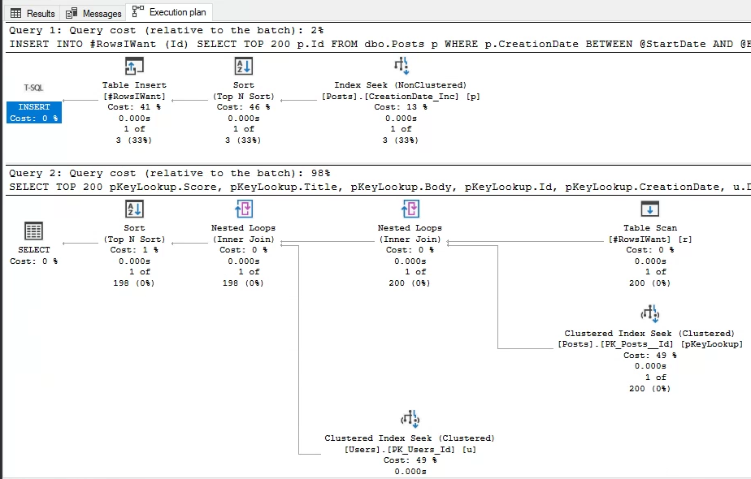


    ```sql
    /* Then run the big one */
    EXEC usp_TopScoringPostsByDate_TempTables @StartDate = '2017-01-01', @EndDate = '2017-12-31';
    GO
    ```

    - So now, the engine execute the same Plan.

      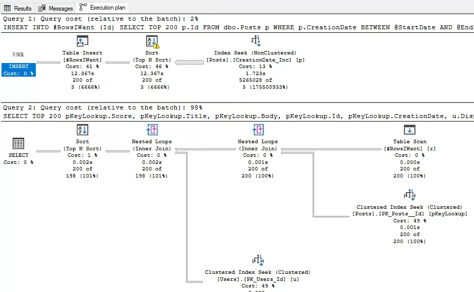


    ```sql
    /* You can still have outliers though: */
    EXEC usp_TopScoringPostsByDate @StartDate = '1970-01-01', @EndDate = '2039-12-31';

    /* If you needed to make THAT fast, then you really need two different plans. More on that later. */
    ```

- Notes
  - Fixing parameter sniffing with indexes is all about giving SQL Server a narrower copy of the data to reduce the blast radius.
  Sometimes we have to encourage SQL Server to use the index by breaking the work up into different phases. 
  
    WE STILL HAVE PARAMETER SNIFFING. These plans can have different:
    * Parallelism
    * Memory grants

    But they will at least look CLOSER than they looked before, and it may not matter AS MUCH which one goes in first.

    <r>If your biggest challenge in a parameter sniffing problem is deciding between an index seek vs key lookup, your goal is to reduce
    the number of key lookups that SQL Server is forced to do. Give it enough in the index to let it do the filtering necessary.

    The index helps you find the rows you want.

    <r>Once you've found the rows you want, 100-10,000 key lookups isn't a big deal at all (and the numbers may go even higher on bigger 
    databases.) Although if someone says they want more than 10,000 rows on a single report, I'm like look, buddy, it's time to do table scans.


## 2 Indexes
- That was a relatively simple filtering problem on one table. But what if the choice is between TWO indexes?

```sql
CREATE OR ALTER PROC dbo.usp_TopScoringPostsByDateAndScore @StartDate DATETIME, @EndDate DATETIME, @MinimumScore INT AS
BEGIN
  SELECT TOP 200 
    p.Score, 
    p.Title, 
    p.Body, 
    p.Id, 
    p.CreationDate, 
    u.DisplayName
  FROM dbo.Posts p
  JOIN dbo.Users u 
  ON   p.OwnerUserId = u.Id
  WHERE p.CreationDate BETWEEN @StartDate AND @EndDate
  AND   p.Score >= @MinimumScore
  ORDER BY p.Score DESC;
END
GO


/* If we call it for a narrow date range, we can do our filtering on the index: 

@MinimumScore = 1 Is NOT selective, almost all the users has MinimumScore = 1 */
EXEC usp_TopScoringPostsByDateAndScore @StartDate = '2009-01-01 10:00', @EndDate = '2009-01-01 10:01', @MinimumScore = 1 WITH RECOMPILE;
GO
```

- Here the engine use the CreationDate_Score index to run the Index Seek + Key Lookups

  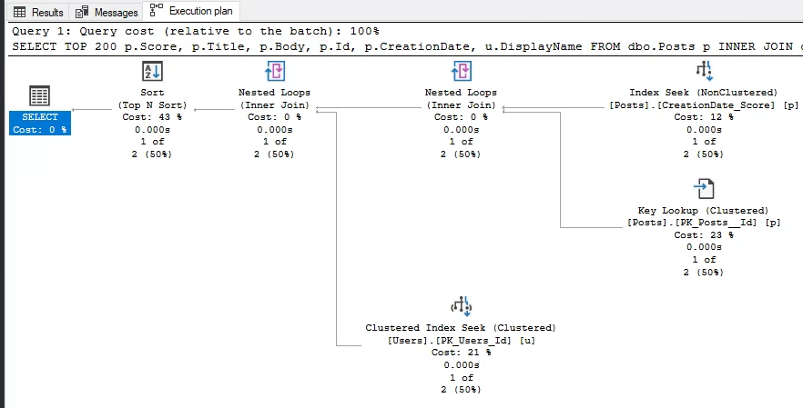


  ```sql
  /* But if we call it for a wide date range, and a narrow score filter: 
  @MinimumScore = 10000 Is selective, almost nobody has MinimumScore = 10000 */
  EXEC usp_TopScoringPostsByDateAndScore  @StartDate = '2016-01-01', @EndDate = '2016-12-31', @MinimumScore = 10000 WITH RECOMPILE;
  GO
  ```
  
- Here the execution plan is different

  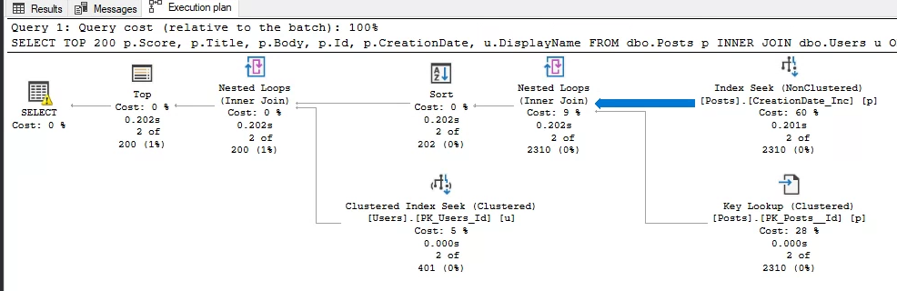

```sql
/* Now, an index on Score would be way more effective - because there just aren't a lot of rows that match that narrow predicate.
If we had an index on Score, CreationDate: */
CREATE INDEX Score_CreationDate ON dbo.Posts(Score, CreationDate);
GO

/* Then SQL Server will pick it when the score is very selective: */
EXEC usp_TopScoringPostsByDateAndScore @StartDate = '2016-01-01', @EndDate = '2016-12-31', @MinimumScore = 10000 WITH RECOMPILE;
GO
```

- Here the engine use the new index Score_CreationDate

  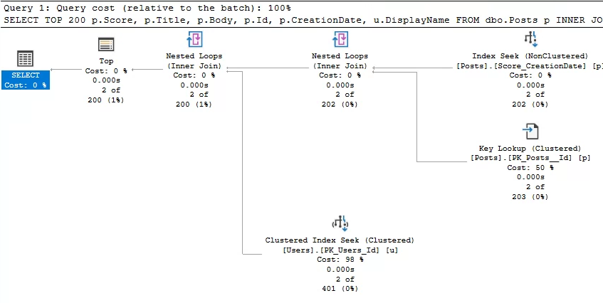

```sql 
/* But not when the date is very selective, and the score isn't: */
EXEC usp_TopScoringPostsByDateAndScore @StartDate = '2009-01-01 10:00', @EndDate = '2009-01-01 10:01', @MinimumScore = 1 WITH RECOMPILE;
GO
```

- Here the engine use the old index CreationDate_Score

  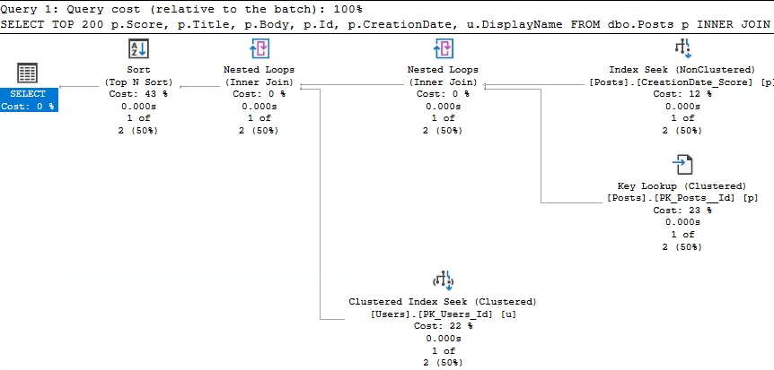

<r>Here we have a NEW problem.

<r>Our problem is NOT choosing between an index seek + key lookup vs a table scan.

<r>Our problem is choosing between TWO DIFFERENT INDEXES on the same table.

<r>Index tuning doesn't help here. Query tuning could help

- Now let's take it up a notch and filter on two tables at once:

  ```sql
  CREATE OR ALTER PROC dbo.usp_SearchPostsByLocation @Location VARCHAR(100), @StartDate DATETIME, @EndDate DATETIME AS
  BEGIN
    /* Find the most recent posts from an area */
    SELECT TOP 200 
      u.DisplayName, 
      p.Title, 
      p.Id, 
      p.CreationDate
    FROM dbo.Posts p
    JOIN dbo.Users u 
    ON   p.OwnerUserId = u.Id
    WHERE u.Location     LIKE @Location
    AND   p.CreationDate BETWEEN @StartDate AND @EndDate
    ORDER BY p.CreationDate DESC;
  END
  GO
  ```

- That's actually really similar to the above proc - but now, SQL Server's biggest challenge is determining WHICH TABLE to process first, and THEN which index to use on that table.

  When the User.Location is very selective, it makes sense to find the users in that location first, then look up their posts.

  When the Post.CreationDate range is very selective, it makes sense to find the posts in that date range first, then look up the users to see if they match.

  If BOTH are very selective, it doesn't really matter which plan we pick.

  If NEITHER is very selective, we'll probably end up with table scans.

  <r>Index tuning alone isn't going to be enough here: when SQL Server has to choose which table to process first, indexing each table isn't going to be enough.


## RECAP

What to take away from this demo:

* <r>If the biggest problem you're trying to solve is the choice between an index seek + key lookup versus a table scan,<r> your goal is to find the parts of the filtering & sorting that require key lookups, and see if you can move those to the index instead.

* <r>Even the index alone may not cut it: if we can't fully cover the query, we may need to break the query into phases so that we can  do a sort before we do a key lookup.</r>

* If the biggest problem is choosing between <r>two indexes on the same table,</r> index tuning can help, but it's probably not going to be the only solution by itself. We're probably also going to have to introduce branching logic or a recompile hint to let ourselves get different query plans for different sets of parameters.

* If the biggest problem you're trying to solve is <r>which table to process first</r> because different parameters should focus on different tables, indexes alone won't be enough.


# With Query Tuning
In our last module, we hit a wall when we tried to use index tuning to solve a problem where SQL Server had to choose between two different indexes for the same table. Sometimes a date range was more selective, and sometimes a score was more selective.

When you’re facing the problem of which index to process first, try both (or all) of the options and see if there’s one that has the least amount of terribleness. No, you shouldn’t hint the index by name – instead, just give SQL Server optimization hints that suggest which columns will be more selective, and that way, as index names change, you’ll still get a working plan. (This beats index hints and plan guides because those will fail as index names change.)

```sql
RAISERROR(N'Oops! No, don''t just hit F5. Run these demos one at a time.', 20, 1) WITH LOG;
GO

USE StackOverflow;
GO
EXEC DropIndexes @TableName = 'Users', @ExceptIndexNames = 'Location';
EXEC DropIndexes @TableName = 'Posts', @ExceptIndexNames = 'CreationDate,_dta_index_Posts_5_85575343__K8,IX_OwnerUserId,OwnerUserId,Score_CreationDate';
GO
IF NOT EXISTS(SELECT * FROM sys.indexes WHERE object_id = OBJECT_ID('dbo.Users') AND name = 'Location')
	CREATE INDEX Location ON dbo.Users(Location);
GO
IF EXISTS(SELECT * FROM sys.indexes WHERE object_id = OBJECT_ID('dbo.Posts') AND name = N'_dta_index_Posts_5_85575343__K8')
	EXEC sp_rename @objname = N'dbo.Posts._dta_index_Posts_5_85575343__K8', @newname = N'CreationDate', @objtype = N'INDEX';
GO
IF EXISTS(SELECT * FROM sys.indexes WHERE object_id = OBJECT_ID('dbo.Posts') AND name = N'IX_OwnerUserId')
	EXEC sp_rename @objname = N'dbo.Posts.IX_OwnerUserId', @newname = N'OwnerUserId', @objtype = N'INDEX';
GO
IF NOT EXISTS(SELECT * FROM sys.indexes WHERE object_id = OBJECT_ID('dbo.Posts') AND name = 'CreationDate')
	CREATE INDEX CreationDate ON dbo.Posts(CreationDate);
GO
IF NOT EXISTS(SELECT * FROM sys.indexes WHERE object_id = OBJECT_ID('dbo.Posts') AND name = 'OwnerUserId')
	CREATE INDEX OwnerUserId ON dbo.Posts(OwnerUserId);
GO
IF NOT EXISTS(SELECT * FROM sys.indexes WHERE object_id = OBJECT_ID('dbo.Posts') AND name = 'Score_CreationDate')
	CREATE INDEX Score_CreationDate ON dbo.Posts(Score, CreationDate);
GO

ALTER DATABASE CURRENT SET COMPATIBILITY_LEVEL = 140; /* 2017, not 2019 yet */
GO
EXEC sys.sp_configure N'cost threshold for parallelism', N'50' /* Keep small queries serial */
GO
EXEC sys.sp_configure N'max degree of parallelism', N'4' /* Let queries go parallel */
GO
RECONFIGURE
GO
```

- In the index-tuning module, we hit a wall when we tried to use index tuning alone to solve a tough choice between two indexes, on this proc:

```sql
CREATE OR ALTER PROC dbo.usp_TopScoringPostsByDateAndScore @StartDate DATETIME, @EndDate DATETIME, @MinimumScore INT AS
BEGIN
  SELECT TOP 200 
    p.Score, 
    p.Title,
    p.Body, 
    p.Id, 
    p.CreationDate, 
    u.DisplayName
  FROM dbo.Posts p
  JOIN dbo.Users u ON p.OwnerUserId = u.Id
  WHERE p.CreationDate BETWEEN @StartDate AND @EndDate
  AND   p.Score >= @MinimumScore
  ORDER BY p.Score DESC;
END
GO
```

- There is no one good plan for this.

- If you call it for a SELECTIVE date range and a NON-SELECTIVE score, you need to use the index on CreationDate first:

```sql
EXEC usp_TopScoringPostsByDateAndScore 
	@StartDate    = '2009-01-01 10:00', 
	@EndDate      = '2009-01-01 10:01',
	@MinimumScore = 1 
	WITH RECOMPILE;
GO
```

- If you call it for a NON-SELECTIVE date range and a SELECTIVE score, you need to use the index on Score first:

```sql
EXEC usp_TopScoringPostsByDateAndScore 
	@StartDate    = '2017-01-01', 
	@EndDate      = '2017-12-31',
	@MinimumScore = 10000 
	WITH RECOMPILE;
GO
```

- If the CreationDate index goes into cache first, and then we call the other, the results are terrible:

```sql
sp_recompile 'usp_TopScoringPostsByDateAndScore';
GO
EXEC usp_TopScoringPostsByDateAndScore 
	@StartDate    = '2009-01-01 10:00', 
	@EndDate      = '2009-01-01 10:01',
	@MinimumScore = 1;
GO
EXEC usp_TopScoringPostsByDateAndScore 
	@StartDate		= '2017-01-01', 
	@EndDate		  = '2017-12-31',
	@MinimumScore	= 10000;
GO
```

- If the Score index goes in memory first:

```sql
sp_recompile 'usp_TopScoringPostsByDateAndScore';
GO
EXEC usp_TopScoringPostsByDateAndScore 
	@StartDate		= '2017-01-01', 
	@EndDate		  = '2017-12-31',
	@MinimumScore	= 10000;
GO
EXEC usp_TopScoringPostsByDateAndScore 
	@StartDate		= '2009-01-01 10:00', 
	@EndDate		  = '2009-01-01 10:01',
	@MinimumScore	= 1;
GO
```

- Wait Wait Wait .... - that's...that's actually not bad! We might be able to live with that plan being used for everything. Let's try the absolute worst case for it: a score filter that matches ALL posts, and a CreationDate that only matches just one single post:

```sql
SELECT TOP 1 CreationDate FROM dbo.Posts;
GO
-- 2008-07-31 21:42:52.667
EXEC usp_TopScoringPostsByDateAndScore 
	@StartDate		= '2008-07-31 21:42:52.667', 
	@EndDate		= '2008-07-31 21:42:52.667',
	@MinimumScore	= -100;
GO
```

- In this case:
  - We read ALL of the posts (40 millons records) - that's a lot of logical reads
  - But SQL Server can read data quickly, even with just one core
  - There's no over-allocation of CPU here
  - There's no over-allocation of memory here
  - There aren't a bunch of key lookups

- This might be the least-bad query! If we want to stick with this, we could use an index hint on the SP by name:

```sql
CREATE OR ALTER PROC dbo.usp_TopScoringPostsByDateAndScore @StartDate DATETIME, @EndDate DATETIME, @MinimumScore INT AS
BEGIN
  SELECT TOP 200 
    p.Score, 
    p.Title, 
    p.Body, 
    p.Id, 
    p.CreationDate, 
    u.DisplayName
  FROM dbo.Posts p WITH (INDEX = Score_CreationDate)
  JOIN dbo.Users u 
  ON p.OwnerUserId = u.Id
  WHERE p.CreationDate BETWEEN @StartDate AND @EndDate
  AND   p.Score >= @MinimumScore
  ORDER BY p.Score DESC;
END
GO
```

- Try our absolute worst case scenario first, which SHOULD build a query plan that wants the index by CreationDate first:

```sql
EXEC usp_TopScoringPostsByDateAndScore 
	@StartDate		= '2008-07-31 21:42:52.667', 
	@EndDate		= '2008-07-31 21:42:52.667',
	@MinimumScore	= -100;
GO
```

- Things to note in the actual plan:
	* We get a seek on the Score_CreationDate index
	* Even though Score -100 isn't selective
	* Because SQL Server used the index hint

But if something happens with that index, like if someone renames it:

```sql
EXEC sp_rename 
	@objname = N'dbo.Posts.Score_CreationDate', 
	@newname = N'IX_Score_CreationDate', 
	@objtype = N'INDEX';
GO
```

- So yeah, not a big fan of index hints.
<r>Hint the PARAMETERS instead, and then let SQL Server pick the appropriate index at runtime. Plus, the parameter hints let SQL Server optimize for different parallelism, memory grants, data changes over time, etc:

```sql
CREATE OR ALTER PROC dbo.usp_TopScoringPostsByDateAndScore @StartDate DATETIME, @EndDate DATETIME, @MinimumScore INT AS
BEGIN
  SELECT TOP 200 
    p.Score, 
    p.Title, 
    p.Body, 
    p.Id, 
    p.CreationDate, 
    u.DisplayName
  FROM dbo.Posts p
  JOIN dbo.Users u 
  ON p.OwnerUserId = u.Id
  WHERE p.CreationDate BETWEEN @StartDate AND @EndDate
  AND p.Score >= @MinimumScore
  ORDER BY p.Score DESC
  OPTION (OPTIMIZE FOR (@MinimumScore = 100000));
END
GO
```

- Is hinting for score alone enough?

```sql
EXEC usp_TopScoringPostsByDateAndScore 
	@StartDate		= '2009-01-01 10:00', 
	@EndDate		= '2009-01-01 10:01',
	@MinimumScore	= 1;
GO
EXEC usp_TopScoringPostsByDateAndScore 
	@StartDate		= '2017-01-01', 
	@EndDate		= '2017-12-31',
	@MinimumScore	= 10000;
GO
/* And our worst case: */
EXEC usp_TopScoringPostsByDateAndScore 
	@StartDate		= '2008-07-31 21:42:52.667', 
	@EndDate		= '2008-07-31 21:42:52.667',
	@MinimumScore	= -100;
GO
```

- We can also hint both score and dates:

```sql
CREATE OR ALTER PROC dbo.usp_TopScoringPostsByDateAndScore
	@StartDate DATETIME, @EndDate DATETIME, @MinimumScore INT AS
BEGIN
SELECT TOP 200 p.Score, p.Title, p.Body, p.Id, p.CreationDate, u.DisplayName
  FROM dbo.Posts p												/* INDEX HINT IS GONE */
  INNER JOIN dbo.Users u ON p.OwnerUserId = u.Id
  WHERE p.CreationDate BETWEEN @StartDate AND @EndDate
    AND p.Score >= @MinimumScore
  ORDER BY p.Score DESC
  OPTION (OPTIMIZE FOR (@MinimumScore = 100000, 
  @StartDate = '2008-07-31 21:42:52.667', 
  @EndDate = '2008-07-31 21:42:52.667'));
END
GO
```

```sql
CREATE OR ALTER PROC dbo.usp_TopScoringPostsByDateAndScore @StartDate DATETIME, @EndDate DATETIME, @MinimumScore INT AS
BEGIN
  DECLARE @StringToExecute NVARCHAR(4000);
  SET @StringToExecute = N'
    SELECT TOP 200 p.Score, p.Title, p.Body, p.Id, p.CreationDate, u.DisplayName
      FROM dbo.Posts p
      INNER JOIN dbo.Users u ON p.OwnerUserId = u.Id
      WHERE p.CreationDate BETWEEN @StartDate AND @EndDate
      AND p.Score >= @MinimumScore
      ORDER BY p.Score DESC ';

/* If they're asking for >60 days, it's big data, so get a fresh plan for it: */
IF DATEDIFF(DD, @StartDate, @EndDate) > 60
	SET @StringToExecute = @StringToExecute + N' OPTION (RECOMPILE) ';

EXEC sp_executesql @StringToExecute, 
	N'@StartDate DATETIME, @EndDate DATETIME, @MinimumScore INT',
	@StartDate, @EndDate, @MinimumScore;
END
GO
```

## RECAP
- There are a huge number of hints available, and they keep growing with each new version:
  https://docs.microsoft.com/en-us/sql/t-sql/queries/hints-transact-sql-query?view=sql-server-ver15

  I don't use these often, but when I do, these are the ones I like:

  - OPTIMIZE FOR specific variables:
	Lets me pick which plan I want to aim for. Works well if the majority of my queries have a similar pattern, like a narrow or wide date range.

	- OPTIMIZE FOR UNKNOWN:
	I don't actually like this much because you're optimizing for the "average" value, and that value can change a lot over time. However, if your query would
	perform well if the "average" value worked well, and if you specifically want to exclude an outlier plan (like Jon Skeet running first), then this works.
	If you find yourself using this a lot, try the database-level setting for disabling parameter sniffing instead (which can also be set differently for AG
	secondaries, which have reporting-style big-data queries.)

	- MAX_GRANT_PERCENT:
	If SQL Server believes a huge amount of memory is necessary for a query, but I know that the predicate is just nonsargable, OR if I know the speed of this
	query just doesn't matter (and I'm okay if it spills to disk), then this lets me limit the grant.

	- MAXDOP:
	You can actually pass in a HIGHER number here than the server's MAXDOP. Useful if you need to run batch reports against something like a Dynamics database
	that would otherwise get MAXDOP 1. When I do this, I tend to hint MAXDOP 8. I don't usually want to take over *all* of the cores on a server. To be clear
	though, this does NOT encourage a parallel plan.

	- OPTION(USE HINT('ENABLE_PARALLEL_PLAN_PREFERENCE'))
	This one encourages a parallel plan.

	- Cardinality estimation hotfixes:
	There are hints you can use to ask for a newer or legacy CE, depending on whether your database defaults to the old or new one.

	- QUERY_OPTIMIZER_COMPATIBILITY_LEVEL_n:
	This is Microsoft's attempt to let ISVs ask for a specific CE, and thereby maintain support on newer versions of SQL Server. If they have a query that
	only performs well on the older (or a specific) compat level, they can ask for it at the query level here. I've never met an ISV that had enough time to hint
	all of their queries like this. Your mileage may vary.

	- QUERYTRACEON:
	If you need a specific trace flag, you can do it with this syntax:
	OPTION (QUERYTRACEON 4199, QUERYTRACEON 4137)

	List of supported trace flags:
	https://docs.microsoft.com/en-us/sql/t-sql/database-console-commands/dbcc-traceon-trace-flags-transact-sql
		
    * 4199: query optimizer behavior changes
    * 9398: disables Adaptive Joins
    * 9481: old CE (pre-2014) regardless of compat level
    * 11064: memory balancing for columnstore inserts

	List of all trace flags, including unsupported:
	https://github.com/ktaranov/sqlserver-kit/blob/master/SQL%20Server%20Trace%20Flag.md

    * 8671: spend more time compiling plans, ignore "good enough plan found"
    * 2453: table variables can trigger recompile when rows are inserted

I've seriously never done this in production, but I know a lot of folks that I respect who have, so I'm leaving this here.

RECOMPILE:
But I'll dedicate a whole module to that.

# With Recompile Hints

So far, we’ve added indexes, broken up queries into sections to encourage SQL Server to use those indexes, and even added query-level hints, all in an effort to get one execution plan that works well enough for most scenarios.

But what if you can’t?

Recompile hints are so compelling because they get a brand new customized execution plan for every set of incoming parameters. Option recompile is almost like a cheat code, and I love cheat codes! Let’s talk about when they’re safe to use, when they’ll get you busted, and how to use Erik Darling’s sp_HumanEvents to find out how bad of a problem they are for you already.


  ********************************************************************************
  SI LA QUERY CORRE A CADA MINUTO O MENOS NO USAR OPTION()

  SI LA QUERY CORRE con menos frecuencia 
    REPORTES QUE CORREN CADA MES O 3 O 6 MESES TIENEN QUE USAR OPTION(RECOMPILE)

  escuchar este video de nuevo en el minuto 13:30 .. no termino de entender.
  ********************************************************************************

```sql
RAISERROR(N'Oops! No, don''t just hit F5. Run these demos one at a time.', 20, 1) WITH LOG;
GO


/* Set the stage with the right server options & database config. We'll be 
doing this repeatedly for a few modules, and this script should be idempotent. */
USE StackOverflow;
GO
EXEC DropIndexes @TableName = 'Users', @ExceptIndexNames = 'Location';
EXEC DropIndexes @TableName = 'Posts', @ExceptIndexNames = 'CreationDate,_dta_index_Posts_5_85575343__K8,IX_OwnerUserId,OwnerUserId';
GO
IF NOT EXISTS(SELECT * FROM sys.indexes WHERE object_id = OBJECT_ID('dbo.Users') AND name = 'Location')
	CREATE INDEX Location ON dbo.Users(Location);
GO
IF EXISTS(SELECT * FROM sys.indexes WHERE object_id = OBJECT_ID('dbo.Posts') AND name = N'_dta_index_Posts_5_85575343__K8')
	EXEC sp_rename @objname = N'dbo.Posts._dta_index_Posts_5_85575343__K8', @newname = N'CreationDate', @objtype = N'INDEX';
GO
IF EXISTS(SELECT * FROM sys.indexes WHERE object_id = OBJECT_ID('dbo.Posts') AND name = N'IX_OwnerUserId')
	EXEC sp_rename @objname = N'dbo.Posts.IX_OwnerUserId', @newname = N'OwnerUserId', @objtype = N'INDEX';
GO
IF NOT EXISTS(SELECT * FROM sys.indexes WHERE object_id = OBJECT_ID('dbo.Posts') AND name = 'CreationDate')
	CREATE INDEX CreationDate ON dbo.Posts(CreationDate);
GO
IF NOT EXISTS(SELECT * FROM sys.indexes WHERE object_id = OBJECT_ID('dbo.Posts') AND name = 'OwnerUserId')
	CREATE INDEX OwnerUserId ON dbo.Posts(OwnerUserId);
GO
ALTER DATABASE CURRENT SET COMPATIBILITY_LEVEL = 140; /* 2017, not 2019 yet */
GO
EXEC sys.sp_configure N'cost threshold for parallelism', N'50' /* Keep small queries serial */
GO
EXEC sys.sp_configure N'max degree of parallelism', N'4' /* Let queries go parallel */
GO
RECONFIGURE
GO
DBCC FREEPROCCACHE;
GO
```

- We've been hitting a wall when we have a really big choice to make: which table should we process first?

```sql
CREATE OR ALTER PROC dbo.usp_SearchPostsByLocation @Location VARCHAR(100), @StartDate DATETIME, @EndDate DATETIME AS
BEGIN
/* Find the most recent posts from an area */
  SELECT TOP 200 
    u.DisplayName, 
    p.Title, 
    p.Id, 
    p.CreationDate
  FROM dbo.Posts p
  JOIN dbo.Users u 
  ON   p.OwnerUserId = u.Id
  WHERE u.Location LIKE @Location
  AND   p.CreationDate BETWEEN @StartDate AND @EndDate
  ORDER BY p.CreationDate DESC;
END
GO
```

- If we run them all with recompile hints, they all add up to < 10 seconds:

```sql
EXEC usp_SearchPostsByLocation 'India', @StartDate = '2008-01-01', @EndDate = '2014-01-01' WITH RECOMPILE; /* Big data, big dates */
EXEC usp_SearchPostsByLocation 'India', @StartDate = '2009-01-01', @EndDate = '2009-02-01' WITH RECOMPILE; /* Big data, medium dates */
EXEC usp_SearchPostsByLocation 'India', @StartDate = '2009-01-01 10:00', @EndDate = '2009-01-01 10:01' WITH RECOMPILE; /* Big data, small dates */
 
EXEC usp_SearchPostsByLocation 'Netherlands', @StartDate = '2008-01-01', @EndDate = '2014-01-01' WITH RECOMPILE; /* Medium data, big dates */
EXEC usp_SearchPostsByLocation 'Netherlands', @StartDate = '2009-01-01', @EndDate = '2009-02-01' WITH RECOMPILE; /* Medium data, medium dates */
EXEC usp_SearchPostsByLocation 'Netherlands', @StartDate = '2009-01-01 10:00', @EndDate = '2009-01-01 10:01' WITH RECOMPILE; /* Medium data, small dates */
 
EXEC usp_SearchPostsByLocation 'Near Stonehenge', @StartDate = '2008-01-01', @EndDate = '2014-01-01' WITH RECOMPILE; /* Small data, big dates */
EXEC usp_SearchPostsByLocation 'Near Stonehenge', @StartDate = '2009-01-01', @EndDate = '2009-02-01' WITH RECOMPILE; /* Small data, medium dates */
EXEC usp_SearchPostsByLocation 'Near Stonehenge', @StartDate = '2009-01-01 10:00', @EndDate = '2009-01-01 10:01' WITH RECOMPILE; /* Small data, small dates */
 
EXEC usp_SearchPostsByLocation 'Willemstad, Curaçao', @StartDate = '2008-01-01', @EndDate = '2014-01-01' WITH RECOMPILE; /* Outlier data, big dates */
EXEC usp_SearchPostsByLocation 'Willemstad, Curaçao', @StartDate = '2009-01-01', @EndDate = '2009-02-01' WITH RECOMPILE; /* Outlier data, medium dates */
EXEC usp_SearchPostsByLocation 'Willemstad, Curaçao', @StartDate = '2009-01-01 10:00', @EndDate = '2009-01-01 10:01' WITH RECOMPILE; /* Outlier data, small dates */
GO
```

- Their actual plans are all over the place!

- If we truly want every one of them to get their own plan, we can just redefine the stored procedure with a recompile hint built right in:

```sql
CREATE OR ALTER PROC dbo.usp_SearchPostsByLocation @Location VARCHAR(100), @StartDate DATETIME, @EndDate DATETIME AS
BEGIN
/* Find the most recent posts from an area */
  SELECT TOP 200 
    u.DisplayName, 
    p.Title, 
    p.Id, 
    p.CreationDate
  FROM dbo.Posts p
  JOIN dbo.Users u ON p.OwnerUserId = u.Id
  WHERE u.Location LIKE @Location
    AND p.CreationDate BETWEEN @StartDate AND @EndDate
  ORDER BY p.CreationDate DESC
  OPTION (RECOMPILE) /* THIS IS NEW */;
END
GO
```

- We don't have to ask for a recompile - it's even easier & faster!

```sql
EXEC usp_SearchPostsByLocation 'India', @StartDate = '2008-01-01', @EndDate = '2014-01-01'; /* Big data, big dates */
EXEC usp_SearchPostsByLocation 'India', @StartDate = '2009-01-01', @EndDate = '2009-02-01'; /* Big data, medium dates */
EXEC usp_SearchPostsByLocation 'India', @StartDate = '2009-01-01 10:00', @EndDate = '2009-01-01 10:01'; /* Big data, small dates */
 
EXEC usp_SearchPostsByLocation 'Netherlands', @StartDate = '2008-01-01', @EndDate = '2014-01-01'; /* Medium data, big dates */
EXEC usp_SearchPostsByLocation 'Netherlands', @StartDate = '2009-01-01', @EndDate = '2009-02-01'; /* Medium data, medium dates */
EXEC usp_SearchPostsByLocation 'Netherlands', @StartDate = '2009-01-01 10:00', @EndDate = '2009-01-01 10:01'; /* Medium data, small dates */
 
EXEC usp_SearchPostsByLocation 'Near Stonehenge', @StartDate = '2008-01-01', @EndDate = '2014-01-01'; /* Small data, big dates */
EXEC usp_SearchPostsByLocation 'Near Stonehenge', @StartDate = '2009-01-01', @EndDate = '2009-02-01'; /* Small data, medium dates */
EXEC usp_SearchPostsByLocation 'Near Stonehenge', @StartDate = '2009-01-01 10:00', @EndDate = '2009-01-01 10:01'; /* Small data, small dates */
 
EXEC usp_SearchPostsByLocation 'Willemstad, Curaçao', @StartDate = '2008-01-01', @EndDate = '2014-01-01'; /* Outlier data, big dates */
EXEC usp_SearchPostsByLocation 'Willemstad, Curaçao', @StartDate = '2009-01-01', @EndDate = '2009-02-01'; /* Outlier data, medium dates */
EXEC usp_SearchPostsByLocation 'Willemstad, Curaçao', @StartDate = '2009-01-01 10:00', @EndDate = '2009-01-01 10:01'; /* Outlier data, small dates */
GO
```

- There are 3 drawbacks:

  1. The plans may still not actually be good: if SQL Server has estimation problems, it may still pick bad indexes, grants, orders, etc. That's a separate problem - that's just plain old query tuning. We cover that in Mastering Query Tuning.

  2. The statement-level metrics disappear from cache: note the number of executions for the proc and for the statement:
  sp_BlitzCache;

  3. Each time the query is compiled, there's a CPU hit. This isn't bad in a small stored proc like ours, but it can be a big deal as:
  	* You build the hint into more queries
  	* You build the hint into LARGER queries (that take more CPU time to compile)

- You can see the overhead in each actual plan by looking at its compilation CPU and compilation time metrics, but ain't nobody got time for that.

Let's see the overhead with sp_HumanEvents: https://www.erikdarlingdata.com/sp_humanevents/

```sql
/* Start this in another window: */
EXEC dbo.sp_HumanEvents @event_type = 'recompilations', @seconds_sample = 30;
GO
```
  
- Then run our workload again:
 
  ```sql
  EXEC usp_SearchPostsByLocation 'India', @StartDate = '2008-01-01', @EndDate = '2014-01-01'; /* Big data, big dates */
  EXEC usp_SearchPostsByLocation 'India', @StartDate = '2009-01-01', @EndDate = '2009-02-01'; /* Big data, medium dates */
  EXEC usp_SearchPostsByLocation 'India', @StartDate = '2009-01-01 10:00', @EndDate = '2009-01-01 10:01'; /* Big data, small dates */

  EXEC usp_SearchPostsByLocation 'Netherlands', @StartDate = '2008-01-01', @EndDate = '2014-01-01'; /* Medium data, big dates */
  EXEC usp_SearchPostsByLocation 'Netherlands', @StartDate = '2009-01-01', @EndDate = '2009-02-01'; /* Medium data, medium dates */
  EXEC usp_SearchPostsByLocation 'Netherlands', @StartDate = '2009-01-01 10:00', @EndDate = '2009-01-01 10:01'; /* Medium data, small dates */

  EXEC usp_SearchPostsByLocation 'Near Stonehenge', @StartDate = '2008-01-01', @EndDate = '2014-01-01'; /* Small data, big dates */
  EXEC usp_SearchPostsByLocation 'Near Stonehenge', @StartDate = '2009-01-01', @EndDate = '2009-02-01'; /* Small data, medium dates */
  EXEC usp_SearchPostsByLocation 'Near Stonehenge', @StartDate = '2009-01-01 10:00', @EndDate = '2009-01-01 10:01'; /* Small data, small dates */

  EXEC usp_SearchPostsByLocation 'Willemstad, Curaçao', @StartDate = '2008-01-01', @EndDate = '2014-01-01'; /* Outlier data, big dates */
  EXEC usp_SearchPostsByLocation 'Willemstad, Curaçao', @StartDate = '2009-01-01', @EndDate = '2009-02-01'; /* Outlier data, medium dates */
  EXEC usp_SearchPostsByLocation 'Willemstad, Curaçao', @StartDate = '2009-01-01 10:00', @EndDate = '2009-01-01 10:01'; /* Outlier data, small dates */
  GO
  ```

  - The compilation overhead on a simple query like that is not bad. However, add more of these:
    * Statements
    * Joins
    * Partitions
    * Plan choices
  
  And compilation time gets worse. To illustrate it, I am going to partition the Users table by CreationDate:

  ```sql
  /* Create a numbers table with 1M rows: */
  DROP TABLE IF EXISTS dbo.Numbers;
  GO
  
  CREATE TABLE Numbers (Number int not null PRIMARY KEY CLUSTERED);
  ;WITH
    Pass0 as (select 1 as C union all select 1), --2 rows
    Pass1 as (select 1 as C from Pass0 as A, Pass0 as B),--4 rows
    Pass2 as (select 1 as C from Pass1 as A, Pass1 as B),--16 rows
    Pass3 as (select 1 as C from Pass2 as A, Pass2 as B),--256 rows
    Pass4 as (select 1 as C from Pass3 as A, Pass3 as B),--65536 rows
    Pass5 as (select 1 as C from Pass4 as A, Pass4 as B),--Bigint
    Tally as (select row_number() over(order by C) as Number from Pass5)
  INSERT dbo.Numbers
          (Number)
      SELECT Number
          FROM Tally
          WHERE Number <= 1000000;
  GO
  ```

  - Create date partition function by day since Stack Overflow's origin, modified from Microsoft Books Online:
  https://docs.microsoft.com/en-us/sql/t-sql/statements/create-partition-function-transact-sql?view=sql-server-ver15#BKMK_examples

  ```sql
  DROP PARTITION SCHEME [DatePartitionScheme];
  DROP PARTITION FUNCTION [DatePartitionFunction];
  
  DECLARE @DatePartitionFunction nvarchar(max) = 
    N'CREATE PARTITION FUNCTION DatePartitionFunction (datetime) 
    AS RANGE RIGHT FOR VALUES (';  
  DECLARE @i datetime = '2008-06-01';
  WHILE @i <= GETDATE()
  BEGIN  
  SET @DatePartitionFunction += '''' + CAST(@i as nvarchar(20)) + '''' + N', ';  
  SET @i = DATEADD(DAY, 1, @i);  
  END  
  SET @DatePartitionFunction += '''' + CAST(@i as nvarchar(20))+ '''' + N');';  
  EXEC sp_executesql @DatePartitionFunction;  
  GO
  
  /* Create matching partition scheme, but put everything in Primary: */
  CREATE PARTITION SCHEME DatePartitionScheme  
  AS PARTITION DatePartitionFunction  
  ALL TO ( [PRIMARY] ); 
  GO

  DROP TABLE IF EXISTS dbo.Users_partitioned;
  GO
  CREATE TABLE [dbo].[Users_partitioned](
    [Id] [int] NOT NULL,
    [AboutMe] [nvarchar](max) NULL,
    [Age] [int] NULL,
    [CreationDate] [datetime] NOT NULL,
    [DisplayName] [nvarchar](40) NOT NULL,
    [DownVotes] [int] NOT NULL,
    [EmailHash] [nvarchar](40) NULL,
    [LastAccessDate] [datetime] NOT NULL,
    [Location] [nvarchar](100) NULL,
    [Reputation] [int] NOT NULL,
    [UpVotes] [int] NOT NULL,
    [Views] [int] NOT NULL,
    [WebsiteUrl] [nvarchar](200) NULL,
    [AccountId] [int] NULL
  ) ON [PRIMARY];
  GO

  CREATE CLUSTERED INDEX CreationDate_Id ON dbo.Users_partitioned (Id) ON DatePartitionScheme(CreationDate);
  GO

  INSERT INTO dbo.Users_partitioned (Id, AboutMe, Age, CreationDate, DisplayName, DownVotes, EmailHash,
    LastAccessDate, Location, Reputation, UpVotes, Views, WebsiteUrl, AccountId)
  SELECT Id, AboutMe, Age, CreationDate, DisplayName, DownVotes, EmailHash,
    LastAccessDate, Location, Reputation, UpVotes, Views, WebsiteUrl, AccountId
  FROM dbo.Users;
  GO
  
  CREATE INDEX Location_Aligned    ON dbo.Users_partitioned(Location);
  CREATE INDEX Location_NotAligned ON dbo.Users(Location) ON [PRIMARY];
  GO

  /* Change the SP */
  CREATE OR ALTER PROC dbo.usp_SearchPostsByLocation_Partitioned @Location VARCHAR(100), @StartDate DATETIME, @EndDate DATETIME AS
  BEGIN
  /* Find the most recent posts from an area */
    SELECT TOP 200 
      u.DisplayName, 
      p.Title, 
      p.Id, 
      p.CreationDate
    FROM dbo.Posts p
    JOIN dbo.Users_partitioned u 
    ON   p.OwnerUserId = u.Id
    WHERE u.Location LIKE @Location
    AND p.CreationDate BETWEEN @StartDate AND @EndDate
    ORDER BY p.CreationDate DESC
    OPTION (RECOMPILE);
  END
  GO

  /* Start this in another window: */
  EXEC dbo.sp_HumanEvents @event_type = 'recompilations', @seconds_sample = 30;
  GO

  /* Then run our workload again: */
  EXEC usp_SearchPostsByLocation_Partitioned 'India', @StartDate = '2008-01-01', @EndDate = '2014-01-01'; /* Big data, big dates */
  EXEC usp_SearchPostsByLocation_Partitioned 'India', @StartDate = '2009-01-01', @EndDate = '2009-02-01'; /* Big data, medium dates */
  EXEC usp_SearchPostsByLocation_Partitioned 'India', @StartDate = '2009-01-01 10:00', @EndDate = '2009-01-01 10:01'; /* Big data, small dates */
  
  EXEC usp_SearchPostsByLocation_Partitioned 'Netherlands', @StartDate = '2008-01-01', @EndDate = '2014-01-01'; /* Medium data, big dates */
  EXEC usp_SearchPostsByLocation_Partitioned 'Netherlands', @StartDate = '2009-01-01', @EndDate = '2009-02-01'; /* Medium data, medium dates */
  EXEC usp_SearchPostsByLocation_Partitioned 'Netherlands', @StartDate = '2009-01-01 10:00', @EndDate = '2009-01-01 10:01'; /* Medium data, small dates */
  
  EXEC usp_SearchPostsByLocation_Partitioned 'Near Stonehenge', @StartDate = '2008-01-01', @EndDate = '2014-01-01'; /* Small data, big dates */
  EXEC usp_SearchPostsByLocation_Partitioned 'Near Stonehenge', @StartDate = '2009-01-01', @EndDate = '2009-02-01'; /* Small data, medium dates */
  EXEC usp_SearchPostsByLocation_Partitioned 'Near Stonehenge', @StartDate = '2009-01-01 10:00', @EndDate = '2009-01-01 10:01'; /* Small data, small dates */
  
  EXEC usp_SearchPostsByLocation_Partitioned 'Willemstad, Curaçao', @StartDate = '2008-01-01', @EndDate = '2014-01-01'; /* Outlier data, big dates */
  EXEC usp_SearchPostsByLocation_Partitioned 'Willemstad, Curaçao', @StartDate = '2009-01-01', @EndDate = '2009-02-01'; /* Outlier data, medium dates */
  EXEC usp_SearchPostsByLocation_Partitioned 'Willemstad, Curaçao', @StartDate = '2009-01-01 10:00', @EndDate = '2009-01-01 10:01'; /* Outlier data, small dates */
  GO
  ```

- Last note: if you're gonna do recompilations in the real world, never put the hint on the outside of the stored procedure like this:

```sql
CREATE OR ALTER PROC dbo.usp_SearchPostsByLocation @Location VARCHAR(100), @StartDate DATETIME, @EndDate DATETIME 
  /* This is bad */
  WITH RECOMPILE AS
BEGIN
  /* Find the most recent posts from an area */
  SELECT TOP 200 
      u.DisplayName, 
      p.Title, 
      p.Id, 
      p.CreationDate
  FROM dbo.Posts p
  JOIN dbo.Users u ON p.OwnerUserId = u.Id
  WHERE u.Location LIKE @Location
  AND   p.CreationDate BETWEEN @StartDate AND @EndDate
  ORDER BY p.CreationDate DESC;
END
GO    

/* Put them on the inside like this: */
CREATE OR ALTER PROC dbo.usp_SearchPostsByLocation @Location VARCHAR(100), @StartDate DATETIME, @EndDate DATETIME AS
BEGIN
/* Find the most recent posts from an area */
SELECT TOP 200 u.DisplayName, p.Title, p.Id, p.CreationDate
  FROM dbo.Posts p
  INNER JOIN dbo.Users u ON p.OwnerUserId = u.Id
  WHERE u.Location LIKE @Location
    AND p.CreationDate BETWEEN @StartDate AND @EndDate
  ORDER BY p.CreationDate DESC
  OPTION (RECOMPILE); /* This is less bad */
END
GO
```

- Because you'll get some (but not all) monitoring in the plan cache:

```sql
DBCC FREEPROCCACHE;
GO

/* Then run our workload again: */
EXEC usp_SearchPostsByLocation 'India', @StartDate = '2008-01-01', @EndDate = '2014-01-01'; /* Big data, big dates */
EXEC usp_SearchPostsByLocation 'India', @StartDate = '2009-01-01', @EndDate = '2009-02-01'; /* Big data, medium dates */
EXEC usp_SearchPostsByLocation 'India', @StartDate = '2009-01-01 10:00', @EndDate = '2009-01-01 10:01'; /* Big data, small dates */
 
EXEC usp_SearchPostsByLocation 'Netherlands', @StartDate = '2008-01-01', @EndDate = '2014-01-01'; /* Medium data, big dates */
EXEC usp_SearchPostsByLocation 'Netherlands', @StartDate = '2009-01-01', @EndDate = '2009-02-01'; /* Medium data, medium dates */
EXEC usp_SearchPostsByLocation 'Netherlands', @StartDate = '2009-01-01 10:00', @EndDate = '2009-01-01 10:01'; /* Medium data, small dates */
 
EXEC usp_SearchPostsByLocation 'Near Stonehenge', @StartDate = '2008-01-01', @EndDate = '2014-01-01'; /* Small data, big dates */
EXEC usp_SearchPostsByLocation 'Near Stonehenge', @StartDate = '2009-01-01', @EndDate = '2009-02-01'; /* Small data, medium dates */
EXEC usp_SearchPostsByLocation 'Near Stonehenge', @StartDate = '2009-01-01 10:00', @EndDate = '2009-01-01 10:01'; /* Small data, small dates */
 
EXEC usp_SearchPostsByLocation 'Willemstad, Curaçao', @StartDate = '2008-01-01', @EndDate = '2014-01-01'; /* Outlier data, big dates */
EXEC usp_SearchPostsByLocation 'Willemstad, Curaçao', @StartDate = '2009-01-01', @EndDate = '2009-02-01'; /* Outlier data, medium dates */
EXEC usp_SearchPostsByLocation 'Willemstad, Curaçao', @StartDate = '2009-01-01 10:00', @EndDate = '2009-01-01 10:01'; /* Outlier data, small dates */
GO

sp_BlitzCache;
```

## RECAP
What to take away from this demo:
  
  * <r>If you truly need different plans for every parameter set, statement-level recompile hints are the way to go.

  * <r>I just only use these when the query runs less than a few times per minute, or else the overhead of this (plus the rest of the queries where I end up REQUIRING recompile hints) can add up to a big deal.

  * The easy way to see if it's a big deal on your server already: <r>sp_HumanEvents by Erik Darling.
  https://www.erikdarlingdata.com/sp_humanevents/

# LAB 1

- Setting up for the lab
  1. Restart your SQL Server service (clears all stats)
  2. Restore your StackOverflow database (Agent job)
  3. Copy & run the setup script for Lab 1
  4. (No SQLQueryStress for this lab)

- Task #1: fix these 2 parameters
  EXEC usp_MostRecentCommentsForMe @UserId = 26837, @MinimumCommenterReputation = 0, @MinimumCommentScore = 0
  EXEC usp_MostRecentCommentsForMe @UserId = 22656, @MinimumCommenterReputation = 10000, @MinimumCommentScore = 50

  . Get these two sets of parameters to perform consistently sub-5-seconds, no matter which one is called first. Try freeing the plan cache, then run Brent, then run Jon Skeet. Then free the plan cache again, run Jon Skeet, then Brent.

	. Recompile hints are off-limits because the queries run really frequently

	. You’re not allowed to drop indexes – assume that the other indexes in place are being used by other queries  (although you can expand them to include additional columns if that helps)

	. Get both sets of parameters to use the same plan (and the plan needs to be fast enough that it runs in, under 5 seconds

  ### My solution
  Task #1:
  ```sql
  Test A
    Execute Brent first
      Table 'Users'.		Scan count   0, logical reads 674 , physical reads 1, read-ahead reads 107
      Table 'Comments'.	Scan count 166, logical reads 2145, physical reads 1, read-ahead reads 224
      Table 'Posts'.		Scan count   1, logical reads 3   , physical reads 3, read-ahead reads 0  
      
      Time 1 se
  ```
      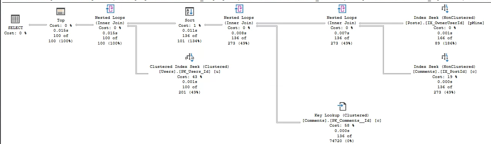

  ```sql
  Test A
    Execute Jon Skeet first
      Table 'Users'.    Scan count     0, logical reads    366, physical reads   0, read-ahead reads 64
      Table 'Comments'. Scan count 34202, logical reads 834189, physical reads 233, read-ahead reads 101368
      Table 'Posts'.    Scan count     1, logical reads     63, physical reads   3, read-ahead reads 58
      
      Time 4 se
  ```

      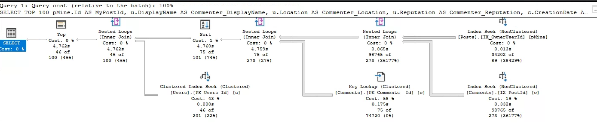

  ```sql
  /*
  . Si ejecuto 1ero Brent y despues Jon todo esta bien. Los dos demoran menos de 5 seg y usan el mismo plan
  . Si ejecuto 1ero Jon y despues Brent, Brent no termina nunca

  Posible Solutions
    . Put OPTION(RECOMPILE)
    . OPTION(OPTIMIZE FOR UNKNOWN)
    . OPTION(OPTIMIZE FOR (@UserId = 26837))
    . OPTION(OPTIMIZE FOR (pMine.OwnerUserId = @26837 AND u.Reputation >= 0 AND c.Score >= 0))
    . OPTION(OPTIMIZE FOR (u.Reputation >= 0 AND c.Score >= 0))
  */
  ```


- Task #2: find more outlier params
  Find at least 3 other sets of parameters that might cause a problem for your newly tuned stored proc.
  * Outlier users
    * SELECT TOP 1 OwnerUserID, COUNT(*) FROM dbo.Posts GROUP BY OwnerUserID ORDER BY COUNT(*) DESC
    * SELECT COUNT(*) FROM dbo.Posts GROUP BY OwnerUserID WHERE OwnerUserId = -100 (we try to find an UserId whitout records)
    * Result
      Big Data = 0 
      Tiny Data = -100

  * Outlier minimum reputations    = 1 - 6 - 17839
    * SELECT TOP 1 Reputation , COUNT(*) FROM dbo.Users GROUP BY Reputation  ORDER BY COUNT(*) DESC
    * SELECT TOP 10 Reputation FROM dbo.Users ORDER BY reputation DESC;
    * Result
      Big Data  = -100
      Tiny Data = 1029634

  * Outlier minimum comment scores = 1 - 2 - 325
    * SELECT TOP 10 Scrore FROM dbo.Comments ORDER BY Scrore DESC;
    * Result
      Big Data  = -100
      Tiny Data = 1228

- Task #3, optional: fix those too
  Can you tune it so everyone performs in <5 seconds?
  What changes might you consider making? (This one’s really hard.)

  ```sql
  /* Big Data outliers, used to get 30 seconds with his own plan */
  EXEC [dbo].[usp_MostRecentCommentsForMe] @UserId = 0, 
    @MinimumCommenterReputation = -100, @MinimumCommentScore = -100 WITH RECOMPILE;
  
  /* Small Data outliers, used to get instantaneous with his own plan */
  EXEC [dbo].[usp_MostRecentCommentsForMe] @UserId = -100, 
    @MinimumCommenterReputation = 1029634, @MinimumCommentScore = 1228 WITH RECOMPILE;
  
  /* 201 Buckets outliers, used to get instantaneous with his own plan */
  EXEC [dbo].[usp_MostRecentCommentsForMe] @UserId = 128165, 
    @MinimumCommenterReputation = 1029634, @MinimumCommentScore = 1228 WITH RECOMPILE;
  EXEC [dbo].[usp_MostRecentCommentsForMe] @UserId = 128165, 
    @MinimumCommenterReputation = -100, @MinimumCommentScore = -100 WITH RECOMPILE;
  ```

- Gotchas
  * Recompile hints are off-limits
  * You’re not allowed to drop indexes: assume all indexes are being used by other queries


# Bad Branching Causes Sniffing, Good Branching Reduces It

- Bad Branching Causes Sniffing, Good Branching Reduces It
  Index tuning and query hinting give us one plan that works well enough for some situations, but what if we really need two different plans? For example, we’ve been dodging around the problem of two different input parameters that really require two different approaches: maybe it’s small data versus big data, maybe it’s two different indexes that are better fits for different situations, or maybe it’s two different possible driver tables.

  Or, maybe our code has gotten complex enough to the point where it has an IF branch: if we’re doing daily processing, run one block of code, and if we’re doing monthly processing, run a different block of code.

  The technique of branching logic gives us the capability to get multiple stable plans without the constant overhead and amnesia of recompile hints. We’ll cover how to start introducing branching logic, dynamic SQL, and child stored procedures in order to produce different plans, and we’ll cover how bad branching actually makes things worse.

  ```sql
  USE StackOverflow;
  GO

  /* The Users table has an index on Reputation: */
  sp_BlitzIndex @TableName = 'Users'
  GO

  /* Create the Proc Test */
  CREATE OR ALTER PROC dbo.usp_RptUsersByReputation @Reputation INT AS
  BEGIN
    SELECT TOP 1000 *
    FROM dbo.Users
    WHERE Reputation = @Reputation
    ORDER BY DisplayName;
  END
  GO

  /* These two get different plans: */
  EXEC usp_RptUsersByReputation @Reputation = 2 WITH RECOMPILE; -- Small Data Plan
  EXEC usp_RptUsersByReputation @Reputation = 1 WITH RECOMPILE; -- Bid Data Plan

  /* If the big data plan goes in first, they both perform as expected: */
  sp_recompile 'usp_RptUsersByReputation';
  GO
  EXEC usp_RptUsersByReputation @Reputation = 1;
  EXEC usp_RptUsersByReputation @Reputation = 2;

  /* If the tiny data plan goes in first, then the big one sucks: */
  sp_recompile 'usp_RptUsersByReputation';
  GO
  EXEC usp_RptUsersByReputation @Reputation = 2;
  EXEC usp_RptUsersByReputation @Reputation = 1;
  GO
  ```

  So let's say we truly need different plans, and we don't want to recompile because this query is called thousands of times per minute.

  Can we put in a branch and get two different plans?

  ```sql
  /* Change SP add If to try to generate 2 plans */
  CREATE OR ALTER PROC dbo.usp_RptUsersByReputation @Reputation INT AS
  BEGIN
    IF @Reputation = 1
      SELECT TOP 1000 *
      FROM dbo.Users
      WHERE Reputation = @Reputation
      ORDER BY DisplayName;
    ELSE
      SELECT TOP 1000 *
      FROM dbo.Users
      WHERE Reputation = @Reputation
      ORDER BY DisplayName;
  END
  GO

  /* Do we still have parameter sniffing? Does it matter which one goes first? */
  sp_recompile 'usp_RptUsersByReputation';
  GO
  EXEC usp_RptUsersByReputation @Reputation = 2;
  EXEC usp_RptUsersByReputation @Reputation = 1;
  GO

  /* If I stick query hints in this, will I still have parameter sniffing? Add with(index ...) */
  CREATE OR ALTER PROC dbo.usp_RptUsersByReputation @Reputation INT AS
  BEGIN
    IF @Reputation = 1
      SELECT TOP 1000 *
      FROM dbo.Users WITH (INDEX = 1)
      WHERE Reputation = @Reputation
      ORDER BY DisplayName;
    ELSE
      SELECT TOP 1000 *
      FROM dbo.Users WITH (INDEX = IX_Reputation_Includes)
      WHERE Reputation = @Reputation
      ORDER BY DisplayName;
  END
  GO

  /* Do we still have parameter sniffing? Does it matter which one goes first? */
  sp_recompile 'usp_RptUsersByReputation';
  GO
  EXEC usp_RptUsersByReputation @Reputation = 2;
  EXEC usp_RptUsersByReputation @Reputation = 1;
  GO
  ```

  Did the big data plan:
    * Go parallel? Why?
    * Estimate the right number of rows? Why?
    * Estimate the right memory grant? Why?

  ```sql
  /* What if I build dynamic SQL? */
  CREATE OR ALTER PROC dbo.usp_RptUsersByReputation @Reputation INT AS
  BEGIN
    DECLARE @StringToExecute NVARCHAR(4000) = N'SELECT TOP 1000 * FROM dbo.Users
      WHERE Reputation = @Reputation
      ORDER BY DisplayName;';
    EXEC sp_executesql @StringToExecute, N'@Reputation INT', @Reputation;
  END
  GO

  sp_recompile 'usp_RptUsersByReputation';
  GO
  EXEC usp_RptUsersByReputation @Reputation = 2;
  EXEC usp_RptUsersByReputation @Reputation = 1;
  GO


  /* What if I build DIFFERENT dynamic SQL? THIS IS THE ONE THAT BRENT PREFER */
  CREATE OR ALTER PROC dbo.usp_RptUsersByReputation @Reputation INT AS
  BEGIN
    DECLARE @StringToExecute NVARCHAR(4000) = N'SELECT TOP 1000 * FROM dbo.Users
      WHERE Reputation = @Reputation
      ORDER BY DisplayName;';

    IF @Reputation = 1
      SET @StringToExecute = @StringToExecute + N' /* Big data */';

    EXEC sp_executesql @StringToExecute, N'@Reputation INT', @Reputation;
  END
  GO

  DBCC FREEPROCCACHE
  GO
  EXEC usp_RptUsersByReputation @Reputation = 2;
  EXEC usp_RptUsersByReputation @Reputation = 1;
  GO

  /* Turn off actual plans: */
  sp_BlitzCache;


  /* Similar tactic: different child stored procedures. */
  CREATE OR ALTER PROC dbo.usp_RptUsersByReputation @Reputation INT AS
  BEGIN
    IF @Reputation = 1
      EXEC usp_RptUsersByReputation_BigData @Reputation = @Reputation;
    ELSE
      EXEC usp_RptUsersByReputation_SmallData @Reputation = @Reputation;
  END
  GO

  /* Child 1 */
  CREATE OR ALTER PROC dbo.usp_RptUsersByReputation_BigData @Reputation INT AS
  BEGIN
    SELECT TOP 1000 *
    FROM dbo.Users
    WHERE Reputation = @Reputation
    ORDER BY DisplayName;
  END
  GO

  /* Child 2 */
  CREATE OR ALTER PROC dbo.usp_RptUsersByReputation_SmallData @Reputation INT AS
  BEGIN
    SELECT TOP 1000 *
    FROM dbo.Users
    WHERE Reputation = @Reputation
    ORDER BY DisplayName;
  END
  GO
  ```

  THE TWO CHILD STORED PROCS ARE IDENTICAL, but because they're different queries, they both get parameter sniffing independently, each producing their own execution plans:

  ```sql
  DBCC FREEPROCCACHE
  GO
  EXEC usp_RptUsersByReputation @Reputation = 2;
  EXEC usp_RptUsersByReputation @Reputation = 1;
  GO

  /* Turn off actual plans: */
  sp_BlitzCache;
  GO
  ```

  Benefits of child procs:

    * The optimal plan for both can change automatically over time
    * Or code can be hand-tuned for each one (like different optimizer hints)

  Drawbacks:

    * The same code is now in two procs, making maintainability a little harder

    * One IF branch and two child procs may not be enough: the more possible plans a query has, the more branching you're tempted to build, and it'll be hard

    * The right trigger value might change over time, like if Stack Overflow suddenly gives people 100 reputation points on joining instead of 1

  <r>Child procs are especially powerful when you have joins, and you want the join decisions to be postponed until after you've found out how many rows are in the driver table of the query:

  ```sql
  CREATE OR ALTER PROC dbo.usp_RptUsersByReputation_Joins @Reputation INT AS
  BEGIN
    SELECT TOP 1000 *
    FROM dbo.Users u
    JOIN dbo.Posts p ON u.Id = p.OwnerUserId
    JOIN dbo.Comments c ON p.Id = c.PostId
    JOIN dbo.Users uCommenter ON c.UserId = uCommenter.Id
    JOIN dbo.Badges b ON uCommenter.Id = b.UserId
    WHERE u.Reputation = @Reputation
    ORDER BY u.DisplayName;
  END
  GO

  /* 
  If you call this for @Reputation = 2, only a few users will come out, and you wouldn't mind a few index seeks on the join tables.
  If you call it for @Reputation = 1, you're better off with giant table scans and a giant memory grant.
  Start with a pre-check of how many users match in the driver table:
  */
  CREATE OR ALTER PROC dbo.usp_RptUsersByReputation_Joins @Reputation INT AS
  BEGIN
    IF 10000 < (SELECT COUNT(*) FROM dbo.Users WHERE Reputation = @Reputation)
      EXEC usp_RptUsersByReputation_Joins_BigData @Reputation = @Reputation;
    ELSE
      EXEC usp_RptUsersByReputation_Joins_SmallData @Reputation = @Reputation;
  END
  GO

  /* Or: */
  CREATE OR ALTER PROC dbo.usp_RptUsersByReputation_Joins @Reputation INT AS
  BEGIN
    CREATE TABLE #MatchingUsers (Id INT);
    INSERT INTO #MatchingUsers (Id)
      SELECT Id
      FROM dbo.Users
      WHERE Reputation = @Reputation;

    IF 10000 < (SELECT COUNT(*) FROM #MatchingUsers)
      EXEC usp_RptUsersByReputation_Joins_BigData @Reputation = @Reputation;
    ELSE
      EXEC usp_RptUsersByReputation_Joins_SmallData @Reputation = @Reputation;
  END
  GO

  /* Because then you can use the temp table in the child stored procs: */
  CREATE OR ALTER PROC dbo.usp_RptUsersByReputation_Joins_BigData @Reputation INT AS
  BEGIN
    SELECT TOP 1000 *
    FROM #MatchingUsers m
      INNER JOIN dbo.Users u ON m.Id = u.Id
      INNER JOIN dbo.Posts p ON u.Id = p.OwnerUserId
      INNER JOIN dbo.Comments c ON p.Id = c.PostId
      INNER JOIN dbo.Users uCommenter ON c.UserId = uCommenter.Id
      INNER JOIN dbo.Badges b ON uCommenter.Id = b.UserId
    WHERE u.Reputation = @Reputation
    ORDER BY u.DisplayName;
  END
  GO
  ```

## RECAP

What to take away from this demo:

  * <r>All of the code in a batch gets compiled at once initially.
  * If you want a different plan, you have to:
  	* Ask for it - like with a RECOMPILE hint
  	* Change a lot of data, forcing stats to update
  	* Postpone compilation for part of the query: (like build a child stored procedure or dynamic SQL)
	* <r>Comment injection can be super powerful and low maintenance
  * But when you do any of the above, you're building technical debt: if the data distribution changes over time, you may need to revisit the triggers you used to spawn the branching logic.

# My RECAP
  
  * Branchis you can
    * Option 1
      ```sql
      IF ....
        ....
      ELSE
        ....
      ```
    * Option 2
      ```sql
      IF ....
        .... WITH(INDEX = ....)
      ELSE
        .... WITH(INDEX = ....)
      ```
    * Option 3
      DYNAMIC QUERY
    * Option 4
      DYNAMIC QUERY + COMMENT
    * Option 5
      CHILD SP. This is good with joins

# LAB 2

  - My solution
    - Best run option is to execute on this way:
      1. Iceland                = 0  sec
      2. Hafnarfjordur, Iceland = 0  sec
      3. Germany                = 14 sec

    - If I run each one individual I got the below execution plans:
      1. Iceland
        Users + Post (Index Seek + Key Lookup)

        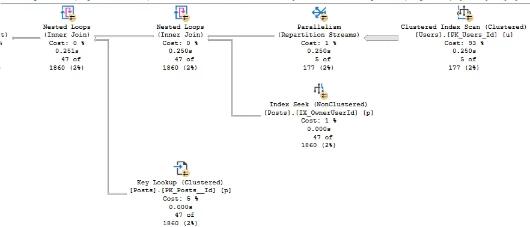

      2. Hafnarfjordur, Iceland
        Users + Post (Index Seek + Key Lookup)

        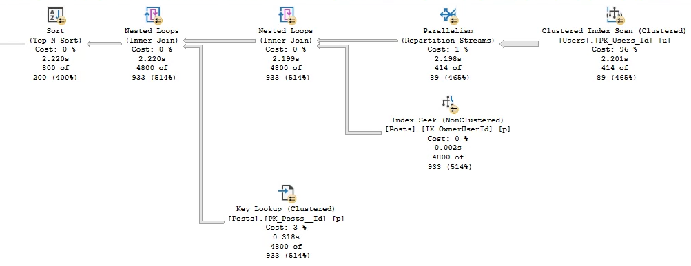

      3. Germany
        Post (Index Scan + Key Lookup) + Users

        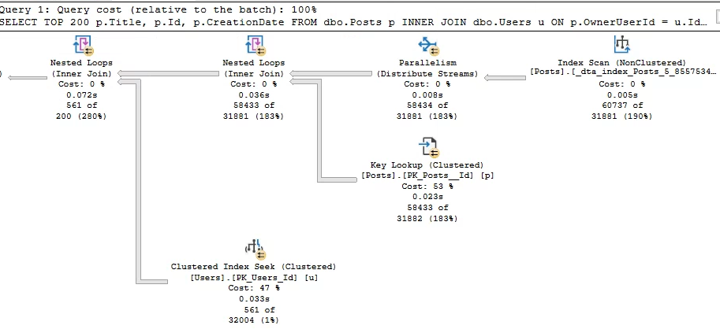
      
    - My new SP tunned
    ```sql
    CREATE OR ALTER PROC dbo.RecentPostsByLocation_Tune @Location NVARCHAR(100) 
    AS
    BEGIN
      DECLARE @StringtoExecute NVARCHAR(4000) = N'SELECT TOP 200 p.Title, p.Id, p.CreationDate
      FROM dbo.Posts p
      JOIN dbo.Users u ON p.OwnerUserId = u.Id
      WHERE u.Location = @Location
      ORDER BY p.CreationDate DESC;';

      IF @Location = 'Germany'
        SET @StringtoExecute = @StringtoExecute + '/* This is for German */'
      
      EXEC sp_executesql @StringtoExecute, N'@Location NVARCHAR(100)', @Location
    END
    GO
    ```

  - Brent Solution

  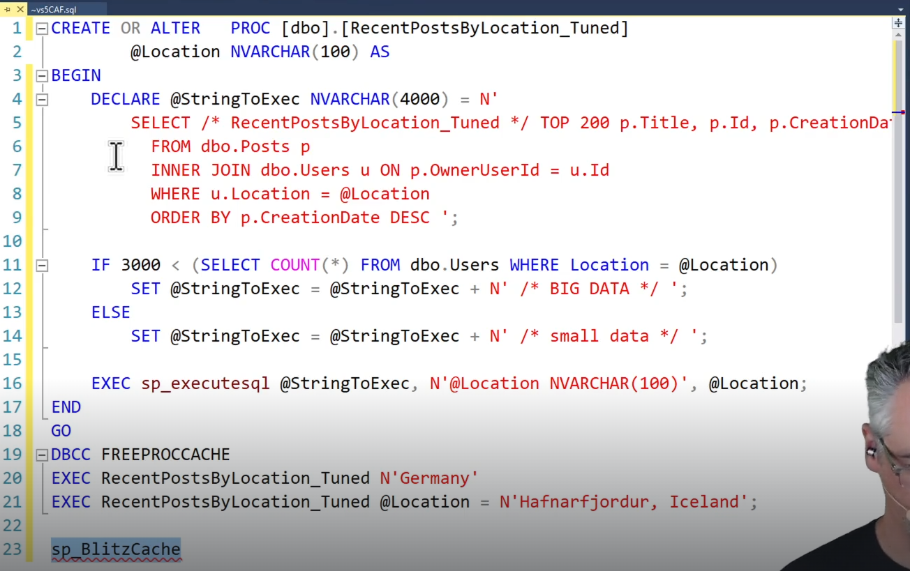

  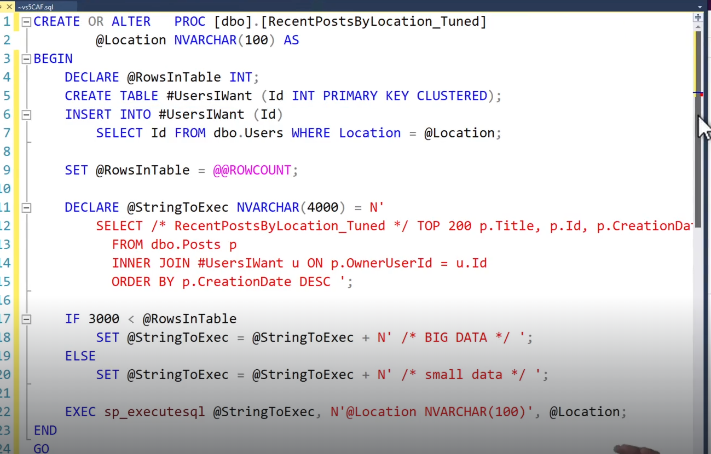

  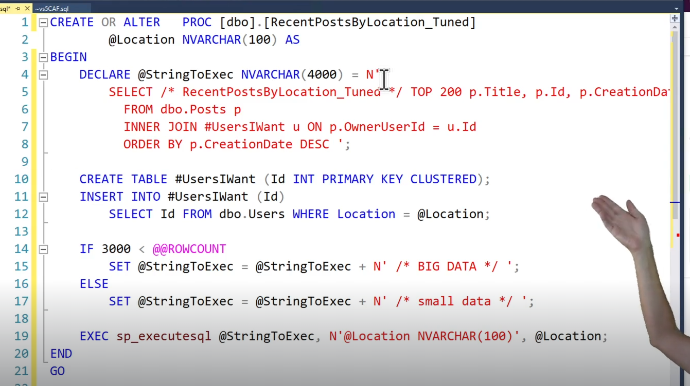

  From the second video

  Using var tables doesn't work
  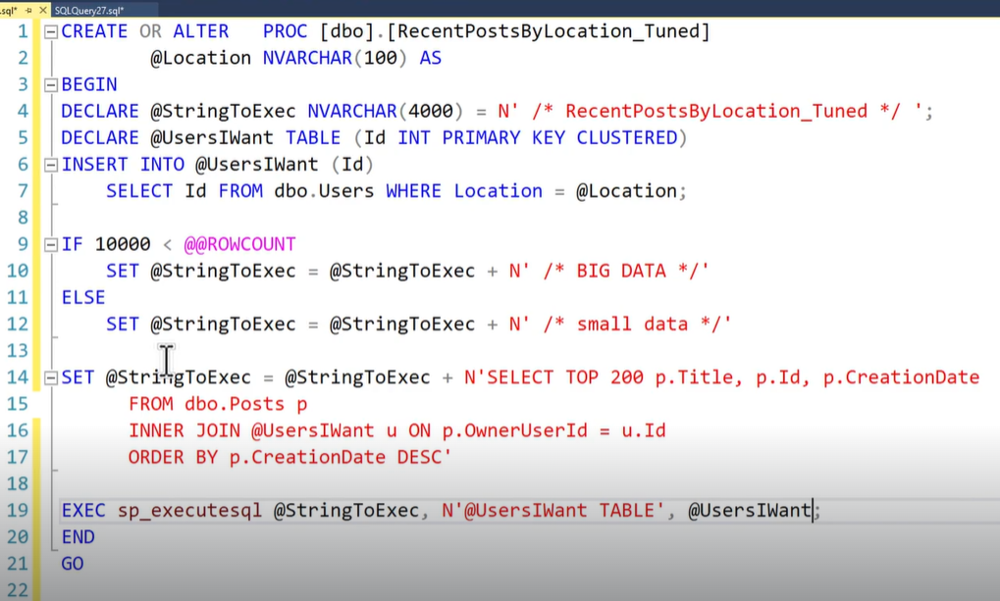

  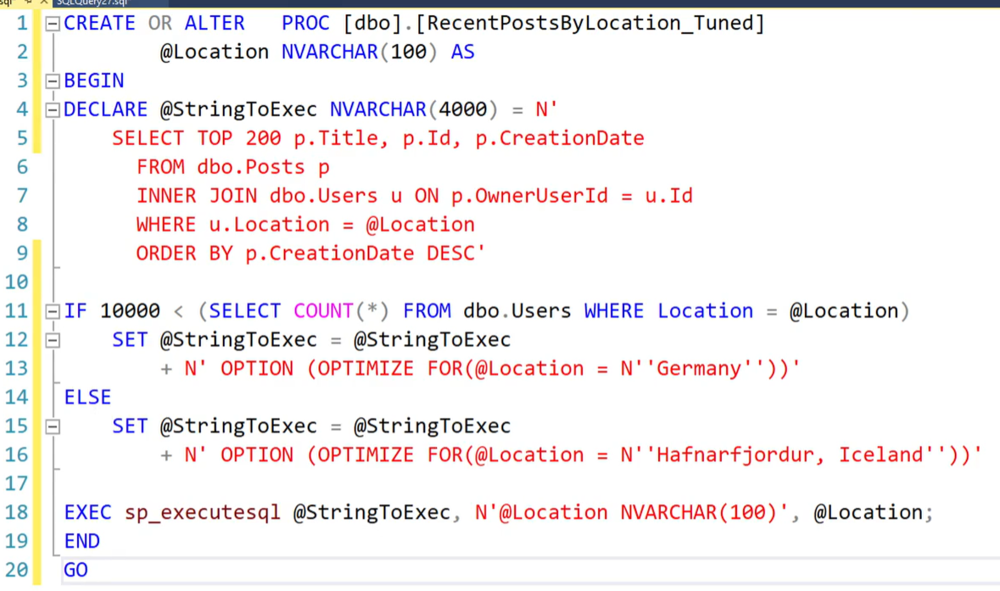

  

  Supose that we want to force a list of values that we know that never change

  ```sql
  SELECT TOP 100 N'''' + REPLACE(Location, N'''', N'''''') + N''',', COUNT(*) AS recs
  FROM dbo.Users
  WHERE Location IS NOT NULL
  group by lOCATION
  ORDER BY COUNT(*) DESC
  ```

  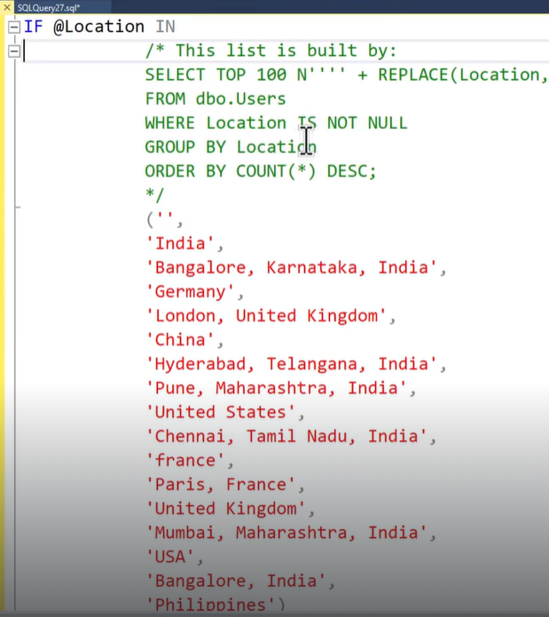

  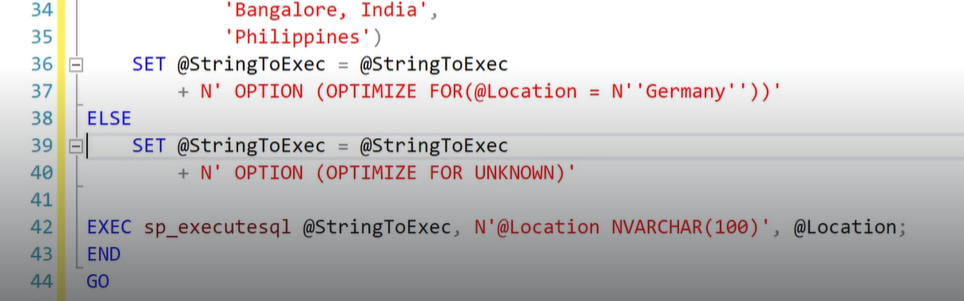

  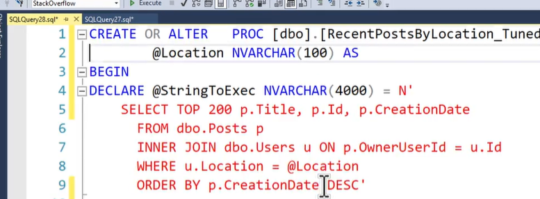

# Spotting Variable Plans in the Cache
  - In order to detect, troubleshoot, and prevent parameter sniffing issues, we’re going to need:

    - Metrics about how queries are performing
    - Different versions of the query plans that caused those metrics
    - To collect them, we’re going to go from the lowest-overhead, least-data solutions first, and then gradually progress to the collection methods that have the highest level of overhead but produce the most diagnostic data. 
    - First up: sys.dm_exec_query_stats and sys.dm_exec_query_plan_stats.

  ```sql
  /* Set the stage with the right server options & database config: */
  USE StackOverflow;
  GO
  ALTER DATABASE CURRENT SET COMPATIBILITY_LEVEL = 140; /* 2017, not 2019 yet */
  GO
  EXEC sys.sp_configure N'cost threshold for parallelism', N'50' /* Keep small queries serial */
  GO
  EXEC sys.sp_configure N'max degree of parallelism', N'4' /* Let queries go parallel */
  GO
  RECONFIGURE
  GO
  SET STATISTICS IO, TIME ON;
  GO

  /* Add a few indexes to let SQL Server choose.  This can take 4-5 minutes. */
  EXEC DropIndexes @TableName = 'Users', @ExceptIndexNames = 'Location';
  EXEC DropIndexes @TableName = 'Posts', @ExceptIndexNames = 'CreationDate,_dta_index_Posts_5_85575343__K8,IX_OwnerUserId,OwnerUserId';
  GO
  IF NOT EXISTS(SELECT * FROM sys.indexes WHERE object_id = OBJECT_ID('dbo.Users') AND name = 'Location')
    CREATE INDEX Location ON dbo.Users(Location);
  GO
  IF EXISTS(SELECT * FROM sys.indexes WHERE object_id = OBJECT_ID('dbo.Posts') AND name = N'_dta_index_Posts_5_85575343__K8')
    EXEC sp_rename @objname = N'dbo.Posts._dta_index_Posts_5_85575343__K8', @newname = N'CreationDate', @objtype = N'INDEX';
  GO
  IF EXISTS(SELECT * FROM sys.indexes WHERE object_id = OBJECT_ID('dbo.Posts') AND name = N'IX_OwnerUserId')
    EXEC sp_rename @objname = N'dbo.Posts.IX_OwnerUserId', @newname = N'OwnerUserId', @objtype = N'INDEX';
  GO
  IF NOT EXISTS(SELECT * FROM sys.indexes WHERE object_id = OBJECT_ID('dbo.Posts') AND name = 'CreationDate')
    CREATE INDEX CreationDate ON dbo.Posts(CreationDate);
  GO
  IF NOT EXISTS(SELECT * FROM sys.indexes WHERE object_id = OBJECT_ID('dbo.Posts') AND name = 'OwnerUserId')
    CREATE INDEX OwnerUserId ON dbo.Posts(OwnerUserId);
  GO


  /* Build our very sensitive proc: */
  CREATE OR ALTER PROC dbo.usp_SearchPostsByLocation 
    @Location VARCHAR(100), @StartDate DATETIME, @EndDate DATETIME AS
  BEGIN
    /* Find the most recent posts from an area */
    SELECT TOP 200 
      u.DisplayName, p.Title, p.Id, p.CreationDate
    FROM dbo.Posts p
    JOIN dbo.Users u ON p.OwnerUserId = u.Id
    WHERE 
      u.Location		LIKE @Location
    AND p.CreationDate	BETWEEN @StartDate AND @EndDate
    ORDER BY p.CreationDate DESC;
  END
  GO
  ```

  - As a reminder, these produce wildly different plans. Note differences in:
  	* Which table is processed first
  	* Parallelism or single-threaded
  	* Memory grant sizes

  ```sql
  DBCC FREEPROCCACHE;
  EXEC usp_SearchPostsByLocation 'India', @StartDate = '2008-01-01', @EndDate = '2014-01-01' WITH RECOMPILE; /* Big data, big dates */
  EXEC usp_SearchPostsByLocation 'India', @StartDate = '2009-01-01', @EndDate = '2009-02-01' WITH RECOMPILE; /* Big data, medium dates */
  EXEC usp_SearchPostsByLocation 'India', @StartDate = '2009-01-01 10:00', @EndDate = '2009-01-01 10:01' WITH RECOMPILE; /* Big data, small dates */

  EXEC usp_SearchPostsByLocation 'Netherlands', @StartDate = '2008-01-01', @EndDate = '2014-01-01' WITH RECOMPILE; /* Medium data, big dates */
  EXEC usp_SearchPostsByLocation 'Netherlands', @StartDate = '2009-01-01', @EndDate = '2009-02-01' WITH RECOMPILE; /* Medium data, medium dates */
  EXEC usp_SearchPostsByLocation 'Netherlands', @StartDate = '2009-01-01 10:00', @EndDate = '2009-01-01 10:01' WITH RECOMPILE; /* Medium data, small dates */

  EXEC usp_SearchPostsByLocation 'Near Stonehenge', @StartDate = '2008-01-01', @EndDate = '2014-01-01' WITH RECOMPILE; /* Small data, big dates */
  EXEC usp_SearchPostsByLocation 'Near Stonehenge', @StartDate = '2009-01-01', @EndDate = '2009-02-01' WITH RECOMPILE; /* Small data, medium dates */
  EXEC usp_SearchPostsByLocation 'Near Stonehenge', @StartDate = '2009-01-01 10:00', @EndDate = '2009-01-01 10:01' WITH RECOMPILE; /* Small data, small dates */

  EXEC usp_SearchPostsByLocation 'Willemstad, Curaçao', @StartDate = '2008-01-01', @EndDate = '2014-01-01' WITH RECOMPILE; /* Outlier data, big dates */
  EXEC usp_SearchPostsByLocation 'Willemstad, Curaçao', @StartDate = '2009-01-01', @EndDate = '2009-02-01' WITH RECOMPILE; /* Outlier data, medium dates */
  EXEC usp_SearchPostsByLocation 'Willemstad, Curaçao', @StartDate = '2009-01-01 10:00', @EndDate = '2009-01-01 10:01' WITH RECOMPILE; /* Outlier data, small dates */
  GO
  ```

  Note that when ALL of them are run with RECOMPILE, they finish in under 5 seconds.
  Let's put the tiny-data plan in memory, then run a few others:

  ```sql
  DBCC FREEPROCCACHE;
  GO
  EXEC usp_SearchPostsByLocation 'Near Stonehenge', @StartDate = '2009-01-01 10:00', @EndDate = '2009-01-01 10:01'; /* Small data, small dates */
  GO
  EXEC usp_SearchPostsByLocation 'Netherlands', @StartDate = '2009-01-01', @EndDate = '2009-02-01'; /* Medium data, medium dates */
  GO
  EXEC usp_SearchPostsByLocation 'Willemstad, Curaçao', @StartDate = '2009-01-01', @EndDate = '2009-02-01'; /* Outlier data, medium dates */
  GO
  EXEC usp_SearchPostsByLocation 'Willemstad, Curaçao', @StartDate = '2008-01-01', @EndDate = '2014-01-01'; /* Outlier data, big dates */
  GO
  EXEC usp_SearchPostsByLocation 'India', @StartDate = '2009-01-01', @EndDate = '2009-02-01'; /* Big data, medium dates */
  GO
  EXEC usp_SearchPostsByLocation 'India', @StartDate = '2008-01-01', @EndDate = '2014-01-01'; /* Big data, big dates */
  GO
  ```

  Run them all a few times, and then check the plan cache:
  When you are investigation Parameter Sniffing issue the below table has lot of columns to check.

  Things to note:
    * Plan_generation_num = 1  right now
    * Execution_Count	  = 11 right now 
    * Worker time		  = last/min/max (last_worker_time/min_worker_time/max_worker_time)
      Note:
      How do you know that you have parameter sniffin?
      If the same query has a wide swings in between [min_worker_time] and [max_worker_time]

    * Logical reads		  = last/min/max (last_logical_reads/min_logical_reads/max_logical_reads)
    * Elapsed time		  = last/min/max (last_elapsed_time/min_elapsed_time/max_elapsed_time/) Duration in ms
    * Total rows		    = last/min/max (bigger datasets will naturally take more time)
    * DOP				        = min/max/last (total makes no sense here)
    * Grant				      = min/max/last, used
    * Spills			      = min/max/last

	Make a note of the query_hash for later querying: 0xC3D39254FF662673

  ```sql
  SELECT * FROM sys.dm_exec_query_stats ORDER BY total_elapsed_time DESC;
  
  /* One disappointing thing to note: the contents of the plan are just the estimates. */
  SELECT qp.query_plan, qs.*
    FROM sys.dm_exec_query_stats qs
    CROSS APPLY sys.dm_exec_query_plan(qs.plan_handle) qp
    WHERE qs.query_hash = 0xC3D39254FF662673;
  GO

  /* Starting with SQL Server 2019, you can turn this on to cache (most of the) last actual plan: */
  ALTER DATABASE SCOPED CONFIGURATION SET LAST_QUERY_PLAN_STATS = ON;
  GO

  /* And run the query again: */
  DBCC FREEPROCCACHE;
  GO
  EXEC usp_SearchPostsByLocation 'Willemstad, Curaçao', @StartDate = '2008-01-01', @EndDate = '2014-01-01'; /* Outlier data, big dates */
  GO

  /* The old-school plan cache still only has the estimates: */
  SELECT qp.query_plan, qs.*
    FROM sys.dm_exec_query_stats qs
    CROSS APPLY sys.dm_exec_query_plan(qs.plan_handle) qp
    WHERE qs.query_hash = 0xC3D39254FF662673;
  GO

  /* But there's a new function in town: */
  SELECT qp.query_plan AS normally_cached_plan, qps.query_plan AS last_actual_plan, qs.*
    FROM sys.dm_exec_query_stats qs
    CROSS APPLY sys.dm_exec_query_plan(qs.plan_handle) qp
    CROSS APPLY sys.dm_exec_query_plan_stats(qs.plan_handle) qps /* THIS ONE IS NEW IN 2019 */
    WHERE qs.query_hash = 0xC3D39254FF662673;
  GO
  ```
 
  The new one shows:
    * Estimated rows vs actuals
    * Some (but not all) info on spills
    * The compiled (but not runtime) parameters this is a piece of shit

  sp_BlitzCache shows this automatically by default:

  ```sql
  sp_BlitzCache
  GO

  /* Rebuild an index on Users: */
  ALTER INDEX Location ON dbo.Users REBUILD;
  GO

  /* Check the plan cache again: */
  SELECT execution_count, plan_generation_num, * FROM sys.dm_exec_query_stats WHERE query_hash = 0xC3D39254FF662673;

  /* Note the # of executions, and plan_generation_num = 1. The rebuild of the index didn't cause a new plan to be built - YET.
  But run the stored proc again, and give it a different starting value: */
  EXEC usp_SearchPostsByLocation 'India', @StartDate = '2008-01-01', @EndDate = '2014-01-01'; /* Big data, big dates */

  /* And then check the plan cache again: */
  SELECT execution_count, plan_generation_num, * FROM sys.dm_exec_query_stats WHERE query_hash = 0xC3D39254FF662673;
  GO
  ```
 
  Ruh roh - check:
    * plan_generation_num
    * All the performance metrics, like worker time min/max/last/total

  We expose plan_generation_num at the far right:

  ```sql
  sp_BlitzCache;
  ```

  If we only have the current contents of sys.dm_exec_query_stats:

    * The plan cache is useful for spotting wild variations in CPU, reads, duration, etc.
    * The plan cache only stores the current estimated plan, not all the old ones
    * 2019 adds the last actual plan, but only if you opt into it, and it's not all actuals (no spill page counts, runtime parameters)
    * High plan_generation_num can mean you're getting frequent compiles, but...
    * Metrics reset, so you can't see how the current plan fares vs historical
    * In theory, you could look for wild variances between min/max/total/avg/last, but there are risks with that, too.

  Here's the code we use in sp_BlitzCache to trigger the parameter sniffing warning.
  The defaults:
    @parameter_sniffing_warning_pct = 30%
    @parameter_sniffing_io_threshold = 100,000 logical reads

  parameter_sniffing = 
    CASE WHEN ExecutionCount > 3 AND AverageReads > @parameter_sniffing_io_threshold
              AND min_worker_time < ((1.0 - (@parameter_sniffing_warning_pct / 100.0)) * AverageCPU) THEN 1
          WHEN ExecutionCount > 3 AND AverageReads > @parameter_sniffing_io_threshold
              AND max_worker_time > ((1.0 + (@parameter_sniffing_warning_pct / 100.0)) * AverageCPU) THEN 1
          WHEN ExecutionCount > 3 AND AverageReads > @parameter_sniffing_io_threshold
              AND MinReturnedRows < ((1.0 - (@parameter_sniffing_warning_pct / 100.0)) * AverageReturnedRows) THEN 1
          WHEN ExecutionCount > 3 AND AverageReads > @parameter_sniffing_io_threshold
              AND MaxReturnedRows > ((1.0 + (@parameter_sniffing_warning_pct / 100.0)) * AverageReturnedRows) THEN 1 END ,
  GO

  Parameter sniffing happens when a NEW plan is regenerated, and the OLD one is flushed out of the cache.
  So what we really need to do is store the plan cache contents over time. 

  I do this to clear out past instances of my monitoring tables only to make it clear what's happening while I run my demos. 
  If you're already logging sp_BlitzFirst & friends to tables, you may not want to delete your existing data.

  ```sql
  DROP TABLE IF EXISTS DBAtools.dbo.BlitzFirst;
  DROP TABLE IF EXISTS DBAtools.dbo.BlitzFirst_FileStats;
  DROP TABLE IF EXISTS DBAtools.dbo.BlitzFirst_PerfmonStats;
  DROP TABLE IF EXISTS DBAtools.dbo.BlitzFirst_WaitStats;
  DROP TABLE IF EXISTS DBAtools.dbo.BlitzCache;
  DROP TABLE IF EXISTS DBAtools.dbo.BlitzWho;
  ```

  Let's put the tiny-data plan in memory, then run a few others. This whole set will take ~60 seconds.
  ```sql
  DBCC FREEPROCCACHE;
  GO
  EXEC usp_SearchPostsByLocation 'Near Stonehenge', @StartDate = '2009-01-01 10:00', @EndDate = '2009-01-01 10:01'; /* Small data, small dates */
  GO 5
  EXEC usp_SearchPostsByLocation 'Netherlands', @StartDate = '2009-01-01', @EndDate = '2009-02-01'; /* Medium data, medium dates */
  GO 5
  EXEC usp_SearchPostsByLocation 'Willemstad, Curaçao', @StartDate = '2009-01-01', @EndDate = '2009-02-01'; /* Outlier data, medium dates */
  GO 5
  EXEC usp_SearchPostsByLocation 'India', @StartDate = '2009-01-01', @EndDate = '2009-02-01'; /* Big data, medium dates */
  GO 5
  EXEC usp_SearchPostsByLocation 'India', @StartDate = '2008-01-01', @EndDate = '2014-01-01'; /* Big data, big dates */
  GO 5
  /* This one is going to suck a little: he takes 3-5 seconds each time to run if the tiny-data plan goes in memory first. */
  EXEC usp_SearchPostsByLocation 'Willemstad, Curaçao', @StartDate = '2008-01-01', @EndDate = '2014-01-01'; /* Outlier data, big dates */
  GO 5
  ```

  If you want to track plan cache changes over time, plus track root causes for why the plan cache will clear out, you can run this every 15 minutes:

  ```sql
  EXEC dbo.sp_BlitzFirst 
    @OutputDatabaseName = 'DBAtools', 
    @OutputSchemaName	= 'dbo', 
    @OutputTableName	= 'BlitzFirst',
    @OutputTableNameFileStats	 = 'BlitzFirst_FileStats',
    @OutputTableNamePerfmonStats = 'BlitzFirst_PerfmonStats',
    @OutputTableNameWaitStats	 = 'BlitzFirst_WaitStats',
    @OutputTableNameBlitzCache	 = 'BlitzCache',
    @OutputTableNameBlitzWho	 = 'BlitzWho',
    @BlitzCacheSkipAnalysis		 = 0;
  GO
  ```

  When you call sp_BlitzFirst like this, it's really running:
  sp_BlitzCache @SortOrder = 'all', @MinutesBack = 15;
  Which logs all of these sort orders in dbo.BlitzCache:
  * CPU
  * Reads
  * Duration
  * Writes
  * Spills
  * Memory grant

  And more. It's basically finding the top 10 queries by each of those sort orders, so the most CPU-consuming, read-consuming spill-producing, etc.

  As a result, it's 50-100 queries (depending on how yours sort out) - it's not the top 10 overall, but the top 10 for ALL of those sort methods.

  For each one of those, you get its current plan and cumulative metrics. (Not the metrics for the last 15 minutes - the total metrics.)

  ```sql
  /* Check the results: */
  SELECT TOP 100 *
    FROM DBAtools.dbo.BlitzFirst
    ORDER BY CheckDate DESC, Priority ASC, FindingsGroup ASC, Finding ASC;
  GO
  SELECT TOP 100 *
    FROM DBAtools.dbo.BlitzCache
    ORDER BY CheckDate DESC, TotalCPU DESC;
  GO
  ```

  Things to note in dbo.BlitzCache:

    * All numbers are cumulative since the last capture
    * The only way to get Warnings (or anything else that involves parsing the XML) is to set @SkipAnalysis = 0, which takes 
    more time for each execution
    * If you set LAST_QUERY_PLAN_STATS = ON for a database, the QueryPlan column is the last actual plan 
    - has est vs actual rows, rough spill info, and the compiled (but not runtime) parameters

  ```sql
  /* So if something happens, and the plan gets reset: */
  ALTER INDEX Location ON dbo.Users REBUILD;
  GO

  /* And then run the proc again with a different starting value - this time, with the one that was suffering, so he gets a 
  perfect plan: */
  EXEC usp_SearchPostsByLocation 'Willemstad, Curaçao', @StartDate = '2008-01-01', @EndDate = '2014-01-01'; /* Outlier data, big dates */
  GO 5

  /* And try tiny data - he's quick: */
  EXEC usp_SearchPostsByLocation 'Near Stonehenge', @StartDate = '2008-01-01', @EndDate = '2014-01-01';
  GO 5

  /* But then run it for India, which won't do so well - 
    takes ~30 seconds just to run once: */
  EXEC usp_SearchPostsByLocation 'India', @StartDate = '2008-01-01', @EndDate = '2014-01-01'; /* Big data, big dates */
  GO

  /* Then when sp_BlitzFirst logs data to disk again: This it the job that Brent created to run every 15 min */
  EXEC dbo.sp_BlitzFirst 
    @OutputDatabaseName = 'DBAtools', 
    @OutputSchemaName = 'dbo', 
    @OutputTableName = 'BlitzFirst',
    @OutputTableNameFileStats = 'BlitzFirst_FileStats',
    @OutputTableNamePerfmonStats = 'BlitzFirst_PerfmonStats',
    @OutputTableNameWaitStats = 'BlitzFirst_WaitStats',
    @OutputTableNameBlitzCache = 'BlitzCache',
    @OutputTableNameBlitzWho = 'BlitzWho',
    @BlitzCacheSkipAnalysis = 0;
  GO

  /* You'll be able to see the different plans for this query over time: */
  SELECT * 
    FROM DBAtools.dbo.BlitzCache
    WHERE QueryHash = 0xC3D39254FF662673
    ORDER BY CheckDate DESC;
  GO
  ```

  You can use this table to find:
    * Distinct query plans (note the QueryPlanHash column)
    * Which parameters produced the plan (to build a set of testing params)
    * Total & avg reads/CPU/duration/etc per plan

  Here's an example query that will give you the top 10 queries that have burned the most CPU, and have multiple cached plans:

  ```sql
  WITH MultiplePlans AS (
    SELECT TOP 10 
        QueryHash
      , SUM(TotalCPU) AS TotalCPU
    FROM DBAtools.dbo.BlitzCache
    GROUP BY QueryHash
    HAVING COUNT(DISTINCT QueryPlanHash) > 1
    ORDER BY SUM(TotalCPU) DESC
  )
  SELECT 
      mp.TotalCPU
    , mp.QueryHash
    , bc.*
  FROM MultiplePlans mp
  JOIN DBAtools.dbo.BlitzCache bc 
  ON mp.QueryHash = bc.QueryHash
  ORDER BY 1 DESC, bc.CheckDate DESC;
  ```

  But you can't tell:
    * Which parameters each plan sucks for
    * Min/max numbers for each plan (because we're not logging it...yet)
    * Warnings for the plan (because it takes too long to examine every 15 minutes)
    * "Good" versions of the plan (because they may not be in the top ~50)

  We can augment our data a little if we happen to get lucky, and the data collection happens at the same time as a 
  long-running query.

  ```sql
  Run this 30-second query in another window: */
  EXEC usp_SearchPostsByLocation 'India', @StartDate = '2008-01-01', @EndDate = '2014-01-01'; /* Big data, big dates */
  GO

  /* While you collect data with sp_BlitzFirst: */
  EXEC dbo.sp_BlitzFirst 
    @OutputDatabaseName = 'DBAtools', 
    @OutputSchemaName = 'dbo', 
    @OutputTableName = 'BlitzFirst',
    @OutputTableNameFileStats = 'BlitzFirst_FileStats',
    @OutputTableNamePerfmonStats = 'BlitzFirst_PerfmonStats',
    @OutputTableNameWaitStats = 'BlitzFirst_WaitStats',
    @OutputTableNameBlitzCache = 'BlitzCache',
    @OutputTableNameBlitzWho = 'BlitzWho',
    @BlitzCacheSkipAnalysis = 0;
  GO
  
  /* For queries that happen to be running live, in SOME builds of SQL Server, but not 2019 CU13 & newer, we get something 
  amazing: check the live_query_plan column: */
  SELECT *
  FROM DBAtools.dbo.BlitzWho;
  ```

  Things to know:
    * THIS HAS THE RUNTIME PARAMETERS W00T
    * The plan and the metrics aren't the final metrics - they're the point-in-time when sp_BlitzWho runs
    * This requires SQL Server 2016 SP1 or higher: https://www.brentozar.com/archive/2017/10/get-live-query-plans-sp_blitzwho/

  This table also has the query hash, so you can filter just for one query:

  ```sql
  SELECT * 
    FROM DBAtools.dbo.BlitzWho
    WHERE query_hash = 0xC3D39254FF662673
    ORDER BY CheckDate DESC;
  GO
  ```

So the plan cache helps - but much more so if you log it over time.

* Set up an Agent job to run sp_BlitzFirst to table every 15 minutes, and it'll also run sp_BlitzCache, sp_BlitzWho
* The dbo.BlitzCache table has actual metrics, estimated plan, and the compiled plan (but only compiled params, not runtime)
* For really terrible queries that happen to be running when sp_BlitzFirst's scheduled job runs, the dbo.BlitzWho table adds 
  the runtime parameters, AND the current (but not total) status of that plan, which can show why those params suck for the 
  current plan
* It's up to you to assemble this data into a picture of the various plans and params for a single stored procedure.


# Lower-Impact Query Store: usp_PlanCacheAutopilot

  If you monitor the plan cache looking for outliers, you can start to automate
    
   * Identifying when a resource-intensive plan has gone into cache
   * Saving the plan and its parameters for later analysis
   * Freeing that plan from the cache automatically
   * That’s where usp_PlanCacheAutopilot comes in. Let’s talk through how to use it:

  Some Notes
    * This sp cleans the plan from cache automatically
    * Tested only on SQL 2019 and non prod
  
    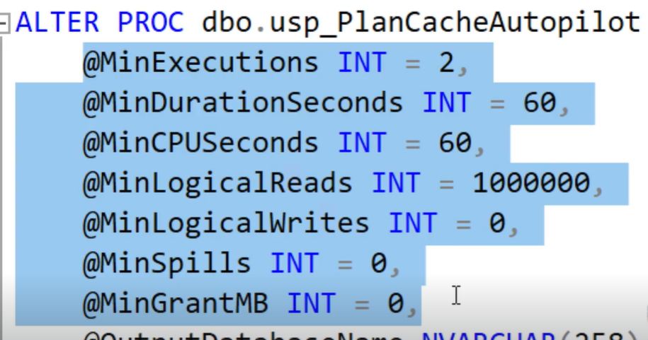

    

  ```sql
  IF OBJECT_ID('dbo.usp_PlanCacheAutopilot') IS NULL
  EXEC ('CREATE PROCEDURE dbo.usp_PlanCacheAutopilot AS RETURN 0;');
  GO

  ALTER PROC dbo.usp_PlanCacheAutopilot
    @MinExecutions INT = 2,
    @MinDurationSeconds INT = 60,
    @MinCPUSeconds INT = 60,
    @MinLogicalReads INT = 1000000,
    @MinLogicalWrites INT = 0,
    @MinSpills INT = 0,
    @MinGrantMB INT = 0,
    @OutputDatabaseName NVARCHAR(258) = 'DBAtools',
    @OutputSchemaName NVARCHAR(258) = 'dbo',
    @OutputTableName NVARCHAR(258) = 'PlanCacheAutopilot',
    @CheckDateOverride DATETIMEOFFSET = NULL,
    @LogThePlans BIT = 0,
    @ClearThePlans BIT = 0,
    @Debug BIT = 0,
    @Version VARCHAR(30) = NULL OUTPUT,
    @VersionDate DATETIME = NULL OUTPUT,
    @VersionCheckMode BIT = 0 AS
  BEGIN
  SET NOCOUNT ON;
  SET TRANSACTION ISOLATION LEVEL READ UNCOMMITTED;
  SELECT @Version = '0.01', @VersionDate = '20200604';
  DECLARE @StringToExec NVARCHAR(MAX),
    @crlf NVARCHAR(2) = NCHAR(13) + NCHAR(10),
    @CurrentPlanHandle VARBINARY(64);

  IF @CheckDateOverride IS NULL
    SET @CheckDateOverride = SYSDATETIMEOFFSET();

  /* Using DISTINCT because we may have multiple lines in qs for a single plan,
  some of which may have met our thresholds, and some not. I'm only freeing them
  if specific lines have been bad enough to meet the threshold - it isn't a 
  problem if a big proc has dozens/hundreds of fast lines that add up to meet the
  threshold in total. */
  RAISERROR('Populating #ProblemPlans.', 0, 1) WITH NOWAIT;

  CREATE TABLE #ProblemPlans (PlanHandle VARBINARY(64));
  INSERT INTO #ProblemPlans (PlanHandle)
  SELECT DISTINCT qs.plan_handle
    FROM sys.dm_exec_query_stats qs
    WHERE qs.execution_count >= @MinExecutions
      AND qs.max_elapsed_time >= (@MinDurationSeconds * 1000)
      AND qs.max_worker_time >= (@MinCPUSeconds * 1000)
      AND qs.max_logical_reads >= @MinLogicalReads
      AND qs.max_logical_writes >= @MinLogicalWrites
      AND qs.max_spills >= @MinSpills
      AND qs.max_grant_kb >= (@MinGrantMB * 1024);

  IF NOT EXISTS(SELECT * FROM #ProblemPlans)
    BEGIN
    RAISERROR('No plans found meeting the thresholds, exiting.', 0, 1) WITH NOWAIT;
    RETURN;
    END

  IF @Debug = 1
    BEGIN
    DROP TABLE IF EXISTS ##ProblemPlans;
    SELECT *
      INTO ##ProblemPlans
      FROM #ProblemPlans;
    END

  IF @LogThePlans = 1 AND EXISTS(SELECT * FROM #ProblemPlans) 
    AND @OutputDatabaseName IS NOT NULL AND @OutputSchemaName IS NOT NULL AND @OutputTableName IS NOT NULL
    BEGIN
    RAISERROR('@LogThePlans = 1, so logging the #ProblemPlans to table.', 0, 1) WITH NOWAIT;
    /* Log the plans */

    SELECT @OutputDatabaseName = QUOTENAME(@OutputDatabaseName),
      @OutputSchemaName   = QUOTENAME(@OutputSchemaName),
      @OutputTableName    = QUOTENAME(@OutputTableName);

    RAISERROR('Creating the table if it does not exist.', 0, 1) WITH NOWAIT;
      SET @StringToExec = 'USE '
          + @OutputDatabaseName
          + '; IF EXISTS(SELECT * FROM '
          + @OutputDatabaseName
          + '.INFORMATION_SCHEMA.SCHEMATA WHERE QUOTENAME(SCHEMA_NAME) = '''
          + @OutputSchemaName
          + ''') AND NOT EXISTS (SELECT * FROM '
          + @OutputDatabaseName
          + '.INFORMATION_SCHEMA.TABLES WHERE QUOTENAME(TABLE_SCHEMA) = '''
          + @OutputSchemaName + ''' AND QUOTENAME(TABLE_NAME) = '''
          + @OutputTableName + ''') CREATE TABLE '
          + @OutputSchemaName + '.'
          + @OutputTableName
          + N'(ID bigint NOT NULL IDENTITY(1,1),
      ServerName NVARCHAR(258),
      CheckDate DATETIMEOFFSET,
      plan_generation_num BIGINT,
      creation_time DATETIME,
      last_execution_time DATETIME,
      execution_count BIGINT,
      query_hash BINARY(8),
      query_plan_hash BINARY(8),
      plan_handle VARBINARY(64), 
      query_plan XML NULL,
      query_plan_last_actual XML NULL,
      total_worker_time BIGINT,
      last_worker_time BIGINT,
      min_worker_time BIGINT,
      max_worker_time BIGINT,
      total_logical_writes BIGINT,
      last_logical_writes BIGINT,
      min_logical_writes BIGINT,
      max_logical_writes BIGINT,
      total_logical_reads BIGINT,
      last_logical_reads BIGINT,
      min_logical_reads BIGINT,
      max_logical_reads BIGINT,
      total_clr_time BIGINT,
      last_clr_time BIGINT,
      min_clr_time BIGINT,
      max_clr_time BIGINT,
      total_elapsed_time BIGINT,
      last_elapsed_time BIGINT,
      min_elapsed_time BIGINT,
      max_elapsed_time BIGINT,
      total_rows BIGINT,
      last_rows BIGINT,
      min_rows BIGINT,
      max_rows BIGINT,
      total_dop BIGINT,
      last_dop BIGINT,
      min_dop BIGINT,
      max_dop BIGINT,
      total_grant_kb BIGINT,
      last_grant_kb BIGINT,
      min_grant_kb BIGINT,
      max_grant_kb BIGINT,
      total_used_grant_kb BIGINT,
      last_used_grant_kb BIGINT,
      min_used_grant_kb BIGINT,
      max_used_grant_kb BIGINT,
      total_ideal_grant_kb BIGINT,
      last_ideal_grant_kb BIGINT,
      min_ideal_grant_kb BIGINT,
      max_ideal_grant_kb BIGINT,
      total_reserved_threads BIGINT,
      last_reserved_threads BIGINT,
      min_reserved_threads BIGINT,
      max_reserved_threads BIGINT,
      total_used_threads BIGINT,
      last_used_threads BIGINT,
      min_used_threads BIGINT,
      max_used_threads BIGINT,
      total_columnstore_segment_reads BIGINT,
      last_columnstore_segment_reads BIGINT,
      min_columnstore_segment_reads BIGINT,
      max_columnstore_segment_reads BIGINT,
      total_columnstore_segment_skips BIGINT,
      last_columnstore_segment_skips BIGINT,
      min_columnstore_segment_skips BIGINT,
      max_columnstore_segment_skips BIGINT,
      total_spills BIGINT,
      last_spills BIGINT,
      min_spills BIGINT,
      max_spills BIGINT
      CONSTRAINT [PK_' +REPLACE(REPLACE(@OutputTableName,'[',''),']','') + '] PRIMARY KEY CLUSTERED(ID ASC));';

    IF @Debug = 1
      BEGIN
      PRINT SUBSTRING(@StringToExec, 0, 4000);
      PRINT SUBSTRING(@StringToExec, 4000, 8000);
      PRINT SUBSTRING(@StringToExec, 8000, 12000);
      PRINT SUBSTRING(@StringToExec, 12000, 16000);
      PRINT SUBSTRING(@StringToExec, 16000, 20000);
      PRINT SUBSTRING(@StringToExec, 20000, 24000);
      PRINT SUBSTRING(@StringToExec, 24000, 28000);
      PRINT SUBSTRING(@StringToExec, 28000, 32000);
      PRINT SUBSTRING(@StringToExec, 32000, 36000);
      PRINT SUBSTRING(@StringToExec, 36000, 40000);
      END;

    /* Creates the table */
    EXEC sp_executesql @StringToExec;

    RAISERROR('Building dynamic SQL to log plan metrics based on this version of SQL.', 0, 1) WITH NOWAIT;
      SET @StringToExec = N'USE '+ @OutputDatabaseName + '; '
      + N' WITH QueryStats AS (SELECT '
      + QUOTENAME(CAST(SERVERPROPERTY('ServerName') AS NVARCHAR(128)), N'''') + N' AS ServerName, @CheckDateOverride AS CheckDate, '
      + N' MAX(qs.plan_generation_num) AS plan_generation_num, MAX(qs.creation_time) AS creation_time, MAX(qs.last_execution_time) AS last_execution_time, MAX(qs.execution_count) AS execution_count, query_hash, query_plan_hash, qs.plan_handle, '
      + N' SUM(total_worker_time) AS total_worker_time, SUM(last_worker_time) AS last_worker_time, SUM(min_worker_time) AS min_worker_time, SUM(max_worker_time) AS max_worker_time, '
      + N' SUM(total_logical_writes) AS total_logical_writes, SUM(last_logical_writes) AS last_logical_writes, SUM(min_logical_writes) AS min_logical_writes, SUM(max_logical_writes) AS max_logical_writes, '
      + N' SUM(total_logical_reads) AS total_logical_reads, SUM(last_logical_reads) AS last_logical_reads, SUM(min_logical_reads) AS min_logical_reads, SUM(max_logical_reads) AS max_logical_reads, '
      + N' SUM(total_clr_time) AS total_clr_time, SUM(last_clr_time) AS last_clr_time, SUM(min_clr_time) AS min_clr_time, SUM(max_clr_time) AS max_clr_time, '
      + N' SUM(total_elapsed_time) AS total_elapsed_time, SUM(last_elapsed_time) AS last_elapsed_time, SUM(min_elapsed_time) AS min_elapsed_time, SUM(max_elapsed_time) AS max_elapsed_time, '
      + N' MAX(total_rows) AS total_rows, MAX(last_rows) AS last_rows, MIN(min_rows) AS min_rows, MAX(max_rows) AS max_rows, '
      + N' MAX(total_dop) AS total_dop, MAX(last_dop) AS last_dop, MIN(min_dop) AS min_dop, MAX(max_dop) AS max_dop, '
      + N' SUM(total_grant_kb) AS total_grant_kb, SUM(last_grant_kb) AS last_grant_kb, SUM(min_grant_kb) AS min_grant_kb, SUM(max_grant_kb) AS max_grant_kb, '
      + N' SUM(total_used_grant_kb) AS total_used_grant_kb, SUM(last_used_grant_kb) AS last_used_grant_kb, SUM(min_used_grant_kb) AS min_used_grant_kb, SUM(max_used_grant_kb) AS max_used_grant_kb, '
      + N' SUM(total_ideal_grant_kb) AS total_ideal_grant_kb, SUM(last_ideal_grant_kb) AS last_ideal_grant_kb, SUM(min_ideal_grant_kb) AS min_ideal_grant_kb, SUM(max_ideal_grant_kb) AS max_ideal_grant_kb, '
      + N' SUM(total_reserved_threads) AS total_reserved_threads, SUM(last_reserved_threads) AS last_reserved_threads, MIN(min_reserved_threads) AS min_reserved_threads, MAX(max_reserved_threads) AS max_reserved_threads, '
      + N' MAX(total_used_threads) AS total_used_threads, MAX(last_used_threads) AS last_used_threads, MIN(min_used_threads) AS min_used_threads, MAX(max_used_threads) AS max_used_threads, '
      + N' SUM(total_columnstore_segment_reads) AS total_columnstore_segment_reads, SUM(last_columnstore_segment_reads) AS last_columnstore_segment_reads, SUM(min_columnstore_segment_reads) AS min_columnstore_segment_reads, SUM(max_columnstore_segment_reads) AS max_columnstore_segment_reads, '
      + N' SUM(total_columnstore_segment_skips) AS total_columnstore_segment_skips, SUM(last_columnstore_segment_skips) AS last_columnstore_segment_skips, SUM(min_columnstore_segment_skips) AS min_columnstore_segment_skips, SUM(max_columnstore_segment_skips) AS max_columnstore_segment_skips, '
      + N' SUM(total_spills) AS total_spills, SUM(last_spills) AS last_spills, SUM(min_spills) AS min_spills, SUM(max_spills) AS max_spills '
      + N' FROM #ProblemPlans p INNER JOIN sys.dm_exec_query_stats qs ON p.PlanHandle = qs.plan_handle '
      + N' GROUP BY qs.plan_handle, qs.query_hash, qs.query_plan_hash ) ';

    SET @StringToExec = @StringToExec 
          + N' INSERT INTO ' + @OutputSchemaName + '.' + @OutputTableName
          + N'(ServerName, CheckDate, plan_generation_num, creation_time, last_execution_time, execution_count, query_hash, query_plan_hash, plan_handle, '
      + N' total_worker_time, last_worker_time, min_worker_time, max_worker_time, total_logical_writes, last_logical_writes, min_logical_writes, max_logical_writes, '
      + N' total_logical_reads, last_logical_reads, min_logical_reads, max_logical_reads, total_clr_time, last_clr_time, min_clr_time, max_clr_time, '
      + N' total_elapsed_time, last_elapsed_time, min_elapsed_time, max_elapsed_time, total_rows, last_rows, min_rows, max_rows, '
      + N' total_dop, last_dop, min_dop, max_dop, total_grant_kb, last_grant_kb, min_grant_kb, max_grant_kb, '
      + N' total_used_grant_kb, last_used_grant_kb, min_used_grant_kb, max_used_grant_kb, total_ideal_grant_kb, last_ideal_grant_kb, min_ideal_grant_kb, max_ideal_grant_kb, '
      + N' total_reserved_threads, last_reserved_threads, min_reserved_threads, max_reserved_threads, total_used_threads, last_used_threads, min_used_threads, max_used_threads, '
      + N' total_columnstore_segment_reads, last_columnstore_segment_reads, min_columnstore_segment_reads, max_columnstore_segment_reads, '
      + N' total_columnstore_segment_skips, last_columnstore_segment_skips, min_columnstore_segment_skips, max_columnstore_segment_skips, '
      + N' total_spills, last_spills, min_spills, max_spills, query_plan, query_plan_last_actual) '
      + N' SELECT qs.*, qp.query_plan,  ';

    IF EXISTS (SELECT * FROM sys.all_objects WHERE name = 'dm_exec_query_plan_stats')
      SET @StringToExec = @StringToExec + N' qps.query_plan AS query_plan_last_actual ';
    ELSE
      SET @StringToExec = @StringToExec + N' NULL AS query_plan_last_actual ';

    SET @StringToExec = @StringToExec 
      + N' FROM QueryStats qs '
      + N' OUTER APPLY sys.dm_exec_query_plan(qs.plan_handle) qp ';

    IF EXISTS (SELECT * FROM sys.all_objects WHERE name = 'dm_exec_query_plan_stats')
      SET @StringToExec = @StringToExec + N' OUTER APPLY sys.dm_exec_query_plan_stats(qs.plan_handle) qps; ';

    IF @Debug = 1
      BEGIN
      PRINT SUBSTRING(@StringToExec, 0, 4000);
      PRINT SUBSTRING(@StringToExec, 4000, 8000);
      PRINT SUBSTRING(@StringToExec, 8000, 12000);
      PRINT SUBSTRING(@StringToExec, 12000, 16000);
      PRINT SUBSTRING(@StringToExec, 16000, 20000);
      PRINT SUBSTRING(@StringToExec, 20000, 24000);
      PRINT SUBSTRING(@StringToExec, 24000, 28000);
      PRINT SUBSTRING(@StringToExec, 28000, 32000);
      PRINT SUBSTRING(@StringToExec, 32000, 36000);
      PRINT SUBSTRING(@StringToExec, 36000, 40000);
      END;

    RAISERROR('Running dynamic SQL to log plan metrics based on this version of SQL.', 0, 1) WITH NOWAIT;
    EXEC sp_executesql @StringToExec, N'@CheckDateOverride DATETIMEOFFSET', @CheckDateOverride;
    END

  /* AFTER saving the plans' metrics, free them: */
  IF @ClearThePlans = 1 AND EXISTS(SELECT * FROM #ProblemPlans)
    BEGIN
    RAISERROR('@ClearThePlans = 1, so clearing the plans from cache.', 0, 1) WITH NOWAIT;

    RAISERROR('Building the dynamic SQL to clear the problem plans.', 0, 1) WITH NOWAIT;
    SET @StringToExec = (SELECT N'DBCC FREEPROCCACHE (' + CONVERT(NVARCHAR(128), qs.PlanHandle, 1) + N');'
      FROM #ProblemPlans qs
      FOR XML PATH (''));

    IF @Debug = 1
      BEGIN
      PRINT SUBSTRING(@StringToExec, 0, 4000);
      PRINT SUBSTRING(@StringToExec, 4000, 8000);
      PRINT SUBSTRING(@StringToExec, 8000, 12000);
      PRINT SUBSTRING(@StringToExec, 12000, 16000);
      PRINT SUBSTRING(@StringToExec, 16000, 20000);
      PRINT SUBSTRING(@StringToExec, 20000, 24000);
      PRINT SUBSTRING(@StringToExec, 24000, 28000);
      PRINT SUBSTRING(@StringToExec, 28000, 32000);
      PRINT SUBSTRING(@StringToExec, 32000, 36000);
      PRINT SUBSTRING(@StringToExec, 36000, 40000);
      END;

    /* Frees the plan cache */
    RAISERROR('Running the dynamic SQL to clear the problem plans.', 0, 1) WITH NOWAIT;
    EXEC sp_executesql @StringToExec;

    
    END
  END

  GO

  EXEC dbo.usp_PlanCacheAutopilot
    @MinExecutions = 2,
    @MinDurationSeconds = 10,
    @MinCPUSeconds = 10,
    @MinLogicalReads = 100000,
    @MinLogicalWrites = 0,
    @MinSpills = 0,
    @MinGrantMB = 0,
    @OutputDatabaseName = 'DBAtools',
    @OutputSchemaName = 'dbo',
    @OutputTableName = 'PlanCacheAutopilot',
    @CheckDateOverride = NULL,
    @LogThePlans = 1,
    @ClearThePlans = 0,
    @Debug = 1;
  GO
  /* For debugging:

  SELECT * FROM ##ProblemPlans p
  INNER JOIN sys.dm_exec_query_stats qs ON p.PlanHandle = qs.plan_handle
  WHERE p.PlanHandle = 0x0500040040C37F1A2039DA107502000001000000000000000000000000000000000000000000000000000000
  ORDER BY p.PlanHandle;

  SELECT COUNT(*) FROM DBAtools.dbo.PlanCacheAutopilot;
  SELECT TOP 100 * FROM DBAtools.dbo.PlanCacheAutopilot;

  DROP TABLE IF EXISTS DBAtools.dbo.PlanCacheAutopilot;
  */


  /*
  MIT License

  Copyright (c) 2021 Brent Ozar Unlimited

  Permission is hereby granted, free of charge, to any person obtaining a copy
  of this software and associated documentation files (the "Software"), to deal
  in the Software without restriction, including without limitation the rights
  to use, copy, modify, merge, publish, distribute, sublicense, and/or sell
  copies of the Software, and to permit persons to whom the Software is
  furnished to do so, subject to the following conditions:

  The above copyright notice and this permission notice shall be included in all
  copies or substantial portions of the Software.

  THE SOFTWARE IS PROVIDED "AS IS", WITHOUT WARRANTY OF ANY KIND, EXPRESS OR
  IMPLIED, INCLUDING BUT NOT LIMITED TO THE WARRANTIES OF MERCHANTABILITY,
  FITNESS FOR A PARTICULAR PURPOSE AND NONINFRINGEMENT. IN NO EVENT SHALL THE
  AUTHORS OR COPYRIGHT HOLDERS BE LIABLE FOR ANY CLAIM, DAMAGES OR OTHER
  LIABILITY, WHETHER IN AN ACTION OF CONTRACT, TORT OR OTHERWISE, ARISING FROM,
  OUT OF OR IN CONNECTION WITH THE SOFTWARE OR THE USE OR OTHER DEALINGS IN THE
  SOFTWARE.
  */  
  ```

# Higher-Impact: Query Store

  The method of logging sp_BlitzFirst/Cache/Who to table will probably give you everything you need to troubleshoot the majority of parameter sniffing situations. However, sometimes you need to gather even more data, and you’re willing to pay a performance price to get it.

  Query Store is a built-in feature that can track dramatically more of the plan cache, even for queries that recompile, but it comes at a performance cost. We’ll enable it, talk about the problems with it, and show how to tell if your server is a good fit or not.

  ```sql
  /* Set the stage with the right server options & database config. If you already did this in the last module, you can keep it 
  as-is: it's the exact same indexes & proc we used in the last module. */
  USE StackOverflow;
  GO
  ALTER DATABASE CURRENT SET COMPATIBILITY_LEVEL = 140; /* 2017, not 2019 yet */
  GO
  EXEC sys.sp_configure N'cost threshold for parallelism', N'50' /* Keep small queries serial */
  GO
  EXEC sys.sp_configure N'max degree of parallelism', N'4' /* Let queries go parallel */
  GO
  RECONFIGURE
  GO
  SET STATISTICS IO, TIME ON;
  GO

  /* Add a few indexes to let SQL Server choose. This can take 4-5 minutes. */
  EXEC DropIndexes @TableName = 'Users', @ExceptIndexNames = 'Location';
  EXEC DropIndexes @TableName = 'Posts', @ExceptIndexNames = 'CreationDate,_dta_index_Posts_5_85575343__K8,IX_OwnerUserId,OwnerUserId';
  GO
  IF NOT EXISTS(SELECT * FROM sys.indexes WHERE object_id = OBJECT_ID('dbo.Users') AND name = 'Location')
    CREATE INDEX Location ON dbo.Users(Location);
  GO
  IF EXISTS(SELECT * FROM sys.indexes WHERE object_id = OBJECT_ID('dbo.Posts') AND name = N'_dta_index_Posts_5_85575343__K8')
    EXEC sp_rename @objname = N'dbo.Posts._dta_index_Posts_5_85575343__K8', @newname = N'CreationDate', @objtype = N'INDEX';
  GO
  IF EXISTS(SELECT * FROM sys.indexes WHERE object_id = OBJECT_ID('dbo.Posts') AND name = N'IX_OwnerUserId')
    EXEC sp_rename @objname = N'dbo.Posts.IX_OwnerUserId', @newname = N'OwnerUserId', @objtype = N'INDEX';
  GO
  IF NOT EXISTS(SELECT * FROM sys.indexes WHERE object_id = OBJECT_ID('dbo.Posts') AND name = 'CreationDate')
    CREATE INDEX CreationDate ON dbo.Posts(CreationDate);
  GO
  IF NOT EXISTS(SELECT * FROM sys.indexes WHERE object_id = OBJECT_ID('dbo.Posts') AND name = 'OwnerUserId')
    CREATE INDEX OwnerUserId ON dbo.Posts(OwnerUserId);
  GO
  ```

  Logging the plan cache gets you enough data to troubleshoot a lot of sniffing, but:

   * Some queries have RECOMPILE hints
   * Some servers get so much memory pressure that the plan cache is worthless
   * Some shops can't install third party scripts

  So starting with SQL Server 2016, Query Store is a built-in option that logs the plan cache to disk. It logs the data into the user database itself.

  ```sql
  /* Build our very sensitive proc, AND say someone "fixed" it with a recompile hint: */
  CREATE OR ALTER PROC dbo.usp_SearchPostsByLocation_Recompile_OUTside
    @Location VARCHAR(100), @StartDate DATETIME, @EndDate DATETIME WITH RECOMPILE AS
  BEGIN
    /* Find the most recent posts from an area */
    SELECT TOP 200 
      u.DisplayName, p.Title, p.Id, p.CreationDate
    FROM dbo.Posts p
    JOIN dbo.Users u ON p.OwnerUserId = u.Id
    WHERE u.Location LIKE @Location
    AND   p.CreationDate BETWEEN @StartDate AND @EndDate
    ORDER BY p.CreationDate DESC;
  END
  GO

  /* Free the plan cache just to make monitoring easier, then run a few variations - note no recompile hint here: */
  DBCC FREEPROCCACHE
  GO
  EXEC usp_SearchPostsByLocation_Recompile_OUTside 'Willemstad, Curaçao', @StartDate = '2008-01-01', @EndDate = '2014-01-01'; /* Outlier data, big dates */
  GO
  EXEC usp_SearchPostsByLocation_Recompile_OUTside 'Near Stonehenge', @StartDate = '2008-01-01', @EndDate = '2014-01-01'; /* Tiny data */
  GO
  EXEC usp_SearchPostsByLocation_Recompile_OUTside 'India', @StartDate = '2008-01-01', @EndDate = '2014-01-01'; /* Big data, big dates */
  GO

  /* Look in the plan cache: */
  SELECT * FROM sys.dm_exec_query_stats;
  GO
  sp_BlitzCache;
  GO
  ```

  Putting WITH RECOMPILE on the OUTSIDE of a stored procedure is TERRIBLE. (Unless you want to hide it from monitoring.)

  This is where SQL Server 2016 & newer's Query Store comes in handy. It can:

    * Catch every execution of a query, including compilation hints
    * Catch queries 24/7, not just every 15 minutes
    * Write the data into the user database itself
    * Clean out its own history based on your settings

  Let's look at the GUI, and then I'm going to enable it with these settings, BUT ONLY FOR DEMO PURPOSES. YOU SHOULD NEVER LOG EVERY MINUTE.

  ```sql
  ALTER DATABASE [StackOverflow] SET QUERY_STORE = ON
  GO
  ALTER DATABASE [StackOverflow] SET QUERY_STORE (OPERATION_MODE = READ_WRITE, DATA_FLUSH_INTERVAL_SECONDS = 60, INTERVAL_LENGTH_MINUTES = 1)
  GO

  /* 
  In case we need to clear it out during a demo: 
  ALTER DATABASE [StackOverflow] SET QUERY_STORE CLEAR;
  */

  /* Then run a bunch of our terrible outside queries that would usually disappear: */
  EXEC usp_SearchPostsByLocation_Recompile_OUTside 'India', @StartDate = '2008-01-01', @EndDate = '2014-01-01'; /* Big data, big dates */
  EXEC usp_SearchPostsByLocation_Recompile_OUTside 'India', @StartDate = '2009-01-01', @EndDate = '2009-02-01'; /* Big data, medium dates */
  EXEC usp_SearchPostsByLocation_Recompile_OUTside 'India', @StartDate = '2009-01-01 10:00', @EndDate = '2009-01-01 10:01'; /* Big data, small dates */
  EXEC usp_SearchPostsByLocation_Recompile_OUTside 'Near Stonehenge', @StartDate = '2008-01-01', @EndDate = '2014-01-01'; /* Small data, big dates */
  EXEC usp_SearchPostsByLocation_Recompile_OUTside 'Near Stonehenge', @StartDate = '2009-01-01', @EndDate = '2009-02-01'; /* Small data, medium dates */
  EXEC usp_SearchPostsByLocation_Recompile_OUTside 'Near Stonehenge', @StartDate = '2009-01-01 10:00', @EndDate = '2009-01-01 10:01'; /* Small data, small dates */
  EXEC usp_SearchPostsByLocation_Recompile_OUTside 'Willemstad, Curaçao', @StartDate = '2008-01-01', @EndDate = '2014-01-01'; /* Outlier data, big dates */
  EXEC usp_SearchPostsByLocation_Recompile_OUTside 'Willemstad, Curaçao', @StartDate = '2009-01-01', @EndDate = '2009-02-01'; /* Outlier data, medium dates */
  EXEC usp_SearchPostsByLocation_Recompile_OUTside 'Willemstad, Curaçao', @StartDate = '2009-01-01 10:00', @EndDate = '2009-01-01 10:01'; /* Outlier data, small dates */
  EXEC usp_SearchPostsByLocation_Recompile_OUTside 'Netherlands', @StartDate = '2008-01-01', @EndDate = '2014-01-01'; /* Medium data, big dates */
  EXEC usp_SearchPostsByLocation_Recompile_OUTside 'Netherlands', @StartDate = '2009-01-01', @EndDate = '2009-02-01'; /* Medium data, medium dates */
  EXEC usp_SearchPostsByLocation_Recompile_OUTside 'Netherlands', @StartDate = '2009-01-01 10:00', @EndDate = '2009-01-01 10:01'; /* Medium data, small dates */
  GO 10

  /* 
  Take a short look at where the data is being stored, and the kind of data we get: 
  */
  SELECT * FROM sys.query_store_query;
  SELECT * FROM sys.query_store_runtime_stats;
  GO
  ```

  Go into the Query Store GUI, and walk through the reports:

    * Queries With High Variations
    * Top Resource Consuming Queries

  Note that for each plan - even recompiled plans - we get the parameters!

  Pick one of the plans, and force it. Then try to run the queries again:

  ```sql
  EXEC usp_SearchPostsByLocation_Recompile_OUTside 'India', @StartDate = '2008-01-01', @EndDate = '2014-01-01'; /* Big data, big dates */
  EXEC usp_SearchPostsByLocation_Recompile_OUTside 'India', @StartDate = '2009-01-01', @EndDate = '2009-02-01'; /* Big data, medium dates */
  EXEC usp_SearchPostsByLocation_Recompile_OUTside 'India', @StartDate = '2009-01-01 10:00', @EndDate = '2009-01-01 10:01'; /* Big data, small dates */
  EXEC usp_SearchPostsByLocation_Recompile_OUTside 'Near Stonehenge', @StartDate = '2008-01-01', @EndDate = '2014-01-01'; /* Small data, big dates */
  EXEC usp_SearchPostsByLocation_Recompile_OUTside 'Near Stonehenge', @StartDate = '2009-01-01', @EndDate = '2009-02-01'; /* Small data, medium dates */
  EXEC usp_SearchPostsByLocation_Recompile_OUTside 'Near Stonehenge', @StartDate = '2009-01-01 10:00', @EndDate = '2009-01-01 10:01'; /* Small data, small dates */
  EXEC usp_SearchPostsByLocation_Recompile_OUTside 'Willemstad, Curaçao', @StartDate = '2008-01-01', @EndDate = '2014-01-01'; /* Outlier data, big dates */
  EXEC usp_SearchPostsByLocation_Recompile_OUTside 'Willemstad, Curaçao', @StartDate = '2009-01-01', @EndDate = '2009-02-01'; /* Outlier data, medium dates */
  EXEC usp_SearchPostsByLocation_Recompile_OUTside 'Willemstad, Curaçao', @StartDate = '2009-01-01 10:00', @EndDate = '2009-01-01 10:01'; /* Outlier data, small dates */
  EXEC usp_SearchPostsByLocation_Recompile_OUTside 'Netherlands', @StartDate = '2008-01-01', @EndDate = '2014-01-01'; /* Medium data, big dates */
  EXEC usp_SearchPostsByLocation_Recompile_OUTside 'Netherlands', @StartDate = '2009-01-01', @EndDate = '2009-02-01'; /* Medium data, medium dates */
  EXEC usp_SearchPostsByLocation_Recompile_OUTside 'Netherlands', @StartDate = '2009-01-01 10:00', @EndDate = '2009-01-01 10:01'; /* Medium data, small dates */
  GO 10
  ```

  The good news is that forcing a plan overrides the recompile hint!

  The bad news is that one plan may not be good for everyone.

  But that's not Query Store's fault: the problem is that there isn't one good plan that makes all of these go fast - yet, at least. That's where you will have your work cut out for you tomorrow.

  Go unforce that plan for now.

  I don't actually like the GUI for this - I much prefer sp_BlitzQueryStore:

  ```sql
  /* Get the top 10: */
  EXEC sp_BlitzQueryStore @DatabaseName = 'StackOverflow', @Top = 10

  /* Minimum execution count, duration filter (seconds) */
  EXEC sp_BlitzQueryStore 
    @DatabaseName = 'StackOverflow', 
    @Top = 10, 
    @MinimumExecutionCount = 10, 
    @DurationFilter = 2

  /* Look for a stored procedure by name, get its params quickly */
  EXEC sp_BlitzQueryStore @DatabaseName = 'StackOverflow', 
    @Top = 10, 
    @SkipXML = 1,
    @StoredProcName = 'usp_SearchPostsByLocation_Recompile_OUTside'

  /* Filter for a date range: */
  EXEC sp_BlitzQueryStore @DatabaseName = 'StackOverflow', 
    @Top = 10, 
    @StartDate = '20200530', 
    @EndDate = '20200605'
  GO

  /* You may also be able to query for all parameters that have been used for a few query plan hashes */
  ;WITH XMLNAMESPACES('http://schemas.microsoft.com/sqlserver/2004/07/showplan' AS p), [raw_data] AS (
    SELECT [p].[plan_id],
      [p].[query_plan_hash],
      CONVERT(XML, p.query_plan) AS [query_plan]
    FROM StackOverflow.sys.query_store_plan AS [p]
      INNER JOIN StackOverflow.sys.query_store_runtime_stats AS [rs] ON [p].[plan_id] = [rs].[plan_id]
    WHERE [p].[query_plan_hash] IN (0xA6B47452A5D7511F, 0xC0DC86703A611840)
  )
  SELECT DISTINCT [plan_id],
    [query_plan_hash],
    -- [query_plan],
    n.x.value('@Column', 'varchar(128)') + ' = ' + n.x.value('@ParameterCompiledValue', 'varchar(128)') [parameter]
  FROM [raw_data]
    CROSS APPLY [query_plan].nodes('//p:ParameterList/p:ColumnReference') AS n(x)
  ORDER BY [plan_id], [parameter];
  GO
  ```


  Query Store does have a performance overhead. The more queries that it has to examine, the higher the overhead will be. The worst case scenario is a workload whose queries constantly change, like unparameterized dynamic SQL.

  Here's the example from Fundamentals of Parameter Sniffing:

  ```sql
  CREATE OR ALTER PROC dbo.usp_GetUser @UserId INT = NULL, @DisplayName NVARCHAR(40) = NULL, @Location NVARCHAR(100) = NULL AS
  BEGIN
  /* They have to ask for either a UserId or a DisplayName or a Location: */
  IF @UserId IS NULL AND @DisplayName IS NULL AND @Location IS NULL
    RETURN;

  DECLARE @StringToExecute NVARCHAR(4000);
  SET @StringToExecute = N'SELECT * FROM dbo.Users WHERE 1 = 1 ';

  IF @UserId IS NOT NULL
    SET @StringToExecute = @StringToExecute + N' AND Id = ' + CAST(@UserId AS NVARCHAR(10));

  IF @DisplayName IS NOT NULL
    SET @StringToExecute = @StringToExecute + N' AND DisplayName = ''' + @DisplayName + N'''';

  IF @Location IS NOT NULL
    SET @StringToExecute = @StringToExecute + N' AND Location = ''' + @Location + N'''';

  EXEC sp_executesql @StringToExecute;
  END
  GO


  CREATE OR ALTER PROC [dbo].[usp_DynamicSQLLab] WITH RECOMPILE AS
  BEGIN
    /* Hi! You can ignore this stored procedure.
      This is used to run different random stored procs as part of your class.
      Don't change this in order to "tune" things.
    */
    SET NOCOUNT ON
  
    DECLARE @Id1 INT = CAST(RAND() * 1000000 AS INT) + 1,
        @Param1 NVARCHAR(100);

    IF @Id1 % 4 = 3
      EXEC dbo.usp_GetUser @UserId = @Id1;
    ELSE IF @Id1 % 4 = 2
      BEGIN
      SELECT @Param1 = Location FROM dbo.Users WHERE Id = @Id1 OPTION (RECOMPILE);
      EXEC dbo.usp_GetUser @Location = @Param1;
      END
    ELSE
      BEGIN
      SELECT @Param1 = DisplayName FROM dbo.Users WHERE Id = @Id1 OPTION (RECOMPILE);
      EXEC dbo.usp_GetUser @DisplayName = @Param1;
      END
  END
  GO

  /* */
  EXEC usp_DynamicSQLLab;
  GO 500
  ```

  To find out if your server is going to have a problem with constant query compilations triggering Query Store to do a lot of work, run this: https://www.brentozar.com/archive/2018/07/tsql2sday-how-much-plan-cache-history-do-you-have/

  ```sql
  SELECT TOP 50
      creation_date = CAST(creation_time AS date),
      creation_hour = CASE
                          WHEN CAST(creation_time AS date) <> CAST(GETDATE() AS date) THEN 0
                          ELSE DATEPART(hh, creation_time)
                      END,
      SUM(1) AS plans
  FROM sys.dm_exec_query_stats
  GROUP BY CAST(creation_time AS date),
          CASE
              WHEN CAST(creation_time AS date) <> CAST(GETDATE() AS date) THEN 0
              ELSE DATEPART(hh, creation_time)
          END
  ORDER BY 1 DESC, 2 DESC
  ```

  If your SQL Server is seeing 10,000 or more queries per hour, and it can only remember the last 2-4 hours of queries, then you're probably going to have a tough time with the performance overhead of Query Store. Get the queries parameterized first, or use Forced Parameterization:

  https://www.brentozar.com/training/mastering-server-tuning-wait-stats-live-3-days-recording/3-1-plan-caching-and-parameterization/

  Although ironically...if you use that, then you're going to experience parameter sniffing! Because now these queries will get reusable plans.

  What to take away from this demo:

    * Query Store can capture every possible variety of every compilation. If you need to track queries with recompile hints, it's great.

    * It does add overhead. To minimize it, read Erin Stellato's Query Store Best Practices:
    https://www.sqlskills.com/blogs/erin/query-store-best-practices/

    * If you aren't a good fit for Query Store, don't forget that sp_BlitzWho can log live query plans on 2016+ when it catches queries running during the every-15-minute capture job. It's nowhere near as good as Query Store, but it's a decent Plan B.

    * If you love Query Store, check out sp_QuickieStore: https://www.erikdarlingdata.com/sp_quickiestore/

    * In SQL Server 2022, Query Store is on by default but only for newly created databases.

# LAB 3

  ## Lab 3 Setup: Track Down Sniffing in Plan Cache History

    Now, it’s your turn: 
    We’re going to run a workload in your lab while sp_BlitzFirst collects data and Query Store runs. You’ll query the plan cache history in DBAtools.dbo.BlitzCache and BlitzWho, find queries whose plans are changing, and gather parameters & plans to use that will help you design a better plan tomorrow.

    You don’t have to fix the parameter sniffing yet. Your goal here is just to start identifying problematic queries and collecting data about them. I can’t emphasize this enough: my goal with this lab is to give you a lot of different queries, many of which can have parameter sniffing issues, so that you’ve got a wide variety of challenges over time as you revisit this lab. Don’t think that there’s only “one answer” that you need to find – here, I’m just getting you used to surveying how big the landscape is. In the real world, you would focus on big runaway queries and queries users are complaining about.

    Your goal is to use the Blitz% tables and/or Query Store to:
    
    * Identify the worst-performing query that you’d want to tune if given the chance (and don’t worry about whether or not it has parameter sniffing issues – pretty much everything in this lab does)
    * Gather at least 2 sets of parameters that are being used to call it in production
    * Gather at least 2 different execution plans that are being generated in production (estimated, or last actual, or mid-flight)
    and then turn those into me in Slack. You can use PasteThePlan.com to share query plans.

  ## My Solution

  ```sql
  /*
  Your goal is to use the Blitz% tables and/or Query Store to:

    * Identify the worst-performing query that you’d want to tune if given the chance (and don’t worry about whether or not it has parameter sniffing issues 
    – pretty much everything in this lab does)

    * Gather at least 2 sets of parameters that are being used to call it in production

    * Gather at least 2 different execution plans that are being generated in production (estimated, or last actual, or mid-flight)
      And then turn those into me in Slack. You can use PasteThePlan.com to share query plans.
  */


  /* Using Query Store */
  begin

    /* By CPU */
      -- Query
      SELECT TOP (@ResultsToShow) 
        p.CreationDate, p.Score, COALESCE(p.Title, pParent.Title) AS Title, u.DisplayName AS OwnerDisplayName
      FROM dbo.PostTypes pt
      JOIN dbo.Posts p ON pt.Id = p.PostTypeId
      LEFT OUTER JOIN dbo.Posts pParent ON p.ParentId = pParent.Id
      JOIN dbo.Users u ON p.OwnerUserId = u.Id
      WHERE pt.Type = @PostType
      AND p.CreationDate >= @StartDate
      AND p.CreationDate <= @EndDate
      ORDER BY p.CreationDate

      -- Parameter List
      <ParameterList>
        <ColumnReference Column="@ResultsToShow" ParameterDataType="int" ParameterCompiledValue="(10000)" />
        <ColumnReference Column="@EndDate" ParameterDataType="datetime" ParameterCompiledValue="'2011-11-30 00:00:00.000'" />
        <ColumnReference Column="@StartDate" ParameterDataType="datetime" ParameterCompiledValue="'2011-11-01 00:00:00.000'" />
        <ColumnReference Column="@PostType" ParameterDataType="nvarchar(50)" ParameterCompiledValue="N'Question'" />
      </ParameterList>

      <ParameterList>
        <ColumnReference Column="@ResultsToShow" ParameterDataType="int" ParameterCompiledValue="(100)" />
        <ColumnReference Column="@EndDate" ParameterDataType="datetime" ParameterCompiledValue="'2011-11-02 00:00:00.000'" />
        <ColumnReference Column="@StartDate" ParameterDataType="datetime" ParameterCompiledValue="'2011-11-01 00:00:00.000'" />
        <ColumnReference Column="@PostType" ParameterDataType="nvarchar(50)" ParameterCompiledValue="N'ModeratorNomination'" />
      </ParameterList>


    /* By Memory Consuption */
      -- Query
      SELECT TOP 10 r.ResponseTimeSeconds, pQuestion.Title, pQuestion.CreationDate, pQuestion.Body,
      uQuestion.DisplayName AS Questioner_DisplayName, uQuestion.Reputation AS Questioner_Reputation,
      pAnswer.Body AS Answer_Body, pAnswer.Score AS Answer_Score,
      uAnswer.DisplayName AS Answerer_DisplayName, uAnswer.Reputation AS Answerer_Reputation
      FROM dbo.AverageAnswerResponseTime r
      INNER JOIN dbo.Posts pQuestion ON r.Id = pQuestion.Id
      INNER JOIN dbo.Users uQuestion ON pQuestion.OwnerUserId = uQuestion.Id
      INNER JOIN dbo.Posts pAnswer ON pQuestion.AcceptedAnswerId = pAnswer.Id
      INNER JOIN dbo.Users uAnswer ON pAnswer.OwnerUserId = uAnswer.Id
      WHERE r.QuestionDate >= @StartDate
      AND r.QuestionDate < @EndDate
      AND r.Tags = @Tag
      ORDER BY r.ResponseTimeSeconds ASC

      -- Parameter List
      <ParameterList>
        <ColumnReference Column="@Tag" ParameterDataType="nvarchar(50)" ParameterCompiledValue="N'&lt;sql-server&gt;'" />
        <ColumnReference Column="@EndDate" ParameterDataType="datetime" ParameterCompiledValue="'2017-05-14 00:00:00.000'" />
        <ColumnReference Column="@StartDate" ParameterDataType="datetime" ParameterCompiledValue="'2017-05-13 00:00:00.000'" />
      </ParameterList>

      <ParameterList>
        <ColumnReference Column="@Tag" ParameterDataType="nvarchar(50)" ParameterCompiledValue="N'&lt;sql-server&gt;'" />
        <ColumnReference Column="@EndDate" ParameterDataType="datetime" ParameterCompiledValue="'2018-01-16 00:00:00.000'" />
        <ColumnReference Column="@StartDate" ParameterDataType="datetime" ParameterCompiledValue="'2017-07-16 00:00:00.000'" />
      </ParameterList>


    /* By Memory on TEMPDB */
      -- Query
      SELECT TOP 250 *
        FROM dbo.PostTypes pt 
        INNER JOIN dbo.Posts p ON pt.Id = p.PostTypeId
        WHERE p.CreationDate >= @StartDate
        AND p.CreationDate < @EndDate
        AND pt.Type = @PostTypeName
        ORDER BY AnswerCount DESC

      -- Parameter List
      <ParameterList>
        <ColumnReference Column="@PostTypeName" ParameterDataType="varchar(50)" ParameterCompiledValue="'Question'" />
        <ColumnReference Column="@EndDate" ParameterDataType="datetime" ParameterCompiledValue="'2017-06-16 00:00:00.000'" />
        <ColumnReference Column="@StartDate" ParameterDataType="datetime" ParameterCompiledValue="'2017-06-15 00:00:00.000'" />
      </ParameterList>

      <ParameterList>
        <ColumnReference Column="@PostTypeName" ParameterDataType="varchar(50)" ParameterCompiledValue="'Answer'" />
        <ColumnReference Column="@EndDate" ParameterDataType="datetime" ParameterCompiledValue="'2017-09-24 00:00:00.000'" />
        <ColumnReference Column="@StartDate" ParameterDataType="datetime" ParameterCompiledValue="'2017-09-23 00:00:00.000'" />
      </ParameterList>
  end


  /* sp_BlitzFirst Job */

    /* By CPU */
    SELECT 
      QueryType, Warnings, DatabaseName, AverageCPU, TotalCPU, PercentCPUByType, CPUWeight, ExecutionCount, PlanHandle, 
      SqlHandle, QueryText, QueryPlan, NumberOfPlans, NumberOfDistinctPlans
    FROM DBAtools.dbo.BlitzCache
    WHERE Pattern = 'CPU'
    ORDER BY AverageCPU DESC

    -- Query
    Is the same
    Statement (parent [dbo].[usp_SearchPostsByPostType])

    -- Patameters are different
      <ParameterList>
          <ColumnReference Column="@ResultsToShow" ParameterDataType="int" ParameterCompiledValue="(10000)" />
          <ColumnReference Column="@EndDate" ParameterDataType="datetime" ParameterCompiledValue="'2011-11-30 00:00:00.000'" />
          <ColumnReference Column="@StartDate" ParameterDataType="datetime" ParameterCompiledValue="'2011-11-01 00:00:00.000'" />
          <ColumnReference Column="@PostType" ParameterDataType="nvarchar(50)" ParameterCompiledValue="N'ModeratorNomination'" />
      </ParameterList>

  ```

  ## Brent Solution


# Memory Grant Feedback
  
  On day 1, we implemented monitoring to start collecting plans having parameter sniffing issues. To keep things simple, we kept the compatibility level at 2017. Now let’s start exploring the features that SQL Server 2019 brings to the table – in spirit, they’re supposed to help SQL Server adapt to varying amounts of data moving through an execution plan. In practice, they mean even more changes to query plans, and they can backfire, hard.

  First up: memory grant feedback helps balance between TempDB spills and RESOURCE_SEMAPHORE poison waits. Well, that’s what the brochure says, anyway, but it turns out that it multiplies parameter sniffing problems in OLTP environments, making even predictable plans behave unpredictably.

  Introduction to Memory Grants
  If you haven’t been through Mastering Query Tuning, where we discuss how memory grants, this short primer will get you up to speed first:

  ```sql
  /*
  Mastering Parameter Sniffing
  How Adaptive Memory Grants Mitigate Parameter Sniffing

  v1.4 - 2022-06-07

  https://www.BrentOzar.com/go/mastersniffing


  This demo requires:
  * SQL Server 2019 or newer
    (there's a SQL Server 2022 section, but that's optional)
  * 2018-06 Stack Overflow database: https://www.BrentOzar.com/go/querystack

  This first RAISERROR is just to make sure you don't accidentally hit F5 and
  run the entire script. You don't need to run this:
  */
  RAISERROR(N'Oops! No, don''t just hit F5. Run these demos one at a time.', 20, 1) WITH LOG;
  GO


  /* Set the stage with the right server options & database config.
  If you already did this in the last module, you can keep it as-is:
  it's the exact same indexes & proc we used in the last module. */
  USE StackOverflow;
  GO
  EXEC DropIndexes @TableName = 'Users', @ExceptIndexNames = 'Location';
  EXEC DropIndexes @TableName = 'Posts', @ExceptIndexNames = 'CreationDate,_dta_index_Posts_5_85575343__K8,IX_OwnerUserId,OwnerUserId';
  GO
  IF NOT EXISTS(SELECT * FROM sys.indexes WHERE object_id = OBJECT_ID('dbo.Users') AND name = 'Location')
    CREATE INDEX Location ON dbo.Users(Location);
  GO
  IF EXISTS(SELECT * FROM sys.indexes WHERE object_id = OBJECT_ID('dbo.Posts') AND name = N'_dta_index_Posts_5_85575343__K8')
    EXEC sp_rename @objname = N'dbo.Posts._dta_index_Posts_5_85575343__K8', @newname = N'CreationDate', @objtype = N'INDEX';
  GO
  IF EXISTS(SELECT * FROM sys.indexes WHERE object_id = OBJECT_ID('dbo.Posts') AND name = N'IX_OwnerUserId')
    EXEC sp_rename @objname = N'dbo.Posts.IX_OwnerUserId', @newname = N'OwnerUserId', @objtype = N'INDEX';
  GO
  IF NOT EXISTS(SELECT * FROM sys.indexes WHERE object_id = OBJECT_ID('dbo.Posts') AND name = 'CreationDate')
    CREATE INDEX CreationDate ON dbo.Posts(CreationDate);
  GO
  IF NOT EXISTS(SELECT * FROM sys.indexes WHERE object_id = OBJECT_ID('dbo.Posts') AND name = 'OwnerUserId')
    CREATE INDEX OwnerUserId ON dbo.Posts(OwnerUserId);
  GO
  ALTER DATABASE CURRENT SET COMPATIBILITY_LEVEL = 140; /* 2017, not 2019 yet */
  GO
  EXEC sys.sp_configure N'cost threshold for parallelism', N'50' /* Keep small queries serial */
  GO
  EXEC sys.sp_configure N'max degree of parallelism', N'4' /* Let queries go parallel */
  GO
  RECONFIGURE
  GO

  /* Our regular sensitive proc: */
  CREATE OR ALTER PROC dbo.usp_SearchPostsByLocation
    @Location VARCHAR(100), @StartDate DATETIME, @EndDate DATETIME AS
  BEGIN
  /* Find the most recent posts from an area */
  SELECT TOP 200 u.DisplayName, p.Title, p.Id, p.CreationDate,
    /* I added these columns to get a bigger sort: */
    u.Location, u.WebsiteUrl, u.AboutMe, u.EmailHash, p.Body
    FROM dbo.Posts p
    INNER JOIN dbo.Users u ON p.OwnerUserId = u.Id
    WHERE u.Location LIKE @Location
      AND p.CreationDate BETWEEN @StartDate AND @EndDate
    ORDER BY p.CreationDate DESC;
  END
  GO


  /* I'm going to call this with recompile to show that some plan variations will
  need a memory grant for the sort, and some will not: */

  /* No sort - using the p.CreationDate index for the sort: */
  EXEC usp_SearchPostsByLocation 'India', @StartDate = '2008-01-01', @EndDate = '2014-01-01' WITH RECOMPILE; /* Big data, big dates */
  EXEC usp_SearchPostsByLocation 'India', @StartDate = '2009-01-01', @EndDate = '2009-02-01' WITH RECOMPILE; /* Big data, medium dates */
  EXEC usp_SearchPostsByLocation 'India', @StartDate = '2009-01-01 10:00', @EndDate = '2009-01-01 10:01' WITH RECOMPILE; /* Big data, small dates */

  /* These DO have a sort, so their grant size varies based on the data volume: */ 
  EXEC usp_SearchPostsByLocation 'Netherlands', @StartDate = '2008-01-01', @EndDate = '2014-01-01' WITH RECOMPILE; /* Medium data, big dates */
  EXEC usp_SearchPostsByLocation 'Netherlands', @StartDate = '2009-01-01', @EndDate = '2009-02-01' WITH RECOMPILE; /* Medium data, medium dates */
  /* No sort here: */
  EXEC usp_SearchPostsByLocation 'Netherlands', @StartDate = '2009-01-01 10:00', @EndDate = '2009-01-01 10:01' WITH RECOMPILE; /* Medium data, small dates */

  /* Sort w/grant: */ 
  EXEC usp_SearchPostsByLocation 'Near Stonehenge', @StartDate = '2008-01-01', @EndDate = '2014-01-01' WITH RECOMPILE; /* Small data, big dates */
  EXEC usp_SearchPostsByLocation 'Near Stonehenge', @StartDate = '2009-01-01', @EndDate = '2009-02-01' WITH RECOMPILE; /* Small data, medium dates */
  /* No sort, no grant: */
  EXEC usp_SearchPostsByLocation 'Near Stonehenge', @StartDate = '2009-01-01 10:00', @EndDate = '2009-01-01 10:01' WITH RECOMPILE; /* Small data, small dates */
  
  /* Sort w/grant, spills: */
  EXEC usp_SearchPostsByLocation 'Willemstad, Curaçao', @StartDate = '2008-01-01', @EndDate = '2014-01-01' WITH RECOMPILE; /* Outlier data, big dates */
  /* Sort w/grant: */
  EXEC usp_SearchPostsByLocation 'Willemstad, Curaçao', @StartDate = '2009-01-01', @EndDate = '2009-02-01' WITH RECOMPILE; /* Outlier data, medium dates */
  EXEC usp_SearchPostsByLocation 'Willemstad, Curaçao', @StartDate = '2009-01-01 10:00', @EndDate = '2009-01-01 10:01' WITH RECOMPILE; /* Outlier data, small dates */
  GO


  /* So in terms of memory grants & spills, my two worst cases are:

  * The Tiny Grant That Constantly Spills to TempDB
    1. Parameters are used that ask for a tiny memory grant
    2. Other parameters need a HUGE grant, but don't get it
    3. When they run, they spill to TempDB and take forever
    General symptom: unhappy users

  * The Big Unused Grant:
    1. Parameters are used that ask for a large memory grant
    2. Other parameters don't need the grant
    3. SQL Server ends up leaving all the memory unused every time the query runs,
      causing RESOURCE_SEMAPHORE waits. More info: 
      https://www.brentozar.com/training/mastering-server-tuning-wait-stats-live-3-days-recording/2-5-memory-waits-resource_semaphore-38m/
    General symptom: unhappy sysadmins, low PLE.

  We'll show the tiny grant first. Put a tiny grant plan in memory.
  Which one should we use? */

  EXEC sp_recompile 'usp_SearchPostsByLocation';
  GO
  /* Tiny grant goes in - check actual plan: */
  EXEC usp_SearchPostsByLocation 'Near Stonehenge', @StartDate = '2009-01-01', @EndDate = '2009-02-01';
  GO
  /* Now call it for big data: */
  EXEC usp_SearchPostsByLocation 'India', @StartDate = '2008-01-01', @EndDate = '2014-01-01';
  GO

  /* Well, that's not good. And try it again, and the same thing happens: */
  EXEC usp_SearchPostsByLocation 'India', @StartDate = '2008-01-01', @EndDate = '2014-01-01';
  GO


  /* That's the tiny-grant, big-spill situation.

  Now let's see the opposite: a query that wants a large memory grant goes in first,
  and then other parameters don't use it: */
  EXEC sp_recompile 'usp_SearchPostsByLocation';
  GO
  /* This gets a grant: */
  EXEC usp_SearchPostsByLocation 'Netherlands', @StartDate = '2008-01-01', @EndDate = '2014-01-01'; /* Medium data, big dates */
  GO
  /* Now run it for tiny data: */
  EXEC usp_SearchPostsByLocation 'Near Stonehenge', @StartDate = '2009-01-01', @EndDate = '2009-02-01';
  GO
  /* And note the  yellow bang on the plan - we're just not using that memory.
  Well, honestly, that isn't a big grant though - and if we run it for big data,
  we actually do use it: */
  EXEC usp_SearchPostsByLocation 'India', @StartDate = '2008-01-01', @EndDate = '2014-01-01';
  GO


  /* That's how everything worked up to SQL Server 2019.

  In SQL Server 2016, Microsoft introduced adaptive memory grants, but they only
  activated 'em for queries that had a columnstore index on one of the tables,
  because that activated Batch Mode processing.
  */
  CREATE NONCLUSTERED COLUMNSTORE INDEX NCCI_Empty ON dbo.Users(Age) WHERE Age = -1;
  GO
  SELECT * FROM dbo.Users WHERE Age = -1;
  GO
  /* Nada. But that empty filtered index - just the presence of it - means that
  SQL Server will suddenly consider Batch Mode, even on 2017 compat level.

  Sometimes that helps! Let's take a look: */
  EXEC sp_recompile 'usp_SearchPostsByLocation';
  GO
  EXEC usp_SearchPostsByLocation 'Netherlands', @StartDate = '2008-01-01', @EndDate = '2014-01-01'; /* Medium data, big dates */
  GO


  /* Things to keep in mind:

  * My query doesn't refer to Age
  * My query doesn't use that index on Age, nor any statistics on Age
  * I'm still on 2017 compat level
  * NOTHING ABOUT MY QUERY SHOULD HAVE GONE SO TERRIBLY WRONG

  To see what's happening, run this in another window and look at the plan,
  hovering your mouse over each operator, looking at Batch Mode, AND look at
  the memory grant this query gets:
  */
  sp_BlitzWho;
  GO


  /* The good news, is, uh, ... we didn't spill to disk.

  The bad news is:
  * Memory grant size
  * Memory grant used
  * Users are gathering at the door with pitchforks

  There's a silver lining though: Batch Mode enables adaptive memory grants:
  * Desired memory	= 
  * Requested memory	= 
  * Granted memory	= 
  * Used memory		= 

  And run it again: */
  EXEC usp_SearchPostsByLocation 'Netherlands', @StartDate = '2008-01-01', @EndDate = '2014-01-01'; /* Medium data, big dates */
  GO

  /* But I think the empty nonclustered columnstore index trick is a REALLY bad
  way to get adaptive grants. Let's drop that and do it the right way: */
  DROP INDEX NCCI_Empty ON dbo.Users;
  GO
  ALTER DATABASE CURRENT SET COMPATIBILITY_LEVEL = 150; /* 2019, which enables adaptive grants on rowstore indexes */
  GO
  /* And try it again: */
  EXEC usp_SearchPostsByLocation 'Netherlands', @StartDate = '2008-01-01', @EndDate = '2014-01-01'; /* Medium data, big dates */
  GO
  /* Make a note:
  * Desired memory	= 
  * Requested memory	= 
  * Granted memory	= 
  * Used memory		= 

  And run it again: */
  EXEC usp_SearchPostsByLocation 'Netherlands', @StartDate = '2008-01-01', @EndDate = '2014-01-01'; /* Medium data, big dates */
  GO
  /* Well, it's, uh, "adapting" alright. Third try's a charm, maybe? */
  EXEC usp_SearchPostsByLocation 'Netherlands', @StartDate = '2008-01-01', @EndDate = '2014-01-01'; /* Medium data, big dates */
  GO
  /* As you continue to run it, it will continue to adapt. However, it's always
  adapting to the LAST time the query ran. Now try it with tiny data: */
  EXEC usp_SearchPostsByLocation 'Near Stonehenge', @StartDate = '2009-01-01', @EndDate = '2009-02-01';
  GO
  /* SQL Server goes into a full on panic, thinking it WAY overestimated.
  It'll "fix" that next time around, lowering the grant: */
  EXEC usp_SearchPostsByLocation 'Near Stonehenge', @StartDate = '2009-01-01', @EndDate = '2009-02-01';
  GO

  /* But now call it for big data, and it'll spill to disk: */
  EXEC usp_SearchPostsByLocation 'India', @StartDate = '2008-01-01', @EndDate = '2014-01-01';
  GO

  /* Spotting this can be really tricky. Turn off actual plans: */
  sp_BlitzCache @SortOrder = 'spills';
  GO
  /* Things to look for:

  * Wide variance in spills to disk
  * Wide variance between min & max memory grant KB

  To learn more about this feature:
  https://docs.microsoft.com/en-us/sql/relational-databases/performance/intelligent-query-processing?view=sql-server-ver15#row-mode-memory-grant-feedback

  To turn it off for specific queries:
  OPTION (USE HINT ('DISABLE_ROW_MODE_MEMORY_GRANT_FEEDBACK')); 

  To turn it off for the database altogether while keeping 2019 compat level: */
  ALTER DATABASE SCOPED CONFIGURATION 
    SET ROW_MODE_MEMORY_GRANT_FEEDBACK = OFF;
  ALTER DATABASE SCOPED CONFIGURATION 
    SET BATCH_MODE_MEMORY_GRANT_FEEDBACK = OFF;
  GO


  /* SQL Server 2022 tried to fix this problem
  by using percentile-based changes rather than
  huge swings:
  https://docs.microsoft.com/en-us/sql/relational-databases/performance/intelligent-query-processing?view=sql-server-ver16#percentile-and-persistence-mode-memory-grant-feedback

  To turn it on: */
  ALTER DATABASE CURRENT SET COMPATIBILITY_LEVEL = 160;

  /* These already default to on in 160,
  but I leave 'em here in case you turned 'em off: */
  ALTER DATABASE SCOPED CONFIGURATION 
    SET ROW_MODE_MEMORY_GRANT_FEEDBACK = ON;
  ALTER DATABASE SCOPED CONFIGURATION 
    SET BATCH_MODE_MEMORY_GRANT_FEEDBACK = ON;

  /* Save grants to Query Store so they show up
  on failovers, restarts, etc. Requires Query Store
  to be on, which is on by default in the 2018-06
  training copy of the database: */
  ALTER DATABASE SCOPED CONFIGURATION
    SET MEMORY_GRANT_FEEDBACK_PERSISTENCE = ON;
  GO

  /* Smaller grant swing sizes: */
  ALTER DATABASE SCOPED CONFIGURATION
    SET MEMORY_GRANT_FEEDBACK_PERCENTILE = ON;

  /* That above doesn't work yet in CTP 2.0, 
  but oddly, it shows as on: */
  SELECT * FROM sys.database_scoped_configurations
    WHERE name LIKE '%MEMORY%';
  GO

  /* Let's see if it works in small percentile swings.
  Run the tiny grant first: */
  EXEC usp_SearchPostsByLocation 'Near Stonehenge', @StartDate = '2009-01-01', @EndDate = '2009-02-01';
  GO
  /* Now call it for big data: */
  EXEC usp_SearchPostsByLocation 'India', @StartDate = '2008-01-01', @EndDate = '2014-01-01';
  GO

  /* That's still not fixed - but run it again: */
  EXEC usp_SearchPostsByLocation 'India', @StartDate = '2008-01-01', @EndDate = '2014-01-01';
  GO

  /* The swing was giant! Try big again: */
  EXEC usp_SearchPostsByLocation 'India', @StartDate = '2008-01-01', @EndDate = '2014-01-01';
  GO
  /* Now we're making smaller percentile changes.
  That's the 2022 improvement.

  But try it again for tiny data: */
  EXEC usp_SearchPostsByLocation 'Near Stonehenge', @StartDate = '2009-01-01', @EndDate = '2009-02-01';
  GO

  /* Then for big: */
  EXEC usp_SearchPostsByLocation 'India', @StartDate = '2008-01-01', @EndDate = '2014-01-01';
  GO

  /* It didn't drop all the way down to zero!
  Percentile grants are an improvement over 2019. */


  /* 
  What to take away from this demo:

  * Batch Mode Memory Grant Feedback was a really useful feature in 2016-2017
    because columnstore indexes got HUGE memory grants back then.

  * I'm not a fan of the empty columnstore index trick to get batch mode on
    rowstore tables: it can backfire pretty hard. (I'm a fan of batch mode where
    it's appropriate, but 2-3 second OLTP queries ain't where it's at yet.)

  * Row Mode Memory Grant Feedback is a lot sketchier. If you have parameter-
    sensitive queries, you can ride the grant rollercoaster and performance can
    be way worse than a single stable grant (either too high or too low.)

  * In 2019, I turn this off at OLTP shops, but love it for reporting systems.
    In 2022, it's more qualified for everybody.

  * Mostly I just want you to be aware that the feature exists, and that it
    CAUSES (not cures) parameter sniffing problems by making a predictable plan
    less predictable (and more worse.)

  */


  /*
  License: Creative Commons Attribution-ShareAlike 4.0 International (CC BY-SA 4.0)
  More info: https://creativecommons.org/licenses/by-sa/4.0/

  You are free to:
  * Share - copy and redistribute the material in any medium or format
  * Adapt - remix, transform, and build upon the material for any purpose, even 
    commercially

  Under the following terms:
  * Attribution - You must give appropriate credit, provide a link to the license, 
    and indicate if changes were made. You may do so in any reasonable manner, 
    but not in any way that suggests the licensor endorses you or your use.
  * ShareAlike - If you remix, transform, or build upon the material, you must
    distribute your contributions under the same license as the original.
  */
  ```

# Adaptive Joins

  It takes a lot of work on your part to cache multiple plans for the same query. SQL Server 2017 adds a feature to make it easier, automatically, by watching out for situations where the amount of data coming out of one table might influence whether it should do an index seek or a scan on a specific table.

  It’s important to understand what this ISN’T:

   * It’s not a choice between an index seek + key lookup vs a table scan
   * It’s not a choice between which table to process first (or next)
   * It’s not a dynamic memory grant for the amount of rows that are moving through (and in fact, this operator has a new chance to spill to disk)
   * But as long as you understand what they ARE, then you can try to suggest initial parameters for a stored proc that will enhance its chance to get an adaptive join, and that’ll help you out with more dynamic plan choices. (Also, though, it’s a new chance to spill, and another reason to probably turn off memory grant feedback.)

  ```sql
  RAISERROR(N'Oops! No, don''t just hit F5. Run these demos one at a time.', 20, 1) WITH LOG;
  GO
  USE StackOverflow;
  GO
  EXEC sys.sp_configure N'cost threshold for parallelism', N'50' /* Keep small queries serial */
  GO
  EXEC sys.sp_configure N'max degree of parallelism', N'4' /* Let queries go parallel */
  GO
  RECONFIGURE
  GO

  /* Rename an obscure index to make it easier to understand the demo: */
  sp_rename N'dbo.Posts._dta_index_Posts_5_85575343__K14_K16_K7_K1_K2_17', 
    N'OwnerUserId_PostTypeId_CommunityOwnedDate_AcceptedAnswerId_Inc', N'index';
  GO

  /* Let's start with 2017: */
  ALTER DATABASE CURRENT SET COMPATIBILITY_LEVEL = 140;
  GO

  /* And we'll build a parameter-sensitive proc: */
  CREATE OR ALTER PROC dbo.usp_TopScoringPostsByReputation @Reputation INT AS
    SELECT TOP 100000 
        u.Id
      , p.Score
      , AcceptedAnswerId
    FROM dbo.Users u
    JOIN dbo.Posts p ON p.OwnerUserId = u.Id
    WHERE u.Reputation = @Reputation
    ORDER BY p.Score DESC;
  GO

  /* And run it with a few different parameters to see if it has different plan choices: */
  EXEC usp_TopScoringPostsByReputation @Reputation = 1 WITH RECOMPILE;
  EXEC usp_TopScoringPostsByReputation @Reputation = 2 WITH RECOMPILE; 
  EXEC usp_TopScoringPostsByReputation @Reputation = 4 WITH RECOMPILE; 
  GO
  ```

  The number of rows we find in Users will dramatically impact the next thing SQL Server decides to do.
  Starting with SQL Server 2019, he understands that, and he has a new join type: */
  
  ```sql
  ALTER DATABASE CURRENT SET COMPATIBILITY_LEVEL = 150; /* 2019 */
  GO
  EXEC usp_TopScoringPostsByReputation @Reputation = 1;
  GO
  ```

  Check out that adaptive join:
    * Adaptive threshold in tooltip
    * Over threshold: do an index scan
    * Under: do a seek

  Try another reputation, and it chooses the seek:
  ```sql
  EXEC usp_TopScoringPostsByReputation @Reputation = 2;
  GO
  ```
 
  THAT IS AWESOME! Good stuff:
    * It's like caching two plans
    * Even better, you get just one line in the plan cache with total metrics

  Not-so-good stuff:
    * Only works for SELECTS, not modifications
    * Compat mode 140 or higher (can't hint for this in lower compat levels)
    * Query has to be in batch mode (either 2017 w/a columnstore index, or 2019)
    * It doesn't replace branching logic: it doesn't pick which table to process first or which index to use on a table

  Really, really bad stuff - run it again:
  ```sql
  EXEC usp_TopScoringPostsByReputation @Reputation = 1;
  GO
  ```
  
  What's causing this?

  ARGH, our arch-nemesis. I wish that feature would just be disabled on adaptive joins because after all, they're adaptive BECAUSE the amount of data keeps changing back and forth. They're going to constantly spill. If you know you're going to get adaptive joins on a plan, then this is probably a good idea:
  
  ```sql
  ALTER DATABASE SCOPED CONFIGURATION SET ROW_MODE_MEMORY_GRANT_FEEDBACK = OFF;
  ALTER DATABASE SCOPED CONFIGURATION SET BATCH_MODE_MEMORY_GRANT_FEEDBACK = OFF;
  GO

  /* Or hint it in the query: */
  CREATE OR ALTER PROC dbo.usp_TopScoringPostsByReputation @Reputation INT AS
      SELECT TOP 100000 u.Id, p.Score, AcceptedAnswerId
          FROM dbo.Users u
          JOIN dbo.Posts p ON p.OwnerUserId = u.Id
          WHERE u.Reputation = @Reputation
          ORDER BY p.Score DESC
      OPTION (USE HINT('DISABLE_BATCH_MODE_MEMORY_GRANT_FEEDBACK'));
  GO

  /* So now when you run it, you can get stable grants: */
  EXEC usp_TopScoringPostsByReputation @Reputation = 1;
  EXEC usp_TopScoringPostsByReputation @Reputation = 2;
  EXEC usp_TopScoringPostsByReputation @Reputation = 1;
  GO

  /* There's just one little problem: these are still vulnerable to sniffing.
  Rebuild the indexes table to flush out the plan cache for this table: */
  ALTER TABLE dbo.Users REBUILD;
  GO

  /* And then run the query again, but for a different starting parameter: */
  EXEC usp_TopScoringPostsByReputation @Reputation = 2;

  /* Aaaaaand no adaptive join. In fact, these 3 get 3 different plans now: */
  EXEC usp_TopScoringPostsByReputation @Reputation = 1 WITH RECOMPILE;
  EXEC usp_TopScoringPostsByReputation @Reputation = 2 WITH RECOMPILE;
  EXEC usp_TopScoringPostsByReputation @Reputation = 4 WITH RECOMPILE;
  GO

  /* If you want an adaptive join, you can't hint it: you have to figure out which parameters are likely to get 'em, and then hint those: */
  CREATE OR ALTER PROC dbo.usp_TopScoringPostsByReputation @Reputation INT AS
      SELECT TOP 100000 u.Id, p.Score, AcceptedAnswerId
          FROM dbo.Users u
          JOIN dbo.Posts p ON p.OwnerUserId = u.Id
          WHERE u.Reputation = @Reputation
          ORDER BY p.Score DESC
      OPTION (USE HINT('DISABLE_BATCH_MODE_MEMORY_GRANT_FEEDBACK'),
          OPTIMIZE FOR(@Reputation = 1));
  GO

  /* So now even if reputation = 2 goes first, the adaptive join goes in cache: */
  EXEC usp_TopScoringPostsByReputation @Reputation = 2;
  ```
 
  What to take away from this demo:

  * Adaptive joins are a cool way to cache two plans for the same query.
  * They have a lot of restrictions, and they don't solve a lot of scenarios yet.
  * Memory grant feedback is their Achilles' heel: you probably don't want to use those two features together, at least not in the same query.
  * They only help with parameter sniffing if you can actually get them in the plan: but they're also VICTIMS of parameter sniffing in that many params won't actually trigger them. To get them, you need the first set of params to push a lot of data through.


# Automatic Tuning, aka Automatic Plan Regression

  Built atop 2016’s Query Store, 2017 added Automatic Tuning: the ability to monitor Query Store, watch for query plans that have gotten worse over time, and automatically force the better prior plans. The problem is that it only works well if there’s one plan that actually works well for enough of the possible parameters. That might theoretically help an extremely simple query or one with a truly outlier set of parameters – but it doesn’t help our simple 2-table, 3-parameter query.

  (Note: the demo query below is brand new, newer than what I've got in the video. I'm setting that up for the May delivery of this class.)

  ```sql
  RAISERROR(N'Oops! No, don''t just hit F5. Run these demos one at a time.', 20, 1) WITH LOG;
  GO

  /* Set the stage with the right server options & database config: */
  USE StackOverflow;
  GO

  EXEC DropIndexes @TableName = 'Posts', @ExceptIndexNames = 'CreationDate_Score';
  GO

  IF NOT EXISTS(SELECT * FROM sys.indexes WHERE object_id = OBJECT_ID('dbo.Posts') AND name = 'CreationDate_Score')
    CREATE INDEX CreationDate_Score ON dbo.Posts(CreationDate, Score);
  GO

  -- Turn on Query Store with ridiculously frequent capture settings, BUT ONLY FOR DEMO PURPOSES. YOU SHOULD NEVER LOG EVERY MINUTE.
  ALTER DATABASE [StackOverflow] SET QUERY_STORE = ON
  GO

  ALTER DATABASE [StackOverflow] SET QUERY_STORE 
    (OPERATION_MODE = READ_WRITE, 
    DATA_FLUSH_INTERVAL_SECONDS = 60, 
    INTERVAL_LENGTH_MINUTES = 1)
  GO

  ALTER DATABASE [StackOverflow] SET QUERY_STORE CLEAR;
  GO

  ALTER DATABASE CURRENT
  SET AUTOMATIC_TUNING ( FORCE_LAST_GOOD_PLAN = OFF ); 
  GO

  /* Create the SP */
  CREATE OR ALTER PROC dbo.usp_SearchPostsToAnswer 
    @ScoreMin INT, 
    @AnswerCountMin INT, 
    @CommentCountMin INT 
  AS
    SELECT TOP 1000 *
    FROM   dbo.Posts
    WHERE  Score >= @ScoreMin
    AND    AnswerCount >= @AnswerCountMin
    AND    CommentCount >= @CommentCountMin
    ORDER BY CreationDate DESC;
  GO

  /* These get different execution plans: */
  EXEC usp_SearchPostsToAnswer 1, 0, 0 WITH RECOMPILE; /* Single-threaded */
  EXEC usp_SearchPostsToAnswer 250, 10, 10 WITH RECOMPILE; /* Single-threaded */
  EXEC usp_SearchPostsToAnswer 1000, 10, 10 WITH RECOMPILE; /* Parallel */
  GO

  -- So depending on which one goes in first, we have different parameter sniffing issues:
  sp_recompile 'usp_SearchPostsToAnswer'
  GO
  EXEC usp_SearchPostsToAnswer 1, 0, 0
  EXEC usp_SearchPostsToAnswer 250, 10, 10
  EXEC usp_SearchPostsToAnswer 1000, 10, 10 /* Used to be parallel */
  GO

  sp_recompile 'usp_SearchPostsToAnswer'
  GO
  EXEC usp_SearchPostsToAnswer 250, 10, 10
  EXEC usp_SearchPostsToAnswer 1, 0, 0
  EXEC usp_SearchPostsToAnswer 1000, 10, 10

  sp_recompile 'usp_SearchPostsToAnswer'
  GO
  EXEC usp_SearchPostsToAnswer 1000, 10, 10 /* Parallel */
  EXEC usp_SearchPostsToAnswer 250, 10, 10
  EXEC usp_SearchPostsToAnswer 1, 0, 0 /* Uh oh (doesn't need to finish) */
  GO

  -- Automatic tuning is supposed to fix this:
  ALTER DATABASE CURRENT
  SET AUTOMATIC_TUNING ( FORCE_LAST_GOOD_PLAN = ON ); 
  GO

  -- Start with the single-threaded small data plan so that we have a "good" plan in history: */
  sp_recompile 'usp_SearchPostsToAnswer'
  GO
  EXEC usp_SearchPostsToAnswer 1, 0, 0
  GO 5
  EXEC usp_SearchPostsToAnswer 250, 10, 10
  GO 5
  EXEC usp_SearchPostsToAnswer 1000, 10, 10
  GO 5

  -- Rebuild an index, which also updates stats, which also frees the plan from cache:
  ALTER INDEX CreationDate_Score ON dbo.Posts REBUILD;
  GO

  -- Now put the parallel plan in cache:
  EXEC usp_SearchPostsToAnswer 1000, 10, 10
  GO 5
  EXEC usp_SearchPostsToAnswer 250, 10, 10
  GO 5

  -- But unfortunately, this will take several minutes... or will it?
  EXEC usp_SearchPostsToAnswer 1, 0, 0
  GO 5

  -- Go check out top resource consuming queries in the Query Store reports. */

  /* See what automatic tuning is up to: */
  SELECT reason, score,
        script = JSON_VALUE(details, '$.implementationDetails.script'),
        planForceDetails.*,
        estimated_gain = (regressedPlanExecutionCount + recommendedPlanExecutionCount)
                    * (regressedPlanCpuTimeAverage - recommendedPlanCpuTimeAverage)/1000000,
        error_prone = IIF(regressedPlanErrorCount > recommendedPlanErrorCount, 'YES','NO')
  FROM sys.dm_db_tuning_recommendations
  CROSS APPLY OPENJSON (Details, '$.planForceDetails')
      WITH (  [query_id] int '$.queryId',
              regressedPlanId int '$.regressedPlanId',
              recommendedPlanId int '$.recommendedPlanId',
              regressedPlanErrorCount int,
              recommendedPlanErrorCount int,
              regressedPlanExecutionCount int,
              regressedPlanCpuTimeAverage float,
              recommendedPlanExecutionCount int,
              recommendedPlanCpuTimeAverage float
            ) AS planForceDetails;
  GO
  ```

  What to take away from this demo:
  Automatic Tuning aka Automatic Plan Forcing requires:

  * Query Store turned on for the database
  * AUTOMATIC_TUNING ( FORCE_LAST_GOOD_PLAN = ON ) for the database
  * At least 2 different query plans in Query Store's captured history

  Then, when a query uses way more CPU:

  * The query has to finish executing (this doesn't change mid-flight)
  * Query Store will try forcing one of the previous plans

  But Automatic Tuning doesn't work as well when:

  * Anything changes about the query - because it'll have a new hash, and the previous plans won't be linked to it - which also means forced plans are time bombs for developers.
  * You only have one plan in the history
  * You've never run those outlier parameters before
  * When there isn't one plan that works well for all of the parameters (which is what we typically run into in this class)
  * You can't turn on Query Store


# LAB 4
  ## [dbo].[usp_SearchPostsByPostType] 
  ```sql
  USE [StackOverflow]
  GO
  /****** Object:  StoredProcedure [dbo].[usp_SearchPostsByPostType]    Script Date: 1/30/2025 2:14:51 PM ******/
  SET ANSI_NULLS ON
  GO
  SET QUOTED_IDENTIFIER ON
  GO


  ALTER   PROC [dbo].[usp_SearchPostsByPostType] 
    @PostType NVARCHAR(50),
    @StartDate DATETIME, 
    @EndDate DATETIME,
    @ResultsToShow INT = 100 AS
  BEGIN
    SELECT TOP (@ResultsToShow) p.CreationDate, p.Score, COALESCE(p.Title, pParent.Title) AS Title, u.DisplayName AS OwnerDisplayName
    FROM dbo.PostTypes pt
    JOIN dbo.Posts p ON pt.Id = p.PostTypeId
    LEFT OUTER JOIN dbo.Posts pParent ON p.ParentId = pParent.Id
    JOIN dbo.Users u ON p.OwnerUserId = u.Id
    WHERE pt.Type = @PostType
      AND p.CreationDate >= @StartDate
      AND p.CreationDate <= @EndDate
    ORDER BY p.CreationDate;
  END

  -- Parameters
  DBCC FREEPROCCACHE

  EXEC [dbo].[usp_SearchPostsByPostType] 
    @StartDate = '2011-11-01 00:00:00', 
    @EndDate   = '2011-11-30 00:00:00', 
    @PostType  = N'ModeratorNomination', 
    @ResultsToShow = 10000 WITH RECOMPILE;

  EXEC [dbo].[usp_SearchPostsByPostType] 
    @StartDate = '2011-11-01 00:00:00', 
    @EndDate   = '2011-11-30 00:00:00', 
    @PostType  = N'Answer', 
    @ResultsToShow = 10000 WITH RECOMPILE;

  EXEC [dbo].[usp_SearchPostsByPostType] 
    @StartDate = '2008-01-01 00:00:00', 
    @EndDate   = '2013-12-31 00:00:00', 
    @PostType  = N'Answer', 
    @ResultsToShow = 10000 WITH RECOMPILE;

  EXEC [dbo].[usp_SearchPostsByPostType] 
    @StartDate = '2008-01-01 00:00:00', 
    @EndDate   = '2013-12-31 00:00:00', 
    @PostType  = N'Answer', 
    @ResultsToShow = 100 WITH RECOMPILE;


  -- Changes on Proc [dbo].[usp_SearchPostsByPostType_Tune_0]
  USE [StackOverflow]
  GO

  SET ANSI_NULLS ON
  GO
  SET QUOTED_IDENTIFIER ON
  GO

  CREATE OR ALTER PROC [dbo].[usp_SearchPostsByPostType_Tune_0] 
    @PostType NVARCHAR(50),
    @StartDate DATETIME, 
    @EndDate DATETIME,
    @ResultsToShow INT = 100 AS
  BEGIN

    DECLARE @StringToExec NVARCHAR(4000) = N'
    SELECT /* usp_SearchPostsByPostsType */ TOP (@ResultsToShow) p.CreationDate, p.Score, COALESCE(p.Title, pParent.Title) AS Title, u.DisplayName AS OwnerDisplayName
    FROM dbo.PostTypes pt
    INNER JOIN dbo.Posts p ON pt.Id = p.PostTypeId
    LEFT OUTER JOIN dbo.Posts pParent ON p.ParentId = pParent.Id
    INNER JOIN dbo.Users u ON p.OwnerUserId = u.Id
    WHERE pt.Type = @PostType
      AND p.CreationDate >= @StartDate
      AND p.CreationDate <= @EndDate
    ORDER BY p.CreationDate;'

    IF DATEDIFF (dd, @StartDate, @EndDate) > 90
      SET @StringToExec = @StringToExec + N' /* Big date range */ '

    EXEC sp_executesql @StringToExec, N'@PostType NVARCHAR(50), @StartDate DATETIME, @EndDate DATETIME, @ResultsToShow INT',
    @PostType, @StartDate, @EndDate, @ResultsToShow
  END

  -- Parameters
  DBCC FREEPROCCACHE

  EXEC [dbo].[usp_SearchPostsByPostType_Tune_0] 
    @StartDate = '2011-11-01 00:00:00', 
    @EndDate   = '2011-11-30 00:00:00', 
    @PostType  = N'ModeratorNomination', 
    @ResultsToShow = 10000;

  EXEC [dbo].[usp_SearchPostsByPostType_Tune_0] 
    @StartDate = '2011-11-01 00:00:00', 
    @EndDate   = '2011-11-30 00:00:00', 
    @PostType  = N'Answer', 
    @ResultsToShow = 10000;

  EXEC [dbo].[usp_SearchPostsByPostType_Tune_0] 
    @StartDate = '2008-01-01 00:00:00', 
    @EndDate   = '2013-12-31 00:00:00', 
    @PostType  = N'Answer', 
    @ResultsToShow = 10000;

  EXEC [dbo].[usp_SearchPostsByPostType_Tune_0] 
    @StartDate = '2008-01-01 00:00:00', 
    @EndDate   = '2013-12-31 00:00:00', 
    @PostType  = N'Answer', 
    @ResultsToShow = 100;


  -- Changes on Proc [dbo].[usp_SearchPostsByPostType_Tune_1]
  USE [StackOverflow]
  GO

  SET ANSI_NULLS ON
  GO
  SET QUOTED_IDENTIFIER ON
  GO

  CREATE OR ALTER PROC [dbo].[usp_SearchPostsByPostType_Tune_1] 
    @PostType NVARCHAR(50),
    @StartDate DATETIME, 
    @EndDate DATETIME,
    @ResultsToShow INT = 100 AS
  BEGIN

    DECLARE @PostTypeId INT = (SELECT Id FROM dbo.PostTypes WHERE Type = @PostType);

    SELECT TOP (@ResultsToShow) p.CreationDate, p.Score, COALESCE(p.Title, pParent.Title) AS Title, u.DisplayName AS OwnerDisplayName
    FROM dbo.Posts p 
    LEFT OUTER JOIN dbo.Posts pParent 
    ON p.ParentId = pParent.Id
    JOIN dbo.Users u ON p.OwnerUserId = u.Id
    WHERE p.PostTypeId = @PostTypeId
      AND p.CreationDate >= @StartDate
      AND p.CreationDate <= @EndDate
    ORDER BY p.CreationDate OPTION(RECOMPILE);
  END

  -- Parameters
  DBCC FREEPROCCACHE

  EXEC [dbo].[usp_SearchPostsByPostType_Tune_1] 
    @StartDate = '2011-11-01 00:00:00', 
    @EndDate   = '2011-11-30 00:00:00', 
    @PostType  = N'ModeratorNomination', 
    @ResultsToShow = 10000;

  EXEC [dbo].[usp_SearchPostsByPostType_Tune_1] 
    @StartDate = '2011-11-01 00:00:00', 
    @EndDate   = '2011-11-30 00:00:00', 
    @PostType  = N'Answer', 
    @ResultsToShow = 10000;

  EXEC [dbo].[usp_SearchPostsByPostType_Tune_1] 
    @StartDate = '2008-01-01 00:00:00', 
    @EndDate   = '2013-12-31 00:00:00', 
    @PostType  = N'Answer', 
    @ResultsToShow = 10000;

  EXEC [dbo].[usp_SearchPostsByPostType_Tune_1] 
    @StartDate = '2008-01-01 00:00:00', 
    @EndDate   = '2013-12-31 00:00:00', 
    @PostType  = N'Answer', 
    @ResultsToShow = 100;


  -- Changes on Proc [dbo].[usp_SearchPostsByPostType_Tune_2]
  USE [StackOverflow]
  GO

  SET ANSI_NULLS ON
  GO
  SET QUOTED_IDENTIFIER ON
  GO

  CREATE OR ALTER PROC [dbo].[usp_SearchPostsByPostType_Tune_2] 
    @PostType NVARCHAR(50),
    @StartDate DATETIME, 
    @EndDate DATETIME,
    @ResultsToShow INT = 100 AS
  BEGIN

    DECLARE @PostTypeId INT = (SELECT Id FROM dbo.PostTypes WHERE Type = @PostType);

    SELECT TOP (@ResultsToShow) p.CreationDate, p.Score, COALESCE(p.Title, pParent.Title) AS Title, u.DisplayName AS OwnerDisplayName
    FROM dbo.Posts p 
    LEFT OUTER JOIN dbo.Posts pParent 
    ON p.ParentId = pParent.Id
    JOIN dbo.Users u ON p.OwnerUserId = u.Id
    WHERE p.PostTypeId = @PostTypeId
      AND p.CreationDate >= @StartDate
      AND p.CreationDate <= @EndDate
    ORDER BY p.CreationDate OPTION(RECOMPILE);
  END

  -- Parameters
  DBCC FREEPROCCACHE

  EXEC [dbo].[usp_SearchPostsByPostType_Tune_2] 
    @StartDate = '2011-11-01 00:00:00', 
    @EndDate   = '2011-11-30 00:00:00', 
    @PostType  = N'ModeratorNomination', 
    @ResultsToShow = 10000;

  EXEC [dbo].[usp_SearchPostsByPostType_Tune_2] 
    @StartDate = '2011-11-01 00:00:00', 
    @EndDate   = '2011-11-30 00:00:00', 
    @PostType  = N'Answer', 
    @ResultsToShow = 10000;

  EXEC [dbo].[usp_SearchPostsByPostType_Tune_2] 
    @StartDate = '2008-01-01 00:00:00', 
    @EndDate   = '2013-12-31 00:00:00', 
    @PostType  = N'Answer', 
    @ResultsToShow = 10000;

  EXEC [dbo].[usp_SearchPostsByPostType_Tune_2] 
    @StartDate = '2008-01-01 00:00:00', 
    @EndDate   = '2013-12-31 00:00:00', 
    @PostType  = N'Answer', 
    @ResultsToShow = 100;


  -- Changes on Proc [dbo].[usp_SearchPostsByPostType_Tune_3]
  USE [StackOverflow]
  GO

  SET ANSI_NULLS ON
  GO
  SET QUOTED_IDENTIFIER ON
  GO

  CREATE OR ALTER PROC [dbo].[usp_SearchPostsByPostType_Tune_3] 
    @PostType NVARCHAR(50),
    @StartDate DATETIME, 
    @EndDate DATETIME,
    @ResultsToShow INT = 100 AS
  BEGIN

    DECLARE @PostTypeId INT = (SELECT Id FROM dbo.PostTypes WHERE Type = @PostType);

    DECLARE @StringToExec NVARCHAR(4000) = N'
    SELECT TOP (@ResultsToShow) p.CreationDate, p.Score, COALESCE(p.Title, pParent.Title) AS Title, u.DisplayName AS OwnerDisplayName
    FROM dbo.Posts p 
    LEFT OUTER JOIN dbo.Posts pParent 
    ON p.ParentId = pParent.Id
    JOIN dbo.Users u ON p.OwnerUserId = u.Id
    WHERE p.PostTypeId = @PostTypeId
      AND p.CreationDate >= @StartDate
      AND p.CreationDate <= @EndDate
    ORDER BY p.CreationDate;'
    
    EXEC sp_executesql @StringToExec, N'@PostType NVARCHAR(50), @StartDate DATETIME, @EndDate DATETIME, @ResultsToShow INT',
    @PostTypeId, @StartDate, @EndDate, @ResultsToShow
  END

  -- Parameters
  DBCC FREEPROCCACHE

  EXEC [dbo].[usp_SearchPostsByPostType_Tune_3] 
    @StartDate = '2011-11-01 00:00:00', 
    @EndDate   = '2011-11-30 00:00:00', 
    @PostType  = N'ModeratorNomination', 
    @ResultsToShow = 10000;

  EXEC [dbo].[usp_SearchPostsByPostType_Tune_3] 
    @StartDate = '2011-11-01 00:00:00', 
    @EndDate   = '2011-11-30 00:00:00', 
    @PostType  = N'Answer', 
    @ResultsToShow = 10000;

  EXEC [dbo].[usp_SearchPostsByPostType_Tune_3] 
    @StartDate = '2008-01-01 00:00:00', 
    @EndDate   = '2013-12-31 00:00:00', 
    @PostType  = N'Answer', 
    @ResultsToShow = 10000;

  EXEC [dbo].[usp_SearchPostsByPostType_Tune_3] 
    @StartDate = '2008-01-01 00:00:00', 
    @EndDate   = '2013-12-31 00:00:00', 
    @PostType  = N'Answer', 
    @ResultsToShow = 100;


  -- Changes on Proc [dbo].[usp_SearchPostsByPostType_Tune_4]
  USE [StackOverflow]
  GO

  SET ANSI_NULLS ON
  GO
  SET QUOTED_IDENTIFIER ON
  GO

  CREATE OR ALTER PROC [dbo].[usp_SearchPostsByPostType_Tune_4] 
    @PostType NVARCHAR(50),
    @StartDate DATETIME, 
    @EndDate DATETIME,
    @ResultsToShow INT = 100 AS
  BEGIN

    DECLARE @PostTypeId INT = (SELECT Id FROM dbo.PostTypes WHERE Type = @PostType);

    DECLARE @StringToExec NVARCHAR(4000) = N'
    SELECT /* usp_SearchPostsByPostType for PostTypeId ' 
      + CAST(@postTypeId AS NVARCHAR(50)) + N' */ 
    TOP (@ResultsToShow) p.CreationDate, p.Score, COALESCE(p.Title, pParent.Title) AS Title, u.DisplayName AS OwnerDisplayName
    FROM dbo.Posts p 
    LEFT OUTER JOIN dbo.Posts pParent 
    ON p.ParentId = pParent.Id
    JOIN dbo.Users u ON p.OwnerUserId = u.Id
    WHERE p.PostTypeId = @PostTypeId
      AND p.CreationDate >= @StartDate
      AND p.CreationDate <= @EndDate
    ORDER BY p.CreationDate;'
    
    EXEC sp_executesql @StringToExec, N'@PostType NVARCHAR(50), @StartDate DATETIME, @EndDate DATETIME, @ResultsToShow INT',
    @PostType, @StartDate, @EndDate, @ResultsToShow
  END


  -- Parameters
  DBCC FREEPROCCACHE

  EXEC [dbo].[usp_SearchPostsByPostType_Tune_4] 
    @StartDate = '2011-11-01 00:00:00', 
    @EndDate   = '2011-11-30 00:00:00', 
    @PostType  = N'ModeratorNomination', 
    @ResultsToShow = 10000;

  EXEC [dbo].[usp_SearchPostsByPostType_Tune_4] 
    @StartDate = '2011-11-01 00:00:00', 
    @EndDate   = '2011-11-30 00:00:00', 
    @PostType  = N'Answer', 
    @ResultsToShow = 10000;

  EXEC [dbo].[usp_SearchPostsByPostType_Tune_4] 
    @StartDate = '2008-01-01 00:00:00', 
    @EndDate   = '2013-12-31 00:00:00', 
    @PostType  = N'PrivilegeWiki', 
    @ResultsToShow = 10000;

  EXEC [dbo].[usp_SearchPostsByPostType_Tune_4] 
    @StartDate = '2008-01-01 00:00:00', 
    @EndDate   = '2013-12-31 00:00:00', 
    @PostType  = N'Answer', 
    @ResultsToShow = 100;


  -- Changes on Proc [dbo].[usp_SearchPostsByPostType_Tune_5]
  USE [StackOverflow]
  GO

  SET ANSI_NULLS ON
  GO
  SET QUOTED_IDENTIFIER ON
  GO

  CREATE OR ALTER PROC [dbo].[usp_SearchPostsByPostType_Tune_5] 
    @PostType NVARCHAR(50),
    @StartDate DATETIME, 
    @EndDate DATETIME,
    @ResultsToShow INT = 100 AS
  BEGIN

    DECLARE @PostTypeId INT = (SELECT Id FROM dbo.PostTypes WHERE Type = @PostType);

    DECLARE @StringToExec NVARCHAR(4000) = N'
    SELECT /* usp_SearchPostsByPostType for PostTypeId ' 
      + CAST(@postTypeId AS NVARCHAR(50)) + N' '
      + CASE WHEN DATEDIFF(dd, @StartDate, @EndDate) > 90 THEN N' for big date range'
        ELSE N' for small date range '
        END + N' */ 
    TOP (@ResultsToShow) p.CreationDate, p.Score, COALESCE(p.Title, pParent.Title) AS Title, u.DisplayName AS OwnerDisplayName
    FROM dbo.Posts p 
    LEFT OUTER JOIN dbo.Posts pParent 
    ON p.ParentId = pParent.Id
    JOIN dbo.Users u ON p.OwnerUserId = u.Id
    WHERE p.PostTypeId = @PostTypeId
      AND p.CreationDate >= @StartDate
      AND p.CreationDate <= @EndDate
    ORDER BY p.CreationDate;'
    
    EXEC sp_executesql @StringToExec, N'@PostType NVARCHAR(50), @StartDate DATETIME, @EndDate DATETIME, @ResultsToShow INT',
    @PostType, @StartDate, @EndDate, @ResultsToShow
  END


  -- Parameters
  DBCC FREEPROCCACHE

  EXEC [dbo].[usp_SearchPostsByPostType_Tune_5] 
    @StartDate = '2011-11-01 00:00:00', 
    @EndDate   = '2011-11-30 00:00:00', 
    @PostType  = N'ModeratorNomination', 
    @ResultsToShow = 10000;

  EXEC [dbo].[usp_SearchPostsByPostType_Tune_5] 
    @StartDate = '2011-11-01 00:00:00', 
    @EndDate   = '2011-11-30 00:00:00', 
    @PostType  = N'Answer', 
    @ResultsToShow = 10000;

  EXEC [dbo].[usp_SearchPostsByPostType_Tune_5] 
    @StartDate = '2008-01-01 00:00:00', 
    @EndDate   = '2013-12-31 00:00:00', 
    @PostType  = N'PrivilegeWiki', 
    @ResultsToShow = 10000;

  EXEC [dbo].[usp_SearchPostsByPostType_Tune_5] 
    @StartDate = '2008-01-01 00:00:00', 
    @EndDate   = '2013-12-31 00:00:00', 
    @PostType  = N'Answer', 
    @ResultsToShow = 100;


  -- Changes on Proc [dbo].[usp_SearchPostsByPostType_Tune_6]
  USE [StackOverflow]
  GO

  SET ANSI_NULLS ON
  GO
  SET QUOTED_IDENTIFIER ON
  GO

  CREATE OR ALTER PROC [dbo].[usp_SearchPostsByPostType_Tune_6]
    @PostType NVARCHAR(50),
    @StartDate DATETIME, 
    @EndDate DATETIME,
    @ResultsToShow INT = 100 AS
  BEGIN

    DECLARE @PostTypeId INT = (SELECT Id FROM dbo.PostTypes WHERE Type = @PostType);

    DECLARE @StringToExec NVARCHAR(4000) = N'
    SELECT /* usp_SearchPostsByPostType_Tune_6 ' 
      + CASE WHEN @PostType IN (N'Question', N'Answer') THEN ' for big PostType '
        ELSE N' for small PostType ' END
      + CASE WHEN DATEDIFF(dd, @StartDate, @EndDate) > 90 THEN N' for big date range'
        ELSE N' for small date range '
        END + N' */ 
    TOP (@ResultsToShow) p.CreationDate, p.Score, COALESCE(p.Title, pParent.Title) AS Title, u.DisplayName AS OwnerDisplayName
    FROM dbo.Posts p 
    LEFT OUTER JOIN dbo.Posts pParent 
    ON p.ParentId = pParent.Id
    JOIN dbo.Users u ON p.OwnerUserId = u.Id
    WHERE p.PostTypeId = @PostTypeId
      AND p.CreationDate >= @StartDate
      AND p.CreationDate <= @EndDate
    ORDER BY p.CreationDate;'
    
    EXEC sp_executesql @StringToExec, N'@PostType NVARCHAR(50), @StartDate DATETIME, @EndDate DATETIME, @ResultsToShow INT',
    @PostType, @StartDate, @EndDate, @ResultsToShow
  END


  -- Parameters
  DBCC FREEPROCCACHE

  EXEC [dbo].[usp_SearchPostsByPostType_Tune_6] 
    @StartDate = '2011-11-01 00:00:00', 
    @EndDate   = '2011-11-30 00:00:00', 
    @PostType  = N'ModeratorNomination', 
    @ResultsToShow = 10000;

  EXEC [dbo].[usp_SearchPostsByPostType_Tune_6] 
    @StartDate = '2011-11-01 00:00:00', 
    @EndDate   = '2011-11-30 00:00:00', 
    @PostType  = N'Answer', 
    @ResultsToShow = 10000;

  EXEC [dbo].[usp_SearchPostsByPostType_Tune_6] 
    @StartDate = '2008-01-01 00:00:00', 
    @EndDate   = '2013-12-31 00:00:00', 
    @PostType  = N'PrivilegeWiki', 
    @ResultsToShow = 10000;

  EXEC [dbo].[usp_SearchPostsByPostType_Tune_6] 
    @StartDate = '2008-01-01 00:00:00', 
    @EndDate   = '2013-12-31 00:00:00', 
    @PostType  = N'Answer', 
    @ResultsToShow = 100;


  -- Analysis
  SELECT COUNT(*) FROM dbo.PostTypes -- 8 Types Answer, ModeratorNomination, PrivilegeWiki, Question, TagWiki, TagWikiExerpt, Wiki, WikiPlaceholder
  SELECT * FROM dbo.PostTypes

  SELECT COUNT(*) FROM Posts -- 40.700.647
  SELECT Type, COUNT(*) FROM Posts P
  JOIN PostTypes PT ON P.PostTypeId = PT.Id
  GROUP BY Type
  ORDER BY COUNT(*) DESC

  Answer				24.676.333
  Question			15.930.617
  TagWiki				46.606
  TagWikiExerpt		46.606
  ModeratorNomination	312
  Wiki				167
  WikiPlaceholder		4
  PrivilegeWiki		2
  ```

  ## [dbo].[usp_RptUsersLeaderboard]
  ```sql
  SET STATISTICS IO ON

  sp_recompile 'usp_RptUsersLeaderboard'
  EXEC [dbo].[usp_RptUsersLeaderboard] @Location = N'San Diego, CA, USA' /* 143882 */
  EXEC [dbo].[usp_RptUsersLeaderboard] @Location = N'India' /* 143882 */

  sp_recompile 'usp_RptUsersLeaderboard'
  EXEC [dbo].[usp_RptUsersLeaderboard] @Location = N'India' /* 33250 */
  EXEC [dbo].[usp_RptUsersLeaderboard] @Location = N'San Diego, CA, USA' /* 7.122.630 */

  EXEC [dbo].[usp_RptUsersLeaderboard] @Location = N'India' /* 394 */
  EXEC [dbo].[usp_RptUsersLeaderboard] @Location = N'San Diego, CA, USA' /* 8828 */

  EXEC [dbo].[usp_RptUsersLeaderboard] @Location = N'San Diego, CA, USA' /* 8828 */
  EXEC [dbo].[usp_RptUsersLeaderboard] @Location = N'India' /* 394 */


  /* Update the Index */
  CREATE INDEX [IX_Reputation_Includes]
    ON [StackOverflow].[dbo].[Users] ([Reputation])
    INCLUDE ([Views], [Location])
    WITH(DROP_EXISTING = ON)
  ```

  ## [dbo].[usp_GetTagsForUser]
  ```sql
  sp_recompile 'usp_GetTagsForUser'
  -- 'Brent'
  EXEC [dbo].[usp_GetTagsForUser] @UserId = 26837 WITH RECOMPILE
    Table 'Users'. Scan count 0, logical reads		    3, physical reads 0, read-ahead reads		 0
    Table 'Posts'. Scan count 5, logical reads 11.220.985, physical reads 5, read-ahead reads 10495119

  EXEC [dbo].[usp_GetTagsForUser] @UserId = 22656 WITH RECOMPILE -- 'Jon'
    Table 'Users'. Scan count 0, logical reads		  3, physical reads   1, read-ahead reads        0
    Table 'Posts'. Scan count 5, logical reads 11382968, physical reads 102, read-ahead reads 11178463

  EXEC [dbo].[usp_GetTagsForUser] @UserId = -100 WITH RECOMPILE -- 'not valid'
    Table 'Users'. Scan count 0, logical reads        3, physical reads   1, read-ahead reads		 0

  -- 
  USE [StackOverflow]
  GO
  CREATE NONCLUSTERED INDEX [<Name of Missing Index, sysname,>]
  ON [dbo].[Posts] ([OwnerUserId])
  INCLUDE ([ParentId],[Score],[Tags])
  GO 
  ```

  ## [dbo].[usp_RptQuestionsAnsweredForUse]
  ```sql
  EXEC [dbo].[usp_RptQuestionsAnsweredForUser] @UserId = 22656   WITH RECOMPILE;
  EXEC [dbo].[usp_RptQuestionsAnsweredForUser] @UserId = 8863714 WITH RECOMPILE;

  sp_recompile 'usp_RptQuestionsAnsweredForUser'
  EXEC [dbo].[usp_RptQuestionsAnsweredForUser] @UserId = 22656  
  EXEC [dbo].[usp_RptQuestionsAnsweredForUser] @UserId = 8863714

  EXEC [dbo].[usp_RptQuestionsAnsweredForUser] @UserId = 0
  EXEC [dbo].[usp_RptQuestionsAnsweredForUser] @UserId = -10000
  ```

  Nothing changed this sp is working fine

  ## [dbo].[usp_RptAvgAnswerTimeByTag]
  ```sql
  USE [StackOverflow]
  GO

  SET ANSI_NULLS ON
  GO
  SET QUOTED_IDENTIFIER ON
  GO

  CREATE OR ALTER PROC [dbo].[usp_RptAvgAnswerTimeByTag]
    @StartDate DATETIME, @EndDate DATETIME, @Tag NVARCHAR(50) AS
  BEGIN

    /* Changelog:
      2020/05/29 James Randell - fixing bugs left over from Bilbo
      2020/05/28 Bilbo Baggins - find out when fast answers are coming in
    */

    SELECT TOP 100 
      YEAR(QuestionDate) AS QuestionYear,
      MONTH(QuestionDate) AS QuestionMonth,
      AVG(ResponseTimeSeconds * 1.0) AS AverageResponseTimeSeconds
    FROM dbo.AverageAnswerResponseTime r
    WHERE r.QuestionDate >= @StartDate
    AND   r.QuestionDate < @EndDate
    AND   r.Tags = @Tag
    GROUP BY YEAR(QuestionDate), MONTH(QuestionDate)
    ORDER BY YEAR(QuestionDate), MONTH(QuestionDate);

  END

  -- Create new index
  EXEC master..sp_BlitzIndex
    @DatabaseName = 'StackOverflow',
    @TableName = 'Posts'

  CREATE INDEX PostTypeId_Tags_CreationDate
    ON dbo.Posts(PostTypeId, Tags, CreationDate)
    INCLUDE (Id, AcceptedAnswerId)

  -- EXEC
  sp_recompile 'usp_RptAvgAnswerTimeByTag'
  EXEC [dbo].[usp_RptAvgAnswerTimeByTag] @EndDate  = '2017-10-25 00:00:00', @StartDate = '2017-10-24 00:00:00', @Tag = N'<sql-server>'
  EXEC [dbo].[usp_RptAvgAnswerTimeByTag] @EndDate  = '2017-10-25 00:00:00', @StartDate = '2008-10-24 00:00:00', @Tag = N'<sql-server>'

  EXEC [dbo].[usp_RptAvgAnswerTimeByTag] @EndDate  = '2017-10-25 00:00:00', @StartDate = '2017-10-24 00:00:00', @Tag = N'Brent'
  EXEC [dbo].[usp_RptAvgAnswerTimeByTag] @EndDate  = '2017-10-25 00:00:00', @StartDate = '2008-10-24 00:00:00', @Tag = N'<androi>'

  ```

  ## [dbo].[usp_DashboardFromTopUsers]
  ```SQL
  USE [StackOverflow]
  GO

  SET ANSI_NULLS ON
  GO
  SET QUOTED_IDENTIFIER ON
  GO

  CREATE OR ALTER  PROC [dbo].[usp_DashboardFromTopUsers] @AsOf DATETIME = '2018-06-03' 
  AS
  BEGIN
    /* 
      Changelog:
      2020/05/28 DamnTank - last 10 posts by the top 10 posters
    */
    CREATE TABLE #RecentlyActiveUsers (
        Id INT
      , DisplayName NVARCHAR(40)
      , Location NVARCHAR(100));

    INSERT INTO #RecentlyActiveUsers
    SELECT TOP 10 u.Id, u.DisplayName, u.Location
      FROM dbo.Users u
      WHERE EXISTS (SELECT * 
              FROM dbo.Posts 
              WHERE OwnerUserId = u.Id
                AND CreationDate >= DATEADD(DAY, -7, @AsOf))
      ORDER BY u.Reputation DESC;

    SELECT TOP 100 u.DisplayName, u.Location, pAnswer.Body, pAnswer.Score, pAnswer.CreationDate
      FROM #RecentlyActiveUsers u
      INNER JOIN dbo.Posts pAnswer ON u.Id = pAnswer.OwnerUserId
      WHERE pAnswer.CreationDate >= DATEADD(DAY, -7, @AsOf) 
      ORDER BY pAnswer.CreationDate DESC;

  END


  /* Analisys */
  SELECT TOP 10 u.Id, u.DisplayName, u.Location
  FROM dbo.Users u
  WHERE EXISTS (SELECT * 
          FROM dbo.Posts 
          WHERE OwnerUserId = u.Id
            AND CreationDate >= DATEADD(DAY, -7, '2020-01-01'))
  ORDER BY u.Reputation DESC;

  SELECT TOP 10 u.Id, u.DisplayName, u.Location
  FROM dbo.Users u
  WHERE EXISTS (SELECT * 
          FROM dbo.Posts 
          WHERE OwnerUserId = u.Id
            AND CreationDate >= DATEADD(DAY, -7, '2015-01-01'))
  ORDER BY u.Reputation DESC;

  SELECT TOP 10 u.Id, u.DisplayName, u.Location
  FROM dbo.Users u
  WHERE EXISTS (SELECT * 
          FROM dbo.Posts 
          WHERE OwnerUserId = u.Id
            AND CreationDate >= DATEADD(DAY, -7, '2010-01-01'))
  ORDER BY u.Reputation DESC;

  -- Exec Proc
  sp_recompile 'usp_DashboardFromTopUsers'
  [dbo].[usp_DashboardFromTopUsers] @AsOf  =  '2020-01-01'
  [dbo].[usp_DashboardFromTopUsers] @AsOf  =  '2015-01-01'
  [dbo].[usp_DashboardFromTopUsers] @AsOf  =  '2010-01-01'


  EXEC master..sp_BlitzIndex
    @DatabaseNAme = 'Stackoverflow'
    , @TableName = 'Posts'

  CREATE INDEX [IX_OwnerUserId]
    ON dbo.Posts(OwnerUserId, CreationDate)
    WITH(ONLINE = OFF, DROP_EXISTING = ON, MAXDOP = 0)


  -- Tune 1
  USE [StackOverflow]
  GO

  SET ANSI_NULLS ON
  GO
  SET QUOTED_IDENTIFIER ON
  GO

  CREATE OR ALTER  PROC [dbo].[usp_DashboardFromTopUsers_Tune_0] @AsOf DATETIME = '2018-06-03' 
  AS
  BEGIN
    /* 
      Changelog:
      2020/05/28 DamnTank - last 10 posts by the top 10 posters
    */
    CREATE TABLE #RecentlyActiveUsers (
        Id INT
      , DisplayName NVARCHAR(40)
      , Location NVARCHAR(100));

    IF EXISTS(SELECT * FROM dbo.Posts WHERE CreationDate >= DATEADD(DAY, -7, @AsOf))
    BEGIN
      INSERT INTO #RecentlyActiveUsers
      SELECT TOP 10 u.Id, u.DisplayName, u.Location
        FROM dbo.Users u
        WHERE EXISTS (SELECT * 
                FROM dbo.Posts 
                WHERE OwnerUserId = u.Id
                  AND CreationDate >= DATEADD(DAY, -7, @AsOf))
        ORDER BY u.Reputation DESC;
    END

    SELECT TOP 100 u.DisplayName, u.Location, pAnswer.Body, pAnswer.Score, pAnswer.CreationDate
      FROM #RecentlyActiveUsers u
      INNER JOIN dbo.Posts pAnswer ON u.Id = pAnswer.OwnerUserId
      WHERE pAnswer.CreationDate >= DATEADD(DAY, -7, @AsOf) 
      ORDER BY pAnswer.CreationDate DESC;

  END
  ```

  ## [dbo].[usp_RptPostLeaderboard]
  ```sql
  USE [StackOverflow]
  GO
  SET ANSI_NULLS ON
  GO
  SET QUOTED_IDENTIFIER ON
  GO

  CREATE OR ALTER PROC [dbo].[usp_RptPostLeaderboard] 
    @StartDate DATETIME, @EndDate DATETIME, @PostTypeName VARCHAR(50)  AS
  BEGIN

    /* Changelog:
      2020/05/29 Jonathan9375 - make it work for multiple PostTypes
      2020/05/28 AbusedSysadmin - New social media project to display viral questions.
    */
    SELECT TOP 250 *
    FROM dbo.PostTypes pt 
    JOIN dbo.Posts p ON pt.Id = p.PostTypeId
    WHERE p.CreationDate >= @StartDate
    AND   p.CreationDate < @EndDate
    AND   pt.Type = @PostTypeName
    ORDER BY AnswerCount DESC;
  END


  -- EXEC PROC
  EXEC [dbo].[usp_RptPostLeaderboard] @StartDate = '2017-07-17 00:00:00', @EndDate = '2017-07-18 00:00:00', @PostTypeName = N'Answer'
  EXEC [dbo].[usp_RptPostLeaderboard] @StartDate = '2017-07-17 00:00:00', @EndDate = '2017-07-18 00:00:00', @PostTypeName = N'Question'


  USE [StackOverflow]
  GO
  SET ANSI_NULLS ON
  GO
  SET QUOTED_IDENTIFIER ON
  GO

  CREATE OR ALTER PROC [dbo].[usp_RptPostLeaderboard_Tune_1] 
    @StartDate DATETIME, @EndDate DATETIME, @PostTypeName VARCHAR(50)  AS
  BEGIN

    /* Changelog:
      2020/05/29 Jonathan9375 - make it work for multiple PostTypes
      2020/05/28 AbusedSysadmin - New social media project to display viral questions.
    */
    SELECT TOP 250 *
    FROM dbo.PostTypes pt 
    JOIN dbo.Posts p ON pt.Id = p.PostTypeId
    WHERE p.CreationDate >= @StartDate
    AND   p.CreationDate < @EndDate
    AND   pt.Type = @PostTypeName
    ORDER BY AnswerCount DESC
    OPTION (USE HINT ('ENABLE_PARALLEL_PLAN_PREFERENCE'), MAXDOP 4);
  END

  -- EXEC PROC
  EXEC [dbo].[usp_RptPostLeaderboard_Tune_1] @StartDate = '2017-07-17 00:00:00', @EndDate = '2017-07-18 00:00:00', @PostTypeName = N'Answer'
  EXEC [dbo].[usp_RptPostLeaderboard_Tune_1] @StartDate = '2017-07-17 00:00:00', @EndDate = '2017-07-18 00:00:00', @PostTypeName = N'Question'


  USE [StackOverflow]
  GO
  SET ANSI_NULLS ON
  GO
  SET QUOTED_IDENTIFIER ON
  GO

  CREATE OR ALTER PROC [dbo].[usp_RptPostLeaderboard_Tune_2] 
    @StartDate DATETIME, @EndDate DATETIME, @PostTypeName VARCHAR(50)  AS
  BEGIN

    /* Changelog:
      2020/05/29 Jonathan9375 - make it work for multiple PostTypes
      2020/05/28 AbusedSysadmin - New social media project to display viral questions.
    */

    DECLARE @PostTypeId INT = (SELECT Id FROM dbo.PostTypes WHERE Type = @PostTypeName)

    SELECT TOP 250 *
    FROM dbo.PostTypes pt 
    JOIN dbo.Posts p ON pt.Id = p.PostTypeId
    WHERE p.CreationDate >= @StartDate
    AND   p.CreationDate < @EndDate
    -- AND   pt.Type = @PostTypeName
    AND pt.Id = @PostTypeId 
    ORDER BY AnswerCount DESC
  END

  -- EXEC PROC
  EXEC [dbo].[usp_RptPostLeaderboard_Tune_2] @StartDate = '2017-07-17 00:00:00', @EndDate = '2017-07-18 00:00:00', @PostTypeName = N'Answer'
  EXEC [dbo].[usp_RptPostLeaderboard_Tune_2] @StartDate = '2017-07-17 00:00:00', @EndDate = '2017-07-18 00:00:00', @PostTypeName = N'Question'
  ```

  ## [dbo].[usp_SearchPostsByLocation]
  ```sql
  USE [StackOverflow]
  GO

  SET ANSI_NULLS ON
  GO
  SET QUOTED_IDENTIFIER ON
  GO

  CREATE OR ALTER PROC [dbo].[usp_SearchPostsByLocation] 
    @Location VARCHAR(100), @StartDate DATETIME, @EndDate DATETIME 

  AS
  BEGIN
    /* Find the most recent posts from an area */
    SELECT TOP 200 
      u.DisplayName, p.Title, p.Id, p.CreationDate
    FROM dbo.Posts p
    JOIN dbo.Users u 
    ON   p.OwnerUserId = u.Id
    WHERE 
        u.Location     LIKE    @Location
    AND p.CreationDate BETWEEN @StartDate AND @EndDate
    ORDER BY p.CreationDate DESC;
  END

  -- --------------------------------------------------------------------------------
  -- --------------------------------------------------------------------------------

  -- Find outlier
  SELECT TOP 100 
    Location
    , COUNT(*) AS recs
  FROM dbo.Users
  GROUP BY Location
  ORDER BY COUNT(*) DESC;

  -- EXEC with outliers
  SET STATISTICS IO ON
  sp_recompile 'usp_SearchPostsByLocation'

  -- Big Data
  EXEC [dbo].[usp_SearchPostsByLocation] 
      @Location  = 'Willemstad, Curacao'
    , @StartDate = '2008-01-01 00:00:00.000' 
    , @EndDate   = '2014-01-01 00:00:00.000'

  -- Big Data
  EXEC [dbo].[usp_SearchPostsByLocation] 
      @Location  = 'India'
    , @StartDate = '2008-01-01 00:00:00.000' 
    , @EndDate   = '2014-01-01 00:00:00.000'

  -- Small Data
  EXEC [dbo].[usp_SearchPostsByLocation] 
      @Location  = 'Filadelfia, Paraguay'
    , @StartDate = '2008-01-01 00:00:00.000' 
    , @EndDate   = '2014-01-01 00:00:00.000'


  -- Analysis
  If India goes first everything explote
  If Willemstad or FIladelfia goes first everything is fine. So we will try to tune the Willemstad and try to aply that EP
  to all of them

  DBCC FREEPROCCACHE
  EXEC [dbo].[usp_SearchPostsByLocation] 
      @Location  = 'Willemstad, Curacao'
    , @StartDate = '2008-01-01 00:00:00.000' 
    , @EndDate   = '2014-01-01 00:00:00.000'

  -- Big Data
  EXEC [dbo].[usp_SearchPostsByLocation] 
      @Location  = 'India'
    , @StartDate = '2008-01-01 00:00:00.000' 
    , @EndDate   = '2014-01-01 00:00:00.000'


  EXEC master..sp_BlitzIndex
    @DatabaseName = 'StackoverFlow'
    , @TableName  = 'Users'

  EXEC master..sp_BlitzIndex
    @DatabaseName = 'StackoverFlow'
    , @TableName  = 'Posts'

  CREATE INDEX Location_DisplayName ON dbo.Users(Location, DisplayName)
  DROP INDEX dbo.Users.IX_LastAccessDate
  DROP INDEX dbo.Users.[<Name of Missing Index, sysname,>]
  DROP INDEX dbo.Users.Location_DisplayName  

  CREATE INDEX [_dta_index_Posts_5_85575343__K14_K16_K1_K2 (10)]
  ON dbo.Posts (OwnerUserId, PostTypeId, Id, AcceptedAnswerId)
  INCLUDE(CreationDate)
  WITH(DROP_EXISTING = ON)


  CREATE OR ALTER PROC [dbo].[usp_SearchPostsByLocation_Tune_0]
    @Location VARCHAR(100), @StartDate DATETIME, @EndDate DATETIME 

  AS
  BEGIN
    CREATE TABLE #RowsIWant(DisplayName NVARCHAR(40), PostId INT, CreationDate DATETIME)
    
    INSERT INTO #RowsIWant(DisplayName, PostId, CreationDate)
    SELECT TOP 200 
      u.DisplayName, p.Id, p.CreationDate
    FROM dbo.Posts p
    JOIN dbo.Users u 
    ON   p.OwnerUserId = u.Id
    WHERE 
        u.Location     LIKE    @Location
    AND p.CreationDate BETWEEN @StartDate AND @EndDate
    ORDER BY p.CreationDate DESC;


    /* Find the most recent posts from an area */
    SELECT TOP 200 
      r.DisplayName, p.Title, r.PostId, r.CreationDate
    FROM #RowsIWant r
    JOIN dbo.Posts p
    ON   r.PostId = p.Id
    ORDER BY r.CreationDate DESC;
  END

  DBCC FREEPROCCACHE
  EXEC [dbo].[usp_SearchPostsByLocation_Tune_0] 
      @Location  = 'Willemstad, Curacao'
    , @StartDate = '2008-01-01 00:00:00.000' 
    , @EndDate   = '2014-01-01 00:00:00.000'

  -- Big Data
  EXEC [dbo].[usp_SearchPostsByLocation_Tune_0] 
      @Location  = 'India'
    , @StartDate = '2008-01-01 00:00:00.000' 
    , @EndDate   = '2014-01-01 00:00:00.000'


  CREATE OR ALTER PROC [dbo].[usp_SearchPostsByLocation_Tune_1]
    @Location VARCHAR(100), @StartDate DATETIME, @EndDate DATETIME 

  AS
  BEGIN
    CREATE TABLE #RowsIWant(DisplayName NVARCHAR(40), PostId INT, CreationDate DATETIME)
    
    INSERT INTO #RowsIWant(DisplayName, PostId, CreationDate)
    SELECT TOP 200 
      u.DisplayName, p.Id, p.CreationDate
    FROM dbo.Posts p
    JOIN dbo.Users u 
    ON   p.OwnerUserId = u.Id
    WHERE 
        u.Location     LIKE    @Location
    AND p.CreationDate BETWEEN @StartDate AND @EndDate
    ORDER BY p.CreationDate DESC
    OPTION (OPTIMIZE FOR(
        @Location  = 'Willemstad, Curacao'
      , @StartDate = '2008-01-01 00:00:00.000' 
      , @EndDate   = '2014-01-01 00:00:00.000'		
    ));


    /* Find the most recent posts from an area */
    SELECT
      r.DisplayName, p.Title, r.PostId, r.CreationDate
    FROM #RowsIWant r
    JOIN dbo.Posts p
    ON   r.PostId = p.Id
    ORDER BY r.CreationDate DESC;
  END

  DBCC FREEPROCCACHE
  EXEC [dbo].[usp_SearchPostsByLocation_Tune_1] 
      @Location  = 'Willemstad, Curacao'
    , @StartDate = '2008-01-01 00:00:00.000' 
    , @EndDate   = '2014-01-01 00:00:00.000'

  -- Big Data
  EXEC [dbo].[usp_SearchPostsByLocation_Tune_1] 
      @Location  = 'India'
    , @StartDate = '2008-01-01 00:00:00.000' 
    , @EndDate   = '2014-01-01 00:00:00.000'
  ```

  ## [dbo].[usp_SearchUsers]
  ```sql
  USE [StackOverflow]
  GO

  SET ANSI_NULLS ON
  GO
  SET QUOTED_IDENTIFIER ON
  GO

  CREATE OR ALTER PROC [dbo].[usp_SearchUsers]
      @CreationDateStart	DATETIME = NULL
    , @CreationDateEnd		DATETIME = NULL
    , @LastAccessDateStart	DATETIME = NULL
    , @LastAccessDateEnd	DATETIME = NULL
    , @OrderBy				NVARCHAR(50) = NULL 

  AS
  BEGIN

    DECLARE @StringToExecute NVARCHAR(4000) = N'SELECT TOP 1000 Id, DisplayName, Location, WebsiteUrl, 
      PostsOwned = (SELECT COUNT(*) FROM dbo.Posts p WHERE p.OwnerUserId = u.Id) 
      FROM dbo.Users u WHERE 1 = 1 ';

    IF @CreationDateStart IS NOT NULL
      SET @StringToExecute = @StringToExecute + N' AND CreationDate > ''' + CAST(@CreationDateStart AS NVARCHAR(100)) + N''' ';

    IF @CreationDateEnd IS NOT NULL
      SET @StringToExecute = @StringToExecute + N' AND CreationDate <= ''' + CAST(@CreationDateEnd AS NVARCHAR(100)) + N''' ';

    IF @LastAccessDateStart IS NOT NULL
      SET @StringToExecute = @StringToExecute + N' AND LastAccessDate > ''' + CAST(@LastAccessDateStart AS NVARCHAR(100)) + N''' ';

    IF @LastAccessDateEnd IS NOT NULL
      SET @StringToExecute = @StringToExecute + N' AND LastAccessDate <= ''' + CAST(@LastAccessDateEnd AS NVARCHAR(100)) + N''' ';

    IF @OrderBy IS NOT NULL
      SET @StringToExecute = @StringToExecute + N' ORDER BY ' + @OrderBy;

    EXEC sp_executesql @StringToExecute;
  END

  -- ------------------------------------------------------------------------------------------------------------------------
  -- ------------------------------------------------------------------------------------------------------------------------

  SET STATISTICS IO ON

  sp_recompile 'usp_SearchUsers'
  EXEC [dbo].[usp_SearchUsers]
    @CreationDateStart	= NULL
  , @CreationDateEnd		= NULL
  , @LastAccessDateStart	= NULL
  , @LastAccessDateEnd	= NULL
  , @OrderBy				= NULL


  EXEC [dbo].[usp_SearchUsers]
    @CreationDateStart	= 'Nov 28 2017 12:00AM'
  , @CreationDateEnd		= 'May 28 2018 12:00AM'
  , @OrderBy				= 'Reputation'


  EXEC master..sp_BlitzIndex 
    @DatabaseName = 'StackOverflow'
    , @TableName = 'Users'

  CREATE INDEX IX_Reputation_CreationDate
  ON dbo.Users (Reputation, CreationDate)


  USE [StackOverflow]
  GO

  SET ANSI_NULLS ON
  GO
  SET QUOTED_IDENTIFIER ON
  GO

  CREATE OR ALTER PROC [dbo].[usp_SearchUsers_Tune_0]
      @CreationDateStart	DATETIME = NULL
    , @CreationDateEnd		DATETIME = NULL
    , @LastAccessDateStart	DATETIME = NULL
    , @LastAccessDateEnd	DATETIME = NULL
    , @OrderBy				NVARCHAR(50) = NULL 

  AS
  BEGIN

    DECLARE @StringToExecute NVARCHAR(4000) = N'SELECT TOP 1000 Id, DisplayName, Location, WebsiteUrl, 
      PostsOwned = (SELECT COUNT(*) FROM dbo.Posts p WHERE p.OwnerUserId = u.Id) 
      FROM dbo.Users u WHERE 1 = 1 ';

    IF @CreationDateStart IS NOT NULL
      SET @StringToExecute = @StringToExecute + N' AND CreationDate > @CreationDateStart ';

    IF @CreationDateEnd IS NOT NULL
      SET @StringToExecute = @StringToExecute + N' AND CreationDate <= @CreationDateEnd ';

    IF @LastAccessDateStart IS NOT NULL
      SET @StringToExecute = @StringToExecute + N' AND LastAccessDate > @LastAccessDateStart ';

    IF @LastAccessDateEnd IS NOT NULL
      SET @StringToExecute = @StringToExecute + N' AND LastAccessDate <= @LastAccessDateEnd ';

    IF @OrderBy IS NOT NULL
    BEGIN
      SET @StringToExecute = @StringToExecute + N' ORDER BY ' + 
        CASE WHEN @OrderBy LIKE N'Id%' THEN N' u.Id '
          WHEN @OrderBy LIKE N'DisplayName%' THEN N' u.DisplayName '
          WHEN @OrderBy LIKE N'Location%' THEN N' u.Location '
          WHEN @OrderBy LIKE N'WebsiteUrl%' THEN N' u.WebsiteUrl '
          WHEN @OrderBy LIKE N'PostsOwned%' THEN N' 5 '
          WHEN @OrderBy LIKE N'Reputation%' THEN N' u.Reputation'
        ELSE N' u.Id'
        END
        + CASE WHEN @OrderBy LIKE N'% DESC%' THEN N' DESC '
          ELSE N' ASC ' 
          END;
    END

    EXEC sp_executesql @StringToExecute,
    N'@CreationDateStart DATETIME, @CreationDateEnd DATETIME, @LastAccessDateStart DATETIME, @LastAccessDateEnd DATETIME',
    @CreationDateStart, @CreationDateEnd, @LastAccessDateStart, @LastAccessDateEnd;
  END
 
  ```

  ## [dbo].[usp_RptFastestAnswers]
  ```sql
  /* 
  VIDEO 1
  First I try with just query changes:
  */
  USE [StackOverflow]
  GO

  SET ANSI_NULLS ON
  GO
  SET QUOTED_IDENTIFIER ON
  GO

  CREATE OR ALTER PROC [dbo].[usp_RptFastestAnswers]
    @StartDate DATETIME, @EndDate DATETIME, @Tag NVARCHAR(50) AS
  BEGIN
    /* Changelog:
      2020/05/28 Gabriele D'Onufrio - looking for the fastest answer fingers in the West, possibly fraud
    */
    SELECT TOP 10 
      r.ResponseTimeSeconds, pQuestion.Title, pQuestion.CreationDate, pQuestion.Body, uQuestion.DisplayName AS Questioner_DisplayName, 
      uQuestion.Reputation AS Questioner_Reputation,pAnswer.Body AS Answer_Body, pAnswer.Score AS Answer_Score,
      uAnswer.DisplayName AS Answerer_DisplayName, uAnswer.Reputation AS Answerer_Reputation
    FROM dbo.AverageAnswerResponseTime r
    JOIN dbo.Posts pQuestion ON r.Id = pQuestion.Id
    JOIN dbo.Users uQuestion ON pQuestion.OwnerUserId = uQuestion.Id
    JOIN dbo.Posts pAnswer ON pQuestion.AcceptedAnswerId = pAnswer.Id
    JOIN dbo.Users uAnswer ON pAnswer.OwnerUserId = uAnswer.Id
    WHERE r.QuestionDate >= @StartDate
    AND   r.QuestionDate < @EndDate
    AND   r.Tags = @Tag
    ORDER BY r.ResponseTimeSeconds ASC;
  END

  -- ------------------------------------------------------------------------------------------------------------------------------------------------
  -- ------------------------------------------------------------------------------------------------------------------------------------------------

  sp_recompile 'usp_RptFastestAnswers'

  EXEC [dbo].[usp_RptFastestAnswers]
      @StartDate = '2017-09-21 00:00:00.000'
    , @EndDate   = '2017-10-21 00:00:00.000'
    , @Tag       = N'<sql-server>'

  EXEC [dbo].[usp_RptFastestAnswers]
      @StartDate = '2017-09-21 00:00:00.000'
    , @EndDate   = '2017-09-21 00:01:00.000'
    , @Tag       = N'<sql-server>'

  EXEC [dbo].[usp_RptFastestAnswers]
      @StartDate = '2017-09-21 00:00:00.000'
    , @EndDate   = '2017-12-21 00:01:00.000'
    , @Tag       = N'<sql-server>'

  EXEC [dbo].[usp_RptFastestAnswers]
      @StartDate = '2017-09-21 00:00:00.000'
    , @EndDate   = '2017-12-21 00:01:00.000'
    , @Tag       = N'<javascript>'

  EXEC [dbo].[usp_RptFastestAnswers]
      @StartDate = '2008-09-21 00:00:00.000'
    , @EndDate   = '2017-12-21 00:01:00.000'
    , @Tag       = N'<javascript>'


  SELECT TOP 100 Tags, COUNT(*) AS recs
  FROM dbo.AverageAnswerResponseTime
  GROUP BY Tags
  ORDER BY COUNT(*) DESC;

  SELECT TOP 100 *
  FROM dbo.AverageAnswerResponseTime r
  WHERE
    r.QuestionDate >= '2017-09-21 00:00:00.000'
  AND r.QuestionDate < '2017-12-21 00:01:00.000'
  AND r.Tags         = N'<sql-server>'
  ORDER BY r.ResponseTimeSeconds ASC

  -- ------------------------------------------------------------------------------------------------------------------------------------------------
  -- ------------------------------------------------------------------------------------------------------------------------------------------------

  USE [StackOverflow]
  GO

  SET ANSI_NULLS ON
  GO
  SET QUOTED_IDENTIFIER ON
  GO

  CREATE OR ALTER PROC [dbo].[usp_RptFastestAnswers_SmallDateRange]
    @StartDate DATETIME, @EndDate DATETIME, @Tag NVARCHAR(50) AS
  BEGIN
    /* Changelog:
      2020/05/28 Gabriele D'Onufrio - looking for the fastest answer fingers in the West, possibly fraud
    */
    SELECT TOP 10 
      r.ResponseTimeSeconds, pQuestion.Title, pQuestion.CreationDate, pQuestion.Body, uQuestion.DisplayName AS Questioner_DisplayName, 
      uQuestion.Reputation AS Questioner_Reputation,pAnswer.Body AS Answer_Body, pAnswer.Score AS Answer_Score,
      uAnswer.DisplayName AS Answerer_DisplayName, uAnswer.Reputation AS Answerer_Reputation
    FROM dbo.AverageAnswerResponseTime r
    JOIN dbo.Posts pQuestion ON r.Id = pQuestion.Id
    JOIN dbo.Users uQuestion ON pQuestion.OwnerUserId = uQuestion.Id
    JOIN dbo.Posts pAnswer ON pQuestion.AcceptedAnswerId = pAnswer.Id
    JOIN dbo.Users uAnswer ON pAnswer.OwnerUserId = uAnswer.Id
    WHERE r.QuestionDate >= @StartDate
    AND   r.QuestionDate < @EndDate
    AND   r.Tags = @Tag
    ORDER BY r.ResponseTimeSeconds ASC;
  END

  -- ------------------------------------------------------------------------------------------------------------------------------------------------
  -- ------------------------------------------------------------------------------------------------------------------------------------------------

  USE [StackOverflow]
  GO

  SET ANSI_NULLS ON
  GO
  SET QUOTED_IDENTIFIER ON
  GO

  CREATE OR ALTER PROC [dbo].[usp_RptFastestAnswers_BigDateRange]
    @StartDate DATETIME, @EndDate DATETIME, @Tag NVARCHAR(50) AS
  BEGIN
    /* Changelog:
      2020/05/28 Gabriele D'Onufrio - looking for the fastest answer fingers in the West, possibly fraud
    */
    SELECT TOP 10 
      r.ResponseTimeSeconds, pQuestion.Title, pQuestion.CreationDate, pQuestion.Body, uQuestion.DisplayName AS Questioner_DisplayName, 
      uQuestion.Reputation AS Questioner_Reputation,pAnswer.Body AS Answer_Body, pAnswer.Score AS Answer_Score,
      uAnswer.DisplayName AS Answerer_DisplayName, uAnswer.Reputation AS Answerer_Reputation
    FROM dbo.AverageAnswerResponseTime r
    JOIN dbo.Posts pQuestion ON r.Id = pQuestion.Id
    JOIN dbo.Users uQuestion ON pQuestion.OwnerUserId = uQuestion.Id
    JOIN dbo.Posts pAnswer ON pQuestion.AcceptedAnswerId = pAnswer.Id
    JOIN dbo.Users uAnswer ON pAnswer.OwnerUserId = uAnswer.Id
    WHERE r.QuestionDate >= @StartDate
    AND   r.QuestionDate < @EndDate
    AND   r.Tags = @Tag
    ORDER BY r.ResponseTimeSeconds ASC;
  END

  -- ------------------------------------------------------------------------------------------------------------------------------------------------
  -- ------------------------------------------------------------------------------------------------------------------------------------------------

  USE [StackOverflow]
  GO

  SET ANSI_NULLS ON
  GO
  SET QUOTED_IDENTIFIER ON
  GO

  CREATE OR ALTER PROC [dbo].[usp_RptFastestAnswers_Tune]
    @StartDate DATETIME, @EndDate DATETIME, @Tag NVARCHAR(50) AS
  BEGIN	
    IF DATEDIFF(dd, @StartDate, @EndDate) > 60
      EXEC [dbo].[usp_RptFastestAnswers_BigDateRange] @StartDate = @StartDate , @EndDate = @EndDate , @Tag = @Tag 
    ELSE
      EXEC [dbo].[usp_RptFastestAnswers_SmallDateRange] @StartDate = @StartDate , @EndDate = @EndDate , @Tag = @Tag 
  END

  sp_recompile 'usp_RptFastestAnswers_Tune'
  EXEC [dbo].[usp_RptFastestAnswers_Tune]
      @StartDate = '2017-09-21 00:00:00.000'
    , @EndDate   = '2017-12-21 00:01:00.000'
    , @Tag       = N'<sql-server>'

  EXEC [dbo].[usp_RptFastestAnswers_Tune]
      @StartDate = '2017-09-21 00:00:00.000'
    , @EndDate   = '2018-12-21 00:01:00.000'
    , @Tag       = N'<javascript>'
  
  ```

  ```sql
  /* 
  VIDEO 2
  Second I try with just index changes:
  */
 USE [StackOverflow]
  GO

  SET ANSI_NULLS ON
  GO
  SET QUOTED_IDENTIFIER ON
  GO

  CREATE OR ALTER PROC [dbo].[usp_RptFastestAnswers]
    @StartDate DATETIME, @EndDate DATETIME, @Tag NVARCHAR(50) AS
  BEGIN
    /* Changelog:
      2020/05/28 Gabriele D'Onufrio - looking for the fastest answer fingers in the West, possibly fraud
    */
    SELECT TOP 10 
      r.ResponseTimeSeconds, pQuestion.Title, pQuestion.CreationDate, pQuestion.Body, uQuestion.DisplayName AS Questioner_DisplayName, 
      uQuestion.Reputation AS Questioner_Reputation,pAnswer.Body AS Answer_Body, pAnswer.Score AS Answer_Score,
      uAnswer.DisplayName AS Answerer_DisplayName, uAnswer.Reputation AS Answerer_Reputation
    FROM dbo.AverageAnswerResponseTime r
    JOIN dbo.Posts pQuestion ON r.Id = pQuestion.Id
    JOIN dbo.Users uQuestion ON pQuestion.OwnerUserId = uQuestion.Id
    JOIN dbo.Posts pAnswer ON pQuestion.AcceptedAnswerId = pAnswer.Id
    JOIN dbo.Users uAnswer ON pAnswer.OwnerUserId = uAnswer.Id
    WHERE r.QuestionDate >= @StartDate
    AND   r.QuestionDate < @EndDate
    AND   r.Tags = @Tag
    ORDER BY r.ResponseTimeSeconds ASC;
  END

  -- ------------------------------------------------------------------------------------------------------------------------------------------------
  -- ------------------------------------------------------------------------------------------------------------------------------------------------

  sp_recompile 'usp_RptFastestAnswers'

  EXEC [dbo].[usp_RptFastestAnswers]
      @StartDate = '2017-02-04 00:00:00.000'
    , @EndDate   = '2017-02-05 00:00:00.000'
    , @Tag       = N'<sql-server>'

  EXEC [dbo].[usp_RptFastestAnswers]
      @StartDate = '2017-03-08 00:01:00.000'
    , @EndDate   = '2017-04-08 00:00:00.000'
    , @Tag       = N'<sql-server>'

  EXEC [dbo].[usp_RptFastestAnswers]
      @StartDate = '2017-04-08 00:01:00.000'
    , @EndDate   = '2017-10-08 00:00:00.000'
    , @Tag       = N'<sql-server>'

  EXEC [dbo].[usp_RptFastestAnswers]
      @StartDate = '2014-04-08 00:01:00.000'
    , @EndDate   = '2024-10-08 00:00:00.000'
    , @Tag       = N'<javascript>'

  EXEC [dbo].[usp_RptFastestAnswers]
      @StartDate = '2014-04-08 00:01:00.000'
    , @EndDate   = '2024-10-08 00:00:00.000'
    , @Tag       = N'<android>'


  SELECT TOP 10
    pQ.Id, pQ.Tags, pQ.CreationDate AS QuestionDate, 
    DATEDIFF(SECOND, pQ.CreationDate, pA.CreationDate) AS ResponseTimeSeconds
  FROM dbo.Posts pQ
  JOIN dbo.Posts pA ON pQ.AcceptedAnswerId = pA.Id
  WHERE pQ.PostTypeId = 1
  AND   pQ.CreationDate >= '2017-03-08 00:00:00.000'
  AND   pQ.CreationDate <  '2017-04-08 00:00:00.000'
  AND   pQ.Tags		  = N'<sql-server>'

  -- kipply
  USE [StackOverflow]
  GO


  EXEC master.dbo.sp_BlitzIndex
    @DatabaseName = 'StackoverFlow'
    , @TableName  = 'Posts'

  DROP INDEX [IX_PostTypeId] ON [StackoverFlow].[dbo].[Posts];
  DROP INDEX [_dta_index_Posts_5_85575343__K16_K7_K5_K14_17] ON [StackoverFlow].[dbo].[Posts];

  CREATE NONCLUSTERED INDEX IX_PostTypeId
  ON [dbo].[Posts] ([PostTypeId],[Tags],[CreationDate])
  INCLUDE ([AcceptedAnswerId])
  WITH(MAXDOP = 0, ONLINE = OFF)
 
  ```

  ```sql
  /* 
  VIDEO 3
  And in a third class, I tried to reduce the stench by letting small date ranges get their own plan, but force large date ranges to do a table scan without screwing other users.
  */
  USE [StackOverflow]
  GO

  SET ANSI_NULLS ON
  GO
  SET QUOTED_IDENTIFIER ON
  GO

  CREATE OR ALTER PROC [dbo].[usp_RptFastestAnswers]
    @StartDate DATETIME, @EndDate DATETIME, @Tag NVARCHAR(50) AS
  BEGIN
    /* Changelog:
      2020/05/28 Gabriele D'Onufrio - looking for the fastest answer fingers in the West, possibly fraud
    */
    SELECT TOP 10 
      r.ResponseTimeSeconds, pQuestion.Title, pQuestion.CreationDate, pQuestion.Body, uQuestion.DisplayName AS Questioner_DisplayName, 
      uQuestion.Reputation AS Questioner_Reputation,pAnswer.Body AS Answer_Body, pAnswer.Score AS Answer_Score,
      uAnswer.DisplayName AS Answerer_DisplayName, uAnswer.Reputation AS Answerer_Reputation
    FROM dbo.AverageAnswerResponseTime r
    JOIN dbo.Posts pQuestion ON r.Id = pQuestion.Id
    JOIN dbo.Users uQuestion ON pQuestion.OwnerUserId = uQuestion.Id
    JOIN dbo.Posts pAnswer ON pQuestion.AcceptedAnswerId = pAnswer.Id
    JOIN dbo.Users uAnswer ON pAnswer.OwnerUserId = uAnswer.Id
    WHERE r.QuestionDate >= @StartDate
    AND   r.QuestionDate < @EndDate
    AND   r.Tags = @Tag
    ORDER BY r.ResponseTimeSeconds ASC;
  END

  -- ------------------------------------------------------------------------------------------------------------------------------------------------
  -- ------------------------------------------------------------------------------------------------------------------------------------------------

  sp_recompile 'usp_RptFastestAnswers'

  EXEC [dbo].[usp_RptFastestAnswers]
      @StartDate = '2017-01-02 00:00:00.000'
    , @EndDate   = '2017-01-03 00:00:00.000'
    , @Tag       = N'<sql-server>'

  EXEC [dbo].[usp_RptFastestAnswers]
      @StartDate = '2017-05-11 00:01:00.000'
    , @EndDate   = '2017-06-11 00:00:00.000'
    , @Tag       = N'<sql-server>'


  -- OutLier
  sp_recompile 'usp_RptFastestAnswers'
  EXEC [dbo].[usp_RptFastestAnswers]
      @StartDate = '2017-05-11 00:00:00.000'
    , @EndDate   = '2017-05-11 00:01:00.000'
    , @Tag       = N'<xxxxxx>'

  /*BIG*/
  EXEC [dbo].[usp_RptFastestAnswers]
      @StartDate = '2017-05-11 00:00:00.000'
    , @EndDate   = '2017-06-11 00:01:00.000'
    , @Tag       = N'<sql-server>'
  

  EXEC [dbo].[usp_RptFastestAnswers]
      @StartDate = '2005-05-11 00:00:00.000'
    , @EndDate   = '2025-05-11 00:01:00.000'
    , @Tag       = N'<xxxxxxx>'

  /*BIG*/
  EXEC [dbo].[usp_RptFastestAnswers]
      @StartDate = '2017-05-11 00:00:00.000'
    , @EndDate   = '2017-06-11 00:01:00.000'
    , @Tag       = N'<andriod>'

  -- ------------------------------------------------------------------------------------------------------------------------------------------------
  -- ------------------------------------------------------------------------------------------------------------------------------------------------

  USE [StackOverflow]
  GO

  SET ANSI_NULLS ON
  GO
  SET QUOTED_IDENTIFIER ON
  GO

  CREATE OR ALTER PROC [dbo].[usp_RptFastestAnswers_Tune_0]
    @StartDate DATETIME, @EndDate DATETIME, @Tag NVARCHAR(50) AS
  BEGIN
    
    DECLARE @StringToExec NVARCHAR(4000) = N'
    SELECT TOP 10 
      r.ResponseTimeSeconds, pQuestion.Title, pQuestion.CreationDate, pQuestion.Body, uQuestion.DisplayName AS Questioner_DisplayName, 
      uQuestion.Reputation AS Questioner_Reputation,pAnswer.Body AS Answer_Body, pAnswer.Score AS Answer_Score,
      uAnswer.DisplayName AS Answerer_DisplayName, uAnswer.Reputation AS Answerer_Reputation
    FROM dbo.AverageAnswerResponseTime r
    JOIN dbo.Posts pQuestion ON r.Id = pQuestion.Id
    JOIN dbo.Users uQuestion ON pQuestion.OwnerUserId = uQuestion.Id
    JOIN dbo.Posts pAnswer ON pQuestion.AcceptedAnswerId = pAnswer.Id
    JOIN dbo.Users uAnswer ON pAnswer.OwnerUserId = uAnswer.Id
    WHERE r.QuestionDate >= @StartDate
    AND   r.QuestionDate < @EndDate
    AND   r.Tags = @Tag
    ORDER BY r.ResponseTimeSeconds ASC'

    IF DATEDIFF(dd, @StartDate, @EndDate) > 90
      SET @StringToExec = @StringToExec + N' /* Big date range */'

    EXEC sp_executesql @StringToExec,N'@StartDate DATETIME, @EndDate DATETIME, @Tag NVARCHAR(50)', 
      @StartDate, @EndDate, @Tag 
  END

  -- OutLier
  sp_recompile 'usp_RptFastestAnswers_Tune_0'
  DBCC FREEPROCCACHE

  EXEC [dbo].[usp_RptFastestAnswers_Tune_0]
      @StartDate = '2017-05-11 00:00:00.000'
    , @EndDate   = '2017-05-11 00:01:00.000'
    , @Tag       = N'<xxxxxx>'

  /*BIG*/
  EXEC [dbo].usp_RptFastestAnswers_Tune_0
      @StartDate = '2017-05-11 00:00:00.000'
    , @EndDate   = '2017-06-11 00:01:00.000'
    , @Tag       = N'<sql-server>'
  

  EXEC [dbo].usp_RptFastestAnswers_Tune_0
      @StartDate = '2005-05-11 00:00:00.000'
    , @EndDate   = '2025-05-11 00:01:00.000'
    , @Tag       = N'<xxxxxxx>'

  /*BIG*/
  EXEC [dbo].usp_RptFastestAnswers_Tune_0
      @StartDate = '2017-05-11 00:00:00.000'
    , @EndDate   = '2017-06-11 00:01:00.000'
    , @Tag       = N'<andriod>'
  ```

