# Brent Ozar Course Notes
<style>
r { color: red }
o { color: Orange }
g { color: Green }
lg { color: lightgreen }
b { color: Blue }
lb { color: lightblue }
</style>

```sql
```  

* Initial Training Page
  
  https://training.brentozar.com/courses/

---

# 1. Mastering Server Tuning

* Index
  - [How to Measure Your SQL Server](#How-to-Measure-Your-SQL-Server)  
    - [](#)
      - [](#)
      - [](#)
      - [RECAP](#RECAP)
  - [](#)
      - [RECAP](#RECAP)

---

# How to Measure Your SQL Server

## A performance tuner’s job

* Pick metrics that you want to improve
* Measure those metrics before and after changes
* Understand when you have the wrong hardware for your license

<r>Tuning is all about knowing and improving your metrics.</r>

- The 3 performance metrics
  * How much weight are we carrying around?
  * How fast can we get to 60mph?
  * What bottleneck can we fix to go faster?

## how fast is a “fast” SQL Server?

It’s time to get some answers.
  1. How much weight are we carrying?
     - Rough guess: size of MDF/NDF data files on the server
     - More accurate: used space in files. For each user database:
       ```sql
       SELECT SUM(size)
       FROM sys.database_files
       WHERE type = 0;
       ```

     - When database size changes
         - Going up? 
          - Make sure it’s related to user counts. If not, we started adding new features and storing new data, or storing backups 
          inside the database.
         - Going down? Hopefully people are dropping scratch tables.
          - Over time for the past: backup sizes in msdb.dbo.backupfile
          - In SaaS environments, chart the number of databases too
         - Database size seen in the field
          - 1-150GB – easy to handle with SQL Server Standard Edition on commodity hardware.
          - 150-500GB – easy to handle with Enterprise Edition
          - Over 500GB – it starts to matter if this is active data, and how it’s accessed (OLTP vs analytical)
          - Over 1TB OLTP data – starts to get very challenging
          - Very uncomfortable high end: ~100TB per SQL Server, and ~10-12k databases per server.

         <r>Total data size in GB/TB, and number of DBs.</r>

  2. How fast are we going?
     - Transactional server speedometer
       - Perfmon - SQLServer: SQL Statistics – Batch Requests/sec
       - Not Transactions/sec
       - Trend on an hourly basis and break it out by:
         • Weekday vs weekend
         • Business hours vs after hours
         • Maintenance windows (backups, DB maintenance)

     - When Batch Requests/Sec changes
       - Going up? More users, more API calls, new functionality in the application
       - Going down? Less users or API calls, or code has been streamlined so more work is done in less queries

     - Batch Requests/Sec seen in the field
       - 0 – 1,000 – easy to handle with commodity hardware.
       - 1,000-5,000 – be careful, because one bad change to a query can knock a commodity server over.
       - 5,000-25,000 – if you’re growing, you should be making a scale-out or caching plan.
       - Over 25,000 – doable, but attention.

    - Data warehouses are different.
      - Just one bad report can take down the box.
      - You can’t gauge by reports/minute either: some reports are easy, other reports are hard. So how does Microsoft do it?

    - Measured scan rate (MB/sec)
      - How much data are we scanning? (logical & physical reads, like we covered in Think Like the Engine)

      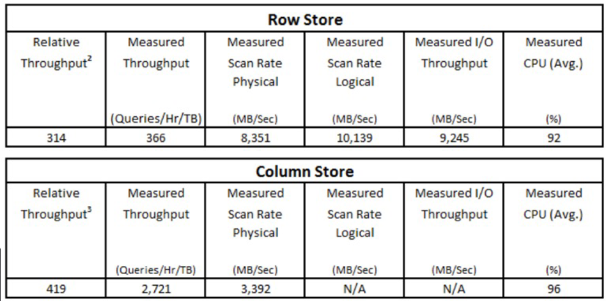

    <r>Batch Requests per second.</r>

  3. How hard are we working to achieve that speed?

     - How SQL Server schedules CPU
        What’s Running          Now What’s Waiting (Queue)
        SELECT * 
        FROM dbo.Restaurants
        (By Brent)

        I run a query getting all of the restaurants. My Restaurants table happens to be mostly in cache, so it fires off and starts unning.It will KEEP running – there’s no concept of sharing CPU cycles in SQL Server.  A query runs until it’s done, or until it needs to ait on something like locks. More on that in a second.

        While my query is consuming CPU, other people’s queries pile up behind me.

                                SELECT * 
                                FROM dbo.SoccerClubs
                                (By Richie)

                                SELECT * 
                                FROM dbo.Resorts
                                (By Erika)

        

        But the instant my query needs something that isn’t in cache, like I need to wait for a locked page or I need to wait for something o come back from disk, I go to the back of the line.

        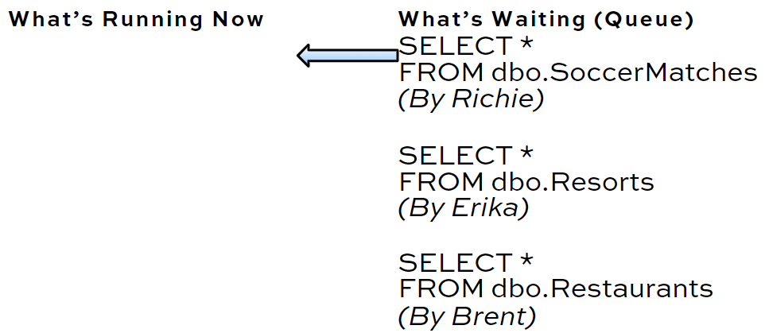

        Other people’s queries can then jump in. While mine is waiting, SQL Server tracks the number of milliseconds that I’m waiting on stuff.

     - <r>Stuff we wait for
         - <r>Resources: CPU, memory, storage, network, latches, locks
         - <r>Stuff outside of SQL Server (Preemptive): COM, OLEDB, CLR
         - <r>System Tasks: Lazywriter, trace, full text search

     - Is this SQL Server working hard?
        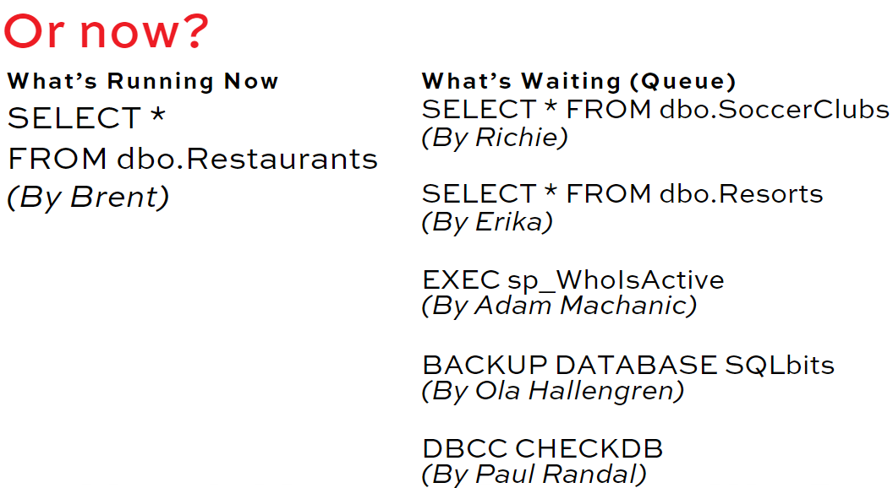

        Some queries are simple ... Some queries have a lot going on!

        But one query looks more like this:

        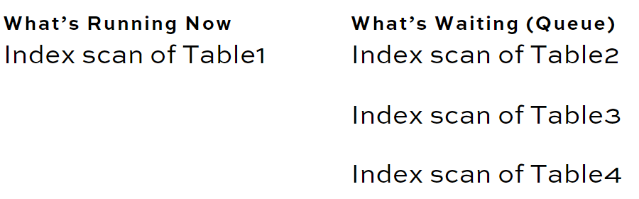

        So for each core, you’ll likely see:

        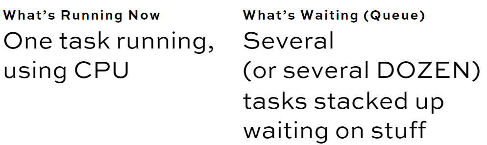

        If we do this for one second, how many seconds of waits?

        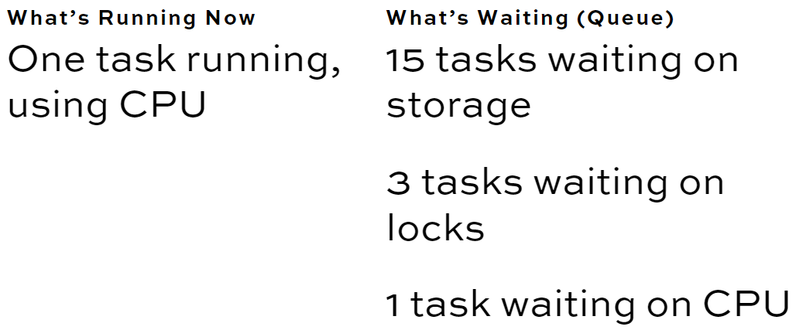

        Wait Time Ratio: hours of wait time per hour

        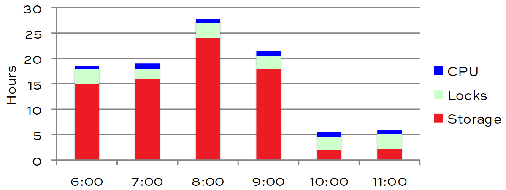

     - How hard is your server working?
        - Dynamic Management View (DMV) sys.dm_os_wait_stats
        - Tracked cumulatively over time
        - Trend on an hourly basis and break it out by:
            • Weekday vs weekend
            • Business hours vs after hours
            • Maintenance windows (backups, DB maintenance)

      - When Wait time changes
          - If it went up:
            • More batch requests/sec
            • Queries were tuned (badly)
            • Storage got slower
            • Hardware is shared

          - If it went down:
            • Less batch requests/sec
            • Queries were tuned
            • Indexes were tuned
            • Memory was added

      - Wait time ratio: Wait time per core per second
          - 0 second of waits – Your server isn’t doing anything.
          - 1 second of waits – You’re still not doing much.
          - Multiple second per core – now we’re working! And we should probably be tuning


- <r>It’s time to get some answers.</r>
  1. How much weight are we carrying?
      <r>Total data size in GB/TB, and number of DBs.

  2. How fast are we going?:
      <r>Batch Requests per second.

  3. How hard are we working to achieve that speed?
      <r>Wait time ratio:
      <r>Wait time per core per hour (or second, minute)


- Quick snapshot: sp_BlitzFirst
  - Free at FirstResponderKit.org
  - Totally free diagnostic tool.
  - Installs in the master database.
  - Runs in 5 seconds ideally, but can be more under load.
  - By default, shows waits for a 5-second sample now.
  - @SinceStartup = 1 shows waits since, uh, startup

  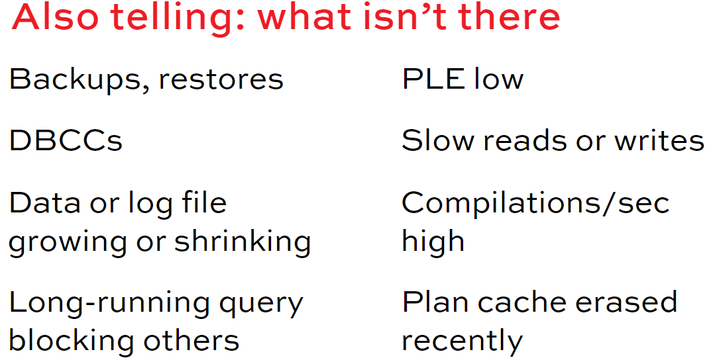

- Most useful parameters
    @SinceStartup = 1
    @ExpertMode = 1
    @Seconds = 60
    @OutputDatabaseName = ‘DBAtools’,
    @OutputSchemaName = ‘dbo’,
    @OutputTableName = ‘BlitzFirstResults’

## RECAP

- Tuning is all about 3 numbers.
    1. Total database size (and quantity)
    2. Batch Requests/Second
    3. Wait Time Ratio:
       Wait Time per Core per Hour (or per sec)

Capture these metrics with sp_BlitzFirst.
Your top wait stat is where to focus your tuning.


## Brent Analyzes Your Server's Wait Stats

  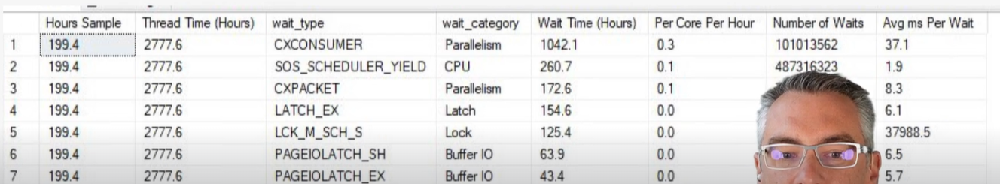

    Paralelism and CPU problem. Queries are using for 4 ms the cPU and then waiting 1.9ms to use it again.

  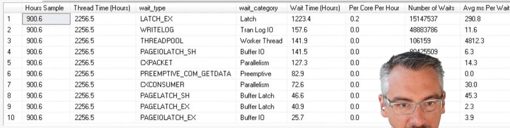
    LATCH_EX in this case means that you are scanning the same table many times on memory.
    You have to find the query that is reading a lot and maybe create an index for that one.

  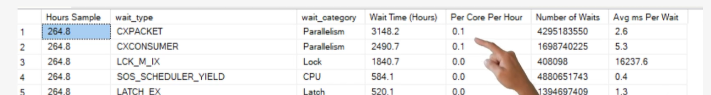

  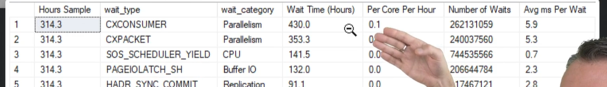
    Queries are going in parallel

  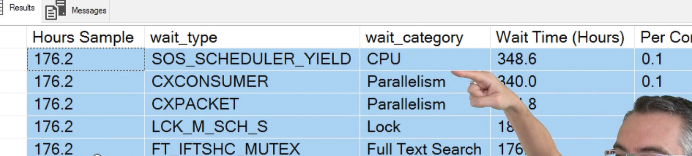
    sp_BlitzCache @SortOrder = 'cpu'

  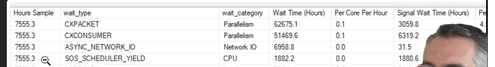
  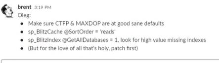

  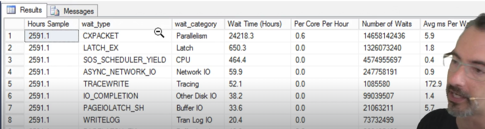
  Same before

  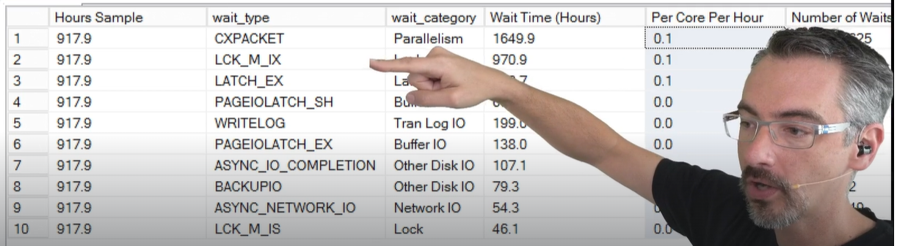
    blocking probles
    

    sp_BlitzIndex @GetAllDatabases = 1 loot at agressive missing index


# PAGEIOLATCH: Reading from Disk
Also relevant for folks who have CXCONSUMER, CXPACKET and LATCH_EX as their top combo

