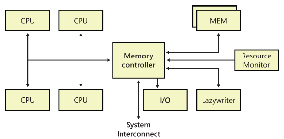
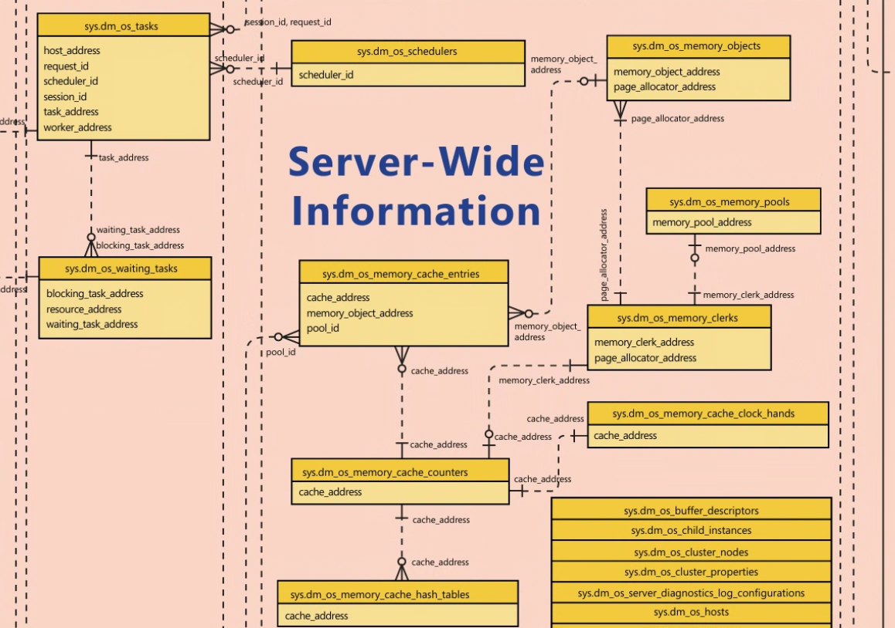
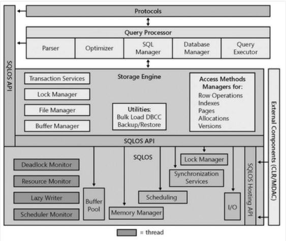
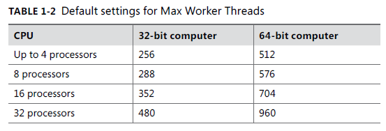
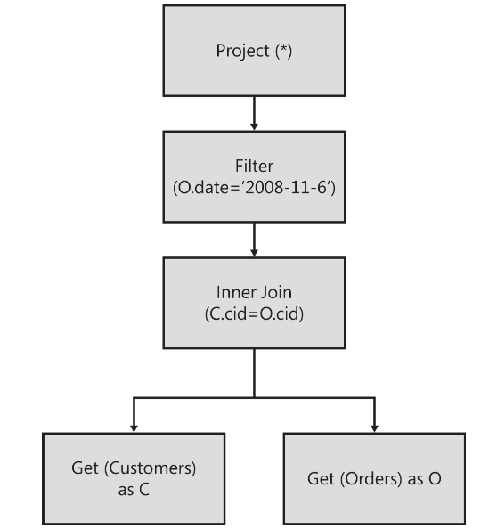
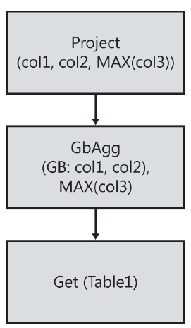
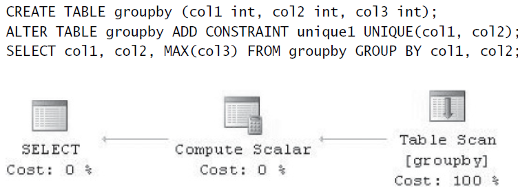
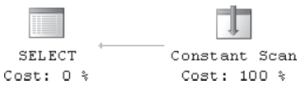

# SQL Server 2012 Internal
<style>
r { color: red }
o { color: Orange }
g { color: Green }
lg { color: lightgreen }
b { color: Blue }
lb { color: lightblue }
</style>

> [!TIP]
> Use the command line to detect and resolve the errors!

> [!WARNING]
> DON'T DELETE THE `package.json` file!

> [!CAUTION]
> Don't execute the code without commenting the test cases.

> [!IMPORTANT]  
> Read the contribution guideline before adding a pull request.

# Index
  - [Cap 1](#SQL#Server#2012#architecture#and#configuration)
  - [Cap 2](#)
  - [Cap 10](#The#Query#Execution)
  - [Cap 11](#The#Query#optimizer)
  - [Cap 12](#)
---


## 1. SQL Server 2012 architecture and configuration

### 1. Architecture

#### 1.1 The SQLOS

The SQL Server Operating System (SQLOS) is a separate application layer at the lowest level of the SQL Server Database Engine that both SQL Server and SQL Reporting Services run atop. Earlier versions of SQL Server have a thin layer of interfaces between the storage engine and the actual operating system through which SQL Server makes calls to the operating system for memory allocation, scheduler resources, thread and worker management, and synchronization objects. However, the services in SQL Server that need to access these interfaces can be in any part of the engine. SQL Server requirements for managing memory, schedulers, synchronization objects, and so forth have become more complex. Rather than each part of the engine growing to support the increased functionality, a single application layer has been designed to manage all operating system resources specific to SQL Server.

The two main functions of SQLOS are **scheduling** and **memory management**, both of which are discussed in detail in this chapter. Other functions of SQLOS include the following.

 - **Synchronization** This object type includes spinlocks, mutexes (mutual exclusions), and special reader/writer locks on system resources.
 - **Memory brokers** Memory brokers distribute memory allocation between various components within SQL Server but don’t perform any allocations, which are handled by the Memory Manager.
 - **SQL Server exception handling** This involves dealing with user errors as well as system-generated errors.
 - **Deadlock detection** This mechanism doesn’t just involve locks but checks for any tasks holding onto resources that are mutually blocking each other. 
 - **Extended Events** Tracking extended events is similar to the SQL Trace capability but is much more efficient because the tracking runs at a much lower level than SQL Trace. Also, because the Extended Event layer is so low and deep, many more types of events can be tracked. 
 - **Asynchronous I/O** The difference between asynchronous and synchronous is what part of the system is actually waiting for an unavailable resource. When SQL Server requests a synchronous I/O, if the resource isn’t available, the Windows kernel puts the thread on a wait queue until the resource becomes available. For asynchronous I/O, SQL Server requests that Windows initiate an I/O. Windows starts the I/O operation and doesn’t stop the thread from running. SQL Server then places the server session in an I/O wait queue until it gets the signal from Windows that the resource is available.
 - **CLR hosting** Hosting Common Language Runtime (CLR) inside the SQLOS allows managed .NET code to be used natively inside SQL Server.


##### 1.1.1 NUMA Architecture

Non-Uniform Memory Access (NUMA) architectures have become common in most datacenters today. The SQLOS has automatically recognized the existence of hardware NUMA support and optimizes scheduling and memory management by default.

Only a few years ago, hardware NUMA required specialized hardware configurations using multiple server nodes that functioned as a single server. Modern server processor architectures from AMD and Intel now offer hardware NUMA in most standard server configurations through the inclusion of an onboard memory controller for each processor die and interconnected paths between the physical sockets on the server motherboard. Regardless of the specific hardware implementation of NUMA, SQLOS performs the same internal configuration of SOS Memory Nodes and uses the same optimizations for memory management and scheduling.

The main benefit of NUMA is scalability, which has definite limits when you use symmetric multiprocessing (SMP) architecture. With SMP, all memory access is posted to the same shared memory bus. This works fine for a relatively small number of CPUs, but problems appear when you have many CPUs competing for access to the shared memory bus. The trend in hardware has been to have more than one system bus, each serving a small set of processors. NUMA limits the number of CPUs on any one memory bus. Each processor group has its own memory and possibly its own I/O channels. However, each CPU can access memory associated with other groups coherently, as discussed later in the chapter. Each group is called a NUMA node, which are linked to each other by a high-speed interconnection. The number of CPUs within a NUMA node depends on the hardware vendor. Accessing local memory is faster than accessing the memory associated with other NUMA nodes—the reason for the name Non-Uniform Memory Access. Figure below shows a NUMA node with four CPUs.



SQL Server 2012 allows you to subdivide one or more physical NUMA nodes into smaller NUMA nodes, referred to as software NUMA or soft-NUMA. You typically use soft-NUMA when you have many CPUs but no hardware NUMA, because soft-NUMA allows for the subdividing of CPUs but not memory. You can also use soft-NUMA to subdivide hardware NUMA nodes into groups of fewer CPUs than is provided by the hardware NUMA. Your soft-NUMA nodes can also be configured to listen on their own ports.
Only the SQL Server scheduler and Server Name Indication (SNI) are soft-NUMA–aware. Memory nodes are created based on hardware NUMA and therefore aren’t affected by soft-NUMA.
TCP/IP, Virtual Interface Adapters (VIAs), Named Pipes, and shared memory can take advantage of NUMA round-robin scheduling, but only TCP and VIA can set the processor affinity to a specific set of NUMA nodes.

**<r>BUSCAR INFO QUE LE EXPLIQUE A UN SER HUMANO QUE MIERDA ES LA NUMA Y COMO ES SU ARQUITECTURA</r>**

##### 1.1.2 The Scheduler

###### 1.1.2.1 Intro

Because the Windows scheduler knew nothing about the needs of a relational database system, it treated SQL Server worker threads the same as any other process running on the operating system. However, a high-performance system such as SQL Server functions best when the scheduler can meet its special needs. SQL Server 7.0 and all subsequent versions are designed to handle their own scheduling to gain a number of advantages, including the following.

 - A private scheduler can support SQL Server tasks by using fibers as easily as it supports using threads.
 - Context switching and switching into kernel mode can be avoided as much as possible.

One major difference between the SOS Scheduler and the Windows scheduler is that the SQL Server scheduler runs as a cooperative rather than as a preemptive scheduler. It relies on the workers, threads, or fibers to yield voluntarily often enough so that one process or thread doesn’t have exclusive control of the system. Each task that executes inside SQL Server has a quantum of 4 milliseconds on the scheduler.

- Understanding SQL Server schedulers

In SQL Server 2012, each actual CPU (whether hyperthreaded or physical) has a scheduler created for it when SQL Server starts. This is true even if the Affinity Mask server configuration options are configured so that SQL Server is set to not use all available physical CPUs. In SQL Server 2012, each scheduler is set to either ONLINE or OFFLINE based on the process affinity settings; the default is that all schedulers are ONLINE.

Introduced for the first time in SQL Server 2008 R2, process affinity replaced the ‘affinity mask’ sp_configure option and is accomplished through the use of ALTER SERVER CONFIGURATION for setting processor affinity in SQL Server. Changing the process affinity value can change the status of one or more schedulers to OFFLINE, which you can do without having to restart your SQL Server. Note that when a scheduler is switched from ONLINE to OFFLINE due to a configuration change, any work already assigned to the scheduler is first completed and no new work is assigned.

###### 1.1.2.2 SQL Server workers

You can think of the SQL Server scheduler as a logical CPU used by SQL Server workers. 

A worker can be either a thread or a fiber bound to a logical scheduler. If the Affinity Mask configuration option is set (as discussed in Chapter 1, “SQL Server 2012 architecture and configuration”), or process affinity has been configured using ALTER SERVER CONFIGURATION, each scheduler is mapped to a particular CPU. Thus, each worker is also associated with a single CPU.

Each scheduler is assigned a worker limit based on the configured Max Worker Threads and the number of scheduler.

A worker can’t move from one scheduler to another, but as workers are destroyed and created, it can appear as though workers are moving between schedulers.

Workers are created when the scheduler receives a request (a task to execute) and no workers are idle. A worker can be destroyed if it has been idle for at least 15 minutes or if SQL Server is under memory pressure. Each worker can use at least half a megabyte of memory on a 32-bit system and at least 2 MB on a 64-bit system, so destroying multiple workers and freeing their memory can yield an immediate performance improvement on memory-starved systems.

SQL Server actually handles the worker pool very efficiently, and you might be surprised to know that even on very large systems with hundreds or even thousands of users, the actual number of SQL Server workers might be much lower than the configured value for Max Worker Threads.

###### 1.1.2.3 SQL Server tasks

**The unit of work for a SQL Server worker is a request**, which you can think of as being equivalent to a single batch sent from the client to the server. When a request is received by SQL Server, it’s bound to a task that’s assigned to a worker, and that worker processes the entire request before handling any other request. If a request executes using parallelism, then multiple child tasks, and therefore workers, can be created based on the degree of parallelism being used to execute the request and the specific operation being performed.

Keep in mind that a session ID (SPID) isn’t the same as a task. A SPID is a connection or channel over which requests can be sent, but an active request isn’t always available on any particular SPID. In SQL Server 2012, a SPID isn’t bound to a particular scheduler. Each SPID has a preferred scheduler, which is one that most recently processed a request from the SPID. The SPID is initially assigned to the scheduler with the lowest load. However, when subsequent requests are sent from the same SPID, if another scheduler has a load factor that is less than a certain percentage of the average of the scheduler’s entire load factor, the new task is given to the scheduler with the smallest load factor. One restriction is that all tasks for one SPID must be processed by schedulers on the same NUMA node. The exception to this restriction is when a query is being executed as a parallel query across multiple CPUs. The optimizer can decide to use more available CPUs on the NUMA node processing the query so that other CPUs (and other schedulers) can be used.

###### 1.1.2.4 Threads vs. fibers

> [!NOTE]
> The scheduler in SQL Server 7.0 and SQL Server 2000 was called the User Mode Scheduler (UMS) to reflect that it ran primarily in user mode, as opposed to kernel mode. SQL Server 2005 and later versions call the scheduler the SOS Scheduler and improve on UMS even more.

As mentioned earlier, the UMS was designed to work with workers running on either threads or fibers. 

Windows fibers have less overhead associated with them than threads do, and multiple fibers can run on a single thread. You can configure SQL Server to run in fiber mode by setting the Lightweight Pooling option to 1. Although using less overhead and a “lightweight” mechanism sounds like a good idea, you should evaluate the use of fibers carefully.

Certain SQL Server components don’t work—or don’t work well—when SQL Server runs in fiber mode. These components include SQLMail and SQLXML. Other components, such as heterogeneous and CLR queries, aren’t supported at all in fiber mode because they need certain thread-specific facilities provided by Windows.

Fiber mode was actually intended just for special niche situations in which SQL Server reaches a limit in scalability due to spending too much time switching between thread contexts or switching between user mode and kernel mode. In most environments, the performance benefit gained by fibers is quite small compared to the benefits you can get by tuning in other areas. If you’re certain you have a situation that could benefit from fibers, be sure to test thoroughly before you set the option on a production server. Also, you might even want to contact Microsoft Customer Support Services.

###### 1.1.2.5 NUMA and schedulers

With a NUMA configuration, every node has some subset of the machine’s processors and the same number of schedulers. If the machine is configured for hardware NUMA, the number of processors on each node is preset, but for soft-NUMA that you configure yourself, you can decide how many processors are assigned to each node.

You still have the same number of schedulers as processors, however. When SPIDs are first created, they are assigned round-robin to nodes. The Scheduler Monitor then assigns the SPID to the least loaded scheduler on that node. As mentioned earlier, if the SPID is moved to another scheduler, it stays on the same node. A single processor or SMP machine is treated as a machine with a single NUMA node. Just like on an SMP machine, no hard mapping occurs between schedulers and a CPU with NUMA, so any scheduler on an individual node can run on any CPU on that node. However, if you have set the Affinity Mask configuration option, each scheduler on each node is fixed to run on a particular CPU.

Every hardware NUMA memory node has its own lazywriter as well as its own I/O Completion Port (IOCP), which is the network listener. 

Every node also has its own Resource Monitor, which a hidden scheduler manages (you can see the hidden schedulers in sys.dm_os_schedulers). Each Resource Monitor has its own SPID, which you can see by querying the sys.dm_exec_requests and sys.dm_os_workers DMVs:

```sql
    SELECT session_id,
    CONVERT (varchar(10), t1.status) AS status,
    CONVERT (varchar(20), t1.command) AS command,
    CONVERT (varchar(15), t2.state) AS worker_state
    FROM sys.dm_exec_requests AS t1
    JOIN sys.dm_os_workers AS t2
    ON t2.task_address = t1.task_address
    WHERE command = 'RESOURCE MONITOR';
```

Every node has its own Scheduler Monitor, which runs on any SPID and in a preemptive mode. The Scheduler Monitor thread wakes up periodically and checks each scheduler to see whether it has yielded since the last time the Scheduler Monitor woke up (unless the scheduler is idle). The Scheduler Monitor raises an error (17883) if a non-idle thread hasn’t yielded. This error can occur when an application other than SQL Server is monopolizing the CPU. The Scheduler Monitor knows only that the CPU isn’t yielding; it can’t ascertain what kind of task is using it. The Scheduler Monitor is also responsible for sending messages to the schedulers to help them balance their workload.

###### 1.1.2.6 Dynamic affinity

In SQL Server 2012 (in all editions except SQL Server Express), processor affinity can be controlled dynamically. When SQL Server starts up, all scheduler tasks are started, so each CPU has one scheduler. If process affinity has been set, some schedulers are then marked as offline and no tasks are assigned to them.

When process affinity is changed to include additional CPUs, the new CPU is brought online. The Scheduler Monitor then notices an imbalance in the workload and starts picking workers to move to the new CPU. When a CPU is brought offline by changing process affinity, the scheduler for that CPU continues to run active workers, but the scheduler itself is moved to one of the other CPUs that are still online. No new workers are given to this scheduler, which is now offline, and when all active workers have finished their tasks, the scheduler stops.


###### 1.1.2.7 Binding schedulers to CPUs

Remember that, normally, schedulers aren’t bound to CPUs in a strict one-to-one relationship, even though you have the same number of schedulers as CPUs. A scheduler is bound to a CPU only when process affinity is set, even if you specify that process affinity use all the CPUs, which is the default setting.

Configuring process affinity using ALTER SERVER CONFIGURATION SET PROCESS AFFINITY CPU requires only that you specify the specific CPUIDs. 

For an eight-processor machine, a process affinity set with ALTER SERVER CONFIGURATION SET PROCESS AFFINITY CPU = 0 TO 1 means that only CPUs 0 and 1 are used and two schedulers are bound to the two CPUs. If you set the process affinity set with ALTER SERVER CONFIGURATION SET PROCESS AFFINITY CPU 0 TO 7, all the CPUs are used, just as with the default. 

In addition to being able to set process affinity based on specific CPUIDs, SQL Server 2012 can set process affinity based on NUMA nodes using ALTER SERVER CONFIGURATION SET PROCESS AFFINITY NUMANODE = <NUMA node range spec>. The NUMA node range specification is identical to the CPU range specification. If you want an instance to use only the CPUs within a specific NUMA node, you simply specify that NUMA NodeID for the process affinity.

###### 1.1.2.8  Observing scheduler internals

SQL Server 2012 has several DMVs that provide information about schedulers, workers, and tasks. 

 - [sys.dm_os_schedulers]
  This view returns one row per scheduler in SQL Server. Each scheduler is mapped to an individual processor in SQL Server. Interesting columns include the following:
    - [parent_node_id] The ID of the node that the scheduler belongs to. This represents a NUMA node.
    - [scheduler_id]   The ID of the scheduler. All schedulers that run regular queries have IDs of less than 1048576.
    - [cpu_id]         The CPUID assigned to the scheduler. A cpu_id of 255 no longer indicates no affinity as it did in SQL Server 2005.
    - [is_online]      If SQL Server is configured to use only some of the available processors on the server, this can mean that some schedulers are mapped to processors not in the affinity mask. If that’s the case, this column returns 0, meaning that the scheduler isn’t being used to process queries or batches.
    - [current_tasks_count] The number of current tasks associated with this scheduler, including the following. (When a task is completed, this count is decremented.):
        • Tasks waiting on a resource to be acquired before proceeding
        • Tasks that are currently running or that can run but are waiting to be executed
    - [runnable_tasks_count] The number of tasks waiting to run on the scheduler.
    - [current_workers_count] The number of workers associated with this scheduler, including workers not assigned any task.
    - [active_workers_count] The number of workers assigned a task.
    - [work_queue_count] The number of tasks waiting for a worker. If current_workers_count is greater than active_workers_count, this work queue count should be 0 and shouldn’t grow.
    - [pending_disk_io_count] The number of pending I/Os. Each scheduler has a list of pending I/Os that are checked on every context switch to determine whether the I/Os are completed. The count is incremented when the request is inserted and decremented when the request is completed. This number doesn’t indicate the state of the I/Os.
    - [load_factor] The internal value that indicates the perceived load on this scheduler. This value determines whether a new task should be put on this scheduler or another scheduler. It’s useful for debugging purposes when schedulers appear to be unevenly loaded.

 - [sys.dm_os_workers]
    This view returns a row for every worker in the system. Interesting columns include the following:
    - [is_preemptive] A value of 1 means that the worker is running with preemptive scheduling. Any worker running external code is run under preemptive scheduling.
    - [is_fiber] A value of 1 means that the worker is running with lightweight pooling.

 - [sys.dm_os_threads]
    This view returns a list of all SQLOS threads running under the SQL Server process. Interesting columns include the following:
    - [started_by_sqlserver] The thread initiator. A 1 means that SQL Server started the thread; 0 means that another component, such as an extended procedure from within SQL Server, started the thread.
    - [creation_time] The time when this thread was created.
    - [stack_bytes_used] The number of bytes actively being used on the thread.
    - [affinity] The CPU mask on which this thread is running. This depends on the value configured by the ALTER SERVER CONFIGURATION SET PROCESS AFFINITY statement, which might be different from the scheduler in the case of soft-affinity.
    - [locale] The cached locale LCID for the thread.

 - [sys.dm_os_tasks]
    This view returns one row for each task that is active in the instance of SQL Server. Interesting columns include the following:
    - [task_state] The state of the task. The value can be one of the following:
        • PENDING  Waiting for a worker thread
        • RUNNABLE Capable of being executed, but is waiting to receive a quantum
        • RUNNING  Currently running on the scheduler
        • SUSPENDED Has a worker but is waiting for an event
        • DONE Completed
        • SPINLOOP Processing a spinlock, as when waiting for a signal
    - [context_switches_count] The number of scheduler context switches that this task has completed.
    - [pending_io_count] The number of physical I/Os performed by this task.
    - [pending_io_byte_count] The total byte count of I/Os performed by this task.
    - [pending_io_byte_average] The average byte count of I/Os performed by this task.
    - [scheduler_id] The ID of the parent scheduler. This is a handle to the scheduler information for this task.
    - [session_id] The ID of the session associated with the task.

 - [sys.dm_os_waiting_tasks]
    This view returns information about the queue of tasks waiting on some resource. Interesting columns include the following:
    - [session_id] The ID of the session associated with the task.
    - [exec_context_id] The ID of the execution context associated with the task.
    - [wait_duration_ms] The total wait time (in milliseconds) for this wait type. This time is inclusive of signal_wait_time.
    - [wait_type] The name of the wait type.
    - [resource_address] The address of the resource for which the task is waiting.
    - [blocking_task_address] The task currently holding this resource.
    - [blocking_session_id] The ID of the session of the blocking task.
    - [blocking_exec_context_id] The ID of the execution context of the blocking task.
    - [resource_description] The description of the resource being consumed.




###### 1.1.2.9 Understanding the Dedicated Administrator Connection (DAC)

Under extreme conditions, such as a complete lack of available resources, SQL Server can enter an abnormal state in which no further connections can be made to the SQL Server instance. SQL Server 2005 introduced a special connection called the Dedicated Administrator Connection (DAC) that was designed to be accessible even when no other access can be made.

You can connect to the DAC using the command-line tool SQLCMD and specifying the -A (or /A) flag. This method of connection is recommended because it uses fewer resources than the graphical user interface (GUI). 

Through SSMS, you can specify that you want to connect using DAC by preceding the name of your SQL Server with ADMIN: in the Connection dialog box. For example, to connect to a default SQL Server instance on a machine named TENAR, you enter ADMIN:TENAR. To connect to a named instance called SQL2008 on the same machine, you enter ADMIN:TENAR\SQL2008.

The DAC is a special-purpose connection designed for diagnosing problems in SQL Server and possibly resolving them. 

Under normal circumstances, you can check whether a DAC is in use by running the following query when not connected to the DAC. If a DAC is active, the query returns the SPID for the DAC; otherwise, it returns no rows:

```sql
    SELECT s.session_id
    FROM sys.tcp_endpoints as e
    INNER JOIN sys.dm_exec_sessions as s
    ON e.endpoint_id = s.endpoint_id
    WHERE e.name = N'Dedicated Admin Connection';
```

Keep the following points in mind about using the DAC.
- By default, the DAC is available only locally. However, administrators can configure SQL Server to allow remote connection by using the Remote Admin Connections configuration option.
- The user login to connect via the DAC must be a member of the sysadmin server role.
- There are only a few restrictions on the SQL statements that can be executed on the DAC. (For example, you can’t run parallel queries or commands—for example, BACKUP or RESTORE—using the DAC.) However, you are recommended not to run any resource-intensive queries that might exacerbate the problem that led you to use the DAC. The DAC connection is created primarily for troubleshooting and diagnostic purposes. In general, you use the DAC for running queries against the DMO, some of which you’ve seen already and many more of which are discussed later in this book.
- A special thread is assigned to the DAC that allows it to execute the diagnostic functions or queries on a separate scheduler. This thread can’t be terminated; you can kill only the DAC session, if needed. The DAC has no lazywriter thread, but it does have its own I/O Completion Port (IOCP), a worker thread, and an idle thread.


##### 1.1.3 Memory

###### 1.1.3.1 Intro

> [!IMPORTANT]  
> El Buffer Manager es el Buffer Cache?
> 

Because memory management is a huge topic, covering every detail of it would require a whole book in itself. SQL Server 2012 introduces a significant rewrite of the SQLOS Memory Manager and has the first significant changes in memory management since SQLOS was introduced in SQL Server 2005. The goal of this section is twofold:

 - To provide enough information about how SQL Server uses its memory resources so that you can determine whether memory is being managed well on your system.
 - To describe the aspects of memory management that you have control over so that you can understand when to exert that control

By default, SQL Server 2012 manages its memory resources almost completely dynamically. When allocating memory, SQL Server must communicate constantly with the operating system, which is one of the reasons the SQLOS layer of the engine is so important.

- The buffer pool and the data cache
    **The main memory component in SQL Server is the buffer pool.**
    All memory not used by another memory component remains in the buffer pool to be used as a data cache for pages read in from the database files on disk.The buffer manager manages disk I/O functions for bringing data and index pages into the data cache so that data can be shared among users.

    Other components requiring memory can request a buffer from the buffer pool.
    A buffer is a page in memory that has the same size as a data or index page. You can think of it as a page frame that can hold one page from a database.
    Most buffers taken from the buffer pool for other memory components go to other kinds of memory caches, the largest of which is typically the cache for procedure and query plans, which is usually called the plan cache.

    **<r>CONSULTAR CON CHATGPT SI EL DIAGRAMA QUE ARME EN RELACION A ESTO ESTA BIEN?</r>**

- Column store object pool
    In addition to the buffer pool, SQL Server 2012 includes a new cache store specifically optimized for usage by the new column store indexing feature. The column store object pool allocates memory from the any-page allocator just like the buffer pool, but rather than cache data pages, the memory allocations are used for column store index objects. 

    The memory for the column store object pool is tracked by a separate memory clerk, CACHESTORE_COLUMNSTOREOBJECTPOOL, in SQLOS. 

- Access to in-memory data pages
    Access to pages in the data cache must be fast. Even with real memory, scanning the whole data cache for a page would be ridiculously inefficient when you have gigabytes of data. Pages in the data cache are therefore hashed for fast access. Hashing is a technique that uniformly maps a key via a hash function across a set of hash buckets. A hash table is a structure in memory that contains an array of pointers (implemented as a linked list) to the buffer pages. 

    Given a dbid-fileno-pageno identifier (a combination of the database ID, file number, and page number), the hash function converts that key to the hash bucket that should be checked. 

    Similarly, it takes only a few memory reads for SQL Server to determine that a desired page isn’t in cache and must be read in from disk.

- Page management in the data cache
    **You can use a data page or an index page only if it exists in memory**.
    Therefore, a buffer in the data cache must be available for the page to be read into. Keeping a supply of buffers available for immediate use is an important performance optimization.

    In SQL Server 2012, a single mechanism is responsible both for writing changed pages to disk and for marking as free those pages that haven’t been referenced for some time. SQL Server maintains a linked list of the addresses of free pages, and any worker needing a buffer page uses the first page of this list.

    Every buffer in the data cache has a header that contains information about the last two times the page was referenced and some status information, including whether the page is dirty (that is, it has been changed since it was read into memory or from disk).

    The reference information is used to implement the page replacement policy for the data cache pages, which uses an algorithm called LRU-K (Least Recently Used (LRU)). An LRU-K algorithm keeps track of the last K times a page was referenced and can differentiate between types of pages, such as index and data pages, with different frequency levels. SQL Server 2012 uses a K value of 2, so it keeps track of the two most recent accesses of each buffer page.

    The data cache is periodically scanned from start to end by the lazywriter process, which functions similar to a ticking clock hand, processing 16 pages in the data cache for each tick. **Because the buffer cache is all in memory**, these scans are quick and require no I/O. During the scan, a value is associated with each buffer based on the time the buffer was last accessed. When the value gets low enough, the dirty page indicator is checked. If the page is dirty, a write is scheduled to commit the modifications to disk.
    
    Instances of SQL Server use write-ahead logging so that the write of the dirty data page is blocked while the log page recording the modification is first written to disk. 
    
    **After the modified page is flushed to disk or if the page wasn’t dirty to start with, it is freed.** 
    The association between the buffer page and the data page that it contains is removed by deleting information about the buffer from the hash table, and the buffer is put on the free list.

- The free buffer list and the lazywriter
    **The work of scanning the buffer pool, writing dirty pages, and populating the free buffer list is primarily performed by the lazywriter.**
    
    Each instance of SQL Server has one lazywriter thread for each SOS Memory node created in SQLOS, with every instance having at least one lazywriter thread. As explained earlier, the lazywriter works like a clock hand and ticks, with each tick processing 16 buffers in the data cache.
    
    The location of the previous tick is tracked internally, and the buffers in the data cache are scanned sequentially from start to finish as the lazywriter ticks during execution. When the end of the data cache is reached, the process repeats from the beginning of the data cache on the next tick.

    If the instance experiences memory pressure in the data cache, individual workers can assist the lazywriter as they allocate memory, and the number of pages available on the free list is too low. When this condition occurs, the individual workers execute an internal routine, HelpLazyWriter, which performs an additional lazywriter tick on the worker thread, processing the next 16 buffers in the data cache and returning buffers that exceed the current time of last access value to the free list. 
    
    When SQL Server uses memory dynamically, it must constantly be aware of the amount of free memory available in Windows. One SQLOS component is the Resource Monitor, which, among other tasks, monitors the Windows operating system for low memory notifications by using the QueryMemoryResourceNotification Windows Server application programming interface (API) to get status. If the available memory in Windows drops below 32 MB for servers with 4 GB of RAM or 64 MB for servers with 8 GB or higher, a LowMemoryResourceNotification flag is set. This notification is returned by the QueryMemoryResourceNotification call, and Resource Monitor forces the external clock hands on the internal caches in SQLOS to sweep the caches to clean up and reduce memory usage, allowing SQL Server to return memory to Windows. As memory is released by SQLOS to Windows, it can be committed by other applications or, if a stable state occurs, the Windows operating system sets a HighMemoryResourceNotification when the available memory on the server is three times the low memory notification size. When this occurs, the Resource Monitor detects the change in notification, and the SQLOS can then commit additional memory from Windows, if required.

- Checkpoints
    The checkpoint process also scans the buffer cache periodically and writes all the dirty data pages for a particular database to disk. 
    The difference between the checkpoint process and the lazywriter is that the checkpoint process never puts buffers on the free list.

    The only purpose of the checkpoint process is to ensure that pages modified before a certain time are written to disk, so that the number of dirty pages in memory is always kept to a minimum, which in turn ensures that the length of time SQL Server requires for recovery of a database after a failure is kept to a minimum.
    
    When a checkpoint occurs, SQL Server writes a checkpoint record to the transaction log, which lists all active transactions. This allows the recovery process to build a table containing a list of all the potentially dirty pages. Checkpoints occur automatically at regular intervals but can also be requested manually. Checkpoints are triggered when any of the following occurs:
    
    * A database owner (or backup operator) explicitly issues a CHECKPOINT command to perform a checkpoint in that database.
    * A backup or database snapshot is created of a database.
    * The log is filling up (more than 70 percent of capacity) and the database is in autotruncate mode.
    * The recovery time exceeds the Recovery Interval server configuration option. A Recovery Interval setting of 1 means that checkpoints occur about every minute as long as transactions are being processed in the database. A default recovery interval of 0 means that SQL Server chooses an appropriate value; for the current version, this is one minute.
    * The recovery time exceeds the Target Recovery Time database configuration option.
    * An orderly shutdown of SQL Server is requested, without the NOWAIT option. A checkpoint operation is then run in each database on the instance. An orderly shutdown occurs when you explicitly shut down SQL Server, unless you do so by using the SHUTDOWN WITH NOWAIT command. An orderly shutdown also occurs when the SQL Server service is stopped through Service Control Manager or the net stop command from an operating system prompt.

    You can also use the sp_configure Recovery Interval option to influence checkpointing frequency, balancing the time to recover against any effect on runtime performance. If you’re interested in tracing when checkpoints actually occur, you can use the SQL Server Extended Events sqlserver.checkpoint_begin and sqlserver.checkpoint_end to monitor checkpoint activity.
    
    The checkpoint process goes through the buffer pool, scanning the pages nonsequentially. When it finds a dirty page, it looks to see whether any physically contiguous (on the disk) pages are also dirty so that it can do a large block write. But this means that it might, for example, write buffers 12, 13, 14, 15, 16, and 17 when it sees that buffer 14 is dirty. (These pages have contiguous disk locations even though they can be in different memory regions in the buffer pool. In this case, the noncontiguous pages in the buffer pool can be written as a single operation called a gather-write.) The process continues to scan the buffer pool until it gets to page 17.

    In some cases, checkpoints might issue a substantial amount of I/O, causing the I/O subsystem to get inundated with write requests, which can severely affect read performance. On the other hand, relatively low I/O activity can be utilized during some periods. SQL Server 2012 includes a command-line option that allows throttling of checkpoint I/Os. Use the SQL Server Configuration Manager and add the –k parameter, followed by a decimal number, to the list of startup parameters for the SQL Server service. The value specified indicates the number of megabytes per second that the checkpoint process can write. Backups might require slightly more time to finish because a checkpoint process that a backup initiates is also delayed. Before enabling this option on a production system, make sure that you have enough hardware to sustain the I/O requests posted by SQL Server and that you have thoroughly tested your applications on the system. The –k option doesn’t apply to indirect checkpoints.

- Memory management in other caches
    **Buffer pool memory not used for the data cache is used for other types of caches, primarily the plan cache.**
    The page replacement policy for other caches, as well as the mechanism by which pages that can be freed are searched for, are quite a bit different than for the data cache.

    SQL Server 2012 uses a common caching framework that all caches except the data cache use. The framework consists of the Resource Monitor and a set of three stores: **cache stores, user stores (which don’t actually have anything to do with users), and object stores.**
    
    **The plan cache** is the main example of a cache store, and **the metadata cache** is the prime example of a user store. Both cache stores and user stores use the same LRU mechanism and the same costing algorithm to determine which pages can stay and which can be freed. Object stores, on the other hand, are just pools of memory blocks and don’t require LRU or costing. One example of the use of an object store is the SNI, which uses the object store for pooling network buffers.
    
    For the rest of this section, the discussion of stores refers only to cache stores and user stores.

    The Resource Monitor is in charge of moving the external hands whenever it notices memory pressure. When the Resource Monitor detects memory pressure, it writes an entry into one of many in-memory ring buffers maintained by SQLOS for storing diagnostics information about SQL Server. A ring buffer is a memory structure that functions as a first-in-first-out queue with a fixed or variable number of entries that can be maintained within the memory structure. The ring buffer entries from the Resource Monitor can be monitored as follows:

    ```sql
    SELECT *
    FROM sys.dm_os_ring_buffers
    WHERE ring_buffer_type=N'RING_BUFFER_RESOURCE_MONITOR';
    ```

    If the memory pressure is external to SQL Server, the value of the IndicatorsSystem node is 2. If the memory pressure is internal to SQL Server, the value of the IndicatorsProcess node is 2. 
    
    Also, if you look at the DMV sys.dm_os_memory_cache_clock_hands—specifically at the removed_last_round_count column—you can look for a value that is very large compared to other values. A dramatic increase in that value strongly indicates memory pressure. 
    
    **The companion website for this book contains a comprehensive white paper titled “Troubleshooting Performance Problems in SQL Server 2008,” which includes many details on tracking down and dealing with memory problems. Buscar este paper para ver cuales son las queries**


- The Memory Broker
    Because so many SQL Server components need memory, and to make sure that each component uses memory efficiently, SQL Server uses a Memory Broker, whose job is to analyze the behavior of SQL Server with respect to memory consumption and to improve dynamic memory distribution. The Memory Broker is a centralized mechanism that dynamically distributes memory between the buffer pool, the query executor, the Query Optimizer, and all the various caches, and it attempts to adapt its distribution algorithm for different types of workloads.
    
    You can monitor Memory Broker behavior by querying the Memory Broker ring buffer as follows:
    ```sql
    SELECT *
    FROM sys.dm_os_ring_buffers
    WHERE ring_buffer_type=N'RING_BUFFER_MEMORY_BROKER';
    ```

- Memory sizing
    SQL Server memory involves more than just the buffer pool. As mentioned earlier in this discussion, SQL Server 2012 included a rewrite of the Memory Manager in SQLOS and no longer allocates or manages memory in the same manner as previous versions of SQL Server. 

    In SQL Server 2012, the sys.dm_os_memory_clerks DMV has been reworked to reflect the changes to the Memory Manager and, therefore, no longer has separate single_page_kb and multi_pages_kb columns. Instead, a new pages_kb column reflects the total memory allocated by a component from the any-page allocator in SQLOS:

    ```sql
    SELECT type, sum(pages_kb) AS pages_kb
    FROM sys.dm_os_memory_clerks
    WHERE pages_kb != 0
    GROUP BY type;
    ```

- Buffer pool sizing
    When SQL Server starts, it computes the size of the virtual address space (VAS) of the SQL Server process.

    A 32-bit machine can directly address only 4 GB of memory and, by default, Windows itself reserves the top 2 GB of address space for its own use, which leaves only 2 GB as the maximum size of the VAS for any application, such as SQL Server. If you need to access more than 3 GB of RAM with SQL Server 2012, you have to use a 64-bit platform.

    On a 64-bit platform, the Windows policy option Lock Pages in Memory is available, although it’s disabled by default. This policy determines which accounts can make use of a Windows feature to keep data in physical memory, preventing the system from paging the data to virtual memory on disk.

    A DMV called [sys.dm_os_sys_info] contains one row of general-purpose SQL Server configuration information, including the following columns:
    - physical_memory_kb: The amount of physical memory available
    - virtual_memory_kb: The amount of virtual memory available to the process in user mode
    - commited_kb: The committed memory in kilobytes in the Memory Manager; doesn’t include reserved memory in the Memory Manager
    - commit_target_kb: The amount of memory, in kilobytes, that SQL Server Memory Manager can consume

    Also, a DMV called [sys.dm_os_process_memory] contains one row of information about the SQL Server process memory usage, including the following columns:
    - physical_memory_in_use_kb: The size of the process working set in KB
    - large_page_allocations_kb: The amount of physical memory allocated by using large page APIs
    - locked_page_allocations_kb: The amount of memory pages locked in memory
    - total_virtual_address_space_kb: The total size of the user mode part of the virtual address space
    - virtual_address_space_reserved_kb: The total amount of virtual address space reserved by the process
    - virtual_address_space_committed_kb: The amount of reserved virtual address space that has been committed or mapped to physical pages
    - virtual_address_space_available_kb: The amount of virtual address space that’s currently free

- DMVs for memory internals
    SQL Server includes several DMO that provide information about memory and the various caches.

    - [sys.dm_os_memory_clerks]
        This view returns one row per memory clerk that’s currently active in the instance of SQL Server. You can think of a clerk as an accounting unit. following query returns a list of all the types of clerks.

        ```SQL
        SELECT DISTINCT type
        FROM sys.dm_os_memory_clerks;
        ```

        Interesting columns include the following.
            • [pages_kb] The amount of page memory allocated in kilobytes for this memory clerk.
            • [virtual_memory_reserved_kb] The amount of virtual memory reserved by a memory clerk.
            • [virtual_memory_committed_kb] The amount of memory committed by the clerk. The amount of committed memory should always be less than the amount of Reserved Memory.
            • [awe_allocated_kb] The amount of memory in kilobytes locked in the physical memory and not paged out by Windows.

    - [sys.dm_os_memory_cache_counters]
        This view returns a snapshot of the health of each cache of type userstore and cachestore. It provides runtime information about the cache entries allocated, their use, and the source of memory for the cache entries. Interesting columns include the following.
        • [pages_kb] The amount of memory in kilobytes allocated in the cache.
        • [pages_in_use_kb] The amount of memory in kilobytes (KB) that is allocated and used in the cache.
        • [entries_count] The number of entries in the cache.
        • [entries_in_use_count] The number of entries in use in the cache.

    - [sys.dm_os_memory_cache_hash_tables]
        This view returns a row for each active cache in the SQL Server instance. This view can be joined to [sys.dm_os_memory_cache_counters] on the cache_address column. Interesting columns include the following.
        • [buckets_count] The number of buckets in the hash table.
        • [buckets_in_use_count] The number of buckets currently being used.
        • [buckets_min_length] The minimum number of cache entries in a bucket.
        • [buckets_max_length] The maximum number of cache entries in a bucket.
        • [buckets_avg_length] The average number of cache entries in each bucket. **If this number gets very large, it might indicate that the hashing algorithm isn’t ideal.**
        • [buckets_avg_scan_hit_length] The average number of examined entries in a bucket before the searched-for item was found. **As above, a big number might indicate a less-than-optimal cache. You might consider running DBCC FREESYSTEMCACHE to remove all unused entries in the cache stores.**

    - [sys.dm_os_memory_cache_clock_hands] 
        This DMV, discussed earlier, can be joined to the other cache DMVs using the cache_address column. Interesting columns include the following.
        • [clock_hand] The type of clock hand, either external or internal. Remember that every store has two clock hands.
        • [clock_status] The status of the clock hand: suspended or running. A clock hand runs when a corresponding policy kicks in.
        • [rounds_count] The number of rounds the clock hand has made. All the external clock hands should have the same value in this column.
        • [removed_all_rounds_count] The number of entries removed by the clock hand in all rounds.


- Read-ahead
    SQL Server supports a mechanism called read-ahead, whereby the need for data and index pages can be anticipated and pages can be brought into the buffer pool before they’re actually needed. This performance optimization allows large amounts of data to be processed effectively and typically keeps the necessary pages in the buffer pool before they are needed by the execution engine.
    
    Read-ahead is managed completely internally, and no configuration adjustments are necessary.
    
    Read-ahead comes in two types: **one for table scans on heaps** and **one for index ranges**. 
    **For table scans**, the table’s allocation structures are consulted to read the table in disk order. Up to 32 extents (32 * 8 pages/extent * 8,192 bytes/page = 2 MB) of read-ahead might be outstanding at a time. Up to eight contiguous extents (64 contiguous pages) can be read at a time are read with a single 512 KB scatter read from one file. If the table is spread across multiple files in a file group, SQL Server attempts to distribute the read-ahead activity across the files evenly.
    **For index ranges**, the scan uses level 1 of the index structure (the level immediately above the leaf) to determine which pages to read ahead. When the index scan starts, read-ahead is invoked on the initial descent of the index to minimize the number of reads performed. For instance, for a scan of WHERE state = ‘WA’, read-ahead searches the index for key = ‘WA’, and it can tell from the level-1 nodes how many pages must be examined to satisfy the scan. If the anticipated number of pages is small, all the pages are requested by the initial read-ahead; if the pages are noncontiguous, they’re fetched in scatter reads. If the range contains a large number of pages, the initial read-ahead is performed and thereafter, every time another 16 pages are consumed by the scan, the index is consulted to read in another 16 pages. This has several interesting effects.
    
    - Small ranges can be processed in a single read at the data page level whenever the index is contiguous.
    - The scan range (for example, state = ‘WA’) can be used to prevent reading ahead of pages that won’t be used because this information is available in the index.
    - Read-ahead isn’t slowed by having to follow page linkages at the data page level. (Read-ahead can be done on both clustered indexes and nonclustered indexes.)

**<r>As you can see, memory management in SQL Server is a huge topic, and this discussion provided you with only a basic understanding of how SQL Server uses memory. This information should give you a start in interpreting the wealth of information available through the DMVs and troubleshooting. The companion website includes a white paper that offers many more troubleshooting ideas and scenarios.</r>**


##### QQ

> [!WARNING]
> QQ
> SOS Schduler que es?
> Cual es la diferencia entre whether hyperthreaded or physical?
> What "a fiber bound" is?
> What "Windows fibers" is?
> What "SQL Server runs in fiber mode" is?
> Terminar de entender que es el Affinity Mask?
> No entendi un porogon del 1.1.2.5 Dynamic affinity!!


### 2. Configuration

#### 2.1. Intro

This book, SQL Server 2012 Internals, covers only the main features of the core database engine. 

#### 2.2. SQL Server metadata

Three types of system metadata objects are intended for general use: Compatibility Views, Catalog Views, and Dynamic Management Objects.

##### 2.2.1. Compatibility Views

##### 2.2.2. Catalog views

The SQL Server Books Online topic, “Mapping System Tables to System Views,” categorizes its objects into two lists: those appearing only in master and those appearing in all databases.
As views, these metadata objects are based on an underlying Transact-SQL (T-SQL) definition. The most straightforward way to see the definition of these views is by using the object_definition function. (You can also see the definition of these system views by using sp_helptext or by selecting from the catalog view sys.system_sql_modules.) So to see the definition of sys.tables, you can execute the following:
SELECT object_definition (object_id('sys.tables'));

##### 2.2.3. Dynamic Management Objects

Metadata with names starting with sys.dm_, such as the just-mentioned sys.dm_exec_cached_plans, are considered Dynamic Management Objects. Although Dynamic Management Objects include both views and functions, they are usually referred to by the abbreviation DMV.

They are all in the sys schema and have a name that starts with dm_, followed by a code indicating the area of the server with which the object deals. The main categories are:

 - **dm_exec_** This category contains information directly or indirectly related to the execution of user code and associated connections. For example, sys.dm_exec_sessions returns one row per authenticated session on SQL Server.
 - **dm_os_** This category contains low-level system information such as memory and scheduling. For example, sys.dm_os_schedulers is a DMV that returns one row per scheduler.
 - **dm_tran_** This category contains details about current transactions. For example, sys.dm_tran_locks returns information about currently active lock resources.
 - **dm_logpool** This category contains details about log pools used to manage SQL Server 2012’s log cache, a new feature added to make log records more easily retrievable when needed by features such as AlwaysOn.
 - **dm_io_** This category keeps track of input/output activity on network and disks. For example, the function sys.dm_io_virtual_file_stats returns I/O statistics for data and log files. 
 - **dm_db_** This category contains details about databases and database objects such as indexes. For example, the sys.dm_db_index_physical_stats function returns size and fragmentation information for the data and indexes of the specified table or view.

##### 2.2.4. Other metadata

 - System functions
    Most SQL Server system functions are **property functions**. Property functions provide individual values for many SQL Server objects as well as for SQL Server databases and the SQL Server instance itself. The values returned by the property functions are scalar as opposed to tabular, so they can be used as values returned by SELECT statements and as values to populate columns in tables. The following property functions are available in SQL Server 2012:
    
    * SERVERPROPERTY
    * COLUMNPROPERTY
    * DATABASEPROPERTYEX
    * INDEXPROPERTY
    * INDEXKEY_PROPERTY
    * OBJECTPROPERTY
    * OBJECTPROPERTYEX
    * SQL_VARIANT_PROPERTY
    * FILEPROPERTY
    * FILEGROUPPROPERTY
    * FULLTEXTCATALOGPROPERTY
    * FULLTEXTSERVICEPROPERTY
    * TYPEPROPERTY
    * CONNECTIONPROPERTY
    * ASSEMBLYPROPERTY

    In addition to the property functions, the system functions include functions that are merely shortcuts for catalog view access. For example, to find out the database ID for the AdventureWorks2012 database, you can either query the sys.databases catalog view or use the DB_ID() function. Both of the following SELECT statements should return the same result:

    SELECT database_id
    FROM sys.databases
    WHERE name = 'AdventureWorks2012';
    SELECT DB_ID('AdventureWorks2012');

 - System stored procedures
    System stored procedures are the original metadata access tool, in addition to the system tables themselves. Most of the system stored procedures introduced in the very first version of SQL Server are still available. However, catalog views are a big improvement over these procedures: You have control over how much of the metadata you see because you can query the views as though they were tables. With the system stored procedures, you have to accept the data that it returns.

##### Summary

 Terminar de entender la/s diferencias entre [Catalog View], [Dynamic Management Objects] y [Other Metadata]

#### 2.3. Components of the SQL Server Engine

Below figure shows the general architecture of SQL Server and its four major components: The Protocol Layer, The Query Processor (also called the relational engine), The Storage Engine, and The SQLOS. Every batch submitted to SQL Server for execution, from any client application, must interact with these four components.



##### 1.3.1 Protocols

When an application communicates with the Database Engine, the application programming interfaces (APIs) exposed by the protocol layer formats the communication using a Microsoft-defined format called a tabular data stream (TDS) packet. The SQL Server Network Interface (SNI) protocol layer on both the server and client computers encapsulates the TDS packet inside a standard communication protocol, such as TCP/IP or Named Pipes. On the server side of the communication, the network libraries are part of the Database Engine. On the client side, the network libraries are part of the SQL Native Client. The configuration of the client and the instance of SQL Server determine which protocol is used. You can configure SQL Server to support multiple protocols simultaneously, coming from different clients. Each client connects to SQL Server with a single protocol. If the client program doesn’t know which protocols SQL Server is listening on, you can configure the client to attempt multiple protocols sequentially. The following protocols are available:

* Shared Memory The simplest protocol to use, with no configurable settings. Clients using the Shared Memory protocol can connect to only a SQL Server instance running on the same computer, so this protocol isn’t useful for most database activity. Use this protocol for troubleshooting when you suspect that the other protocols are configured incorrectly. Clients using MDAC 2.8 or earlier can’t use the Shared Memory protocol. If such a connection is attempted, the client is switched to the Named Pipes protocol.

* Named Pipes A protocol developed for local area networks (LANs). A portion of memory is used by one process to pass information to another process, so that the output of one is the input of the other. The second process can be local (on the same computer as the first) or remote (on a network computer).

* TCP/IP The most widely used protocol over the Internet. TCP/IP can communicate across interconnected computer networks with diverse hardware architectures and operating systems. It includes standards for routing network traffic and offers advanced security features. Enabling SQL Server to use TCP/IP requires the most configuration effort, but most networked computers are already properly configured.

##### 1.3.2 Query processor

As mentioned earlier, the query processor is also called the relational engine. It includes the SQL Server components that determine exactly what your query needs to do and the best way to do it. In Figure 1-2, the query processor is shown as two primary components: Query Optimization and query execution. This layer also includes components for parsing and binding (not shown in the figure). By far the most complex component of the query processor—and maybe even of the entire SQL Server product—is the Query Optimizer, which determines the best execution plan for the queries in the batch. Chapter 11, “The Query Optimizer,” discusses the Query Optimizer in great detail; this section gives you just a high-level overview of the Query Optimizer as well as of the other components of the query processor.
The query processor also manages query execution as it requests data from the storage engine and processes the results returned. Communication between the query processor and the storage engine is generally in terms of Object Linking and Embedding (OLE) DB rowsets. (Rowset is the OLE DB term for a result set.)

###### 1.3.2.1 Parsing and binding components
It checks for proper syntax and spelling of keywords. After a query is parsed, a binding component performs name resolution to convert the object names into their unique object ID values. After the parsing and binding is done, the command is converted into an internal format that can be operated on. This internal format is known as a query tree. If the syntax is incorrect or an object name can’t be resolved, an error is immediately raised that identifies where the error occurred. However, other types of error messages can’t be explicit about the exact source line that caused the error.

###### 1.3.2.2 The Query Optimizer

The Query Optimizer takes the query tree and prepares it for optimization. Statements that can’t be optimized, such as flow-of-control and Data Definition Language (DDL) commands, are compiled into an internal form. Optimizable statements are marked as such and then passed to the Query Optimizer.

The Query Optimizer is concerned mainly with the Data Manipulation Language (DML) statements SELECT, INSERT, UPDATE, DELETE, and MERGE, which can be processed in more than one way; the Query Optimizer determines which of the many possible ways is best. It compiles an entire command batch and optimizes queries that are optimizable. The query optimization and compilation result in an execution plan.

The first step in producing such a plan is to normalize each query, which potentially breaks down a single query into multiple, fine-grained queries. After the Query Optimizer normalizes a query, it optimizes it, which means that it determines a plan for executing that query. Query optimization is cost-based; the Query Optimizer chooses the plan that it determines would cost the least based on internal metrics that include estimated memory requirements, CPU utilization, and number of required I/Os. The Query Optimizer considers the type of statement requested, checks the amount of data in the various tables affected, looks at the indexes available for each table, and then looks at a sampling of the data values kept for each index or column referenced in the query. The sampling of the data values is called distribution statistics. (Chapter 11 discusses statistics in detail.) Based on the available information, the Query Optimizer considers the various access methods and processing strategies that it could use to resolve a query and chooses the most cost-effective plan.

The Query Optimizer also uses pruning heuristics to ensure that optimizing a query doesn’t take longer than required to simply choose a plan and execute it. The Query Optimizer doesn’t necessarily perform exhaustive optimization; some products consider every possible plan and then choose the most cost-effective one. The advantage of this exhaustive optimization is that the syntax chosen for a query theoretically never causes a performance difference, no matter what syntax the user employed. But with a complex query, it could take much longer to estimate the cost of every conceivable plan than it would to accept a good plan, even if it’s not the best one, and execute it.

After normalization and optimization are completed, the normalized tree produced by those processes is compiled into the execution plan, which is actually a data structure. Each command included in it specifies exactly which table is affected, which indexes are used (if any), and which criteria (such as equality to a specified value) must evaluate to TRUE for selection. This execution plan might be considerably more complex than is immediately apparent. In addition to the actual commands, the execution plan includes all the steps necessary to ensure that constraints are checked. Steps for calling a trigger are slightly different from those for verifying constraints. If a trigger is included for the action being taken, a call to the procedure that comprises the trigger is appended. If the trigger is an instead-of trigger, the call to the trigger’s plan replaces the actual data modification command. For after triggers, the trigger’s plan is branched to right after the plan for the modification statement that fired the trigger, before that modification is committed. The specific steps for the trigger aren’t compiled into the execution plan, unlike those for constraint verification.

###### 1.3.2.3 The Query Executor

The query executor runs the execution plan that the Query Optimizer produced, acting as a dispatcher for all commands in the execution plan. This module goes through each command of the execution plan until the batch is complete. Most commands require interaction with the storage engine to modify or retrieve data and to manage transactions and locking.

##### 1.3.3 The storage engine

The SQL Server storage engine includes all components involved with the accessing and managing of data in your database. In SQL Server, the storage engine is composed of three main areas: access methods, locking and transaction services, and utility commands.

###### 1.3.3.1 Access methods

When SQL Server needs to locate data, it calls the access methods code, which sets up and requests scans of data pages and index pages and prepares the OLE DB rowsets to return to the relational engine. Similarly, when data is to be inserted, the access methods code can receive an OLE DB rowset from the client. The access methods code contains components to open a table, retrieve qualified data, and update data. It doesn’t actually retrieve the pages; instead, it makes the request to the buffer manager, which ultimately serves up the page in its cache or reads it to cache from disk. When the scan starts, a look-ahead mechanism qualifies the rows or index entries on a page. The retrieving of rows that meet specified criteria is known as a qualified retrieval. The access methods code is used not only for SELECT statements but also for qualified UPDATE and DELETE statements (for example, UPDATE with a WHERE clause) and for any data modification operations that need to modify index entries. The following sections discuss some types of access methods.

  - **Row and index operations** You can consider row and index operations to be components of the access methods code because they carry out the actual method of access. Each component is responsible for manipulating and maintaining its respective on-disk data structures—namely, rows of data or B-tree indexes, respectively. They understand and manipulate information on data and index pages.
  The row operations code retrieves, modifies, and performs operations on individual rows. It performs an operation within a row, such as “retrieve column 2” or “write this value to column 3.” As a result of the work performed by the access methods code, as well as by the lock and transaction management components (discussed shortly), the row is found and appropriately locked as part of a transaction. After formatting or modifying a row in memory, the row operations code inserts or deletes a row. The row operations code needs to handle special operations if the data is a large object (LOB) data type—text, image, or ntext—or if the row is too large to fit on a single page and needs to be stored as overflow data. 
  The index operations code maintains and supports searches on B-trees, which are used for SQL Server indexes. An index is structured as a tree, with a root page and intermediate-level and lower-level pages. (A very small tree might not have intermediate-level pages.) A B-tree groups records with similar index keys, thereby allowing fast access to data by searching on a key value. The B-tree’s core feature is its ability to balance the index tree (B stands for balanced). Branches of the index tree are spliced together or split apart as necessary so that the search for any particular record always traverses the same number of levels and therefore requires the same number of page accesses.

  - **Page allocation operations** The allocation operations code manages a collection of pages for each database and monitors which pages in a database have already been used, for what purpose they have been used, and how much space is available on each page. Each database is a collection of 8 KB disk pages spread across one or more physical files. SQL Server uses 13 types of disk pages. The ones this book discusses are data pages, two types of Large Object (LOB) pages, row-overflow pages, index pages, Page Free Space (PFS) pages, Global Allocation Map and Shared Global Allocation Map (GAM and SGAM) pages, Index Allocation Map (IAM) pages, Minimally Logged (ML) pages, and Differential Changed Map (DIFF) pages. Another type, File Header pages, won’t be discussed. All user data is stored on data, LOB, or row-overflow pages. Index rows are stored on index pages, but indexes can also store information on LOB and row-overflow pages. PFS pages keep track of which pages in a database are available to hold new data. Allocation pages (GAMs, SGAMs, and IAMs) keep track of the other pages; they contain no database rows and are used only internally. BCM and DCM pages are used to make backup and recovery more efficient.

  - **Versioning operations** Another type of data access, which was added to the product in SQL Server 2005, is access through the version store. Row versioning allows SQL Server to maintain older versions of changed rows. The row-versioning technology in SQL Server supports snapshot isolation as well as other features of SQL Server 2012, including online index builds and triggers, and the versioning operations code maintains row versions for whatever purpose they are needed.

###### 1.3.3.2 Transaction services

A core feature of SQL Server is its ability to ensure that transactions are atomic—that is, all or nothing. Also, transactions must be durable, which means that if a transaction has been committed, it must be recoverable by SQL Server no matter what—even if a total system failure occurs one millisecond after the commit was acknowledged. 

Transactions must adhere to four properties, called the ACID properties: atomicity, consistency, isolation, and durability. 

In SQL Server, if work is in progress and a system failure occurs before the transaction is committed, all the work is rolled back to the state that existed before the transaction began. 

Write-ahead logging makes possible the ability to always roll back work in progress or roll forward committed work that hasn’t yet been applied to the data pages. Write-ahead logging ensures that the record of each transaction’s changes is captured on disk in the transaction log before a transaction is acknowledged as committed, and that the log records are always written to disk before the data pages where the changes were actually made are written.

Writes to the transaction log are always synchronous—that is, SQL Server must wait for them to complete. Writes to the data pages can be asynchronous because all the effects can be reconstructed from the log if necessary. The transaction management component coordinates logging, recovery, and buffer management, topics discussed later in this book; this section looks just briefly at transactions themselves.

**The transaction management component** delineates the boundaries of statements that must be grouped to form an operation. It handles transactions that cross databases within the same SQL Server instance and allows nested transaction sequences. (However, nested transactions simply execute in the context of the first-level transaction; no special action occurs when they are committed. Also, a rollback specified in a lower level of a nested transaction undoes the entire transaction.) For a distributed transaction to another SQL Server instance (or to any other resource manager), the transaction management component coordinates with the Microsoft Distributed Transaction Coordinator (MS DTC) service, using operating system remote procedure calls. The transaction management component marks save points that you designate within a transaction at which work can be partially rolled back or undone.
The transaction management component also coordinates with the locking code regarding when locks can be released, based on the isolation level in effect. It also coordinates with the versioning code to determine when old versions are no longer needed and can be removed from the version store. The isolation level in which your transaction runs determines how sensitive your application is to changes made by others and consequently how long your transaction must hold locks or maintain versioned data to protect against those changes.

Concurrency models SQL Server 2012 supports two concurrency models for guaranteeing the ACID properties of transactions:
  - **Pessimistic concurrency** This model guarantees correctness and consistency by locking data so that it can’t be changed. Every version of SQL Server prior to SQL Server 2005 used this currency model exclusively; it’s the default in both SQL Server 2005 and later versions.
  - **Optimistic currency** SQL Server 2005 introduced optimistic concurrency, which provides consistent data by keeping older versions of rows with committed values in an area of tempdb called the version store. With optimistic concurrency, readers don’t block writers and writers don’t block readers, but writers still block writers. The cost of these non-blocking operations must be considered. To support optimistic concurrency, SQL Server needs to spend more time managing the version store. Administrators also have to pay close attention to the tempdb database and plan for the extra maintenance it requires.

**Five isolation-level semantics are available in SQL Server 2012. Three of them support only pessimistic concurrency: Read Uncommitted, Repeatable Read, and Serializable. Snapshot isolation level supports optimistic concurrency. The default isolation level, Read Committed, can support either optimistic or pessimistic concurrency, depending on a database setting.**

The behavior of your transactions depends on the isolation level and the concurrency model you are working with. 

A complete understanding of isolation levels also requires an understanding of locking because the topics are so closely related.

**Locking operations** Locking is a crucial function. SQL Server lets you manage multiple users simultaneously and ensures that the transactions observe the properties of the chosen isolation level. Even though readers don’t block writers and writers don’t block readers in snapshot isolation, writers do acquire locks and can still block other writers, and if two writers try to change the same data concurrently, a conflict occurs that must be resolved. 

<r>Read the book related to this topic.


#### 2.4. Services of the SQL Server

##### 2.4.1. Service Broker

SQL Server BrowserOne related service that deserves special attention is the SQL Server Browser service, particu-larly important if you have named instances of SQL Server running on a machine. SQL Server Browser listens for requests to access SQL Server resources and provides information about the various SQL Server instances installed on the computer where the Browser service is running.Prior to SQL Server 2000, only one installation of SQL Server could be on a machine at one time, and the concept of an “instance” really didn’t exist.SQL Server always listened for incom-ing requests on port 1433, but any port can be used by only one connection at a time. When SQL Server 2000 introduced support for multiple instances of SQL Server, a new protocol called SQL Server Resolution Protocol (SSRP) was developed to listen on UDP port 1434. This listener could reply to clients with the names of installed SQL Server instances, along with the port numbers or named pipes used by the instance. SQL Server 2005 replaced SSRP with the SQL Server Browser service, which is still used in SQL Server 2012.If the SQL Server Browser service isn’t running on a computer, you can’t connect to SQL Server on that machine unless you provide the correct port number. Specifically, if the SQL Server Browser service isn’t running, the following connections won’t work:
 - Connecting to a named instance without providing the port number or pipe
 - Using the DAC to connect to a named instance or the default instance if it isn’t us-ing TCP/IP port 1433
 - Enumerating servers in SQL Server Management Studio. You are recommended to have the Browser service set to start automatically on any machine on which SQL Server will be accessed using a network connection.

#### 2.5. SQL Server system configuration

Although discussing operating system and hardware configuration and tuning is beyond the scope of this book, a few issues are very straightforward but can have a major effect on the performance of SQL Server.

#### 2.6. SQL Server configuration settings

SQL Server 2012 has 69 server configuration options that you can query, using the catalog view sys.configurations.
You should change configuration options only when you have a clear reason for doing so and closely monitor the effects of each change to determine whether the change improved or degraded performance.
You first need to change the show advanced options setting to be 1:

```sql
EXEC sp_configure 'show advanced options', 1; RECONFIGURE;
GO
```

To see which options are advanced, you can query the sys.configurations view and examine a column called is_advanced, which lets you see which options are considered advanced:

```sql
SELECT * FROM sys.configurations
WHERE is_advanced = 1;
GO
```

If you use the sp_configure stored procedure, no changes take effect until the RECONFIGURE command runs. In some cases, you might have to specify RECONFIGURE WITH OVERRIDE if you are changing an option to a value outside the recommended range. Dynamic changes take effect immediately on reconfiguration, but others don’t take effect until the server is restarted. If after running RECONFIGURE an option’s run_value and config_value as displayed by sp_configure are different, or if the value and value_in_use in sys.configurations are different, you must restart the SQL Server service for the new value to take effect. You can use the sys.configurations view to determine which options are dynamic:

```sql
SELECT * FROM sys.configurations
WHERE is_dynamic = 1;
GO
```

##### 2.6.1. Memory Options

Min Server Memory and Max Server Memory By default, SQL Server adjusts the total amount of the memory resources it will use. However, you can use the Min Server Memory and Max Server Memory configuration options to take manual control. The default setting for Min Server Memory is 0 MB, and the default setting for Max Server Memory is 2147483647. 

##### 2.6.2. Scheduling options

SQL Server 2012 has a special algorithm for scheduling user processes using the SQLOS, which manages one scheduler per logical processor and ensures that only one process can run on a scheduler at any specific time. The SQLOS manages the assignment of user connections to workers to keep the number of users per CPU as balanced as possible. 

Five configuration options affect the behavior of the scheduler: **Lightweight Pooling, Affinity Mask, Affinity64 Mask, Priority Boost, and Max Worker Threads.**

  - **Lightweight Pooling** By default, SQL Server operates in thread mode, which means that the workers processing SQL Server requests are threads. As described earlier, SQL Server also lets user connections run in fiber mode. Fibers are less expensive to manage than threads. The Lightweight Pooling option can have a value of 0 or 1; 1 means that SQL Server should run in fiber mode. Using fibers can yield a minor performance advantage, particularly when you have eight or more CPUs and all available CPUs are operating at or near 100 percent. However, the tradeoff is that certain operations, such as running queries on linked servers or executing extended stored procedures, must run in thread mode and therefore need to switch from fiber to thread. The cost of switching from fiber to thread mode for those connections can be noticeable and in some cases offsets any benefit of operating in fiber mode. If you’re running in an environment that uses a high percentage of total CPU resources, and if System Monitor shows a lot of context switching, setting Lightweight Pooling to 1 might yield some performance benefit.

  - **Max Worker Threads** SQL Server uses the operating system’s thread services by keeping a pool of workers (threads or fibers) that take requests from the queue. It attempts to divide the worker threads evenly among the SQLOS schedulers so that the number of threads available to each scheduler is the Max Worker Threads setting divided by the number of CPUs. Having 100 or fewer users means having usually as many worker threads as active users (not just connected users who are idle). With more users, having fewer worker threads than active users often makes sense. Although some user requests have to wait for a worker thread to become available, total throughput increases because less context switching occurs. The Max Worker Threads default value of 0 means that the number of workers is configured by SQL Server, based on the number of processors and machine architecture. For example, for a four-way 32-bit machine running SQL Server, the default is 256 workers. This doesn’t mean that 256 workers are created on startup. It means that if a connection is waiting to be serviced and no worker is available, a new worker is created if the total is now below 256. If, for example, this setting is configured to 256 and the highest number of simultaneously executing commands is 125, the actual number of workers won’t exceed 125. It might be even smaller than that because SQL Server destroys and trims away workers that are no longer being used.
  You should probably leave this setting alone if your system is handling 100 or fewer simultaneous connections. In that case, the worker thread pool won’t be greater than 100. Table below lists the default number of workers, considering your machine architecture and number of processors. (Note that Microsoft recommends 1,024 as the maximum for 32-bit operating systems.)

 Default settings for Max Worker Threads

 

 Even systems that handle 5,000 or more connected users run fine with the default setting. When thousands of users are simultaneously connected, the actual worker pool is usually well below the Max Worker Threads value set by SQL Server because from the perspective of the database, most connections are idle even if the user is doing plenty of work on the client.


##### 2.6.3. Disk I/O options

<r>No options are available for controlling the disk read behavior of SQL Server.<r> All tuning options to control read-ahead in previous versions of SQL Server are now handled completely internally. One option is available to control disk write behavior; it controls how frequently the checkpoint process writes to disk.

**Recovery interval** This option can be configured automatically. SQL Server setup sets it to 0, which means autoconfiguration. In SQL Server 2012, this means that the recovery time should be less than one minute.

This option lets database administrators control the checkpoint frequency by specifying the maximum number of minutes that recovery should take, per database. SQL Server estimates how many data modifications it can roll forward in that recovery time interval. SQL Server then inspects the log of each database (every minute, if the recovery interval is set to the default of 0) and issues a checkpoint for each database that has made at least that many data modification operations since the last checkpoint. For databases with relatively small transaction logs, SQL Server issues a checkpoint when the log becomes 70 percent full, if that is less than the estimated number.

The frequency of checkpoints in each database depends on the amount of data modifications made, not on a time-based measure. So a database used primarily for read operations won’t have many checkpoints issued. To avoid excessive checkpoints, SQL Server tries to ensure that the value set for the recovery interval is the minimum amount of time between successive checkpoints.

SQL Server provides a new feature called indirect checkpoints that allow the configuration of checkpoint frequency at the database level using a database option called TARGET_RECOVERY_TIME. 

As you’ll see, most writing to disk doesn’t actually happen during checkpoint operations. Checkpoints are just a way to guarantee that all dirty pages not written by other mechanisms are still written to the disk in a timely manner. **For this reason, you should keep the checkpoint options at their default values.**

**Affinity I/O Mask and Affinity64 I/O Mask** These two options control the affinity of a processor for I/O operations and work in much the same way as the two options for controlling processing affinity for workers. Setting a bit for a processor in either of these bitmasks means that the corresponding processor is used only for I/O operations.You’ll probably never need to set these options. 

These are some options to reduce the I/O **Backup Compression DEFAULT**, **Filestream access level**.


#### 2.7. Query Processing Options

SQL Server has several options for controlling the resources available for processing queries. As with all the other tuning options, your best bet is to leave the default values unless thorough testing indicates that a change might help.

 - **Min Memory Per Query** When a query requires additional memory resources, the number of pages that it gets is determined partly by this option. This option is relevant for sort operations that you specifically request using an ORDER BY clause; it also applies to internal memory needed by merge-join operations and by hash-join and hash-grouping operations.
 This configuration option allows you to specify a minimum amount of memory (in kilobytes) that any of these operations should be granted before they are executed. Sort, merge, and hash operations receive memory very dynamically, so you rarely need to adjust this value. 

 - **Query wait** This option controls how long a query that needs additional memory waits if that memory isn’t available. A setting of –1 means that the query waits 25 times the estimated execution time of the query, but it always waits at least 25 seconds with this setting. A value of 0 or more specifies the number of seconds that a query waits. If the wait time is exceeded, SQL Server generates error 8645: Server: Msg 8645, Level 17, State 1, Line 1. A time out occurred while waiting for memory resources to execute the query. Re-run the query.

 <r>Keep in mind that this option affects only queries that have to wait for memory needed by hash and merge operations. Queries that have to wait for other reasons aren’t affected.</r>

 - **Blocked Process Threshold** This option allows administrators to request a notification when a user task has been blocked for more than the configured number of seconds. When Blocked Process Threshold is set to 0, no notification is given. You can set any value up to 86,400 seconds.
 
 When the deadlock monitor detects a task that has been waiting longer than the configured value, an internal event is generated. You can choose to be notified of this event in one of two ways. You can create an Extended Events session to capture events of type blocked_process_report. As long as a resource stays blocked on a deadlock-detectable resource, the event is raised every time the deadlock monitor checks for a deadlock.

 Alternatively, you can use event notifications to send information about events to a service broker service. You also can use event notifications, which execute asynchronously, to perform an action inside a SQL Server 2012 instance in response to events, with very little consumption of memory resources. Because event notifications execute asynchronously, these actions don’t consume any resources defined by the immediate transaction.

 - **Index Create Memory** The Min Memory Per Query option applies only to sorting and hashing used during query execution; it doesn’t apply to the sorting that takes place during index creation. Another option, Index Create Memory, lets you allocate a specific amount of memory (in kilobytes) for index creation.

 - **Query Governor Cost Limit** You can use this option to specify the maximum number of seconds that a query can run. If you specify a non-zero, non-negative value, SQL Server disallows execution of any query that has an estimated cost exceeding that value. Specifying 0 (the default) for this option turns off the query governor, and all queries are allowed to run without any time limit.

 - **Max Degree Of Parallelism and Cost Threshold For Parallelism** SQL Server 2012 lets you run certain kinds of complex queries simultaneously on two or more processors. The queries must lend themselves to being executed in sections; the following is an example:

 ```sql
 SELECT AVG(charge_amt), category FROM charge GROUP BY category
 ```

 If the charge table has 1 million rows and 10 different values for category, SQL Server can split the rows into groups and have only a subset of them processed on each processor. For example, with a four-CPU machine, categories 1 through 3 can be averaged on the first processor, categories 4 through 6 can be averaged on the second processor, categories 7 and 8 can be averaged on the third, and categories 9 and 10 can be averaged on the fourth. Each processor can come up with averages for only its groups, and the separate averages are brought together for the final result.

 During optimization, the Query Optimizer always finds the cheapest possible serial plan before considering parallelism. If this serial plan costs less than the configured value for the Cost Threshold For Parallelism option, no parallel plan is generated. Cost Threshold For Parallelism refers to the cost of the query in seconds; the default value is 5. (As in the preceding section, this isn’t an exact clock-based number of seconds.) If the cheapest serial plan costs more than this configured threshold, a parallel plan is produced based on assumptions about how many processors and how much memory will actually be available at runtime. This parallel plan cost is compared with the serial plan cost, and the cheaper one is chosen. The other plan is discarded.

 A parallel query execution plan can use more than one thread; a serial execution plan, used by a nonparallel query, uses only a single thread. The actual number of threads used by a parallel query is determined at query plan execution initialization and is the Degree of Parallelism (DOP). The decision is based on many factors, including the Affinity Mask setting, the Max Degree Of Parallelism setting, and the available threads when the query starts executing.

 You can observe when SQL Server is executing a query in parallel by querying the DMV sys.dm_os_tasks. A query running on multiple CPUs has one row for each thread, as follows:

 ```sql
    SELECT
    task_address, task_state, context_switches_count, pending_io_count, pending_io_byte_count, pending_io_byte_average,
    scheduler_id, session_id, exec_context_id, request_id, worker_address, host_address
    FROM sys.dm_os_tasks
    ORDER BY session_id, request_id;
  ```

### 3. REsource Governor

#### 3.1 Code example

```sql
--- Create a resource pool for production processing and set limits.
USE master;
GO
CREATE RESOURCE POOL pProductionProcessing
WITH
(
    MAX_CPU_PERCENT = 100,
    MIN_CPU_PERCENT = 50
);
GO

-- Create a workload group for production processing and configure the relative importance.
CREATE WORKLOAD GROUP gProductionProcessing
WITH(IMPORTANCE = MEDIUM)

-- Assign the workload group to the production processing resource pool.
USING pProductionProcessing;
GO
-- Create a resource pool for off-hours processing and set limits.
CREATE RESOURCE POOL pOffHoursProcessing
WITH
(
    MAX_CPU_PERCENT = 50,
    MIN_CPU_PERCENT = 0
);
GO

-- Create a workload group for off-hours processing and configure the relative importance.
CREATE WORKLOAD GROUP gOffHoursProcessing
WITH(IMPORTANCE = LOW)

-- Assign the workload group to the off-hours processing resource pool.
USING pOffHoursProcessing;
GO
-- Any changes to workload groups or resource pools require that the resource governor be reconfigured.
ALTER RESOURCE GOVERNOR RECONFIGURE;
GO

USE master;
GO
CREATE TABLE tblClassifierTimeTable (
strGroupName sysname not null,
tStartTime time not null,
tEndTime time not null
);
GO

-- Add time values that the classifier will use to determine the workload group for a session.
INSERT into tblClassifierTimeTable VALUES('gProductionProcessing', '6:35 AM', '6:15 PM');
GO

-- Create the classifier function
CREATE FUNCTION fnTimeClassifier()
RETURNS sysname
WITH SCHEMABINDING
AS
BEGIN
    DECLARE @strGroup sysname
    DECLARE @loginTime time

    SET @loginTime = CONVERT(time,GETDATE())

    SELECT TOP 1 @strGroup = strGroupName
    FROM dbo.tblClassifierTimeTable
    WHERE tStartTime <= @loginTime and tEndTime >= @loginTime

    IF(@strGroup is not null)
    BEGIN
        RETURN @strGroup
    END

    -- Use the default workload group if there is no match on the lookup.
    RETURN N'gOffHoursProcessing'
END;
GO

-- Reconfigure the Resource Governor to use the new function
ALTER RESOURCE GOVERNOR with (CLASSIFIER_FUNCTION = dbo.fnTimeClassifier);
ALTER RESOURCE GOVERNOR RECONFIGURE;
GO
```

#### 3.2 Resource Governor metadata
You want to consider three specific catalog views when working with the Resource Governor.
 - [sys.resource_governor_configuration] This view returns the stored Resource Governor state
 - [sys.resource_governor_resource_pools] This view returns the stored resource pool configuration. Each row of the view determines the configuration of an individual pool.
 - [sys.resource_governor_workload_groups] This view returns the stored workload group configuration.

Also, three DMVs are devoted to the Resource Governor.
 - [sys.dm_resource_governor_workload_groups] This view returns workload group statistics and the current in-memory configuration of the workload group.
 - [sys.dm_resource_governor_resource_pools] This view returns information about the current resource pool state, the current configuration of resource pools, and resource pool statistics.
 - [sys.dm_resource_governor_configuration] This view returns a row that contains the current in-memory configuration state for the Resource Governor.

Finally, six other DMVs contain information related to the Resource Governor.
 - [sys.dm_exec_query_memory_grants] This view returns information about the queries that have acquired a memory grant or that still require a memory grant to execute. Queries that don’t have to wait for a memory grant don’t appear in this view. The following columns are added for the Resource Governor: group_id, pool_id, is_small, and ideal_memory_kb.

 - [sys.dm_exec_query_resource_semaphores] This view returns the information about the current query-resource semaphore status.
 - [sys.dm_exec_sessions] This view returns one row per authenticated session on SQL Server. 
 - [sys.dm_exec_requests] This view returns information about each request executing within SQL Server.
 - [sys.dm_exec_cached_plans] This view returns a row for each query plan cached by SQL Server for faster query execution. 
 - [sys.dm_os_memory_brokers] This view returns information about allocations internal to SQL Server that use the SQL Server Memory Manager. The following columns are added for the Resource Governor: pool_id, allocations_kb_per_sec, predicated_allocations_kb, and overall_limit_kb.

### 4. Extended Events

- Core Concepts
    Extended Events uses two-part naming for all objects that can be used in defining an event session. Objects are referenced by package name and the object name.
    In SQL Server 2012 there are seven packages for use by event sessions.
    The packages and objects in Extended Events available for use in user-defined event sessions can be determined using the capabilities column within the DMV, which will either be NULL or will return a value of 0 for a bitwise AND operation for a value of 1:

    ```sql
    SELECT *
    FROM sys.dm_xe_packages AS p
    WHERE (p.capabilities IS NULL
    OR p.capabilities & 1 = 0);
    ```

- Events
    Events correspond to well-known points in SQL Server code. The following query lists of all events available in SQL Server 2012 from the sys.dm_xe_objects metadata view:
    
    ```sql
    SELECT p.name AS package_name,
    o.name AS event_name,
    o.description
    FROM sys.dm_xe_packages AS p
    INNER JOIN sys.dm_xe_objects AS o
    ON p.guid = o.package_guid
    WHERE (p.capabilities IS NULL
    OR p.capabilities & 1 = 0)
    AND (o.capabilities IS NULL
    OR o.capabilities & 1 = 0)
    AND o.object_type = N'event';
    ```
    
    Events in XE are categorized using the Event Tracing for Windows (ETW) method of categorizing events—using channels and keywords. The channel specifies the type of event and can be Admin, Analytic, Debug, or Operational. The following describes each event channel.
    
    - Admin events are expected to be of most use to systems administrators. This channel includes events such as error reports and deprecation announcements.
    - Analytic events fire regularly—potentially thousands of times per second on a busy system—and are designed to be aggregated to support analysis about system performance and health. This channel includes events around topics such as lock acquisition and SQL statements starting and completing.
    - Debug events are expected to be used by DBAs and support engineers to help diagnose and solve engine-related problems. This channel includes events that fire when threads and processes start and stop, various times throughout a scheduler’s life cycle, and for other similar themes.
    - Operational events are expected to be of most use to operational DBAs for managing the SQL Server service and databases. This channel’s events relate to databases being attached, detached, started, and stopped, as well as issues such as the detection of database page corruption.

- Actions
    Actions in Extended Events provide the capability to execute additional operations when an event fires inside the engine.
    The most common usage of actions is to add global state data to a firing event—for example, session_id, nt_username, client_app_name, query_hash, query_plan_hash, and many others. To see a list of the available actions, you should query sys.dm_xe_objects:

    ```sql
    SELECT p.name AS package_name,
    o.name AS action_name,
    o.description
    FROM sys.dm_xe_packages AS p
    INNER JOIN sys.dm_xe_objects AS o
    ON p.guid = o.package_guid
    WHERE (p.capabilities IS NULL
    OR p.capabilities & 1 = 0)
    AND (o.capabilities IS NULL
    OR o.capabilities & 1 = 0)
    AND o.object_type = N'action';
    ```

- Predicates
    Predicates provide the ability to filter the events during event execution. Predicates can be defined by using events data columns or against global state data exposed as pred_source objects in the Extended Events metadata. The available pred_source objects can be found in sys.dm_xe_objects using the following query:

    ```sql
    SELECT p.name AS package_name,
    o.name AS source_name,
    o.description
    FROM sys.dm_xe_objects AS o
    INNER JOIN sys.dm_xe_packages AS p
    ON o.package_guid = p.guid
    WHERE (p.capabilities IS NULL
    OR p.capabilities & 1 = 0)
    AND (o.capabilities IS NULL
    OR o.capabilities & 1 = 0)
    AND o.object_type = N'pred_source';
    ```

    Predicates in Extended Events also can be defined using common Boolean expressions similar to the standard syntax used in Transact-SQL WHERE clause criteria. However, Extended Events also contains 77 comparison functions in SQL Server 2012 that you can use for defining the filtering criteria for events in text. These comparison functions are exposed as pred_compare objects in the metadata and can be found in sys.dm_xe_objects using the following query:

    ```sql
    SELECT p.name AS package_name,
    o.name AS source_name,
    o.description
    FROM sys.dm_xe_objects AS o
    INNER JOIN sys.dm_xe_packages AS p
    ON o.package_guid = p.guid
    WHERE (p.capabilities IS NULL
    OR p.capabilities & 1 = 0)
    AND (o.capabilities IS NULL
    OR o.capabilities & 1 = 0)
    AND o.object_type = N'pred_compare';
    ```

- Types and Maps
    In Extended Events, two kinds of data types can be defined: scalar types and maps. A scalar type is a single value—something like an integer, a single Unicode character, or a binary large object. A map, on the other hand, is very similar to an enumeration in most object-oriented systems. Types and maps, like the other objects, are visible in the sys.dm_xe_objects DMV. To see a list of both types and maps supported by the system, use the following query:

    ```sql
    SELECT *
    FROM sys.dm_xe_objects
    WHERE object_type IN (N'type', N'map');
    ```

    The following query returns all the wait types exposed by the SQL Server engine, along with the map keys (the integer representation of the type) used within Extended Events that describe waits:
    
    ```sql
    SELECT *
    FROM sys.dm_xe_map_values
    WHERE name = N'wait_types';
    ```

- Targets
    After all this takes place, the final package of event data needs to go somewhere to be collected. This destination for event data is one or more targets. The list of available targets can be seen by running the following query:

    ```sql
    SELECT p.name AS package_name,
    o.name AS target_name,
    o.description
    FROM sys.dm_xe_packages AS p
    INNER JOIN sys.dm_xe_objects AS o ON p.guid = o.package_guid
    WHERE (p.capabilities IS NULL
    OR p.capabilities & 1 = 0)
    AND (o.capabilities IS NULL
    OR o.capabilities & 1 = 0)
    AND o.object_type = N'target';
    ```

    Extended Events targets can be classified into two different types of operations: data collecting and data aggregating.

### 5. Extended Events DDL and querying

- Creating an event session
The primary DDL hook for Extended Events is the CREATE EVENT SESSION statement, which allows you to create sessions and map all the various Extended Events objects. An ALTER EVENT SESSION statement also exists, allowing you to modify a session that has already been created.
The following T-SQL statement creates a session and shows how to configure all the Extended Events features and options reviewed in this chapter:

```sql
CREATE EVENT SESSION [statement_completed]
ON SERVER
ADD EVENT
sqlserver.sp_statement_completed
( ACTION (sqlserver.session_id)
WHERE (sqlserver.is_system = 0)),
ADD EVENT
sqlserver.sql_statement_completed
( ACTION (sqlserver.session_id)
WHERE (sqlserver.is_system = 0))
ADD TARGET
package0.ring_buffer
( SET max_memory=4096)
WITH
( MAX_MEMORY = 4096KB,
EVENT_RETENTION_MODE = ALLOW_SINGLE_EVENT_LOSS,
MAX_DISPATCH_LATENCY = 1 SECONDS,
MEMORY_PARTITION_MODE = NONE,
TRACK_CAUSALITY = OFF,
STARTUP_STATE = OFF);
```

The session is called statement_completed, and two events are bound: sp_statement_completed and sql_statement_completed, both exposed by the sqlserver package. These events fire inside the engine whenever a stored procedure, function, or trigger statement completes execution or when a SQL statement completes inside a SQL batch, respectively. Both events collect the session_id action when they fire, and they have been filtered on the is_system pred_source object to exclude system sessions from generating events.
When the sql_statement_completed event fires for session ID 53, the event session invokes the session_id action. This action collects the session_id of the session that executed the statement that caused the event to fire and adds it to the event’s data. After the event data is collected, it’s pushed to the ring_buffer target, which is configured to use a maximum of 4,096 KB of memory.
Some session-level options have also been configured. The session’s asynchronous buffers can’t consume more than 4,096 KB of memory, and if they fill up, events are allowed to be dropped. That’s probably not likely to happen, though, because the dispatcher has been configured to clear the buffers every second. Because memory isn’t partitioned across CPUs, three buffers are the result. Also, causality tracking isn’t in use. Finally, after the session is created, it exists only as metadata; it doesn’t start until the following statement is issued:

```sql
ALTER EVENT SESSION [statement_completed]
ON SERVER
STATE=START;
```

- Querying eent data
everything is on XML so you have to use XQuery and T-SQL
Below query is an example of querying data from an EX

```sql
SELECT
ed.value('(@name)[1]', 'varchar(50)') AS event_name,
ed.value('(data[@name="source_database_id"]/value)[1]', 'bigint') AS source_database_id,
ed.value('(data[@name="object_id"]/value)[1]', 'bigint') AS object_id,
ed.value('(data[@name="object_type"]/value)[1]', 'bigint') AS object_type,
COALESCE(ed.value('(data[@name="cpu"]/value)[1]', 'bigint'),
ed.value('(data[@name="cpu_time"]/value)[1]', 'bigint')) AS cpu,
ed.value('(data[@name="duration"]/value)[1]', 'bigint') AS duration,
COALESCE(ed.value('(data[@name="reads"]/value)[1]', 'bigint'),
ed.value('(data[@name="logical_reads"]/value)[1]', 'bigint')) AS reads,
ed.value('(data[@name="writes"]/value)[1]', 'bigint') AS writes,
ed.value('(action[@name="session_id"]/value)[1]', 'int') AS session_id,
ed.value('(data[@name="statement"]/value)[1]', 'varchar(50)') AS statement
FROM
(
SELECT
CONVERT(XML, st.target_data) AS target_data
FROM sys.dm_xe_sessions s
INNER JOIN sys.dm_xe_session_targets st ON
s.address = st.event_session_address
WHERE s.name = N'statement_completed'
AND st.target_name = N'ring_buffer'
) AS tab
CROSS APPLY target_data.nodes('//RingBufferTarget/event') t(ed);
```

You can also read from the event_file target via T-SQL, using the sys.fn_xe_file_target_read_file table-valued function.

- Stopping an removing the event session
Stopping and removing the event session
After you finish reading data from the event session, it can be stopped using the following code:
```sql
ALTER EVENT SESSION [statement_completed]
ON SERVER
STATE=STOP;
```

Stopping the event session doesn’t remove the metadata. To eliminate the session from the server completely, you must drop it using the following statement:

```sql
DROP EVENT SESSION [statement_completed]
ON SERVER;
```

### 6.

### [Cap 11] The Query Optimizer

- Overview
When a query is compiled, the SQL Statement is first parsed into an equivalent tree representartion. For queries witht valid SQL syntax, the next stage performs a series of validation steps on the query, generally called binding, where the columns and tablesin the tree are compared to databases metadata to ensure that those columns and tables exist and are visible to the current user. This stage also performs semantic checks on the query to ensure that it's valid, such as making sure that the columns bound to a GROUP BY operation are valid. After the query tree is bound and is determined to be a valid quert, the Query Optimizer takes the query and start evaluating different possible quer plans. The query optimizer perform this serach, selects the query plan to be executed, and then returns it to the system to execute. The execution component runs the query plan and returns the query results.

- Understanding the tree format
When you submit a SQL query to the query processor, the SQL string is parsed into a tree representation. Each mode in the tree represents a query operation to be performed. For example, the query 

```sql
SELECT * FROM Customers C INNER JOIN Orders O ON C.cid = O.cid WHERE O.date = '2008-11-06'
```

might be represented internally as:



- Understanding optimization
Another major job of the Query Optimizer is to find an efficient query plan.
At first you might think that every SQL query would have an obvious best plan. Unfortunatelly, finding an optimal query plan is actually a much more difficult algorithmic problem for SQL Server.
As the number of tables increases, the set of alternatives to consider quicly grows to be larger than what any computer can count. The storage of all possible query plans also becomes a problem. 
The Query Optimizer solves this problem using heuristics and statistics to guide those heuristics.

- Search space and heuristics
The QO  uses a framework to search and compare many different possible plan alternative efficiently.

  - Rules
    The QO is a search framework. The QO considers transformation of a spacefic query tree from the current state to a different. In the framework used in SQL Server, the transformations are done via RULES, wich are very similar to the mathematical theorems. Rules are matches to tree patterns and are the applied if they are suitable to generate new alternatives. The QO has different kinds of RULES:

    1. Rules that heuristically rewrite a query tree into a new shape are called SUBSTITUTION RULES
    2. Rules that consider mathematical equivalences are called EXPLIRATION RULES. These rules generate new tree shapes but can't be directly executed.
    3. Rules that convert logical trees into physical tress to be executed are called IMPLEMENTATION RULES.

    The best of these generated physical alternatives from implementation rules is eventually output by the QO as the final query execution plan.

  - Properties
    The serach framework collects information about the query tree in a format that can make it easier for rules to work. For example, one property used in SQL Server is the set of columns that maje up a UQ on the data. Consider the following query:

    ```sql
    SELECT col1, col2, MAX(col3) FROM Table1 GROUP BY col1, col2;
    ```
    This query is represented internally as a tree, as show below:

    

    If the columns (col1, col2) make up a unique key on table groupby, doing grouping isn't necessary at all because each group has exactly one row. So, writing a rule that removes the groupby from the query tree completely is possible. Figure below shows this rule in action

    

    By looking at the final query plan you can see that the QO performs no grouping operation, even though the query uses a GROUP BY. The properties collected during optimization enable this rule to perform a trees transformation to maje the resulting query plan complete more quicly.

    One useful app of this scalar property is in CONTRADICTION DETECTION. The QO can determine whether the query is written in such a way as to never return any rows at all. When the QO detects a contradiction, it reqrites the query to remove the portion of the query containing the contradiction. Figure below shows an example of a contradiction detected during optimization.

    ```sql
    CREATE TABLE DomainTable(col1 int);
    GO
    SELECT *
    FROM DomainTable D1
    INNER JOIN DomainTable D2
    ON D1.col1=D2.col1
    WHERE D1.col1 > 5 AND D2.col1 < 0;
    ```

    

    The final query plan doesn’t even reference the table at all; it’s replaced with a special Constant Scan operator that doesn’t access the storage engine and, in this case, returns zero rows. This means that the query runs faster, consumes less memory, and doesn’t need to acquire locks against the resources referenced in the section containing the contradiction when being executed.

    Like with rules, both logical and physical properties are available.
    
    - Logical properties cover things like the output column set, key columns, and whether or not a column can output any nulls.
    - Physical properties are specific to a single plan, and each plan operator has a set of physical properties associated with it.

  - Storage of alternatives: The Memo
    Earlier, this chapter mentioned that the storage of all the alternatives considered during optimization could be large for some queries. The QO contains a mechanism to avoid storing duplicate information, this saving memory during the compilatin process. The structure is called the Memor, and one of its purposes is to find previously explored subtrees and avoid reoptimizing those areas of the plan It exists for the life of one optimization.
    The Memo works by storing equivalent trees in groups. this model is used to avoid storing trees more than once during query optimization and enables the QO to avoid searching the same possible plan alternatives more than once.
    In addition to storing equivalent alternatives, groups also store properties structures.
    The Memo stores all considered plans.
    If the QO is about to run out of memory while searching the set of plans, it contains logical to pick a **good enough** query plan rather than run out of memory.
    After the QO finishes searching for a plan it goes through the Memo to select the best alternative from each group that satisfies the query's requirements. These operators are assembled into the final query plan, but it's very close to the showplan output generated for the query plan.

    - Operators
        SQL Server has around 40 opertaros and even more physical operators.
        Traditionally operators in SQL Server follow the model shows below:

        

        This **row-based** model works by requesting rows from one or more children and then producing rows to return to the caller. The caller can be another operator or can be sent to the user if it's the uppermost opertor in the query tree. Each operator returns one row ar a time, meaining that the caller must call for each row.
        I will cover a few of the more rare and exotic operators here and will reference them later.

        * Compute Scalar: Project
        Is a simple operator that attempts to declare a set of columns, compute some value, or perhaps restricti columns from other operators in the query tree. These operators correspond to the SELECT list in the SQL Language

        * Compute Sequence: Sequence Project
        Is somewhat similar to a compute Scalar in that it computes a new calue to be added  into the output stream. The key difference is that this works on an ordered stream and contains state that is preserved from row to row.
        This operator is uauslly seem in the ranking and windowing funtions.

        * semi-join:
        It describes an operator that performs a join but returns only values from one of its inputs. The query processor uses this internal mechanism to handle most bubqueries.
        Contrary to pupar belief, a subquery isn't always executed and cached in a temporary table, its trated much like a regular join. Eaxmple: Suppouse that you need to ask a sales tracking system for a store to show you all customers who have placed an order in the last 30 days so that you can send them a thank you email.

        ```sql
        CREATE TABLE Customers(custid int IDENTITY, name NVARCHAR(100)); 
        CREATE TABLE Orders (orderid INT IDENTITY, custid INT, orderdate DATE, amount MONEY); 
        INSERT INTO Customers(name) VALUES ('Conor Cunningham'); 
        INSERT INTO Customers(name) VALUES ('Paul Randal'); 
        INSERT INTO Orders(custid, orderdate, amount) VALUES (1, '2008-08-12', 49.23); 
        INSERT INTO Orders(custid, orderdate, amount) VALUES (1, '2008-08-14', 65.00); 
        INSERT INTO Orders(custid, orderdate, amount) VALUES (2, '2008-08-12', 123.44); 
        -- Let's find out customers who have ordered something in the last month  
        -- Semantically wrong way to ask the question - returns duplicate names 
        SELECT name FROM Customers C INNER JOIN Orders O ON C.custid = O.custid WHERE  DATEDIFF("m", O.orderdate, '2008-08-30') < 1 
        
        -- and then people try to "fix" by adding a distinct 
        SELECT DISTINCT name  
        FROM  Customers C  
        INNER JOIN  Orders O  
        ON C.custid = O.custid  
        WHERE DATEDIFF("m", O.orderdate, '2008-08-30') < 1; 
        
        -- this happens to work, but it is fragile, hard to modify, and it is usually not done properly. 
        -- the subquery way to write the query returns one row for each matching Customer 
        SELECT name  
        FROM Customers C  
        WHERE  EXISTS ( SELECT 1  FROM Orders O  WHERE C.custid = O.custid AND DATEDIFF("m", O.orderdate, '2008-08-30') < 1 ); 
        -- note that the subquery plan has a cheaper estimated cost result  
        -- and should be faster to run on larger systems
        ```

        
    
    - Apply
        Since SQL server 2005, CROSS APPLY and OUTER APPLY represent a special kind of subquery.
        The most common application for this feature is to do an index lookup join.

        ```sql
        CREATE TABLE idx1(col1 INT PRIMARY KEY, col2 INT); 
        CREATE TABLE idx2(col1 INT PRIMARY KEY, col2 INT); 
        GO 
        SELECT * FROM idx1  
        CROSS APPLY ( SELECT * FROM idx2 WHERE idx1.col1=idx2.col1) AS a;
        ```

        

        In boths cases, a value from the outer table is referenced as an oargunment to the seek on the inner table.
        The apply operator is almost like a function call in a procedural langueage. For Each row from the outer (left) side, some logic on the inner (right) side is evaluated and zero or more rows are returned for that invocation of the right subtree.

    - Spools
        SQL Server has a number of different, specialized spools, each one highly tuned for some scenario. Conceptually, they all do the same thing—they read all the rows from the input, store them in memo-ry or spill it to disk, and then allow operators to read the rows from this cache. Spools exist to make a copy of the rows.
        The most exotic spool operation is called a common subexpression. This spool can be written once and then read by multiple, different children in the query. It’s currently the only operator that can have multiple parents in the final query plan.
        Common subexpression spools have only one client at a time. So, the first instance populates the spool, and each later reference reads from this spool in sequence.
        Common subexpression spools are used most frequently in wide update plans, the are also used in windowed aggregate funcitons.

        ```sql
        CREATE TABLE window1(col1 INT, col2 INT); 
        GO 
        
        DECLARE @i INT=0; 
        WHILE @i<100 
        BEGIN 
            INSERT INTO window1(col1, col2) 
            VALUES (@i/10, rand()*1000); 
            SET @i+=1; 
        END;  
        
        SELECT col1, SUM(col2) OVER(PARTITION BY col1) FROM window1
        ```
        

    - Exchange
        The Exchange operator is used to represent parallelism in query plans. This can be seen in the show-plan as a Gather Streams, Repartition Streams, or Distribute Streams operation, based on whether it’s collecting rows from threads or distributing rows to threads, respectively. 
        
        - Spools
        - Spools
    asd
    ads
    asd
    
- Optimizer architecture
  The QO contains many optimization phases that each perform different functions.
  The major phases in the optimization of a query, as show below are as follows:

  * Simplification
  * Trivial plan
  * Auto-stats create/update
  * Exploration/Implementation(phases)
  * Convert to executable plan

  

    - Before otimization
    The SQL Server query processor performs several steps before actual optimization process begins. View expansion is one major preoptimization activity. Coalescing adjacent UNION operations is another preoptimization transformation that is perfromed to simplify the tree

    - Simplification
      Early in optimization, the tree is normalized in the Simplification phase to convert the tree from a form linked closely to the user syntax into one that helps later processing. For example, the QO detects semantic contradictions in the query and removes them by rewriting the query into a simpler form. The Simplification phase also performs a number of other tree rewrites, including the following.
      * Grouping joins together and picking an initial join order, based on cardinality data for each table.
      * Finding contradictions in queries that can allow portions of a query not to be executed
      * Performing the necessary work to rewrite SELECT lists to match computed columns

    - Trivial plan/auto-parameterization
      The main optimizatino path in SQL Server is a very powerfull cost-based model of a query's execution time. To be able to satisfy small query applications well, SQL Server ues a fast path to identify queries where cost based optimization isn't needed. This means that only one plan is available to execute or an obvious best plan can be identified. In these cases, The QO directly generates the best plan and returns it to the system to be executed.
      
      The SQL Server query processor actually takes this concept one step further. When simple queries are compiled and optimized, the query processor attempts to rewrite them into an equivalent parameterized query instead. If the plan is determined to be trivial, the parameterized query is turned into an executable plan. Then, future queries that have the same shape except for constants in well-known locations in the query text just run the existing compiled query and avoid going through the Query Optimizer at all. 

      ```sql
      SELECT text     
      FROM sys.dm_exec_query_stats AS qs      
      CROSS APPLY sys.dm_exec_sql_text(qs.sql_handle) AS st 
      WHERE st.text LIKE '%Table1%';  
      ---------------------------------------- 
      (@1 tinyint)SELECT [col1] FROM [Table1] WHERE [col2]=@1
      ```

      The other choice is full, meaning that cost-based optimization was performed.

    - Limitations
      Using more complex features can disqualify a query from being considered trivial because those features always have a cost-based plan choice or are too difficult to 
      identify as trivial. Examples of query features that cause a query not to be considered trivial include Distributed Query, Bulk Insert, XPath queries, queries with joins or subqueries, queries with hints, some cursor queries, and queries over tables containing filtered indexes.

      SQL Server 2005 added another feature, forced parameterization, to auto-parameterize queries more aggressively. This feature parameterizes all constants, ignoring cost-based considerations. The benefit of this feature is that it can reduce compilations, compilation time, and the number of plans in the procedure cache. All these things can improve system performance. On the other hand, this feature can reduce performance when different parameter values would cause different plans to be selected. These values are used in the Query Optimizer’s cardinality and property framework to decide how many rows to return from each possible plan choice, and forced parameterization blocks 
      these optimizations.
    
    - The Memo: exploring multiple plans efficiently
      The core structure of the Query Optimizer is the Memo. This structure helps store the result of all the rules run in the Query Optimizer, and it also helps guide the search of possible plans to find a good plan quickly and to avoid searching a subtree more than once. the Memo consist of a series of groups. Rules are the mechanism that allow the memor to explore new alternatives during the optimization process.

      An optimization search pass is split into two parts. In the first part of the search, exploration rules match logical trees and generate new, equivalent alternative logical trees that are inserted into the Memo. Implementation rules run next, generating physical trees from the logical trees. After a physical tree is generated, it’s evaluated by the costing component to determine the cost for this query tree. The resulting cost is stored in the Memo for that alternative. When all physical alternatives and  their costs are generated for all groups in the Memo, the Query Optimizer finds the one query tree in the Memo that has the lowest cost and then copies that into a standalone tree. The selected physical tree is very close to the showplan form of the tree.

      The optimization process is optimized further by using multiple search passes. The QO can quit optimization at the end of a phase if a sufficiently good plan has been found. This calculation is done by comparing the estimated cost of the best plan found so far against the actual time spent optimizing so far. If the current best plan is still very expensive, another phase is run to try to find a better plan. This model allows the Query Optimizer to generate plans efficiently for a wide range of workloads. By the end of the search, the Query Optimizer has selected a single plan to be returned to the system. This plan is copied from the Memo into a separate tree format that can be stored in the Procedure Cache. During this process, a few small, physical rewrites are performed. Finally, the plan is copied into a new piece of contiguous memory and is stored in the procedure cache
    

- Statistics, cardinality estimation, and costing
  The QO uses a model with estimated costs of each operator to determine which plan to choose. The costs are based on statistical information used to estimate the number of rows processed in each operator. By default, statistics are generated automatically during the optimization process to help generate these cardinality estimates. The QO also determines which columns need statistics on each table.
  When a set of columns is identified as needing statistics, the QO tries to find a preexisting statistics object for that column. If it doesn’t find one, the system samples the table data to create a new statistics object. If one already exists, it’s examined to determine whether the sample was recent enough to be useful for the compilation of the current query. If it’s considered out of date, a new sample is used to rebuild the statistics object. This process continues for each column where statistics are needed. Both auto-create and auto-update statistics are enabled by default.

  Althoug these settings are left enabled, some reasons for disabling the creation or update behavoir of statistics, include the following^

  - The table is very large, and the time to update the statistics automatically is too high.
  - The tables has many unique values, and the sample rate used to generate statistics isn´t high enough to capture all the statistical information needed to generate a good query plan.
  - The DB app has a short query timeout defined and doesn´t want automatic statistics to cause a query to require noticiably more time than average to compile because it could cause that timeout to abort the query.

  SQL Server 2005 introduced a feature called asynchronous statistics update, or ALTER DATABASE...SET AUTO_UPDATE_STATISTICS_ASYNC {ON | OFF}. This allows the sta-tistics update operation to be performed on a background thread in a different transaction context. 
  The benefit to this model is that it avoids the repeating rollback issue. The original query continues and uses out-of-date statistical information to compile the query and return it to be executed. 

  - Statistics design
    Statistics are stored in the sustem metadata and are composed primarily of a histogram (a representation of the data distribution for a column)
    Statistics can be created over most, but not all. As a general rule, data types that support comparisions (such as >, = and so on) support the creation of statistics.
    Also SQL Server supports tatistics on computed column.
    The following code creates statisitics on a persisted computed column created on a function of an otherwise noncomparable UDT.

    ```sql
    CREATE TABLE geog(col1 INT IDENTITY, col2 GEOGRAPHY); 
    INSERT INTO geog(col2) VALUES (NULL); 
    INSERT INTO geog(col2) VALUES (GEOGRAPHY::Parse('LINESTRING(0 0, 0 10, 10 10, 10 0, 0 0)')); 
    ALTER TABLE geog 
    ADD col3 AS col2.STStartPoint().ToString() PERSISTED; 
    CREATE STATISTICS s2 ON geog(col3); DBCC SHOW_STATISTICS('geog', 's2');
    ```

    For small tables, all pages are sampled. For large tables a smaller percentage of pages are sampled. So that the histogram remains a reasonable size, it's limited to 200 total steps.

  - Density/Frequency information
    In addition to a histogram, the QO keeps track of the number of unique values for a set if columns.
    this information, called the **DENSITY INFORMATION**, is stored in the statistics objects. Dentisy is calculated by the formula 1/frequency, with frequency being the average number of duplicates for each value in a table. For multicolumn statistics, the statistics objetct stores density information for each combination of columns in the statitisc object.

    ```sql
    CREATE TABLE MULTIDENSITY (col1 INT, col2 INT); 
    go 
    
    DECLARE @i INT; 
    SET @i=0; 
    WHILE @i < 10000 
    BEGIN  
        INSERT INTO MULTIDENSITY(col1, col2) 
        VALUES (@i, @i+1);  
        
        INSERT INTO MULTIDENSITY(col1, col2) 
        VALUES (@i, @i+2);  
        
        INSERT INTO MULTIDENSITY(col1, col2) 
        VALUES (@i, @i+3);  
        
        set @i+=1; 
    END; 
    GO 
    
    -- create multi-column density information 
    CREATE STATISTICS s1 ON MULTIDENSITY(col1, col2); GO
    ```

    In col1 are 10,000 unique values, each duplicated three times. In col2 are actually 10,002 unique values. For the multicolumn density, each set of (col1, col2) in the table is unique.

    ```sql
    DBCC SHOW_STATISTICS ('MULTIDENSITY', 's1')
    ```

    The density information for col1 is 0.0001 1/0.000 = 10,000 wich is the number of unique values of col1. The density information for (col1/2) is about 0.00003 (the number are stored as floating points and are imprecise).

    ```sql
    SET STATISTICS PROFILE ON 
    SELECT COUNT(*) AS CNT FROM MULTIDENSITY GROUP BY col1
    ```

    

    ```sql
    SET STATISTICS PROFILE ON 
    SELECT COUNT(*) AS CNT FROM MULTIDENSITY GROUP BY col1, col2
    ```    

    


  - Filtered Statistics
    SQL 2008 introduced the Filtered Index and Filtered Statistics feature. The statistics object is created over a subset od the rows in a table based on a filter predicate.
    Filtered statistics can avoid a common problem in cardinality estimation in which estimates become skewed because of data correlation between columns. For example, if you create a table called CARS, you might have a column called MAKE and a column called MODEL. The following table shows that multiple models of cars are made by Ford.

    CAR_ID  MAKE MODEL
    1       Ford F-150
    2       Ford Taurus
    3       BMW  M3
    
    Also, assume that you want to run a query like the following:

    ```sql
    SELECT * FROM CARS WHERE MAKE='Ford' AND MODEL='F-150';
    ```

    When the query processor tries to estimate the selectivity for each condition in an AND clause, it usually assumes that each condition is independent. This allows the selectivity of each predicate to be multiplied together to form the total selectivity for the complete WHERE clause. For this example, it would be 2/3 * 1/3 = 2/9
    The actual selectivity is really 1/3 for this query because every F-150 is a Ford. This kind of estimation error can be large in some data sets

    In addition to the Independence assumption, the QO contains other assumptions that are used both to simplify the estimation process and to be consistent in how estimates are made across all operators. Another assumption in the QO is **Uniformity**. This means that if a range of values is being considered but the values aren’t known, they are assumed to be uniformly distributed over the range in which they exist. For example, if a query has an IN list with different parameters for each value, the values of the parameters aren’t assumed to be grouped. The final assumption in the QO is Containment. This says that if a range of values is being joined with another range of values, the default assumption is that query is being asked because those ranges overlap and qualify rows. Without this assumption, many common queries would be underestimated and poor plans would be chosen.

  - String statistics
  SQL Server 2005 introduced a feature to improve cardinality estimation for strings called **String Statistics or trie trees**. SQL Server histograms can have up to 200 steps, or unique values, to store information about the overall distribution of a table. Although this works well for many numeric types, the string data types often have many more unique values. Trie trees were created to store efficiently a sample of the strings in a column.

  - Cardinality estimation details
    During optimization, each operator in the query is evaluated to estimate the number of rows processed by that operator. This helps the QO make proper tradeoffs based on the costs of different query plans. This process is done bottom up, with the base table cardinalities and statistics being used as input to tree nodes above it.
    For example to explain how the cardinality derivation process works see:

    ```sql
    CREATE TABLE Table3(col1 INT, col2 INT, col3 INT); 
    GO 
    SET NOCOUNT ON; 
    BEGIN TRANSACTION; 
    
        DECLARE @i INT=0; 
        
        WHILE @i< 10000  
        BEGIN 
            INSERT INTO Table3(col1, col2, col3) VALUES (@i, @i,@i % 50); 
            
            SET @i+=1; 
        END; 
    COMMIT TRANSACTION; 
    GO 
    
    SELECT col1, col2 FROM Table3 WHERE col3 < 10;
    ```
    For this query, the Filter operator requests statistics on each column participating in the predicate (col3 in this query). The request is passed down to Table3, where an appropriate statistics object is     
    created or updated. That statistics object is then passed to the filter to determine the operator’s selectivity. Selectivity is the fraction of rows that are expected to be qualified by the predicate and then 
    returned to the user.
    When the selectivity for an operator is computed, it’s multiplied by the current number of rows for the query. The selectivity of this filter operation is based on the histogram loaded for column col3, as shown in Figure below

    

    The distribution on col3 is uniformly distributed from 0 to 49, and 10/50 values are less than 10, or 20 percent of the rows. Therefore, the selectivity of this filter in the query is 0.2, and the calculation of the number of rows resulting from the filter is as follows:

    ```sql
    (# rows in operator below) * (selectivity of this operator)
    10000 * 0.2 = 2000 rows
    ```

    The estimate for the operator is taken by looking at the histogram, counting the number of sampled rows matching the criteria (in this case, 10 histogram steps with 200 equal rows are required for values 
    that match the filter condition). Then, the number of qualifying rows (2,000) is normalized against the number of rows sampled when the histogram was created (10,000) to create the selectivity for the operator (0.2). This is then multiplied by the current number of rows in the table (10,000) to get the estimated query output cardinality. The cardinality estimation process is continued for any other filter conditions, and the results are usually just multiplied to estimate the total selectivity for each condition.

    When a multicolumn statistics object is created, it computes density information for the sets of columns being evaluated in the order of the statistics object. So a statistics object created on (col1, col2, col3) has density information stored for ((col1), (col1, col2), and (col1, col2, col3)). 

    ```sql
    CREATE TABLE Table4(col1 int, col2 int, col3 int) 
    GO 
    DECLARE @i int=0 
    WHILE @i< 10000  
    BEGIN 
        INSERT INTO Table4(col1, col2, col3) 
        VALUES (@i % 5, @i % 10,@i % 50); 
        
        SET @i+=1 
    END 
    CREATE STATISTICS s1 on Table4(col1, col2, col3) 
    DBCC SHOW_STATISTICS (Table4, s1)
    ```
    

    If a similar table is created with random data in the first two columns, the density looks quite dif-ferent, as shown in Figure 11-32. This would imply that every combination of col1, col2, and col3 is actually unique in that case.

  - Limitations
    the cardinality estimation of SQL server is usually very good. Unfortunatelly, you can understand that the calculations explained earlier in this sections don't work perfectly in every query.

    - Multiple predicates in an operator
    - Deep query tress. 
      The process of tree-based cardinality estimation is good, but it also means that any errors lower in the query tree are magnified as the calculation proceeds higher up the query tree to more and more operators.
    - Less common operators 
      The QO uses many operators. Most of the common operators have extremely deep support developed over multiple versions of the product. Some of the lesser-used operators, however, don’t necessarily have the same depth of support for every single scenario. So if you’re using an infrequent operator or one that has only recently been introduced, it might not provide cardinality estimates that are as good as most core operators.
 
  - Costing
    The process of estimating cardinality is done using the logical query trees. Costing is the process of determining how much time each potential plan choice will require to run, and it’s done separately for each physical plan considered. Because the Query Optimizer considers multiple different physical plans that return the same results, this makes sense. Costing is the component that picks between hash joins and loops joins or between one join order and another. The idea behind costing is actually quite simple. Using the cardinality estimates and some additional information about the average and maximum width of each column in a table, it can determine how many rows fit on each database page. This value is then translated into a number of disk reads that a query requires to complete. The total costs for each operator are then added to determine the total query cost, and the Query Optimizer can select the fastest (lowest-cost) query plan from the set of considered plans during optimization. To make the QO more consistent, the development team used several assumptions when creating the costing model.
    
    - A query is assumed to start with a cold cache. 
      This means that the query processor assumes that each initial I/O for a query requires reading from disk.
    
    - Random I/Os are assumed to be evenly dispersed over the set of pages in a table or index. 
      If a nonindexed base table (a heap) has 100 disk pages and the query is doing 100 random bookmark-based lookups from a nonclustered index into that heap, the QO assumes that 100 random I/Os occur in the query against that heap because it assumes that each target row is on a separate page.
    
    The QO has other assumptions built into its costing model. One assumption relates to how the client reads the query results. Costing assumes every query reads every row in the query result. However, some clients read only a few rows and then close the query. For example, if you are using an application that shows you pages of rows onscreen at a time, that application can read 40 rows even though the original query might have returned 10,000 rows. If the QO knows the number of rows the user will consume, it can optimize for the number in the plan selection process to pick a faster plan. SQL Server exposes a hint called FAST N for just this case.

    ```sql
    CREATE TABLE A(col1 INT); 
    CREATE CLUSTERED INDEX i1 ON A(col1); 
    GO 
    SET NOCOUNT ON; 
    BEGIN TRANSACTION; 
    DECLARE @i INT=0; 
    WHILE @i < 10000 
    BEGIN 
        INSERT INTO A(col1) VALUES (@i); 
        SET @i+=1; 
    END; 
    COMMIT TRANSACTION; 
    GO
    
    SELECT A1.* FROM A as A1 INNER JOIN A as A2 ON A1.col1=A2.col1;  SELECT A1.* FROM A as A1 INNER JOIN A as A2 ON A1.col1=A2.col1 OPTION (FAST 1);
    ```


- Index selection
    Index selection is one of the most important aspects of query optimization. The basic idea behind index matching is to take predicates from a WHERE clause, join condition, or other limiting operation in a query and to convert that operation so that it can be performed against an index. Two basic operations can be performed against an index.

    - Seek for a single value or a range of values on the index key
    - Scan the index forward or backward

    The job of the QO is to figure out which predicates can be applied to the index to return rows as quickly as possible. Some predicates can be applied to an index, whereas others can’t.

    Predicates that can be converted into an index operation are often called **sargable, or “search-ARGument-able.”** This means that the form of the predicate can be converted into an index operation. Predicates that can never match or don’t match the selected index are called **non-sargable** predicates. Predicates that are non-sargable would be applied after any index seek or range scan operations so that the query can return rows that match all predicates. Making things somewhat confusing is that SQL Server usually evaluates non-sargable predicates within the seek/scan operator in the query tree. This is a performance optimization; if this weren’t done, the series of steps performed would be as follows:

    1. Seek Operator: Seek to a key in an index’s B-tree.
    2. Latch the page.
    3. Read the row.
    4. Release the latch on the page.
    5. Return the row to the filter operator.
    6. Filter: Evaluate the non-sargable predicate against the row. If it qualifies, pass the row to the parent operator. Otherwise, repeat step 2 to get the next candidate row

    The actual operation in SQL Server looks like this:
    1. Seek Operator: Seek to a key in an index’s B-tree.
    2. Latch the page.
    3. Read the row.
    4. Apply the non-sargable predicate filter. If the row doesn’t pass the filter, repeat step 3. Other-wise, continue to step 5.
    5. Release the latch on the page.
    6. Return the row

    This is called pushing non-sargable predicates.

    Not all predicates can be evaluated in the seek/scan operator. Because the latch operation prevents other users from even looking at a page in the system, this optimization is reserved for predicates that are very cheap to perform. This is called non-pushable, non-sargable predicates. Examples include the following.

    - Predicates on large objects (including varbinary(max), varchar(max), nvarchar(max))
    - Common language runtime (CLR) functions
    - Some T-SQL functions

    - Filtered indexes
      At first glance, the Filtered Indexes feature is a subset of the functionality already contained in indexed views. Nevertheless, this feature exists for good reasons.
        - Indexed views are more expensive to use and maintain than filtered indexes.
        - The matching capability of the Indexed View feature isn’t supported in all editions of SQL Server.

      Filtered Indexes are created using a new WHERE clause on a CREATE INDEX statement.

      ```sql
      CREATE TABLE testfilter1(col1 INT, col2 INT); 
      GO 
      DECLARE @i INT=0; 
      SET NOCOUNT ON; 
      BEGIN TRANSACTION; 
        WHILE @i < 40000  
        BEGIN 
            INSERT INTO testfilter1(col1, col2) VALUES (rand()*1000, rand()*1000); 
            SET @i+=1; 
        END; 
      COMMIT TRANSACTION; 
      GO

      CREATE INDEX i1 ON testfilter1(col2) 
      WHERE col2 > 800;  
      
      SELECT col2 FROM testfilter1 
      WHERE col2 > 800; 
      
      SELECT col2 FROM testfilter1 WHERE col2 > 799;
      ```
      Filtered indexes can handle several scenarios.
       - If you are querying a table with a small number of distinct values and are using a multicolumn predicate in which some of the elements are fixed, you can create a filtered index to speed up this specific query. This might be useful for a regular report run only for your boss; it speeds up a small set of queries without slowing down updates as much for everyone else.

       - As shown in Listing 11-7, the index can be used when an expensive query on a large table has a known query condition

    - Indexed views
      Traditional, nonindexed views have been used for goals such as simplifying SQL queries, abstracting data models from user models, and enforcing user security. From an optimization perspective, SQL Server doesn’t do much with these views because they are expanded, or in-lined, before optimization begins. 
      SQL Server exposes a CREATE INDEX command on views that creates a materialized form of the query result. The resulting structure is physically identical to a table with a clustered index. Nonclustered indexes also are supported on this structure. The Query Optimizer can use this structure to return results more efficiently to the user.
      The WITH(NOEXPAND) hints tells the query processor not to expand the view definition.

      ```sql
      -- Create two tables for use in our indexed view 
      CREATE TABLE table1(id INT PRIMARY KEY, submitdate DATETIME, comment NVARCHAR(200)); 
      CREATE TABLE table2(id INT PRIMARY KEY IDENTITY, commentid INT, product NVARCHAR(200)); 
      GO 
      -- submit some data into each table 
      INSERT INTO table1(id, submitdate, comment) VALUES (1, '2008-08-21', 'Conor Loves Indexed Views'); 
      INSERT INTO table2(commentid, product) VALUES (1, 'SQL Server'); 
      GO 
      -- create a view over the two tables 
      CREATE VIEW dbo.v1 WITH SCHEMABINDING AS  
      SELECT t1.id, t1.submitdate, t1.comment, t2.product 
      FROM dbo.table1 t1 
      INNER JOIN dbo.table2 t2 
      ON t1.id=t2.commentid; 
      go 
      
      -- indexed the view 
      CREATE UNIQUE CLUSTERED INDEX i1 ON v1(id); 
      -- query the view directly --> matches  
      SELECT * FROM dbo.v1; 
      -- query the statement used in the view definition --> matches as well  
      SELECT t1.id, t1.submitdate, t1.comment, t2.product  
      FROM dbo.table1 t1 
      INNER JOIN dbo.table2 t2      
      ON t1.id=t2.commentid; 
      
      -- query a logically equivalent statement used in the view definition that  -- is written differently --> matches as well  
      SELECT t1.id, t1.submitdate, t1.comment, t2.product  
      FROM dbo.table2 t2 
      INNER JOIN dbo.table1 t1 
      ON t2.commentid=t1.id;
      ```
      
      

      Although they are often the best plan choice, this isn't always the case.

      ```sql
      CREATE TABLE table3(col1 INT PRIMARY KEY IDENTITY, col2 INT); 
      INSERT INTO table3(col2) VALUES (10); 
      INSERT INTO table3(col2) VALUES (20); 
      INSERT INTO table3(col2) VALUES (30); 
      GO 
      
      -- create a view that returns values of col2 > 20 
      CREATE VIEW dbo.v2 WITH SCHEMABINDING AS  
      SELECT t3.col1, t3.col2 
      FROM dbo.table3 t3 
      WHERE t3.col2 > 20; 
      GO 
      
      -- materialize the view 
      CREATE UNIQUE CLUSTERED INDEX i1 ON v2(col1); 
      GO  
      
      -- now query the view and filter the results to have col2 values equal to 10. -- The optimizer can detect this is a contradiction and avoid matching the indexed view -- (the trivial plan feature can "block" this optimization) 
      SELECT * FROM dbo.v2 WHERE col2 = CONVERT(INT, 10)
      ```
      

      SQL Server also supports matching indexed views in cases beyond exact matches of the query text to the view definition. It also supports using an indexed view for inexact matches in which the definition of the view is broader than the query submitted by the user. SQL Server then applies residual filters, projections
      
      The code below demostrates view matching.

      ```sql
      -- base table 
      CREATE TABLE basetbl1 (col1 INT, col2 INT, col3 BINARY(4000)); 
      CREATE UNIQUE CLUSTERED INDEX i1 ON basetbl1(col1); 
      GO 
      
      -- populate base table 
      SET NOCOUNT ON; 
      DECLARE @i INT =0; 
      WHILE @i < 50000 
      BEGIN 
        INSERT INTO basetbl1(col1, col2) VALUES (@i, 50000-@i); 
        SET @i+=1; END; 
        GO 
        
        -- create a view over the 2 integer columns 
        CREATE VIEW dbo.v2 WITH SCHEMABINDING AS  
        SELECT col1, col2 FROM dbo.basetbl1; 
        GO 
        
        -- index that on col2 (base table is only indexed on col1) 
        CREATE UNIQUE CLUSTERED INDEX iv1 on dbo.v2(col2);  
        
        -- the indexed view still matches for both a restricted  -- column set and a restricted row set 
        SELECT col1 FROM dbo.basetbl1 WHERE col2 > 2500
      ```
      
      

      The projection isn’t explicitly listed as a separate Compute Scalar operator in this query because SQL Server 2012 has special logic to remove projections that don’t compute an expression. The filter operator in the index matching code is translated into an index seek against the view. If you modify the query to compute an expression, Figure 11-44 demonstrates the residual Compute Scalar added to the plan.

      


- Partitioned tables
  Table and index partitioning can help you manage large databases better and minimize downtime.
  Physically, partitioned tables and indexes are really N tables or indexes that store a fraction of the rows. When comparing this to their nonpartitioned equivalents, the difference in the plan is often that the partitioned case requires iterating over a list of tables or a list of indexes to return all the rows.
  SQL Server represents partitioning in most cases by storing the partitions within the operator that accesses the partitioned table or index. This provides a number of benefits, such as enabling parallel scans to work properly.

  ```sql
  CREATE PARTITION FUNCTION pf2008(date) AS RANGE RIGHT         
  FOR VALUES ('2012-10-01', '2012-11-01', '2012-12-01'); 
  
  CREATE PARTITION SCHEME ps2012 AS PARTITION pf2012 ALL TO ([PRIMARY]);  
  
  CREATE TABLE ptnsales(saledate DATE, salesperson INT, amount MONEY) ON ps2012(saledate); 
  INSERT INTO ptnsales (saledate, salesperson, amount) VALUES ('2012-10-20', 1, 250.00); 
  INSERT INTO ptnsales (saledate, salesperson, amount) VALUES ('2012-11-05', 2, 129.00); 
  INSERT INTO ptnsales (saledate, salesperson, amount) VALUES ('2012-12-23', 2, 98.00); 
  INSERT INTO ptnsales (saledate, salesperson, amount) VALUES ('2012-10-3', 1, 450.00);  
  
  SELECT * FROM ptnsales WHERE (saledate) NOT BETWEEN '2012-11-01' AND '2012-11-30';
  ```

  You can see that the base case doesn’t require an extra join with a Constant Scan. This makes the query plans look like the nonpartitioned cases more often, which should make understanding the query plans easier.One benefit of this model is that getting parallel scans over partitioned tables is now possible. The following example creates a large partitioned table and then performs a COUNT(*) operation that generates a parallel scan.

  ```sql
  CREATE PARTITION FUNCTION pfparallel(INT) AS RANGE RIGHT FOR VALUES (100, 200, 300); 
  
  CREATE PARTITION SCHEME psparallel AS PARTITION pfparallel ALL TO ([PRIMARY]); 
  GO 
  
  CREATE TABLE testscan(randomnum INT, value INT, data BINARY(3000)) 
  ON psparallel(randomnum); 
  GO 
  
  SET NOCOUNT ON; 
  
  BEGIN TRANSACTION; 
    DECLARE @i INT=0; 
    
    WHILE @i < 100000 
    BEGIN 
      INSERT INTO testscan(randomnum, value) 
      VALUES (rand()*400, @i); 
      
      SET @i+=1; 
    END; 
  COMMIT TRANSACTION; 
  GO 
    
  -- now let's demonstrate a parallel scan over a partitioned table in SQL Server 2012 
  SELECT COUNT(*) FROM testscan;
  ```

  In SQL server, JOIN collocation is still represented by using the APPLY/NESTED LOOPS JOIN, but other cases use the traditional representation. The following example builds on the last example to demostrate that joining with the same partitiong scheme can be done using the collocated **join technique**, What DOES THIS MEAN?

  ```sql
  -- SQL Server join collocation uses the constant scan + apply model 
  SELECT * FROM testscan t1 
  INNER JOIN testscan t2 
  ON t1.randomnum=t2.randomnum;
  ```

  

- Windowing funcitons

- Data warehousing
  SQL Server contains a number of special optimizations that speed the execution of data warehouse queries.
  Fact tables are usually so large that the use of nonclustered indexes is limited because of the large storage requirements to store these structures. Dimension tables are often indexed.
  First, SQL Server orders joins differently in data warehouses to try to perform as many limiting operations against the dimension tables as possible before performing a scan of the fact table.
  SQL Server also contains special bitmap operators that help reduce data movement across threads in parallel queries when using the star join pattern.
  SQL Server 2012 introduces significant changes in the space of relational data warehouse processing. First is a new kind of index called a columnstore. Second is a new query execution model called Batch Mode. Together, these two improvements can significantly improve runtime for data warehouse queries that use the star join pattern.

  - Columnstore indexes
    Columnstores in SQL Server 2012 are nonclustered indexes that use less space than a traditional B-tree index in SQL Server. They are intended to be created on the fact table of a data warehouse (and potentially also on large dimension tables). They achieve space savings by ignoring the standard practice of physically collocating all the column data for an index together for each row. Instead, they collocate values from each column together.
    The Sales fact table in Figure 11-52 conceptually shows how data is stored in different types of indexes. In traditional indexes, data is stored sequentially per row, aligned with the horizontal rectangle in Figure 11-52. In the columnstore index, data is stored sequentially per column.

    

    From the perspective of the Query Optimizer, having a significantly smaller index reduces the I/O cost to read the fact table and process the query. In traditional (non-columnstore) indexes, data warehouse configurations are designed so that the dimension tables fit into buffer pool memory, but the fact table doesn’t. 

  - Batch mode processing
  The changes made for this new execution model significantly reduce the CPY requirements to execute each query.
  The batch execution model improves CPU performance in multiple ways. First, it reduces the number of CPU instructions needed to process each row, often by a factor of 10 or more. The batch execution model specifically implements techniques that greatly reduce the number of blocking memory references required to execute a query, allowing the system to finish queries much more quickly than would be otherwise possible with the traditional rowbased model.

  - Grouping rows for repeated operations
  In batch mode, data is processed in groups of rows instead of one row at a time. The number of rows per group depends on the query’s row width and is designed to try to keep each batch around the right size to fit into the internal caches of a CPU core.

  - Column orientation within batches
  Like columnstore index, data within batches is allocated by column instead of by row. This allocation model allows some operations to be performed more quickly. Continuing the filter example, a filter in a rowbased processing model would have to call down to its child operator to get each row. This code could require the CPU cache to load new instructions and new data from main memory. In the batch model, the instructions to execute the filter instructions will likely be in memory already because this operation is being performed on a set of rows within a batch.

  - Data encoding
    The third major difference in the batch model is that data is stored within memory using a probabilistic representation to further reduce the number of times the CPU core needs to access memory that isn’t already in the CPU’s internal caches. 
    For example, a 64-bit nullableint field technically takes 64 bits for the data and another 1 bit for the null bit. Rather than store this in two CPU registersm the user data is encoded so that the most common values for 64 bit fields are stored within the main 64 bit word, and uncommon fields are stored outside the main 64 bit storage with a specual encoding so that SQL Server can determine when the data is in batch vs out of batch.

    
  
  - Logical database design best practices
  - You need to determine whether each column needs to support NULLs. If the column can be declared as NOT NULL, this helps batch processing fit values more easily into a CPU register.
  - You must design data warehouses to use the supported set of data types. Generally, this precludes many types that don’t fit within a CPU register or that require functionality that can’t be optimized, such as CLR data types.
  - Data uniqueness must be enforced elsewhere, either through a constraint or in a UNIQUE (B-tree) index in the physical database design

  - Plan shape
    Taken in total, the typical desired shape for data warehouse star join plans in SQL Server 2012 will be as follows.

    - Join all dimension tables before a single scan of the fact table.
    - Use hash joins for all these joins.
    - Create bitmaps for each dimension and use them to scan the fact table.
    - Use GROUP BY both at the top (row-based) and pushed down toward the source operations (local aggregates in batch mode).
    - Use parallelism for the entire batch section of the query.
    
    Figure 11-59 shows the common query plan shape for batch execution plans in this scenario.

    

    When batch processing is used in a query, it usually outperforms the row-based approach, often by a significant amount (10x improvement is possible).

  - Columnstore limitations and workarounds
  One limitation is that tables must be marked as read-only as long as the columnstore exists. In other words, you can’t perform INSERT, UPDATE, DELETE, or MERGE operations on the table while the columnstore index 
  is active.
  With such a pattern, the index can potentially be dropped and re-created each evening around the daily extract, transform, and load (ETL) operation. Even when this isn’t true, most large fact tables use table partitioning to manage the data volume. You can load a partition of data at a time because the SWITCH PARTITION operation is compatible with the columnstore index. The use of partitioning allows data to be loaded in a closer-to-real-time model, with no downtime of the index on the fact table.
  The other columnstore restrictions in SQL Server 2012 relate to data types and which operations block the use of batch processing. Columnstore indexes support data types that are commonly used in data warehouses. Some of the more complex data types, including varchar(max), nvarchar(max), CLR types, and other types not often found in fact tables are restricted from using columnstore indexes.

- Updates
  Updates are an interesting area within query processing. In addition to many of the challenges faced while optimizing traditional SELECT queries, update optimization also considers physical optimizations such as how many indexes need to be touched for each row, whether to process the updates one index at a time or all at once, and how to avoid unnecessary deadlocks while processing changes as quickly as possible.
  The term update processing actually includes all top-level commands that change data, such as INSERT, UPDATE, DELETE, and MERGE. As you see in this section, SQL Server treats these commands almost identically. Every update query in SQL Server is composed of the same basic operations.
  
  - It determines what rows are changed (inserted, updated, deleted, merged).
  - It calculates the new values for any changed columns.
  - It applies the change to the table and any nonclustered index structures.

  ```sql
  CREATE TABLE update1 (col1 INT PRIMARY KEY IDENTITY, col2 INT, col3 INT); INSERT INTO update1 (col2, col3) VALUES (2, 3);
  ```

  

  The INSERT query uses a special operator called a Constant Scan that, in relational algebra, generates rows without reading them from a table. If you are inserting a row into a table, it doesn’t really have an existing table, so this operator creates a row for the insert operator to process. The Compute Scalar operation evaluates the values to be inserted. In the example, these are constants, but they could be arbitrary scalar expressions or scalar subqueries. Finally, the insert operator physically updates the primary key clustered index

  ```sql
  UPDATE update1 SET col2 = 5;
  ```

  

  The UPDATE query reads values from the clustered index, performs a Top operation, and then updates the same clustered index. The Top operation is actually a placeholder for processing ROWCOUNT and does nothing unless you’ve executed a SET ROWCOUNT N operation in your session. Also note that in the example, the UPDATE command doesn’t modify the key of the clustered index, so the row in the index doesn’t need to be moved. 

  ```sql
  DELETE FROM update1 WHERE col3 = 10;
  ```

  

  

  When the table is a heap (it has no clustered index), a special optimization occurs that can collapse the operations into a smaller form. This is called a simple update (the word update is used generically here to refer to insert, update, delete, and merge plans), and it’s obviously faster. This single operator does all the work to insert into a heap, but it doesn’t support every feature in Update.

  ```sql
  CREATE TABLE update3 (col1 INT, col2 INT, col3 INT); 
  
  CREATE INDEX i1 ON update3(col1); 
  CREATE INDEX i2 ON update3(col2); 
  CREATE INDEX i3 ON update3(col3);  
  
  INSERT INTO update3(col1, col2, col3) VALUES (1, 2, 3);
  ```

  

  This query needs to update all the indexes because a new row has been created. However, Figure 11-64 shows that the plan has only the one operator. If you look at the properties for this operator in Management Studio, as shown in Figure 11-65, you can see that it actually updates all indexes in one operator. This is another one of the physical optimizations done to improve the performance of com-mon update scenarios. This kind of insert is called an all-in-one or a per-row insert.

  

  By using the same table, you can try an UPDATE command to update some, but not all, of the indexes. Figure 11-66 shows the resulting query plan

  ```sql
  UPDATE update3 SET col2=5, col3=5;
  ```

  

  Now things are becoming a bit more complex. The query scans the heap in the Table Scan opera-tor, performs the ROWCOUNT Top (in versions before SQL Server 2012), performs two Compute Scalars, and then performs a Table Update. If you examine the properties for the Table Update, notice that it lists only indexes i2 and i3 because the Query Optimizer can statically determine that this command won’t change i1. One of the Compute Scalars calculates the new values for the columns. The other is yet another physical optimization that helps compute whether each row needs to modify each and every index.

  - Halloween Protection
    Halloween Protection describes a feature of relational databases that’s used to provide correctness in update plans.
    One simple way to perform an update is to have an operator that iterates through a B-tree index and updates each value that satisfies the filter. This works fine as long as the operator assigns a value to a constant or to a value that doesn’t apply to the filter. However, if the query attempts more complex operations such as increasing each value by 10%, in some cases the iterator can see rows that have already been processed earlier in the scan because the previous update moved the row ahead of the cursor iterating through the B-tree

    The typical protection against this problem is to scan all the rows into a buffer, and then pro-cess the rows from the buffer. In SQL Server, this is usually implemented by using a spool or a Sort operator.

  - Split/Sort/Collpase
    SQL Server contains a physical optimization called Split/Sort/Collapse, which is used to make wide update plans more efficient. The feature examines all the change rows to be changed in a batch and determines the net effect that these changes would have on an index. Unnecessary changes are avoided.

    ```sql
    CREATE TABLE update5(col1 INT PRIMARY KEY); INSERT INTO update5(col1) VALUES (1), (2), (3); UPDATE update5 SET col1=col1+1;
    ```

    

    This query is modifying a clustered index that has three rows with values 1, 2, and 3. After this query, you would expect the rows to have the values 2, 3, and 4. Rather than modify three rows, you can determine that you can just delete 1 and insert 4 to make the changes to this query.

    Now walk through what happens in each step. Before the split, the row data is shown in Table 11-1.

    

    

    The Collapse operator looks for (DELETE, INSERT) pairs for the same value and removes them. In this example, it replaces the DELETE and INSERT rows with UPDATE for the rows with the values 2 and 3. 

  - Merge
    Like the other queries, the source data is scanned, filtered, and modified. However, in the case of MERGE, the set of rows to be changed is then joined with the target source to determine what should be done with each row. In Listing 11-12, an existing table is going to be updated with new data, some of which might already exist in the table. Therefore, MERGE is used to determine only the set of rows that are missing. Figure 11-69 shows the resulting MERGE query plan.

    ```sql
    CREATE TABLE AnimalsInMyYard(sightingdate DATE, Animal NVARCHAR(200)); 
    GO 
    
    INSERT INTO AnimalsInMyYard(sightingdate, Animal) VALUES ('2012-08-12', 'Deer'); 
    INSERT INTO AnimalsInMyYard(sightingdate, Animal) VALUES ('2012-08-12', 'Hummingbird'); 
    INSERT INTO AnimalsInMyYard(sightingdate, Animal) VALUES ('2012-08-13', 'Gecko'); 
    GO 
    
    CREATE TABLE NewSightings(sightingdate DATE, Animal NVARCHAR(200)); 
    GO 
    
    INSERT INTO NewSightings(sightingdate, Animal) VALUES ('2012-08-13', 'Gecko'); 
    INSERT INTO NewSightings(sightingdate, Animal) VALUES ('2012-08-13', 'Robin'); 
    INSERT INTO NewSightings(sightingdate, Animal) VALUES ('2012-08-13', 'Dog'); 
    GO  
    
    -- insert values we have not yet seen - do nothing otherwise 
    MERGE AnimalsInMyYard A 
    USING NewSightings N 
    ON (A.sightingdate = N.sightingdate AND A.Animal = N.Animal) WHEN NOT MATCHED 
    THEN INSERT (sightingdate, Animal) VALUES (sightingdate, Animal);
    ```

    Take care when deciding to use MERGE. Although it’s a powerful operator, it’s also easily misused. MERGE is best-suited for OLTP workloads with small queries that use a two-query pattern, like this:
      - Check for whether a row exists. 
      - If it doesn’t exist, INSERT

  - Wide update plans
    SQL Server also has special optimization logic to speed the execution of large batch changes to a table. If a query is changing a large percentage of a table, SQL Server can create a plan that avoids modifying each B-tree with many individual updates. Instead, it can generate a per-ndex plan that determines all the rows that need to be changed, sorts them into the order of the index, and then applies the changes in a single pass through the index. These plans are called **per index or wide update plans**

    ```sql
    CREATE TABLE dbo.update6(col1 INT PRIMARY KEY, col2 INT, col3 INT); 
    CREATE INDEX i1 ON update6(col2); 
    GO 
    
    CREATE VIEW v1 WITH SCHEMABINDING AS 
      SELECT col1, col2 FROM dbo.update6; 
    GO 
    
    CREATE UNIQUE CLUSTERED INDEX i1 ON v1(col1); 
    
    UPDATE update6 SET col1=col1 + 1
    ```

    

  - Non-updating updates
  Nothing important. Search on AI

  - Sparse column updates
  SQL Server provides a feature called sparse columns that supports creating more columns in a table than were previously supported, as well as creating rows that were technically greater than the size 
  of a database page. 

  - Partitioned updates
    Updating partitioned tables is somewhat more complicated than nonpartitioned equivalents. Instead of a single physical table (heap) or B-tree, the query processor has to handle one heap or B-tree per partition.
    The following examples demonstrate how partitioning fits into these plans.The first example creates a partitioned table and then inserts a single row into it. Figure 11-75 shows the plan.
    
    ```sql
    CREATE PARTITION FUNCTION pfinsert(INT) AS RANGE RIGHT FOR VALUES (100, 200, 300); 
    
    CREATE PARTITION SCHEME psinsert AS PARTITION pfinsert ALL TO ([PRIMARY]); 
    go 
    
    CREATE TABLE testinsert(ptncol INT, col2 INT) 
    ON psinsert(ptncol); 
    go 
    
    INSERT INTO testinsert(ptncol, col2) VALUES (1, 2);
    ```
    
    Looking at the quer plan notice that this matches the bahaviour you would expect from a nonpartitioned table.
    Changing partitions can be a somewhat expensive operation, especially when many of the rows in the table are being changed in a single statement. The Split/Sort/Collapse logic can also be used to reduce the number of partition switches that happen, improving runtime performance. In the follow-ing example, a large number of rows are inserted into the partitioned table, and the Query Optimizer chooses to sort on the virtual partition ID column before inserting to reduce the number of partition switches at run time. Figure 11-80 shows the Sort optimization in the query plan.

    ```sql
    CREATE TABLE #nonptn(ptncol INT, col2 INT) 
    
    DECLARE @i int = 0 
    WHILE @i < 10000 
    BEGIN
      INSERT INTO #nonptn(ptncol) VALUES (RAND()*1000) 
      SET @i+=1 
    END 
    GO 
    
    INSERT INTO testinsert 
    SELECT * FROM #nonptn
    ```

  - Locking
    One special locking mode is called a U (for Update) lock. Thi special lock type is compatible with other S (shared) locks but incompatible with other U locks.
    The following code demonstrates how to examine the locking behavior of an update query plan. Figure 11-82 shows the query plan used in this example, and Figure 11-83 shows the locking output from sp_lock.

    ```sql
    CREATE TABLE lock(col1 INT, col2 INT); 
    CREATE INDEX i2 ON lock(col2); 
    
    INSERT INTO lock (col1, col2) VALUES (1, 2); 
    INSERT INTO lock (col1, col2) VALUES (10, 3);  
    
    SET TRANSACTION ISOLATION LEVEL REPEATABLE READ; 
    
    BEGIN TRANSACTION; 
      UPDATE lock 
      SET col1 = 5 
      WHERE col1 > 5; 
      
      EXEC sp_lock; 
    ROLLBACK;
    ```

    

    You can run a slightly different query that shows that the locks vary based on the query plan selected. Figure 11-84 shows a seek-based update plan. In the second example, the U lock is taken by the nonclustered index, whereas the base table contains the X lock. So, this U lock protection works only when going through the same access paths because it’s taken on the first access path in the query plan. Figure 11-85 shows the locking behavior of this query.

    ```sql
    BEGIN TRANSACTION; 
      UPDATE lock 
      SET col1 = 5 
      WHERE col2 > 2; 
      EXEC sp_lock;
    ```

    

  - Partition-Level lock esclation
  Nothing important. Search on AI

- Distributed query
  SQL Server includes a feature called Distributed Query, which accesses data on different SQL Server instances, other database sources, and non-database tabular data such as Microsoft Office Excel files or comma-separated text files.   

  Distributed Query supports several distinct use cases.
  - You can use Distributed Query to move data from one source to another.
  - You can use Distributed Query to integrate nontraditional sources into a SQL Server query.
  - You can use Distributed Query for reporting. Because multiple sources can be queried in a single query, you can use Distributed Query to gather data into a single source and generate reports 
  - You can use Distributed Query for scale-out scenarios. 

  Distributed Query is implemented within the Query Optimizer’s plan-searching framework. Distributed queries initially are represented by using the same operators as regular queries. Each base table represented in the Query Optimizer tree contains metadata collected from the remote source. The information collected is very similar to the information that the query processor collects for local tables, including column data, index data, and statistics.

  ```sql
  EXEC sp_addlinkedserver 'remote', N'SQL Server'; 
  go 
  
  SELECT * FROM remote.Northwind.dbo.customers 
  WHERE ContactName = 'Marie Bertrand';
  ```
  

  The Distributed Query feature, introduced in SQL Server 7.0, has some limitations that you should consider when designing scenarios that use it.
  - Not every feature in SQL Server is supported via the remote query mechanism, such as some XML and UDT-based functionality. 
  - The costing model used within SQL Server is good for general use but sometimes generates a plan that’s substantially slower than optimal.

- Plan hinting

  - Debugging plan issues
    Determining when to use a hint requires an understanding of the workings of the Query Optimizer and how it might not be making a correct decision, and then an understanding of how the hint might change the plan generation process to address the problem. This section explains how to identify cardinality estimation errors and then use hints to correct poor plan choices because these are usually something that can be fixed without buying new hardware or otherwise altering the host machine. The primary tool to identify cardinality estimation errors is the statistics profile output in SQL Server. 

    Other tools exist to track down performance issues with query plans. Using SET STATISTICS TIME ON is a good way to determine runtime information for a query.

    ```sql
    SET STATISTICS PROFILE ON; 
    SELECT * FROM sys.objects;
    ```

    Looking at the statistics profile output to find an error can help identify where the Query Optimizer has used bad information to make a decision. If the Query Optimizer makes a poor decision even with up-to-date statistics, this might mean that the Query Optimizer has an out-of-model condition. 

  - {HASH ! ORDER} GROUP
    SQL Server has two possible implementations for GROUP BY (and DISTINCT).
    - It can be implemented by sorting the rows and then grouping adjacent rows with the same grouping values.
    - It can hash each group into a different memory location.

    PONER ESTO EN IA Y QUE TIRE EJEMPLOS
    
    This hint is a good way to affect system performance, especially in larger queries and in situations when many queries are being run at once on a system.

  - {MERGE | HASH | CONCAT} UNION
    UNION ALL is a faster operation, in general because it takes rows from each input and simply returns them all. UNION must compare rows from each side and ensure that no duplicates are returned. Essentially, UNION performs a UNION ALL and then a GROUP BY operation over all output columns. 

    ```SQL
    CREATE TABLE t1 (col1 INT); 
    CREATE TABLE t2 (col1 INT); 
    go 
    
    INSERT INTO t1(col1) VALUES (1), (2); 
    INSERT INTO t2(col1) VALUES (1);  
    
    SELECT * FROM t1  
    UNION  
    SELECT * FROM t2 
    OPTION (MERGE UNION)
    ```
    As you can see, each hint forces a different query plan pattern.
    - With common input sizes, MERGE UNION is useful.
    - CONCAT UNION is best at low-cardinality plans (one sort).
    - HASH UNION works best when a small input can be used to make a hash table against which the other inputs can be compared.

    PONER ESTO EN IA Y QUE TIRE EJEMPLOS

  - FORCE ORDER, {LOOP | MERGE | HASh} JOIN
    When estimating the number of rows that qualify a join, the best algorithm depends on factors such as the cardinality of the inputs, the histograms over those inputs, he available memory to store data in memory such as hash tables, and what indexes are available. If the cardinality or histograms aren’t representative of the input, a poor join order or algorithm can result. 

    Places where I’ve seen these hints be appropriate in the past are as follows.
    - Small, OLTP-like queries where locking is a concern.
    - Larger data-warehouse systems with many joins, complex data correlations, and enough of a fixed query pattern that you can reason about the join order in ways that make sense for all queries. 
    - Systems that extend beyond traditional relational application design. Examples SQL store with Full-Tect or XQuery components.

    PONER ESTO EN IA Y QUE TIRE EJEMPLOS

  - INDEX = <indexname> | <indexid>
    Is very effective in forcing the QO to use a specific index qhen compiling a plan.

  - FORCESEEK
    It tells the Query Optimizer that it needs to generate a seek predicate when using an index. In a few cases, the Query Optimizer can determine that an index scan is better than a seek when compiling the query. 
    eARLIER VERSION OF HINT SEMANTICALLY MEANT "SEEK ON THE FIRST COLUMN OF THE INDEX".
    The primary scenario where this hint is interesting is to avoid locks in OLTP applications. This hint precludes an index scan, so it can be effective if you have a high-scale OLTP application where locking is a concern in scaling and concurrency. The hint avoids the possibility of the plan taking more locks than desired.

  - FAST <number rows>
    The Query Optimizer assumes that the user will read every row produced by a query. Although this is often true, some user scenarios, such as manually paging through results, don’t follow this pattern; in these cases, the client reads some small number of rows and then closes the query result.
    So, when a client wants only a few rows but doesn’t specify a query that returns only a few rows, the latency of the first row can be slower because of the startup costs for stop-and-go operators such as hash joins, spools, and sorts.
    The FAST <number_rows> hint supplies the costing infrastructure with a hint from the user about how many rows the user will want to read from a query. 

  - MAXDOP <N>
    MAXDOP stands for maximum degree of parallelism, which describes the preferred degree of fan-out to be used when this query is run. A parallel query can consume memory and threads, blocking other queries that want to begin execution. In some cases, reducing the degree of parallelism for one or more queries is beneficial to the overall health of the system to lower the resources required to run a long-running query. 

  - OPTIMIZE FOR
    When estimat-ing cardinality for parameterized queries, the Query Optimizer usually uses a less accurate estimate of the average number of distinct values in the column or sniffs the parameter value from the context. 
    This sniffed value is used for cardinality estimation and plan selection. So parameter sniffing can help pick a plan that’s good for a specific case. Because most data sets have nonuniform column distributions, 
    the value sniffed can affect the runtime of the query plan. If a value representing the common distri-bution is picked, this might work very well in the average case and less optimally in the outlier case.
    If the outlier is used to sniff the value, the plan picked might perform noticeably worse than it would have if the average case value had been sniffed. 
    The OPTIMIZE FOR hint allows the query author to specify the actual values to use during compi-lation. This can be used to tell the Query Optimizer.

    ```SQL
    CREATE TABLE param1(col1 INT, col2 INT); 
    go 
    
    SET NOCOUNT ON; 
    BEGIN TRANSACTION; 
    DECLARE @a INT=0; 
    
    WHILE @a < 5000 
    BEGIN 
      INSERT INTO param1(col1, col2) VALUES (@a, @a); 
      SET @a+=1; 
    END; 
    
    WHILE @a < 10000 
    BEGIN 
      INSERT INTO param1(col1, col2) VALUES (5000, @a); 
      SET @a+=1; 
    END; 
    COMMIT TRANSACTION; 
    go 
    
    CREATE INDEX i1 ON param1(col1); 
    go 
    CREATE INDEX i2 ON param1(col2); 
    go 
    
    DECLARE @b INT; 
    DECLARE @c INT; 
    SELECT * FROM param1 WHERE col1=@b AND col2=@c;
    ```

    ```sql
    DECLARE @b INT; 
    DECLARE @c INT; 
    SELECT * FROM param1 WHERE col1=@b AND col2=@c 
    option (optimize for (@b=5000))
    ```

  - PARAMETERIZATION {SIMPLE ! FORCED}
    FORCED parameterization always replaces most literals in the query with parameters. Because the plan quality can suffer, you should use FORCED with care, and you should have an understanding of the global behavior of your application. Usually, FORCED mode should be used only in an OLTP sys-tem with many almost-equivalent queries that (almost) always yield the same query plan. 

  - NOEXPAND
    By default, the query processor expands view definitions when parsing and binding the query tree. The NOEXPAND hint causes the query processor to force the use of the indexed view in the final query plan. In many cases, this can speed up the execution of the query plan because the indexed view often precomputes an expensive portion of a query.

  - USE PLAN
    Directs the Query Optimizer to try to generate a plan that looks like the plan in the supplied XML string.
    The common user of this hint is a DBA or database developer who wants to fix a plan regression in the Query Optimizer. If a baseline of good/expected query plans is saved when the application is developed or first deployed, these can be used later to force a query plan to change back to what was expected if the Query Optimizer later determines to change to a different plan that’s not performing well.

    The following example demonstrates how to retrieve a plan hint from SQL Server and then apply it as a hint to a subsequent compilation to guarantee the query plan.

    ```sql
    CREATE TABLE customers(id INT, name NVARCHAR(100)); 
    CREATE TABLE orders(orderid INT, customerid INT, amount MONEY); 
    go 
    
    SET SHOWPLAN_XML ON; 
    go 
    SELECT * FROM customers c INNER JOIN orders o ON c.id = o.customerid;
    ```

    After you copy the XML, you need to escape single quotes before you can use it in the USE PLAN hint. Usually, I copy the XML into an editor and then search for single quotes and replace them with double quotes. Then you can copy the XML into the query using the OPTION (USE PLAN ‘<xml . . ./>’) hint.

    ```sql
    SET SHOWPLAN_XML OFF; 
    SELECT * FROM customers  c INNER JOIN orders o ON c.id = o.customerid  
    OPTION (USE PLAN '<ShowPlanXML xmlns="http://schemas.microsoft.com/sqlserver/2004/07/showplan" Version="1.0" . . .');
    ```


### [Cap 10] The Query Execution
