# Pro SQL Server 2019 Waits Statistics
<style>
r { color: red }
o { color: Orange }
g { color: Green }
lg { color: lightgreen }
b { color: Blue }
lb { color: lightblue }
</style>

# Index
  - [Part I](Foundations#of#Wait#Statistics#Analysis)
    - [1. Wait Statistics Internals](#Wait#Statistics#Internals)
    - [2. Querying SQL Server Wait Statistics](#2.#Querying#SQL#Server#Wait#Statistics)
    - [3. Combining DMVs to Detect waits right now](#3.#Combining#DMVs#to#Detect#waits#right#now)
    - [4. Viewing wait statistics using perform](#4.#Viewing#wait#statistics#using#perform)
    - [5. capturing wait statistics using extended Events](#5.#capturing#wait#statistics#using#extended#Events)
	- [6. Capture wait statistics information for a specific query](#6.#Capture#wait#statistics#information#for#a#specific#query)
	- [7. Analyzing wait statistics on a per-query basis using execution plans](#7.#Analyzing#wait#statistics#on#a#per-query#basis#using#execution#plans)
	
  - [Part II](#Part-II)
    - [1. CPU-Related Wait Types](#1.#CPU-Related#Wait#Types)
    - [2. IO-Related Wait Types](#2.#IO-Related#Wait#Types)
    - [3. Lock-Related Wait Types](#3.#Lock-Related#Wait#Types)
    - [4. Latch-Related Wait Types](#4.#Latch-Related#Wait#Types)
    - [5. Hih-Availability and Disaster Recovery Wait Types](#5.#Hih-Availability#and#Disaster#Recovery#Wait#Types)	
    - [6. Background and Miscellaneous wait types](#6.#Background#and#Miscellaneous#wait#types)
    - [7. In-Memory OLTP Related Wait Types](#7.#In-Memory#OLTP#Related#Wait#Types)
    - [8. Spinlocks](#8.#Spinlocks)
---

# <g>Part I (Foundations of Wait Statistics Analysis)

## 1. Wait Statistics Internals

### 1.1 The SQLOS

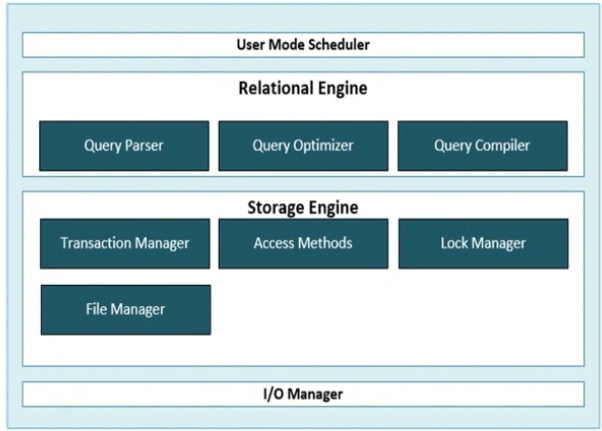

SQL Server 2005 introduced one of the bggest changes to the SQL Server engine, the SQLOS. This is a completely new p;atform layer that functions as a user-level operating system. This new operating system has made it possible to fully utilize current and future hardware and has enabled features like advanced parallelism.

Next image show the architecture of SQL Server 2005 including the SQLOS layer.

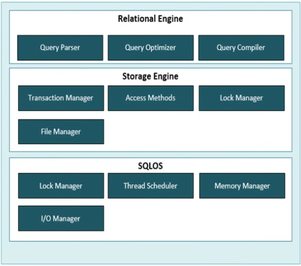

The SQLOS changed the way SQL Server accesses processor resources by introducing schedulers, tasks, and worker threads. The OS yses a oreenotive shceduling approach. This means that windows willgive every process that needs processor time a priority and fixed slice of time, or a quantum. This process priority is calculatred froma number of variables like resource usage, expected runtime, current activity , and so forth. By using preemptive shdeuling, the Windows operating system can choose to interrupt a process when a process with a higer priority needs processor time. This way of scheduling can have a negative impact on processes generated by SQL Server, since those processes could easily be interrupted by higher priority ones, including those of other applications. For this reason, the SQLOS uses its own non-preemtive scheduling mechanism, making sure that windows processes cannot interrupt SQLOs processes.

### 1.2 Shcedulers, Taks, and Worker Threads

Because the SQLOS uses a different method to execute requests than the OS system uses, SQL Server introduced a different way to schedule processor time using schedulers, tasks, and worker threads. Next figure shows the different parts of SQL Server scheduling
and how they relate to each other.

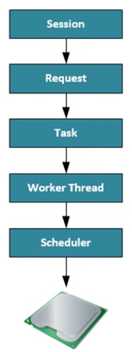

#### 1.2.1 Sessions

A session is the connection a client has to the SQL Server it is connected to.
```sql
SELECT * FROM sys.dm_exec_sessions;
```
User sessions will have a session_id greater than 50, everything lower is reserverd for internal SQL Server processes. It is better to filter the results of the [sys].[dm_exec_sessions] DMV using the [is_user_process] greater than 50.
Some of the more interesting columns that deserve some extra explanation are the [host_process_id], wich is the Process ID of the client program connected to the SQL Server. The [cpu_time] (in milliseconds) session has used since it was first established. The [memory_usge] column displays the amount of memory used by the session (number of 8 KB pages used). The [status] column will show you if the sessin has any active requests. The most common values are "RUNNING", wich indicates that one or more requests are currently being processed from, this session, and "SLEEPING", which means no requests are currently beinf processed from this session.

#### 1.2.2 Requests

A request is the SQL Server execution engine’s representation of a query submitted by a session.

```sql
SELECT * FROM sys.dm_exec_requests;
```

#### 1.2.3 Tasks

Tasks represent the actual work that needs to be performed by the SQLOS, but they do not perform any work themselves. When a request is received by SQL Server, one or more tasks will be created to fulfill the request. The number of tasks that get generated for a request depends on if the query request is being performed using parallelism or if it’s being run serially.

We can use the [sys].[dm_os_tasks] DMV to query the task information, like I did in the following example query: 

```sql
SELECT * sys.dm_os_tasks;
```

#### 1.2.4 Worker Threads

Worker threads are where the actual work for the request is being performed. Every task that gets created will get a worker thread
assigned to it, and the worker thread will then perform the actions requested by the task. 
A worker thread will actually not perform the work itself; it will request a thread from the Windows operating system to perform the
work for it.

When a task requests a worker thread SQL Server will look for an idle worker thread and assign it to the task. In the case when no idle worker thread can be located and the maximum number of worker threads has been reached, the request will be queued until a worker
thread inishes its current work and becomes available.

There is a limit to the number of worker threads SQL Server has available for processing requests. This number will be automatically
calculated and conigured by SQL Server during startup. We can also calculate the maximum number of worker threads ourselves using
these formulas:

32-bit system with less than, or equal to, 4 logical processors: 256 worker threads
32-bit system with more than 4 logical processors: 256 + ((number of logical processors – 4) * 8)
64-bit system with less then, or equal to, 4 logical processors: 512 worker threads
64-bit system with more than 4 logical processors: 512 + ((number of logical processors – 4) * 16)

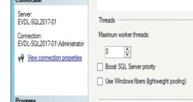

One thing to keep in mind is that worker threads require memory to work. For 32-bit systems this is 512 KB for every worker thread; 64-bit systems will need 2048 KB for every worker thread. Thus, changing the number of worker threads can potentially impact the memory requirements of SQL Server.
SQL Server will automatically destroy worker threads if they have been idle for 15 minutes or if your SQL Server is under heavy memory pressure.

```sql
SELECT * FROM sys.dm_os_workers;
```

The sys.dm_os_workers DMV is a very large and complex DMV where many columns are marked as “Internal use only” by Microsoft.

The columns [task_address] and [scheduler_address] are available to link together the different DMVs we have discussed.
Worker threads go through different phases while they are being exposed to the processor, which we can view when we look at the
state column in the sys.dm_os_workers DMV:
    
    INIT        : The worker thread is being initialized by the SQLOS.
    RUNNING     : The worker thread is currently performing work on a processor.
    RUNNABLE    : The worker thread is ready to run on a processor.
    SUSPENDED   : The worker thread is waiting for a resource.

The states the worker threads go through while performing their work are one of the main topics of this book. Every time a worker
thread is not in the “RUNNING” state, it has to wait, and the SQLOS records this information into wait statistics, giving us valuable insight into what the worker thread has been waiting on and how long it has been waiting.

#### 1.2.5 Scheduler

The scheduler component’s main task is to—surprise—schedule work, in the form of tasks, on the physical processor(s). When a task requests processor time it is the scheduler that assigns worker threads to that task so the request can get processed. It is also responsible for making sure worker threads cooperate with each other and yield the processor when their slice of time, or quantum, has expired. A scheduler will only let one worker thread run on a processor at a time. If the worker threads didn’t need to yield, a worker thread could stay on the processor for an ininite amount of time, blocking all usage of that processor.

```sql
SELECT * FROM sys.dm_os_schedulers;
```

SQL Server uses its own schedulers to perform internal tasks, and those schedulers are also returned by the DMV and are marked “HIDDEN ONLINE” in the status column of the DMV. The schedulers that are available for user requests are marked as “VISIBLE ONLINE” in the DMV. There is also a special type of scheduler with the status “VISIBLE ONLINE (DAC).” This is a scheduler dedicated for use with the Dedicated Administrator Connection (DAC).

We can view the number of worker threads a scheduler has associated with it by lookiing ar the [current_workers_count] column. The [active_workers_count] shows us the worker threads that are active on the specific scheduler. The [work_queue_count] is also an interesting coluymn since it will give you insight into how many tasks are waiting for a free worker thread. If you see high numbers in this column, it might mean that you are experiencing CPU pressure.

Puttin all together
The following text is an example of how a query request would get processed. A user connects to the SQL Server through an application. The SQL Server will create a session for that user after the login process is completed successfully. When the user sends a query to the SQL Server, a task and a request will be created to represent the unit of work that needs to be done. The scheduler will assign worker threads to the task so it can be completed.

```sql
SELECT
    r.session_id AS 'Session ID', r.command AS 'Type of Request', qt.[text] AS 'Query Text',
    t.task_address AS 'Task Address',t.task_state AS 'Task State', w.worker_address AS 'Worker Address',
    w.[state] AS 'Worker State', s.scheduler_address AS 'Scheduler Address', s.[status] AS 'Scheduler State'
FROM sys.dm_exec_requests r
CROSS APPLY sys.dm_exec_sql_text(r.sql_handle) qt
JOIN sys.dm_os_tasks t
ON   r.task_address = t.task_address
JOIN sys.dm_os_workers w
ON   t.worker_address = w.worker_address
JOIN sys.dm_os_schedulers s
ON   w.scheduler_address = s.scheduler_address
WHERE r.session_id = 55
```

In the results we can see that Session ID 53 made a SELECT query request. I did a cross apply with the sys.dm_exec_sql_text Dynamic
Management Object to show the query text of the request. The request was mapped to a task, and the task began running. The task was then
mapped to a worker thread that was then also in a running state. This meant that this query began being processed on a processor. The
Scheduler Address column shows on which specific scheduler our worker thread was being run.

### 1.3 Wait Statistics

When a worker thread is performing its work, it goes through three different phases (or queues) in the scheduler process. Depending on the phase (or queue) a worker thread is in, it will get either the “RUNNING,” “RUNNABLE,” or “SUSPENDED” state.


When a worker thread gets access to a scheduler it will generally start in the Waiter List and get the “SUSPENDED” state. The Waiter List
is an unordered list of worker threads that have the “SUSPENDED” state and are waiting for resources to become available.

While a worker thread is in the Waiter List the SQLOS records the type of resource it needs to continue its work (the wait type) and the time it spends waiting before that speci ic resource becomes available, known as the resource wait time.
Whenever a worker thread receives access to the resources it needs, it will move to the Runnable Queue , a irst-in-irst-out list.

The irst worker thread in the Runnable Queue will move to the “RUNNING” phase, where it will receive processor time to perform its
work. The time it spends on the processor is recorded as CPU time. In the meantime, the other worker threads in the Runnable Queue will
move a spot higher in the list, and worker threads that have received their requested resources will move from the Waiter List into the
Runnable Queue. While a worker thread is in the “RUNNING” phase there are three scenarios that can happen:

* The worker thread needs additional resources; in this case it will move from the “RUNNING” phase to the Waiter List.
* The worker thread spends its quantum (ixed value of 4 milliseconds) and has to yield; the worker thread is moved to the bottom of the Runnable Queue.
* The worker thread is done with its work and will leave the scheduler.

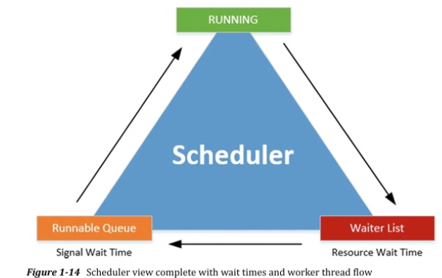

It possible to calculate the total request execution time, and also the total time a request had to wait for either processor time or resource time.

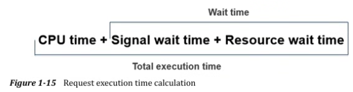

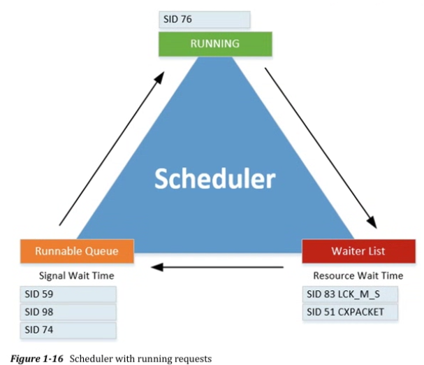

SID 76 is "RUNNING", SID 83 and 51 are "waiting" for their requested resources.
While these two sessins are in the Waiter List, SQL Server will be recording the time thes spend there as wait time, and the wait type. They would both have the "SUSPENDED" state. SID 59, 98 and 74 have their resources ready and waiting in the Runnable queue for SID 76 to complete its work on the processor. While ther are waiting in the Runnable queue, SQL Server records the time they spend there as the signal wait time and adds that time to the total wait time. These three worker threads will have the status of "RUNNABLE".

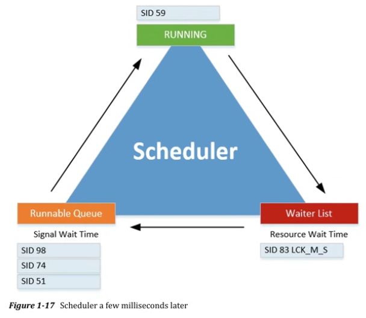

SID 76 completed its time on the processor; it didn’t need any additional resources to complete its request and thus left the scheduler.
SID 59 was the irst worker thread in the Runnable Queue, and now that the processor is free it will move from the Runnable Queue to the
processor, and its state will change from “RUNNABLE” to “RUNNING.” SID 51 is done waiting on the CXPACKET wait type and moved from the
Waiter List to the bottom of the Runnable Queue, changing its state from “SUSPENDED” to “RUNNABLE.”

* NOTES

<r>Es necesario identificar por separado los tiempos de [Resource Wait Time] y [Signal wait time]?</r>
<r>En cuanto a analisis de performance a mi me sireve tener esto por separado?</r>


## 2. Querying SQL Server Wait Statistics

The most useful DMVs are:

* <b>sys.dm_os_wait_stats </b>

* <b>sys.dm_os_waiting_tasks</b>

* <b>sys.dm_exec_requests</b>

* <b>sys.dm_exec_session_wait_stats</b>

SQL Server 2008 introduce another way to view statistics, Extended Event.
SQL Server 2016 SP1 introduced two new methods to access wait statistics:

* sys.dm_exec_session_wait_stats
* By addeding wait statistics information on a per-query basis inside execution plans.

In SQL Server 2017 Microsoft took recording wait statistics another step forward by including them inside the Query Store. The Query Store is a feature that was introduced in SQL Server 2016 and acts like a fligthrecorder for your query workload, logging query statements, performance, and resoruce utilization.

### 2.1 sys.dm_os_wait_stats

This DMV is the replacemente for the DBB SQLPERF('WAITSTATS'). This DMV shows the total amount of wait time for every wait type since the start or restart of your SQL server, It is also cumulative, adding wait time to the different wait. The DMV can be helpful if you are looking for that grand total of wait time for every wait type, but many times you are insterested in the wait time for a specific time segment. In this case it is possible to reset the DMV whitout having to reset your SQL Server by using DBCC SQLPERF('sys.dm_os_wait_stats', CLEAR)

Bellow you can see the most important columns of this DMV:

* wait_type = returns the wait type
* waiting_tasks_count = shows a total of how many times a worker thread had to wait for that specific wait type
* wait_time_ms = returns the total wait time in milliseconds for that specific wait type since the start of the SQL Server instance or a manual resety of the DMV. This is the time a qorker thread has spent in the Waiter List in the "SUSPENDED" state. It also includes the time the worker thread spent in the Runnable queue in the "RUNNABLE" state while waiting for the scheduler to gran it processor time.
* max_wait_time_ms =  shows the maximum wait time in milleseconds a worker thread waited on that specific wait type.
* signal_wait_time_ms =  tells us the amount of time in milliseconds the worker thread spent in Runnagle Queue waiting for processor time.

you may have notice that this DMV does not return a column for the RESOURCE WAIT TIME. If we want to display the resource wait time as an additional column, we will need to calculate the calue ourselves.

```sql
ADD THE QUERY FROM PAGE 27
```

### 2.2 sys_dm_os_waiting_tasks

This can give you information about waht your SQL Server is currently waiting on. Querying this DMV will give you and overview of all the tasks that acurrently have worker threads waiting in the Waiter List or Runnable Queue for either resource or processor time.
Following is the most important column on the DMV:

* waiting_task_address = shows the address of the task that is currently waiting
* session_id = give us the ID of the Session
* exec_context_id - will return the I of the execution context.  this value will only change from the default of 0 if the tas is being performed using parallelism.
* wait_duration_ms = shows us the time in milliseconds that the task has been waiting
* wait_type = returns the wait type the task is currently waiting on
* resource_adderess =  returns memory address information about the resource we are currently waiting for
* blocking_task_address = will return the address of the rask that is currently blocking the task
* blocking_exec_context_id = in this case it will return the ID of the execution context. This will only return a result other than NULL when a task gets executed using parallelism and one of the threads is responsible for the block
* resource_description = will give additional information avout the resource the task is waiting for.
    
### 2.3 sys.dm_exec_request

This DMV return info about all the requests that are currently getting processed by SQL.
The most important columns are:

* session_id, return the ID of the session
* start_time, shows the date and time then the request got created
* command, returns info about what kind of actuib the resquest is performing
* sql_handle, gives us a hash value if the SQL text that is being executed in the request. Not all requests have an SQL handle and generally you should only see a SQL handle if the request was initiated by the user session and a SQL query is involved. The SQL handle hash can be used as input for the DMF sys.dm_exec_sql_text to retrieve the query that is being executed by the request.
* plan_handle, returns the hash value of the execution plan. We can use plan_handle the same way as the sql_handle, but instead od returning the query it will return the execution plan of the query. We can use the hash value as input for the DMF sys.dm_exec_query_plan in order to return the execution plan of the query that is being executed by the request
* wait_type, returns the current wait type if the request is either SUSPENDED or RUNNABLE. Tje value will be NULL if the request is currently being processed
* last_wait_type, returns the last wait type the request encountered if it had to wait during its execution
* total_elapsed_time, column returns the total time, in milliseconds it took to preocess the request from the moment it got created

```sql
ADD THE QUERY FROM PAGE 31
```

### 2.4 sys.dm_exec_session_wait_stats

This DMV returns information on a per session level. A session is an active connection a user or process has with SQL Server. A session can have multiple requests, wich in turn can have multiple tasks performing the actions required to execute a query.

What is important to point out is that wait statistics information that is recorded through this DMV is cumulative for all the actions that a specific session performed while it was active. This means it is very important to undestand what happened during the lifetime of a session. Has the session already been busy executing large batches of queries? ir has it only executed a single query statement?

## 3. Combining DMVs to Detect waits right now

Below image shows a flowchart of how could use wait statistics information to analyze a performance problem.

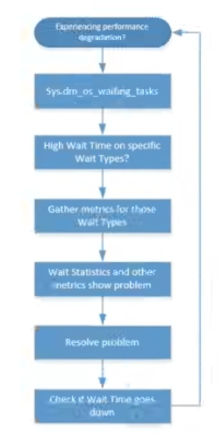

## 4. Viewing wait statistics using perform

One of the most importan tools for accessing the extra metris we need when analyzing wait statistics is the Windows PErformance Monitor.
On this you can see counters under the SQLServer:Wait Statistics category when adding counters inside the Perform applications.
The wait statistics indie Perform are grouped inside categogires. We won't find information about specific wait types here, so if we want to use PErform to analyze wait statistics we should have a general idea of what category a specific wait type belongs to in Perform.

## 5. Capturing wait statistics using extended Events

With EX it is possible to capture the exact wait times a query encountered and on what wait types it had to wait.
There are many different wait related events available when working with EX. We can view these events by running a query against the sys.dm_ex_map_values DMV.

```sql
SELECT *
FROM sys.dm_xe_map_values
WHERE name = 'wait_types'
```

Jonathan Kehayias wrote a blog post mapping some of the wait types to XE you can taeke a look at it here:

<o>www.sqlskills.com/blogs/jonathan/mapping-waittypes-in-dm_os_wait_stats-to-extended-events/</o>

## 6. Capture wait statistics information for a specific query

Use the below query to create a XE to capture queries:

```sql
CREATE EVENT SESSION [WaitStats Query] ON SERVER
 ADD EVENT sqlos.wait_info ( ACTION(sqlserver.sql_text) WHERE ([sqlserver].[session_id]=(52)) )
 ADD TARGET package0.event_file ( SET filename = N'E:\Data\WaitStats_XE.xel', metadatafile = N'E:\Data\WaitStats_XE.xem' )
```

We included the metadata file in the preceding script by setting the metadatafile parameter. If you are running SQL Server 2012 or higer, this is no longer required.

The next thinkg we want to do is start the XE session, which we can do by executing the ALTER EVENT SESSION command.

```sql
ALTER EVENT SESSION "WaitStats Query" ON SERVER STATE = START;
```

We can stop it using the ALTER EVENT SESSION command:

```sql
ALTER EVENT SESSION "WaitStats Query" ON SERVER STATE = Stop;
```

Now we nees to import the information in the file into a table so we can actually see what the session capture, we do this usiung the sys.fn_xe_file_target_read_file function.

The query below can be used to read an XE file, import it into a temporary table, and return the results as rows

```sql
-- Check if temp table is present-- Drop if exist
IF OBJECT_ID('tempdb..#XE_Data') IS NOT NULL
DROP TABLE #XE_Data
-- Create temp table to hold raw XE data
CREATE TABLE #XE_Data (XE_Data XML);
GO
-- Write contents of the XE file-- into our table
INSERT INTO #XE_Data(XE_Data)
SELECT CAST (event_data AS XML) FROM sys.fn_xe_file_target_read_file ('E:\Data\WaitStats_XE_0_130702270937280000.xel', ', 'E:\Data\WaitStats_XE_0_130702270940210000.xem null, null);
GO
-- Query information from our temp table
SELECT XE_Data.value ('(/event/@timestamp)[1]', 'DATETIME') AS 'Date/Time',
    XE_Data.value ('(/event/data[@name=“opcode”]/text)[1]','VARCHAR(100)') AS 'Operation',
    XE_Data.value ('(/event/data[@name=“wait_type”]/text)[1]', 'VARCHAR(100)') AS 'Wait Type',
    XE_Data.value ('(/event/data[@name=“duration”]/value)[1]', 'BIGINT') AS 'Wait Time',
    XE_Data.value ('(/event/data[@name=“signal_duration”]/value)[1]', 'BIGINT') AS 'Signal Wait Time',
    XE_Data.value ('(/event/action[@name=“sql_text”]/value)[1]', 'VARCHAR(100)') AS 'Query'
FROM #XE_Data
ORDER BY 'Date/Time' ASC;
```

## 7. Analyzing wait statistics on a per-query basis using execution plans

The release of SQL server 2016 SP1 introduced wait statistics capture inside query execution plans. This means you can easily see what wait types and wait times your query encountered while running.

Since we are interested in wait statistics, the most interesting part of the execution plan properties is recorded all the qway at the bottom of the properties windows. When expanding the WaitStats properties you are able to see all of the wait types and wait times this specific query ran into while executing.


# <g>Part II (Wait Types)

## 1. CPU-Related Wait Types

## 1.1. CXPACKET

### 1.1.1 What CXPACKET is?

CXPACKET occurs whenever a query is being executed in parallel instead of serial. The advantage ios bigger for queries that are returning large results sets, queries that return only a few rows benefit far less from parallelism.

Parallel queries will use multiple worker threads to execute a request. A parallel query will also use a 0 thread, called the control thread. This - threads task is to coordinate the work of the other worker threads. While the 0 thread is waiting for the other worker threads to finish the work they were assigned to perform, it will record wait times of the CXPACKET wait types. To understand this relation a little bit better, take a lok at figure below:

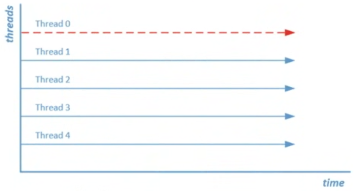

<r>Cost Threshold for Parallelism and Max Degree of Parallelism</r> settings impact parallel queries the most. The <r>Cost Threshold for Parallelism</r> setting configures the cost threshold of when a query will be considered to be run in parallel by the Query Optimizer. By default, the setting has a value of 5 and can be configured to have a value between <r>0 and 32767</r>.
The <r>Max Degree of Parallelism</r> setting sonfigures the number of schedulers used when executing a parallel plan. By default, this setting is configured to be 0, which means all available schedulers can be used when a parallel plan is executed. If you are running SQL Server 2016 or higher, you are also able to configure the parallelism setting on a database level through database scoped configuration items.

Whit the ability to add databases scoped configuration values for parallelism settings, there is a difference in how the SQL Server engine processes these configurations:

* The DB scoped configuration setting will overwrite the current instance setting only if the DB scoped setting is set to a nondefault value.
* If the DB scoped configuration setting is set to its default value, the instance wide configuration setting will be used.

### 1.1.2 Lowering CXPACKET?

A better approach to lowering CXPACKET waits is to tune the Cost Threshold for Parallelism and Max Degree of Parallelism options so they match with your workload. This way you can make sure only the queries that benefit the most from parallelism will be run in parallel. You should generally focus on queries that access a lot of information and have a longer runtime in general, as those will be the queries that benefit the most from.

Another setting to keep in mind is the Max Degree of Parallelism option. When it is set at ists default of 0 all available schedulers can be used when a query runs in parallel. Using more scheduler doesn't necessarily mean the query executes faster though. The benefits of using more schedulers slowly get smaller after using more than 8. Mocosoft recommeds the following configuration in KB2806535.

* For Server with more than eight cores, set the Max Degree of PArallelism option to 8
* For Server with less than eight cores, set the Max Degree of PArallelism option to 0 or to the number of cores in your server

Lowering CXPACKET by resolvin skewed workloads. A skewed workload means that all of the worker threads do not receive the same amount of work to perform. This is not anoptional situation, because if one worker thread has to do most of the work while another only a little bit, thread 0 still has to wait for the longest running worker thread to complete.

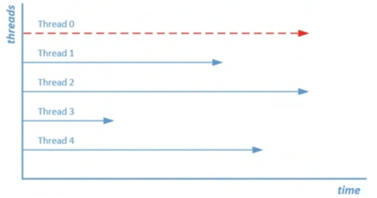

We can view the thread distribution in the actual number of rows property of the parallel operation in the actual execution plan.
Skewed workloads are often caused by outdated statistics.

### 1.1.3 Example

  ```sql
  SET STATISTICS TIME ON
  SELECT * FROM Sales.SalesOrderDetail ORDER BY CarrierTrackingNumber DESC OPTION (MAXDOP 1);
  ```

## 1.2. CXCONSUMER

As we described earlier, parallelism consists of two parts: <r>procedures</r> and <r>consumers</r>. The easiest way is to think of the 0 thread we introduced earlier to tbe a producer. It is the job of the 0 thread to distribute work to the available parallel worker threads. Those worker threads are named consumers and perform the actual work the producers send to them.

Before SQL Server 2017 CU3 and SQL Server 2016 SP2, there is no way to distinguish if, for instance, consumers are spending time waiting on producers to send work to them. With the changes in SQL Server 2017 and SQL Server 2016 SP2 the development team split up the wait times for parallelism into two different categories: CXPACKET and CXCONSUMER.

CXCONSUMER waits can occur whenever a consumer thread is waiting for producer to send rows. This is more or less normal behavior and can in most cases be safely ignored when looking at wait statistics information.

CXCONSUMER waits are now recorded withut the CXCONSUMER wait time, meaning that seeing CXPACKET wait time not only indicate parallelism ocurring but also that high wait times indicate a clearer issue regarding parallelism operations.

### 1.2.1 CXPACKET and CXCONSUMER Summay

Focus on tuning the Max Degree of Parallelism and Cost Threshold for Parallelism options so that the thresholds are high enough that your large wueries can benefit from using parallelism but your smal queries do not experience a negative impact. Also, avoid skewed workloads by making sire your statistics are up to date.


## 1.3. SOS_SCHEDULER_YIELD

### 1.3.1 What SOS_SCHEDULER_YIELD is?

This wait ocurr as soon as you start running queries on your SQL Server instance, and they are closely related to SQL Server scheduling. 
This wait type has a direct relation with the SQLOS's cooperative, non-preemptive scheduling.


Generally, a worker thread starts on the Waiter List while it waits for resources, it then moves to the Runnable Queue waiting for its turn to be run on the processor, and inally receives processor time to execute its request, receiving the “RUNNING” state. If the worker thread needs additional resources while it is in the “RUNNING” state, the worker thread moves back to the Waiter List and starts a new trip through the different queues and phases.

There is one exception to this behavior and it occurs when a worker thread is in the “RUNNING” state and doesn’t need additional resources
to complete its work. If the SQLOS let a worker thread run on the processor for as long as it didn’t need any additional resources, the
processor could be “hijacked” by one single worker thread for an ininite amount of time. To make sure a situation like this cannot occur,
the scheduler gives every worker thread a specific slice of time in which they need to perform their work. We call this slice of time a quantum, and it is a fixed, unchangeable, 4 milliseconds. If a worker thread spends its quantum it has to yield the processor, and it then moves back to the bottom of the Runnable Queue. It will skip the Waiter List because the worker thread doesn’t need additional resources. While the worker thread is waiting to move back to the processor again, the SOS_SCHEDULER_YIELD wait type is recorded. Figure below shows this behavior:

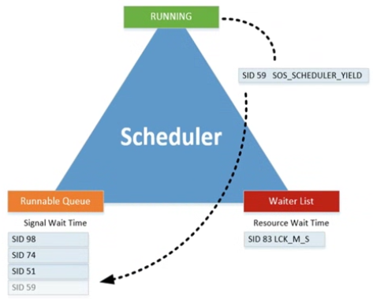

To show you an example of this, I executed the following queries against the AdventureWorks

```sql
-- Clear Wait Stats
 DBCC SQLPERF('sys.dm_os_wait_stats', CLEAR);-- Simple select
 SELECT *
 FROM Sales.SalesOrderDetail
 ORDER BY CarrierTrackingNumber DESC;-- Check for SOS_SCHEDULER_YIELD waits
 SELECT *
 FROM sys.dm_os_wait_stats
 WHERE wait_type = 'SOS_SCHEDULER_YIELD';
```

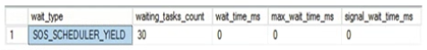

30 times during execution it didn't have to spend any time waiting for another worker thread in the Runnable Queue since this was the only query running at the time. If it had spent any time waiting for another worked thread, the [wait_time_ms] column would have returned a value higher than 0.

There are basically three situations you can encounter when dealing with [SOS_SCHEDULER_YIELD] waits as shown below:


### 1.3.2 Lowering SOS_SCHEDULER_YIELD waits

If you are experiencing high wait times fo the [SOS_SCHEDULER_YIELD] wait types together with a large amount of waiting tasks, you can assume you have a very busy SQL Server instance. Worker threads will yield, but it will take them a long time to get back on the processor again because there are many other threads waiting in the Runnable Queue.

### 1.3.3 Example 

To show you an example of this problem, we will use the Ostress utility to execute a specific query simultaneously from a number of
threads. The <b>Ostress</b> utility is part of the RML utilities for SQL Server, which you can download here:
https://support.microsoft.com/en-us/kb/944837 

The first thing we are going to do is save the following query as C:\sos_scheduler_yield.sql on the test server:
```sql
WHILE (1=1)
BEGIN
  SELECT COUNT(*)
  FROM Sales.SalesOrderDetail
  WHERE SalesOrderID BETWEEN 45125 AND 54185
END
```

After saving the query we start the Ostress utility using the following command:

"C:\Program Files\Microsoft Corporation\RMLUtils\ostress.exe" -E dAdventureWorks -i"C:\sos_scheduler_yield.sql" n20 -r1 -q

As soon as we start OStress, the CPU of the test SQL Server hists 100%.

This is the tricky part of the [SOS_SCHEDULER_YIELD] wait type, as it frequently won't get returned by the [sys.dm_os_waiting_tasks] DMV. To show that the high CPU usage is related to the [SOS_SCHEDULER_YIELD] wait type we have to tale a look at the cumulative wait statistics DMV.

```sql
SELECT TOP 5 * FROM sys.dm_os_wait_stats ORDER BY wait_time_ms DESC;
```

As you can see, the number one wait type, by far, is SOS_SCHEDULER_YIELD with a pretty high amount of waiting_tasks and total wait_time.
If you were to experience this problem with a production SQL Server instance, the first thing you should focus on are those very small,
very quick queries like the ones we executed in this example. Has the volume of those queries increased? Has the number of user connections to the SQL Server executing those queries increased?. Another cause of high SOS_SCHEDULER_YIELD waits, together with very high CPU usage, can be a phenomenon called spinlock contention. Spinlocks are deined by Microsoft as “lightweight synchronization primitives which are used to protect access to data structures” and are a very advanced topic. <r>Appendix II, goes into a little bit more detail about spinlocks for those who are interested in learning more about them.</r>

Very large, very complex queries can also lead to higher SOS_SCHEDULER_YIELD wait times. Try looking for active queries that consume a lot of CPU time and have complex calculations or data type conversions inside them. One query I use frequently to identify CPU-heavy queries is the one below:

```sql
SELECT TOP 10
  QText.TEXT AS 'Query',
  QStats.execution_count AS 'Nr of Executions',
  QStats.total_worker_time/1000 AS 'Total CPU Time (ms)',
  QStats.last_worker_time/1000 AS 'Last CPU Time (ms)',
  QStats.last_execution_time AS 'Last Execution',
  QPlan.query_plan AS 'Query Plan'
FROM sys.dm_exec_query_stats QStats
CROSS APPLY sys.dm_exec_sql_text(QStats.sql_handle) QText
CROSS APPLY sys.dm_exec_query_plan(QStats.plan_handle) QPlan
ORDER BY QStats.total_worker_time DESC;
```

Another method you can use to identify queries that are expensive CPU wise is the Query Store. The Query Store a built-in report called [Top Resource Consuming Queries] that immediately allows you to filter on CPU Time.


## 1.4 THREADPOOL

### 1.4.1 What THREADPOOL is?

This occurs when there are no more free worker threads available to process request. When this situation occurs, tasks taht are currently waiting to be assigned to a worker thread will log the THREADPOOL wait type.

The number of worker threads that are acailable for your system depends on the number of processors and the processor architecture.

CPU Number  32-Bit Architecture   64-Bit Architecture
 ≤4          256                  512
 8           288                  576
 16          352                  704
 32          480                  960
 64          736                  147

You can also calculate the maximum number of worker threads available by using these formulas:
  * 32-bit systems with less than, or equal to, 4 logical processors: 256 worker threads
  * 32-bit system with more than 4 logical processors: 256 + ((number of logical processors − 4) × 8)
  * 64-bit system with less than, or equal to, 4 logical processors: 512 worker threads
  * 64-bit system with more than 4 logical processors: 512 + ((number of logical processors − 4) × 16)
 
Even though SQL Server calculates the maximum amount of available worker threads automatically (only once during startup), you can choose to overwrite the default by changing the Maximum Worker Threads option inside the Processors properties of your SQL Server instance, as shown below. By default, the value of the Maximum Worker Threads option will be 0, which means SQL Server will calculate and assign the maximum amount of worker threads available using the preceding formulas.

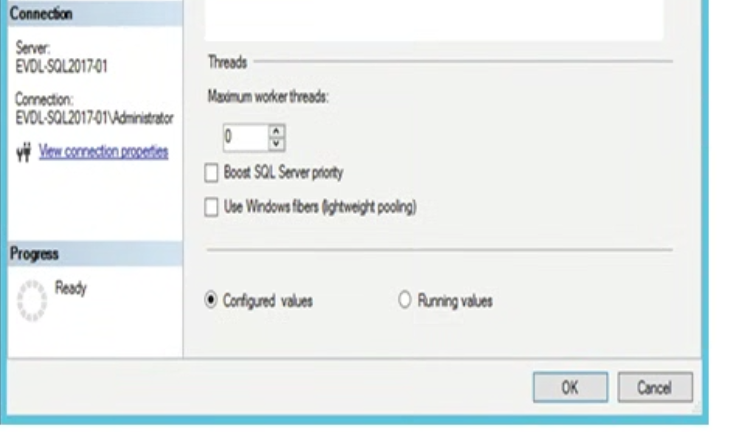

You can also query the number of worker threads assigned to your SQL Server instance by running the following query:

```sql
SELECT max_worker_count FROM sys.dm_os_sys_info
```

### 1.4.2 Example

Use the Ostress utility create .sql file (select_rnd.sql)

```sql
SELECT TOP 1 * FROM Sales.SalesOrderDetail ORDER BY NEWID() OPTION (MAXDOP 1)
```

Before launch Ostres utility we are going to lower the maximum amount of worker threads

```sql
EXEC sp_configure 'show advanced options', 1;
GO
RECONFIGURE
GO
EXEC sp_configure 'max worker threads', 128;
GO
RECONFIGURE
GO
```

Lets fire the Ostress and execute the sql script created earlier:

"C:\Program Files\Microsoft Corporation\RMLUtils\ostress.exe" -E -d AdventureWorks -i"C:\select_rnd.sql" -n150 -r10 -q

While the script is running, let’s take a look at the number of worker threads running and waiting using the sys.dm_os_schedulers DMV:

```sql
SELECT  scheduler_id, current_tasks_count, runnable_tasks_count, current_workers_count, active_workers_count,  work_queue_count
FROM sys.dm_os_schedulers
WHERE status = 'VISIBLE ONLINE';
```

The most important columns here are the current_workers_count, active_workers_count, and work_queue_count columns. The current_workers_count column shows the number of worker threads associated with this scheduler; this number also includes worker threads that are not yet assigned to a task. The active_workers_count column returns the number of worker threads that are in the “RUNNING,” “RUNNABLE,” or “SUSPENDED” states. The big difference between the current_workers_count and the active_workers_count columns is that the active_workers_count is the number of worker threads that have been assigned to a task, while the current_workers_count returns all the worker threads. The work_queue_count column shows us the number of tasks that are currently waiting to get a worker thread assigned to them.

```sql
SELECT * FROM sys.dm_os_waiting_tasks WHERE session_id > 50
```

We could conclude that nothing is waiting. The test SQL Server is responding incredibly slowly though, and querying anything requires multple seconds.

Let's check the sys.dm_os_waiting_tasks DMV whitout filtering

```sql
SELECT * FROM sys.dm_os_waiting_tasks
```

THREADPOOL waits are not logged as user sessions, but actually have an empty session_id

### 1.4.3 Getting access to our SQL Server during THREADPOOL

The first step you should take to take sure you don't get into a situation where you cannot connect to your SQL Server instance for troubleshooting is to enable the Dedicated Administrator Connection (DAC).

If you connect through the DAC to your SQL Server instance, your session will be mapped to the DAC scheduler. This makes it possible to
connect and execute queries even if all the other schedulers have massive task queues. You can enable the DAC by executing the following query:

```sql
sp_configure 'remote admin connections', 1
GO
RECONFIGURE
GO
```

If you want to connect to your SQL Server instance using the DAC you need to add the ADMIN: preix to the server name you are connecting to

### 1.4.4 Lowering THREADPOOL waits caused by Parallelism

One of the most common causes for THREADPOOLwaits is related to the extensive use of parallelism during query execution.
If you run into this specific case of high and frequent THREADPOOL waits you will usually see many CXPACKET waits as well. To show this behavior I have modified the query we used to generate THREADPOOL waits so that it will execute using paralellism.

```sql
SELECT TOP 1 *
FROM Sales.SalesOrderDetail
ORDER BY NEWID()-- OPTION (MAXDOP 1)
```

For this example I also conigured the Max Degree of Parallelism to its default value of 0, and set the Cost Threshold for Parallelism option to 1. I left the Max Worker Threads option on a value of 128 as we conigured earlier.

If we now repeat the same Ostress test, we should see THREADPOOL waits occur again in the sys.dm_os_waiting_tasks DMV.

"C:\Program Files\Microsoft Corporation\RMLUtils\ostress.exe" -E -d AdventureWorks -i"C:\select_rnd.sql" -n150 -r10 -q

But this time because our test query is executed in parallel we will also find many CXPACKET waits returned by the sys.dm_os_waiting_tasks

If you see this behavior occurring on your SQL Serever instance, it might be worth the effort to check your parallelism configuration.

### 1.4.5 Lowering THREADPOOL waits caused by user connection

Another common cause of THREADPOOL waits is a sudden increase in the number of users connecting and executing queries against your SQL Server instance.
An example we will use a .sql file named wait.sql as input for the Ostress with the following query inside it:

```sql
WAITFOR DELAY '00:05:00'
```

 "C:\Program Files\Microsoft Corporation\RMLUtils\ostress.exe" -E -d AdventureWorks -i"C:\wait.sql" -n120 -r1 -q

We change the number of threads generated by Ostress to 120 and again leave the Max Worker Threads option set to 128 worker threads.
When we query the [sys.dm_exec_sessions] DMV using the following query, we see that many new user sessions, generated by the Ostress utility, are active.

```sql
SELECT *
FROM sys.dm_exec_sessions
WHERE is_user_process = 1;
```

If we query the sys.dm_os_waiting_tasks we see that THREADPOOL waits are ocurring. The big difference between THREADPOOL waits cause by excessive parallelism and an increase in user connections is that the CPU of my test SQL Server instance remains low in the latter case.
Keep in mind that the user connections should only cause THREADPOOL waits when they are actually running queries. User connections that are connected to the SQL Server instance but are not executing anything shoudl not be a reason for TREAHDPOOL.

## 2. IO-Related Wait Types

### 2.1 ASYNC_IO_COMPLETION

#### 2.1.1 What is the ASYNC_IO_COMPLETION wait type?

This waits occur when a task is waiting for a storage related acction to finish. The task is initiated and monitored by SQL Server.

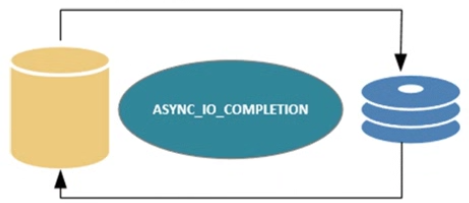

As long as the storate related action is running, the ASYNC_IO_COMPLETION wait time is being logged. The faster your storage subsystem the lower your ASYNC_IO_COMPLETION wit times will be.

#### 2.1.2 Example

Running a db bkp will trigger ASYNC_IO_COMPLETION.

```sql
USE [master]
GO
DBCC SQLPERF('sys.dm_os_wait_stats', CLEAR);
BACKUP DATABASE [AdventureWorks]
TO  DISK = N'F:\Backup\aw_backup.bak'
WITH NAME = N'AdventureWorks-Full Database Backup',
STATS = 2;
GO
SELECT *
FROM sys.dm_os_wait_stats
WHERE wait_type = 'ASYNC_IO_COMPLETION';
```

#### 2.1.3 Lowering ASYNC_IO_COMPLETION

If you want to find out if you ASYNC_IO_COMPLETION waits are occuring because a backup is being performed, try to look for backup related waits occurring at the same time.

```sql
SELECT *
FROM sys.dm_os_wait_stats
WHERE wait_type IN ('ASYNC_IO_COMPLETION', 'BACKUPIO', 'BACKUPBUFFER')
```

Method of lowering ASYNC_IO_COMPLETION waits is by configuring instant file initialization.

This does not affect the speed of your backup but will give increased performance when creating a db, addeding files to a db or restoring a db. Instance file initialization is not enabled by default, unless you are running your SQL Server service under an account that has local administrator privileges.
If you didn't enabled the Grant PErformance Volumn Maintenance Task privilege to the SQL Server Database engine Service checkbok during the installation of SQL Server you will have to configure instant file initialization manually after installation.
To show you the impact of instant file initialization, I used the query below.

```sql
DBCC SQLPERF('sys.dm_os_wait_stats', CLEAR);
CREATE DATABASE [IO_test]
ON  PRIMARY (NAME = N'IO_test', FILENAME = N'E:\Data\IO_test.mdf' , SIZE = 512000KB, FILEGROWTH = 10%)
LOG ON ( NAME = N'IO_test_log', FILENAME = N'E:\Log\IO_test_log.ldf' , SIZE = 102400KB, FILEGROWTH = 10%);
GO
SELECT *
FROM sys.dm_os_wait_stats
WHERE wait_type = 'ASYNC_IO_COMPLETION';
```

If you configured instant file initialization and checked that no backups are being performed at the same time that you are seeing high
ASYNC_IO_COMPLETION waits, the problem might be your storage subsystem. A good method of analyzing potential storage problems is by using Perfmon to monitor the Avg. Disk/sec Read and Avg. 

Disk/sec Write counters on the disks on which your database resides. <r>These counters show you the read and write latency to your disks in seconds (this means a value of 0.005 means 5 milliseconds). SQL Server performs optimally with a maximum latency of 5 milliseconds. Above 20 milliseconds, latency will cause noticeable performance degradation.</r>

### 2.2 ASYNC_NETWORK_IO

#### 2.2.1 What is the ASYNC_NETWORK_IO wait type?

ASYNC_NETWORK_IO occur when client applications cannot process the query results fast enouhg or when you have a network related performance problem. Another situation in which ASYNC_NETWORK_IO waits can occur is qhen you are using a linked server to query remote db.

#### 2.2.2 Lowering ASYNC_NETWORK_IO wait?

The easiest ways to lower this waits is to identify queries that will return a large result set back to the application.
If you believe that this waits are not caused by large results being returned to an application there is also a possibiility that your network configuration is slowing you down. In this case you should first check your network utilization. Sadly, there isn't a counter in Perform that directly shows the network utilization.

<r>This waits type occurs whenever an application requests query results from a SQL Server instance over the network and cannot process the returned results fast enough</r>


### 2.3 CMEMTHREAD

#### 2.3.1 What is the CMEMTHREAD wait type?

Whenever CMEMTHREAD waits occur it means that multiple threads are trying to access the same memory object at the same time.
To explain how CMEMTHREAD wait type generation works, we have to dig a little deeper inside some programming terminology, specifically
the terms mutual exclusions, critical sections, and thread safety. These three concepts play a direct role in the CMEMTHREAD wait type
generation. 

A **critical section** consists of a piece of code that accesses a shared resource that can only be accessed by one thread at a time. In our case the shared resource would be a SQL Server memory object. Because there are many threads that want access to memory objects we have to use a method to ensure only one thread gets access at a time. This method is called **mutual exclusion**.

#### 2.3.2 Lowering CMEMTHREAD wait?

One of the more common situation where this waits can occur is when large amounts of short, concurrent, ad hoc queries are being executed.
All these new execution need to be entered inti the procedure cache, and a memoru object for allocating cache descriptors is accessed.
A good place to start looking if you suspect that this waits are going to occur because of ad hoc queries is the procedure cache. Below query will give you information about the number of execution plans in the procedure cache.

```sql
SELECT objtype, COUNT_BIG (*) AS 'Total Plans', SUM(CAST(size_in_bytes AS DECIMAL(12,2)))/1024/1024 AS 'Size (MB)'
FROM sys.dm_exec_cached_plans
GROUP BY objtype;
```

If possible try to optimize the queries so they generate a reusable plan. If your application uses many dynamic queries thewn try to use the [sp_executesql] system stored procedure instead of the **[EXECUTE (EXEC)]** command.

**<r>THIS WAIT TYPE IS A MEMORY RELATED WAIT TYPE</r>**

**One of the more common cases where CMEMTHREAD waits occur is when your system uses a high amount of ad hoc queries**

### 2.4 IO_COMPLETION

#### 2.4.1 What is the IO_COMPLETION wait type?

IO_COMPLETION waits occur when non data pages are involved like the restore of  a transaction log backupp or when bitmap allocation pppages like the GAM page are accessed. IO_COMPLETION waits can also occur when queries are being axecuted that perform read or write opeerations to the sotrage subsisteed, like a Merge Join operator.

#### 2.4.2 Exampple

```sql
-- Make sure AdventureWorks is in Full recovery model
ALTER DATABASE AdventureWorks SET RECOVERY FULL
GO
-- Perform full backup first-- Otherwise FULL recovery model will not be affected
BACKUP DATABASE [AdventureWorks]
TO  DISK = N'F:\Backup\AW_Full.bak'
GO
-- Make some changes to AW database
USE AdventureWorks
GO
UPDATE Person.Address
SET City = 'Portland'
WHERE City = 'Bothell'-- Backup Transaction Log
BACKUP LOG [AdventureWorks]
TO  DISK = N'F:\Backup\AW_Log.trn'
GO
-- Restore the previous full backup with
NORECOVERY
USE [master]
GO
RESTORE DATABASE [AdventureWorks]
FROM  DISK = N'F:\Backup\AW_Full.bak'
WITH  NORECOVERY, REPLACE
GO
-- Clear sys.dm_os_wait_stats
dbcc sqlperf ('sys.dm_os_wait_stats', CLEAR)-- Restore last Transaction Log backup
RESTORE LOG [AdventureWorks] FROM  DISK = N'F:\Backup\AW_Log.trn'
GO
-- Check IO_COMPLETION waits
SELECT *
FROM sys.dm_os_wait_stats
WHERE wait_type = 'IO_COMPLETION'
```

IO_COMPLETION wait times also occur when you are starting up your database after, for instance, a restart of the SQL Server service. This means you should expect IO_COMPLETION waits after a restart or a failover. These are completely normal

#### 2.4.1 Lowering IO_COMPLETION?

You should analyze the storage subsystem performance like I described in the section before


### 2.5 LOGBUFFER and WRITELOG

#### 2.5.1 What is the LOGBUFFER and WRITELOG wait types?

In short, the following events happen whenever we change or add data inside a database:
  1. Data page where the data resides is modified in the buffer cache; if the page wasn’t already in the buffer cache, it will get read into the buffer cache first.
  2. The data page will be marked as “dirty” inside the buffer cache.
  3. The log records that represent the modi ication get saved in the log buffer.
  4. Writing the log records from the log buffer to the transaction log
  5. The dirty data pages gets written to the data file.

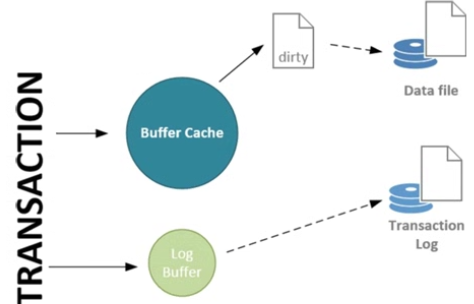

The WRITELOG wait type occurs whenever SQL Server is flushing the contents of the log buffer to the transaction log on disk. The LOGBUFFER wait type occurs when inserting log records in the log buffer, when at the time of insertion SQL Server has to wait for free space inside the log buffer.

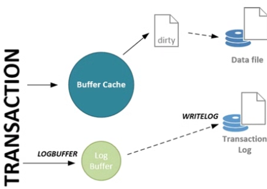

Whenever a long WRITELOG wait ocurrs, changes are you will also see LOGBUFFER waits if the process that is writing the lor records to the transaction log disk cannot process them as fasta as the log records enter the log buffer.
This situation frequently occurs on systems with a lot of concurrent data modifications. This results in a high volume of transactions that need to be written to disk. Another common cause is the performance of the storage subsystem where the transaction log ile resides. If the storage subsystem has suboptimal performance, your WRITELOG wait times will increase, with the possibility existing that LOGBUFFER waits can occur if the volume of transactions is high enough.

#### 2.5.2 Example

```sql
USE master
GO
-- Create demo database
CREATE DATABASE [trans_demo]
ON PRIMARY
( NAME = N'trans_demo', FILENAME = N'D:\Data\trans_demo.mdf' , SIZE = 153600KB , FILEGROWTH = 10%  )
LOG ON
( NAME = N'trans_demo_log', FILENAME = N'D:\Log\trans_demo.ldf' , SIZE = 51200KB , FILEGROWTH = 10%  )
GO
-- Make sure recovery model is set to full
ALTER DATABASE [trans_demo] SET RECOVERY FULL
GO
-- Perform full backup first-- Otherwise FULL recovery model will not be affected
BACKUP DATABASE [trans_demo]
TO  DISK = N'F:\Backup\trans_demo_Full.bak'
GO
-- Create a simple test table
USE trans_demo
GO
CREATE TABLE transactions( t_guid VARCHAR(50) )
GO
```

I am going to execute the query, which I saved to the logbuffer_impl.sql ile, with 200 concurrent connections using the following command 

"C:\Program Files\Microsoft Corporation\RMLUtils\ostress.exe" -E -dtrans_demo-i"C:\logbuffer_impl.sql" -n200 -r1 -q

```sql
DECLARE @i INT

SET @i = 1

WHILE @i < 10000
  BEGIN
    INSERT INTO transactions
        (t_guid)
    VALUES
        (newid())
  SET @i = @i + 1
END
```


#### 2.5.3 Lowering LOGBUFFER and WRITELOG waits

The first approach is to take a good look at how your transactions are being executed. In the preceding example, we implicitly committed
every INSERT statement. This means that as soon as the log record for the INSERT statement entered the log buffer it needed to be flushed
again. If we would explicitly commit the whole WHILE loop we would have larger writes to flush to the transaction log, resulting in better
performance. This is because writing small blocks frequently is generally slower than writing large blocks at a larger interval.

The other approach is based on the storage subsystem. As a best practice make sure to split your transaction log and database fgiles on separate disks, so they do impac each other in times of heavy load.

If your SQL Server instance is running SQL Server 2014, you could choose to make use of the Delayed Durability option, which was introduced in SQL Server 2014. In short, enabling this option will no longer flush the log buffer content to disk when a transaction commits, but rather will wait until the log buffer is full (60 KB) before flushing the contents to the transaction log. By enabling this option, you are running a risk that transactions that have committed, but have not yet been written to the transaction log, will be lost during a failure since they will only be written to the transaction log when the log buffer is full.

### 2.6 RESOURCE_SEMAPHORE

#### 2.6.1 What is RESOURCE_SEMAPHORE wit type?

The RESOURCE_SEMAPHORE wait type is a memory related wait type that can show itself when a query memory request cannot be granted immediately.

During the generation of the compuled plan a calculation is performed to detemine the amount of memory needed to execute the query. Some of the opertaions that require memory are sorts and joins, which temporarily store row data in the memoru of the SQL Server.

When the query gets executed, a memory grant will be determined based on the required and additional memory values calculated in the
compiled plan. This memory grant is needed in order to perform a memory reservation at an internal object called the resource
semaphore. The resource semaphore is responsible for reserving the memory a query needs for execution, but it also manages memory throttling when too many queries concurrently ask for memory reservations or when there is not enough memory available at that time. It does this by maintaining a queue of queries that are requesting memory. If there are no queries inside the queue and a new query requests memory, the resource semaphore will grant it to the query (if enough free memory is available). However, if there is a queue the new
query will be put at the end of the queue, and it has to wait for its turn to receive a memory grant.

Before the resource semaphore will grant the requested memory to a query, it will check whether there is enough free memory to execute
it. If, for some reason, there is less memory available than the amount requested by the query, the query will be put in the queue again until enough memory is available. When a query is inside the resource semaphore queue waiting for its requested memory, the time it spends
inside the queue will be recorded as the RESOURCE_SEMAPHORE wait type.

There is a maximum amount of memory available for the resource semaphore to use, and it is allocated from the buffer cache. The resource semaphore can allocate up to 75% of the memory from the buffer cache for memory grants, but a single query can never get more than 25% of that amount.

#### 2.6.2 Example

We will also use the OStresas tool to create s situation where multiple queries are requesting memory, creating a queue at the resource semaphore.

```sql
SELECT SalesOrderID, SalesOrderDetailID, ProductID, CarrierTrackingNumber
FROM Sales.SalesOrderDetail
ORDER BY CarrierTrackingNumber ASC
```

Before I start Ostress, I must change the maximum server memory value to 250 MB using the following query:

```sql
EXEC sys.sp_configure N'max server memory (MB)', N'250'
GO
RECONFIGURE WITH OVERRIDE
GO
```

I saved the query to a .sql ile named resource_semaphore.sql and executed Ostress using the following command line: 

"C:\Program Files\Microsoft Corporation\RMLUtils\ostress.exe" -E -d AdventureWorks -i"C:\resource_semaphore.sql" -n20-r1 -q

Because we set our maximum server memory to 250 MB, and each query requests 12.25 memoru we don't have enough memory free to grant all the moemory requested. This will result in the RESOURCE_SEMAPHORE wit type.

The resource semaphores themselves have their own DMV [sys.dm_exec_query_resource_semaphores]

```sql
SELECT target_memory_kb, max_target_memory_kb, total_memory_kb, available_memory_kb, granted_memory_kb, grantee_count, waiter_count
FROM sys.dm_exec_query_resource_semaphores
WHERE pool_id = 2
```

I am filtering out pool_id 1 because this pool will not handle user queries. As you might have noticed, two rows are returned. This is because there are actually two different resource semaphores. The top row is the “regular” resource semaphore. This will handle queries that request more than 5 MB memory. The second row (identified by the NULL value of the max_target_memory_kb column) returns information for the “small” resource semaphore, which handles queries that are smaller than 5 MB.

Let’s go through the various columns that are returned by the query against the sys.dm_exec_query_resource_semaphore DMV:

* The target_memory_kb column returns the amount of memory in KB that this resource semaphore plans to use as a maximum amount of memory it can grant to queries.
* The max_target_memory_kb column returns the maximum amount of memory this resource semaphore could grant.
* The total_memory_kb column returns the total memory held by the resource semaphore and is the sum of the available_memory_kb and the granted_memory_kb.
* The granted_memory_kb returns the amount of memory that is granted to queries at this time.
* The grantee_count and waiter_count columns return the amount of grants that have currently been satisied or are waiting in
 the resource semaphore queue.

**SERACH FOR BETTER INFO ABOUT THESE COLUMNS**


#### 2.6.3 Lowering RESOURCE_SEMAPHORE waits

The first possible solution would be to look at the queries that are requesting large amounts of memory for their execution. You should focus on the queries that are performing large sorts or joins. One way to avoid a sort operation would be to add an index to the table where the sort is performed.

Another solution involves parallelism. If queries use parallelism during sort or join operations more memory is requested than when the query is executed serially.

Finally, if you are running an Enterprise Edition of SQL Server you could use the resource governor feature to confgire the memory usega resource pool. By configuring the amount of memory a certain resource pool can use, tou can also set the amount of memory a resource semaphore can grant.

  https://msdn.microsoft.com/en-us/library/bb933866.aspx


### 2.7 RESOURCE_SEMAPHORE_QUERY_COMPILE

#### 2.7.1 What is RESOURCE_SEMAPHORE_QUERY_COMPILE wit type?

this wait type is also related to the memory of your SQL Server instance. But instead of indicating a shortage in query memory the wait type indicates a memory shortage during the compilation process of the query.

The resource semaphores that are related to the RESOURCE_SEMAPHORE_QUERY_COMPILE wait type are responsible for memory grants that are needed during the compilation process of a query, excluding the memory needed for query execution. Just like the resource semaphores in the previous section, the ones responsible for memory grants during the compilation process also have different gateways. Figure below shows the different gateways for the compilation-memory resource semaphore.

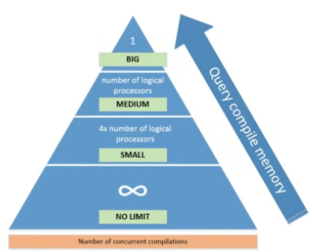

By default there are three gateways: small, medium, and big.

Depending on the amount of memory the compilation of a query needs, it will get assigned to either of the three. If the amount of memory
needed for compilation is less than the memory threshold for the small gateway, the query does not have to pass through a gateway. The
amount of concurrent compilations, or queries, that can move through the gateway simultaneously is calculated by the number of logical
processors available for your SQL Server instance. For example, if your SQL Server instance has four logical processors, the small gateway will allow 16 concurrent compilations and the medium gateway 4. The big gateway will always only allow one query at a time to compile.

#### 2.7.2 Example

The thing we are trying to achieve here is the creation of compilation-memory contention.

```sql
DECLARE @ID VARCHAR(250)
DECLARE @SQL VarChar(MAX)
SET @ID = FLOOR(RAND()*(20000-1)+1);
SET @SQL ='SELECT ' + @ID + ',
    SUM(soh.SubTotal),
    COUNT(soh.SubTotal)
FROM sales.SalesOrderHeader soh
JOIN person.Person p
ON soh.SalesPersonID = p.BusinessEntityID
WHERE p.BusinessEntityID = ' + @ID + '
'
EXEC (@SQL)
```

Before we execute the query with many concurrent connections, let’s check how much compilation memory would be needed. We can do this by executing the query above in SSMS and enabling the actual execution plan.

"C:\Program Files\Microsoft Corporation\RMLUtils\ostress.exe" -E -d AdventureWorks -i "C:\resource_semaphore_compile.sql" -n200 -r100 -q

if we now execute the DBCC MEMORYSTATUS command we should be able to find out at what gateway the compilation contention is occurring.

#### 2.7.3 Lowering RESOURCE_SEMAPHORE_QUERY_COMPILE waits

if you can increase the total amount of memory available for query compilation, chances are you will lower or resolve
RESOURCE_SEMAPHORE_QUERY_COMPILE wait times.
A good first step is to analyze the usage patterns of the gateways. If you notice that one specific gateway constantly has waiting memory requests, then the memory threshold of that gateway, or the maximum allowed amount of concurrent compilation-memory requests, should give you some hints about the root cause. For instance, if you notice many queued compilation-memory requests at the big gateway (which only allows one query at a time), the source of your RESOURCE_SEMAPHORE_QUERY_COMPILE wait times may be the queries that request a large amount of compilation memory. Another cause may be a large number of concurrent queries that all need to access the small gateway, which was the case in our example, causing a queue at the gateway.

In these cases you should find the specific queries that cause the queues at the gateways and try to optimize them, either by lowering the amount of compilation memory or by making sure fewer compilations happen.

Jonathan Kehayias of SQLskills has written an excellent blog post on how you can query the plan cache to detect heavy compilation queries; it can be found at:

  www.sqlskills.com/blogs/jonathan/identifying-high-compile-time-statements-from-the-plan-cache/

Just as with the RESOURCE_SEMAPHORE wait type, you can use the resource governor to split workloads into specific resource pools.

### 2.8 SLEEP_BPOOL_FLUSH

#### 2.8.1 What is SLEEP_BPOOL_FLUSH wait type?

The SLEEP_BPOOL_FLUSH wait type is directly related to the checkpoint process inside SQL Server. The checkpoint process is responsible for writing modified, or “dirty,” data pages from the buffer pool to the database data file on disk.

To get a better understanding of how the SLEEP_BPOOL_FLUSH wait type gets recorded, we need an understanding of how the checkpoint
process works inside SQL Server. The checkpoint process is an internal SQL Server process that is responsible for writing modified (dirty) pages from the buffer cache to the database data file. One of the main reasons for this is to speed up recovery of your database when an unexpected failure occurs. When an unexpected failure occurs, SQL Server needs to go back to the state that existed before the failure. It will do this by using the contents of the transaction log to redo, or undo, changes that were made to data pages. If the data page was modified, but the change was no yet written to the database data file, SQL Server will need to redo the change to the data
page. If a checkpoint already wrote the changed data page to the database data file, this step is not needed, which speeds up the recovery process for the database because SQL Server knows the data was written to the database data file. 

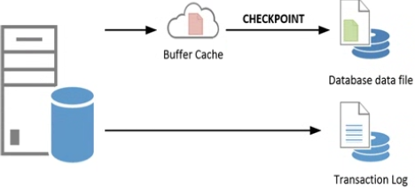 

The first thing that happens when a data page is modified by a committed transaction is that the change will be recorded in the
transaction log (first in the log buffer then to disk as described in the WRITELOG and LOGBUFFER wait types section). The modification of
the data page will happen in the buffer cache, and the data page will be marked as dirty (red page icon). When a checkpoint occurs, which can be for multiple reasons as we will discuss later, all of the data pages that have been marked as dirty since the previous checkpoint will be written to the physical database data file on your storage subsystem, regardless of the state of the transaction that created those dirty pages (green page icon).

The checkpoint process is executed by SQL Server automatically roughly once every minute, which is the default.

The following list will describe the various checkpoint types available in SQL Server:
* The internal checkpoint type is not conigurable and occurs automatically when certain actions are performed; for instance, a
 database backup.
* Automatic: These are the default checkpoints, on SQL Server version lower than 2016, that occur roughly every minute when left at their
default value of 0. We can change the interval of the checkpoint process by changing the recovery interval coniguration option under the Server Properties ➤ Database Settings page in SQL Server Management Studio. We can only change it to a value in minutes, and it will be used for all databases inside the SQL Server instance.
* Manual: You can manually cause checkpoints to occur by issuing the CHECKPOINT T-SQL command. Optionally, you can specify the time
in seconds at which the checkpoint must be completed. If you do issue a manual checkpoint, it will run in the context of the current
database. For example, executing CHECKPOINT 10 in a query window will perform a checkpoint within 10 seconds of the time you executed the query.
* Indirect: SQL Server 2012 added an extra option to conigure checkpoint intervals on a per-database level. Coniguring this option
to a value greater than the default 0 will overwrite the automatic checkpoint process for the speci ic database. You can use indirect
checkpoints for a speci ic database by using the following command:
```sql
 ALTER DATABASE [db name] SET TARGET_RECOVERY_TIME = [time in seconds or minutes]
```

With the release of SQL Server 2016 Indirect Checkpoint became the new default setting of the Checkpoint process (with the value of 60)


#### 2.8.2 Example
Lower than SQL 2016 the way SQL handles the checkpoint process has changed which means it is far less likely for the wait type to show up in an example like the following.

```sql
USE trans_demo
GO
 DECLARE @i INT
 SET @i = 1

 WHILE @i < 100
  BEGIN
    INSERT INTO transactions(t_guid)
    VALUES (newid())
    
    SET @i = @i + 1
    -- Force a checkpoint to occur within 1 second
  
    CHECKPOINT 1
 END

USE master
GO
-- Create demo database
CREATE DATABASE [trans_demo]
ON PRIMARY( NAME = N'trans_demo', FILENAME = N'D:\Data\trans_demo.mdf' , SIZE = 153600KB , FILEGROWTH = 10%  )
LOG ON( NAME = N'trans_demo_log', FILENAME = N'D:\Log\trans_demo.ldf' , SIZE = 51200KB , FILEGROWTH = 10% )
GO
-- Make sure recovery model is set to full
ALTER DATABASE [trans_demo] SET RECOVERY FULL
GO
-- Perform full backup first-- Otherwise FULL recovery model will not be affected
BACKUP DATABASE [trans_demo] TO  DISK = N'F:\Backup\trans_demo_Full.bak'
GO
-- Create a simple test table
USE trans_demo
GO
CREATE TABLE transactions ( t_guid VARCHAR(50) )
GO
```

#### 2.8.3 Lowering SLEEP_BPOOL_FLUSH waits

The most obvious one would be to check the various coniguration options available to manually configure the recovery interval that we
discussed earlier. The lower the value of the recovery interval, the more often checkpoint processes will take place, and the bigger the chance of running into SLEEP_BPOOL_FLUSH waits. Also, as you noticed in the example, performing frequent CHECKPOINT commands inside
transactions can lead to SLEEP_BPOOL_FLUSH waits.

Another possible cause can be the storage subsystem on which your database data file resides. If you are running SQL Server 2016, chances are you will never run into very high SLEEP_BPOOL_FLUSH wait times since the default way SQL Server handles the process has been changed.

### 2.9 WRITE_COMPLETION

#### 2.9.1 What is WRITE_COMPLETION wait type?

This wait type is related to specific actions SQL Server performs on the storage subsystem. The wait type is logged for specific read and write operations. Is only logged for some very specific write operations. Some of these write operations are growing a data or log file or performing the DBCC CHECKDB command.

#### 2.9.2 Example

```sql
DBCC SQLPERF('sys.dm_os_wait_stats', CLEAR);
DBCC CHECKDB ('AdventureWorks');
SELECT * FROM sys.dm_os_wait_stats
WHERE wait_type = 'WRITE_COMPLETION';
```

#### 2.9.3 Lowering WRITE_COMPLETION waits

If you see this high wait types, try to find out what process is generating the waits. In many cases it will be caused by a CHECKDB.
One thing worth checking is the instant file initialization option discussed in the section earlier in this chapter. 

Another far less common cause for a higher wait time is when you are experiencing page latch contention on your PAgre Free Space page (pr PFS). The PFS page tracks the amount of free space in data pages. If a process needs to modify the PFS page very frequently it is possible to see WRITE_COMPLETION waits occur along whit many PAGELATCH_UP waits.

## 3. Lock-Related Wait Types

### 3.1. Introduction to Locking and Blocking

These ACID properties are enforced upon single operations, which we know as transactions. The acronym ACID cosists of four charateristics that guarantee data reliability inside transactions. The following list describes each of these characteristics:

* **Atomicity**: The atomicity characteristic requires that transactions are all or nothing. This means that if one part of the transaction fails, the complete transaction fails, and every change done inside the transaction needs to be changed back to the state before the
transaction started.

* **Consistency**: The consistency characteristic requires that data written to the database by the transaction is legal. This means that
the data must be stripped of illegal or bad input.

* **Isolation**: The isolation characteristic requires that every transaction is hidden from other concurrent transactions. From a transaction point of view, this means every transaction is executed serially.

* **Durable**: The durable characteristic requires that every committed transaction remains committed, even in the event of a power failure or disaster.

If you are interested in learning more about the ACID properties and database theory, a good place to start would be the “Principles of Transaction Oriented Database Recovery” research paper by Andreas Reuter and Theo Harder, which describes the ACID properties in detail.

**To get a better understanding of how the Isolation characteristic works, we need to understand transactions.** A transaction represents
an interaction with the database that can consist of multiple actions and that is separated from other transactions. To make sure our transactions do not conflict with other concurrent transactions, SQL Server uses locks. These locks make sure no other transaction can modify data that your transaction is processing at the same time.

When you run your transaction it will be protected by a lock SQL Server places on the object you are accessing. If another transaction
wants to interact with the same object, a block will occur. When this block occurs, the latter transaction will have to wait until the lock on the object is removed.

There are different lock types or lock modes, SQL Server can use and there are various object levels SQL Server can place locks on.

#### 3.1.1 Lock Modes and Compatibility

The list htat follows describes the most common lock modes. A complete list of the different lock modes can be found on the MSDB page that discusses lock modes here:

  https://technet.microsoft.com/en-us/library/ms175519.aspx

* Shared (S): A Shared lock will be placed on a resource when a query is selecting data from that resource. e.g, a SELECT * FROM [table].
* Update (U): The Update lock mode is used when a query wants to modify a resource. It was introduced to prevent “deadlocks,” a
situation where locks are waiting on each other to release in concurrent transactions that want to modify the same resource.
* Exclusive (X): An Exclusive lock is placed when a transaction wants to modify the resource. When an Exclusive lock is in place, no other transactions can modify the resource. For instance, INSERT, UPDATE, or DELETE T-SQL statements will result in Exclusive locks.
* Schema (Sch): Schema locks are used when a table is being modified. An example of this would be adding a column to a table.
* Intent (I): Intent locks are used to indicate that locks are placed at a lower level in the locking hierarchy.

When different locks need to interact with each other, SQL Server performs a lock compatibility check on the different lock modes
involved. Not all of the lock modes are compatible with each other, which means that when two different transactions are not able to
access the resource at the same time because of incompatible locks, a block will occur.

Table below shows the lock mode compatibility for the Shared, Update and Exclusive lock modes.

Lock Mode  Shared  Update  Exclusive
Shared     Yes     Yes     Yes
Update     Yes     No      No
Exclusive  No      No      No

#### 3.1.2 Locking Hierarchy

SQL Server uses multigranular locking to allow different locks for different level objects. The lowest possible object where a lock can be placed is a row and the largest is the database.

The following list shows the most common lock levels, ordered from the highest granularity to the smallest:

* Database
* Database file
* Table/Object
* Extent
* Page
* RID (Row Inside a Heap) / KEY (Row Inside a Clustered Index)

SQL Server will place Intent Locks on objects that are on a higher granularity to indicate a lock has been placed at a lower level. This protects the lower-level locks from changes on objects at a higher granularity level. All the intent locks that are placed, from the highest granularity level to the actual lock on an object, when looked at together are called the locking hierarchy.

A graphical representation of a locking hierarchy for the modification of data inside a row, which will require an Exclusive lock on the row and Intent Exclusive locks higher in the hierarchy.

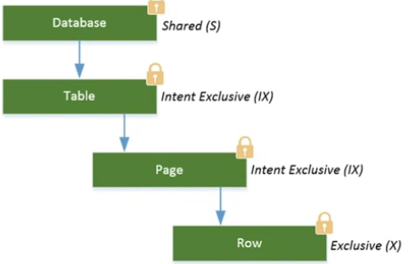

Note the Shared lock on the database level. Every request will always place one to protect changes to the database while transactions are active. This makes sure that, for instance, you cannot delete a database while transactions are still active. Also note that the Intent locks will use the same lock mode on the lowest object, in this case Intent Exclusive (IX).

#### 3.1.3 Isolation Levels

The isolation level defines the degreew to which transations are isolated from each other during concurrent operations. Changing the Isolation level will only change the behavior of Shared Locks, Exclusive locks that are needed for data modification are not affected.

The list that follows shows the various Isolation levels from the lowest form of Isolation to the highest, available in SQL Server and the phenomena related to them:

* **Read Uncommitted**: This Isolation level will allow reads to occur while another transaction is performing modifications on the same
object. It will not wait until the Exclusive lock on the object is released. This makes it possible to read uncommitted values called “dirty reads.” Dirty reads can be bad (if you do not expect them) because they can return a value that is no longer current in the database.

* **Read Committed**: This is the default Isolation level in SQL Server. Using this Isolation level will make read transactions wait until concurrent write transactions are completed. The phenomenon associated with this Isolation level is called “inconsistent analysis.” This means that it is possible to receive different results from the same read query if the data were modified by another transaction in the time between both read transactions.

* **Repeatable Read**: Setting the Isolation level to Repeatable Read will lock rows that are being read by a transaction. But instead of
releasing the Shared lock on the row after it has been read, Repeatable Read will keep the lock in place until the entire transaction is completed. A Repeatable Read makes it possible for “phantom reads” to occur. Phantom reads occur whenever data is added or changed by another transaction that has not yet been locked by the read transaction.

* **Serializable**: is the highest possible Isolation level you can use. Locking the entire range of data (an entire table) you are selecting, making it impossible to make changes to the data.

SQL Server 2005 added another method for isolating transactions called **Row Versioning**. Row Versioning uses versions of data modification and returns them to read queries without causing blocking. When a transaction modifies data, that change will be recorded as a version. When a read transaction accesses the same data, it will receive the version of the change before the modification transaction is committed. More information about Row Versioning can be found on Books Online at:

  https://technet.microsoft.com/en-us/library/ms189050.aspx

#### 3.1.4 Querying Lock Information

To take a look at currently placed locks we can use the [sys.dm_tran_locks] DMV.

```sql
EXEC sp_WhoIsActive @get_locks = 1
```

### 3.2. LCK_M_S

#### 3.2.1 What is the LCK_M_S wait type?

This wait type represents that a task is waiting to place a Shared lock on a resource. The LCK_M_S wait type indicates that a task is, or has, been waiting to place a Shared lock on a resource.

Since the LCK_M_S wait type is related to Shared locks, it will occur when a read action is being performed but has to wait because an incompatible lock is already in place on the resource we want to read. The time we are waiting before we are able to place the Shared lock is recorded as the wait time of the LCK_M_S wait type.
Figure below shows a common situation that will result in LCK_M_S waits occurring. In this case an Exclusive lock has been placed on a page by T1, indicating a data modification. When T2 wants to read the data from the page, it will need to place a Shared lock, but since Exclusive and Shared locks are incompatible, a LCK_M_S wait occurs.

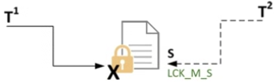

#### 3.2.2 Example

```sql
BEGIN TRAN
 UPDATE Sales.SalesOrderDetail
 SET CarrierTrackingNumber = '4E0A-4F89-AD'
 WHERE SalesOrderID = '43661';
```

```sql
SELECT *
FROM AdventureWorks.Sales.SalesOrderDetail;
```

#### 3.2.3 Lowering LCK_M_S

If you notice high wait times on the LCK_M_S wait type, it means that someone's read transaction is currently taking a long time to complete because it has to wait to place the Shared lock. So the first step will be to identify the query that is causing the block. We can do this by using the [sys.dm_os_waiting_tasks] DMV and looking at the blocking_Session_is column.

Another option is to use the [sp_WhoIsActive]

One way to optimize that query qould be to look at whether any indexes should be added so fewer rows are required to be locked. Or maybe you could cur the single transaction into multipe transactions that each access fewer objects. Anorher possible issue that can cause more locking than necessary is out of data statistics.

Another option would be to change to Isolation level of the read transactions so no Shared locks are needed in order to read the data.
For instance, setting the Isolation level to Read Uncommitted will not place Shared locks, and the read transaction will not be blocked. This does introduce another problem related to the Isolation level, dirty reads, which we discussed in the “Locking and Blocking Introduction” section of this chapter. Next to using Read Uncommitted, you could also use Snapshot Isolation, which will result in fewer Shared locks, but will not cause dirty reads. Snapshot Isolation does put more load on the TempDB database, since it must maintain versions of data if many concurrent transactions are modifying that data.

#### 3.2.4 Summary

You should try to identify which queries are causing the block to occur and see if these can be optimized to result in fewer locks. As a final resort you could choose to change the isolation level of your read transactions, though this does introduce other side effects, like dirty reads or increased load inside TEMPDB.

### 3.3. LCK_M_U

#### 3.3.1 What is the LCK_M_U wait type?

Wait type are related to locks that use the UPDATE (U) mode.
The update lock type is a special type of lock mode tat indicates that data modification is about to occur. Update locks can also appert when performing INSERT or DELETE statements.

Update locks primarily exist to prevent deadlocks from two transactions that want to modify the same object, are waiting indefinitely on each other to acquire an Exclusive lock on the resource. Take a look at the following scenario that would occur when no Update locks are used.

When two concurrent transactions want to perform a modification on the same object, both transactions would first place a Shared lock on
the resource while the data they intended to modify was located. Since Shared locks are compatible with other Shared locks, both transactions would not block each other. When one of the two transactions found the data it needed to modify, it would convert its Shared lock to an Exclusive lock, and then a problem would occur. Since Shared locks are incompatible with Exclusive locks, and since the other transaction would also have a Shared lock on the resource, the conversion from Shared lock to Exclusive lock would not occur. The transaction would need to wait until the Shared lock of the other transaction was removed before it could convert its own Shared lock to an Exclusive lock, but since the other transaction also wants to convert its Shared lock to an Exclusive lock, both transactions would end up waiting on each other, and a deadlock would occur. SQL Server will automatically detect deadlock situations and choose one of the deadlocked transactions as a victim and perform a rollback of that transaction, ending the deadlock situation.

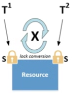

When Update locks are used inside SQL Server, no deadlock situation could occur. Update locks are compatible with Shared locks, but not with Exclusive or other Update locks. In the preceding scenario, the first transaction to find the data it needed to modify would not
directly convert to an Exclusive lock, but rather would convert to an Update lock first. Since Update and Shared locks are compatible, there would be no problem converting to an Update lock, even though there was a Shared lock in place from the other transaction. The Update lock would then get converted to an Exclusive lock so the data modification could occur. 

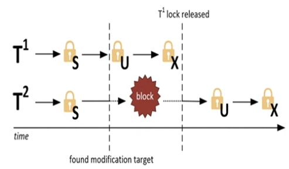

When a transaction wants to place an Update lock but there is an incompatible lock already in place on the object, for instance, an Exclusive Lock the LCK_M_U wait type will be recorded

#### 3.3.2 Example

Use Ostress. Update [Person.Address] on .sql file named [LCK_M_U.sql]

```sql
UPDATE Person.Address
SET City = 'Los Angeles'
WHERE StateProvinceID = 9;
```

"C:\Program Files\Microsoft Corporation\RMLUtils\ostress.exe" -E -d AdventureWorks2012 -i"C:\lck_m_u.sql" -n150 -r5 -q

Query the [sys.dm_os_waiting_tasks] and [sys.dm_tran_locks].

#### 3.3.3 Lowering LCK_M_U

Try to identify the transaction that is causing the blocking to occur and try to optimize its locking behavior.

### 3.4. LCK_M_X

#### 3.4.1 What is the LCK_M_X wait type?

This wait ype occurs when a tasj is waiting to place an Exclusice Lock on an object.Seeing blocking occur whn there are many concurrent modifications is pretty common.

#### 3.4.2 Example

```sql
SET TRANSACTION ISOLATION LEVEL REPEATABLE READ
BEGIN TRANSACTION
SELECT *
FROM HumanResources.Employee;
-- COMMIT

UPDATE HumanResources.Employee
SET JobTitle = 'Tester'
WHERE BusinessEntityID = 5
```

#### 3.4.2 Lowering LCK_M_X

Try and identify what queries are causing the blocking and see if you can optimize them so they cause less blocking.


### 3.5. LCK_M_I[xx]

#### 3.5.1 What is the LCK_M_I[xx] wait type?

This wait type means  that a task is being blocked when placing an Intent Lock.

Intent Lock indicate that a lock of the same type is placed on an object lower down in the locking hierarchy. Intent Lock behave just like any other lock, and it is entirely possible that one Intent Lock can block another, incompatible, Intent Lock.

It is possible for Intent locks to represent more than one lock mode on lower levels of the locking hierarchy. The list that follows describes these three Intent lock modes: 

* **Shared with Intent Exclusive (SIX)**: This lock mode represents that there are Shared Locks on all objects at a lower level, and Intent Exclusive locks on some of these objects. These locks are acquired by one transaction that wants to read data and plans to modify other data at the same time. 

* **Shared Intent Update (SIU)**: This lock mode is a combination of Shared and Intent Update locks. Again, it is possible for a single
transaction to acquire, and hold, both these lock modes at the same time at a lower level. 

* **Update Intent Exclusive (UIX)**: This lock mode is another combination of two other lock modes, Update and Intent Exclusive.

Seeing high wait times on Intent locks is not very common, since Intent locks are a lot more flexible regarding their incompatibility with each other.

#### 3.5.2 Example

```sql
SET TRANSACTION ISOLATION LEVEL REPEATABLE READ
BEGIN TRAN
SELECT * FROM Person.Address;
--COMMIT

UPDATE Person.Address
SET AddressLine1 = '1227 Shoe St.'
WHERE AddressID = 5
```

Shared locks and Intente Exclusive locks are not copmatible. If we look at [sys.dm_os_waiting_tasks], we should be able to see that the task to place the Intent Exclusive locks is waiting.

#### 3.5.3 Lowering LCK_M_I[xx]

Just like with the other lock related wait types we discussed earlier, try to focus on the queries that are causing the blocking when trying to lover this wait type.

#### 3.5.4 Summary LCK_M_I[xx]

Intent locks are placed on higher level objects to indicate that a lock has been placed on a lower level in the lockink hierarchy.

### 3.6. LCK_M_SCH_S and LCK_M_SCH_M

#### 3.6.1 What is the LCK_M_SCH_S and LCK_M_SCH_M wait type?

Schema locks are placed at the table level to protect the table from modifications while queries access the table, or to prevent queries from accessing the table while it is being modified. There are two different types of Schema lock, Schema Stability (Sch-S) and Schema Modification (Sch-M).

The Schema Stability lick is compatible with all other types of locks except for the Schema Modification lock. The Schema Modificaction locl, on the other hand, is incompatible with every other lock type, including locks.
When using Schema Stability locks it is impossible to modify or change the table in any way while queries are currentlyy reading or writing from or to that table.

Schema Modification locks are the opposite. They precent any queries from accessing a table whhile a modification to the table is being performed.

#### 3.6.2 Example

```sql
BEGIN TRAN
ALTER TABLE Person.Address
ADD
Test VARCHAR(10);
--ROLLBACK

SELECT *
FROM Person.Address;
```

```sql
SET TRANSACTION ISOLATION LEVEL REPEATABLE READ
BEGIN TRANSACTION
SELECT * FROM Person.Address;
-- COMMIT

ALTER TABLE Person.Address
ADD Test VARCHAR(10);
```

#### 3.6.3 Lowering LCK_M_SCH_S and LCK_M_SCH_M

When you see waits occurring of either the LCK_M_SCH_S or LCK_M_SCH_M wait type there is a probably a transaction active that wants to modify the table.

A suggestion could be to perform the table modificacion after office hour or when there are as few as possible concurrent transactions accessing the table.


## 4. Latch-Related Wait Types

While locks are used to guarantee transactions are isolated and consistent, LATCHES are used to guarantee the consistency of in-memory objects

### 4.1. Introduction to Latches

Latches are completely different than locks. Just like locks, larches have various modes and some of the acconyms to indicat eethe type of mode used are the same as for some locks modes.
Locks are used to make sure transactions are consistent, protecting the transaction for the entire duration it is running, latches are only used for the duration the duration they are necessary and are not bound to the duration of a transaction. During the duration of one transaction, many different latches will be acquired and released again.

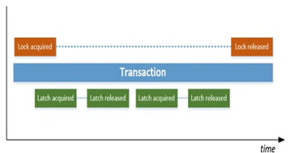

Bacause latches are only needed for specific operations, and are then released again ther are far less costly to use than locks

#### 4.1.2. Latches Modes

Latches have five different modes available to use when accessing objects. The list that follows describes these five modes, some of which might look familiar:

* **SH**: The SH mode represents a Shared latch. This mode is used when the latch is reading page data. 
* **UP**: The UP latch mode is used by Update latches that are used whenever a page needs to be modified. By using the Update latch the
page can still be read by other latches.
* **EX**: The EX latch mode, or Exclusive latch, is also used when page modification occurs. Unlike the Update latch, the Exclusive latch does not allow read or write access by other latch modes.
* **KP**: The KP latch mode is used by Keep latches. Keep latches are used to protect the page so it cannot be destroyed by the Destroy latch. They are compatible with every other latch mode except for the Destroy mode.
* **DT**: The DT latch mode indicates Destroy latches. Destroy latches are used when removing contents from memory; for instance, when SQL Server wants to free up a data page in memory.

#### 4.1.3. Compatibility Matrix

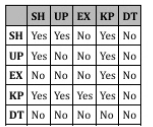

Unlike locks, which can partly be controlled by Isolation levels and query hints, latches are completely controlled by the SQL Server engine. This means we cannot modify latch behavior like we can for locks.

#### 4.1.4. Latch Waits
Whenever a latch has to wait because its request couldn’t be granted immediately, a latch wait occurs. These waits are tracked and recorded by SQL Server inside the [sys.dm_os_wait_stats] DMV, and also inside a dedicated DMV that records specific latch wait times,
[sys.dm_os_latch_waits], which we will discuss in more detail a bit further down in this chapter.

In this example we are waiting for a data page to be read from the storage subsystem into the buffer cache. In this case latches are used to make sure the same data page on the storage subsystem is not being read into the buffer cache by multiple threads. While the latch is waiting for the page to read into memory, the PAGEIOLATCH_SH wait type will be recorded.

There are three different latcha wait types defined in SQL Server:

* **Buffer latches**: Buffer latches are used to protect data pages inside the buffer cache. 
* **Non-buffer latches**: These latches are used to protect data structures outside of the buffer cache. They are indicated by the LATCH_[xx] wait type inside the sys.dm_os_wait_stats DMV.
* **IO latches**: IO latches are used when data pages are read from the storage subsystem into the buffer cache. This type is indicated by the PAGEIOLATCH_[xx] wait type.


#### 4.1.5. Page Latch Contention

One of the most common problems encountered regarding latches is page-latch contention. Page-latch contention occurs when many concurrent latches try to acquire a latch, but there already is a latch in place with an incompatible mode, causing a latch wait.

For instance, a small table that holds a few rows that need to be accessed by an application for configuration information can be a potential hot-spot.

In this case the client ran an application that, at specific times, would select large amounts of data and place the results into temporary tables. The application used a large amount of concurrent connections to speed up the creation of these temporary tables. To show the effects of this example, I am going to reproduce the scenario using Ostress to select rows from a table and then insert them into a temporary table.

```sql
SELECT TOP (20000) *
 INTO #tmptable
FROM Sales.SalesOrderDetail;
```

"C:\Program Files\Microsoft Corporation\RMLUtils\ostress.exe" -E -d AdventureWorks -i"C:\latch_contention.sql" -n300-r1 -q

```sql
SELECT session_id,  wait_duration_ms, wait_type, resource_description
FROM sys.dm_os_waiting_tasks
WHERE session_id > 50
```

All the request are waiting to update the first PFS page iside the TEMPDB db.

All this space usage needs to be updated inside the PFS page, and latches are used to make sure only one threead gets access to the PFS page at a time.

One way to resolve this specific case of latch contention is by adding more (equally sized) TempDB data files. Every new data file will maintain its own PFS pages, and adding more data files helps spread the load of updating the PFS pages. Using the query that follows, I added three more data files to the TempDB database:

```sql
 USE [master]
 GO
 ALTER DATABASE [tempdb] ADD FILE ( NAME = N'tempdev2', FILENAME = N'D:\Data\tempdb2.mdf' , SIZE = 204800KB , FILEGROWTH = 10%)
 GO
 ALTER DATABASE [tempdb] ADD FILE ( NAME = N'tempdev3', FILENAME = N'D:\Data\tempdb3.mdf' , SIZE = 204800KB , FILEGROWTH = 10%)
 GO
 ALTER DATABASE [tempdb] ADD FILE ( NAME = N'tempdev4', FILENAME = N'D:\Data\tempdb4.mdf' , SIZE = 204800KB , FILEGROWTH = 10%)
 Go
```

Adding too many TempDB data files can be a bad idea though, since the round-robin algorithm that makes sure the data files receive equal allocations can generate noticeable overhead when it needs to manage many TempDB data files. Paul Randal over at his SQLskills blog has a great post discussing TempDB data files and latch contention, which you can ind here:

  www.sqlskills.com/blogs/paul/a-sql-server-dba-myth-a-day-1230-tempdb-should-always-have-one-data-file-per-processor-core/

### 4.2. PAGELATCH_[xx]

#### 4.2.1 What is the PAGELATCH_[xx] ait type?

This wait type occur whenever a latch has to wait before it can access a page in memory. The main cause for these waits is other latches that are already in place on the page and are incompatible.

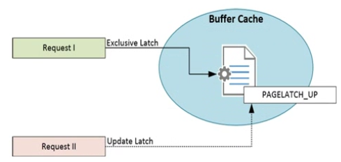

It’s easy to confuse PAGELATCH_[xx] waits with PAGEIOLATCH_[xx] waits. The former indicates access to pages already in memory, while the latter indicates pages are being read from disk into memory.

#### 4.2.2 Example

In the introduction to this chapter, we took a look at page-latch contention that can occur inside the TempDB database when many concurrent queries are loading data in temporary queries. This isn’t the only form of latch contention that can occur inside SQL Server. Another form of latch contention is known as “last-page insert contention.”

Last pave insert contention can occur on database that experience a very heavy insert workload against a table with relatively small rows. From a best practice point of view we would create a clustered index on the ID column. But because of the ever increasing nature of the aoto incremente every newly added row will be added at the end of the clustered index, creating a host spot for the last data page of the clustered index.

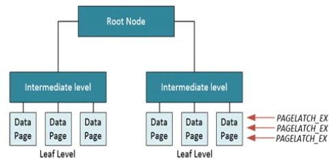

One question I often hear about this behavior is: “Why aren’t locks stopping this?” The answer is actually pretty simple: because by default we will be using Exclusive row-level locks to insert our new rows instead of locking the page, and you can have multiple concurrent Exclusive row locks on one page. Access to the page that’s in-memory still needs to occur serially though, so latches are used to make sure only one thread has access to the page at any time. 

```sql
CREATE TABLE Insert_Test
  ( ID INT IDENTITY (1,1) PRIMARY KEY,
    RandomData VARCHAR(50) )
  
INSERT INTO Insert_Test (RandomData) VALUES ( CONVERT(varchar(50), NEWID()))
```

Ostress using 500 concurrent connections each connection performing the query 100 times. While Ostress is running I query yhe [sys.dm_os_waiting_tasks]

```sql
SELECT session_id, wait_duration_ms, wait_type, resource_description
FROM sys.dm_os_waiting_tasks;
```

As expected, the insert workload caused a hot spot to appera on a page inside the clustered index, in this case the page with a page ID of 29313.

```sql
 DBCC TRACEON (3604);
 GO
 DBCC IND (AdventureWorks, Insert_Test, 1);
 GO
```

#### 4.2.3 Lowering PAGELATCH_[xx] waits

Frequently they are related to the design of your database or your workload.

It's more common to see latch contention occuring on systems that have a large number of logical processors (16+) and high concurrent OLTP workloads.

The best waay to reslve latch conntentio is by identifying where the contention is occurring and whhat type of contention youu are dealing with.

If you are dealing with PFS page contenttion a good first step would be to check f you are using one or multiple db files. If you are using one db file, the first step would be too add additional, equality sized data files and measure if this loers the amount of PAGELATCH_[xx] waits occuring.

Your goal shoudl be to find a db data file sweet spot where you have enogh db data files to minimize overhead to become too high.

Other factors to consider that can impact latch contention are indexing strategies, page fullness, and the number of concurrent connections to the db.

One final option for resolving latch contention is using a metho called hash partitioning. Hash partitioning splits up you table or index into various partitions based on a value that is generated by using a computed column.

The first thing we need to do is create a Partition function. This will map rows inside the table or index to partitions based on the value of a column. The following script will create a Partition function named LatchPartFunc that will divide rows into nine partitions based on the value of a column:

```sql
CREATE PARTITION FUNCTION [LatchPartFunc] (INT)
AS RANGE LEFT FOR VALUES (0,1,2,3,4,5,6,7,8);
```

The next step is to create a Partition scheme that will map the partitions to a filegroup:
```sql
CREATE PARTITION SCHEME [LatchPartSchema]
AS PARTITION [LatchPartFunc] ALL TO ([PRIMARY]);
```

Next step is creatin a new table called Insert_Test3. Notice the [ID_Hash] column. This is a computed column that will calculate a value between 0 and 8 based on the value of the ID column:

```sql
CREATE TABLE Insert_Test3
( ID INT IDENTITY(1,1),
  RandomData VARCHAR(50),
  ID_Hash AS (CONVERT(INT,
  abs(binary_checksum(ID) % (9)), (0))) PERSISTED  );
```

The last step is to create a clustered index and map it to the Partition scheme:

```sql
CREATE UNIQUE CLUSTERED INDEX idx_ID ON Insert_Test3 (ID ASC, ID_Hash) ON LatchPartSchema(ID_Hash);
```

Now that we have our partitioned table in place, let’s repeat our Ostress workload that caused last-page insert contention in our
previous example. I changed the target table for the inserts to our new, partitioned Insert_Test3 table.

"C:\Program Files\Microsoft Corporation\RMLUtils\ostress.exe" -E -d AdventureWorks -Q"INSERT INTO Insert_Test3 (RandomData) VALUES (CONVERT(varchar(50), NEWID()))" -n500 -r100 -q

#### 4.2.4 PAGELATCH_[xx] Summary

This wait type ndicates that buffefr latches which are used to procete in memoruy pages are running into other non compatible buffer latches. Seeing a large amount of PAGELATCH_[xx] waits occurring can indicate a case of latch contention.


### 4.3. LATCH_[xx]

#### 4.3.1 What is the LATCH_[xx] wait type?

LATCH_[xx] wait type is related to latches that are used to protect data structures outside of the buffer cache (but still inside the SQL Server Memory).

All of the different non buffer latch classes that add to the wait time shown by the LATCH_[xx] wait type are recorded inside their own DMV [sys.dm_os_latch_stats].

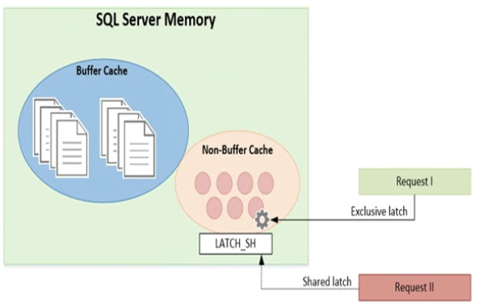

#### 4.3.2 Example

```sql
-- Create the table
CREATE TABLE Insert_Test2
( ID UNIQUEIDENTIFIER,
  RandomData VARCHAR(50) );
  
-- Create a non-clustered index on the ID column
CREATE NONCLUSTERED INDEX idx_ID
ON Insert_Test2 (ID);
GO
```

Once the table is created we can start Ostress with a workload consisting of an insert query that will insert a single row inside the table.

"C:\Program Files\Microsoft Corporation\RMLUtils\ostress.exe" -E -d AdventureWorks -Q"INSERT INTO Insert_Test2 (ID, RandomData) VALUES (NEWID(), CONVERT(varchar(50), NEWID()))" -n500 -r100 -q


```sql
SELECT session_id, wait_duration_ms, wait_type, resource_description
FROM sys.dm_os_waiting_tasks;

SELECT *
FROM sys.dm_os_latch_stats
WHERE latch_class = 'ACCESS_METHODS_HOBT_VIRTUAL_ROOT'
```

To show you that another level was added to the non-clustered index during our Ostress workload, I am going to use the INDEXPROPERTY function to retrieve the depth of the non-clustered index we created.

```sql
TRUNCATE TABLE Insert_Test2

SELECT INDEXPROPERTY(OBJECT_ID('Insert_Test2'), 'idx_ID', 'indexDepth')
```

Since we just truncated the table, the index depth should be 0 as there are no rows inside the table yet.

I use the sys.dm_db_index_physical_stats DMF to return some additional information about the number of index and data pages inside the index. This query returns such information:

```sql
SELECT index_id, index_type_desc, index_depth, index_level, page_count, record_count
FROM sys.dm_db_index_physical_stats (DB_ID(N'AdventureWorks'), OBJECT_ID(N'Insert_Test2'), NULL, NULL , 'DETAILED')
```

While the new levels were created inside the B-tree, the concurrent insert queries had to wait before they could navigate the B-tree, resulting in the LATCH_SH waits.

#### 4.3.3 Lowering PAGELATCH_[xx] waits

We can describe a general approach though, using the list here:

* Query [sys.dm_os_waiting_tasks] if LATCH_[xx] waits are occurring. The resource_description column can show you additional information about the specific latch class. If you are in a situation where the LATCH_[xx] waits do not show in [sys.dm_os_waiting_tasks] but high wait times are visible in [sys.dm_os_wait_stats] DMV, the [sys.dm_os_latch_waits] DMV should be your starting point.
Another helpful DMV can be the [sys.dm_exec_requests] DMV. Joined together with the [sys.dm_exec_sql_text] DMF, it may help you to find the query that is causing the LATCH_[xx] wait.

* Query [sys.dm_os_latch_waits] to see if this correlates with the latch class shown in the resource_description column of the [sys.dm_os_waiting_tasks] DMV.

* Check Books Online or Appendix III in this book for more information about the specific latch class.

* Another good resource for more information about common latch classes is Paul Randal’s blog post “Most common latch classes and what
they mean” at 
  
  www.sqlskills.com/blogs/paul/most-common-latch-classes-and-what-they-mean/ 

### 4.4. PAGEIOLATCH_[xx]

#### 4.4.1 What is the PAGEIOLATCH_[xx] wait type?

The PAGELATCH_[xx] wait type was related to latches being placed on memory pages inside the buffer cache, and the LATCH_[xx] wait type is related to latches on non buffer objects. The PAGEIOLATCH_[xx] wait type also indicates the use of latches on a specific area in SQL Server, in this case the IO latches.

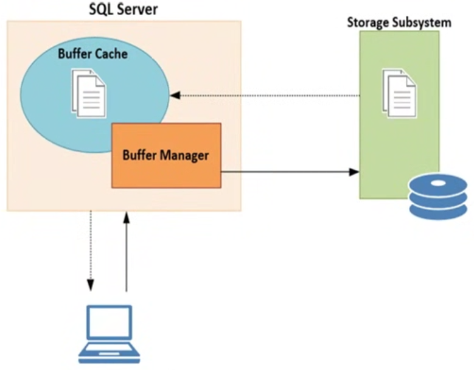

During the movement of data pages from the storage subsystem to the buffer cache, latches are used to “reserve” a buffer page for the data page on the storage subsystem.

While SQL Server is transferring the data page from the storage subsystem into the buffer cache, an Exclusive latch will be placed on the buffer page. Because Exclusive latches are incompatible with almost every other latch mode (save for the Keep mode), it is guaranteed that no other latch can access the buffer page while it is being transferred.

The mode of the latch depends on the action that initiated the movement of the data page from the storage subsystem to the buffer cache. A PAGEIOLATCH_SH will be recorded if the data is being moved for read access, and a PAGEIOLATCH_UP or PAGEIOLATCH_EX will be used if the data page is being moved for a modification.

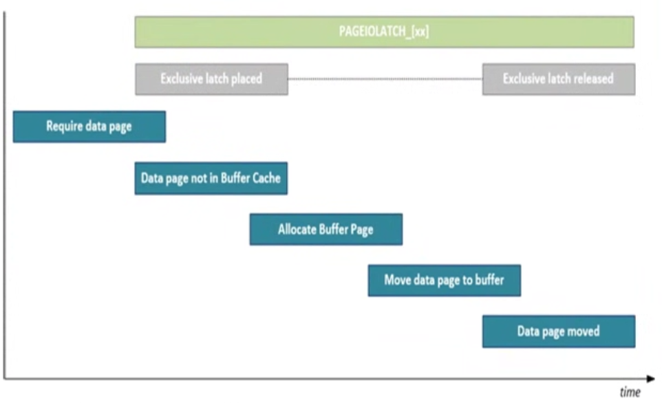

#### 4.4.2 Example

Running the DBCC DROPCLEANBUFFERS command will remove all the unmodified data pages from the buffer cache. Combining it with the CHECKPOINT command will ensure the modified pages are also written to disk, leaving you with an empty, or “cold,” buffer cache.

```sql
CHECKPOINT 1;
GO
DBCC DROPCLEANBUFFERS;
GO
DBCC SQLPERF('sys.dm_os_wait_stats', CLEAR);
GO
SELECT SOD.SalesOrderID, SOD.CarrierTrackingNumber, SOH.CustomerID, C.AccountNumber, SOH.OrderDate, SOH.DueDate
FROM Sales.SalesOrderDetail SOD
JOIN Sales.SalesOrderHeader SOH
ON SOD.SalesOrderID = SOH.SalesOrderID
JOIN Sales.Customer C
ON SOH.CustomerID = C.CustomerID;

SELECT *
FROM sys.dm_os_wait_stats
WHERE wait_type LIKE 'PAGEIOLATCH_%'  
```

#### 4.4.3 Lowering PAGEIOLATCH_[xx] waits

The first place I look when noticing higher than normal wait times is the SQL Server log to find out if SQL Server was restarted.
One of the more common pieces of advices I see about lowering this wait times is to focus your attention on the storage subsystem.
A good place to start for monitoring storage performance is Perform. The following liste are the ones I sue the most when monitoring storate performance:

* **PhysicalDisk\Avg. Disk sec/Read**: This will show you the average read latency on the disk you are monitoring. Less latency is
better, and as a general guideline latency values should be below 20 milliseconds (0.020 within Perfmon, as it reports the latency in
seconds).

* **PhysicalDisk\Avg. Disk sec/Write**: This will return the average write latency on the disk you are monitoring. As a general guideline, be below 20 milliseconds.

* **PhysicalDisk\Disk Reads/sec**: This shows the amount of read IOPS (Input Output Operations) per second. 

* **PhysicalDisk\Disk Writes/sec**: The same as the PhysicalDisk\Disk Reads/sec, but this one shows the amount of write IOPS.

* **PhysicalDisk\Disk Read Bytes/sec**: This counter shows the amount of bytes read from the disk per second.

* **PhysicalDisk\Disk Write Bytes/sec**: This is identical to the PhysicalDisk\Disk Read Bytes/sec, but this counter shows the amount of bytes written to disk per second.

As an extra diagnostic tool, or if you cannot use Perfmon, you can also run the IO performance script Paul Randal created based on the
[sys.dm_io_virtual_file_stats] DMF. The script, and the blog post describing the script, can be found on Paul’s blog at 

  www.sqlskills.com/blogs/paul/how-to-examine-io-subsystem-latencies-from-within-sql-server/

```sql
SELECT
  [ReadLatency] = CASE WHEN [num_of_reads] = 0 THEN 0 ELSE ([io_stall_read_ms] / [num_of_reads]) END,
  [WriteLatency] = CASE WHEN [num_of_writes] = 0 THEN 0 ELSE ([io_stall_write_ms] / [num_of_writes]) END,
  [Latency] = CASE WHEN ([num_of_reads] = 0 AND [num_of_writes] = 0) THEN 0 ELSE ([io_stall] / ([num_of_reads] + [num_of_writes])) END,
  [AvgBPerRead] = CASE WHEN [num_of_reads] = 0 THEN 0 ELSE ([num_of_bytes_read] / [num_of_reads]) END,
  [AvgBPerWrite] = CASE WHEN [num_of_writes] = 0 THEN 0 ELSE ([num_of_bytes_written] / [num_of_writes]) END,
  [AvgBPerTransfer] = CASE WHEN ([num_of_reads] = 0 AND [num_of_writes] = 0) THEN 0 ELSE (([num_of_bytes_read] +  [num_of_bytes_written]) / ([num_of_reads] + [num_of_writes])) END,
  LEFT ([mf].[physical_name], 2) AS [Drive],
  DB_NAME ([vfs].[database_id]) AS [DB],
 [mf].[physical_name]
FROM sys.dm_io_virtual_file_stats (NULL,NULL) AS [vfs]
JOIN sys.master_files AS [mf]
ON   [vfs].[database_id] = [mf].[database_id]
AND  [vfs].[file_id] = [mf].[file_id]
-- WHERE [vfs].[file_id] = 2 -- log files
ORDER BY [Latency] DESC -- ORDER BY [ReadLatency] DESC-- ORDER BY [WriteLatency] DESC;
GO
```

Thankfully as a DBA we can also play a part in minimizing PAGEIOLATCH_[xx] wait times by simply performing database maintenance. Index fragmentation and out of date statistics can increase the PAGEIOLATCH_[xx] wait times drastically.

The final area that can impact PAGEIOLATCH_[xx] wait time is the memory of your system. SQL Server will remove data pages from inside the buffer cache if they have not been accessed within a specific timeframe in order to free up room inside the buffer cache. This movement of data pages from and to the buffer cache will result in more PAGEIOLATCH_[xx] waits. Adding more RAM to your system will increase the number of data pages the buffer cache can store and can help the buffer cache keep those pages in memory longer.

There are two Perfmon counters that can help you get some insight into the buffer cache usage: SQLServer:Buffer Manager\Buffer
cache hit ratio and SQLServer:Buffer Manager\Page life expectancy. The SQLServer:Buffer Manager\Buffer cache hit ratio will show you what percentage of pages could be located in the buffer cache that do not require a physical read on the storage subsystem. The SQLServer:Buffer Manager\Page life expectancy counter will show you the number of seconds a data page stays inside the buffer cache.


#### 4.4.4 Summary

The frequently advised get faster storage doesn't always hold true, even though fast storeage will indedd directly influence the PAGEIOLATCH_[xx] wait times. Optimizing queries so they require fewer data pages to be moved to the buffer cache, performing maintenance on indexes and statistics and analyzing memory performance could all lead to lower PAGEIOLATCH_[xx] wait times.

## 5. Hih-Availability and Disaster Recovery Wait Types

### 5.1. DBMIRROR_SEND

Database mirroring offers two different operating modes that impact the avalability and performance of the mirror configuration: **SYNCHRONOUSE (or high safety) mode** and **ASYNCHRONOUS (or high performance) mode**.

The **synchronous** mirror mode makes sure that every data modification action that is performed on the principal is also directly
performed on the mirror. It does this by waiting on sending a transaction confirmation message to the client until the transaction is
successfully written to disk on the mirror.

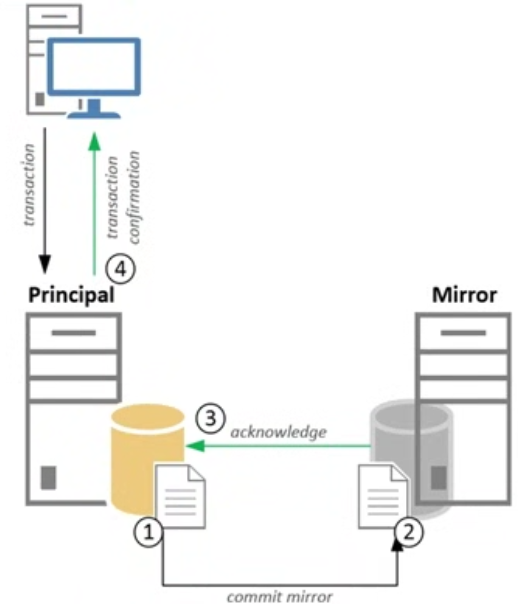

One of those is that the performance of your database inside a synchronous mirroring coniguration is highly dependent on the speed the mirror can process data modification operations, since every transaction has to be committed on the mirror first.

The **asynchronous** mode works in much the same way; the exception is that it will not wait on an acknowledgment message from the mirror before sending the transaction confirmation message to the client. This means that transactions are committed to disk on the
principal before they are written to disk on the mirror.

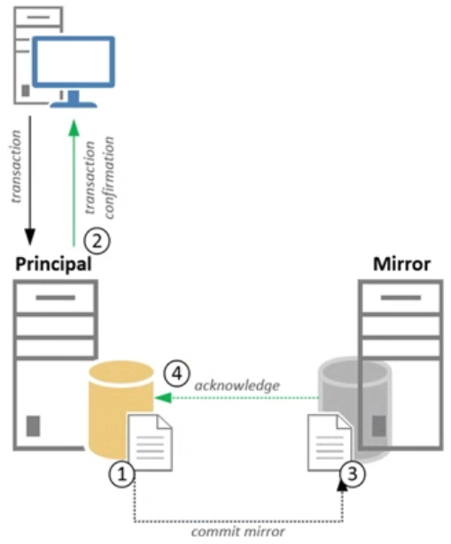

The description of this wait type is "Occurs when a task is waiting for a communications backlog at the network layer to clear to be able to send messages. Indicates that the communications layer is stating to vecome overloaded and affect the database mirring data throudhput".

Another important point to remember is that high DBMIRROR_SEND wait times will frequently only be recorded on the mirror instance.

#### 5.1.1. Example

```sql
USE [AdventureWorks]
GO
CREATE TABLE Mirror_Test
(  ID UNIQUEIDENTIFIER PRIMARY KEY,
  RandomData VARCHAR(50) )

DBCC SQLPERF('sys.dm_os_wait_stats, CLEAR')
INSERT INTO Mirror_Test ( ID, RandomData )
VALUES ( NEWID(), CONVERT(VARCHAR(50), NEWID()));
GO 10000

SELECT *
FROM sys.dm_os_wait_stats
WHERE wait_type = 'DBMIRROR_SEND'
```

#### 5.1.2. Lowering DBMIRROR_SEND waits

One of the most common pieces of advices for lowering wait time is changing the mirror mode from synchronous to asynchronous.

Changing the mirror mode from synchronous to asynchronous should be the last option. There are other parts that can influence this wait times, like the storage configuration on the mirror or the network connection between the principal and mirror SQL Server instances.

### 5.2. HARD_LOGCAPTURE_WAIT and HARD_WORK_QUEUE

#### 5.2.1 What HARD_LOGCAPTURE_WAIT and HARD_WORK_QUEUE wait types are?

Both related to AlwaysOn Groups. All wait types that are related to AlwaysOn can easily be identified by the HARD_ pregix in the wait type's name.

According to Books Online, the **HADR_LOGCAPTURE_WAIT** wait type indicates that SQL Server is “waiting for log records to become available. Can occur either when waiting for new log records to be generated by connections or for I/O completion when reading log not
in the cache. This is an expected wait if the log scan is caught up to the end of log or is reading from disk.” 

The **HADR_LOGCAPTURE_WAIT** wait type occurs on the SQL Server that hosts the primary database inside an AlwaysOn Availability Group.

AlwaysOn works much the same way as database mirroring and also provides two different modes (called Availability modes inside AlwaysOn): Synchronous-commit and Asynchronous-commit. Both these Availability modes work in the same way as their database mirroring counterparts we were discussing earlier in this chapter do.

While the primary replica is waiting for work, SQL Server will record the time it has spent on waiting for new transactions to become
available as the HADR_LOGCAPTURE_WAIT wait type. The HADR_LOGCAPTURE_WAIT wait type will always occur, no matter your AlwaysOn coniguration.

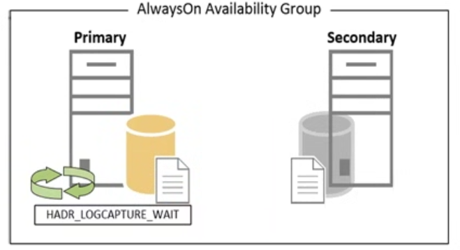

The **HADR_WORK_QUEUE** wait type is almost identical in function to the **HADR_LOGCAPTURE_WAIT** wait type. Books Online gives an
excellent description of this wait type: “AlwaysOn Availability Groups’ background worker thread waiting for new work to be assigned. This is an expected wait when there are ready workers waiting for new work, which is the normal state.” The main difference between both wait types, is that the **HADR_LOGCAPTURE_WAIT** wait type is dedicated to waiting until new transactions become available, while the
**HADR_WORK_QUEUE** indicates that are free threads waiting for work.

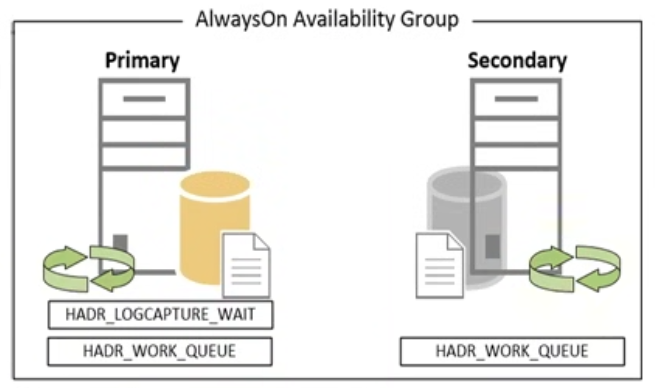

Because both these wait types are not directly related to performance problems, there is no use including a section on lowering the wait times of both these wait types.

### 5.3. HARD_SYNC_COMMIT

#### 5.3.1. What is the HARD_SYNC_COMMIT wait type?

The **HADR_SYNC_COMMIT** wait type indicates the time the primary replica spends waiting for the secondary replica to harden the log
records. HADR_SYNC_COMMIT waits will only occur on the primary replica and only inside a synchronous-replication AlwaysOn Availability
Group. As soon as a transaction is received by the primary replica and is sent to the secondary replica for hardening, the HADR_SYNC_COMMIT wait time will start recording. The HADR_SYNC_COMMIT wait time will only stop recording when the secondary replica has sent its confirmation that the write to the secondary’s transaction log was completed.

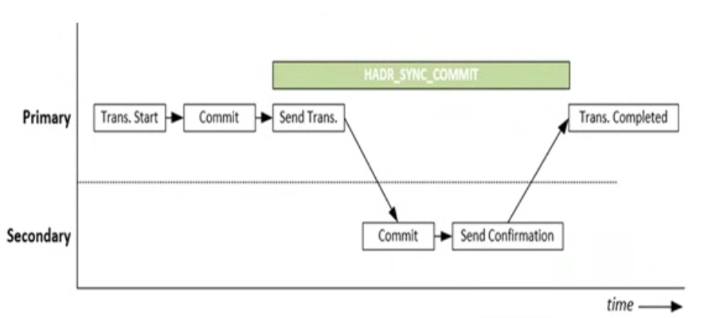

#### 5.3.2. Example

**The configuration of the test machines I will use for this can be founc in Appendix I Example SQL Server Machine Configuration**

```sql
USE [AdventureWorks]
GO
CREATE TABLE AO_Test( ID UNIQUEIDENTIFIER PRIMARY KEY, RandomData VARCHAR(50));

SELECT *
FROM sys.dm_os_wait_stats
WHERE wait_type = 'HADR_SYNC_COMMIT';

INSERT INTO AO_Test(ID,RandomData) VALUES(NEWID(),CONVERT(VARCHAR(50), NEWID()));
GO 10000
```


#### 5.3.3. Lowering HADR_SYNC_COMMIT waits

Changing the AlwaysOn operation mode to asynchronous replication will completely remove HADR_SYNC_COMMIT waits but at the risk of losing data when a disaster occurs.
The information showw by the AlwaysOn Dashboard is originally recorded inside various AlwaysOn related DMV. All of the AlwaysOn related DMVs can easily be identified by the dm_hadr prefix in the DMV name.

Next to the AlwaysOn and DMVs that are related to AlwaysOn, there are a large amount of PErform counters that specificalle show AlwaysOn performance. These counters are grouped in the Perform SQL Server:Availability Replica and SQLServer:Database Replica groups.

### 5.4. REDO_THREAD_PENDING_WORK

#### 5.4.1. What is the REDO_THREAD_PENDING_WORK wait type?

The wait type accumulates over time when there is no work to be done. In most cases be ignored since it does not indicate a performance problem. It is usually one od the top wait types on an AlwaysOn Availability Group secondary replica.

But until now we haven’t discussed the process that will perform the modifications inside the secondary database described in the log records. This is where the Redo Thread on the secondary comes in. This thread is responsible for performing the data modifications that were recorded in the log records the primary replica sent it. There is one very important concept associated with the Redo Thread: it does not impact the commit confirmation from the secondary replica. This means that the Redo Thread might be performing work long after the transaction has been communicated as committed to the client. Image below shows an example of synchronous replication together with Redo Thread.


So, where does the REDO_THREAD_PENDING_WORK wait type come in? Well, if the Redo Thread is waiting for work to arrive, it will record the time it is inactive as wait time on the REDO_THREAD_PENDING_WORK wait type. This will occur on both synchronous and asynchronous replication modes, but only on the secondary replica.

## 6. Background and Miscellaneous wait types

### 6.1. LAZYWRITER_SLEEP

#### 6.1.1. What is LAZYWRITER_SLEEP wait type?

This wait type occurs when an internal SQL Server process, in this case the lazywriter process, is waiting for work. The lazywriter process is a background process that will become active at a certain time interval. When it becomes active it will scan the size of
the buffer cache and determine if there are enough free pages inside the buffer cache.
If the lazywriter process determines there are enough free pages in the buffer cache, it will go back to sleep again and record the LAZYWRITER_SLEEP wait type while it is sleeping. However, if there are not enough free pages inside the buffer cache, the lazywriter process will detect, between checkpoints, which dirty pages in the buffer cache haven’t been accessed for a while, write them to the database data file, and remove them from the buffer cache. Figure below shows the relationship of the checkpoint and lazywriter processes with a flowchart.

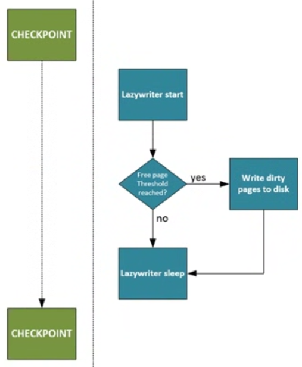

Because the LAZYWRITER_SLEEP wait type indicates the time the lazywriter process spends sleeping, or waiting for work, it is another
one of those wait types you can safely ignore. There is a catch however —if the lazywriter process is constantly working to move dirty pages from the buffer cache to the database data file, it can indicate your SQL Server instance is experiencing memory pressure.

### 6.2. MSQL_XP

#### 6.2.1. What is MSQL_XP wait type?

The execution time of an extended stored procedure is actually tracked by another wait type MSQL_XP. 
The MSQL_XP wait type records the execution time of extended stored procedures on your SQL Server instance. The MSQL_XP wait type is also used to detect deadlock situation when using Multiple Active Result Sets (MARS). You can find some more information about it here:

  https://msdn.microsoft.com/en-us/library/ms131686.aspx

The most common reason for seeing higher than normal wait times on the MSQL_XP wait type is the execution of extended stored procedures.
 
### 6.3. OLEDB

#### 6.3.1. What is OLEDB wait type?

The OLEDB wait type occurs whenever SQL Server has to access the Object Linking and Embedding Database (OLEDB) Client Provider.

SQL Server uses the OLEDB client provider for many different actions inside SQL Server. For instance, linked server traffic will move thtough the OLEDB client provider and will result in OLEDB waits.

### 6.4. TRACEWRITE

#### 6.4.1. What is TRACEWRITE wait type?

This wait type is a special wait type that only collects wait time when a trace is running and most commonly a SQL Profiler trace.

### 6.5. WAITFOR

#### 6.5.1. What is WAITFOR wait type?

This wait type will get recorded whenever a query is being executed that uses the WAITFOR command.


## 7. In-Memory OLTP Related Wait Types

### 7.1. Introduction to In-Memory OLTP

With the release of SQL Server 2014, Microsoft introduced a brand new SQL Server feature called In-Memory OLTP (or codename Hekaton). In
Memory OLTP is a memory-optimized database engine that is directly integrated into the SQL Server 2014 SQL Server engine. In-Memory
OLTP is an enterprise-only feature designed to improve performance— up to 20 times, according to Microsoft—by placing tables entirely into the memory of your SQL Server instance.

With the introduction of In Memory OLTP various new wait types have been added to SQL Server 2014. Most of these are recognizable by the _XTP_ (or eXtreme Transaction Processing)

Unlike traditional tables where data pages from that table are moved from disk into memory and back out again, memory-optimized tables are moved to your system's memory at SQL Server startup and never leave the memory.

Calculating the memory requirements can be difficult but the follwoing article can help you out:
  
  https://msdn.microsoft.com/en-us/library/dn282389.aspx

The complete list of what can and cannot be used can be found at:

  https://msdn.microsoft.com/en-us/library/dn246937(v=sql.120).aspx
  https://msdn.microsoft.com/en-us/library/dn133181(v=sql.120).aspx

#### 7.1.1. CFPs

By default memory-optimized tables are durable. The way this durability is achieved is through so called checkpoint file pairs (CFPs). CFPs consist of two files, a data and a delta file, that exist inside a special memory-optimized filegroup that you have to create for the database where you want to use memory optimized tables.

Unlike traditional tables that store row data inside data pages, data files store the rows of all your memory-optimized tables. I emphasize the word all because a single data file can hold the rows of many memory-optimized tables, unlike data pages that store row data for a single table. Because rows are stored sequentially inside the data files, there is a performance increase when reading rows
since it eliminates the random reads that occur when reading rows from traditional tables.

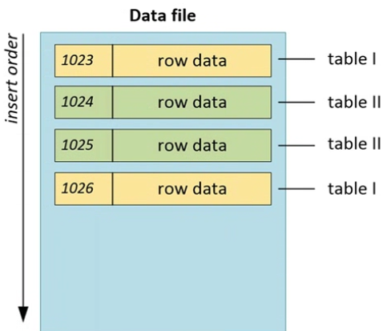

There are always multiple data files inside a memory-optimized filegroup. When you first create the memory-optimized filegroup, SQL
Server will automatically pre-allocate a number of data files in the file location of the memory-optimized filegroup. The data files will always have a fixed file size, either 128 MB on systems with more than 16 GB memory or 16 MB when there is less than or equal to 16 GB memory. When a data file is full, a new data file will automatically be created and new rows will be inserted into the new data file. It is important to know that the data file keeps track of rows based on the transaction-commit timestamp that inserted the row into the data file.

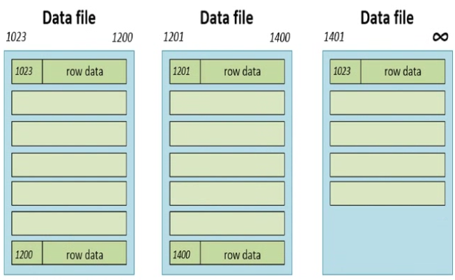

Another important characteristic of the data file is that rows that are deleted are not directly removed from the file. Instead they are
tracked by the delta file that is associated with the data file. The delta file logs any deletes made in the data file and is connected to the data file by the transaction timestamp range. Row updates for memory optimized tables are tracked as a delete and insert operation.

The population of the data and delta files is performed by a background thread—called the of line checkpoint thread—that runs constantly in the background of SQL Server.

Over time, when data files accumulate more deleted rows, a merge operation will take place that will merge multiple data files together
into one data file. The merge operation will create new data and delta files and move the contents of one or more data and delta files into the new files, but it will not move the rows that were marked as deleted. The transaction-commit timestamps will be adjusted in the new data and delta files so they match the timestamps of the files that were merged.

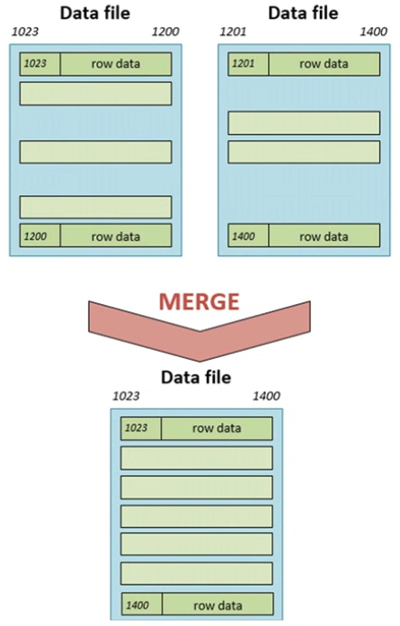

#### 7.1.2. Isolation

Concurrent access to memory-optimized tables is handled through snapshot-based transaction isolation.

Uses row versions when concurrent transactions want to access the same row. Instead of storing the row versions in the TempDB database like regular snapshot isolation, the row versions for memory-optimized tables are stored in line in the data files itself.

Another difference is that snapshot-based transaction isolation uses an optimistic concurrency control. This means that SQL Server assumes no transaction conlict will occur when concurrent transactions access the same data.

#### 7.1.3. Transaction Log Changes

For memory-optimized tables, the log record will only be generated when the transaction begins the commit processing. This means no
information for transactions that are rolled back is recorded. This minimizes interaction with the transaction log on disk, thus improving performance. Another modification is that changes to indexes on memory optimized tables are not logged in the transaction log.

For traditional tables every transaction will result in at least one log record. Transactions against memory-optimized tables are grouped together and then written as one log record (with a current maximum size of 24 KB). For instance, if you have 200 inserts against a traditional table, at least 200 log records would be generated. If we could it 100 inserts into one log record for the memory-optimized table, we would only have two log records instead of at least 200.

### 7.2. WAIT_XTP_HOST_WAIT

#### 7.2.1. What is the WAIT_XTP_HOST_WAIT wait type?

I used the script below to create a new db with a single memory-optimized table.

```sql
-- Create database-- Make sure to change the file locations if needed
USE [master]
GO
CREATE DATABASE [OLTP_Test] CONTAINMENT = NONE
ON PRIMARY ( NAME = N'OLTP_Test', FILENAME = N'E:\Data\OLTP_Test_Data.mdf' , SIZE = 51200KB , FILEGROWTH = 10% )
LOG ON ( NAME = N'OLTP_Test_log', FILENAME = N'E:\Log\OLTP_Test_Log.ldf' , SIZE = 10240KB , FILEGROWTH = 10% );
GO
-- Add the Memory-Optimized Filegroup
ALTER DATABASE OLTP_Test ADD FILEGROUP OLTP_MO CONTAINS MEMORY_OPTIMIZED_DATA;
GO
-- Add a file to the newly created Filegroup.-- Change drive/folder location if needed.
ALTER DATABASE OLTP_Test ADD FILE (name='OLTP_mo_01', filename='E:\data\OLTP_Test_mo_01.ndf') TO FILEGROUP OLTP_MO;
GO
-- Create our test table
USE [OLTP_Test]
GO
CREATE TABLE OLTP
( ID INT IDENTITY (1,1) PRIMARY KEY NONCLUSTERED,
  RandomData1 VARCHAR(50),
  RandomData2 VARCHAR(50),
  ID2 UNIQUEIDENTIFIER )
WITH (MEMORY_OPTIMIZED=ON);
GO
```

Now that we have a memory-optimized table we can use for testing, let’s take a look at the WAIT_XTP_HOST_WAIT wait type in the [sys.dm_os_wait_stats] and [sys.dm_os_waiting_tasks] DMV using the following query:

```sql
SELECT *
FROM sys.dm_os_waiting_tasks
WHERE wait_type = 'WAIT_XTP_HOST_WAIT';

SELECT *
FROM sys.dm_os_wait_stats
WHERE wait_type = 'WAIT_XTP_HOST_WAIT';
```

**WAIT_XTP_HOST_WAIT** wait type it is related to an internal background process that continuosly runs.

Paul Randal wrote an amazing blog post about capturing call stacks whenever a specific wait occurs that you can use to collect some call stacks yourself. You can find Paul’s blog post here:

  www.sqlskills.com/blogs/paul/determine-causes-particular-wait-type/


#### 7.2.2. WAIT_XTP_HOST_WAIT summary

I believe the WAIT_XTP_HOST_WAIT wait type has a clear relation to the creation of new checkpoint file pairs. Apparently, running a manual CHECKPOINT statement will generate a new CFP for the memory-optimized tables. Because the WAIT_XTP_HOST_WAIT wait type
generates wait time constantly in the background, and writes it to the [sys.dm_os_wait_stats] DMV a new CFP was created (either by
manual checkpoint, when an existing CFP was full, or when a Merge operation occurred), I believe the WAIT_XTP_HOST_WAIT wait type
does not directly indicate performance problems. It mostly indicates that a new CFP has been added to the In-Memory ilegroup. 

### 7.3. WAIT_XTP_CKPT_CLOSE

#### 7.3.1. What is the WAIT_XTP_CKPT_CLOSE wait type?

It only records wait time when a checkpoint occurs, no matter if it is an automatic or manual checkpoint. The wait time the WAIT_XTP_CKPT_CLOSE wait type represents seems to be the time it takes for the checkpoint operation to complete.

```sql
USE [OLTP_Test];
GO
-- Clear sys.dm_os_wait_stats
DBCC SQLPERF('sys.dm_os_wait_stats', CLEAR);
-- Insert some rows
INSERT INTO OLTP(RandomData1,RandomData2,ID2)
VALUES(CONVERT(VARCHAR(50), NEWID()),CONVERT(VARCHAR(50), NEWID()),NEWID());
GO 1000
-- Perform a CHECKPOINT
CHECKPOINT
-- Query sys.dm_os_wait_stats for WAIT_XTP_CKPT_CLOSE waits
SELECT *
FROM sys.dm_os_wait_stats
WHERE wait_type = 'WAIT_XTP_CKPT_CLOSE';
```

I don't believe seeing WAIT_XTP_CKPT_CLOSE waits occur is a direct cause for concern. They indicate that checkpoints are being performed.

#### 7.3.1. WAIT_XTP_CKPT_CLOSE Summary

This wait type seems closely related to performing checkpoint operations. It indicates the time a checkpoint performed against a memory-optimized table took to complete. I don’t believe this directly indicates performance issues.


### 7.4. WAIT_XTP_OFFLINE_CKPT_NEW_LOG

#### 7.3.1. What is the WAIT_XTP_OFFLINE_CKPT_NEW_LOG wait type?

This wait type appears to be a benign wait type that records the length of time the of line checkpoint process is waiting for work.
As we discussed earlier in this chapter, the of line checkpoint process monitors the transaction log for transactions that impact
memory-optimized tables so those transactions can be recorded in the data and delta files.

This wait type appears to wait for around 5 seconds, adds the wait time to the [sys.dm_os_wait_stats] DMV, and then resets the wait time in the [sys.dm_os_waiting_tasks] DMV again.

Seeing this behavior makes me believe the WAIT_XTP_OFFLINE_CKPT_NEW_LOG wait type is harmless. It just indicates that the of line checkpoint process is waiting for work to arrive.

#### 7.3.1. WAIT_XTP_OFFLINE_CKPT_NEW_LOG Summary

This wait type is related to the of line checkpoint process and indicates that process is waiting for work to arrive. I believe the wait type doesn’t indicate any performance issues and can probably be safely ignored.


## 8. Spinlocks

Spinlocks and latches have a lot in common and both are used to serialize access to internal data structures. Both latches and
spinlocks are used when access to objects needs to be held for a very short amount of time.

Spinlocks work very differently than latches, because whenever a spinlock has to wait out another spinlock already in place before it can
get placed itself, the thread does not have to leave the processor. Instead, a spinlock will “spin” until it can be acquired.

 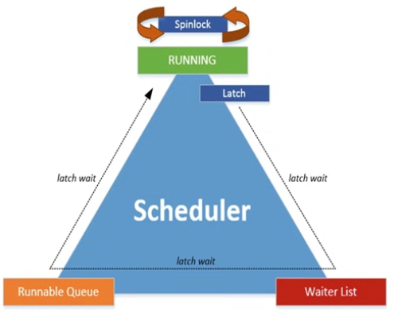

The main advantage of using spinlocks instead of latches to synchronize thread access is that spinlocks are even “lighter” synchronization objects than latches. Spinlocks never move away from the processer, they consume processor time, even when they are waiting. To avoid spinlocks consuming too much processor time, every x time around the spinlock will stop spinning and sleep. The interval of the spinlock sleep is calculated by an internal algorithm. On very busy systems, where many spinlocks are used, it is possible to encounter a phenomenon called spinlock contention.

Thankfully, just like latches, there is a spinlock DMV inside SQL Server that tracks the specific spinlock classes (325 in SQL Server
2017), the amount of time a spinlock had to wait before it could get acquired, and the total number of spins that occurred for that spinlock class. We can access this information by querying the [sys.dm_os_spinlock_stats] DMV like the query here:

```sql
SELECT ∗
FROM sys.dm_os_spinlock_stats
ORDER BY spins DESC;
```

If you notice very high CPU usage and cannot directly correlate the high CPU usage with queries or specific wait types, but the amount of backoffs for a specific spinlock class is very high and increasing quickly, you might have a case of spinlock contention occurring.

Another great tool to diagnose spinlock contention is Extended Events. By using Extended Events you can trace various spinlock-related events, like spinlock backoffs there is a free Microsoft whitepaper available on spinlock contention that can give you a few pointers for what to do when dealing with spinlock contention. You can get the whitepaper at 

  www.microsoft.com/en-us/download/details.aspx?id=26666 

