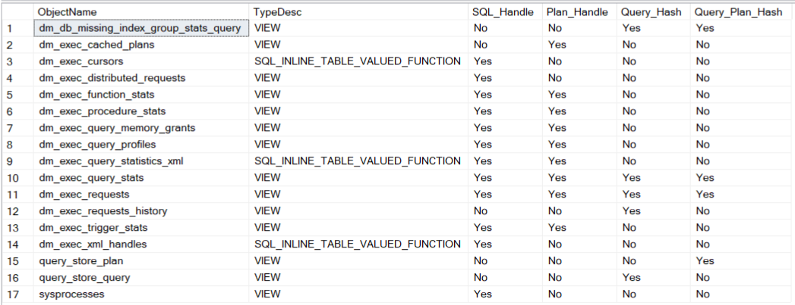
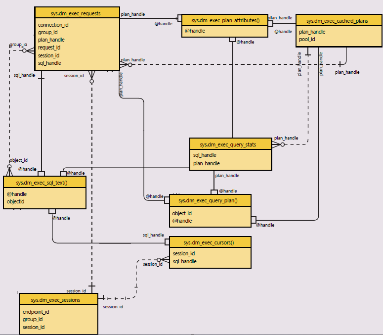
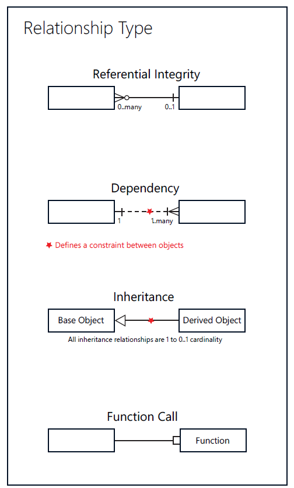

# Handles and Hashes

<style>
r { color: red }
o { color: Orange }
g { color: Green }
lg { color: lightgreen }
b { color: Blue }
lb { color: lightblue }
</style>

---

- Index
  - [Intro](#Intro)
  - [Reference](#Reference)
  - [CHAPTER I](#CHAPTER#I)
    - [History](#History)
    - [Table of SQL Versions and Hashes and Handles](#Table#of#SQL#Versions#and#Hashes#and#Handles)
    - [DMVs and DMFs](#DMVs#and#DMFs)
    - [DMVs and Handles/Hashes](#DMVs#and#Handles/Hashes)
  
  - [DMFs](#DMFs)
  - [Handles and Hashes columns per DMVs and DMFs](Handles#and#Hashes#columns#per#DMVs#and#DMFs)
  - [Difference between Handles and Hashes](Difference#between#Handles#and#Hashes)

---

- Intro

    As a Database Administrator (DBA) in SQL Server performance tuning, you have to go through some key concepts that are essential for monitoring and optimizing SQL Server queries, some of them are: Query Hash, Query Plan Hash, SQL Handle, and Plan Handle. These components are crucial for diagnosing performance issues, tracking query execution, and managing query plans effectively.

    In these set of articles we are going develop the concep and more about this components.

- Reference

| Ref.     | Description  | 
| -------- | --------     |
| DMV      | Dynamic Management View      |
| DMF      | Dynamic Management Function  |

## CHAPTER I

- History

  When discussing about SQL Server performance and plan management, undesrtanding the concepts (Handles and Hashes) along with their associated DMVs (Dynamic Management Views) and DMFs (Dynamic Management Funcitons) help databse administrators analyze and manage query execution plans, which are critical for maintaining optimal SQL Server performance.

  * The SQL Handle and Plan Handle 
  Are concepts that have been present since SQL Server 2000 with the introduction of query execution and plan caching. It has been an essential part of SQL Server's plan cache architecture, enabling the server to manage and reuse query plans effectively.

  * The Query Hash and Query Plan Hash 
  Were introduced in SQL Server 2008 as part of the enhancements to the query execution statistics and plan caching mechanisms. This was a significant step forward in performance troubleshooting as it allowed DBAs to group and analyze similar queries and plans more efficiently.

- Table of SQL Versions and Hashes and Handles

| SQL 2000 | SQL 2005  | SQL 2008 | SQL 2012 and +|
| -------- | --------  | -------- | --------      |
|First version of SQL Handle and Plan Handle<br>SQL Server started to cache execution plans<br>and reuse them|Expanded the plan cache with additional DMVs like<br>sys.dm_exec_query_stats and sys.dm_exec_requests<br>providing better visibility.|Introduced Query Hash and Query Plan Hash,<br>greatly improving the ability to group and<br>analyze similar queries.|These concepts have been refined, with<br>additional improvements in plan management<br>visibility into the plan cache advanced features like the Query Store (SQL  2016).|

- DMVs and DMFs

  Before SQL Server 2008, determining the cumulative cost of queries running on a server was challenging. The only reliable method involved capturing a Profiler trace during a representative time period. While trace-based query cost analysis is effective, it has significant drawbacks.

  In SQL Server 2008, the SQL Server database engine has a powerful new feature that generates an identifier for each query. The identifier is independent of any inline parameter values. This identifier – sometimes called a “query fingerprint” – enables a fairly robust method of identifying the queries on your server based on DMVs/DMFs. To fully appreciate query fingerprints’, you first must understand the DMVs and DMFs that were introduce in SQL 2005.

  To be up to date you can use a copuple of method that I am going to describe belog, any of them are perfect and each have advantages and disadvantages.

  - Using Microsoft page
    https://learn.microsoft.com/en-us/sql/relational-databases/system-dynamic-management-views/system-dynamic-management-views?view=sql-server-ver16

    On this page you can find the DMVs and DMFs split into categories like AlwaysOn, Change Data Capture, Database Mirroring, Extended Events, Index, I/O, etc

  - Microsoft SQL Server System Views Map
    On the following link you can download the Microsoft SQL Server 2012 System Views Map. You can get this in two format .pdf or .xps

    https://www.microsoft.com/en-us/download/details.aspx?id=39083

    Disadvantage, It's an old version and Microsoft didn't realease a new version of this from 2013.

  - Using T-SQL
    The below query show many of the DMVs and DMFs that use one or more of the fields that we are interest on, could be 'sql_handle', 'plan_handle', 'query_hash', 'query_plan_hash'

    ```sql
    SELECT 
        ObjectName
        , TypeDesc
        , CASE WHEN [sql_handle]  IS NULL THEN 'No' ELSE 'Yes' END AS [SQL_Handle]
        , CASE WHEN [plan_handle] IS NULL THEN 'No' ELSE 'Yes' END AS [Plan_Handle]
        , CASE WHEN [query_hash]  IS NULL THEN 'No' ELSE 'Yes' END AS [Query_Hash]
        , CASE WHEN [query_plan_hash] IS NULL THEN 'No' ELSE 'Yes' END AS [Query_Plan_Hash]
    FROM
    (
        SELECT 
            so.name		 AS ObjectName, 
            so.type_desc AS TypeDesc  , 
            sc.name      AS ColumnName
        FROM sys.system_columns AS sc
        JOIN sys.system_objects AS so 
        ON   so.object_id = sc.object_id
        JOIN sys.types AS t
        ON   t.system_type_id = sc.system_type_id
        AND  t.user_type_id   = sc.user_type_id
        WHERE sc.name IN ('sql_handle', 'plan_handle', 'query_hash', 'query_plan_hash')
    ) AS SourceTable
    PIVOT
    (
        MAX(ColumnName)
        FOR ColumnName IN ([SQL_Handle], [Plan_Handle], [Query_Hash], [Query_Plan_Hash])
    ) AS PivotTable
    ORDER BY ObjectName;
    ```

    The result (for a SQL 2022):
  
    

    Disadvantage, as you have already notices on the result you can't see functions like [sys].[dm_exec_plan_attributes()], [sys].[dm_exec_sql_text()], etc. That happens because functions like [sys].[dm_exec_sql_text()] doesn't have any of the columns that we are looking for ('sql_handle', 'plan_handle', 'query_hash', 'query_plan_hash'). This function receive the sql_handle or plan_handle as a parameter value and return dbid, objectid, number, encryted and text. 

    * [sys].[dm_exec_requests]
    * [sys].[dm_exec_sql_text()]
    * [sys].[dm_exec_plan_attributes()]
    * [sys].[dm_exec_query_plan()]
    * [sys].[dm_exec_cached_plans]
    * [sys].[dm_exec_query_stats]
    * [sys].[dm_exec_sessions]

        

- DMVs and Handles/Hashes
  * [sys].[dm_exec_requests]
    
    Description
    Returns information about each request that is executing in SQL Server. 
    
    Columns
    |Column Name | Type         | DefinitionDescription                                                                                 |
    |------------|--------------| ----------------------------------------------------------------------------------------------------- |
    |sql_handle	 |varbinary(64)	| Is a token that uniquely identifies the batch or stored procedure that the query is part of. Nullable.|
    |plan_handle |varbinary(64)	| Is a token that uniquely identifies a query execution plan for a batch that is currently executing. + Nullable.|
    |query_hash  |binary(8)	    | Binary hash value calculated on the query and used to identify queries with similar logic. You can + use the query hash to determine the aggregate resource usage for queries that differ only by literal values. |
    |query_plan_hash |binary(8)	| Binary hash value calculated on the query execution plan and used to identify similar query execution + plans. You can use query plan hash to find the cumulative cost of queries with similar execution plans. |

  * [sys].[dm_exec_cached_plans]
    Description
    Returns a row for each query plan that is cached by SQL Server for faster query execution. You can use this dynamic management view to find cached query plans, cached query text, the amount of memory taken by cached plans, and the reuse count of the cached plans.

    Columns
    |Column Name | Type         | DefinitionDescription                                                                                 |
    |------------|--------------| ----------------------------------------------------------------------------------------------------- |
    |plan_handle |varbinary(64)	| Identifier for the in-memory plan. This identifier is transient and remains constant only while the + plan remains in the cache. This value may be used with the following dynamic management functions: sys.dm_exec_sql_text, + 
    sys.dm_exec_query_plan, and sys.dm_exec_plan_attributes |

  * [sys].[dm_exec_query_stats]
    
    Description
    Returns aggregate performance statistics for cached query plans in SQL Server. The view contains one row per query statement within the cached plan, and the lifetime of the rows are tied to the plan itself. When a plan is removed from the cache, the corresponding rows are eliminated from this view.

    | Column name | data Type      | Description       |
    | ----------- | ------------   | ----------------  |
    | sql_handle  | varbinary(64)  | Is a token that uniquely identifies the batch or stored procedure that the query is part of.
                                sql_handle, together with statement_start_offset and statement_end_offset, can be used to retrieve the SQL text of the query by calling the sys.dm_exec_sql_text dynamic management function.|
    |plan_handle  |	varbinary(64) |	Is a token that uniquely identifies a query execution plan for a batch that has executed and its
                                   plan  resides in the plan cache, or is currently executing. This value can be passed to the sys.dm_exec_query_plan dynamic management function to obtain the query plan.|
                                   Will always be 0x000 when a natively compiled stored procedure queries a memory-optimized table.
    |query_hash	  | binary(8)	  | Binary hash value calculated on the query and used to identify queries with similar logic. You can use
                                    the query hash to determine the aggregate resource usage for queries that differ only by literal values.|
    |query_plan_hash| binary(8)	  | Binary hash value calculated on the query execution plan and used to identify similar query execution
                                    plans. You can use query plan hash to find the cumulative cost of queries with similar execution plans. Will always be 0x000 when a natively compiled stored procedure queries a memory-optimized table.|


- DMFs
  * [sys].[dm_exec_sql_text()]
    
    Description
    Returns the text of the SQL batch that is identified by the specified sql_handle. This table-valued function replaces the system function fn_get_sql.

    Syntax
    sys.dm_exec_sql_text(sql_handle | plan_handle)

    Arguments
    sql_handle
    Is a token that uniquely identifies a batch that has executed or is currently executing. sql_handle is varbinary(64).
    The sql_handle can be obtained from the following dynamic management objects: sys.dm_exec_query_stats, sys.dm_exec_requests,
    sys.dm_exec_cursors, sys.dm_exec_xml_handles, sys.dm_exec_query_memory_grants, sys.dm_exec_connections

    plan_handle
    Is a token that uniquely identifies a query execution plan for a batch that has executed and its plan resides in the plan cache, or is currently executing. plan_handle is varbinary(64).
    The plan_handle can be obtained from the following dynamic management objects: sys.dm_exec_cached_plans, sys.dm_exec_query_stats, 
    sys.dm_exec_requests, sys.dm_exec_procedure_stats, sys.dm_exec_trigger_stats.

    Columns
    |Column Name | Type         | DefinitionDescription                                |
    |------------|--------------| ---------------------------------------------------- |
    |text	     |nvarchar(max)	| Text of the SQL query. Is NULL for encrypted objects.|

    Notes
    For ad hoc queries, the SQL handles are hash values based on the SQL text being submitted to the server, and can originate from any database.
    For database objects such as stored procedures, triggers or functions, the SQL handles are derived from the database ID, object ID, and object number.
    Plan handle is a hash value derived from the compiled plan of the entire batch.

  * [sys].[dm_exec_plan_attributes()]

    Description
    Returns one row per plan attribute for the plan specified by the plan handle. You can use this table-valued function to get details about a particular plan, such as the cache key values or the number of current simultaneous executions of the plan.

    Syntax
    sys.dm_exec_plan_attributes ( plan_handle )

    Arguments
    plan_handle
    Uniquely identifies a query plan for a batch that has executed and whose plan resides in the plan cache. The plan handle can be obtained from the sys.dm_exec_cached_plans dynamic management view.

    Columns
    |Column name |	Data type	| Description                                                |
    |------------|--------------|-------------------------------------------------------     |
    |attribute   |varchar(128)  | Name of the attribute associated with this plan. (#1)      |
    |value	     |sql_variant	| Value of the attribute that is associated with this plan.  | 
    |is_cache_key|bit	        | Indicates whether the attribute is used as part of the cache lookup key for the plan. |

    (#1)
    The possible attributes, their data types, and their descriptions can by the:
    sql_handle varbinary(64)	The SQL handle for the batch.

    Notes
    Copies of the same compiled plan might differ only by the value in the set_options column.
    For more information check the corresponding page.

  * [sys].[dm_exec_query_plan()]
    
    Description
    Returns the Showplan in XML format for the batch specified by the plan handle. The plan specified by the plan handle can either be cached or currently executing.

    Syntax
    sys.dm_exec_query_plan(plan_handle)

    Arguments
    plan_handle
    Is a token that uniquely identifies a query execution plan for a batch that has executed and its plan resides in the plan cache, or is currently executing. The plan_handle can be obtained from the following dynamic management objects: sys.dm_exec_cached_plans, sys.dm_exec_query_stats, sys.dm_exec_requests, sys.dm_exec_procedure_stats, sys.dm_exec_trigger_stats.

    Columns
    |Column name |	Data type	| Description                                                |
    |------------|--------------|-------------------------------------------------------     |
    |query_plan  |XML           | Contains the compile-time Showplan representation of the query execution plan that is specified with + plan_handle. The Showplan is in XML format. One plan is generated for each batch that contains, for example ad hoc Transact-SQL + statements, stored procedure calls, and user-defined function calls. Column is nullable.|

    Notes
    Under the following conditions, no Showplan output is returned in the query_plan column of the returned table for sys.dm_exec_query_plan:

    1. If the query plan that is specified by using plan_handle has been evicted from the plan cache, the query_plan column of the returned table is null. For example, this condition may occur if there is a time delay between when the plan handle was captured and when it was used with sys.dm_exec_query_plan.

    2. Some Transact-SQL statements are not cached, such as bulk operation statements or statements containing string literals larger than 8 KB in size. XML Showplans for such statements cannot be retrieved by using sys.dm_exec_query_plan unless the batch is currently executing because they do not exist in the cache.

    3. If a Transact-SQL batch or stored procedure contains a call to a user-defined function or a call to dynamic SQL, for example using EXEC (string), the compiled XML Showplan for the user-defined function is not included in the table returned by sys.dm_exec_query_plan for the batch or stored procedure. Instead, you must make a separate call to sys.dm_exec_query_plan for the plan handle that corresponds to the user-defined function.

    4. When an ad hoc query uses simple or forced parameterization, the query_plan column will contain only the statement text and not the actual query plan. To return the query plan, call sys.dm_exec_query_plan for the plan handle of the prepared parameterized query. You can determine whether the query was parameterized by referencing the sql column of the sys.syscacheobjects view or the text column of the sys.dm_exec_sql_text dynamic management view.

- Handles and Hashes columns per DMVs and DMFs

    | DMV name                          | DMF Name   	                    | Column contain                 |Arguments    |
    | ------------                      | --------------                    |----------------                | ----------- |
    | [sys].[dm_exec_requests]          | X                                 | sql_handle / plan_handle / +
    query_hash / query_plan_hash |
    | X                                 | [sys].[dm_exec_sql_text()]        | text                           | sql_handle / plan_handle |
    | X                                 | [sys].[dm_exec_plan_attributes()] | attribute                      | plan_handle              |
    | X                                 | [sys].[dm_exec_query_plan()]      | query_plan                     | plan_handle              |
    | [sys].[dm_exec_cached_plans]      | X                                 | plan_handle                    |
    | [sys].[dm_exec_query_stats]       | X                                 | sql_handle / plan_handle / + 
    query_hash / query_plan_hash |


- Difference between Handles and Hashes

    | Columna Name        | Difference   	                                                             |
    | ------------        | ------------                                                                 |
    | SQL Handle          | Hash of the SQL Text containing all of your formatting (casing, spaces, etc).| 
    | Plan Handle         | Hash of the execution plan build from a SQL                                  |

    In simple words: sql_handle is the source code (text in hash format), and the plan_handle is the compiled object code (execution plan in hash format).


    | Query Hash          |                                   | 
    | Query Plan Hash     |                                   |


    https://blog.sqlauthority.com/2020/03/22/what-is-difference-between-sql-handle-and-plan-handle-interview-question-of-the-week-269/
    https://straightforwardsql.com/posts/query-hash-and-query-plan-hash-mapping/
https://blog.sqlgrease.com/query_hash-query_plan_hash-useful/#:~:text=A%20query_hash%20is%20a%20computed,of%20them%20within%20the%20plan.
https://blog.sqlgrease.com/query_hash-query_plan_hash-useful/
https://rauofthameem.wordpress.com/2012/09/14/sql-query-that-gets-sql-statement-from-sqlhandle/


---

APEX A

- Page References
  - FingerPrints
    The below page talk about how query_hash and query_plan_hash can help to identify the resoruce utilization
    https://learn.microsoft.com/en-us/archive/blogs/bartd/query-fingerprints-and-plan-fingerprints-the-best-sql-2008-feature-that-youve-never-heard-of

  - DMVs
    https://learn.microsoft.com/en-us/sql/relational-databases/system-dynamic-management-views/sys-dm-exec-requests-transact-sql?view=sql-server-ver16

    Me falto poner una aca

    https://learn.microsoft.com/en-us/sql/relational-databases/system-dynamic-management-views/sys-dm-exec-query-stats-transact-sql?view=sql-server-ver16

  - DMFs 
    https://learn.microsoft.com/en-us/sql/relational-databases/system-dynamic-management-views/sys-dm-exec-sql-text-transact-sql?view=sql-server-ver16

    Me falto poner una aca
    
    https://learn.microsoft.com/en-us/sql/relational-databases/system-dynamic-management-views/sys-dm-exec-query-plan-transact-sql?view=azuresqldb-current

  - General
    https://blog.sqlauthority.com/2020/03/22/what-is-difference-between-sql-handle-and-plan-handle-interview-question-of-the-week-269/
    https://straightforwardsql.com/posts/query-hash-and-query-plan-hash-mapping/    
    
- Books
  - SQL Server 2017 Query Performance Tuning by Grant Fritchey


----

- Personal Notes
  - Buscar el historial de la vista [sys].[dm_exec_query_stats]
  - Buscar las limitaciones de la vista [sys].[dm_exec_query_stats]
  - Buscar las relaciones de la vista [sys].[dm_exec_query_stats] 
  - what does "inline literal values" means?
